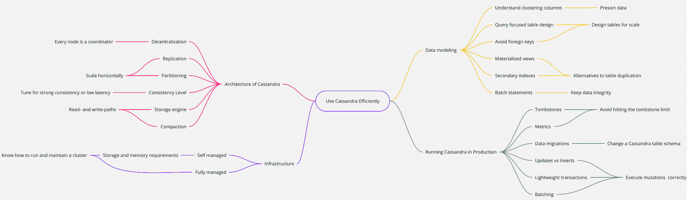
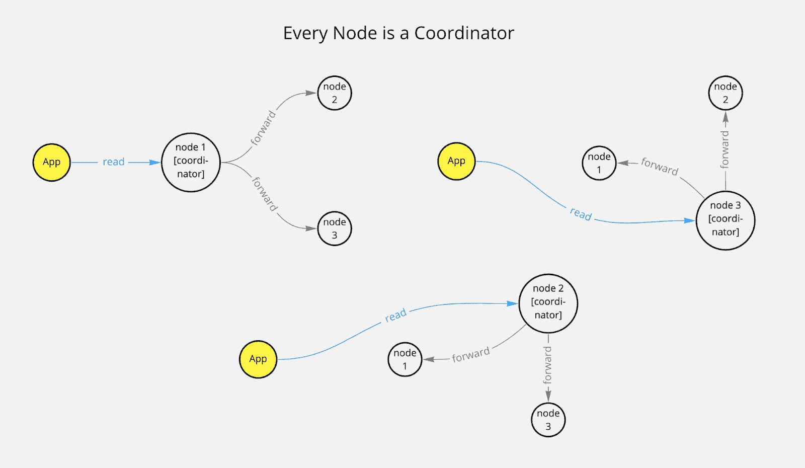
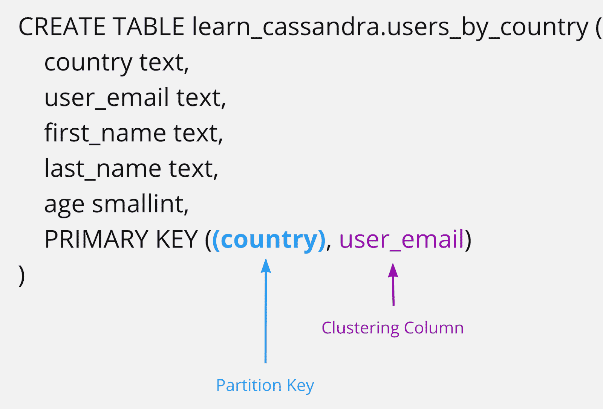
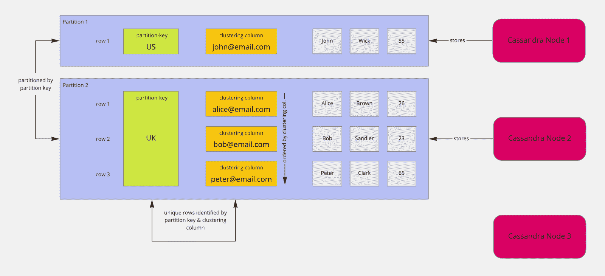
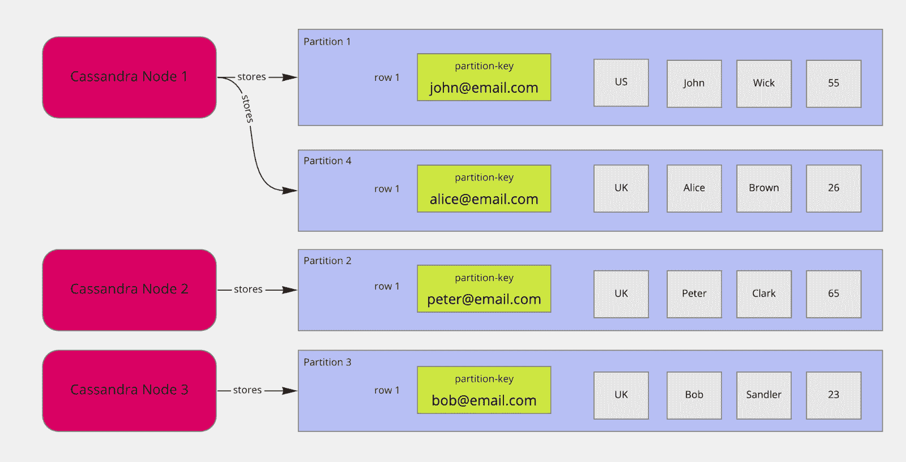
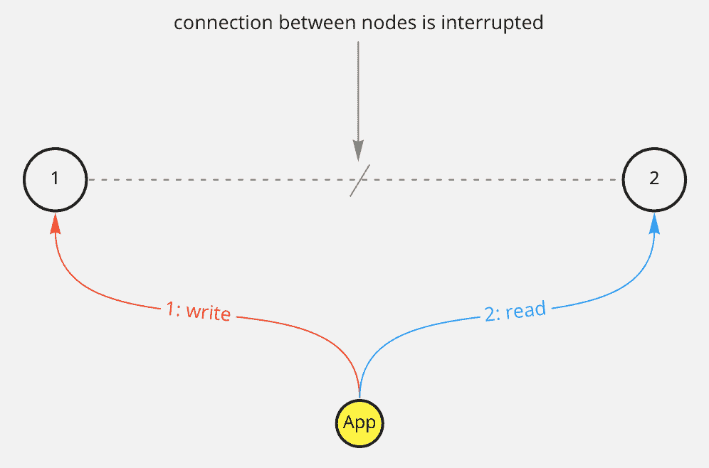
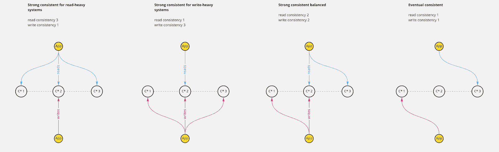

# Apache Cassandra 初学者教程

> 原文：<https://www.freecodecamp.org/news/the-apache-cassandra-beginner-tutorial/>

如今有很多数据存储选择。您必须在托管或非托管、关系或 NoSQL、写或读优化、专有或开源之间做出选择，而且这还不止于此。

一旦你开始搜索，你将在数据库营销的宇宙中结束。所有的供应商都会告诉你为什么他们的数据库如此神奇。

不幸的是，很难确定何时不使用特定的数据库，因为这不是一个有吸引力的卖点。

如果你知道该问什么问题，你将最终理解一个给定系统的所有本质属性。最终，您的选择将取决于您的专业知识和需求。

在本教程中，我将向您介绍 Apache Cassandra，这是一个分布式、可水平伸缩的开源数据库。或者像 Cassandra 用户喜欢描述 Cassandra 的那样:“它是一个把你放在驾驶座上的数据库。”

我将分享基本的问题并提供文档参考。我还将根据我在工作中大规模运行 Cassandra 的经验提供见解，并尽可能提供可执行的示例。

以下是您将要学习的所有内容的概述:



在这个过程中，您将学会问一些基本问题，这些问题将帮助您选择一个适合您需求的数据库。您还将了解其他流行的数据库，如 Spanner、蟑螂或 FaunaDB，以及它们如何服务于不同的用例。

## 目录

*   [如何建立 Cassandra 集群](#how-to-set-up-a-cassandra-cluster)
*   [卡珊德拉建筑](#cassandra-architecture)
    *   [权力下放](#decentralization)
    *   [每个节点都是一个协调者](#every-node-is-a-coordinator)
    *   [数据分区](#data-partitioning)
    *   [复制](#replication)
    *   [一致性水平](#consistency-level)
    *   [通过设置强一致性应用程序来调整一致性](#tune-for-consistency-by-setting-up-a-strong-consistency-application)
    *   [通过使用最终一致性来调整性能](#tune-for-performance-by-using-eventual-consistency)
    *   [了解压实](#understanding-compaction)
    *   [Cassandra 节点上的预分类数据](#presorting-data-on-cassandra-nodes)
*   [数据建模](#data-modeling)
    *   [使用`BATCH`语句保持数据同步](#keep-data-in-sync-using-batch-statements)
    *   [在 Cassandra 中使用外键而不是复制数据](#use-foreign-keys-instead-of-duplicating-data-in-cassandra)
    *   [Cassandra 中的索引](#indexes-in-cassandra)
    *   [物化视图](#materialized-views)
*   [运行集群](#running-a-cluster)
    *   [完全托管的卡珊德拉](#fully-managed-cassandra)
    *   [自我管理的卡珊德拉](#self-managed-cassandra)
*   [其他知识](#other-learnings)
    *   [数据迁移](#data-migrations)
    *   [墓碑](#tombstones)
    *   [`UPDATE` s 只是`INSERT` s，反之亦然](#updates-are-just-inserts-and-vice-versa)
    *   [轻量级交易](#lightweight-transactions)
*   [结论](#conclusion)
*   [参考文献](#references)

## 如何设置 Cassandra 集群

要执行本教程的示例，您需要一个正在运行的 Cassandra 集群。您可以使用 [Docker](https://docs.docker.com/get-docker/) 快速启动并运行它。

> **所需的 Docker 设置**
> 
> 您的设备至少应有 8GB 的内存和 8GB 的可用磁盘空间。您的 Docker 设置应该更新为能够使用至少 6GB 的内存，或者 8GB 更好。
> 
> 要应用这些建议，打开你的 Docker 首选项，转到资源，提高你的记忆阈值。

Cassandra 是为规模而构建的，一些功能只在多节点 Cassandra 集群上工作，所以让我们在本地启动一个。

对于 Linux 和 Mac，运行以下命令:

```
# Run the first node and keep it in background up and running
docker run --name cassandra-1 -p 9042:9042 -d cassandra:3.7
INSTANCE1=$(docker inspect --format="{{ .NetworkSettings.IPAddress }}" cassandra-1)
echo "Instance 1: ${INSTANCE1}"

# Run the second node
docker run --name cassandra-2 -p 9043:9042 -d -e CASSANDRA_SEEDS=$INSTANCE1 cassandra:3.7
INSTANCE2=$(docker inspect --format="{{ .NetworkSettings.IPAddress }}" cassandra-2)
echo "Instance 2: ${INSTANCE2}"

echo "Wait 60s until the second node joins the cluster"
sleep 60

# Run the third node
docker run --name cassandra-3 -p 9044:9042 -d -e CASSANDRA_SEEDS=$INSTANCE1,$INSTANCE2 cassandra:3.7
INSTANCE3=$(docker inspect --format="{{ .NetworkSettings.IPAddress }}" cassandra-3)
```

对于 Windows，在 PowerShell 中运行以下命令:

```
# Run the first node and keep it in background up and running
docker run --name cassandra-1 -p 9042:9042 -d cassandra:3.7
$INSTANCE1=$(docker inspect --format="{{ .NetworkSettings.IPAddress }}" cassandra-1)
echo "Instance 1: ${INSTANCE1}"

# Run the second node
docker run --name cassandra-2 -p 9043:9042 -d -e CASSANDRA_SEEDS=$INSTANCE1 cassandra:3.7
$INSTANCE2=$(docker inspect --format="{{ .NetworkSettings.IPAddress }}" cassandra-2)
echo "Instance 2: ${INSTANCE2}"

echo "Wait 60s until the second node joins the cluster"
sleep 60

# Run the third node
docker run --name cassandra-3 -p 9044:9042 -d -e CASSANDRA_SEEDS=$INSTANCE1,$INSTANCE2 cassandra:3.7
$INSTANCE3=$(docker inspect --format="{{ .NetworkSettings.IPAddress }}" cassandra-3)
```

启动过程可能需要几分钟。

您可以通过在节点上执行一个名为`nodetool` 的 Cassandra 实用工具，经由`docker exec` 来验证是否一切都已完成并准备就绪:

```
$ docker exec cassandra-3 nodetool status

Datacenter: datacenter1
=======================
Status=Up/Down
|/ State=Normal/Leaving/Joining/Moving
--  Address     Load       Tokens       Owns (effective)  Host ID                               Rack
UN  172.17.0.3  112.69 KiB  256          68.7%             bb5ef231-0dd2-4762-a447-806a45f710ac  rack1
UN  172.17.0.2  107.96 KiB  256          68.3%             d7392374-8daa-4292-b724-cb790b0ee6ad  rack1
UN  172.17.0.4  93.93 KiB  256          63.0%             386d094f-5483-4945-a1a7-2bb3975d6167  rack1
```

UN 是指 **U** p 和**N**normal。在这里，所有 3 个节点都运行正常。

在本教程中，我们将向 Cassandra 发送大量的查询。我建议启动一个新的 shell，并使用`cqlsh`连接到一个节点。下面是如何在 Docker 中启动一个`cqlsh` shell:

```
$ docker exec -it cassandra-1 cqlsh

Connected to Test Cluster at 127.0.0.1:9042.
[cqlsh 5.0.1 | Cassandra 3.7 | CQL spec 3.4.2 | Native protocol v4]
Use HELP for help.
cqlsh>
```

要执行第一个查询:

```
cqlsh> DESCRIBE keyspaces;

system_traces  system_schema  system_auth  system  system_distributed
```

响应显示了所有现有的键空间。键空间对表进行分组，类似于传统关系数据库系统中的数据库。在其他系统中，某些项目的组也称为名称空间。

在开始创建表和插入数据之前，首先在本地数据中心创建一个键空间，它应该复制数据 3 次:

```
cqlsh> CREATE KEYSPACE learn_cassandra
  WITH REPLICATION = { 
   'class' : 'NetworkTopologyStrategy',
   'datacenter1' : 3 
  };
```

使用`NetworkTopologyStrategy`创建了一个复制因子为 3 的密钥空间。该策略定义了如何在不同的数据中心复制数据。对于所有用户创建的键空间，这是推荐的策略。

> **为什么要从 3 个节点开始？**
> 
> 建议至少 3 个节点以上。一个原因是，万一你需要强一致性，你需要从至少 2 个节点得到确认的数据。或者，如果一个节点关闭，您的群集仍然可用，因为剩余的两个节点仍在运行。
> 
> 你还不需要完全理解这一点。通读完本教程的其余部分，事情应该会更清楚。

现在，所有节点都正常运行。您有一个 3 节点 Cassandra 设置，在端口 9042、9043 和 9044 上监听客户端请求。对于小型集群来说，这是一个现实的设置。在生产中，实例将在不同的机器上运行以最大化性能。

在开始创建表、读取和写入数据之前，理解为可伸缩性设计表的基础知识是有帮助的。

在本教程中，你将为一个待办事项列表应用程序创建具有不同设置的表格。如果你想直接动手，可以直接跳到下一个`cqlsh`例子。

## 卡桑德拉建筑

Cassandra 是一个分散的多节点数据库，在物理上跨越不同的位置，并使用复制和分区来无限扩展读写。

### 分散

Cassandra 是去中心化的，因为没有节点优于其他节点，每个节点根据需要扮演不同的角色，没有任何中央控制器。我们将在这一节的稍后部分讨论分权的例子。

Cassandra 的分散属性使其能够在一个节点不可用或添加新节点的情况下轻松处理情况。

### 每个节点都是一个协调器

数据被复制到不同的节点。如果请求某些数据，可以从任何节点处理请求。

这个初始请求接收者成为该请求的协调者节点。如果需要检查其他节点以确保一致性，则协调器从副本节点请求所需的数据。

协调器可以使用所谓的[一致散列算法](https://cassandra.apache.org/doc/latest/architecture/dynamo.html?highlight=consistency#dataset-partitioning-consistent-hashing)来计算哪个节点包含数据。



Every node can be a coordinator

协调器负责许多事情，例如请求批处理、修复数据或重试读写。

### 数据分区

> “[分区]是一种在多个数据库中拆分和存储单个逻辑数据集的方法。通过将数据分布在多台机器上，一个数据库系统集群可以存储更大的数据集并处理额外的请求。
> 
> [如何切分](https://medium.com/@jeeyoungk/how-sharding-works-b4dec46b3f6)作者[金智英](https://medium.com/@jeeyoungk)

与许多其他数据库一样，您将 Cassandra 中的数据存储在预定义的模式中。您需要定义一个包含列和每列类型的表。

此外，您需要考虑表的主键。主键是必需的，它确保数据可由一列或多列唯一标识。

Cassandra 中主键的概念比 MySQL 等传统数据库中的更复杂。在 Cassandra 中，主键由两部分组成:

*   强制分区键和
*   一组可选的聚类列。

您将在数据建模一节中了解更多关于分区键和集群列的信息。

现在，让我们关注分区键及其对数据分区的影响。

请考虑下表:

```
Table Users | Legend: p - Partition-Key, c - Clustering Column

country (p) | user_email (c)  | first_name | last_name | age
----------------------------------------------------------------
US          | john@email.com  | John       | Wick      | 55  
UK          | peter@email.com | Peter      | Clark     | 65  
UK          | bob@email.com   | Bob        | Sandler   | 23 
UK          | alice@email.com | Alice      | Brown     | 26 
```

列`user_email` 和`country`一起构成了主键。

`country`列是分区键(p)。该表的`CREATE`-语句如下所示:

```
cqlsh> 
CREATE TABLE learn_cassandra.users_by_country (
    country text,
    user_email text,
    first_name text,
    last_name text,
    age smallint,
    PRIMARY KEY ((country), user_email)
);
```

第一组主键定义了分区键。主键的所有其他元素都是聚集列:



让我们用一些数据填充表格:

```
cqlsh> 
INSERT INTO learn_cassandra.users_by_country (country,user_email,first_name,last_name,age)
  VALUES('US', 'john@email.com', 'John','Wick',55);

INSERT INTO learn_cassandra.users_by_country (country,user_email,first_name,last_name,age)
  VALUES('UK', 'peter@email.com', 'Peter','Clark',65);

INSERT INTO learn_cassandra.users_by_country (country,user_email,first_name,last_name,age)
  VALUES('UK', 'bob@email.com', 'Bob','Sandler',23);

INSERT INTO learn_cassandra.users_by_country (country,user_email,first_name,last_name,age)
  VALUES('UK', 'alice@email.com', 'Alice','Brown',26);
```

如果你习惯于像学校或大学里教的那样设计传统的关系数据库表，你可能会感到惊讶。为什么要使用`country`作为主键的重要组成部分？

在理解了 Cassandra 中分区的基础知识之后，这个例子就有意义了。

分区是可伸缩性的基础，它基于分区键。在这个例子中，分区是基于`country`创建的。所有带有`country` `US`的行都放在一个分区中。国家为`UK`的所有其他行将存储在另一个分区中。

在分区的上下文中，单词 partition 和 shard 可以互换使用。



分区是根据分区键值创建和填充的。它们用于将数据分发到不同的节点。通过将数据分发到其他节点，您可以获得可伸缩性。您可以通过不同节点的分区键向不同节点读写数据。

在设计基于分区存储数据的应用程序时，数据的分布是需要理解的一个关键点。可能需要一段时间才能完全习惯这个概念，尤其是如果您已经习惯了关系数据库。

相反，应该考虑如何读写数据，以及应该如何进行分区以实现水平扩展。

> **水平缩放是什么意思？**
> 
> 水平扩展意味着您可以通过添加更多节点来提高吞吐量。如果您的数据分布在更多的服务器上，那么就有更多的 CPU、内存和网络容量可用。

你可能会问，那为什么主键里还要有`email`？

答案是主键定义了用来标识行的列。您需要将唯一标识行所需的所有列添加到主键中。仅使用国家不会唯一地标识行。

分区键对于在节点之间均匀分布数据至关重要，并且在读取数据时必不可少。先前定义的模式被设计为由`country` 查询，因为`country` 是分区键。

通过`country`选择行的查询表现良好:

```
cqlsh> 
  SELECT * FROM learn_cassandra.users_by_country WHERE country='US';
```

在您的`cqlsh` shell 中，默认情况下，您将只向一个 Cassandra 节点发送请求。这被称为一致性级别 1，它支持卓越的性能和可伸缩性。

如果您以不同的方式访问 Cassandra，默认的一致性级别可能不是 1。

> **一的一致性水平是什么意思？**
> 
> 一致性级别为 1 意味着只要求单个节点返回数据。使用这种方法，您将失去强大的一致性保证，而是体验最终的一致性。
> 
> 我们稍后将深入探讨一致性水平。

让我们创建另一个表。这一个具有仅由`user_email` 列定义的分区:

```
cqlsh> 
CREATE TABLE learn_cassandra.users_by_email (
    user_email text,
    country text,
    first_name text,
    last_name text,
    age smallint,
    PRIMARY KEY (user_email)
);
```

现在让我们用一些记录填充这个表:

```
cqlsh> 
INSERT INTO learn_cassandra.users_by_email (user_email, country,first_name,last_name,age)
  VALUES('john@email.com', 'US', 'John','Wick',55);

INSERT INTO learn_cassandra.users_by_email (user_email,country,first_name,last_name,age)
  VALUES('peter@email.com', 'UK', 'Peter','Clark',65); 

INSERT INTO learn_cassandra.users_by_email (user_email,country,first_name,last_name,age)
  VALUES('bob@email.com', 'UK', 'Bob','Sandler',23);

INSERT INTO learn_cassandra.users_by_email (user_email,country,first_name,last_name,age)
  VALUES('alice@email.com', 'UK', 'Alice','Brown',26);
```

这一次，每一行都被放在自己的分区中。



这本身并不坏。如果您想优化仅通过`email`获取数据，这是一个好主意:

```
cqlsh> 
  SELECT * FROM learn_cassandra.users_by_email WHERE user_email='alice@email.com';
```

如果您为`user_email`设置了一个分区键，并希望在`age`之前获取所有用户，那么您需要从所有分区获取数据，因为分区是由`user_email`创建的。

与所有节点通信的成本很高，并且会在大型集群上导致性能问题。

卡珊德拉试图避免有害的询问。如果您想按非分区键的列进行筛选，您需要明确地告诉 Cassandra 您想按非分区键的列进行筛选:

```
cqlsh> 
SELECT * FROM learn_cassandra.users_by_email WHERE age=26 ALLOW FILTERING;
```

如果没有`ALLOW FILTERING`，将不会执行查询，以防止意外运行昂贵的查询对集群造成损害。执行不带条件的查询(比如不带`WHERE`子句)或带不使用分区键的条件的查询代价很高，应该避免以防止性能瓶颈。

但是，如何以可伸缩的方式从表中获取所有的行呢？

如果可以的话，用类似`country`的值进行分区。如果您知道所有的国家，那么您可以遍历所有可用的国家，为每个国家发送一个查询，并在您的应用程序中收集结果。

就可伸缩性而言，只选择所有行更糟糕，因为当您使用由`user_email`分区的表时，所有数据都是在单个协调器的一个请求中收集的。

只要没有性能问题，这是可以的。

相比之下，由`country`发送多个请求将工作分配给不同的协调器节点，这样伸缩性会好得多。

如果您仍然需要访问所有数据，Spark 和 Cassandra 之间有一个出色的[集成，允许对大规模数据集进行高效读写。Cassandra 的 Spark 连接器通过分区键对数据进行分组，可以非常高效地执行查询。](https://github.com/datastax/spark-cassandra-connector)

### 分身术

单独使用分区的可伸缩性是有限的。

考虑对单个分区的大量写请求。所有请求都将发送到一个节点，但有技术限制，如 CPU、内存和带宽。此外，如果此节点不可用，您希望处理读取和写入请求。

这就是复制概念的由来。通过将数据复制到不同的节点，即所谓的副本，您可以从其他节点同时提供更多的数据，以改善延迟和吞吐量。它还使您的群集能够在副本不可用的情况下执行读写操作。

在 Cassandra 中，您需要为每个密钥空间定义一个复制因子。在我们示例的开始，您为我们的默认数据中心创建了一个复制因子为 3 的密钥空间:

```
cqlsh> CREATE KEYSPACE learn_cassandra
  WITH REPLICATION = { 
   'class' : 'NetworkTopologyStrategy',
   'datacenter1' : 3 
  };
```

复制因子为 1 意味着集群中的每一行只有一个副本。如果包含该行的节点关闭，则无法检索该行。

复制因子为 2 意味着每行有两个副本，其中每个副本位于不同的节点上。所有的复制品都同样重要；没有主副本或主副本。

一般来说，复制系数不应超过群集中的节点数。但是，您可以增加复制因子，然后在以后添加所需的节点数。

通常，对于生产用例，建议使用 3 的复制因子。它确保您的数据不太可能丢失或变得不可访问，因为有三个副本可用。此外，如果副本之间的数据在任一时间点都不一致，您可以询问多数副本持有什么信息状态。

在本地集群设置中，多数意味着三分之二的副本。这允许我们使用一些强大的查询选项，您将在下一节看到这些选项。

### 一致性水平

现在您已经了解了分区和复制，您可以考虑一致性级别了。Cassandra 有一个真正出色的特性，叫做可调一致性。

您可以定义读写查询的一致性级别。您可以查看 [Cassandra 文档](https://docs.datastax.com/en/cassandra-oss/3.x/cassandra/dml/dmlConfigConsistency.html)中所有可用的设置。

让我们把重点放在最流行的设置上，并尝试理解何时选择每个一致性级别。

假设您定义了 3 个副本。

你需要回答的第一个问题是，你需要强一致性吗？

> **强一致性是什么意思？**
> 
> 与最终一致性相反，强一致性意味着在任何时间、任何位置只能观察到数据的一种状态。
> 
> 例如，当一致性至关重要时，比如在银行领域，你希望确保一切都是正确的。您宁愿接受可用性的降低和延迟的增加来确保正确性。

这一切都归结于[上限定理](https://en.wikipedia.org/wiki/CAP_theorem)。在集群节点之间出现连接问题时，您无法同时保持可用性和一致性。

让我们通过下面的例子来思考:

您希望向表中写入单个值。数据在两个节点中复制，节点之间的连接中断。首先，写请求被发送到节点 1。然后，从节点 2 读取数据。

你如何处理这种情况？



1.  您是否应该禁止向所有节点写入数据以确保一致性？这意味着为了确保一致性和正确性，将牺牲可用性。
2.  接受对节点 1 的写入，并保持从两个节点进行读取。这将保持系统可用，但根据您从哪个节点读取，答案将会不同，这意味着牺牲一致性而不是可用性。

您可以简化问题，为您的应用程序做出关键决策:您想要一致性还是可用性？

另一个因素是延迟。通过与更多节点通信来确保一致性，您需要等待更长时间来接收所有节点的响应。

### 通过设置强一致性应用程序来调整一致性

有一个非常重要的公式，如果为真则保证强一致性:

```
[read-consistency-level] + [write-consistency-level] > [replication-factor]
```

> **一致性水平是什么意思？**
> 
> 一致性水平是指有多少节点需要确认一个读或一个写查询。

如果您想保持高度的一致性，您可以根据自己的喜好调整读写一致性级别。或者你甚至为了更好的性能而放弃强一致性，这也被称为最终一致性:



对于读负载较重的系统，建议保持较低的读一致性，因为读比写更频繁。假设您的复制因子为 3。该公式如下所示:

```
1 + [write-consistency-level] > 3
```

因此，写入一致性必须设置为 3，以获得高度一致的系统。

对于大量写入的系统，您也可以这样做。将写一致性级别设置为 1，将读一致性级别设置为 3。

您可以检查每个节点进行读取，以确保所有节点都收到了最近更新的状态；或者，对于写入，您可以确保所有节点都已将更新写入了本地存储。两者都将确保用于读取和写入的数据是正确的。

这个决定需要反映在所有访问 Cassandra 数据的应用程序中，因为在查询级别上，您需要设置所需的一致性级别。

您将复制因子设置为 3。因此，您可以使用`ALL`或`THREE`的一致性级别:

```
cqlsh> 
   CONSISTENCY ALL;
   SELECT * FROM learn_cassandra.users_by_country WHERE country='US';
```

如果您的应用程序中只有一个违反了所需的一致性策略，您很快就会面临一致性下降或给群集带来超过所需压力的风险。

### 通过使用最终一致性来调整性能

如果不需要高度一致，可以将查询的一致性级别降低到 1 以提高性能:

```
cqlsh> 
   CONSISTENCY ONE;
   SELECT * FROM learn_cassandra.users_by_country WHERE country='US';
```

最终，数据将传播到所有副本，这将确保*最终*的一致性。数据保持一致的速度取决于在节点之间同步数据的不同机制。

在 Cassandra 中可以调整各种功能，比如读取修复和持续修复数据的外部进程。

### 为读取或写入优化数据存储

在 Cassandra 中，由于其存储引擎，写入比读取更便宜。写数据意味着简单地向所谓的提交日志添加内容。

提交日志是 Cassandra 节点本地所有突变的仅附加日志，并将所需的 I/O 减少到最小。

读取的开销更大，因为它可能需要检查不同的磁盘位置，直到最终找到所有的查询数据。

但这并不意味着卡桑德拉阅读能力很差。相反，Cassandra 的存储引擎可以针对读取性能或写入性能进行调优。

### 了解压缩

对于每个写操作，数据都被写入磁盘以提供持久性。这意味着如果发生故障，如停电，数据不会丢失。

存储数据的基础是所谓的[表](https://docs.datastax.com/en/archived/cassandra/3.0/cassandra/dml/dmlHowDataWritten.html)。SSTables 是 Cassandra 用来在磁盘上保存数据的不可变数据文件。

您可以为一个表设置各种策略，定义应该如何合并和压缩数据。这些策略会影响读写性能:

*   `SizeTieredCompactionStrategy`是缺省值，如果写操作比读操作多，那么它的性能会更好，
*   `LeveledCompactionStrategy`针对读写进行优化。这种优化成本很高，需要在生产中仔细试验
*   `TimeWindowCompactionStrategy`是时间序列数据

默认情况下，表格使用`SizeTieredCompactionStrategy`:

```
cqlsh> 
   DESCRIBE TABLE learn_cassandra.users_by_country;

CREATE TABLE learn_cassandra.users_by_country (
    country text,
    user_email text,
    age smallint,
    first_name text,
    last_name text,
    PRIMARY KEY (country, user_email)
) WITH CLUSTERING ORDER BY (user_email ASC)
    AND bloom_filter_fp_chance = 0.01
    AND caching = {'keys': 'ALL', 'rows_per_partition': 'NONE'}
    AND comment = ''
    AND compaction = {'class': 'org.apache.cassandra.db.compaction.SizeTieredCompactionStrategy', 'max_threshold': '32', 'min_threshold': '4'}
    AND compression = {'chunk_length_in_kb': '64', 'class': 'org.apache.cassandra.io.compress.LZ4Compressor'}
    AND crc_check_chance = 1.0
    AND dclocal_read_repair_chance = 0.1
    AND default_time_to_live = 0
    AND gc_grace_seconds = 864000
    AND max_index_interval = 2048
    AND memtable_flush_period_in_ms = 0
    AND min_index_interval = 128
    AND read_repair_chance = 0.0
    AND speculative_retry = '99PERCENTILE';
```

尽管可以改变现有表的压缩策略，但我不建议这样做，因为所有 Cassandra 节点会同时开始迁移。这将导致生产系统中的重大性能问题。

相反，应该在创建新表的过程中明确定义压缩策略:

```
cqlsh> 
CREATE TABLE learn_cassandra.users_by_country_with_leveled_compaction (
    country text,
    user_email text,
    first_name text,
    last_name text,
    age smallint,
    PRIMARY KEY ((country), user_email)
) WITH
  compaction = { 'class' :  'LeveledCompactionStrategy'  };
```

让我们来看看结果:

```
cqlsh> 
   DESCRIBE TABLE learn_cassandra.users_by_country_with_leveled_compaction;

CREATE TABLE learn_cassandra.users_by_country_with_leveled_compaction (
    country text,
    user_email text,
    age smallint,
    first_name text,
    last_name text,
    PRIMARY KEY (country, user_email)
) WITH CLUSTERING ORDER BY (user_email ASC)
    AND bloom_filter_fp_chance = 0.1
    AND caching = {'keys': 'ALL', 'rows_per_partition': 'NONE'}
    AND comment = ''
    AND compaction = {'class': 'org.apache.cassandra.db.compaction.LeveledCompactionStrategy'}
    AND compression = {'chunk_length_in_kb': '64', 'class': 'org.apache.cassandra.io.compress.LZ4Compressor'}
    AND crc_check_chance = 1.0
    AND dclocal_read_repair_chance = 0.1
    AND default_time_to_live = 0
    AND gc_grace_seconds = 864000
    AND max_index_interval = 2048
    AND memtable_flush_period_in_ms = 0
    AND min_index_interval = 128
    AND read_repair_chance = 0.0
    AND speculative_retry = '99PERCENTILE';
```

这些策略定义了何时以及如何执行压缩。压缩意味着在需要存储更多数据时，重新排列磁盘上的数据以删除旧数据并尽可能保持良好的性能。

查看优秀的[数据关于压缩的税务文档](https://docs.datastax.com/en/dse/5.1/dse-arch/datastax_enterprise/dbInternals/dbIntHowDataMaintain.html#dbIntHowDataMaintain__dml_types_of_compaction)了解详情。将来甚至会有更好的策略来提高你的用例的性能。

### Cassandra 节点上的预分类数据

一个表总是需要一个主键。主键由两部分组成:

*   至少 1 列作为分区键，并且
*   用于嵌套数据行的零个或多个聚类列。

分区键的所有列一起用于标识分区。所有主键列，即分区键和聚集列，标识分区中的特定行。

在 Cassandra 中，数据已经在磁盘上排序。因此，如果您想避免以后对数据进行排序，您可以确保根据需要应用排序。这可以在表级别上确保，并避免在查询 Cassandra 的客户端应用程序中对数据进行排序。

在我们的`users_by_country` 表中，您可以将`age` 定义为另一个聚类列来对存储的数据进行排序:

```
cqlsh> 
CREATE TABLE learn_cassandra.users_by_country_sorted_by_age_asc (
    country text,
    user_email text,
    first_name text,
    last_name text,
    age smallint,
    PRIMARY KEY ((country), age, user_email)
) WITH CLUSTERING ORDER BY (age ASC);
```

让我们再次添加相同的数据:

```
cqlsh> 
INSERT INTO learn_cassandra.users_by_country_sorted_by_age_asc (country,user_email,first_name,last_name,age)
  VALUES('US','john@email.com', 'John','Wick',10);

INSERT INTO learn_cassandra.users_by_country_sorted_by_age_asc (country,user_email,first_name,last_name,age)
  VALUES('UK', 'peter@email.com', 'Peter','Clark',30);

INSERT INTO learn_cassandra.users_by_country_sorted_by_age_asc (country,user_email,first_name,last_name,age)
  VALUES('UK', 'bob@email.com', 'Bob','Sandler',20);

INSERT INTO learn_cassandra.users_by_country_sorted_by_age_asc (country,user_email,first_name,last_name,age)
  VALUES('UK', 'alice@email.com', 'Alice','Brown',40);
```

并按国家获取数据:

```
cqlsh> 
      SELECT * FROM learn_cassandra.users_by_country_sorted_by_age_asc WHERE country='UK';

 country | age | user_email       | first_name | last_name
---------+-----+------------------+------------+-----------
      UK |  20 | bob@email.com   |        Bob |   Sandler
      UK |  30 | peter@email.com |      Peter |     Clark
      UK |  40 | alice@email.com |      Alice |     Brown

(3 rows)
```

在本例中，聚类列是`age` 和`user_email`。所以数据先按年龄排序，然后按`user_email`排序。本质上，Cassandra 仍然像一个键值存储。因此，您只能通过以下方式查询该表:

*   `country`
*   `country`和`age`
*   `country`、`age`和`user_email`

但绝不是由`country`和`user_email`决定的。

在了解了分区、复制和一致性级别之后，让我们进入数据建模，享受 Cassandra 集群带来的更多乐趣。

## 数据建模

你已经学到了很多关于卡珊德拉的基础知识。

让我们将您的知识应用到实践中，设计一个接收读操作比写操作多得多的待办事项列表应用程序。

最好的方法是分析一些你想通过表格设计实现的用户故事:

1.作为用户，我想创建一个待办元素

注意:这只是关于创建数据的。目前，您可以推迟一些决策，因为您想专注于如何读取数据。

2.作为一个用户，我想先把我所有的待办元素按

升序列出，你需要按`user_email`查询。创建一个名为`todos_by_user_email`的表。

您需要一个包含用户的待办事项元素的所有信息的表。数据应由`user_email`进行分区，以便由`user_email`进行高效读取和写入。

此外，应该首先显示最早的记录，这意味着使用创建日期作为聚类列。`creation_date`也确保了唯一性。：

```
cqlsh> 
CREATE TABLE learn_cassandra.todo_by_user_email (
    user_email text,
    name text,
    creation_date timestamp,
    PRIMARY KEY ((user_email), creation_date)
) WITH CLUSTERING ORDER BY (creation_date DESC)
AND compaction = { 'class' :  'LeveledCompactionStrategy'  };
```

3.作为一名用户，我想与另一名用户共享待办事项元素

要与用户共享所有待办事项，您需要创建一个名为`todos_shared_by_target_user_email`的表来显示目标用户的所有共享待办事项。

表格包含待办事项名称以显示它。

但是用户也希望看到他们与其他用户共享的待办事项。这是另一张表，`todos_shared_by_source_user_email`。

根据用例，两个表都有必需的`user_email`作为分区键，以允许高效的查询。另外，`creation_date`被添加为用于排序和唯一性的聚类列:

```
cqlsh> 
CREATE TABLE learn_cassandra.todos_shared_by_target_user_email (
    target_user_email text,
    source_user_email text,
    creation_date timestamp,
    name text,
    PRIMARY KEY ((target_user_email), creation_date)
) WITH CLUSTERING ORDER BY (creation_date DESC)
AND compaction = { 'class' :  'LeveledCompactionStrategy'  };

CREATE TABLE learn_cassandra.todos_shared_by_source_user_email (
    target_user_email text,
    source_user_email text,
    creation_date timestamp,
    name text,
    PRIMARY KEY ((source_user_email), creation_date)
) WITH CLUSTERING ORDER BY (creation_date DESC)
AND compaction = { 'class' :  'LeveledCompactionStrategy'  };
```

这种类型的建模不同于考虑可能从传统数据库中知道的外键和主键。在开始的时候，所有的工作都是关于定义表和考虑你想要过滤和需要显示什么值。

您需要设置一个分区键，以确保数据组织有序，便于高效的读写操作。此外，您需要设置聚类列以确保唯一性、排序顺序和可选的查询参数。

### 使用`BATCH`语句保持数据同步

由于重复，您需要注意保持数据的一致性。在 Cassandra 中，你可以通过使用`BATCH`语句来保证一次完成，也称为原子性。

这听起来可能需要做很多工作，是的，这是很多工作！如果您有一个包含许多关系的表模式，那么与规范化的表模式相比，您将有更多的工作要做。

> **什么是规范化表模式？**
> 
> 规范化的表模式被优化为不包含重复。相反，数据是通过 ID 引用的，需要在以后进行连接。
> 
> 在 Cassandra 中，你尽量避免规范化的表格。甚至不可能编写包含连接的查询。

批处理语句在单个分区上很便宜，但是在不同的分区上执行时很危险，因为:

*   数据突变不会同时应用于所有分区，没有隔离
*   对于协调器节点来说，这是很昂贵的，因为您必须与多个节点进行通信，并为出错时的回滚做准备
*   有一个 50kb 的批处理查询大小限制，以避免协调器过载。此限制可以增加，但不建议这样做

一般来说，批量是很贵的。

最终还有其他方法来应用更改。如果您需要经常执行它们，请考虑使用异步查询，并使用适当的重试机制。

根据您访问 Cassandra 的方式，驱动程序可能已经为您提供了重试功能。

尽管如此，这种方法需要考虑如果查询从未被执行会发生什么。如果每个查询最终都需要执行，那么如何确保在服务停止时查询不会丢失呢？

这个主题本身需要更多的时间来解释，并且可能是另一个 Cassandra 教程的主题。

这里的关键知识是:

*   单分区批处理很便宜，应该使用
*   包含不同分区的批处理非常昂贵，如果有大量的读/写，这可能是 Cassandra 集群耗尽的原因。

让我们创建一个包含与用户共享的待办事项元素的`BATCH`语句:

```
cqlsh> 

BEGIN BATCH
  INSERT INTO learn_cassandra.todo_by_user_email (user_email,creation_date,name) VALUES('alice@email.com', toTimestamp(now()), 'My first todo entry')

  INSERT INTO learn_cassandra.todos_shared_by_target_user_email (target_user_email, source_user_email,creation_date,name) VALUES('bob@email.com', 'alice@email.com',toTimestamp(now()), 'My first todo entry')

  INSERT INTO learn_cassandra.todos_shared_by_source_user_email (target_user_email, source_user_email,creation_date,name) VALUES('alice@email.com', 'bob@email.com', toTimestamp(now()), 'My first todo entry')

APPLY BATCH; 
```

让我们来看看其中一个表格:

```
cqlsh>          
 SELECT * FROM learn_cassandra.todos_shared_by_target_user_email WHERE target_user_email='bob@email.com';

 target_user_email | creation_date   | name   | source_user_email
-------------------+-----------------+--------+-------------------
bob@email.com | 2021-05-24 ...| My first todo entry |   alice@email.com 
```

所有数据都存在，并且可以使用所有定义的表以高效的方式访问。

### 在 Cassandra 中使用外键而不是复制数据

您可以考虑使用外键来代替复制数据。

传统上，外键是位于另一个表和关系数据库中的实体的 ID 引用。它们保证引用的 ID 存在。

在 Cassandra 中，这可能感觉很好，因为重复的数据更少了。此时，再想想为什么要用 Cassandra。通常，答案是高流量和可扩展性。

Cassandra 可以极大地扩展，并且在正确使用时具有顶级性能。

规范化表格违背了 Cassandra 的许多原则。您可以通过 ID 引用数据，但是请记住这意味着您需要自己连接数据。这也意味着同时向多个分区读写数据。

卡珊德拉是为规模而建。如果您开始规范化您的模式以减少重复，那么您牺牲了水平可伸缩性。

如果您仍然希望使用外键而不是数据复制，您可能希望使用另一个数据库。但是，凡事都有取舍。

不使用 Cassandra，您可以使用牺牲性能和可用性的数据库，并提供更多的一致性保证。在这种情况下，我可以为可伸缩的关系数据库推荐 Cloud Spanner 或蟑螂数据库。

### 卡桑德拉的索引

Cassandra 中有类似于索引的特性，可以减少您需要自己维护的表的数量。一个特性叫做二级索引。

我不能推荐它们，因为它们只能在本地节点上运行。

使用辅助索引意味着与所有节点对话，因为如果使用实际分区键以外的其他列来查询数据，协调器不知道哪些节点包含数据。

### 物化视图

物化视图的设计考虑了可伸缩性。

它们使得复制具有不同分区键的表变得更加容易，这样就可以通过不同的列组合来查询数据。它们还简化了创建新表和确保突变数据完整性的过程。

只有一个缺点——源表的完整主键需要是实体化视图主键的一部分，也可以是另一列的一部分。

充当分区键的列可以不同。

## 运行集群

运行 Cassandra 集群可能会很紧张。它包含您的业务关键数据，通常承受着巨大的压力。

我就不赘述了，因为与其说我是集群维护专家，不如说我是 Cassandra 用户。尽管如此，我还是想分享我的知识。

### 全面管理的卡桑德拉

Datastax 启动了一个名为 [Astra](https://www.datastax.com/products/datastax-astra) 的完全管理的 Cassandra 产品。他们承诺了很多:

> -只需几分钟即可开始享受免费服务，无需信用卡。
> -消除安装、操作和扩展 Cassandra 集群的开销。
> -使用 REST、GraphQL、CQL 和 JSON/Document API 更快地构建。
> ——基于开源的 Apache Cassandra，由互联网精英使用。
> —弹性扩展—应用从第一天起就具备了病毒式传播能力。
> -在 AWS、Azure 或 GCP 上部署多云、多租户或专用集群。
> -确保企业级的可靠性、安全性和管理。
> 
> 引自[阿斯特拉文件](https://www.datastax.com/products/datastax-astra)

我对他们的产品没有经验。但是我愿意试一试！他们的价格听起来很合理。

### 自我管理的卡桑德拉

Cassandra 是用 Java 构建的。所以了解运行 JVM 应用程序的基础知识是非常有益的。

如果你跑 Kubernetes，那么一定要去看看 [K8ssandra](https://k8ssandra.io/) 。它围绕 Cassandra 捆绑了所有有用的工具，如:

*   REST、Graphql 和 API 文档的 Stargate.io
*   [收割机](http://cassandra-reaper.io/)便于维修管理
*   [美杜莎](https://github.com/spotify/cassandra-medusa)进行备份
*   [用于监控的指标收集器](https://github.com/datastax/metric-collector-for-apache-cassandra)
*   [Traefik](https://docs.k8ssandra.io/tasks/connect/ingress/) 用于入口

这套工具是完全开源的，使用起来不需要任何额外的金钱成本。

对于开发者来说，有一个非常有益的工具叫做 [nodetool](https://docs.datastax.com/en/archived/cassandra/3.0/cassandra/tools/toolsNodetool.html) 。它可以检查并提供关于有多少节点在运行、某些表有多大、存在多少表和墓碑的信息。Nodetool 还可以修复您的数据，以确保最终的一致性。

## 其他学习

即使在使用 Cassandra 多年后，仍然有一些东西需要学习，让你更有效地使用 Cassandra。在这一节，我想分享你最终会经历的各种话题。

### 数据迁移

如果您以前使用过其他数据库，您可能知道 flyway 或 liquibase 等数据库迁移工具。从 4.0 版本 RC-1 开始，就有了基本的 [liquibase 支持](https://docs.liquibase.com/workflows/database-setup-tutorials/cassandra.html)。

此外，该社区还与 [Cassandra-migration](https://github.com/patka/cassandra-migration) 进行了类似的工作。它已经支持多种服务同时启动时的领导者选举等高级功能。

任何类型的导出和导入都可以使用 [DSBulk](https://docs.datastax.com/en/dsbulk/doc/dsbulk/reference/dsbulkCmd.html) 来完成，它允许以 CSV 和 JSON 格式向 Cassandra 加载和卸载数据。

### 墓石

Cassandra 是一个多节点集群，包含不同节点上的复制数据。因此，删除不能简单地删除特定的记录。

对于删除操作，像任何其他插入和更新突变一样，向提交日志添加新条目。这些删除被称为逻辑删除，它们标记一个特定的删除值。

墓碑只存在于磁盘上，可以像这篇博文中描述的那样进行分析和追踪:[关于 Cassandra 中的删除和墓碑](https://thelastpickle.com/blog/2016/07/27/about-deletes-and-tombstones.html)。

在 Cassandra 中，你可以为插入的数据设定一个生存时间。时间过去后，记录会自动删除。当您设置生存时间(TTL)时，将创建一个带有未来日期的墓碑。

相比之下，常规的删除查询是相同的，不同之处在于 tombstone 的时间日期被设置为执行删除的时刻。

让我们通过设置一个以秒为单位的 TTL 来创建一个逻辑删除，它的基本功能是延迟删除:

```
cqlsh>     
  INSERT INTO learn_cassandra.todo_by_user_email (user_email,creation_date,name) VALUES('john@email.com', toTimestamp(now()), 'This entry should be removed soon') USING TTL 60; 
```

数据像常规数据一样存储:

```
cqlsh>      
 SELECT * FROM learn_cassandra.todo_by_user_email WHERE user_email='john@email.com';

  user_email    | creation_date | name
----------------+---------------+--------------------
 john@email.com | 2021-05-30... | This entry should be removed soon

(1 rows) 
```

您还可以从数据库中读取给定列的 TTL:

```
cqlsh> 
 SELECT TTL(name) FROM learn_cassandra.todo_by_user_email WHERE user_email='john@email.com';

 ttl(name)
-----------
        43

(1 rows)
```

60 秒后，该行消失。

```
cqlsh>  
 SELECT * FROM learn_cassandra.todo_by_user_email WHERE user_email='john@email.com';                                  

 user_email | creation_date | todo_uuid | name
-----------+---------------+-----------+------

(0 rows)
```

设置 TTL 是创建和执行逻辑删除的许多方法之一。

不幸的是，还有其他人。

例如，当您插入空值时，会为给定的单元格创建一个逻辑删除。如前所述，对于删除请求，存储不同类型的逻辑删除。

默认情况下，10 天后，通过执行压缩来释放由逻辑删除标记的数据。该时间可以使用 Cassandra 配置中的`gc_grace_seconds`选项进行配置和减少。

> **什么时候执行压缩？**
> 
> 操作何时执行主要取决于所选择的策略。一般来说，压缩执行会获取`SSTables`并从中创建新的`SSTables`。
> 
> 最常见的执行是:
> 
> -当压缩条件为真时，在插入数据时触发压缩执行
> -使用 nodetool 手动执行主要压缩

有时，墓碑不会被删除，原因如下:

*   **空值**标记要删除的值，作为逻辑删除存储。这可以通过用静态值替换 null 或者如果值为 null 则根本不设置该值来避免
*   ******空列表和集合****** 对于 Cassandra 和创建墓碑来说类似于 null，所以如果它们是空的就不要插入。在应用程序中存储和检索数据时，要注意避免空指针异常
*   ******更新列表并设置****** 创建墓碑。如果更新一个实体，而列表或集合没有改变，它仍然会创建一个逻辑删除来清空列表并设置相同的值。因此，只更新必要的字段以避免问题。好的一面是，由于新的价值，它们被压缩了

如果您有许多墓碑，您可能会遇到另一个 Cassandra 问题，该问题会阻止查询的执行。

这发生在到达`tombstone_failure_threshold`时，默认设置为 100，000 个墓碑。这意味着，当查询迭代超过 100，000 个墓碑时，它将被中止。

这里的问题是，一旦查询停止执行，就不容易整理了，因为 Cassandra 即使在您执行删除时也会停止，因为它已经达到了 tombstone 限制。

通常你不会有那么多墓碑。但是错误是会发生的，你应该小心避免这种情况。

有一个方便的[操作指标](https://cassandra.apache.org/doc/latest/operating/metrics.html)，您应该遵守，称为`TombstoneScannedHistogram` ，以避免生产中的意外问题。

### `UPDATE` s 就是`INSERT` s，反之亦然

在 Cassandra 中，一切都是附加的。更新和插入之间没有区别。

您已经了解到主键定义了行的唯一性。如果还没有条目，将出现一个新行，如果已经有了条目，将更新该条目。不管是执行更新还是插入查询。

我们示例中的主键被设置为定义记录唯一性的`user_email`和`creation_date`。

让我们插入一条新记录:

```
cqlsh>      
  INSERT INTO learn_cassandra.todo_by_user_email (user_email, creation_date, name) VALUES('john@email.com', '2021-03-14 16:07:19.622+0000', 'Insert query');
```

并使用新的`todo_uuid`执行更新:

```
cqlsh>    
  UPDATE learn_cassandra.todo_by_user_email SET 
    name = 'Update query'
  WHERE user_email = 'john@email.com' AND creation_date = '2021-03-14 16:10:19.622+0000';
```

我们的表格中出现了 2 个新行:

```
cqlsh>    
 SELECT * FROM learn_cassandra.todo_by_user_email WHERE user_email='john@email.com';                                                                                                            

  user_email     | creation_date                   | name
----------------+---------------------------------+--------------
 john@email.com | 2021-03-14 16:10:19.622000+0000 | Update query
 john@email.com | 2021-03-14 16:07:19.622000+0000 | Insert query

(2 rows) 
```

因此，您使用 update 插入了一行，也可以使用 insert 来更新:

```
cqlsh>       
  INSERT INTO learn_cassandra.todo_by_user_email (user_email,creation_date,name) VALUES('john@email.com', '2021-03-14 16:07:19.622+0000', 'Insert query updated');
```

让我们检查一下更新后的行:

```
cqlsh>   
 SELECT * FROM learn_cassandra.todo_by_user_email WHERE user_email='john@email.com';

 user_email     | creation_date            | name
----------------+--------------------------+----------------------
 john@email.com | 2021-03-14 16:10:19.62   |         Update query
 john@email.com | 2021-03-14 16:07:19.62   | Insert query updated

(2 rows)
```

所以`UPDATE`和`INSERT`在技术上是一样的。如果已经有一行具有相同的主键，不要认为`INSERT`会失败。

这同样适用于`UPDATE`——它将被执行，即使该行不存在。

这是因为，按照设计，Cassandra 在写之前很少读，以保持高性能。唯一的例外将在关于轻量级事务的下一节中描述。

但是，对基于更新或插入可以执行的操作有一些限制:

*   计数器只能用`UPDATE`改变，不能用`Insert`改变
*   `IF NOT EXISTS`只能与`INSERT`结合使用
*   `IF EXISTS`只能与`UPDATE`结合使用

在下一节中，您将了解关于查询中的条件的更多信息。

### 轻量级事务

您可以使用称为轻量级事务(lwt)的特性在查询中使用条件，该特性在执行写入之前执行读取以检查特定条件。

让我们只更新已经存在的条目，使用`IF EXISTS`:

```
cqlsh>     
  UPDATE learn_cassandra.todo_by_user_email SET
    name = 'Update query with LWT'
  WHERE user_email = 'john@email.com' AND creation_date = '2021-03-14 16:07:19.622+0000' IF EXISTS;

 [applied]
-----------
      True
```

这同样适用于使用`IF NOT EXISTS`的插入查询:

```
cqlsh>      
  INSERT INTO learn_cassandra.todo_by_user_email (user_email,creation_date,name) VALUES('john@email.com', toTimestamp(now()), 'Yet another entry') IF NOT EXISTS;

 [applied]
-----------
      True
```

与简单的`UPDATE`和`INSERT`查询相比，这些执行是昂贵的。尽管如此，如果它是业务关键的，它们是实现事务安全的一个极好的方法。

## 结论

我希望你喜欢这篇文章。

如果你喜欢它，觉得有必要给我一点掌声，或者只是想保持联系，[在 Twitter 上关注我](https://twitter.com/sesigl)。

我在易贝·克莱南泽根公司工作，这是世界上最大的机密公司之一。顺便说一下，[我们正在招聘](https://jobs.ebayclassifiedsgroup.com/ebay-kleinanzeigen)！

特别感谢[罗杰·辛](https://twitter.com/infotexture)、[迈克尔·德拉方丹](https://twitter.com/michaeldlfx)、[克里斯蒂安·贝尔](https://twitter.com/donut1987)、[托马斯·尤贝尔](https://twitter.com/thomasuebel)和斯温·富尔曼的出色反馈和校对。

## 参考

*   [关于复制工厂的 Cassandra 文档](https://docs.datastax.com/en/cassandra-oss/3.x/cassandra/architecture/archDataDistributeReplication.html)
*   [卡珊德拉关于一致性的文件](https://docs.datastax.com/en/cql-oss/3.3/cql/cql_reference/cqlshConsistency.html?hl=consistency%2Clevel)
*   [压实策略概述](https://docs.datastax.com/en/dse/5.1/dse-arch/datastax_enterprise/dbInternals/dbIntHowDataMaintain.html#dbIntHowDataMaintain__dml_types_of_compaction)
*   [平整压实策略详情](https://www.slideshare.net/DataStax/the-missing-manual-for-leveled-compaction-strategy-wei-deng-datastax-cassandra-summit-2016,%20%20https://www.youtube.com/watch?v=-5sNVvL8RwI)
*   [物化视图如何工作](https://www.datastax.com/blog/materialized-view-performance-cassandra-3x)
*   [物化视图的已知 bugs】](https://issues.apache.org/jira/browse/CASSANDRA-15071?jql=status%20%3D%20Open%20AND%20priority%20in%20(Blocker%2C%20Urgent%2C%20Critical%2C%20High)%20AND%20text%20~%20%22materialized%20views%22)
*   [启动多节点 cassandra 库](https://gist.github.com/irajhedayati/e5efba87c59d6bfca9550a039e84169b)
*   [卡珊德拉操作指标](https://cassandra.apache.org/doc/latest/operating/metrics.html)
*   [如何在 Cassandra 中删除数据](https://docs.datastax.com/en/dse/5.1/dse-arch/datastax_enterprise/dbInternals/dbIntAboutDeletes.html)
*   [Spark Cassandra 连接器的工作原理](https://youtu.be/a84-UOGZiEg)
*   [分片的工作原理](https://medium.com/@jeeyoungk/how-sharding-works-b4dec46b3f6)
*   [Java 中的 UUIDs】](https://www.baeldung.com/java-uuid)
*   [uuid 的定义、历史和定义](https://en.wikipedia.org/wiki/Universally_unique_identifier)
*   [卡珊德拉的删除和墓碑](https://thelastpickle.com/blog/2016/07/27/about-deletes-and-tombstones.html)
*   [Cassandra 建模的基本规则](https://www.datastax.com/blog/basic-rules-cassandra-data-modeling)
*   [数据统计]( https://www.datastax.com/dev)