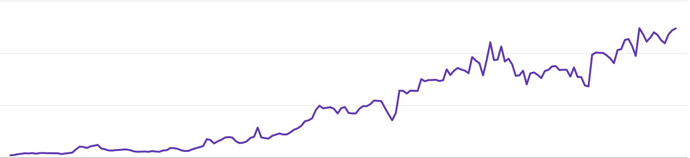

# 寻求有意产品反馈的艺术

> 原文：<https://www.freecodecamp.org/news/the-art-of-asking-for-intentional-product-feed-back/>

你会使用 X 产品吗？

你喜欢 X 产品吗？

你最享受用户体验的是什么？

这些问题都会引发反馈。然而，这些问题是宽泛的。如果你想要更具体的反馈，可以转化为对产品的改变，你会想问一些引出更多细节的问题。

如果这个观点看起来显而易见，为什么我们——作为构建者、设计者和编码者——总是太频繁地要求产品反馈，而这并没有让我们比要求之前过得更好？

我相信——并将在接下来的文章中提供例子来支持——通过询问试探性的问题，我们可以收集可操作的反馈，从而使我们做出有价值的产品改进。

但只有在正确的时间，以正确的方式提出正确的问题，才能解锁这种价值。如果你需要帮助学习问正确的问题(和后续问题)，这篇文章是给你的。

我已经学会了如何通过耐心、练习、指导和构建来提问。

首先，我过去失误的一些相关故事。

## 我的第一手建筑经验如何引导我提出不同类型的问题

当我创办一家金融科技公司来帮助孩子和父母在家里学习金融教育时，我问父母，他们是否认为金融教育对他们孩子的幸福很重要。

你觉得这些家长怎么说？事实上，几乎 100%的人认为这种教育是重要的。

猜猜这些父母中有多少人继续使用我制作的产品？只有一小部分。

这个简短的例子说明了提出正确问题的重要性。我问错了。也许我应该问以下问题:

*   今天你用什么工具来教你的孩子理财教育？
*   你为什么重视教育你的孩子关于金钱的知识？
*   你打算如何教育你的孩子关于金钱的知识？

所有这三个问题都探索了与第一个问题相同的假设:即父母会想教他们的孩子理财知识。

但是这些问题从根本上来说更好，因为它们探究得更深入，并给用户解释其逻辑和基本原理的空间。

这种定性的反馈——在这里我们可以超越假设和陈词滥调——是洞察形成更好的产品体验的地方。这是建筑商的核心目标。

建造者的第二个目标是不仅要建造人们使用的产品，还要建造人们认为有独特价值的产品。

当我开始我的职业生涯时，我渴望成为一名产品经理。我的一个朋友是谷歌的一名成功的高级产品经理，他给了我一个简单的任务:开发一个能被 10，000 人使用的产品。

我深入思考了这个挑战，并研究了帮助学生贷款和映射 API 的工具。最终，我决定开发一个工具来帮助解决我生活中的各种问题。我坐下来思考这些问题:

*   技术可以帮助解决我目前遇到的什么问题？
*   我能建立一个解决方案吗？
*   我知道如何开发这项技术吗？
*   如果我开发了一个产品，其他人也能从中受益吗？

If you build it they may come...but you need to ask what your users want and need first.

我决定构建一个 Chrome 扩展，让用户能够在标签之间快速切换。在 Chrome 商店上大约 6 个月后，免费扩展超过了 10，000 名活跃用户。

我和朋友们坐在一起，开始问他们如何使用这个工具，他们需要这个工具做些什么来增加他们生活中的价值。

我通过问一些非常具体的问题来磨练自己:

*   您使用该工具多少次(我会用内部数据交叉引用)？
*   这个工具没有帮助你做你需要它做的事情？
*   我能在你的工作站或办公桌前观察你使用工具吗？

这些问题带来了新的见解。

最终，我认为用户想要的改进超出了我的技术能力。

所以我让这个工具自我维持，没有进一步的编码改进。

## 我从这次经历中学到了什么？

首先，建筑是有益的。用小工具和黑客解决你自己的问题会很有趣，也很有教育意义。

其次，当你建立了一个有用的东西，并且其他人开始使用它时，你就有了一个独特的机会向用户学习并做出改进。

反过来，这些改进可以产生更好的产品特性、设计和结果。这些增强功能可以更好地满足用户的需求。

因此，一个小飞轮可以启动。

最后，在不致力于进一步的发布和开发工作的情况下，构建和推动极限是可以的。说“不”是可以的，把你的时间和技术资源分配到别处。

## 通过问正确的问题，你可以释放真正的价值。

但是这个值不需要仅仅应用于开发周期。它也能让你意识到你正走向一条你不想走的路。

你可以利用从用户那里获得的洞察力——以及从你提出的问题中收集到的洞察力——来做出更明智的决策。

我的一位产品经理曾经说过:“如果反馈不是一个强有力的肯定，那么它就是一个否定。”我经常思考这个信念系统，因为我总是在寻找可以帮助塑造、激励和影响我设计和制造的产品的观点。

我会要求产品经理——还有你——修改这句话:“如果反馈不是强有力的肯定，那就问为什么不。如果你不能从用户那里收集见解，那么它就是一个“否”

## 有意产品反馈的艺术始于你——建造者——和开放的心态。

但是，与开放心态密切相关的是提出正确问题的能力。“本着开明的精神，我正在努力学习，我正在通过提问来学习”，这样说是有益的。

有许多教育工具、在线学校、带有在线编码测试的工程社区以及像 freeCodeCamp 这样的社区来帮助你学习工程、设计、线框和部署产品。

但是这些工具中有多少教会你如何提问，批判性地思考回答，然后带着相关的后续问题回来呢？

当你为他人构建任何东西时——一个工具、一个网站、一个应用或者高度专业化的软件(比如二维码生成器)——你需要知道人们想要什么、需要什么，以及最看重什么。

只有通过提问，你才能学到这些东西。只有通过提问，你才能生产出让你的用户“强烈肯定”的产品