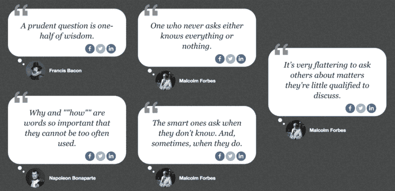
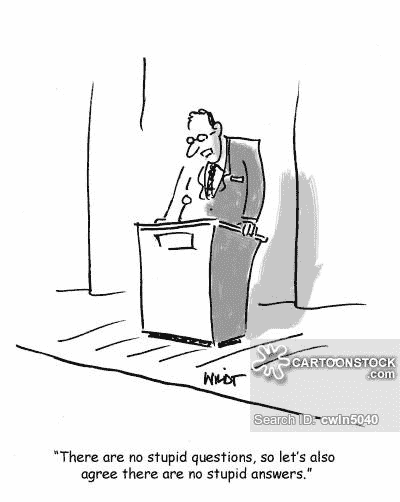
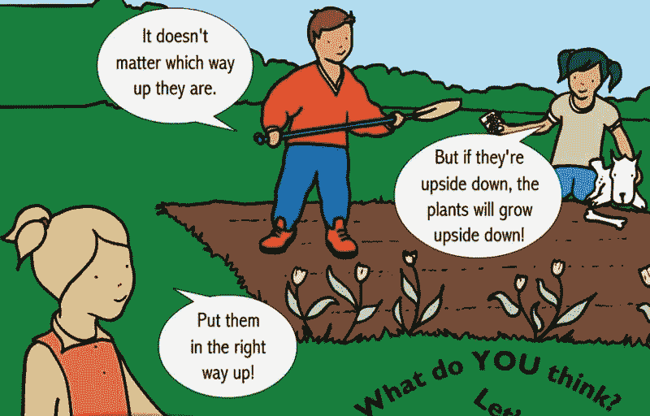
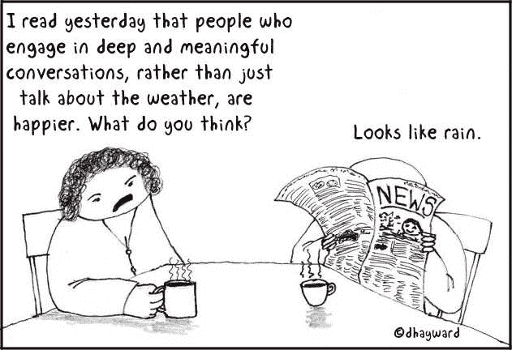
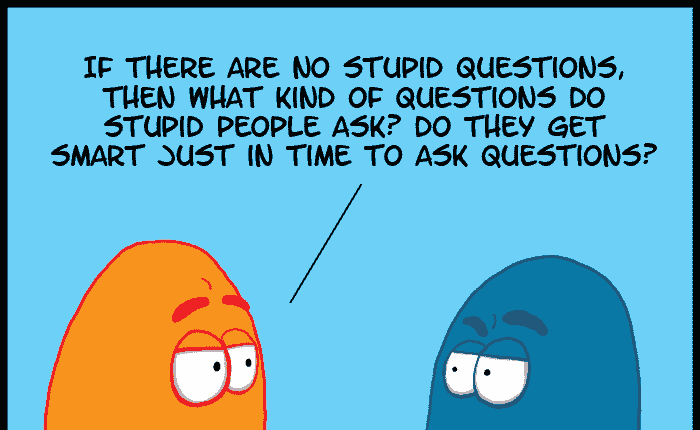
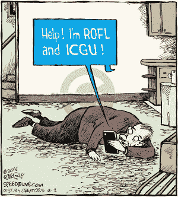
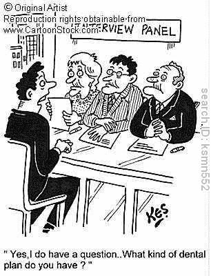
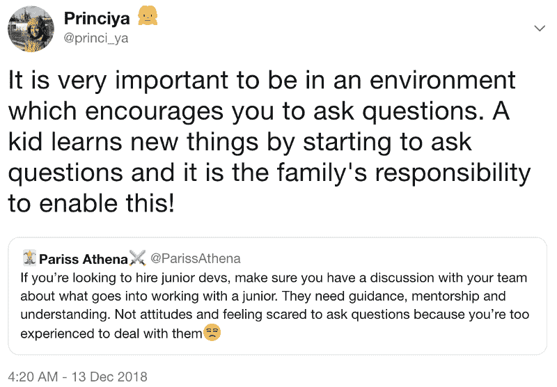

# 提问的艺术

> 原文：<https://www.freecodecamp.org/news/the-art-of-asking-questions-84c01c9987a4/>

由普林西帕

# 提问的艺术

Popular quotes on asking questions [https://www.forbes.com/quotes/theme/questions/](https://www.forbes.com/quotes/theme/questions/)

> 提问的艺术和科学是所有知识的源泉。[来源](https://www.brainyquote.com/quotes/thomas_berger_120671?src=t_questions)

### 介绍

> 我认为，使我们成为人类的是提问的能力，这是我们复杂的口语的结果。动物是如此令人愉快的朋友——它们不问任何问题；他们没有批评。简·古道尔，乔治·艾略特。

[Source](https://www.cartoonstock.com/cartoonview.asp?catref=cwln5040)

### 背景

> “我认为，使我们成为人类的是提问的能力，这是我们成熟的口语的结果。”— [简·古道尔](https://www.brainyquote.com/quotes/jane_goodall_471124)

过去，这种事在我身上发生过无数次。我的大脑有一个问题，但我总是阻止它溜出，认为我会让自己出丑。后来我才意识到，有人问了一个类似的问题，并因为问了一个如此精彩的问题而获得掌声！

你和这种情况有关吗？

一年多了，我越来越擅长问问题，事实上，有时候我有太多的问题要问。感谢[外展](https://princiya777.wordpress.com/2017/05/05/outreachy-suspense-unfolds/)实习，我克服了我的[冒名顶替综合症](https://princiya777.wordpress.com/2017/07/16/am-i-a-fraud/)！此外，这些天来，在处理面试或拉请求时，我通常在桌子的另一边，我对提问的重要性以及如何正确提问有一些建议。

> “动物是如此令人愉快的朋友——它们不问任何问题；他们没有通过批评。”乔治·艾略特。

[Source](https://www.millgatehouse.co.uk/product/science-questions/)

### 规则一

#### 不要做假设。

我再怎么强调公开交流的重要性也不为过，只要相关就提问，避免任何沉默的假设。这条规则适用于你的日常工作、与同事交谈或参加面试。

[Source](http://www.patheos.com/blogs/nakedpastor/2010/03/cartoon-deep-and-happy/)

### 规则二

#### *深思*

生活给了我们许多选择，我们很容易迷失方向，失去生活的重心。有时候，问自己一些相关的问题也是非常重要的。

在你开始工作之前，总是问自己三个问题:

*   你为什么要这么做
*   结果可能是什么，以及
*   你会成功吗？

> 只有当你深入思考，对这些问题找到满意的答案，再去做吧。[查纳克亚](https://www.brainyquote.com/quotes/chanakya_201072?src=t_questions)

[http://artpictures.club/vago.html](http://artpictures.club/vago.html[/caption])

### 规则三

#### *没有问题是愚蠢的*

如果你和我一样，那么我完全理解逼着自己问一个问题有多难。

> 好奇的人没有一个是哑巴。那些不问问题的人一生都一无所知。尼尔·德格拉斯·泰森

> 一旦开始提问，天真就没了。[玛丽·阿斯特](https://www.brainyquote.com/quotes/mary_astor_170219?src=t_questions)

### 例子

根据我的经验，很少有真实的例子来解释提问的必要性。

[Source](https://www.cartoonistgroup.com/store/add.php?iid=146601)

#### #1:使用缩写词时

一个常见的场景是当一个人使用一个可能不是很常见的缩写词。你可以礼貌地要求这个人缩写这个首字母缩写词，而不是做出沉默的假设，从而得出不同的结论。

[Source](https://www.clipartmax.com/middle/m2i8K9m2b1i8H7i8_differentiated-homeworks-for-gcse-aqa-french-cartoon-homework/)

#### #2:维护你的作业日志

另一种情况是，当你羞于公开提问时，默默地记下要点。你最终为自己建立了一个家庭作业日志，花了双倍的时间去寻找那些本可以立即得到答案的问题的答案，如果你当初有勇气去问的话。

[研究](https://journals.plos.org/plosone/article?id=10.1371/journal.pone.0185534)显示，这是一个普遍的情况，代表不足的群体和有色人种。作为一名有色人种女性，我自己也曾多次这样做过，因为我太害怕被诬陷为什么都不知道。这是冒名顶替综合症的一个明显症状。

> 鼓起勇气提出问题，并表达你真正想要或需要知道的东西。尽可能清晰地与他人交流，避免误解、悲伤和戏剧性。仅凭这一个协议，你就可以彻底改变你的生活。[唐·米格尔·鲁伊斯](https://www.brainyquote.com/quotes/don_miguel_ruiz_182403?src=t_questions)

[http://www.jobiety.com/ace-your-panel-interview.html](http://www.jobiety.com/ace-your-panel-interview.html)

#### #3:在面试中

虽然有足够的建议让你为面试过程和要问的问题做好准备，但我也想强调在有时间的情况下问一些相关问题的重要性。作为一名采访者，我真的很喜欢被采访者提问。

[https://imgs.xkcd.com/comics/git.png](https://imgs.xkcd.com/comics/git.png)

#### #4:问题和拉取请求

随着经验的积累，处理开源世界变得越来越好。我还能回忆起我初来乍到的那些日子，一切都太让人不知所措。很自然，我太害羞了，不敢对某个问题或请求发表评论，而且在发表公开声明之前会花相当长的时间。

找一个导师或者和你的同事一起练习，以建设性的方式回顾彼此的拉动式请求。相信我，随着时间的推移会变得更好。

### 结论

话虽如此，虽然我们必须更好地提问，但同样重要的是要有一个培养提问和给出鼓励性答案的文化的环境。以下是如何实现这一目标的几点建议:

[https://twitter.com/princi_ya/status/1072987101644378112](https://twitter.com/princi_ya/status/1072987101644378112)

1.  不要取笑或羞辱别人的提问
2.  不知道所有事情的答案是可以的
3.  谦逊地接受上述事实
4.  在发现未知问题的答案的同时学习新的东西
5.  分享你的知识

我很想知道你对这个问题的想法和经历。请分享您的反馈。谢谢？