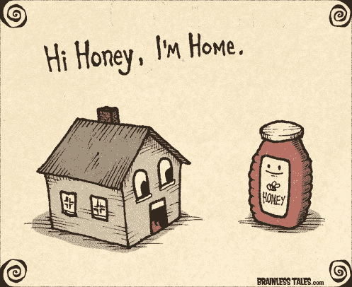

# 利用时间的艺术

> 原文：<https://www.freecodecamp.org/news/the-art-of-leveraging-time-362bba5195ed/>

哦亲爱的！如果我每次都有一毛钱(我只是押韵——两次！)有人，包括我在内，抱怨时间不够，我就超级有钱了。

我们每天都有 24 小时来实现我们的目标，完成我们的个人和专业任务，与家人和朋友共度美好时光，照顾我们的身体，等等。

事实是，有些人每天都挤出时间，在一年内完成其他人需要 5 年、10 年甚至更长时间才能完成的事情。

我总是对这种“超人的技能”着迷，所以在过去的几年里，我一直在遵循下面的过程:

*   阅读有关该主题的内容
*   分析并应用我在现实生活中学到的东西
*   评估我的结果
*   决定保留这个实践还是放弃它

以下是我这段时间的一些观察和建议。

#### 帕累托原则

也被称为 80/20 定律。这意味着你 20%的任务会产生 80%的结果。剩下的 80%的任务会给你剩下的 20%的结果。

所以从今天开始，确保你一天中所做的每件事都有最大的回报。

但是，最大结果根据是什么呢？

很高兴你问了。

那要看你了。我们每个人都有不同的目标。

对于一个网站开发人员来说，它可能是获得一项技能，这将给予他们最好的职业前景，或者大幅加薪，或者让他们离一个伟大的职业梦想更近一步。

对于一个有五个孩子的单亲家长来说，可能要确保他们所有的孩子都得到很好的照顾和安全。

#### 阅读大量的书籍

如果时间就是金钱，那么阅读合适的书籍将会传授丰富的知识。这反过来会帮助你拓展你的技能和能力。

此外，书籍可以帮助你进入睡前放松阶段(这样你既学习又放松),还可以帮助你在早上重新启动大脑。

如果你在所谓的“死亡时间”做这件事，比如在医生的办公室等着，或者在通勤的时候，这件事会变得更有帮助。

嗯，当你的另一半又迟到的时候，挤出几页来等他们，怎么样？？

Hey sweetie, I was just reading a book :)

#### 有声读物

对于更先进的反死亡时间的人来说。有声读物拥有实体书的所有优点，当你四处走动时也可以使用。你甚至可以在健身房做有氧运动的时候听它们。

这样，即使你完成了其他重要的任务，你也会学到东西。

#### 在上下班途中锻炼

你可能已经发现了，我认为每天通勤是一个很大的时间负担。但是你可以很容易地弥补这一点。例如，你可以骑自行车去办公室。

你将足够快地到达办公室(尽管可能没有开车那么快)。此外，购买自行车的初始成本相对较小，很快就有回报。在一天结束的时候，你会比你周围的大多数人一周做的更多。很划算，是吧？

#### 使用强大的硬件来消除不必要的延迟

你还记得发送几封电子邮件，每封花了你 5 分钟，还不算打字的时间吗？您是否一直在等待生产构建，并且花费了很长时间，因为您的 CI/CD 解决方案在您心爱的 [ENIAC](https://en.wikipedia.org/wiki/ENIAC) 上运行，并且在成功之前您不能停止工作？

Hello FamilyGuy

你曾经计算过你在这些事情上浪费了多少时间吗？高质量的硬件是一项巨大的投资，如果你在乎你的时间，拥有一个[【史高治·麦克老鸭】](http://disney.wikia.com/wiki/Scrooge_McDuck) 的心态并不是一个明智的选择。

我不是说出去买你能找到的最贵的小玩意或电脑。但是愿意花更多的钱来达到更高的质量水平。

#### 不准打盹

仅此一项就给我的生活带来了显著的积极变化，尤其是提高了我的工作效率。你会问为什么？为什么在床上多呆 20 分钟有那么糟糕？

除了没有利用好你的时间(这也是本文的主题)，这里有几篇关于这个问题的文章(它们只是冰山一角):

*   [好睡眠和贪睡按钮不要走在一起](https://www.independent.co.uk/life-style/health-and-families/snooze-button-better-sleep-alarm-bed-wake-up-neuroscientist-a7941961.html)
*   [按下贪睡按钮时发生的 5 件事](https://blog.sleepnumber.com/5-things-happen-hit-snooze-button/)

#### 如果你需要放松，现在就做

我们不是机器人，我们活着也不是为了从清单上划掉任务。因此，你需要倾听你的身体，并照顾好它，这样在需要的时候，它会变得强大而富有成效。

如果你不能睁开眼睛，就把所有的事情都搁置起来，去睡觉。

如果你已经忘记了你最后一次大笑是什么时候，那就关上那该死的门，和你的另一半去看一场喜剧。

如果你觉得你的生活节奏不可持续，试试“无电子产品周六”。你会惊讶于我们的祖父母是多么有创造力，例如，为了打发他们的空闲时间。如果你运用帕累托原则，你可能会意识到你承诺过多，却没有任何实际回报。

感谢您阅读这篇文章。我希望上面提到的建议能帮助你为自己和你认为重要的事情腾出更多的时间。如果是这样，请通过传播信息和鼓掌给我一些爱？下面向我表示你的赞赏。？

像往常一样，请随意在评论区贡献你自己的特别建议。

*最初发表于* [perigk.github.io](http://perigk.github.io)