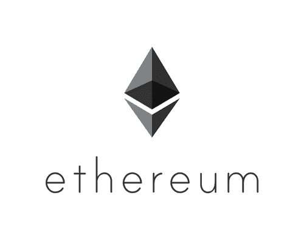
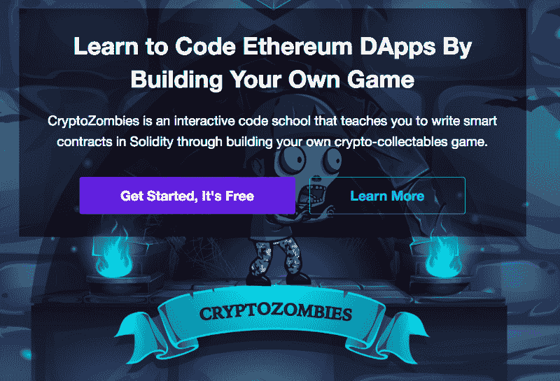

# 区块链发展权威指南

> 原文：<https://www.freecodecamp.org/news/the-authoritative-guide-to-blockchain-development-855ab65b58bc/>

作者 Haseeb Qureshi

# **区块链发展权威指南**

加密货币、ico、神奇的互联网货币——这一切都太他妈的令人兴奋了，而你，这位热切的开发者，想要加入这场疯狂。你从哪里开始？

我很高兴你对这个空间感到兴奋。我也是。但是你可能会发现不知道从哪里开始。区块链正在以极快的速度发展，但学习这种东西没有明显的趋势。

自从我离开 Airbnb 全职在区块链工作以来，许多人都向我咨询如何全职进入区块链空间。就当这是我关于如何进入区块链工程学院的权威(不可避免的不完整)指南。

本指南将分为十个部分:

1.  **为什么要学习区块链开发？**
2.  **先决条件**
3.  **比特币的理论基础**
4.  **自己建造一个区块链**
5.  **以太坊和智能合约编程**
6.  **智能合约安全**
7.  **取下辅助轮**
8.  **构建自己的项目**
9.  **游览区块链社区**
10.  **找工作**

### 你为什么要学习区块链开发？

在我回答这个问题之前，让我首先指出:区块链现在是一个被严重高估的空间。这些价格是不可持续的，崩盘肯定要来了。这一切以前都发生过，而且很可能会再次发生。但如果你在这个领域长期工作，你会学会对价格不屑一顾。用 Emin Gun Sirer 的话说——价格是加密货币中最没意思的部分。这些都是非常重要的技术，它们将会不可逆转地改变世界。

如果你不确定，我不能告诉你是否应该跳进去。但我可以告诉你说服我采取这一行动的五个原因:

1.  现在还早。

比特币是在 10 年前发明的，但创新的速度只是在最近几年才达到狂热程度，特别是随着 2015 年以太坊的推出。这个领域的大多数新公司和想法都建立在以太坊之上，以太坊还非常不成熟。

即使你现在开始，你也可以在几年内成为世界级的专家。大多数人只是没有这么长时间，要赶上也不会那么难。现在开始类似于深度学习专家在 2000 年代末开始研究这个主题。

**2。** **这个领域还没有强大的人才漏斗。**

大学里大多数最优秀、最聪明的学生都专注于机器学习、网络编程或游戏开发。当然，区块链在公共话语中变得越来越性感，但在你的职业生涯中，它们仍然是一个怪异和颠覆性的话题。

早期，区块链完全是赛博朋克、偏执狂和怪人的天下。这种情况最近才开始改变。仅仅通过成为一个好奇和开放的开发者，你就会给这个领域带来很多价值。

**3。许多创新发生在学术界之外。**

据我们所知，中本聪不是一个学者。还没有一所大学或机构提供连贯的区块链集中。这里的大部分创新都是由爱好者、企业家和独立研究人员引领的。几乎你需要知道的一切都在白皮书、博客文章、公共 Slack 频道和开源软件中。你只需要卷起袖子，投入战斗。

**4。对人才的需求远远超过了供给。**

这个领域没有足够多的开发人员，而且他们接受培训的速度不够快。每个人都在竞相雇佣区块链的人才，各个项目都感受到了人才短缺。许多最好的公司不能支付足够的薪水让他们的员工留下来，因为他们有太多的机会。如果你掌握了一些技能，就很容易找到工作。

**5。加密货币真是太酷了。**

你还能在哪里建立像加密的、分散的钱这样的科幻东西？现在是狂野的西部——这带来了好的和坏的。这个空间需要更多的透明度，监管终将到来。但毫无疑问，加密货币是你现在可以从事的最具创新性的领域之一。

Naval Ravikant 在最近的一次采访中说:成功的关键是给社会它想要的东西，但不知道如何自己得到。这种事不能上学；如果可以的话，这个世界已经有稳定的供应了。

所以造一些别人不知道怎么造的东西。现在，区块链是全新的，有太多的问题需要解决。如果你成功构建了去中心化技术的未来，世界将会给你丰厚的回报。

所以说你想扔掉你的帽子。在进入拳击台之前，你需要知道什么？

### 先决条件

我建议你在进一步潜水之前，加强对基本面的理解。区块链是建立在数十年的计算机科学、密码学和经济学研究之上的。中本聪是一个叛徒，但他也知道在他之前的历史。为了理解为什么区块链行得通，你需要理解它们的组成部分——在区块链之前是什么，为什么那些东西行不通。

以下是一些需要熟悉的好的先决条件，按重要性排序。

请注意，这些链接只是一个起点，您可能想要更深入地了解这些主题。

### 计算机科学

#### 数据结构

您将希望熟悉主要数据结构的特征和复杂性保证:[链表](https://en.wikipedia.org/wiki/Linked_list)、[二分搜索法树](https://en.wikipedia.org/wiki/Binary_search_tree)、[散列图](https://en.wikipedia.org/wiki/Hash_table)和[图](https://en.wikipedia.org/wiki/Graph_(discrete_mathematics))(特别是在区块链非常突出的[有向无环图](https://en.wikipedia.org/wiki/Directed_acyclic_graph))。从头开始构建它们有助于更好地理解它们的工作方式和属性。

#### 密码系统

密码学是加密货币的名称和基础。所有加密货币都使用[公钥/私钥加密](https://en.wikipedia.org/wiki/Public-key_cryptography)作为身份和认证的基础。我会推荐学习 [RSA](https://www.youtube.com/watch?v=vgTtHV04xRI) (简单易学，不需要很强的数学背景)，然后再看看 [ECDSA](https://blog.cloudflare.com/a-relatively-easy-to-understand-primer-on-elliptic-curve-cryptography/) 。椭圆曲线加密需要更抽象的数学——理解所有细节并不重要，但要知道这是大多数加密货币中使用的加密技术，包括比特币。

另一个重要的密码原语是[密码散列函数](https://en.wikipedia.org/wiki/Cryptographic_hash_function)。这些可以用来构建[承诺方案](https://en.wikipedia.org/wiki/Commitment_scheme)，并且是 [Merkle 树](https://en.wikipedia.org/wiki/Merkle_tree)的构建模块。Merkle 树支持 Merkle 证明，这是区块链用于可伸缩性的关键优化之一。

#### 分布式系统

有一些关于分布式系统的好教材，但是这是一个庞大而困难的研究领域。分布式系统对于区块链推理来说是绝对必要的，所以在着手区块链编程之前，您必须在这里建立一个基础。

一旦你不再生活在一台机器上，你必须开始思考一致性和 T2 共识。你会想知道[线性化](https://en.wikipedia.org/wiki/Linearizability)和[最终一致性](https://en.wikipedia.org/wiki/Eventual_consistency)模型之间的区别。你还会想知道[容错](https://en.wikipedia.org/wiki/Fault_tolerance)一致性算法的保证，比如 [Paxos](https://en.wikipedia.org/wiki/Paxos_(computer_science)) 和 [RAFT](https://en.wikipedia.org/wiki/Raft_(computer_science)) 。[了解在分布式系统中推理时间的困难](https://www.youtube.com/watch?v=BRvj8PykSc4)。理解[安全性和活性](http://www.bailis.org/blog/safety-and-liveness-eventual-consistency-is-not-safe/)之间的权衡。

有了这样的背景，你就能理解围绕拜占庭容错共识的困难，这是区块链公众的主要安全需求。你会想了解一下 [PBFT](https://blog.acolyer.org/2015/05/18/practical-byzantine-fault-tolerance/) ，它是首批提供拜占庭容错共识的可扩展算法之一。PBFT 是许多非工作证明区块链共识算法的基础。再说一次，你不需要了解 PBFT 如何以及为什么是正确的细节，而是要了解总体思路及其安全保证。

理解分发数据库的传统方法也非常有用(从本质上讲，区块链毕竟是数据库)。了解[分片](https://en.wikipedia.org/wiki/Shard_(database_architecture))(比如通过[一致散列](https://en.wikipedia.org/wiki/Consistent_hashing))、[主从复制](https://en.wikipedia.org/wiki/Replication_(computing))和[基于法定人数的提交](https://en.wikipedia.org/wiki/Quorum_(distributed_computing))。查看[分布式哈希表(DHT)](https://en.wikipedia.org/wiki/Distributed_hash_table)，比如 [Chord](https://en.wikipedia.org/wiki/Chord_(peer-to-peer)) 或者 [Kademlia](https://en.wikipedia.org/wiki/Kademlia) 。

#### 建立工作关系网

区块链的分散化在很大程度上源于他们点对点的网络拓扑。因此，区块链是过去 P2P 网络的直接后代。

为了理解区块链通信模型，你需要理解[计算机网络](https://en.wikipedia.org/wiki/Computer_network)的基础知识:这意味着理解 [TCP vs UDP](https://www.diffen.com/difference/TCP_vs_UDP) 、[数据包模型、IP 数据包看起来像什么](https://en.wikipedia.org/wiki/Network_packet)，以及大致了解[互联网路由](https://en.wikipedia.org/wiki/Routing)如何工作。

公众区块链倾向于使用[泛滥](https://en.wikipedia.org/wiki/Flooding_(computer_networking))通过[八卦协议](https://en.wikipedia.org/wiki/Gossip_protocol)传播消息。了解一下 [P2P 网络设计](https://en.wikipedia.org/wiki/Peer-to-peer)的历史，从 [Napster 到 Gnutella](http://www.springer.com/cda/content/document/cda_downloaddocument/9783642035135-c2.pdf?SGWID=0-0-45-855488-p173920223) 、 [BitTorrent](https://en.wikipedia.org/wiki/BitTorrent) 和 [Tor](https://en.wikipedia.org/wiki/Tor_(anonymity_network)) 很有启发意义。区块链有自己的位置，但他们吸取了这些网络的教训，以及它们是如何设计的。

### 经济学

加密货币本质上是多学科的——这是它们如此迷人和激进的部分原因。除了计算机科学、密码学和网络之外，它们还与经济学紧密交织在一起。加密货币可以通过其经济结构衍生出许多安全属性，这通常被称为*加密经济学*。因此，经济学对于理解加密货币至关重要。

#### 博弈论

经济学中对加密货币起作用的最重要的分支是[博弈论](https://en.wikipedia.org/wiki/Game_theory)，研究多个代理之间的收益和激励。你不需要深入*这里，但你需要理解博弈论分析的基本工具，以及如何使用它们来分析一次性和迭代游戏中的激励。*

你的清单中的两个关键概念应该是[纳什均衡](https://en.wikipedia.org/wiki/Nash_equilibrium)和[谢林指出](https://en.wikipedia.org/wiki/Focal_point_(game_theory))，因为它们在密码经济分析中占据显著地位。

#### 宏观经济学

加密货币不仅仅是协议，也是货币的一种形式。因此，它们符合宏观经济学的法则(如果它们能被称为法则的话)。加密货币受制于不同的[货币政策](https://en.wikipedia.org/wiki/Monetary_policy)，并对[通货膨胀](https://en.wikipedia.org/wiki/Inflation)和[通货紧缩](https://en.wikipedia.org/wiki/Deflation)做出可预测的反应。你应该理解这些过程以及它们对消费、储蓄等的影响。

另一个有价值的经济概念是[货币流通速度](https://en.wikipedia.org/wiki/Velocity_of_money)，尤其是当它与货币估值相对应时。

#### 微观经济学

加密货币也与市场紧密交织，这需要理解微观经济学。你需要对[供需曲线](https://en.wikipedia.org/wiki/Supply_and_demand)有很强的直觉。你应该能够对竞争和[机会成本](https://en.wikipedia.org/wiki/Opportunity_cost)进行推理(它们将经常应用于加密货币开采)。对于许多硬币发行和密码经济系统来说，[拍卖理论](https://www.youtube.com/watch?v=4kWuxfVbIaU)占据显著地位。

我希望你已经熟悉了其中的一些话题。如果你是，请随意浏览或完全跳过它们。

好了，现在你已经完成并巩固了你的基本面(或者你跳过了一些，谁会去数呢？)，所以现在你已经检查了你的理论，让我们开始区块链开发。

### 比特币的理论基础

2008 年 10 月，中本聪发表了一份白皮书，其中他描述了一种去中心化数字货币的协议。他把这个协议称为比特币。

在你能够理解区块链背后的伟大思想之前，你必须从比特币开始，并领会 Satoshi 的独到见解。

首先，我建议建立你对工作证明和叉子选择规则的直觉(也称为中本聪共识)。从这里开始:

我建议多看一段视频解释，让这个想法深深印在你的脑海里:

太好了。现在你已经建立了你的直觉，[这篇文章](https://www.igvita.com/2014/05/05/minimum-viable-block-chain/)将对比特币如何工作的关键组成部分进行更深入的端到端阐述。

### 自己建造一个区块链

现在您已经有了高水平的直觉，是时候构建您自己的基于工作证明的区块链了。别担心，这比听起来容易。这里有一些好的资源。

首先，我有一个视频讲座，在那里我会详细介绍如何用 Ruby 来做这件事(我建议观看，即使你不是 Ruby 程序员):

[来源和幻灯片在这里。](https://github.com/Haseeb-Qureshi/lets-build-a-blockchain)

你还可以找到其他用各种编程语言编写的[区块链实现](https://github.com/openblockchains/awesome-blockchains)。继续构建你自己的，并满足于它的大部分功能。

一旦你已经做到这一步，你应该很好地掌握了如何在区块链(即比特币)上实现一个简单的支付应用程序。到目前为止，你也应该有足够的背景知识，能够阅读和理解最初的[比特币白皮书](https://bitcoin.org/bitcoin.pdf)。

要了解比特币挖矿的经济学和力学，我推荐观看普林斯顿大学比特币和加密货币课程中关于比特币挖矿的[讲座](https://www.youtube.com/watch?v=jXerV3f5jN8)。

如果你已经到了这一步，你应该对比特币有足够的了解，能够[浏览比特币块头](https://www.youtube.com/watch?v=gUwXCt1qkBU)并理解其每个组成部分的含义。你也应该能够玩一个[比特币区块浏览器](https://blockchain.info/)并浏览原始比特币交易。

现在是研究比特币和加密货币历史的好时机。下面的视频，由加州大学伯克利分校贴花提供，给出了一个很好的概述。

更多额外信贷资源:

*   [比特币的学术先驱](https://queue.acm.org/detail.cfm?id=3136559)
*   比特币的力学: [UTXOs 和比特币脚本](https://www.youtube.com/watch?v=q5GWwTgRIT4)(比特币脚本不是超级重要，大致知道能做什么就行)
*   [比特币分叉的简短指南](https://www.coindesk.com/short-guide-bitcoin-forks-explained/)
*   [软叉和矿工信号](https://en.bitcoin.it/wiki/Softfork)
*   [双倍花费，51%攻击，自私采矿](https://www.youtube.com/watch?v=UPxaCj8ZsEU)
*   [重放攻击](https://bitcointechtalk.com/how-to-protect-against-replay-attacks-7a00bd2fe52f)
*   [比特币可扩展性问题](https://en.wikipedia.org/wiki/Bitcoin_scalability_problem)，这是比特币生态系统中大部分争议的来源。你应该知道为什么比特币的人们对区块大小争论这么多。
*   隔离证人，又名隔离证人，不重要，但经常出现。
*   [闪电网](https://lightning.network/)，比特币的一个比较重要的缩放解决方案，也推广到其他区块链
*   [比特币全节点](https://bitnodes.earn.com/)、[比特币费用统计](https://bitcoinfees.earn.com/)、[图表](https://blockchain.info/charts)、[图表](https://coin.dance/stats)和[更多图表](https://bitcointicker.co/networkstats/)
*   [比特币能耗指数](https://digiconomist.net/bitcoin-energy-consumption)(在发布时，比特币开采消耗的能量相当于整个秘鲁的能量)
*   Gwern 关于比特币不体面的深刻文章
*   如果你想进入更深的兔子洞，詹姆森·洛普有丰富的比特币资源。

### 以太坊和智能合约编程

既然你已经建立了一个区块链，并了解了比特币的动态，那么是时候深入研究以太坊了。

您了解区块链和工作证明如何在对等网络中实现分布式、拜占庭式的容错共识。但支付网络只是你可以在这样的区块链上运行的一个应用。2013 年，以太坊的创造者 Vitalik Buterin 问道:如果你用一台区块链来实现一台去中心化的计算机会怎么样？

在以太坊，你付钱给矿工，让他们在这个分布式虚拟机上执行你的程序。这意味着你可以使用图灵完全编程语言进行任意计算(不像比特币脚本)。显然，这包括支付相关的应用，因此以太坊实现了比特币功能的超集，并催生了创新的复兴。

这就把我们带到了智能合约——在这种虚拟机上运行的程序的名称。智能合约可以根据程序的执行直接与区块链的加密货币进行交互。换句话说，你可以创建自动执行的金融契约。这是一个疯狂的想法，一旦你接受了这种编程模型，你就可以做各种科幻未来的事情。

以太坊使得 ico 和开发者在区块链上的建筑浪潮成为可能。它是仅次于比特币的第二大加密货币，它拥有超过 10 倍于下一个最受欢迎平台的开发人员，它拥有最强大的开发团队，最成熟的工具，以及大多数 ico 和项目。它还拥有最多的[产业支持](https://entethalliance.org/members/)，这一点大有可为。十有八九，如果你在做区块链开发，你会为以太坊智能合约写代码。(即使你不是，这也是理解这个领域正在发生的事情的关键。)

首先，更详细的以太坊高层解释:

以太坊背后的理念也催生了一波加密经济学的创新浪潮。你应该尝试一下围绕[道](https://en.wikipedia.org/wiki/Decentralized_autonomous_organization)的想法，以及它们暗示的所有科幻狂热梦想。

好了，幻想到此为止，让我们深入研究一下技术。

Preethi Kasireddy 对以太坊黄皮书及其内部内容做了一个很好的概述。以太坊使用的是[账户模型](https://ethereum.stackexchange.com/questions/326/what-are-the-pros-and-cons-of-ethereum-balances-vs-utxos)，而不是比特币的 UTXO 模型——你很快就会明白为什么这会让智能合约更容易编写。

与任何技术一样，熟悉以太坊的最佳方式是构建一些小项目。

以太坊的主流编程语言是 Solidity，它是一种静态类型的 JavaScript 类语言。这是一种有很多缺点和许多可疑设计选择的语言。更健壮的语言，如 [Viper](https://github.com/ethereum/vyper) 可能会在生产就绪后取代它，但目前可靠性是智能合约编程的通用语言。它基本上是以太坊的 JavaScript，所以你需要学习它(以及[它的陷阱](https://medium.com/@aidobreen/how-and-why-developing-for-ethereum-sucks-1ff1a9873527))。

为了第一次接触 Solidity 开发，我建议通读所有的 [CryptoZombies 教程](https://cryptozombies.io/)。这是一个令人愉快的高质量 Codecademy 风格的教程，它将教你 Solidity 编程的基础。

既然你已经吊起了胃口，是时候自己发展了。

以太坊的“hello world”正在构建一个符合 ERC-20 标准的令牌。我推荐[这份指南](https://enlight.nyc/ethereum-token)作为第一份指南，带你完成这个过程。

Remix 是一个浏览器内的 Solidity 编辑器和编译器——它基本上是以太坊开发的训练轮，所以我建议你在 Remix 中完成剩下的练习。但是建立一个当地的区块链，感受以太坊的工具也是值得的。[本教程](https://codeburst.io/build-your-first-ethereum-smart-contract-with-solidity-tutorial-94171d6b1c4b)很好地引导你完成了端到端的区块链堆栈，并在过程中解释了各个部分。

接下来，我建议建立一个投票系统。我称之为以太坊的 Todo 应用。Karl Floersch 有一个很棒的教程,他将介绍如何构建一个安全的提交-显示投票系统。

很好，现在是你的期中考试:构建一个安全的掷硬币游戏，两个玩家可以安全地在掷硬币上下注。这次没有教程，自己做。思考可能的攻击——玩家如何作弊？你能保证他们诚实地比赛吗？这里有一些提示。

### 智能合同安全性

安全对区块链的发展绝对重要。智能合约一直受到灾难性黑客攻击的困扰，包括[道黑客](http://hackingdistributed.com/2016/06/18/analysis-of-the-dao-exploit/)、[平价钱包黑客](https://medium.freecodecamp.org/a-hacker-stole-31m-of-ether-how-it-happened-and-what-it-means-for-ethereum-9e5dc29e33ce)，以及被亲切地命名为[平价钱包黑客 2](https://hackernoon.com/parity-wallet-hack-2-electric-boogaloo-e493f2365303) (现在有了自己的 [T 恤](https://cryptoshirt.io/products/devops199-quote-i-accidentally-killed-it-tee))。如果你要写智能生产合同，你绝对必须阅读所有这三种攻击的分析。

事实是，**智能合约非常难做好**。虽然编程工具链将会改进，使这些攻击更加困难，但它们最终都是由于程序员的错误造成的。智能合约编程也有许多微妙的错误，比如在[抢先](https://hackernoon.com/front-running-bancor-in-150-lines-of-python-with-ethereum-api-d5e2bfd0d798)或[安全生成随机性](http://www.swende.se/blog/Breaking_the_house.html)中。

作为一名智能合约开发人员，您必须将安全性视为头等大事。在智能合约编程中没有“快速移动和打破东西”。这意味着任何处理大量资金流动的代码都应该通过静态分析器运行，如 [Oyente](https://github.com/melonproject/oyente) 或 [Securify](https://securify.ch/) ，进行彻底测试，然后由经验丰富的智能合同审计员进行审计。你也应该尝试依赖预先审计的组件，比如 [OpenZeppelin 的开源合同](https://github.com/OpenZeppelin/zeppelin-solidity)。

为了加强你的安全能力，我推荐你使用 OpenZeppelin 的 Ethernaut，在这个游戏中，你可以发现并攻击智能合约中的漏洞。他们中的许多人让你复制在野外发生的对智能合约的真实攻击。

菲尔·黛安也有一套出色的智能合同破解挑战，叫做[破解这份合同](http://hackthiscontract.io/)。

一旦你过了这一关，我强烈建议你阅读由 ConsenSys 编辑的《智能合同最佳实践》的全文。在您的智能合约编程生涯中，预计会多次重温该文档。[参考书目](https://consensys.github.io/smart-contract-best-practices/bibliography/)也值得安全专家进一步研究。

### 取下训练轮

如果你已经做到了这一步，你现在应该准备好超越 Remix，开始使用一个严肃的 Solidity 开发栈。

大多数开发者推荐你的文本编辑器使用 VSCode 或 Atom，因为他们有不错的 Solidity 插件。为了与本地区块链交互，您将希望使用 [Ganache](https://github.com/trufflesuite/ganache-cli) (以前的 TestRPC)，并且您将希望使用 [Truffle framework](https://github.com/trufflesuite/truffle) 进行您的(基于 JS 的)测试和配置您的构建管道。

现在是了解 IPFS 的好时机，你可以把它作为一个完全分散的文件商店，比以太坊区块链便宜得多。以下是创作者胡安·贝内的简短解释:

对于与以太坊和 [IPFS](https://ipfs.io/) 全节点的交互， [Infura](https://infura.io/) 是大多数开发者推荐的。[以太扫描](https://etherscan.io/charts)和[以太加油站](https://ethgasstation.info/)提供以太坊网络上有用的实时统计数据。

一旦你有了完整的 [Web3](https://blockchainhub.net/web3-decentralized-web/) 栈，试着部署一个端到端的 Dapp(去中心化应用)。[本教程](https://happyfuncorp.com/whitepapers/webthereum)使用 Node 和 Postgres 为后端提供了一个很好的全栈概述，[本教程](https://medium.com/@merunasgrincalaitis/the-ultimate-end-to-end-tutorial-to-create-and-deploy-a-fully-descentralized-dapp-in-ethereum-18f0cf6d7e0e)将向您展示如何创建一个完全去中心化的应用程序，使用 IPFS 作为您的持久层。

### 构建您自己的项目

你现在应该对大部分技术都很熟悉了——剩下的就是开始构建东西，深入区块链社区。

首先，开始构建自己的项目。如果有什么让你兴奋的好主意，那就去实现它，并说服其他人和你一起实现它！如果您还没有一个想法或者不愿意动手，有许多高质量的开源项目欢迎投稿。OpenZeppelin 可能是智能合约的良好开端。

更好的是，我建议从找到一个你喜欢的积极开发的项目开始。利用他们的空闲时间或火箭聊天——开发人员通常很容易找到。告诉他们你愿意做出贡献，并要求一些小任务(或在他们的 Github 上找到未解决的问题)。

请注意，虽然我一直专注于协议和智能合约开发，但区块链公司需要 web 开发人员来构建他们的核心功能。这些角色通常需要与区块链互动，所以对区块链的工作方式有一个良好的心理模型是必不可少的——但对于区块链初创公司的许多工程师来说，你的大部分工作将是构建 Python 服务器，或设计 React 前端，与区块链互动可能只是该工作的一小部分。您不必专门从事智能合约开发——实际上，这只是工作中的区块链堆栈的一部分。

除了开源贡献，还有许多区块链黑客马拉松不断涌现。大多数项目都有一个你可以加入的免费公共 Slack，以太坊本身也有一个非常活跃的 [Gitter channel](https://gitter.im/ethereum/home) ，很多开发人员在那里闲逛。随着你深入这个空间，你最终会找到你的同辈群体，无论是在 Slack 频道、Telegram group 还是 Gitter 频道。不管在哪里，找到你的人，继续学习。

### 浏览区块链社区

真正了解区块链世界的最佳方式是让自己沉浸其中。阅读和倾听最聪明的人，尤其是他们过去写的东西。当我试图学习一个新的领域时，这一直是我的策略，并且对我来说已经有了回报。

有很多好的区块链内容，但也有很多废话。以下是我推荐的信息饮食。

#### 媒体

我推荐的三个奇妙的播客是[软件工程每日区块链访谈](https://itunes.apple.com/us/podcast/blockchain-software-engineering-daily/id1230807219?mt=2)，它们提供了许多主题和加密货币的良好技术介绍。从那里我推荐[《震中》](https://itunes.apple.com/us/podcast/epicenter-podcast-on-blockchain-ethereum-bitcoin-distributed/id792338939?mt=2)和[《被解放的》](https://itunes.apple.com/us/podcast/unchained-big-ideas-from-worlds-blockchain-cryptocurrency/id1123922160?mt=2)——你会想回去听许多老剧集。另一个有趣的新兴技术播客是[阴谋](https://itunes.apple.com/us/podcast/conspiratus/id1335928646?mt=2)。我推荐订阅这些。

有几个不错的 Youtube 频道(尽管 Youtube 上有很多垃圾)。订阅[以太坊基金会](https://www.youtube.com/channel/UCNOfzGXD_C9YMYmnefmPH0g/videos)并观看 Devcon3 演示。[柏克莱区块链](https://www.youtube.com/channel/UC5sgoRfoSp3jeX4DEqKLwKg/videos)记录了他们的很多讲座，大部分都是很优秀的技术概述。 [Decypher Media](https://www.youtube.com/channel/UC8CB0ZkvogP7tnCTDR-zV7g/videos) 也发布演讲、白皮书评论和教程。[杰克逊·帕尔默](https://www.youtube.com/channel/UCTOzxu_HvuJfZtTJ6AZ7rkA)每周都有引人入胜的综述，这些综述技术含量较低，但呈现非常均匀。

#### 在线阅读

对于实时区块链聊天，它主要存在于两个地方:Reddit 和 Twitter。对于 Reddit 来说，大多数子编辑的质量非常低，并且以噪声为主。r/Ethereum 始终保持着良好的质量(对于特定的加密货币有一些不错的子货币)。然而，大多数次级市场主要由投机者主导，不能很好地利用你的注意力。远离比特币相关的子货币。众所周知，比特币有一个最毒的社区，Reddit 只是放大了这一点。

Twitter 更像是一个大杂烩。不管是好是坏，大多数区块链人都生活在推特上。区块链 Twitter 起初对我来说有点神秘，但最终我开发了一个 Twitter 区块链人的非正式本体。根据我的经验，有五种类型的区块链人:建筑商、企业家、记者、商人和“思想领袖”

像躲避瘟疫一样避开“思想领袖”。企业家可以很好，尽管他们大多扮演炒作者或在推特上谈论他们自己的项目。投资者大多在推特上谈论价格和炒作项目，所以如果这是你的事情，那就是你的事情。记者倾向于在推特上发布当天的主要新闻——我建议不要发布，除非你需要实时分析，而你可能并不需要。如果你是一个活跃的交易者，这可能很重要，但如果你试图建立在区块链上，大多数实时的东西是一种干扰。

最关注建筑商。他们是现在最重要的人，也是推动技术进步的人。

每个类别的几个代表(如果你想填写你的 Twitter feed，先从广度上搜索这些人关注谁):

#### 建设者

*   以太坊
*   佐科·威尔科克斯
*   智能合约的发明者尼克·萨伯
*   [弗拉德·扎姆菲尔](https://twitter.com/VladZamfir)，以太坊
*   马尔科·桑托里，库利·LLP
*   里卡尔多·斯帕尼，莫内罗
*   马特·利斯顿，灵知

#### 企业家

*   巴拉吉·斯里尼瓦桑，Earn.com
*   埃里克·沃尔赫斯，变形人

#### 投资者

*   [海军 Ravikant](https://twitter.com/naval) ，亚稳态
*   [阿里·保罗](https://twitter.com/AriDavidPaul)，碉堡之都
*   [琳达·谢](https://twitter.com/ljxie)，标量资本
*   克里斯·伯恩斯克，占位符

#### 新闻记者

*   [Tuur Demeester](https://twitter.com/TuurDemeester) ，态度坚决的研究
*   《福布斯》杂志的劳拉·申

(你也应该[跟着我](https://twitter.com/hosseeb)，虽然我肯定不属于这个名单。)

综上所述，我建议尽量减少你在 Twitter 和 Reddit 上的曝光率。如果你不是记者或日内交易者，很可能你不需要实时聊天的消防水管。重要的信息会异步出现在你面前。有几个好的新闻摘要将总结一天/一周中最重要的新闻，你可以用自己的时间来阅读，而不必受注意力市场的支配。

我推荐订阅比特币内部的[，获取最重要的加密新闻的每日摘要(它涵盖的不仅仅是比特币)。对于代币项目，](https://inside.com/bitcoin)[代币经济](https://tokeneconomy.co/tagged/token-economy-weekly?gi=2b9bd960ffe3)有出色的每周报道，[以太坊周](http://www.weekinethereum.com/)有以太坊生态系统中以开发者为中心的事件的良好摘要。

除此之外，你可能不需要监控实时新闻。专注于构建和学习。

你会想关注最好的博客。长篇内容往往是最划算的。我建议遵循以下几点:

*   [维塔利克·布特林](http://vitalik.ca/)因出色的区块链和密码经济分析而获奖(也请阅读他在[的所有旧博客文章](https://blog.ethereum.org/author/vitalik-buterin/)，维塔利克被广泛认为是一代难得一遇的思想家)
*   [黑客攻击，由康奈尔大学的研究人员分发](http://hackingdistributed.com/)用于区块链安全分析
*   尼克·萨伯的杰出博客，其中有关于加密货币在社会中的角色的具有挑战性和折衷性的文章
*   马特·莱文的《彭博联合新闻》节目，有着敏锐而深刻的分析，触及了市场、金融和区块链新闻的交叉点
*   Vlad Zamfir 对国家和区块链公众的温和而谨慎的观点
*   Chris Burniske 发表了一系列关于如何评估加密资产的精彩博文
*   Jameson Lopp 从软件工程师构建区块链生态系统的角度出发，发表了他的伟大技术文章
*   蒂姆·斯旺森(Tim Swanson)的《数字长城》(Great Wall of Numbers)，他冷静而坚定地解构了区块链热，尤其是在企业领域

([你也应该看看我的博客](https://medium.com/@hosseeb)，尽管我还是不属于这个名单。)

#### 书籍和课程

如果你想要一个更有条理的方法来学习这些材料，有一些高质量的书籍和课程(也有很多低质量的)。

对区块链来说，最好的教科书是[比特币和加密货币技术](https://www.amazon.com/Bitcoin-Cryptocurrency-Technologies-Comprehensive-Introduction-ebook/dp/B01GGQJ2XW)(与普林斯顿 Coursera 课程配套)。在这个领域，我唯一推荐的其他书籍是安德烈亚斯·安东诺普洛斯的《T2 掌握比特币》和他即将出版的《T4 掌握以太坊》和以太坊联合创始人加文·伍德合著的《T5》(都由奥莱利出版)。我推荐的一本非技术性书籍是纳撒尼尔·波普的《数字黄金》。几乎所有其他值得阅读的东西都在博客里，而不是书里——这个领域发展如此之快，以至于最重要的人物很少有时间写书，而且书在发行时往往已经过时了。

如果你想要一个更有条理的方法来学习这些材料，有一些高质量的课程(和许多低质量的课程)。我已经链接了几个普林斯顿 Coursera 课程的讲座(视频在 Youtube 上也是 T2 的，还有 T4 加州大学伯克利分校的贴花。我也听说了一些关于 Consensys 学院的好消息，对于那些想从事智能合同开发的人来说。

我还在旧金山的布拉德菲尔德计算机科学学院为软件开发人员讲授为期四周的加密货币研讨会。该课程仅在旧金山面授，座位有限，因为它是一个小型的深度研讨会式课程。但是，如果你是旧金山的一名软件工程师，想要了解更多关于加密货币背后的理论和实践，它可能很适合你。

### 找工作

正如我之前所说，区块链的创业公司正在疯狂招聘。如果你真的做到了这一步，并且完成了我建议的事情的一半，你可能已经在这个领域被雇佣了。AngelList 写了一篇关于如何在加密领域找到工作的精彩文章。

有几个很好的与区块链相关的招聘网站:

*   [AngelList crypto 初创公司](https://angel.co/bitcoin/jobs)
*   [BlockchainJobz](http://blockchainjobz.com/)
*   [以太坊工作岗位](https://jobs.ethercasts.com/)
*   [处于加密状态](https://beincrypto.com/)
*   [区块链作业板](http://www.blockchainjobboard.org/)
*   [加密作业列表](https://cryptojobslist.com/)
*   [谷歌工作(区块链搜索查询)](https://www.google.com/search?q=blockchain+jobs&ibp=htl;jobs#fpstate=tldetail)
*   ConsenSys jobs (以太坊创业工作室，旗下有许多项目)

我知道一些特别有前途的区块链初创公司正在招聘开发人员:

*   [0x](https://angel.co/0xproject/jobs)
*   [达摩实验室](https://angel.co/dharma-labs)
*   [思域](https://angel.co/civic/jobs)

在加密开发市场上还有许多较大的公司:

*   加密界的谷歌比特币基地总是在疯狂招人
*   如果你想直接开发更有利于企业的加密货币，可以使用恒星和[涟漪](https://ripple.com/company/careers/all-jobs/)
*   Square 已经整合了一些区块链，但不确定他们是否在外部招聘
*   IBM ， [Visa](https://jobs.smartrecruiters.com/Visa/743999653819658-blockchain-engineer) ，或者 [JP 摩根](https://lensa.com/software-engineer-for-blockchain-distributed-ledger-technology-jobs/jersey-city/jd/7280746400698a76062d0e6f31e57256)，如果你想踢它的老派

(注意，这个具体的公司列表是以超级湾区为中心的，因为我住在那里，所以你的里程可能会有所不同。不过，工作聚合器更加全球化。)

但在我看来，参与一家公司的最佳方式是找到一个你感兴趣的项目，并直接联系他们。大多数区块链团队愿意为合适的人才雇佣远程。许多开发者可以在 Twitter、Github 或他们的公共 Slack 频道上很容易地找到。如果你有一个坚实的投资组合，可以证明技术印章，大多数人会留下深刻印象，如果你表现出一些主动性。

我只能给你这么多了。如果你做到了以上所有的，你应该准备好了，不久你可能会比我走得更远。

### 兔子虫洞

我给你们展示的只是一个开始。加密货币仍处于起步阶段，我真的相信这是你能工作的发展最快的领域。我敢肯定，这个指南一年之内就会过时，还有那么多令人惊叹的项目我一直没有机会说。但是如果你进入这个空间，你会在适当的时候找到他们。

继续探索。不断变好。不断学习。

我希望你能加入我们。

哈塞克