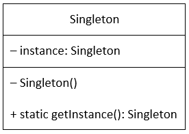
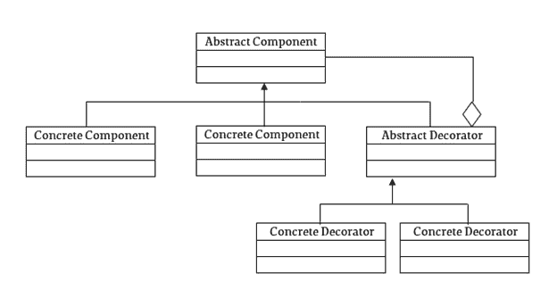
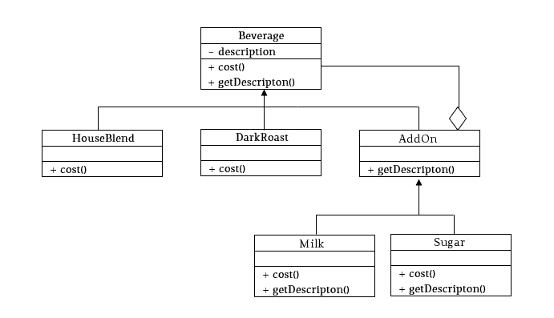
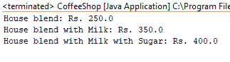
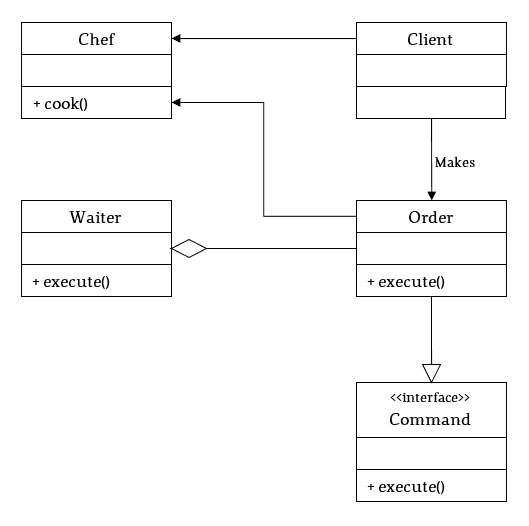

# 所有开发人员都应该知道的 3 种设计模式(每种模式都有代码示例)

> 原文：<https://www.freecodecamp.org/news/the-basic-design-patterns-all-developers-need-to-know/>

# 什么是设计模式？

设计模式是我们软件工程师经常遇到的问题的设计级解决方案。这不是代号——我重复一遍，******代号**** 。它就像是对如何处理这些问题和设计解决方案的描述。**

**使用这些模式被认为是良好的实践，因为解决方案的设计经过了大量的试验和测试，最终代码的可读性更高。设计模式通常是为面向对象的语言(如 Java)创建和使用的，这里的大多数例子都是用 Java 编写的。**

## **设计模式的类型**

**目前发现的模式大约有 26 种(我几乎不认为我会全部做到…)。**

**这 26 种可以分为 3 种类型:**

**1.创造性:这些模式是为类实例化而设计的。它们可以是类创建模式，也可以是对象创建模式。**

**2.结构化:这些模式是针对类的结构和组成而设计的。大多数这些模式的主要目标是增加相关类的功能，而不改变其组成。**

**3.行为:这些模式是根据一个类如何与其他类通信而设计的。**

**在这篇文章中，我们将为每个分类类型介绍一个基本的设计模式。**

## **类型 1:创造型——单例设计模式**

**Singleton 设计模式是一种创造性的模式，它的目标是只创建一个类的实例，并只提供一个到该对象的全局访问点。Java 中这类的一个常用例子是 Calendar，在这种情况下，您不能创建该类的实例。它还使用自己的`getInstance()`方法来获取要使用的对象。**

**使用单例设计模式的类将包括，**

**

Singleton Class Diagram** 

1.  **私有静态变量，保存该类的唯一实例。**
2.  **私有构造函数，因此它不能在其他任何地方实例化。**
3.  **一个公共静态方法，用于返回该类的单个实例。**

**单件设计有许多不同的实现。今天，我将介绍一下。**

**1.急切实例化**

**2.惰性实例化**

**3.线程安全实例化**

### **做事勤奋的人**

```
`public class EagerSingleton {
	// create an instance of the class.
	private static EagerSingleton instance = new EagerSingleton();

	// private constructor, so it cannot be instantiated outside this class.
	private EagerSingleton() {  }

	// get the only instance of the object created.
	public static EagerSingleton getInstance() {
		return instance;
	}
}`
```

**这种类型的实例化发生在类加载期间，因为变量实例的实例化发生在任何方法之外。如果这个类根本没有被客户端应用程序使用，这就造成了一个很大的缺点。如果没有使用这个类，应急计划就是惰性实例化。**

### **懒散的日子**

**与上面的实现没有太大的区别。主要区别在于静态变量最初被声明为 null，并且只有当实例变量在检查时保持为 null 时才在`getInstance()`方法中实例化。**

```
`public class LazySingleton {
	// initialize the instance as null.
	private static LazySingleton instance = null;

	// private constructor, so it cannot be instantiated outside this class.
	private LazySingleton() {  }

	// check if the instance is null, and if so, create the object.
	public static LazySingleton getInstance() {
		if (instance == null) {
			instance = new LazySingleton();
		}
		return instance;
	}
}`
```

**这解决了一个问题，但另一个问题仍然存在。如果两个不同的客户端同时访问 Singleton 类，精确到毫秒，会怎么样？那么，它们将同时检查实例是否为空，并将发现它为真，因此将为两个客户端的每个请求创建该类的两个实例。要解决这个问题，需要实现线程安全实例化。**

### **(螺纹)安全是关键**

**在 Java 中，synchronized 关键字用在方法或对象上以实现线程安全，这样一次只有一个线程可以访问特定的资源。将类实例化放在同步块中，以便在给定时间只能由一个客户端访问该方法。**

```
`public class ThreadSafeSingleton {
	// initialize the instance as null.
	private static ThreadSafeSingleton instance = null;

	// private constructor, so it cannot be instantiated outside this class.
	private ThreadSafeSingleton() {  }

	// check if the instance is null, within a synchronized block. If so, create the object
	public static ThreadSafeSingleton getInstance() {
		synchronized (ThreadSafeSingleton.class) {
			if (instance == null) {
				instance = new ThreadSafeSingleton();
			}
		}
		return instance;
	}
}`
```

**同步方法的开销很高，并且降低了整个操作的性能。**

**例如，如果实例变量已经被实例化，那么每次任何客户端访问`getInstance()`方法时，都会运行`synchronized`方法，性能会下降。这只是为了检查`instance`变量的值是否为空。如果它发现是，它就离开这个方法。**

**为了减少这种开销，使用了双重锁定。该检查也在`synchronized`方法之前使用，如果值单独为空，则`synchronized`方法运行。**

```
`// double locking is used to reduce the overhead of the synchronized method
public static ThreadSafeSingleton getInstanceDoubleLocking() {
	if (instance == null) {
		synchronized (ThreadSafeSingleton.class) {
			if (instance == null) {
				instance = new ThreadSafeSingleton();
			}
		}
	}
	return instance;
}`
```

**现在进入下一个分类。**

## **类型 2:结构化——装饰者设计模式**

**我将给出一个小场景来更好地解释为什么以及在哪里应该使用装饰模式。**

**假设你拥有一家咖啡店，像任何一个新手一样，你开始只喝两种纯咖啡，自制混合咖啡和黑咖啡。在您的计费系统中，不同的咖啡混合物有一个类，它继承了 beverage 抽象类。人们实际上开始来了，有你美好的(虽然苦？)咖啡。然后是咖啡新手，上帝保佑，想要糖或牛奶。这是对咖啡的嘲弄！！？？**

**现在你还需要这两个附加组件，既要添加到菜单上，不幸的是还要添加到计费系统上。最初，您的 IT 人员将为这两种咖啡创建一个子类，一种包括糖，另一种是牛奶。然后，由于顾客永远是对的，人们会说这些可怕的话:**

*****“我可以要一杯牛奶咖啡吗，加糖吗？”*****

### **？？？**

**你的计费系统又在嘲笑你了。好吧，回到制图板…**

**然后，IT 人员将加糖牛奶咖啡作为另一个子类添加到每个父咖啡类中。这个月剩下的日子一帆风顺，人们排队喝你的咖啡，你实际上在赚钱。？？**

**但是等等，还有呢！**

**世界又一次与你为敌。一家竞争对手在街对面开张了，不仅有 4 种咖啡，还有 10 多种附加产品！**

**你买了所有这些东西，甚至更多，是为了自己卖更好的咖啡，这时你才想起你忘了更新那个该死的账单系统。你很可能无法为所有附加组件的任何和所有组合创建无限数量的子类，新的咖啡混合物也是如此。更不用说最终系统的大小了。**

**是时候投资一个合适的计费系统了。你找到新的 IT 人员，他们实际上知道他们在做什么，他们说，**

*****“为什么，如果它使用装饰者模式，这将会更容易和更小。”*****

### **那究竟是什么？**

**装饰器设计模式属于结构类，它处理一个类的实际结构，无论是通过继承、组合还是两者。这种设计的目标是在运行时修改对象的功能。这是许多其他设计模式中的一种，它们利用抽象类和接口进行组合来获得想要的结果。**

**给数学一个机会吧(颤栗？)把这一切放在一个角度来看。**

**取 4 种混合咖啡和 10 种配料。如果我们坚持为一种咖啡的所有附加组件的每个不同组合生成子类。那就是:**

**(10–1)= 9 = 81 个子类**

**我们从 10 中减去 1，因为你不能将一个附加品与另一个相同类型的附加品组合，糖加糖听起来很愚蠢。这只是一种混合咖啡的价格。将那个 ****81 乘以 4 个**** ，你会得到一个庞大的 ****324 个**** 不同的子类！谈论所有那些编码…**

**但是使用装饰模式，在这个场景中只需要 16 个类。想打赌吗？**

**

Decorator Design Pattern Class diagram** **

Class diagram according to coffee shop scenario** 

**如果我们根据上面的类图来规划我们的场景，我们得到 4 个咖啡混合物的 4 个类，每个附加组件 10 个，抽象组件 1 个，抽象装饰器 1 个。看吧！16!现在把那 100 美元交出来。？？(jk，但是给了也不会拒绝…随便说说)**

**从上面可以看出，正如混凝土咖啡混合物是 beverage 抽象类的子类一样，AddOn 抽象类也继承了它的方法。作为其子类的附加组件又继承了任何新方法，以便在需要时向基本对象添加功能。**

**让我们开始编码，看看这种模式在使用中。**

**首先创建抽象的饮料类，所有不同的咖啡混合将继承:**

```
`public abstract class Beverage {
	private String description;

	public Beverage(String description) {
		super();
		this.description = description;
	}

	public String getDescription() {
		return description;
	}

	public abstract double cost();
}`
```

**然后添加两个具体的 coffee blend 类。**

```
`public class HouseBlend extends Beverage {
	public HouseBlend() {
		super(“House blend”);
	}

	@Override
	public double cost() {
		return 250;
	}
}

public class DarkRoast extends Beverage {
	public DarkRoast() {
		super(“Dark roast”);
	}

	@Override
	public double cost() {
		return 300;
	}
}`
```

**AddOn 抽象类也继承了 Beverage 抽象类(下面会详细介绍)。**

```
`public abstract class AddOn extends Beverage {
	protected Beverage beverage;

	public AddOn(String description, Beverage bev) {
		super(description);
		this.beverage = bev;
	}

	public abstract String getDescription();
}`
```

**现在是这个抽象类的具体实现:**

```
`public class Sugar extends AddOn {
	public Sugar(Beverage bev) {
		super(“Sugar”, bev);
	}

	@Override
	public String getDescription() {
		return beverage.getDescription() + “ with Mocha”;
	}

	@Override
	public double cost() {
		return beverage.cost() + 50;
	}
}

public class Milk extends AddOn {
	public Milk(Beverage bev) {
		super(“Milk”, bev);
	}

	@Override
	public String getDescription() {
		return beverage.getDescription() + “ with Milk”;
	}

	@Override  public double cost() {
		return beverage.cost() + 100;
	}
}`
```

**正如你在上面看到的，我们可以将 Beverage 的任何子类传递给 AddOn 的任何子类，并获得增加的成本以及更新的描述。而且，由于 AddOn 类本质上是饮料类型，我们可以将一个 AddOn 传递给另一个 AddOn。这样，我们可以在特定的咖啡混合物中添加任意数量的添加物。**

**现在编写一些代码来测试这一点。**

```
`public class CoffeeShop {
	public static void main(String[] args) {
		HouseBlend houseblend = new HouseBlend();
		System.out.println(houseblend.getDescription() + “: “ + houseblend.cost());

		Milk milkAddOn = new Milk(houseblend);
		System.out.println(milkAddOn.getDescription() + “: “ + milkAddOn.cost());

		Sugar sugarAddOn = new Sugar(milkAddOn);
		System.out.println(sugarAddOn.getDescription() + “: “ + sugarAddOn.cost());
	}
}`
```

**最后的结果是:**

**

P.S. this is in Sri Lankan Rupees** 

**有用！我们能够向咖啡混合物添加多个附加组件，并成功更新其最终成本和描述，而无需为所有咖啡混合物的每个附加组件组合创建无限个子类。**

**最后，到最后一类。**

## **类型 3:行为——命令设计模式**

**行为设计模式关注的是类和对象如何相互通信。命令模式的主要焦点是在相关方之间灌输更高程度的松散耦合(理解为:类)。**

*****嗯嗯……那是什么？*****

**耦合是两个(或更多)类相互作用的方式。当这些类相互作用时，理想的情况是它们不严重依赖彼此。这就是松耦合。因此，松散耦合的一个更好的定义应该是，相互连接的类，最少地利用彼此。**

**当需要发送请求而不知道自己在请求什么或者接收者是谁时，就需要这种模式。**

**在这种模式中，调用类与实际执行动作的类是分离的。invoker 类只有可调用的方法 execute，当客户端请求时，它运行必要的命令。**

**让我们举一个现实世界中的基本例子，在一家高级餐厅点餐。按照流程，你把你点的菜(命令)交给服务员(调用者)，服务员再把它交给厨师(接收者)，这样你就可以拿到食物了。听起来可能很简单…但是编码起来有点困难。**

****

**这个想法很简单，但是编码围绕着鼻子。**

**

Command Design Pattern Class Diagram** 

**技术端的操作流程是，你做一个具体的命令，这个命令实现了命令接口，要求接收者完成一个动作，把命令发送给调用者。调用者是知道何时发出这个命令的人。当接到具体的命令时，厨师是唯一知道该做什么的人。因此，当调用程序的 execute 方法运行时，它又会导致命令对象的 execute 方法在接收程序上运行，从而完成必要的操作。**

### **我们需要实现的是:**

1.  **界面命令**
2.  **实现命令接口的类顺序**
3.  **班级服务员(调用者)**
4.  **一级厨师(接球手)**

**因此，编码是这样的:**

### **主厨，接收器**

```
`public class Chef {
	public void cookPasta() {
		System.out.println(“Chef is cooking Chicken Alfredo…”);
	}

	public void bakeCake() {
		System.out.println(“Chef is baking Chocolate Fudge Cake…”);
	}
}`
```

### **命令，界面**

```
`public interface Command {
	public abstract void execute();
}`
```

### **命令，具体的命令**

```
`public class Order implements Command {
	private Chef chef;
	private String food;

	public Order(Chef chef, String food) {
		this.chef = chef;
		this.food = food;
	}

	@Override
	public void execute() {
		if (this.food.equals(“Pasta”)) {
			this.chef.cookPasta();
		} else {
			this.chef.bakeCake();
		}
	}
}`
```

### **服务员，开发票的**

```
`public class Waiter {
	private Order order;

	public Waiter(Order ord) {
		this.order = ord;
	}

	public void execute() {
		this.order.execute();
	}
}`
```

## **你，客户**

```
`public class Client {
	public static void main(String[] args) {
		Chef chef = new Chef();

		Order order = new Order(chef, “Pasta”);
		Waiter waiter = new Waiter(order);
		waiter.execute();

		order = new Order(chef, “Cake”);
		waiter = new Waiter(order);
		waiter.execute();
	}
}`
```

**正如你在上面看到的，客户下订单，把收货人设置为厨师。将订单发送给服务员，服务员将知道何时执行订单(即何时向厨师下达烹饪订单)。当调用程序被执行时，订单的执行方法在接收程序上运行(也就是说，厨师被命令要么做意大利面？还是烤蛋糕？).**

**

Final Client Output** 

## **快速回顾**

**在这篇文章中，我们回顾了:**

1.  **设计模式到底是什么，**
2.  **设计模式的不同类型以及它们不同的原因**
3.  **每种类型都有一个基本或通用的设计模式**

**我希望这有所帮助。**

**找到帖子的代码 repo，[这里](https://github.com/samsam-026/Design_Patterns)。**