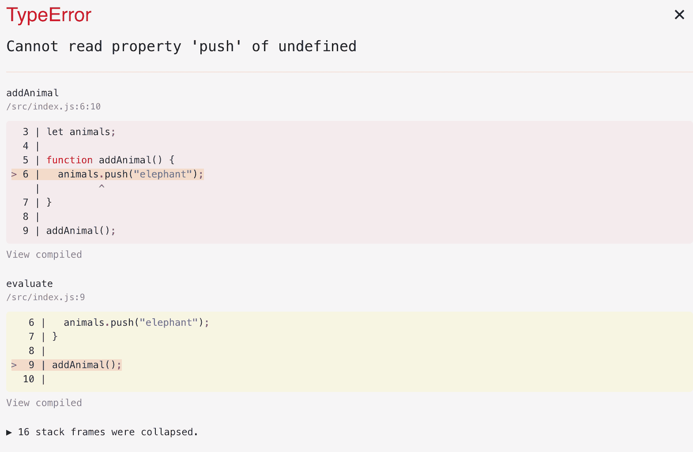
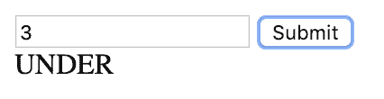
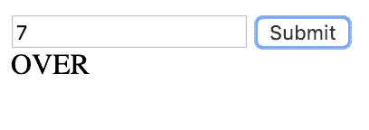
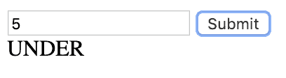
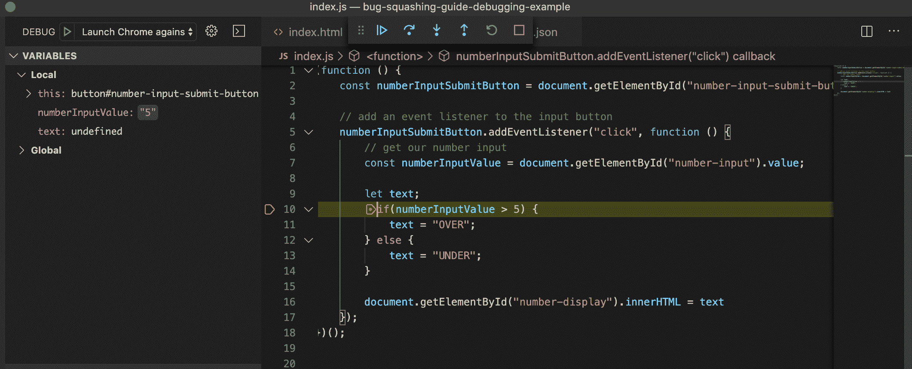
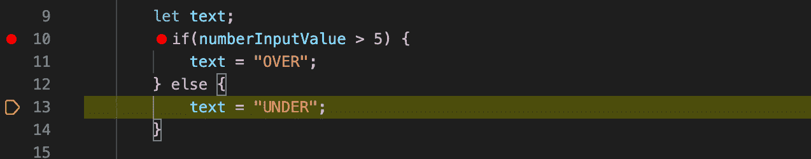

# Bug 挤压初学者指南:如何使用你的调试器和其他工具找到并修复 Bug

> 原文：<https://www.freecodecamp.org/news/the-beginner-bug-squashing-guide/>

作为 web 开发人员，我们经常感觉花在修复 bug 和试图解决问题上的时间比写代码还多。在本指南中，我们将了解一些常见的调试技术，所以让我们开始吧。

### “没有准备，准备失败”

还有什么比用陈词滥调开始一篇文章更好的方式呢？Bug 和问题将会出现。这是无法避免的(抱歉)。通过一些简单的计划，我们有办法最大限度地减少我们面临的问题的复杂性和数量。

## 把任务分成更小的任务

现在，我明白了，我们都喜欢变得非常兴奋，直接投入到我们的编码项目中。问题是，没有某种计划，我们甚至在开始之前就给自己制造了问题！

如果我对你说，“你必须建立一个购物清单应用”，你马上开始编码，会发生什么？你最终会盯着一个闪烁的光标，不知道该怎么做或先做什么，低声诅咒我的名字，因为我让你做这样的任务。

把一个大问题分解成许多小问题总是更容易。例如，我们可以将购物清单项目分解成更小的任务:

*   创建表单以向列表中添加项目
*   允许用户从列表中删除项目
*   显示列表中项目的总数

你甚至可以把这些任务分解成更详细的任务。例如，对于我们列表中的第一个任务，我们的第一个“小迷你任务”(我应该注册这个术语吗？)可能是:

1)创建一个输入字段来获取项目名称

2)创建一个按钮，点击后调用函数`addToList()`

3)在将项目添加到列表的`addToList()`函数中编写逻辑

诸如此类。你明白了。我更喜欢像这样分解工作，因为在我写任何代码之前，它真的让我思考我将在早期遇到的问题和解决方案([我已经在这里写了一篇关于这个的深入文章](https://www.freecodecamp.org/news/a-walk-through-the-developer-thought-process/))。它还帮助我了解我正在努力做什么，并让我进入“状态”。当你明白你想要达到的目标时，解决出现的问题就容易多了。

## 准备好清除你的代码

要做煎蛋卷，我们必须打破几个鸡蛋。这意味着要准备好完全重写我们的代码，让它正常工作。

我敢打赌，你一定在想，“天哪，我花了几天/几周/几千年才写了这么多代码，现在我不得不删除它？!"嗯，是啊。有时候。抱歉。web 开发的现实是，由于各种原因——错误、代码审查、需求变化、厌倦等，代码会一直变化。

有时候，我们觉得自己的代码如此珍贵，以至于不忍心删除它，以至于我们试图通过“把圆钉装进方孔”来尝试和克服问题。我们认为“NOO！我不可能删除这个方法。我花了很长时间。一定有办法的！”这种心理障碍导致了我们自己的问题——因为通过简单地重写我们现有的东西，我们可以找到解决问题的方法。

现在我们已经准备好了，让我们看看当事情出错时会发生什么。

## 错误消息是好的

当出现问题时，比看到错误消息更糟糕的是什么？出现问题时，看不到任何错误消息。尽管当我们运行精心制作的代码时，看到一个大的红色堆栈跟踪会让人感到畏惧，但错误消息会告诉我们“是的，事情现在变得一团糟，但这里有一些地方你可以开始修复它”。

如果我们看一下这个例子:

```
let animals;

function addAnimal(){
	animals.push('elephant');
}

addAnimal();
```

现在让我们来看看错误:

```
TypeError: Cannot read property 'push' of undefined
at addAnimal (https://vanilla.csb.app/src/index.js:8:11) 
at evaluate (https://vanilla.csb.app/src/index.js:11:1) 
at $n (https://codesandbox.io/static/js/sandbox.acff3316.js:1:148704)
```

Hmmm yep makes sense to me! Thanks error message! **Distraught face**

我省略了一些堆栈跟踪，因为大部分都是乱码。根据前端项目处理错误消息的方式，您甚至可以在浏览器中看到错误:



Look at that beauty of an error!

堆栈跟踪的重要部分通常在顶部——消息、函数和行号，我们的浏览器也显示了这一点。所以翻译会尽最大努力告诉我们出了什么问题。很遗憾它不能为我们解决问题，嗯？

因此，我们已经完成了看到错误时的恐慌发作，并从错误消息中提取了一些信息。如果我们把它分解，我们可以看到这条线:

```
Cannot read property 'push' of undefined
```

这通常意味着某处有一个变量没有定义或初始化。但是在哪里？！？

如果我们继续读取堆栈跟踪，我们会看到错误发生在`addAnimal()`函数中。我们可以看到，我们正试图将一个新的动物推到一个数组中——啊！我忘了初始化`animals`数组。多。我们的固定代码看起来像这样:

```
let animals = [];

function addAnimal() {
	animals.push("elephant");
}

addAnimal();
```

浏览器中抛出的错误将更快地向您显示问题，但不是所有前端项目都将配置为这样做，后端开发人员没有这种奢侈。这就是为什么我建议学习读取堆栈跟踪。

## 要打败虫子，你必须像虫子一样思考

堆栈跟踪让您知道错误是什么。嗯，有时会，有时不会。如果您看到一个看起来更像洞穴象形文字而不是英语的错误消息，该怎么办？或者，如果没有错误，但是您的代码并不像您想象的那样运行，该怎么办？

是时候把调试器拿出来了。让我们看另一个例子。但首先有一些背景！

鲍勃先生首席执行官(谁是首席执行官，谁会想到？！)走近你说，

“嘿，我有一个惊人的产品创意。

*   我想要一个 web 应用程序，允许用户输入一个数字。
*   如果数量少于 5，消息应显示为“不足”。
*   如果数字等于或大于 5，消息应显示“结束”。

这是一个价值百万美元的想法，我希望你能为我实现它”。

“好的！”你说，然后你开始工作。

****编码蒙太奇随着时间快进播放戏剧音乐****

您已经完成了 web 应用程序的代码。万岁。

```
<!doctype html>

<html lang="en">
<head>
  <meta charset="utf-8">

  <title>My super awesome number app</title>
  <meta name="description" content="The HTML5 Herald">
  <meta name="author" content="SitePoint">

</head>

<body>
    <input id="number-input"></input> <button id="number-input-submit-button">Submit</button>
    <div id="number-display">0</div>
    <script src="./index.js" type="text/javascript"></script>
</body>
</html>
```

Here's our glorious HTML

```
(function () {
    const numberInputSubmitButton = document.getElementById("number-input-submit-button")

    numberInputSubmitButton.addEventListener("click", function () {

        const numberInputValue = document.getElementById("number-input").value;

        let text;
        if(numberInputValue > 5) {
            text = "OVER";
        } else {
            text = "UNDER";
        }

        document.getElementById("number-display").innerHTML = text
    });
})(); 
```

And here's our slightly less glorious, more buggy JavaScript

(注意:你可能已经发现了这个错误。如果你有，让我们假装你没有。如果你没有注意到这个 bug，没关系。)

开始测试的时间到了。让我们为我们的业务逻辑浏览一些用例。

1)用户输入 3:



2)用户输入 7



到目前为止一切顺利！但是如果我们输入 5 会发生什么？



哦不！一只虫子！显示的文字不正确，应该是在上面显示**，而在**下面显示**。嗯，没有错误消息，而且我似乎看不出代码中有什么错误。让我们运行调试器并单步调试代码。**

### 使用调试器



Note the "variables" panel on the left - this can be a life saver

一个好的起点是将**断点放在尽可能靠近有问题代码的地方。**您可以通过阅读代码、错误消息来确定这一点，或者如果您有“*啊哈！* *我知道是哪种方法导致了这个*“时刻。从这里开始，就是逐步执行代码，检查变量，并检查是否运行了正确的代码分支。

在我们的例子中，我在我的`if statement`的开头放了一个断点——因为这是失败的逻辑所在。

一旦我开始调试，chrome 就会打开，我可以通过输入“5”并点击提交来复制这个问题。这碰到了断点，立即有几件事需要注意:

*   调试器在断点处停止，所以这意味着我在正确的轨道上
*   这也意味着函数被正确调用，事件处理程序按预期工作
*   我还可以看到用户输入被正确捕获(从左侧的“variables”面板，我可以看到输入了“5”)

到目前为止一切顺利，没有需要担心的紧迫问题。好吧，反正是代码相关的。接下来，我将按下 **F10 来浏览代码**。这将单独运行每条语句，允许我们按照自己的速度检查元素、变量和其他东西。科技难道不令人难以置信吗？

请记住，由于我希望当用户输入“5”时会出现消息“OVER ”,所以我希望调试器会带我进入 if 语句的第一个分支...



但是没有！我被带进了第二个分支。为什么？我需要将条件式修改为"**大于或等于"**，而不是**“大于”。**

```
if(numberInputValue >= 5) {
	text = "OVER";
} else {
	text = "UNDER";
}
```

成功！我们的问题已经解决了。希望这能让您了解如何使用 VSCodes 强大的调试工具遍历代码。

## 更多调试技巧

*   如果您的断点没有被命中，这可能是问题的一部分。确保以您期望的方式调用了正确的函数或事件处理程序
*   您可以`step over`想要跳过的功能。如果您想调试遇到的任何函数，请使用`step into`命令
*   在单步执行代码时，请注意变量、参数和实参。价值观是你所期望的吗？
*   以更容易阅读/调试的方式编写代码。将您的代码放在一行可能看起来很酷，但是这使得调试更加困难

### 谷歌是你的朋友

好了，我们已经查看了堆栈跟踪，尝试了调试，但仍然被这个 bug 困扰着。现在唯一剩下要做的就是向编码之神做出牺牲，并希望事情自己解决！

或者我想我们可以用谷歌。

Google 是软件开发问题和解决方案的宝库，一切尽在我们的指尖。不过，获取这些信息可能有点困难，因为你必须知道如何谷歌正确的东西来获得正确的信息！那么我们如何有效地使用谷歌呢？

让我们回头看看我们的第一个例子——您已经阅读了堆栈跟踪，查看了代码，但是消息`Cannot read property 'push' of undefined`仍然让您抓狂。不知所措的你求助于谷歌，希望能找到答案。以下是一些可以尝试的事情:

**复制并粘贴错误信息。**有时这是可行的，这取决于错误消息的“一般性”程度。例如，如果你得到一个**空指针异常**(谁不喜欢那些？)，谷歌“空指针异常”可能不会返回非常有用的结果。

搜索你正在尝试做的事情。比如*“如何创建一个数组并添加一个项到最后”*。例如，您可能会发现一些慷慨的开发人员在 StackOverflow 上发布了一个使用最佳实践的解决方案。您可能还会发现这个解决方案与您的完全不同——还记得我说过的轻松清除代码吗？

关于使用别人代码的一个旁注——试着避免盲目的复制和粘贴，确保你首先理解代码是做什么的！

### 以正确的方式寻求帮助

希望经过调试、堆栈跟踪调查和 Googling 搜索，您已经看到了隧道尽头的曙光，并解决了您的问题。不幸的是，根据你想做的事情，你可能还是会有点困惑。这是向他人寻求建议的好时机。

现在，在你跑到街上大喊“我的代码坏了，请帮帮我！”知道寻求帮助的最佳方式很重要。用正确的方式寻求帮助，让别人更容易理解问题，帮助你解决问题。让我们看一些例子:

**坏**——“我的代码坏了，不知道哪里出了问题。”

**好的**--“我试图在 JavaScript 中将一个项目添加到一个数组的末尾，我得到了这个错误消息:无法读取 undefined 的属性‘push’。这是我目前为止的代码。”

看看“好”的例子是如何提供更多信息的？更多的信息让其他好心的开发者更容易帮助你。这是一个需要养成的好习惯，因为它不仅在你学习编码时对你有益，而且在你的第一份工作中需要寻求帮助时也对你有益。

那么你可以从哪里寻求帮助呢？

*   StackOverflow
*   推特
*   松弛组
*   同事或开发者朋友

快速提示:你可以使用类似于 [CodeSandbox.io](https://www.freecodecamp.org/news/the-beginner-bug-squashing-guide/codesandbox.io) 或 [CodePen.io](https://www.freecodecamp.org/news/the-beginner-bug-squashing-guide/codepen.io) 的工具重现你的问题并与人分享。

### 练习，练习，练习

就像罗马不是一天建成的(嗯，据我所知，可能是一天建成的)你也不会在一夜之间成为臭虫王。随着职业生涯的继续和经验的增长，您将拥有丰富的知识来帮助您更快地解决 bug 和问题。我经常发现自己说“啊，我以前解决过这个问题”或“哦，是的，我有一个 StackOverflow 链接，它可以帮助我”，整个事情就变得容易多了。所以坚持练习，这个技能自然会增长。

感谢阅读！如果你喜欢这篇文章，[为什么不订阅我的简讯](https://subscribe.chrisblakely.dev/)？

每周我都会发一份我认为值得分享的 10 件事的清单——我的最新文章、教程、技巧和有趣的链接，给像你这样的未来开发者。我也时不时的发一些免费的东西:)