# Git & GitHub 初学者指南

> 原文：<https://www.freecodecamp.org/news/the-beginners-guide-to-git-github/>

# **Git 是什么？**

Git 是一个免费的开源版本控制软件。它是由莱纳斯·托沃兹在 2005 年创建的。这个工具是一个版本控制系统，最初是为了与几个开发人员一起开发 Linux 内核而开发的。

这基本上意味着 Git 是一个内容跟踪器。所以 Git 可以用来存储内容——由于它提供的其他特性，它主要用于存储代码。

现实生活中的项目通常有多个开发人员并行工作。所以他们需要 Git 这样的版本控制系统来确保他们之间没有代码冲突。

此外，这类项目中的需求经常变化。因此，版本控制系统允许开发人员返回到他们代码的旧版本。

Git 中的分支系统允许开发人员在一个任务上单独工作(例如:一个分支->一个任务或者一个分支->一个开发人员)。如果你是开发人员，基本上可以把 Git 看作是一个控制你的代码库的小软件应用程序。

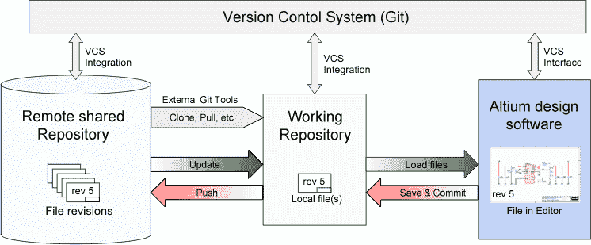

Shows how Git works

# **Git 仓库**

如果我们想开始使用 Git，我们需要知道在哪里托管我们的存储库。

存储库(或简称为“Repo ”)是一个包含多个文件的项目。在我们的例子中，存储库将包含基于代码的文件。

有两种方法可以托管存储库。一个是在线的(在云上)，第二个是离线的(在你的服务器上自行安装)。

有三种流行的 Git 托管服务:GitHub(归微软所有)、GitLab(归 GitLab 所有)和 BitBucket。我们将使用 GitHub 作为我们的托管服务。

# 在使用 Git 之前，我们应该知道我们为什么需要它

### Git 使得为开源项目做贡献变得很容易

几乎每个开源项目都使用 GitHub 来管理他们的项目。如果您的项目是开源的，使用 GitHub 是免费的，它包括一个 wiki 和问题跟踪器，可以很容易地包含更深入的文档并获得关于您项目的反馈。

如果你想做贡献，你只需要派生一个项目，进行修改，然后使用 GitHub 的 web 界面向项目发送一个 pull 请求。这个拉请求是你告诉项目你已经准备好让他们评审你的变更的方式。

### 证明文件

通过使用 GitHub，您可以更容易地获得优秀的文档。他们的帮助部分和指南包含了您能想到的几乎任何与 Git 相关的主题的文章。

### 集成选项

GitHub 可以与 Amazon 和 Google Cloud 等常见平台集成，并提供 Code Climate 等服务来跟踪您的反馈，并可以突出显示 200 多种不同编程语言的语法。

### 跨版本跟踪代码中的更改

当多人在一个项目上协作时，很难跟踪修订情况——谁更改了什么、何时以及在哪里存储了这些文件。

GitHub 通过跟踪所有被推送到存储库的变更来解决这个问题。

就像使用 Microsoft Word 或 Google Drive 一样，您可以拥有代码的版本历史，这样以前的版本就不会随着每次迭代而丢失。很容易回到以前的版本，贡献你的作品。

### 展示你的作品

你是一个希望吸引招聘者的开发者吗？GitHub 是你可以信赖的最好的工具。

如今，在为他们的项目寻找新员工时，大多数公司都会查看 GitHub 的简介。如果你的个人资料是可用的，即使你不是来自一所著名的大学或学院，你也有更高的机会被录用。

# 现在我们将学习如何使用 Git & GitHub

### GitHub 帐户创建

要创建您的帐户，您需要访问 [GitHub](https://github.com/) 的网站并填写注册表格。


GitHub official web page

### Git 安装

现在我们需要在我们的计算机上安装 Git 的工具。我们将使用 CLI 与 GitHub 通信。

对于 Ubuntu:

1.  首先，更新你的软件包。

```
sudo apt update
```

2.接下来，用 apt-get 安装 Git 和 GitHub

```
sudo apt-get install git
```

3.最后，验证 Git 安装是否正确

```
git --version
```

4.使用您的信息运行以下命令，在您准备保存工作时设置默认用户名和电子邮件。

```
git config --global user.name "MV Thanoshan"
git config --global user.email "example@mail.com"
```

# **使用 GitHub 项目**

我们将以两种方式使用 GitHub 项目。

### 类型 1:创建存储库，将其克隆到您的 PC 上，并对其进行处理。(推荐)

第一类包括在 GitHub 上创建一个全新的资源库，将其克隆到我们的计算机上，处理我们的项目，然后将其推回。

点击 GitHub 网页上的“new repository”按钮，创建一个新的资源库。

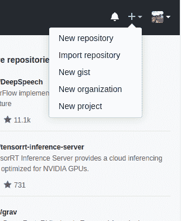

为您的第一个存储库选择一个名称，添加一个简短的描述，选中“用自述文件初始化此存储库”框，然后单击“创建存储库”按钮。

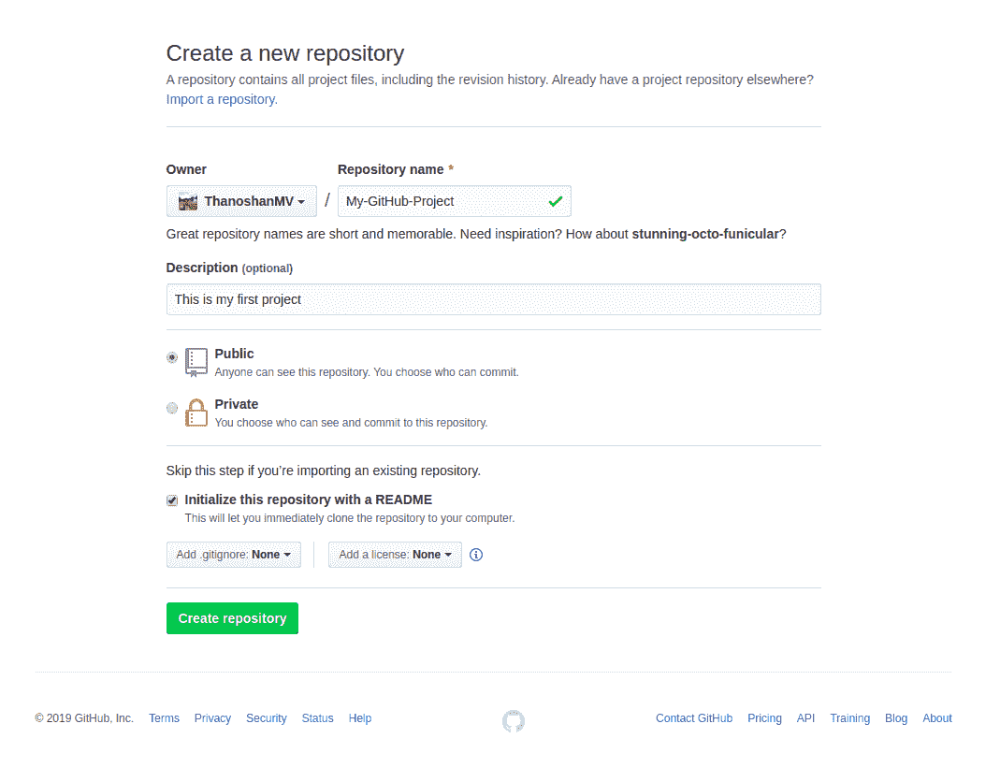

干得好！您的第一个 GitHub 存储库已经创建。

您的第一个任务是在您的计算机上获得存储库的副本。为此，您需要在您的计算机上“克隆”存储库。

克隆存储库意味着您将服务器上的存储库克隆到您的计算机上，就像下载它一样。在存储库页面上，您需要获得“HTTPS”地址。

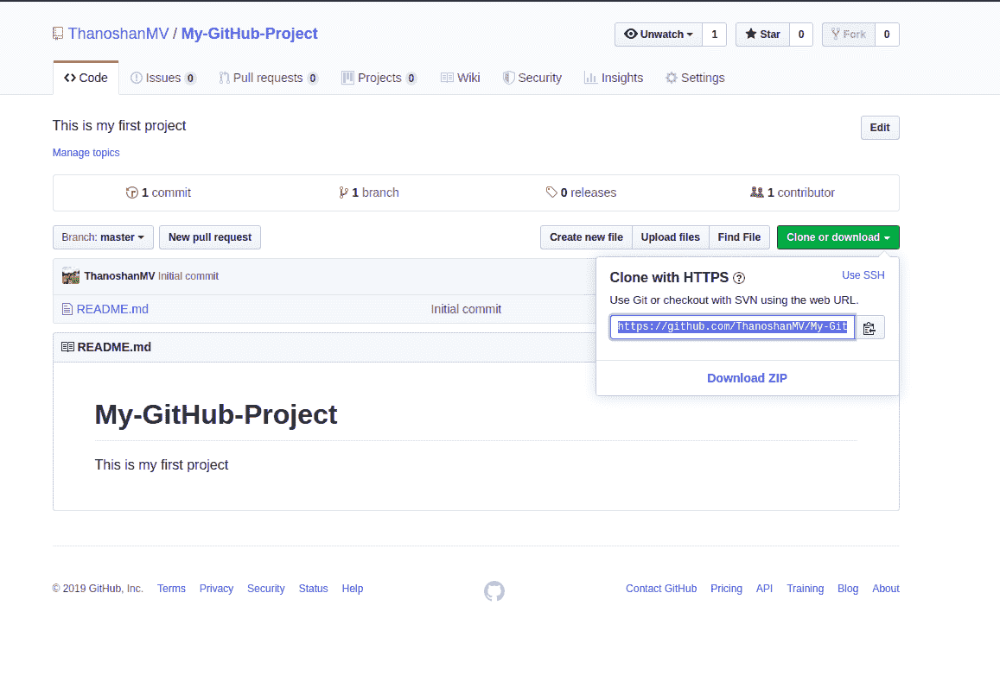

一旦您有了存储库的地址，您就需要使用您的终端。在您的终端上使用以下命令。准备好之后，您可以输入:

```
git clone [HTTPS ADDRESS]
```

该命令将在给定地址创建存储库的本地副本。

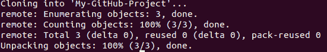

Output message of “git clone” command

现在，您的存储库在您的计算机上。您需要使用下面的命令来移动它。

```
cd [NAME OF REPOSITORY]
```

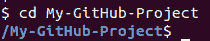

正如你在上面的图片中看到的，我的库名是“My-GitHub-Project ”,这个命令让我转到那个特定的目录。

**注意:** 当你克隆的时候，Git 会在你的电脑上创建一个资源库。如果您愿意，您可以使用计算机用户界面来访问您的项目，而不是在终端上使用上面的“cd”命令。

现在，在该文件夹中，我们可以创建文件，处理它们，并将其保存在本地。为了将它们保存在远程位置——比如 GitHub——我们需要一个叫做“提交”的过程。为此，请回到您的终端。如果你关闭了它，就像我之前说的，使用“cd”命令。

```
cd [NAME OF REPOSITORY]
```

现在，在终端中，您位于您的存储库目录中。提交有 4 个步骤:“状态”、“添加”、“提交”和“推送”。以下所有步骤都必须在您的项目中执行。让我们一个一个地看。

1.  “状态”:你要做的第一件事就是检查你修改过的文件。为此，您可以键入以下命令来显示更改列表。

```
git status
```

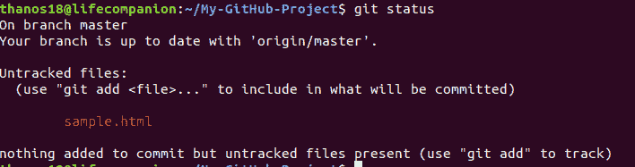

2.“添加”:在更改列表的帮助下，您可以使用以下命令添加您想要上传的所有文件，

```
git add [FILENAME] [FILENAME] [...]
```

在我们的例子中，我们将添加一个简单的 HTML 文件。

```
git add sample.html
```

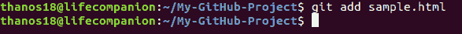

3.“提交”:现在我们已经添加了我们选择的文件，我们需要写一条消息来解释我们所做的事情。如果我们想要检查更改历史，此消息可能会有用。这里有一个例子，说明我们可以把什么放在我们的案例中。

```
git commit -m "Added sample HTML file that contain basic syntax"
```

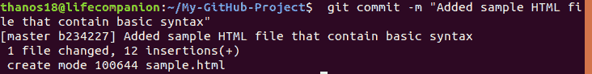

4.“推”:现在可以把作品放到 GitHub 上了。为此，我们必须将文件“推送”到远程。Remote 是我们的存储库的一个复制实例，它位于远程服务器上的某个地方。要做到这一点，我们必须知道遥控器的名字(大部分遥控器被命名为 origin)。要找出该名称，请键入以下命令。

```
git remote
```

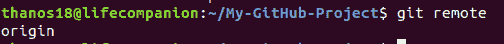

正如你在上面的图像中看到的，它说我们的遥控器的名字是 origin。现在，我们可以通过下面的命令安全地“推进”我们的工作。

```
git push origin master
```

现在，如果我们去我们在 GitHub 网页上的存储库，我们可以看到我们已经推送到远程的 sample.html 文件——GitHub！

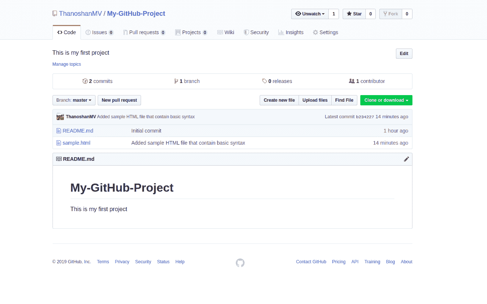

**注意**:有时当你在终端中使用 Git 命令时，它会把你带到 VIM 文本编辑器(一个基于 CLI 的文本编辑器)。所以要摆脱它，你必须打字

```
:q
```

然后进入。

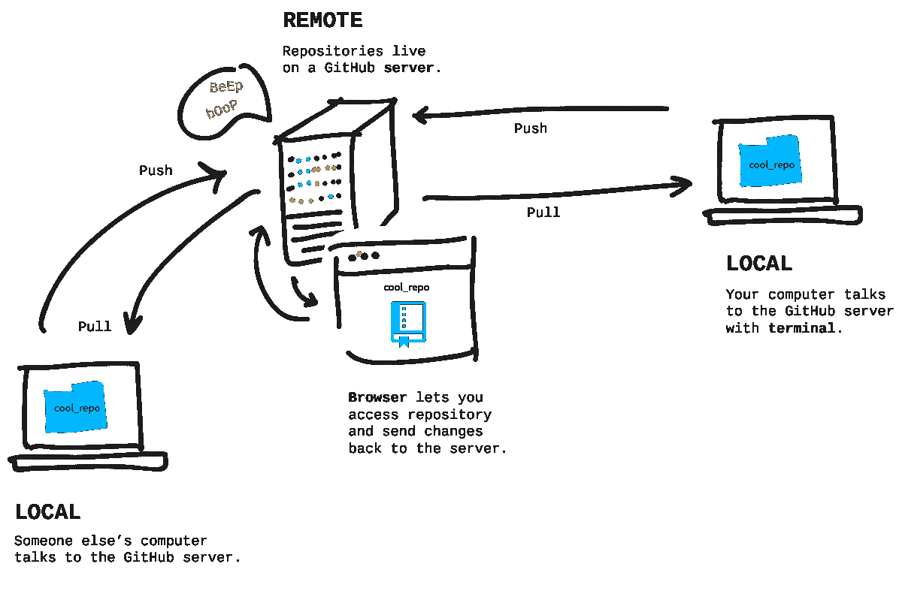

Describes how pull & push work

拉是从 GitHub 接收的行为。

推送是发送到 GitHub 的行为。

### 类型 2:在本地处理您的项目，然后在 GitHub 上创建存储库，并将其推送到远程。

Type 2 允许你从我们电脑上的现有文件夹中创建一个新的存储库，并将其发送到 GitHub。在很多情况下，你可能已经在你的电脑上做了一些东西，你想突然变成 GitHub 上的一个仓库。

我将用一个我之前做的没有添加到 GitHub 中的调查表单 web 项目来解释这一点。

正如我已经提到的，当执行任何 Git 命令时，我们必须确保我们在终端的正确目录中。


默认情况下，我们计算机上的任何目录都不是 Git 存储库——但是我们可以通过在终端中执行以下命令将它转换成 Git 存储库。

```
git init
```

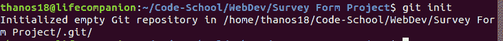

在将我们的目录转换成 Git 存储库之后，我们需要做的第一件事是使用下面的命令检查我们拥有的文件。

```
git status
```

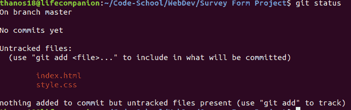

因此，该目录中有两个文件需要“添加”到我们的 Repo 中。

```
git add [FILENAME] [FILENAME] [...]
```

**注意**:要“添加”我们存储库中的所有文件，我们可以使用以下命令:

```
git add .
```

在 staging area(添加过程)完成后，我们可以通过执行`git status`来检查文件是否被成功添加

如果那些特定的文件是绿色的，就像下图所示，你已经完成了你的工作！

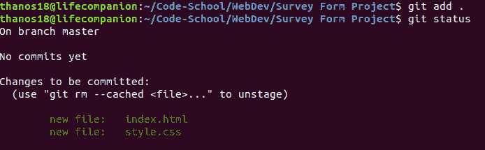

然后我们必须“提交”一个描述。

```
git commit -m "Adding web Survey form"
```

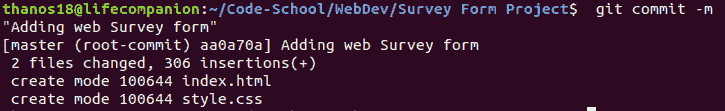

如果我的存储库是在 GitHub 上启动的，并且我把它带到了我的计算机上，那么它已经被连接了一个远程设备(类型 1)。但是如果我在我的计算机上启动我的存储库，它没有与之相关联的远程，所以我需要添加那个远程(类型 2)。

所以要添加那个遥控器，我们得先去 GitHub。创建一个新的存储库，并将其命名为任何您想存储在 GitHub 中的名称。然后单击“创建存储库”按钮。

**注意**:在 Type 2 中，在 GitHub 网页上创建新的资源库时，请不要用 README 文件初始化资源库。

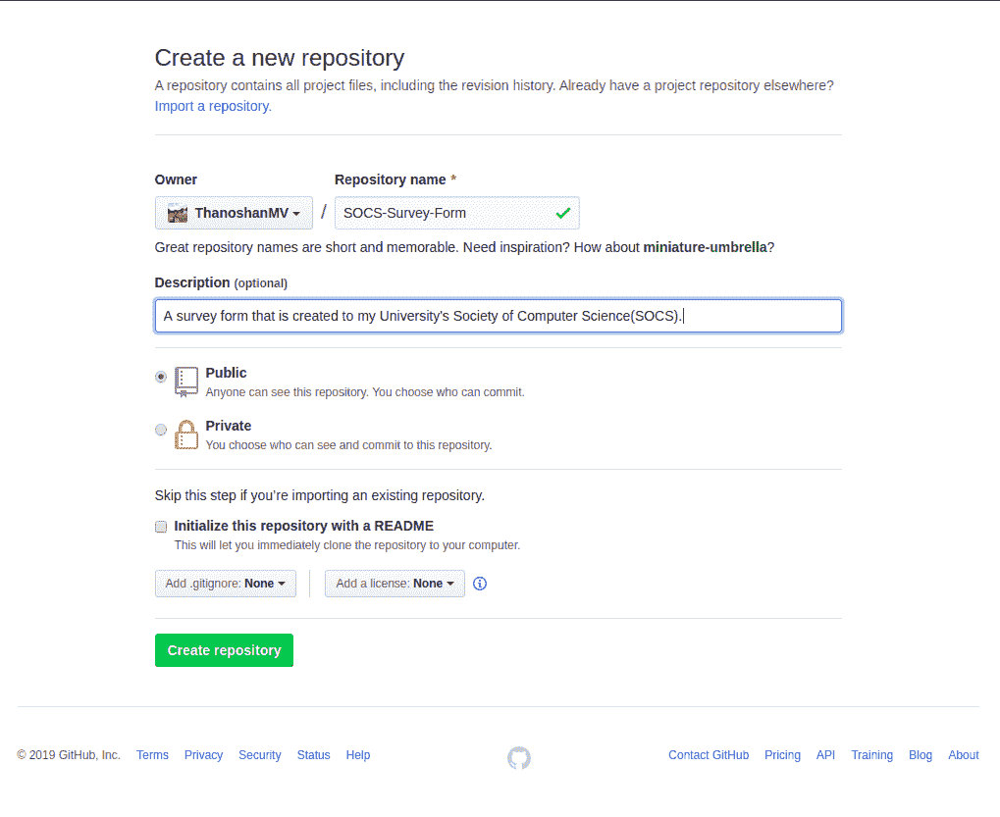

点击“创建存储库”按钮后，你会发现下图是一个网页。

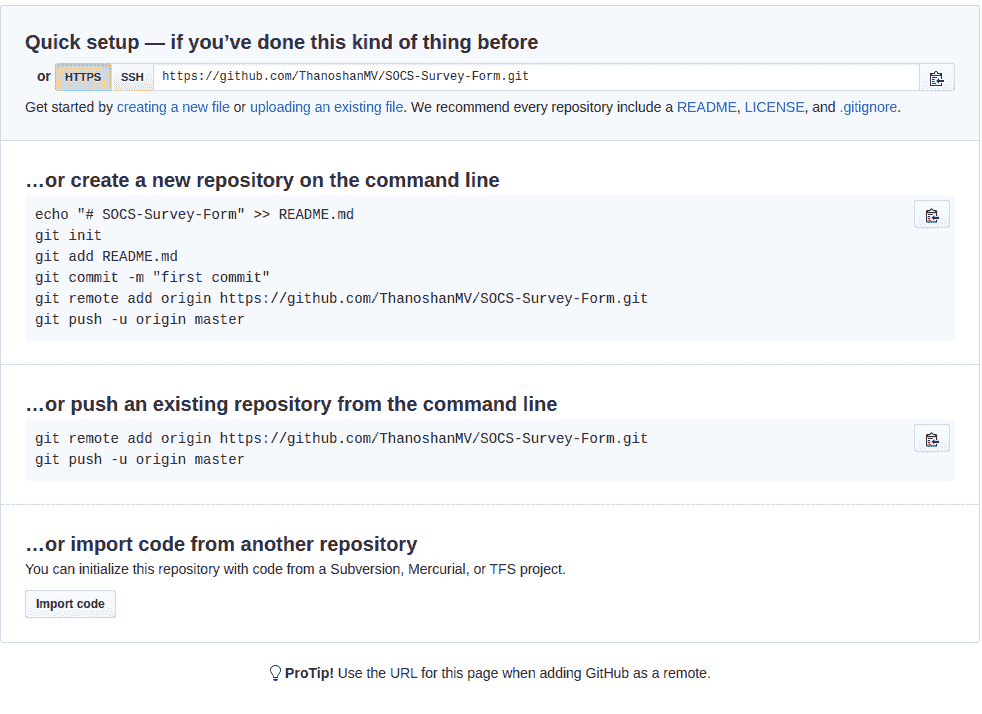

复制 HTTPS 的地址。现在我们将为我们的存储库创建远程。

```
git remote add origin [HTTPS ADDRESS]
```

在执行这个命令之后，我们可以通过下面的命令来检查我们是否已经成功地添加了遥控器

```
git remote
```

如果它输出“原点”,则表明您已经将遥控器添加到项目中。

**注意**:请记住，我们可以通过更改名称“origin”来陈述遥控器的任何名称。例如:

```
git remote add [REMOTE NAME] [HTTPS ADDRESS]
```

现在，我们可以毫无问题地将我们的项目推送到 GitHub 了！

```
git push origin master
```

在一个接一个地完成这些步骤后，如果你去 GitHub，你可以找到你的文件库！

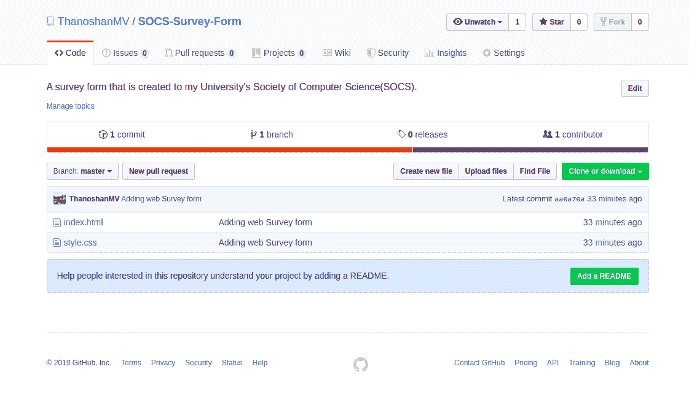

# **结论**

谢谢大家的阅读。我只是解释了 Git 和 GitHub 的基础知识。我强烈建议大家多读一些关于 Git 和 GitHub 的相关文章。希望这篇文章对你有帮助。

[查看](https://medium.com/@mvthanoshan9/ubuntu-a-beginners-guide-to-git-github-44a2d2fda0b8)我在 Medium 上的原创文章。

谢谢你。

****快乐编码！****