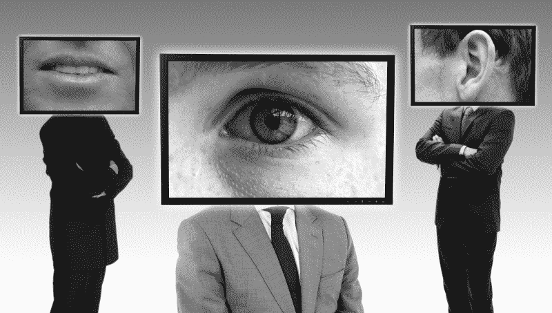
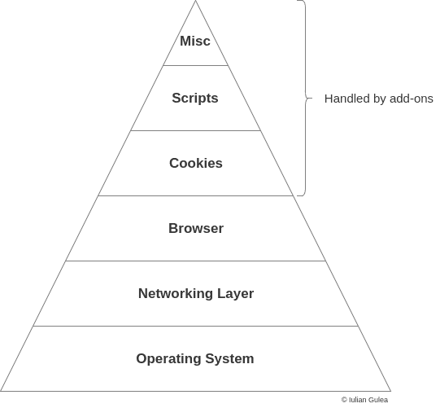
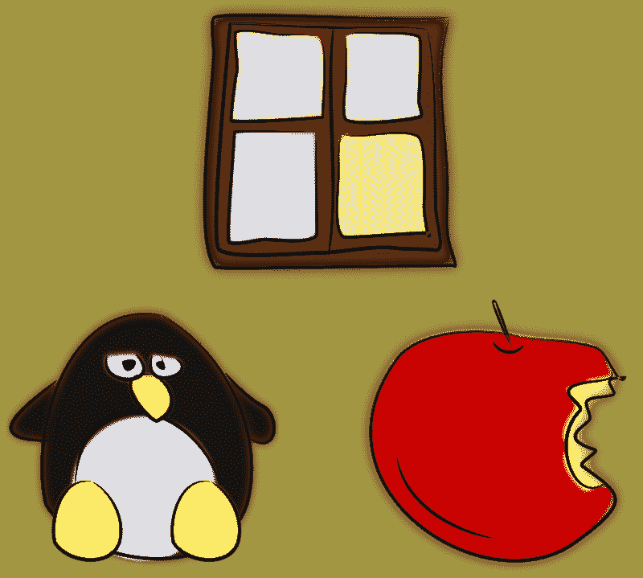
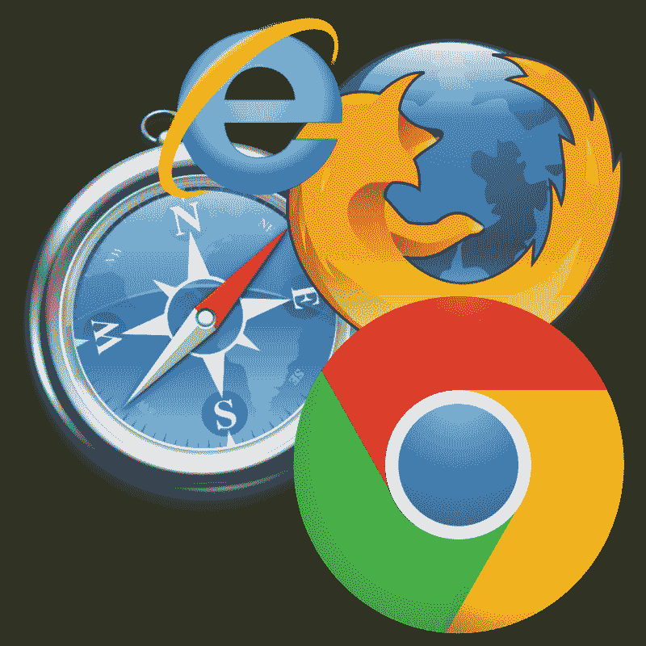
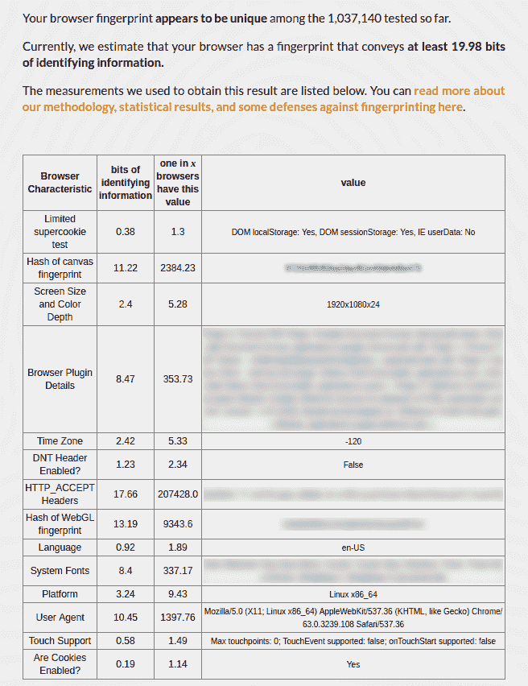
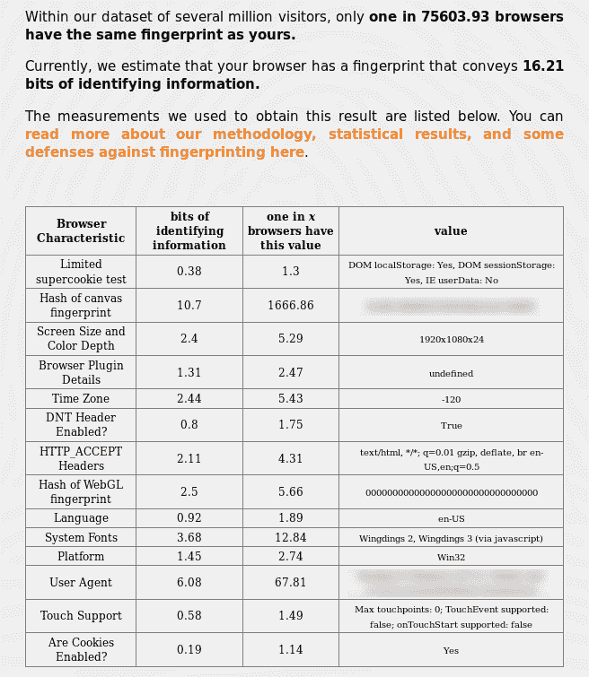
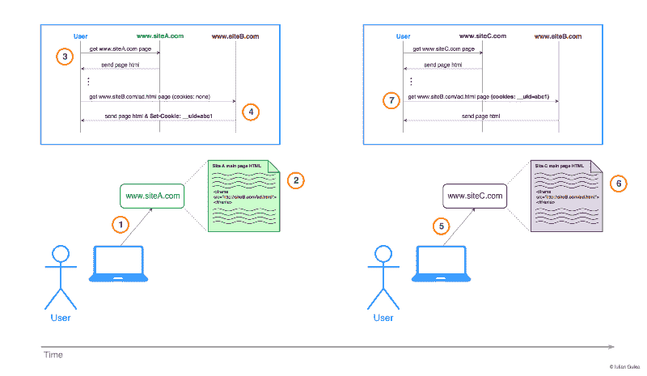
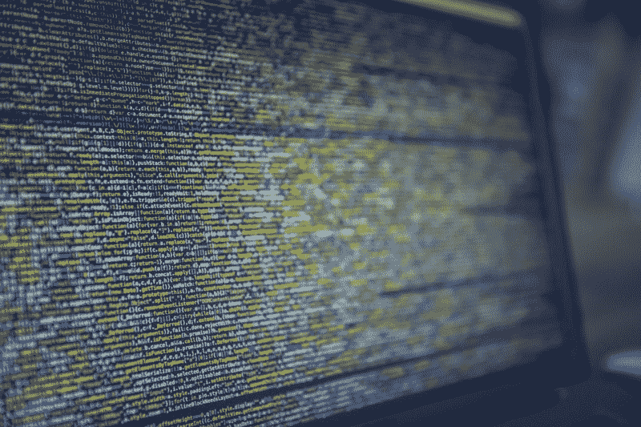
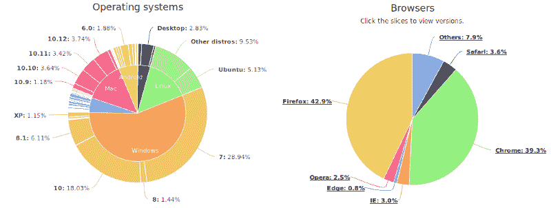
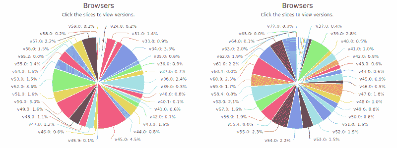

# 在线隐私初学者指南

> 原文：<https://www.freecodecamp.org/news/the-beginners-guide-to-online-privacy-7149b33c4a3e/>

by Iulian Gulea

# 在线隐私初学者指南

我们生活在一个非凡的时代。我们可以通过按下手机上的一个按钮来拍摄我们喜欢的地方和人的照片；从家里购买从针头到汽车的几乎任何东西；通过社交和博客平台接触成千上万的人，并在一天中的任何时间以任何数量消费任何主题的信息。

对于一个 30 年前的人来说，这听起来很超前。对我们来说，事情就是这样。常识。

但这一切都是有代价的。这个价格是我们的隐私。

### 为什么要保密？

> 我是一个守法的公民，我没有什么可隐瞒的。

或者这个:

> 为什么要躲在全球互联的世界里？

很多人这样想，可以理解，绝对正常。我们期望一些公司知道很多关于我们的信息(主要是因为我们自己提供给他们)，但是其他公司收集关于我们的更敏感的信息，我们可能不想与任何人分享，这可能是一个巨大的惊喜。

更糟糕的是，近年来人工智能的进步使公司能够找到非常有趣的模式，并根据人们的在线行为创建精细的生理和心理档案。2012 年有一个案例，一家公司甚至在一个女孩的家人知道之前就知道她怀孕了。现在想象一下人工智能和大量关于人的数据可以做些什么。

希望在这篇文章结束时，你会回顾一下你对在线隐私的看法。在继续之前，花点时间考虑一下，如果你不得不与 200 个陌生人分享以下关于你的信息，你会有什么感觉:

*   你在哪里(地理上)
*   你什么时候上网，上网多长时间
*   你每天访问的所有网站列表是什么
*   您在网上搜索过哪些疾病(如果有)
*   你在网上购买什么类型的产品
*   您使用什么设备连接到互联网
*   你喜欢读什么类型的内容
*   你喜欢吃什么类型的食物
*   你的政治观点

清单可以继续，但我们就此打住。你可能不会和你的朋友分享这些信息，更不用说陌生人了。

然而，现实情况是，今天许多人不情愿地、无意识地将自己的这些数据分享给公司里的“陌生人”，这些人收集这些数据以从中受益。

### 您的“个人匿名资料”

即使收集你所有数据的大多数公司不知道你的真实姓名，这对他们来说也不重要。他们感兴趣的不是你的名字，而是你的行为和喜好。如果他们没有你的名字，他们只会在系统里给你贴上一个 ID。

然而，一些公司*确实知道*你的名字，甚至你的社会安全号码，即使你没有明确地与他们分享。

自相矛盾的是，我们“分享”了大部分数据，却不知道当我们在互联网上导航时，什么类型的信息可以轻易获得。

隐私太多了，恐怕我们不可能在互联网上完全保护自己不被不道德的公司看到，但我们可以将这种风险降到最低。我邀请你去发现如何做到这一点。

### 隐私的金字塔

我想直观地展示一下什么可以保护你的隐私，以及它能多么有效地做到这一点。

按照重要性顺序，从下到上:

### 1.操作系统

Source: pixabay.com

没有坚实的基础，你将无法构建任何有用的东西。事实证明，即使是人们使用的操作系统的选择也会对他们的隐私造成风险。

#### 风险

如果你是 Windows 10 用户，那么我有一些坏消息要告诉你，因为:

*   默认情况下，您的设备标有一个[唯一广告 ID](https://privacy.microsoft.com/en-us/general-privacy-settings-in-windows-10)
*   [数据同步](https://support.microsoft.com/en-us/help/4026102/windows-10-about-sync-settings)默认启用(浏览历史、应用程序设置和 wi-fi 名称和密码)
*   Cortana 可以收集你的任何数据(比如，你在电脑上操作的任何数据，包括信用卡信息、麦克风输入等。)
*   微软可以收集你的任何个人数据
*   所有关于你的数据[都可以与任何第三方共享](https://privacy.microsoft.com/en-us/privacystatement/)，甚至无需你的同意

#### **解决方案**

一个可能的解决方案是切换到另一个操作系统，比如 Linux 或者 T2 的 MacOS。如果为了使用 MacOS 你必须买一台 Mac，你可以在任何电脑上安装你选择的 Linux 发行版。

如果你听说过关于 Linux 的恐怖故事，你可以自己去看看。在这里你可以找到最流行的发行版列表，看看它们的样子，下载并安装它们。或者，万一你不知道从哪里开始，就用 [Ubuntu](https://www.ubuntu.com/) 吧。

还是不想从 Windows 切换？然后看看[w10 privacy](https://www.winprivacy.de/english-home/)——一个帮助你禁用 Windows 中一些跟踪设置的工具。

### 2.网络层

Source: pixabay.com

现在，一旦你至少有机会匿名，没有一个唯一的 ID 粘在你的电脑上，你无法摆脱，让我们来谈谈连接到互联网。

你有没有想过互联网是如何运作的？导航过程很复杂，但同时也体现了工程的力量。但是，我现在不会深入研究它的内部工作原理，而是将重点放在您以前一定听说过的与隐私相关的话题上:IP 和 VPN。

#### 风险

在现实世界中，每台连接到数字万维网的设备都有自己的地址，即你访问的任何网站都可以看到的 IP 地址。因此，无论您做什么来隐藏您的数据和偏好，您都将很容易通过您的计算机连接到互联网的地址被识别。

这就是为什么你会看到你所在国家的母语广告，即使你浏览的是外国网站。

这也是一些网站限制来自特定国家的访问者访问的方法。在这里，你可以看到你的 IP 地址在世界地图上的位置。

#### **解决方案**

1.  虚拟专用网络
2.  WebRTC IP 泄漏测试

让我们逐一讨论。

**1。虚拟专用网**

你不能仅仅隐藏你的 IP 地址，因为你将无法浏览互联网。然而，你可以*假装*你有一个不同于真实的 IP 地址。这就是*虚拟专用网*发挥作用的地方。

> **虚拟专用网** ( **VPN** )通过公共网络扩展了专用网络，并使用户能够通过共享或公共网络发送和接收数据，就像他们的计算设备直接连接到专用网络一样。

> 来源:维基百科

全球有 150 多家 VPN 服务提供商，选择合适的提供商可能很困难，因为每个提供商都有自己的特点和局限性。

然而，在选择一个时，有一些关键的事情需要考虑，令人惊讶的是，它与一些“眼睛”有关

**五只眼睛，九只眼睛，十四只眼睛**

所有这些都是以大规模监控为目标的全球联盟。他们合作收集、分析和分享来自世界各地的公民数据。这始于第二次世界大战后，现在各国互相监视对方的公民，并分享关于人们在线活动、收发电子邮件、脸书帖子等的情报。

组成这些组的国家是:

***五眼:***
1。澳大利亚
2。加拿大
3。新西兰
4。英国。美国

***九眼(以上皆加):***
6。丹麦
7。法国
8。荷兰
9。挪威

***十四眼(以上均加):***
10。比利时
11。德国
12。意大利
13。西班牙
14。瑞典

简而言之，选择这些国家的 VPN 提供商并不能保证你的隐私，因为来自相同甚至不同国家的一些实体(如 NSA 等)可以[强迫](https://www.schneier.com/blog/archives/2013/08/more_on_the_nsa.html) VPN(基本上任何在线服务)[提供商](https://www.theguardian.com/uk/2013/jun/21/gchq-cables-secret-world-communications-nsa)提供他们的数据。

有一个超过 150 家 VPN 提供商的列表，上面有他们在[thatoneprivacysite.net](https://thatoneprivacysite.net/vpn-comparison-chart/)的所有特性和限制。花点时间阅读和分析什么 VPN 最适合你。那么我会建议你先用 1 个月，再买长期订阅，看看效果如何。

**2。WebRTC IP 泄漏测试(即使有 VPN 你也可能被看到)**

坚持住！即使在虚拟专用网和加密的 DNS 服务背后，你仍然可能泄露你的 IP 地址。为什么事情会如此复杂？

技术总是在进步，每一个正在开发的新事物，要么有缺陷，要么有简单的方法利用某些功能来获得所需的结果。WebRTC 也是如此，这是一种新的通信协议，它依赖于 JavaScript，可以从 VPN 背后泄露你的实际 IP 地址。在 [privacytools.io](https://www.privacytools.io/webrtc.html) 上查看，如果你看到任何已识别的 IP 地址，请在同一个 privacytools.io 上查看[这一](https://www.privacytools.io/#webrtc)部分，并完成那里列举的步骤。别忘了再检查一下 WebRTC 有没有泄露你的 IP 地址！

### 3.浏览器

Source: pixabay.com

让我们来讨论一下我们用来在互联网的数字世界中导航的冲浪板。

什么浏览器比较好？

*   *网络浏览器！*(表示没人)
*   *边缘*(*…有人小声说…*)
*   *歌剧！*(几个人说)
*   狩猎旅行！(一堆人说最新版本的苹果产品第一天出现就有了)
*   *Tor！*(某处匿名群喊)
*   яндексбраузер！(一群说俄语的人)
*   *Chrome！！！*(一群人喊道，谷歌可能有他们自己的数字版本)
*   *火狐！！！*(另一群贴着隐私海报的人喊道)
*   *勇敢！有人说，但不清楚他们是指浏览器，还是仅仅为了在当今世界保持勇敢？)*

有几十个，你可以在维基百科上找到一个列表[，](https://en.wikipedia.org/wiki/List_of_web_browsers)但是这个没有回答上面的问题…

#### 风险

上述任何一种浏览器都是复杂的软件，可以让你访问互联网。在网上冲浪时，你的浏览器与其他计算机交互，向它访问的任何网站暴露一些自身信息。这就是事情变得复杂的地方，因为各种浏览器设置的组合可以创建您独特的设备指纹。

Source: commons.wikimedia.org

等等，什么？**指纹？**

> **设备指纹**是为了识别的目的而收集的关于远程计算设备的信息。即使关闭了 [cookies](https://en.wikipedia.org/wiki/HTTP_cookie) ，指纹也可以用来完全或部分识别个人用户或设备。

> 来源:维基百科

所以，坏消息是，在网上冲浪时，你会在你访问的每个网站上留下你的数字指纹。

**好消息？**如果您更改设置，尽可能少地暴露导航所需的数据，您的设备指纹*可能*不是唯一的。

这是可能的，因为你的设备的指纹不是一个单一的信息，而是不同设置的集合(例如，你的屏幕大小，浏览器类型，浏览器版本，安装的字体，安装的插件等))那个*合在一起*可以唯一识别你的浏览器。

还记得《黑客帝国》里的红衣女郎吗？她很突出，因为与周围的人相比，她有着非常独特的外表。你的浏览器也是如此——它的特色越鲜明，就越容易在人群中被发现。

但如果你给她穿上黑色夹克和白色衬衫，就像她周围的人一样，她不会太显眼。

你的浏览器暴露了十几条关于其设置的信息，我们的工作就是让它们尽可能的“通用”。

想看看你的设备指纹是什么？检查:

1.  [panopticlick.eff.org](https://panopticlick.eff.org/)
2.  [amiunique.org](https://amiunique.org/)

如果您选择 panopticlick，您会看到类似这样的内容:

在*“浏览器特征”*列中，您可以找到正在收集的信息类型。根据这些信息，可以识别您的浏览器。另一个有趣的列是*“x 个浏览器中有一个有这个值，”*，它基本上是那个浏览器特征的熵。这个数字越小越好，因为这意味着有很多其他的浏览器有这个精确的设置。

同样，在桌子上面你可以看到你是多么的独特。上面的图片代表了我的 Chrome 浏览器的测试结果，这个浏览器没有为保护我的隐私而配置。

在调整了一些设置并安装了一些附加组件后，下面是你可以实现的(这个来自我的 Firefox 浏览器，我每天都在使用):

在 panopticlick 的数据集中，只有 75，604 分之一的浏览器与我的指纹相同，这要好得多(但并不理想)。

#### 解决办法

第一件事是选择一个浏览器。从隐私的角度来看，有几个比其他的更值得推荐。即这些是:

**1。Tor 浏览器**
自带预装隐私插件、加密和高级代理。这款产品从盒子里拿出来后，你就可以用上了。

**2。Firefox**
调整默认配置，安装一些隐私插件，你就没事了。

**3。勇敢的**
自动拦截广告和追踪器，让你的导航更快更安全。

**配置您的浏览器以增加隐私**
这里有两个选项:

1.  最简单的方法是按照这里的说明(仅对 Firefox 有效，但你可以在 Chrome 的*“关于:标志”*下搜索类似的设置)。
2.  如果你想有更多的灵活性和可能性来导入/导出你的隐私设置，请查看 Github 上的 [ghacks-user.js](https://github.com/ghacksuserjs/ghacks-user.js) 项目(也只适用于 Firefox)。它更全面，需要一些设置，但它是值得的。

**设置附加组件以增加隐私**
阅读以下内容。

### 4.饼干

现在你可能已经在网上听说过 **cookies** 了，它们不是什么好东西(否则为什么当你导航到它们的一个页面时，网站会告诉你它们对 cookies 的使用呢？)

现实情况是，cookies 只不过是一种工具，从隐私的角度来看，这种工具的某些用途是有问题的。

所以，cookies 是网站可以存储在你的浏览器中的小字符串。它们不能安装任何东西(它们只是文本)，并且只对存储它们的站点可见(因此没有一个站点能看到你访问过的其他 20 个站点的所有 cookies)。

此外，*cookie 会随每个请求*一起发送，这也是它们对隐私构成潜在威胁的原因。

让我们举一个简单的例子:假设你访问了一个有光明和黑暗主题的网站。默认的是浅色主题，但是你选择了深色主题。任何时候你进入那个网站，即使你没有登录或注册，它也会显示黑暗主题。

在这种情况下，该网站可能已经在您的浏览器`theme=dark`中保存了一个 cookie，每当您加载该网站时，这个 cookie 都会被发送到服务器，然后服务器会提供相应的。黑暗主题的 css 文件。

事实上，当您打开网站时，甚至在重新启动计算机后，您仍会不断登录网站，这也可能是因为 cookies 存储了您的会话数据。

#### 风险

这只是一个简单的例子，人们可能不太清楚如何从这些饼干中获益。那么让我们看看另一个可能侵犯我们隐私的例子:

我们来看一个具体的例子。

1.  用户决定访问**siteA.com**。
2.  为了赚钱，SiteA.com 通过在自己的页面中放置特定的代码，展示来自 siteB.com 的广告。
3.  当 siteA.com 收到来自用户的请求时，它向他/她发送用户请求的页面的 HTML 代码，在本例中，包含一个 HTML 标签。该标签在当前页面中加载另一个页面，即广告页面。
4.  当用户的浏览器收到来自 siteA.com 的 HTML 代码时，它开始呈现页面并发出后续请求，以获取正确加载页面所需的一切。因此，浏览器将请求从 siteB.com 检索广告，发送与 siteB.com 相关的 cookies。但是因为用户的浏览器中还没有 cookie，siteB.com 指示浏览器存储带有关键字`__uId`和值`abc1`的 cookie。与此同时，siteB.com 在他们的数据库中创建了一个名为`abc1`的档案，该档案将收集我们用户的所有数据。它是在 *Referer* 头的帮助下完成的，这个头包含了发起请求的 URL。在这种情况下，Referer 头的值为`www.siteA.com`。
5.  一段时间后(或在 siteA.com 之后)，用户导航到 siteC.com。
6.  与 siteB.com 完全无关的 siteB.com 展示的广告来自同一家广告公司(siteB.com)。
7.  当浏览器接收到 siteC.com 的 HTML 代码并请求从 siteB.com 检索广告时，这次它会自动将 cookie `__uId=abc1`发送给 siteB.com，这是用户的唯一标识符。这与现在包含值`www.siteC.com`的 Referer 头一起，告诉 siteB.com 用户已经在他们的数据库中。所以他们用最近访问过的网站，也就是 siteC.com，来更新他/她的个人资料。

因此，广告公司一点一点地收集人们网上活动的大量数据。

#### 解决办法

这里有三种可能的选择:

*   完全禁用 cookies(但这会破坏一些站点，使它们无法工作)。*这可以在浏览器设置中完成；*
*   将 cookie 限制在“第一方”，这意味着只有您当前正在浏览的网站才能将 cookie 写入您的浏览器，不会使用来自广告公司的其他“第三方”cookie(这可能仍会破坏一些网站，但很少)。*这也可以在浏览器设置中完成；*
*   *(推荐方法)*安装一个处理 cookies 的附加组件，并为每个站点定义自定义规则(这种方法需要一些设置，但最灵活)。

你可以在文末找到一些附加推荐。

### 5.剧本

Source: pixabay.com

可悲的是，这句话*“权力越大，责任越大”*在当今的企业中并不流行…

JavaScript 是网站的典型构件，因为它提供了做各种事情的多种可能性。你可以在网页上构建游戏、引人入胜的交互、动画和无数其他酷的东西。

JavaScript 还可以获取你的屏幕大小、电池电量(如果是笔记本电脑)、浏览器上已安装的附加组件列表以及其他可以用来唯一识别你的信息。

#### 风险

那么在你访问的许多网站上发生了什么呢？为了赚钱，网站所有者将广告公司的脚本放在他们的网站上，一旦你加载页面，浏览器也会加载第三方脚本。然后，这些脚本提取关于你的潜在身份信息，并将其与你在所加载页面上的行为一起发送给广告公司。

在 JavaScript 可以获得的关于浏览器的许多类型的信息中，它的 [*画布指纹*](https://www.1and1.com/digitalguide/online-marketing/web-analytics/canvas-fingerprinting-online-tracking-without-cookies/) 是迄今为止最强大的，因为它提供了最多的熵。它这样做主要是因为几个因素可以有很大的不同，像你的 GPU，图形驱动程序，操作系统和浏览器，都有助于它的创建。

因此，公司一点一点地收集关于你的行为、你访问的网站和你的点击的信息，并根据这些信息创建你的数字档案，为你提供量身定制的广告。这被你在网上的持续动作进一步调整。

#### 解决办法

禁用 JavaScript 不是一个解决方案，因为你将无法使用互联网上一半的网站。但是，您可以阻止来自特定供应商的脚本，这样它们就不会加载到页面中，并阻止向广告公司发送包含潜在可识别信息的请求。下面的第 6 部分描述了几个附加组件。

### 6.杂项和附加组件

上述步骤是在线隐私的基础，但不幸的是，它们还不够——网站仍然可以收集并使用足够的信息来构建某人的数字档案。

在这一节中，你会发现一个关于 Firefox Quantum(版本≥ 57)的基本附加组件列表，可以让你安全地浏览。如果您选择了其他浏览器，您可以在相应的加载项列表中搜索替代浏览器。

请注意，这绝不是一个详尽的列表，所以请随时在评论中添加您的建议。此外，一些特性可能会出现在多个附加组件中，这在大多数情况下不会引起任何冲突，但要注意的是，有时事情可能会不工作。这就是为什么我会建议一个一个地安装它们，并加载几个页面来测试一切是否如预期那样工作。

所以，我们开始吧:

**1。饼干**

这一类有很多附加产品。我个人用的是 [Cookie 自动删除](https://addons.mozilla.org/en-US/firefox/addon/cookie-autodelete/)，不过你可能会喜欢别的。只需在关闭浏览器时，或者在预定的时间过后，激活它来删除 cookies。

因此，网站和广告提供商将无法通过 cookies 轻松跟踪你，因为对他们来说，每次你访问一个网站，你就像一个新的访问者。“隐私之刃”的另一面是，每次打开浏览器时你都必须登录，因为会话 cookies 也会被删除。

这可能有点烦人，但是没人告诉你会是雏菊。

**2。脚本拦截器**

有几个流行的插件可以阻止不必要的跟踪脚本(排名不分先后): [uMatrix](https://addons.mozilla.org/en-US/firefox/addon/umatrix/) 、 [NoScript](https://addons.mozilla.org/en-US/firefox/addon/noscript/) 、 [uBlock Origin](https://addons.mozilla.org/en-US/firefox/addon/ublock-origin/) 、 [AdBlock](https://addons.mozilla.org/en-US/firefox/addon/adblock-plus/) 等等。

前两个为您提供了更多的灵活性，但是需要一些学习和设置。默认情况下，他们“破坏”许多网站，因为他们只是阻止所有的脚本，你需要定义一些关于什么允许什么阻止的规则。就我个人而言，我同时使用了 NoScript 和 uMatrix，但更喜欢 uMatrix(目前正在使用)。

如果你不想花时间学习它们如何工作，而只想开始更安全地导航，那么 uBlock 和 AdBlock 是最好的选择。这些都是现成的，但有时提供的隐私可能比 uMatrix 或 NoScript 要少。

**3。用户代理**

用户代理 header switcher 上也有很多附加组件(那是关于你正在使用什么操作系统和浏览器的信息)。

问题是，有这么多的操作系统和浏览器版本，这个标题本身就可以成为那些想要识别你的有用信息来源。

Source: amiunique.org

操作系统图表上的紫色是 iOS 版本。根据这张图表，最常见的操作系统是 Windows 7。这种情况在浏览器端并不常见，因为供应商们正在如烫手山芋一样推出新版本:

Source: amiunique.org

在**左边**你可以看到 amiunique.org 数据集中**火狐**浏览器版本在人群中的分布，在**右边**有 **Chrome** 浏览器分布。

我对这个功能没有强烈的偏好。目前我使用[用户代理切换器](https://addons.mozilla.org/en-US/firefox/addon/uaswitcher/)，因为它允许你设置自己的自定义用户代理头值，并且它有一个随机模式，可以在不同的用户代理之间及时切换。

**4。加密浏览**

你有没有发现有些网址以`http://`开头，有些以`https://`开头？HTTP 代表*超文本传输协议*，它是定义计算机如何通过互联网进行通信的协议。

在最后加上*安全*，你就知道 HTTPS 代表什么了。当你访问一个以`https://`开头的网站时，你发出的请求内容是加密的，即使有人拦截了请求，也很难理解你在发送什么。

可悲的是，并不是所有的网站都实现了自动重定向 HTTP 链接到 HTTPS 链接，使你的在线导航对那些可能拦截你的流量的人可见。

幸运的是， [HTTPS Everywhere](https://addons.mozilla.org/en-US/firefox/addon/https-everywhere/) 解决了这个问题，并自动将你重定向到加密版本的网站(如果这些网站存在的话)。

**5。画布指纹**

有两种解决方案来处理画布指纹:

1.阻止此 API 的任何尝试。
2。每次访问生成的指纹时都要改变它。

从长远来看，第一个选项是最好的，因为它不提供额外的信息。然而，由于很少有人意识到这一点，并选择阻止 canvas API，*您的浏览器中缺少 canvas 指纹，这本身就是您的身份信息来源。*

另一个选择是改变画布指纹，偶尔改变它，这样每次你都会有不同的指纹，就好像不同的人在导航一样。

为了这个目的，CanvasBlocker 非常有效。它描述了两个选项，由您决定选择哪一个。

**6。Referer 标头(不带双“r”)**

该标题随每个请求一起发送，表明请求来自哪里(哪个站点引用了您请求的页面)。它可以用来跟踪您的在线导航，并查看您从哪些网站访问了哪些网站。

但是它可以被改变，只对你的眼睛隐藏你的在线导航路线(或者对任何使用你电脑的人)。

如果你使用前面提到的 uMatrix 插件，它会带有 Referer 头欺骗。否则，只需在你的浏览器的附加组件中搜索“referer spoof”并选择一个即可。

**7。链接清洁器**

Referer Header 是一种了解这个人来自哪里的高级方法，但跟踪你的参与度的最常用方法之一是[查询字符串参数](https://en.wikipedia.org/wiki/Query_string)。这些参数是 URL 的一部分，跟在`?` 字符之后，它们保存各种类型的数据。

取此链接:*http://Meyer web . com/Eric/thoughts/2017/03/07/welcome-to-the-grid/？**UTM _ source = frontendfocus&UTM _ medium = email&page = 2***

字符`?`右边的 key=value 对是查询参数。当您单击这样的链接时，查询参数的值将被发送到服务器。

你有没有想过 URL 中的`utm_medium`和其他相关的`utm_*`参数是什么意思？这些都和谷歌分析有关。

并非所有的查询参数都侵犯隐私。其中一些是站点正常工作所必需的(例如*页面*参数)。

您可以使用[链接清理器](https://addons.mozilla.org/en-US/firefox/addon/link-cleaner/)，它将删除大多数用于跟踪的查询参数。

### 接下来的步骤

Source: pixabay.com

我试图涵盖在线隐私的主要方面，为进一步研究和了解这个主题打下坚实的基础。

但是隐私的内容太多了，很难在一篇文章中涵盖所有内容，而且还有一些事情没有提到。请随意在评论中添加它们，这样那些想了解更多的人就有机会这样做了！

此外，我主要关注的是安全和隐私的网上浏览，但隐私也应该是我们使用的每个在线服务要考虑的一个问题，包括电子邮件、文件共享和我们日常使用的其他服务。

请记住:有意识地与他人分享我们的信息是一回事，在我们不知情和未同意的情况下收集敏感信息则完全不同。

保持隐私！

### 有用的链接

隐私工具(privacy tools)—关于隐私的综合资源。还包含服务提供商的链接和建议。

[BrowserLeaks](https://browserleaks.com/) —从与隐私相关的几个方面分析您的浏览器，包括 IP 地址、画布指纹、Flash 等。

[Panopticlick](https://panopticlick.eff.org/) —检查您的浏览器在防止跟踪方面的安全性，并提供一份关于泄露您最多信息的内容的报告。

[AmIUnique](https://amiunique.org/)—Panopticlick 的替代产品。也有一些关于他们数据集的一般统计数据。

火狐硬件报告(Firefox Hardware Report)—互联网人口代表性样本所使用的硬件的每周报告。

[屏幕分辨率追踪](https://security.stackexchange.com/questions/102133/how-can-you-be-tracked-using-screen-resolution-monitor-size-in-tor)——一个关于浏览器/屏幕尺寸如何让你失望的有趣话题。

Firefox 在第三方 Cookies 上变得更加聪明。

如果你觉得这篇文章有用，请给它一些掌声，这样其他人也可以在网上了解他们的隐私。谢谢！