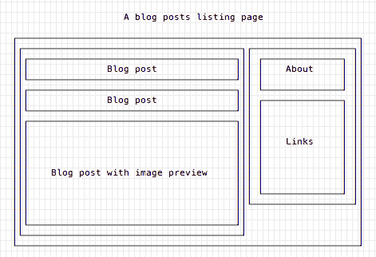
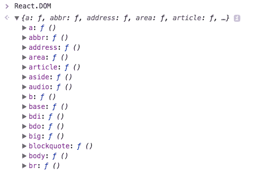
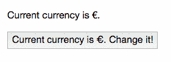

# 反应的初学者指南

> 原文：<https://www.freecodecamp.org/news/the-beginners-guide-to-react-9be65f50a55c/>

> 有兴趣学习 React 吗？获取我的[反应手册](https://flaviocopes.com/page/react-handbook/)

React 是一个 JavaScript 库，旨在简化可视化界面的开发。

它由脸书开发，于 2013 年向全世界发布，驱动着世界上一些最广泛使用的代码。它为脸书和 Instagram 等许多软件公司提供了动力。

它的主要目标是通过将 UI 划分为组件的集合，使得在任何时间点推断界面及其状态变得容易。

React 用于构建单页面 web 应用程序，以及 React 诞生之前可用的许多其他库和框架。

### React 为什么这么受欢迎？

React 已经席卷了前端 web 开发世界。为什么？

#### 没有替代品复杂

在 React 宣布的时候，Ember.js 和 Angular 1.x 是框架的主要选择。这两者都在代码上强加了太多的约定，以至于移植现有的应用程序一点也不方便。

React 非常容易集成到现有项目中。这就是他们在脸书不得不做的，以便将它引入现有的代码库。此外，这两个框架带来了太多东西，而 React 只选择实现视图层，而不是完整的 MVC 堆栈。

#### 完美的时机

与此同时，谷歌宣布了 Angular 2.x，以及它将带来的向后不兼容性和重大变化。从角度 1 移动到角度 2 就像移动到不同的框架。因此，这一事实，以及 React 承诺的执行速度改进，使得 React 成为开发人员渴望尝试的东西。

#### 由脸书支持

如果一个项目成功了，得到脸书的支持对它有好处。但这并不能保证，脸书和谷歌(以及其他公司)都有很多失败的开源项目。

### React 真的那么简单吗？

尽管我说过 React 比其他框架简单，但是深入研究 React 仍然很复杂。这主要是因为可以与 React 集成的配套技术，如 Redux、Relay 或 GraphQL。

React 本身有一个非常小的 API。

除了这些概念之外，React 中没有更多内容:

*   成分
*   JSX
*   状态
*   小道具

我们将在我的下一篇文章中看到它们。

### JSX

包括我自己在内的许多开发人员第一眼看到 JSX 时都认为它很可怕，并很快否定了 React。

即使他们说 JSX 不是必需的，使用没有 JSX 的 React 也是痛苦的。

我花了几年时间偶尔看看它，开始理解 JSX，现在我更喜欢它，而不是另一种选择(即使用模板)。

使用 JSX 的主要好处是你只与 JavaScript 对象交互，而不是模板字符串。

JSX 没有嵌入 HTML。

许多 React 初学者的教程喜欢推迟介绍 JSX，因为他们认为读者没有它会更好。然而，既然我现在是 JSX 的粉丝，我会立刻投入其中。

下面是如何定义包含字符串的 h1 标记:

```
const element = <h1>Hello, world!</h1>
```

它看起来像 JavaScript 和 HTML 的奇怪混合，但实际上它都是 JavaScript。

看起来像 HTML 的东西实际上是一种定义组件及其在标记中的位置的糖语法。

在 JSX 表达式中，可以非常容易地插入属性:

```
const myId = 'test' 
const element = <h1 id={myId}>Hello, world!</h1>
```

您只需要注意属性何时有破折号(`-`)，破折号将被转换为 camelCase 语法，以及这两种特殊情况:

*   `class`变成了`className`
*   `for`变成了`htmlFor`

因为它们是 JavaScript 中的保留字。

下面是 JSX 将两个组件包装到一个`div`标签中的片段:

```
<div> 
  <BlogPostsList />
  <Sidebar /> 
</div>
```

标签总是需要关闭，因为这更像是 XML 而不是 HTML(如果您还记得 XHTML 时代，这应该很熟悉，但从那时起 HTML5 宽松的语法就占了上风)。在这种情况下，使用自结束标记。

随着 React 的推出，JSX 不再是一项只支持 React 的技术。

### 反应组分

#### 什么是 React 组件？

组件是接口的一个独立部分。例如，在一个典型的博客主页中，您可能会发现边栏组件和博客帖子列表组件。它们又是由组件本身组成的，所以你可以有一个博客文章组件的列表，每个组件对应一篇博客文章，每个组件都有自己独特的属性。



React 让它变得非常简单:一切都是组件。

即使普通的 HTML 标签本身也是组件，它们是默认添加的。

接下来的两行是等价的——它们做同样的事情。一个带着 **JSX** ，一个不带，靠注射`<h1>Hello World`！< /h1 >变成一个带 id app 的 elem `ent`。

```
import React from 'react' 
import ReactDOM from 'react-dom' 

ReactDOM.render( 
  <h1>Hello World!</h1>, 
  document.getElementById('app') 
)

ReactDOM.render( 
  React.DOM.h1(null, "Hello World!"), 
  document.getElementById('app') 
)
```

请看，`React.DOM`为我们曝光了一个`h1`组件。还有哪些 HTML 标签可用？所有人！您可以通过在浏览器控制台中键入来检查`React.DOM`提供了什么:



(名单还在继续……)

内置的组件很好，但是你很快就会超越它们。React 擅长的是让我们通过组合定制组件来组合 UI。

### 定制组件

在 React 中有两种方法定义组件:

无状态组件不管理内部状态，只是一个函数:

```
const BlogPostExcerpt = () => {
 return (
    <div>
      <h1>Title</h1>
      <p>Description</p>
    </div> 
  ) 
}
```

有状态组件是一个类，它在自己的属性中管理状态:

```
import React, { Component } from 'react'

class BlogPostExcerpt extends Component { 
  render() { 
    return ( 
      <div>
        <h1>Title</h1> 
        <p>Description</p> 
      </div> 
    ) 
  } 
}
```

按照他们的立场，他们是等价的，因为还没有国家管理(在接下来的两篇文章中)。

第三种语法使用不带类的`ES5` / `ES2015`语法:

```
import React from 'react'

React.createClass({ 
  render() { 
    return ( 
      <div> 
        <h1>Title</h1>
        <p>Description</p> 
      </div> 
    ) 
  } 
})
```

你很少在现代代码库中看到这种情况。

Props 是组件获取属性的方式。从顶层组件开始，每个子组件都从父组件获得其道具。在一个无状态组件中，props 是所有被传递的东西，通过添加`props`作为函数参数，它们是可用的:

```
const BlogPostExcerpt = (props) => { 
  return ( 
    <div> 
      <h1>{props.title}</h1> 
      <p>{props.description}</p> 
    </div> 
  ) 
}
```

在有状态组件中，默认情况下会传递属性。不需要添加任何特殊的东西，它们在组件实例中可以作为`this.props`来访问。

```
import React, { Component } from 'react'

class BlogPostExcerpt extends Component { 
  render() { 
    return ( 
      <div>
        <h1>{this.props.title}</h1>  
        <p>{this.props.description}</p> 
      </div> 
    ) 
  } 
}
```

### 属性类型

由于 JavaScript 是一种动态类型语言，我们没有办法在编译时强制变量的类型。如果我们传递无效的类型，它们将在运行时失败，或者给出奇怪的结果，如果类型是兼容的，但不是我们所期望的。

Flow 和 TypeScript 帮助很大，但是 React 有一种方法可以直接帮助道具类型。甚至在运行代码之前，我们的工具(编辑器、linters)就可以检测出我们何时传递了错误的值:

```
import PropTypes from 'prop-types';
import React from 'react' 

class BlogPostExcerpt extends Component { 
  render() { 
    return ( 
      <div> 
        <h1>{this.props.title}</h1> 
        <p>{this.props.description}</p> 
      </div> 
    ) 
  } 
}

BlogPostExcerpt.propTypes = { 
  title: PropTypes.string, 
  description: PropTypes.string 
};

export default BlogPostExcerpt
```

### 我们可以使用哪些类型

这些是我们可以接受的基本类型:

*   proptypes . array(属性类型.数组)
*   PropTypes.bool
*   PropTypes.func
*   PropTypes.number
*   PropTypes.object
*   PropTypes.string
*   PropTypes.symbol

我们可以接受两种类型之一:

```
PropTypes.oneOfType([ PropTypes.string, PropTypes.number ]),
```

我们可以接受许多价值观中的一种:

```
PropTypes.oneOf(['Test1', 'Test2']),
```

我们可以接受一个类的实例:

```
PropTypes.instanceOf(Something)
```

我们可以接受任何 React 节点:

```
PropTypes.node
```

或者甚至任何类型:

```
PropTypes.any
```

数组有一种特殊的语法，我们可以用它来接受特定类型的数组:

```
PropTypes.arrayOf(PropTypes.string)
```

我们可以使用以下方法来组合对象属性:

```
PropTypes.shape({ 
  color: PropTypes.string, 
  fontSize: PropTypes.number 
}) 
```

### 需要属性

将`isRequired`附加到任何 PropTypes 选项将导致 React 在缺少该属性时返回一个错误:

```
PropTypes.arrayOf(PropTypes.string).isRequired, PropTypes.string.isRequired,
```

### 道具的默认值

如果不需要任何值，我们需要为它指定一个缺省值，如果它在组件初始化时丢失的话。

```
BlogPostExcerpt.propTypes = { 
  title: PropTypes.string, 
  description: PropTypes.string 
}

BlogPostExcerpt.defaultProps = { 
  title: '', 
  description: '' 
}
```

有些工具，比如 ESLint，能够强制为组件定义 defaultProps，并带有一些没有明确要求的属性类型。

### 道具是怎么传的

初始化组件时，以类似于 HTML 属性的方式传递属性:

```
const desc = 'A description' 
//... 
<BlogPostExcerpt title="A blog post" description={desc} /> 
```

我们以普通字符串的形式传递标题(我们只能用字符串做这件事！)，并将描述作为变量。

### 儿童

一个特殊的道具是`children`。它包含在组件的`body`中传递的任何值。例如:

```
<BlogPostExcerpt title="A blog post" description={desc}> 
  Something 
</BlogPostExcerpt> 
```

在这种情况下，在`BlogPostExcerpt`中，我们可以通过查找`this.props.children`来访问“某物”。

虽然 Props 允许组件从其父组件接收属性(例如，可以“指示”它们打印一些数据)，但是 state 允许组件拥有自己的生命，并且独立于周围的环境。

记住:只有基于类的组件才能有状态。因此，如果您需要管理无状态(基于函数)组件中的状态，您首先需要将其“升级”为类组件:

```
const BlogPostExcerpt = () => { 
  return ( 
    <div>
      <h1>Title</h1>
      <p>Description</p> 
    </div> 
  )
} 
```

变成了:

```
import React, { Component } from 'react'

class BlogPostExcerpt extends Component { 
  render() { 
    return (
      <div>  
        <h1>Title</h1> 
        <p>Description</p>
      </div>
    ) 
  } 
} 
```

### 设置默认状态

在组件构造器中，初始化`this.state`。例如，BlogPostExcerpt 组件可能有一个`clicked`状态:

```
class BlogPostExcerpt extends Component {
  constructor(props) { 
    super(props) 
    this.state = { clicked: false } 
  }

  render() { 
    return (
      <div> 
        <h1>Title</h1>
        <p>Description</p> 
      </div> 
    ) 
  } 
}
```

### 访问状态

点击*的*状态可以参照`this.state.clicked`进入:

```
class BlogPostExcerpt extends Component {
  constructor(props) { 
    super(props)
    this.state = { clicked: false }
  }

  render() { 
    return (
      <div> 
        <h1>Title</h1> 
        <p>Description</p> 
        <p>Clicked: {this.state.clicked}</p> 
      </div> 
    ) 
  } 
}
```

### 改变状态

一个状态永远不应该通过使用

```
this.state.clicked = true
```

相反，你应该总是使用`setState()`来代替，把它作为一个对象来传递:

```
this.setState({ clicked: true })
```

对象可以包含状态的子集或超集。只有你传递的属性才会变异。省略的将保持其当前状态。

#### 为什么你应该总是使用`setState()`

原因是使用这个方法，React 知道状态已经改变。然后，它将启动一系列事件，这些事件将导致组件被重新呈现，以及任何 DOM 更新。

### 状态被封装

组件的父组件无法判断子组件是有状态的还是无状态的。组件的子组件也是如此。

有状态或无状态(基于函数或基于类)完全是一个实现细节，其他组件不需要关心。

这就导致了单向数据流

### 单向数据流

一个状态总是由一个组件拥有。受该状态影响的任何数据只能影响其下的组件:其子组件。

更改组件的状态永远不会影响其父组件、同级组件或应用程序中的任何其他组件，只会影响其子组件。

这就是状态在组件树中被上移的原因。

### 在树中向上移动状态

由于单向数据流规则，如果两个组件需要共享一个状态，则需要将该状态向上移动到一个共同的祖先。

通常，最近的祖先是管理状态的最佳位置，但这不是强制性的规则。

状态通过 props 传递给需要该值的组件:

```
class Converter extends React.Component { 
  constructor(props) { 
    super(props)
    this.state = { currency: '€' } 
  }

  render() { 
    return ( 
      <div> 
        <Display currency={this.state.currency} />
        <CurrencySwitcher currency={this.state.currency} />
      </div> 
    ) 
  } 
} 
```

子组件可以通过将变异函数作为属性向下传递来变异状态:

```
class Converter extends React.Component { 
  constructor(props) { 
    super(props) 
    this.state = { currency: '€' } 
  }

  handleChangeCurrency = (event) => { 
    this.setState({ 
      currency: this.state.currency === '€' ? '



### 事件

React 提供了一种管理事件的简单方法。准备告别`addEventListener`:)

在上一篇关于状态的文章中，您看到了这个例子:

```
const CurrencySwitcher = (props) => { 
  return ( 
    <button onClick={props.handleChangeCurrency}> 
      Current currency is {props.currency}. Change it! 
    </button> 
  ) 
} 
```

如果您已经使用 JavaScript 有一段时间了，这就像普通的旧 JavaScript 事件处理程序。但是这一次你是在 JavaScript 中定义一切，而不是在 HTML 中，并且你传递的是一个函数，而不是一个字符串。

实际的事件名称略有不同，因为在 React 中，您对任何事情都使用 camelCase。于是`onclick`变成了`onClick`，`onsubmit`变成了`onSubmit`。

作为参考，这是混合了 JavaScript 事件的老式 HTML:

```
<button onclick="handleChangeCurrency()"> ... <;/button>
```

### 事件处理程序

将事件处理程序定义为组件类上的方法是一种惯例:

```
class Converter extends React.Component { handleChangeCurrency = (event) => { this.setState({ currency: this.state.currency === '€' ? '

所有处理程序都接收一个事件对象，该对象跨浏览器遵循 [W3C UI 事件规范](https://www.w3.org/TR/DOM-Level-3-Events/)。

### 在方法中绑定`this`

不要忘记绑定方法。默认情况下，ES6 类的方法是不绑定的。这意味着`this`没有被定义，除非你将方法定义为

```
class Converter extends React.Component { 
  handleClick = (e) => { /* ... */ } 
  //... 
} 
```

在 Babel 中使用属性初始化器语法时(默认情况下在`create-react-app`中启用)。

否则，需要在构造函数中手动绑定它:

```
class Converter extends React.Component { 
  constructor(props) { 
    super(props); 
    this.handleClick = this.handleClick.bind(this); 
  }

  handleClick(e) {} 
} 
```

### 事件参考

有许多支持的事件，所以这里有一个摘要列表。

#### 剪贴板

*   onCopy
*   onCut
*   粘贴时

#### 作文

*   onCompositionEnd
*   onCompositionStart
*   onCompositionUpdate

#### 键盘

*   onKeyDown
*   onKeyPress
*   onKeyUp

#### 焦点

*   专注
*   onBlur

#### 形式

*   昂哥
*   onInput
*   昂松宾

#### 老鼠

*   onClick
*   onContextMenu
*   onDoubleClick
*   忍无可忍
*   不可忍受
*   翁德拉贡特
*   onDragExit
*   软骨叶
*   翁德拉戈弗
*   onDragStart
*   onDrop
*   onMouseDown
*   onMouseEnter
*   onMouseLeave
*   onMouseMove
*   onMouseOut
*   onMouseOver
*   是 MouseUp

#### 选择

*   onSelect

#### 触控

*   onTouchCancel
*   onTouchEnd
*   onTouchMove
*   onTouchStart

#### 用户界面

*   onScroll

#### 鼠标滚轮

*   车轮上

#### 媒体

*   奥纳博特
*   在线播放
*   在线播放
*   老化变化
*   一个提示
*   非加密的
*   统一的
*   不良事件
*   onLoadedData
*   onLoadedMetadata
*   onLoadStart
*   暂停
*   monplay
*   播放中
*   onProgress
*   最新变化
*   被发现
*   观察
*   安装
*   暂停
*   按时更新
*   on volume exchange
*   等待中

#### 图像

*   装载
*   不良事件

#### 动画

*   onAnimationStart
*   onAnimationEnd
*   onAnimationIteration

#### 过渡

*   onTransitionEnd

### React 的声明式方法

您会看到一些文章将 React 描述为一种构建 ui 的声明性方法。

参见[声明式编程](https://flaviocopes.com/functional-programming-js/declarative)阅读更多关于声明式编程的内容。

### 反应声明式方法

React 使它的“声明式方法”变得非常流行和直接，所以它和 React 一起渗透到了前端世界。

这真的不是一个新概念，但是 React 使得构建 ui 比使用 HTML 模板更具声明性。您甚至不用直接接触 DOM 就可以构建 Web 界面，并且您可以拥有一个事件系统，而不必与实际的 DOM 事件进行交互。

例如，使用 jQuery 或 DOM 事件在 DOM 中查找元素是一种迭代方法。

React 的陈述性方法为我们抽象了这一点。我们只是告诉 React 我们想要一个组件以一种特定的方式呈现，并且我们以后再也不用与 DOM 交互来引用它了。

### 虚拟世界

在 React 出现之前，许多现有的框架在每次修改时都直接操纵 DOM。

### “真正的”大教堂

首先，什么是 DOM？DOM ( *文档对象模型*)是页面的树形表示，从`<ht` ml >标签开始，向下到每个称为节点的子节点。

它保存在浏览器内存中，并直接链接到您在页面中看到的内容。DOM 有一个 API，您可以使用它来遍历、访问每个节点、过滤和修改它们。

如果您没有使用 jQuery 和 friends 提供的抽象 API，那么 API 是您可能已经见过很多次的熟悉语法:

```
document.getElementById(id) 
document.getElementsByTagName(name) 
document.createElement(name) 
parentNode.appendChild(node) 
element.innerHTML 
element.style.left 
element.setAttribute()
element.getAttribute() 
element.addEventListener() 
window.content 
window.onload 
window.dump()
window.scrollTo()
```

React 保留了 DOM 表示的副本，因为虚拟 DOM 涉及 React 呈现。

### 虚拟世界

每当 DOM 发生变化时，浏览器都要做两项密集的操作:重画(对一个元素的视觉或内容变化不影响相对于其他元素的布局和定位)和重排(重新计算页面一部分的布局—或整个页面布局)。

React 使用虚拟 DOM 来帮助浏览器在需要对页面进行更改时使用更少的资源。

当您在一个组件上调用`setState()`，指定一个不同于前一个的状态时，React 将该组件标记为**脏**。这是关键:React 只在组件显式改变状态时更新。

接下来发生的是:

*   React 更新与标记为脏的组件相关的虚拟 DOM(通过一些额外的检查，比如触发`shouldComponentUpdate()`)
*   运行差异算法来协调更改
*   更新真实的 DOM

### 为什么虚拟 DOM 有用:批处理

关键是 React 批量处理大部分更改，并对真正的 DOM 执行独特的更新。它通过同时更改所有需要更改的元素来实现这一点，因此浏览器为呈现更改而必须执行的重画和回流只需执行一次。

> 有兴趣学习 React 吗？获取我的[反应手册](https://flaviocopes.com/page/react-handbook/) : '€' 
    }) 
  }

  render() { 
    return ( 
      <div> 
        <Display currency={this.state.currency} /> 
        <CurrencySwitcher currency={this.state.currency} handleChangeCurrency={this.handleChangeCurrency} /> 
      </div> 
    ) 
  } 
}

const CurrencySwitcher = (props) => { 
  return ( 
    <button onClick={props.handleChangeCurrency}> 
      Current currency is {props.currency}. Change it! 
    </button> 
  ) 
}

const Display = (props) => { 
  return ( 
    <p>Current currency is {props.currency}.</p> 
  ) 
} 
```


### 事件

React 提供了一种管理事件的简单方法。准备告别`addEventListener`:)

在上一篇关于状态的文章中，您看到了这个例子:

[PRE29]

如果您已经使用 JavaScript 有一段时间了，这就像普通的旧 JavaScript 事件处理程序。但是这一次你是在 JavaScript 中定义一切，而不是在 HTML 中，并且你传递的是一个函数，而不是一个字符串。

实际的事件名称略有不同，因为在 React 中，您对任何事情都使用 camelCase。于是`onclick`变成了`onClick`，`onsubmit`变成了`onSubmit`。

作为参考，这是混合了 JavaScript 事件的老式 HTML:

[PRE30]

### 事件处理程序

将事件处理程序定义为组件类上的方法是一种惯例:

[PRE31]

所有处理程序都接收一个事件对象，该对象跨浏览器遵循 [W3C UI 事件规范](https://www.w3.org/TR/DOM-Level-3-Events/)。

### 在方法中绑定`this`

不要忘记绑定方法。默认情况下，ES6 类的方法是不绑定的。这意味着`this`没有被定义，除非你将方法定义为

[PRE32]

在 Babel 中使用属性初始化器语法时(默认情况下在`create-react-app`中启用)。

否则，需要在构造函数中手动绑定它:

[PRE33]

### 事件参考

有许多支持的事件，所以这里有一个摘要列表。

#### 剪贴板

*   onCopy
*   onCut
*   粘贴时

#### 作文

*   onCompositionEnd
*   onCompositionStart
*   onCompositionUpdate

#### 键盘

*   onKeyDown
*   onKeyPress
*   onKeyUp

#### 焦点

*   专注
*   onBlur

#### 形式

*   昂哥
*   onInput
*   昂松宾

#### 老鼠

*   onClick
*   onContextMenu
*   onDoubleClick
*   忍无可忍
*   不可忍受
*   翁德拉贡特
*   onDragExit
*   软骨叶
*   翁德拉戈弗
*   onDragStart
*   onDrop
*   onMouseDown
*   onMouseEnter
*   onMouseLeave
*   onMouseMove
*   onMouseOut
*   onMouseOver
*   是 MouseUp

#### 选择

*   onSelect

#### 触控

*   onTouchCancel
*   onTouchEnd
*   onTouchMove
*   onTouchStart

#### 用户界面

*   onScroll

#### 鼠标滚轮

*   车轮上

#### 媒体

*   奥纳博特
*   在线播放
*   在线播放
*   老化变化
*   一个提示
*   非加密的
*   统一的
*   不良事件
*   onLoadedData
*   onLoadedMetadata
*   onLoadStart
*   暂停
*   monplay
*   播放中
*   onProgress
*   最新变化
*   被发现
*   观察
*   安装
*   暂停
*   按时更新
*   on volume exchange
*   等待中

#### 图像

*   装载
*   不良事件

#### 动画

*   onAnimationStart
*   onAnimationEnd
*   onAnimationIteration

#### 过渡

*   onTransitionEnd

### React 的声明式方法

您会看到一些文章将 React 描述为一种构建 ui 的声明性方法。

参见[声明式编程](https://flaviocopes.com/functional-programming-js/declarative)阅读更多关于声明式编程的内容。

### 反应声明式方法

React 使它的“声明式方法”变得非常流行和直接，所以它和 React 一起渗透到了前端世界。

这真的不是一个新概念，但是 React 使得构建 ui 比使用 HTML 模板更具声明性。您甚至不用直接接触 DOM 就可以构建 Web 界面，并且您可以拥有一个事件系统，而不必与实际的 DOM 事件进行交互。

例如，使用 jQuery 或 DOM 事件在 DOM 中查找元素是一种迭代方法。

React 的陈述性方法为我们抽象了这一点。我们只是告诉 React 我们想要一个组件以一种特定的方式呈现，并且我们以后再也不用与 DOM 交互来引用它了。

### 虚拟世界

在 React 出现之前，许多现有的框架在每次修改时都直接操纵 DOM。

### “真正的”大教堂

首先，什么是 DOM？DOM ( *文档对象模型*)是页面的树形表示，从`<ht` ml >标签开始，向下到每个称为节点的子节点。

它保存在浏览器内存中，并直接链接到您在页面中看到的内容。DOM 有一个 API，您可以使用它来遍历、访问每个节点、过滤和修改它们。

如果您没有使用 jQuery 和 friends 提供的抽象 API，那么 API 是您可能已经见过很多次的熟悉语法:

[PRE34]

React 保留了 DOM 表示的副本，因为虚拟 DOM 涉及 React 呈现。

### 虚拟世界

每当 DOM 发生变化时，浏览器都要做两项密集的操作:重画(对一个元素的视觉或内容变化不影响相对于其他元素的布局和定位)和重排(重新计算页面一部分的布局—或整个页面布局)。

React 使用虚拟 DOM 来帮助浏览器在需要对页面进行更改时使用更少的资源。

当您在一个组件上调用`setState()`，指定一个不同于前一个的状态时，React 将该组件标记为**脏**。这是关键:React 只在组件显式改变状态时更新。

接下来发生的是:

*   React 更新与标记为脏的组件相关的虚拟 DOM(通过一些额外的检查，比如触发`shouldComponentUpdate()`)
*   运行差异算法来协调更改
*   更新真实的 DOM

### 为什么虚拟 DOM 有用:批处理

关键是 React 批量处理大部分更改，并对真正的 DOM 执行独特的更新。它通过同时更改所有需要更改的元素来实现这一点，因此浏览器为呈现更改而必须执行的重画和回流只需执行一次。

> 有兴趣学习 React 吗？获取我的[反应手册](https://flaviocopes.com/page/react-handbook/) : '€' }) } } 
```

所有处理程序都接收一个事件对象，该对象跨浏览器遵循 [W3C UI 事件规范](https://www.w3.org/TR/DOM-Level-3-Events/)。

### 在方法中绑定`this`

不要忘记绑定方法。默认情况下，ES6 类的方法是不绑定的。这意味着`this`没有被定义，除非你将方法定义为

[PRE32]

在 Babel 中使用属性初始化器语法时(默认情况下在`create-react-app`中启用)。

否则，需要在构造函数中手动绑定它:

[PRE33]

### 事件参考

有许多支持的事件，所以这里有一个摘要列表。

#### 剪贴板

*   onCopy
*   onCut
*   粘贴时

#### 作文

*   onCompositionEnd
*   onCompositionStart
*   onCompositionUpdate

#### 键盘

*   onKeyDown
*   onKeyPress
*   onKeyUp

#### 焦点

*   专注
*   onBlur

#### 形式

*   昂哥
*   onInput
*   昂松宾

#### 老鼠

*   onClick
*   onContextMenu
*   onDoubleClick
*   忍无可忍
*   不可忍受
*   翁德拉贡特
*   onDragExit
*   软骨叶
*   翁德拉戈弗
*   onDragStart
*   onDrop
*   onMouseDown
*   onMouseEnter
*   onMouseLeave
*   onMouseMove
*   onMouseOut
*   onMouseOver
*   是 MouseUp

#### 选择

*   onSelect

#### 触控

*   onTouchCancel
*   onTouchEnd
*   onTouchMove
*   onTouchStart

#### 用户界面

*   onScroll

#### 鼠标滚轮

*   车轮上

#### 媒体

*   奥纳博特
*   在线播放
*   在线播放
*   老化变化
*   一个提示
*   非加密的
*   统一的
*   不良事件
*   onLoadedData
*   onLoadedMetadata
*   onLoadStart
*   暂停
*   monplay
*   播放中
*   onProgress
*   最新变化
*   被发现
*   观察
*   安装
*   暂停
*   按时更新
*   on volume exchange
*   等待中

#### 图像

*   装载
*   不良事件

#### 动画

*   onAnimationStart
*   onAnimationEnd
*   onAnimationIteration

#### 过渡

*   onTransitionEnd

### React 的声明式方法

您会看到一些文章将 React 描述为一种构建 ui 的声明性方法。

参见[声明式编程](https://flaviocopes.com/functional-programming-js/declarative)阅读更多关于声明式编程的内容。

### 反应声明式方法

React 使它的“声明式方法”变得非常流行和直接，所以它和 React 一起渗透到了前端世界。

这真的不是一个新概念，但是 React 使得构建 ui 比使用 HTML 模板更具声明性。您甚至不用直接接触 DOM 就可以构建 Web 界面，并且您可以拥有一个事件系统，而不必与实际的 DOM 事件进行交互。

例如，使用 jQuery 或 DOM 事件在 DOM 中查找元素是一种迭代方法。

React 的陈述性方法为我们抽象了这一点。我们只是告诉 React 我们想要一个组件以一种特定的方式呈现，并且我们以后再也不用与 DOM 交互来引用它了。

### 虚拟世界

在 React 出现之前，许多现有的框架在每次修改时都直接操纵 DOM。

### “真正的”大教堂

首先，什么是 DOM？DOM ( *文档对象模型*)是页面的树形表示，从`<ht` ml >标签开始，向下到每个称为节点的子节点。

它保存在浏览器内存中，并直接链接到您在页面中看到的内容。DOM 有一个 API，您可以使用它来遍历、访问每个节点、过滤和修改它们。

如果您没有使用 jQuery 和 friends 提供的抽象 API，那么 API 是您可能已经见过很多次的熟悉语法:

[PRE34]

React 保留了 DOM 表示的副本，因为虚拟 DOM 涉及 React 呈现。

### 虚拟世界

每当 DOM 发生变化时，浏览器都要做两项密集的操作:重画(对一个元素的视觉或内容变化不影响相对于其他元素的布局和定位)和重排(重新计算页面一部分的布局—或整个页面布局)。

React 使用虚拟 DOM 来帮助浏览器在需要对页面进行更改时使用更少的资源。

当您在一个组件上调用`setState()`，指定一个不同于前一个的状态时，React 将该组件标记为**脏**。这是关键:React 只在组件显式改变状态时更新。

接下来发生的是:

*   React 更新与标记为脏的组件相关的虚拟 DOM(通过一些额外的检查，比如触发`shouldComponentUpdate()`)
*   运行差异算法来协调更改
*   更新真实的 DOM

### 为什么虚拟 DOM 有用:批处理

关键是 React 批量处理大部分更改，并对真正的 DOM 执行独特的更新。它通过同时更改所有需要更改的元素来实现这一点，因此浏览器为呈现更改而必须执行的重画和回流只需执行一次。

> 有兴趣学习 React 吗？获取我的[反应手册](https://flaviocopes.com/page/react-handbook/) : '€' 
    }) 
  }

  render() { 
    return ( 
      <div> 
        <Display currency={this.state.currency} /> 
        <CurrencySwitcher currency={this.state.currency} handleChangeCurrency={this.handleChangeCurrency} /> 
      </div> 
    ) 
  } 
}

const CurrencySwitcher = (props) => { 
  return ( 
    <button onClick={props.handleChangeCurrency}> 
      Current currency is {props.currency}. Change it! 
    </button> 
  ) 
}

const Display = (props) => { 
  return ( 
    <p>Current currency is {props.currency}.</p> 
  ) 
} 
```


### 事件

React 提供了一种管理事件的简单方法。准备告别`addEventListener`:)

在上一篇关于状态的文章中，您看到了这个例子:

[PRE29]

如果您已经使用 JavaScript 有一段时间了，这就像普通的旧 JavaScript 事件处理程序。但是这一次你是在 JavaScript 中定义一切，而不是在 HTML 中，并且你传递的是一个函数，而不是一个字符串。

实际的事件名称略有不同，因为在 React 中，您对任何事情都使用 camelCase。于是`onclick`变成了`onClick`，`onsubmit`变成了`onSubmit`。

作为参考，这是混合了 JavaScript 事件的老式 HTML:

[PRE30]

### 事件处理程序

将事件处理程序定义为组件类上的方法是一种惯例:

[PRE31]

所有处理程序都接收一个事件对象，该对象跨浏览器遵循 [W3C UI 事件规范](https://www.w3.org/TR/DOM-Level-3-Events/)。

### 在方法中绑定`this`

不要忘记绑定方法。默认情况下，ES6 类的方法是不绑定的。这意味着`this`没有被定义，除非你将方法定义为

[PRE32]

在 Babel 中使用属性初始化器语法时(默认情况下在`create-react-app`中启用)。

否则，需要在构造函数中手动绑定它:

[PRE33]

### 事件参考

有许多支持的事件，所以这里有一个摘要列表。

#### 剪贴板

*   onCopy
*   onCut
*   粘贴时

#### 作文

*   onCompositionEnd
*   onCompositionStart
*   onCompositionUpdate

#### 键盘

*   onKeyDown
*   onKeyPress
*   onKeyUp

#### 焦点

*   专注
*   onBlur

#### 形式

*   昂哥
*   onInput
*   昂松宾

#### 老鼠

*   onClick
*   onContextMenu
*   onDoubleClick
*   忍无可忍
*   不可忍受
*   翁德拉贡特
*   onDragExit
*   软骨叶
*   翁德拉戈弗
*   onDragStart
*   onDrop
*   onMouseDown
*   onMouseEnter
*   onMouseLeave
*   onMouseMove
*   onMouseOut
*   onMouseOver
*   是 MouseUp

#### 选择

*   onSelect

#### 触控

*   onTouchCancel
*   onTouchEnd
*   onTouchMove
*   onTouchStart

#### 用户界面

*   onScroll

#### 鼠标滚轮

*   车轮上

#### 媒体

*   奥纳博特
*   在线播放
*   在线播放
*   老化变化
*   一个提示
*   非加密的
*   统一的
*   不良事件
*   onLoadedData
*   onLoadedMetadata
*   onLoadStart
*   暂停
*   monplay
*   播放中
*   onProgress
*   最新变化
*   被发现
*   观察
*   安装
*   暂停
*   按时更新
*   on volume exchange
*   等待中

#### 图像

*   装载
*   不良事件

#### 动画

*   onAnimationStart
*   onAnimationEnd
*   onAnimationIteration

#### 过渡

*   onTransitionEnd

### React 的声明式方法

您会看到一些文章将 React 描述为一种构建 ui 的声明性方法。

参见[声明式编程](https://flaviocopes.com/functional-programming-js/declarative)阅读更多关于声明式编程的内容。

### 反应声明式方法

React 使它的“声明式方法”变得非常流行和直接，所以它和 React 一起渗透到了前端世界。

这真的不是一个新概念，但是 React 使得构建 ui 比使用 HTML 模板更具声明性。您甚至不用直接接触 DOM 就可以构建 Web 界面，并且您可以拥有一个事件系统，而不必与实际的 DOM 事件进行交互。

例如，使用 jQuery 或 DOM 事件在 DOM 中查找元素是一种迭代方法。

React 的陈述性方法为我们抽象了这一点。我们只是告诉 React 我们想要一个组件以一种特定的方式呈现，并且我们以后再也不用与 DOM 交互来引用它了。

### 虚拟世界

在 React 出现之前，许多现有的框架在每次修改时都直接操纵 DOM。

### “真正的”大教堂

首先，什么是 DOM？DOM ( *文档对象模型*)是页面的树形表示，从`<ht` ml >标签开始，向下到每个称为节点的子节点。

它保存在浏览器内存中，并直接链接到您在页面中看到的内容。DOM 有一个 API，您可以使用它来遍历、访问每个节点、过滤和修改它们。

如果您没有使用 jQuery 和 friends 提供的抽象 API，那么 API 是您可能已经见过很多次的熟悉语法:

[PRE34]

React 保留了 DOM 表示的副本，因为虚拟 DOM 涉及 React 呈现。

### 虚拟世界

每当 DOM 发生变化时，浏览器都要做两项密集的操作:重画(对一个元素的视觉或内容变化不影响相对于其他元素的布局和定位)和重排(重新计算页面一部分的布局—或整个页面布局)。

React 使用虚拟 DOM 来帮助浏览器在需要对页面进行更改时使用更少的资源。

当您在一个组件上调用`setState()`，指定一个不同于前一个的状态时，React 将该组件标记为**脏**。这是关键:React 只在组件显式改变状态时更新。

接下来发生的是:

*   React 更新与标记为脏的组件相关的虚拟 DOM(通过一些额外的检查，比如触发`shouldComponentUpdate()`)
*   运行差异算法来协调更改
*   更新真实的 DOM

### 为什么虚拟 DOM 有用:批处理

关键是 React 批量处理大部分更改，并对真正的 DOM 执行独特的更新。它通过同时更改所有需要更改的元素来实现这一点，因此浏览器为呈现更改而必须执行的重画和回流只需执行一次。

> 有兴趣学习 React 吗？获取我的[反应手册](https://flaviocopes.com/page/react-handbook/)