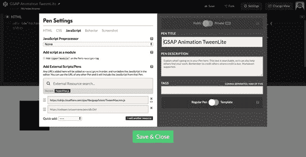
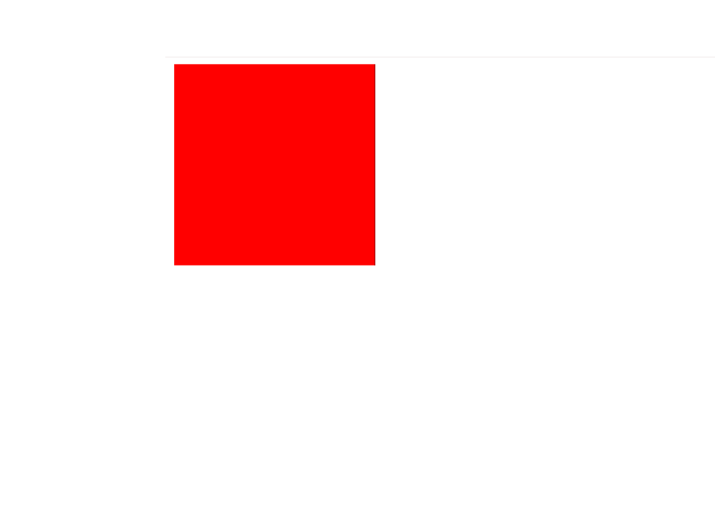
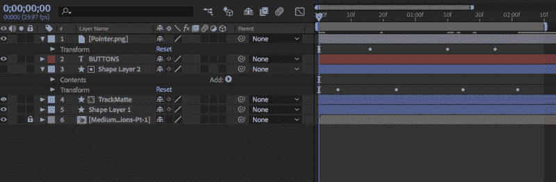
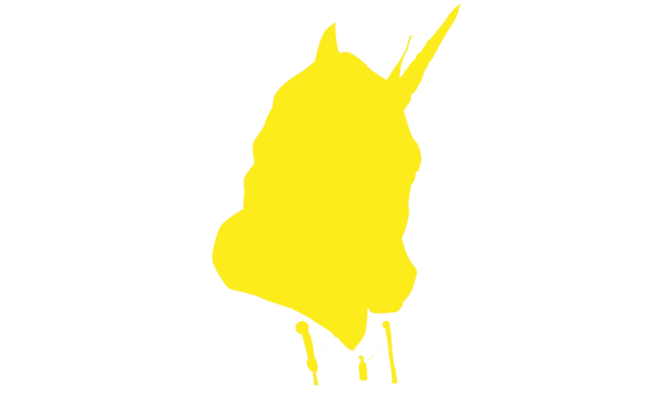
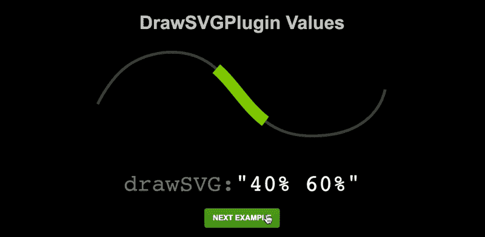

# GreenSock 动画平台初学者指南

> 原文：<https://www.freecodecamp.org/news/the-beginners-guide-to-the-greensock-animation-platform-7dc9fd9eb826/>

尼古拉斯·克莱默

# GreenSock 动画平台初学者指南

#### 在不了解 JavaScript 的情况下创建基于时间轴的动画的初级读本


### 介绍

GreenSock Animation Platform(简称 [GSAP](https://greensock.com/gsap) )是一个强大的 JavaScript 库，使前端开发人员和设计人员能够创建健壮的基于时间轴的动画。这允许对更复杂的动画序列进行精确控制，而不是 CSS 提供的有时具有约束性的`keyframe`和`animation`属性。

这个库最大的优点是它是轻量级的，易于使用。

有了 GSAP，你可以在对 JavaScript 一无所知的情况下开始创作引人入胜的动画。

本指南将展示如何设置和使用 GSAP 的 TweenMax 功能，并深入研究一下 Club GreenSock 的 DrawSVG 插件。下面的每个例子都有一个相应的 CodePen 链接，这样你就可以在另一个标签页中跟随。

### 入门指南

在编码之前，我们首先需要将 GSAP 库添加到我们的 HTML 文件中。为此，您需要获取 TweenMax 库的 CDN 链接。你可以在这里找到 TweenMax 和其他 GSAP cdn[的链接。](https://cdnjs.com/libraries/gsap)

**注** : CDN 代表内容交付网络。这意味着不用在你的网站上托管 JavaScript 文件，像 [CloudFlare](https://www.cloudflare.com/) 这样的外部资源可以为你托管它们。

一旦你有了 CDN 链接，把它插入到 HTML 文件底部的一个`<scri` pt >标签中，就像这样:

```
<script src=“https://cdnjs.cloudflare.com/ajax/libs/gsap/1.20.3/TweenMax.min.js"></script>
```

这就是你需要开始！如果你使用的是在线开发环境，比如 CodePen，你可以通过编辑笔的设置来安装 GSAP。



Click the gear icon next to the JS text editor and search for TweenMax to install it in CodePen

### 了解补间动画

补间动画是 GSAP 的基本动画功能。要制作任何 HTML 对象的动画，我们必须调用该对象，定义我们要制作动画的属性、动画的持续时间、动画的放松以及任何其他参数，如延迟时间。

例如，如果我们要将一个红色矩形的颜色改为黑色，同时将其向右下方移动，则 JavaScript 中的补间动画将如下所示:

```
TweenLite.to(“#rectangle”, 2, {  left:100,   top: 75,   backgroundColor:"#000000",   ease: Power4.easeIn});
```



This tween gives us a rectangle that moves diagonally and changes color.

让我们来分解一下:

`**TweenLite**` **让我们的 JavaScript 文件知道我们想要使用 GSAP** 制作动画。紧接着的`.to`方法表示我们希望我们的对象从由 HTML 和 CSS 定义的原始静态状态变成由 JavaScript 定义的最终动态状态。

您可以使用`.from`方法来逆转这一点。我们将在本文的稍后部分讨论这个问题。

**接下来，我们定义想要制作动画的对象。**在我们的例子中，它是一个具有矩形 ID 的 HTML 对象。这看起来像我们代码中的`“#rectangle”,`。我们必须确保我们的对象用引号括起来，并且我们使用`#`来表示我们正在调用一个 ID。任何 ID 都可以放在这里，只要它是 HTML 中定义的元素。另外，注意引号后面的逗号也很重要。没有它，动画将无法运行。

**元素 ID** **后的** `2,` **定义了动画的持续时间，以秒为单位。**所以在这个例子中，我们将动画的持续时间定义为 2 秒钟。如果我们希望它是半秒长，我们可以将值改为`0.5,`。

**括号内的参数代表您想要制作动画的任何属性。**在这个例子中，我们制作了`left` `top`和`background-color` CSS 属性的动画。请注意，这些不同的属性是如何使用 camelCase 来调用它们，而不是 CSS 使用的典型连字符符号。您可以在这里添加任意多的不同属性，只要在它们的值后用逗号分隔。

**最后调用的属性是动画的`ease`。**《GSAP》附带了一系列不同的放松选项，你可以将它们添加到你的动画中。

在上面的动画中，我们调用`Power4`缓动，并将其设置为动画的`easeIn`。你可以在文档[这里](https://greensock.com/docs/Easing)看到所有的放松选项。如果你对放松不熟悉，一定要看看[以前的一篇文章](https://blog.prototypr.io/css-animations-for-non-developers-part-1-buttons-54572b394fb2)，它深入解释了不同的放松功能。

最后，您必须关闭补间的圆括号和方括号，以防止任何错误并允许动画运行。不要忘记包含分号来结束 JavaScript 函数。

补间动画是 GSAP 动画的基础。你可以在 CodePen [这里](https://codepen.io/Nickramer/pen/wyGXyN)试验这个补间的例子。

如果你想做一次性的动画，补间动画是很棒的，但是如果你想创建多步序列，时间轴是最好的选择。

### 时间轴动画

如果你曾经使用过动画或原型软件，如[后效](https://www.adobe.com/products/aftereffects.html)或[原理](http://principleformac.com/)，你已经熟悉了时间线动画。传统的时间线通常是一系列动画，一次一个或同时发生。GSAP 的时间线没有任何不同。



A visualization of a timeline in After Effects. GSAP timelines are not much different.

要调用时间轴，必须首先在 JavaScript 文件的顶部定义一个变量作为新的`TimelineLite`:

```
var tl = new TimelineLite;
```

要把这行代码一段一段分解，要知道`var`是 variable 的简称。如果你不熟悉什么是变量，可以把它看作是一大段代码的简写。在这种情况下，我们定义了一个新变量为`tl`，并将其设置为等于`new TimelineLite`。这意味着每次我们在代码中输入`tl`，它将代表一个新的`TimelineLite`。

注意，我们可以用`tl`替换任何我们喜欢的速记文本。我用`tl`是因为它是`timeline`的简称。这很有用，因为如果我们的文件中有多个时间线，我们可以给每个时间线一个唯一的变量以防止混淆。

现在让我们用`TimelineLite`代替`TweenLite`重新制作我们的第一个动画，看看这是如何工作的。

```
var tl = new TimelineLite;
```

```
tl.to(“#rectangle”, 2, {  x:100,  y:75, backgroundColor: “#000000”, ease: Power4.easeIn})
```


Notice how it’s rendering the exact same animation as the tween before.

你会注意到这和我们上面的`TweenLite`动画没什么不同。唯一真正的区别是我们用`tl.to`代替了`TweenLite.to`。你还会注意到我们现在使用的是`x`和`y`坐标，而不是`left`和`top` CSS 属性。这些或多或少表现出相同的方式。

另外，请注意括号的末尾没有分号。这是因为我们将添加第二个动画到这个时间线上，将它们连接在一起。

对于第二个动画，让我们将矩形放大 150%，并在第一个动画完成后变成灰色。为此，我们将在第一个动画下添加另一个代码块。总的来说，它看起来像这样:

```
var tl = new TimelineLite;
```

```
tl.to(“#rectangle”, 2, {  x:100,  y: 75, backgroundColor: “#000000”, ease: Power4.easeIn})
```

```
.to(“#rectangle”, 1, { scaleX: 1.5, scaleY: 1.5, backgroundColor: “#454545”, ease: Back.easeOut.config(1.7)});
```


We’re now tethering two animations together in a timeline.

您可以看到第二个代码块在时间轴的开头没有`tl.to`。反而只有`.to`。

这是因为一个时间线中的多个动画可以连接在一起，只要没有分号分隔它们。

分号表示时间线的结束，应该只在时间线内最后一个动画的结尾使用。

您还会注意到我们使用了两个新属性，`scaleX`和`scaleY`。这些属性的行为就像它们听起来的那样，它们将对象的大小增加一个百分比。在这种情况下，1.5 相当于 150%。

最后，我们在这里使用一个独特的缓动函数`Back.easeOut.config(1.7)`。这种放松通过超出预期值，然后回到最终值，为我们的动画提供了自然的节奏。我们可以看到在这个动画的情况下，矩形如何增长略大于 150%，然后自己缩小。

#### 使用 TimelineLite 制作多个对象的动画

时间轴不限于制作一个对象的动画。通过在不同的函数中添加相应的 id，您可以在时间轴中制作多个对象的动画。

例如，如果我们要创建一个圆形的 HTML 对象，并在矩形放大后淡入，我们的代码将如下所示:

```
var tl = new TimelineLite;
```

```
tl.to(“#rectangle”, 2, {  x:100,  y: 75, backgroundColor: “#000000”, ease: Power4.easeIn})
```

```
.to(“#rectangle”, 1, { scaleX: 1.5, scaleY: 1.5, backgroundColor: “#454545”, ease: Back.easeOut.config(1.7)})
```

```
.from(“#circle”, 1, { opacity: 0,});
```


This latest block of code now has a circle fade in at the end of our animation.

我们在动画中添加了第三个代码块来调用这个圆。

还要注意我们现在如何使用`.from`方法。这意味着我们的圆形动画从 0%不透明度开始，然后到 100%不透明度。

当我们的动画隐藏了圆圈时，你可以看到这一点，因为它从 0%的不透明度开始。在矩形改变颜色并放大后，圆形以 100%的不透明度淡入，正如预期的那样。

您可以在此处的 CodePen 示例[中看到 TimelineLite 的工作方式。我鼓励你尝试向 HTML 中添加新元素，并尝试使用提供的工具创建更复杂和独特的序列。您也可以在这里](https://codepen.io/Nickramer/pen/ddMqZY)查看完整的 GSAP TimelineLite 文档[，了解其他方法和属性。](https://greensock.com/docs/TimelineLite)

### DrawSVG

除了免费的 TweenLite 和 TimelineLite 功能，GSAP 还提供优质内容，让您可以轻松操作 SVG。幸运的是，这些插件可以在 CodePen 上免费使用，只需在笔设置中搜索它们(JS 文本编辑器旁边的齿轮图标)。

DrawSVG 插件使 SVG 的线条动画变得容易。为了展示这一点，我们将有一个穿着连帽衫的独角兽本身的 SVG。您可以在此跟随相应的代码笔[。](https://codepen.io/Nickramer/pen/JXQeLM)



The final result of animating the SVG lines.

首先，我们需要导出我们的 SVG 并将其导入到我们的文本编辑器中。

要全面了解如何正确导出 SVG，请点击这里查看以前的文章。

接下来，我们需要给每个单独的路径一个 ID，这样我们就可以在时间轴中调用每个路径。如果您有一个包含一系列不同动画线条的复杂 SVG，这可能需要一些时间。为了简单起见，我将第一个路径命名为`#unicorn1`，下一个路径命名为`#unicorn2`，依此类推，直到它们都有一个惟一的 ID。

```
<!––An example of a path with an ID--><path id=”unicorn1" class=”st0" d=”M371.8,252.4c0,0,2.8,1.8,5,1.2"/>
```

现在我们所有的路径都有了一个 ID，我们可以开始开发我们的时间轴动画了。像以前一样，我们需要创建一个变量来作为我们的`TimelineLite`变量:

```
var unicorndraw = new TimelineLite();
```

在这种情况下，我们将使用变量`unicorndraw`。

我们需要做的最后一步是创建一个调用每个单独路径的 TimelineLite 动画:

```
unicorndraw.from(“#unicorn1, #unicorn2, #unicorn3, #unicorn4, #unicorn5, #unicorn6, #unicorn7, #unicorn8, #unicorn9, #unicorn10, #unicorn11, #unicorn12, #unicorn13, #unicorn14, #unicorn15, #unicorn16, #unicorn17, #unicorn18, #unicorn19, #unicorn20, #unicorn21, #unicorn22, #unicorn23, #unicorn24, #unicorn25, #unicorn26, #unicorn27, #unicorn28, #unicorn29, #unicorn30, #unicorn31, #unicorn32, #unicorn33, #unicorn34, #unicorn35, #unicorn36, #unicorn37, #unicorn38, #unicorn39, #unicorn40, #unicorn41, #unicorn42, #unicorn43, #unicorn44, #unicorn45, #unicorn46, #unicorn47, #unicorn48, #unicorn49, #unicorn50, #unicorn51, #unicorn52, #unicorn53, #unicorn54, #unicorn55, #unicorn56, #unicorn57, #unicorn58, #unicorn59, #unicorn60, #unicorn61, #unicorn62, #unicorn63”, 3, {drawSVG:”0", delay:”1"})
```

您可以看到这与我们之前的`.from` TimelineLite 动画非常相似。我们调用我们的单个对象(在这种情况下，我们一次调用多个对象，以便它们同时激活)，我们将动画的持续时间定义为 3 秒。

唯一的区别是在括号内，我们现在使用了`drawSVG: “0”`。这将调用 drawSVG 插件，并将每个路径的值定义为 0。因为我们使用的是`.from`方法，路径从 0 值开始，然后在 3 秒钟内动画到 100%。



You can play with different values to get a unique animation style.

括号内的另一段代码是`delay: “1”`。这决定了动画等待执行的时间，以秒为单位。在这种情况下，我们声明动画将在执行前等待 1 秒钟。

这是开始使用 drawSVG 插件最快的方法，但是你可以用许多不同的方法操作这些值来获得一些有趣的效果。要了解更多关于这个插件的信息，请访问 GSAP 的网站。

### 最后的想法

即使你对 JavaScript 知之甚少甚至一无所知，GSAP 也能让你轻松创建和操作自己的时间轴动画。这是你可以用 GSAP 做的少量不同的动画。查看 Greensock 的[网站](https://greensock.com/)以了解更多关于该库的信息，并尝试不同的动画技术。

尼古拉斯·克莱默是一名设计师，目前在纽约市的 [Barrel](https://www.barrelny.com/) 工作。他为企业解决设计问题，帮助他们简化想法，并向客户传达他们的价值。

***保持联系！*** *[滴滴出行](https://dribbble.com/NicholasKramer) | [领英](https://www.linkedin.com/in/nicholas-kramer-3574b463/) | [网站](http://kramergraphicdesign.com/)*