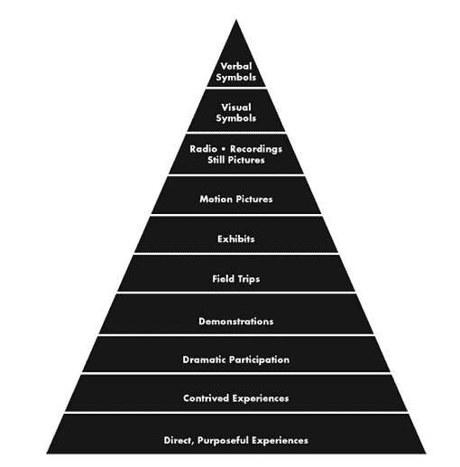

# 不要复制粘贴代码。打出来。？

> 原文：<https://www.freecodecamp.org/news/the-benefits-of-typing-instead-of-copying-54ed734ad849/>

#### 输入代码可以帮助你培养学习的心态

想破解一些密码吗？在你明白它的作用之前，很快就改变它。

现在你正在练习 Cargo Cult 编程——这是一种软件开发风格，你忽略了一段代码是如何工作的，以及它与周围代码的关系。

> 术语 *cargo cult 程序员*可能适用于对手头问题没有经验的计算机程序员[将一些代码](https://en.wikipedia.org/wiki/Copy_and_paste_programming)从一个地方复制到另一个地方，而很少或根本不了解它是如何工作的，或者它在新的位置是否需要。
> 
> ——[维基百科上的货邪教编程](https://en.wikipedia.org/wiki/Cargo_cult_programming)

当一个开发人员**复制**一段他们不理解的代码，并希望用它来修复某个问题时，他们正在练习 Cargo Cult 编程。这增加了意外副作用的风险。

当一个开发人员**读到**一段他们不理解的代码，仍然希望修改它来修复一些问题时，他们也在练习 Cargo Cult 编程。

在这种情况下，问题不在于开发者在复制什么。任何人都可以复制一段代码，理解它，从中学习，使用它，并且仍然有较低的意外副作用的风险。

另一方面，Cargo Cult 编程代表了对从其他人的代码中学习的成熟步骤的根本性误解。

在这种情况下，最有效的学习方法是:

1.  阅读一段代码。
2.  理解在那里使用的语言的所有特征。
3.  了解那里使用的库/框架的所有特性。
4.  学习这些库/框架的基础知识。
5.  理解每一行代码的作用以及这些库/框架在这段代码上下文中的用途。

对于开始学习一门新语言的人来说，这将是极其困难的。为了有效地理解一小段代码，一个人需要记住的信息量是如此之大，以至于可能会马上忘记。我们能做的是利用一些经过验证的技术，利用人类大脑如何有意识或无意识地学习事物的某些方面。

其中一个技巧是[阻挡练习](https://psychologywod.com/2013/08/18/blocked-practice-vs-random-practice-shake-things-up-in-your-training-and-in-your-life/)。这基本上是你通过“一遍又一遍地表演一项技能，重复是关键”来学习的地方。

尽管这不是最好的学习方式。[已经证明](https://psychologywod.com/2013/08/18/blocked-practice-vs-random-practice-shake-things-up-in-your-training-and-in-your-life/)当你交叉学习同一技能的不同变化时，你会学得更有效率。



The Cone of Experience, from [Dale, Edgar. Audio-Visual Methods in Teaching (p. 39)](http://ocw.metu.edu.tr/file.php/118/dale_audio-visual_20methods_20in_20teaching_1_.pdf). The graph shows two extremes between direct experience (bottom) into pure abstraction (top). Intuitively we could assume that reading or lectures (abstract visual symbols) could have less retention rate than practice (Direct, Purposeful Experiences). *Note: There is evidence that the famous [Learning Pyramid](https://www.fitnyc.edu/files/pdfs/CET_Pyramid.pdf) might be a knock-off of the Cone of Experience, with added numbers that seem to [have been made up](http://www.willatworklearning.com/2006/05/people_remember.html) (I have created [a post about this](https://hackernoon.com/the-danger-of-relying-on-abstractions-dfa04a8d553d)).*

在软件工程中，当我们**在不同的上下文中键入**代码时，我们可以利用分块和交错学习实践，而不仅仅是**复制和粘贴**它。

当复制粘贴代码片段时，我们只是在阅读(如果我们真的这么做的话)。根据经验锥的关系，我们可能只学到我们所消耗的信息的一小部分，因为它太抽象了。

相比之下，通过实际输入这段代码可以更好地学习。这是一种更直接、更有目的性的体验。它迫使你的大脑理解所有这些不同的模式，并更有效地学习。

> 键入代码而不是复制粘贴代码会提供更好的学习 ROI，因为我们是在练习而不是仅仅阅读。

命名被认为是编程中最困难的方面之一。当我们在不理解代码的情况下复制代码时，我们会冒由于覆盖变量名、函数名或类而破坏代码的风险。

相反，如果我们首先理解代码，然后用我们自己的话键入它，我们可以用一种适合我们的应用程序的方式来重命名东西，并确保我们没有任何[命名冲突](https://en.wikipedia.org/wiki/Naming_collision)，即使最终结果在功能上与我们所基于的代码段相同。

除此之外，如果我们将代码从代码库中的一个地方复制到另一个地方，我们有可能会复制不必要的令牌，或者忘记更改应该更改的令牌。

以下面的 HTML 代码片段为例:

```
<label for="name"></label>
<div class="input-wrapper">
  <input type="text" id="name">
</div>
```

[The code for an HTML snippet](https://gist.github.com/FagnerMartinsBrack/550a6324368f59dc0a7ddea671c00122) with a label element containing an attribute called "for" and value "name" and an input with the attribute "id" and value "name".

当复制该代码来创建新输入时，我们很可能忘记更改*标签*元素的属性的*，这将破坏新输入的预期行为。*

```
<label for="name"></label>
<div class="input-wrapper">
  <input type="text" id="name">
</div>

<label for="name"></label>
<div class="input-wrapper">
  <input type="password" id="password">
</div>
```

[The code](https://gist.github.com/FagnerMartinsBrack/89d0ad963563d64868970ae2d8aa8492) showing the previous label and input elements being duplicated to create a new field. The label has been copied over, however, the attribute "for" remained unchanged.

这个例子很有趣，因为它是一种很难测试的功能，即使使用视觉回归。它很大程度上依赖于静态测试——比如代码审查——来确保代码是为预期目的而编写的。(在这种情况下，将鼠标事件传播到与标签*的*属性的 *id* 相同的输入。)

测试也是如此。当我们复制一个已经通过的测试，而不是从头开始创建一个新的测试时，我们冒着不改变必要的令牌的风险，否则会导致测试失败。

不过，在这种情况下，我们可以通过使用[测试驱动开发](https://medium.com/@fagnerbrack/why-test-driven-development-4fb92d56487c)来防止这种错误——这种思维模式基于首先创建一个失败的测试，然后更改应用程序代码以使其通过。这种心态让我们有信心，我们不太可能错过什么或者[产生假阳性](https://medium.com/@fagnerbrack/mocking-can-lean-to-nondeterministic-tests-4ba8aef977a0)。

与其在不理解的情况下复制代码，不如学习别人的代码，并在其上实践。这将使你的学习投资回报率最大化。

毕竟，开发人员最有价值的资源是大脑，而不是手指。

感谢阅读。如果您有任何反馈，请通过 [Twitter](https://twitter.com/FagnerBrack) 、[脸书](https://www.facebook.com/fagner.brack)或 [Github](http://github.com/FagnerMartinsBrack) 联系我。