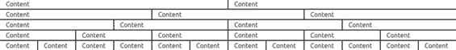
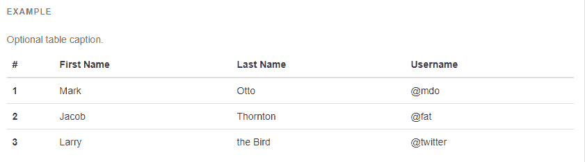
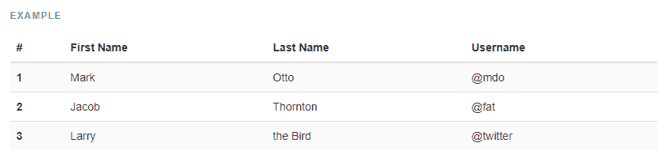
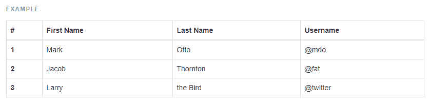
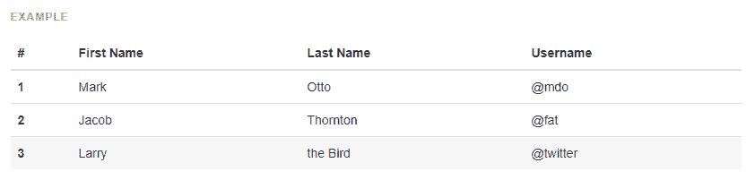
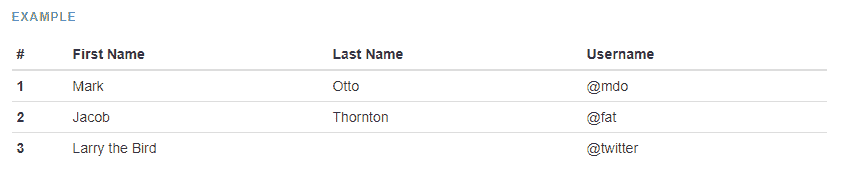
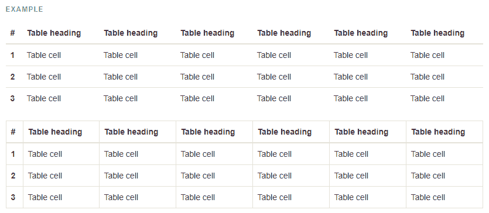
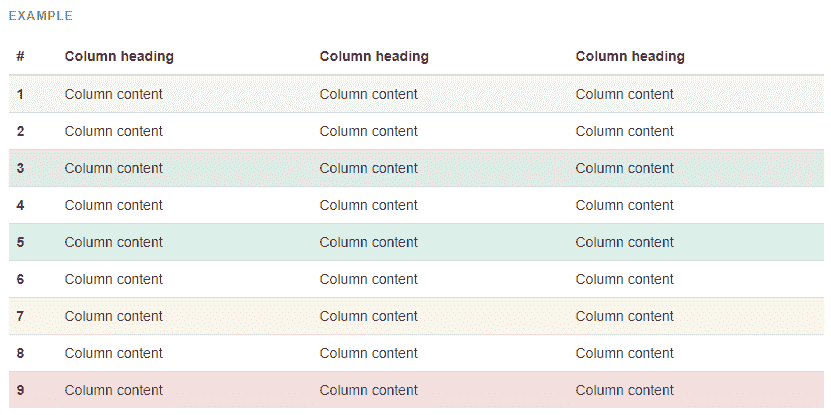

# 最佳自举示例

> 原文：<https://www.freecodecamp.org/news/the-best-bootstrap-examples/>

Bootstrap 是一个流行的 web 开发前端框架。它包含预构建的组件和设计元素来设计 HTML 内容的样式。Chrome、Firefox、Opera、Safari 和 Internet Explorer 等现代浏览器都支持 Bootstrap。

Bootstrap 包括一个用于不同布局的响应网格系统。这是建立一个移动友好网站的一个很好的起点。它还包括可选的 JavaScript 功能，比如可折叠内容、传送带和模态。

## 为什么使用 Bootstrap？

Bootstrap 为设计和响应提供了一个简单的解决方案。它充满了美丽的元素，可以用你自己的自定义 CSS 进一步设计，还有一个完整的网格系统，可以让你的网站在所有屏幕上保持响应，同时使用一个干净和可理解的语法。你可以建立一个专业的网站，不需要任何 CSS 或 JavaScript，如果需要的话，可以很容易地定制元素

## 版本历史

Twitter 最初开发 Bootstrap 框架作为内部工具。他们在 2011 年 8 月将其作为开源项目发布。

Bootstrap 2 于 2012 年 1 月发布。主要特征之一是引入了 12 列响应网格系统。Bootstrap 3 出现在 2013 年 8 月，转向扁平设计和移动优先的方法。Bootstrap 4 从 2017 年 8 月开始提供测试版，现在包括 Sass 和 Flexbox。

Bootstrap 4 在 2017 年发布一些测试版本之前已经开发了两年，而第一个稳定版本是在 2018 年 1 月发布的。一些显著的变化包括:

*   从少到多；
*   转移到 Flexbox 和改进的网格系统；
*   添加的卡片(替换孔、缩略图和面板)；
*   还有更多！

在撰写本文时，Bootstrap 的最新版本是 [4.1.3](http://blog.getbootstrap.com/2018/07/24/bootstrap-4-1-3/) 。如果你想了解任何公告的消息，请点击[这里](http://blog.getbootstrap.com/)。

## 自举功能

*   Bootstrap 3 支持最新版本的 Google Chrome、Firefox、Internet Explorer、Opera 和 Safari(Windows 上除外)。它还支持回到 IE8 和最新的 Firefox 扩展支持版本(ESR)。[12]
*   从 2.0 开始，Bootstrap 支持响应式 web 设计。这意味着网页布局会根据所用设备(台式机、平板电脑、手机)的特性进行动态调整。
*   从 3.0 版本开始，Bootstrap 采用了移动优先的设计理念，默认强调响应式设计。
*   4.0 版本增加了 Sass 和 flexbox 支持。
*   版本 4.1 增加了新的自定义范围表单控件。
*   Bootstrap 并不限制你使用固定的 CSS 格式，而是允许你快速开发，允许使用层叠来添加/编辑默认样式。

## 开始

Bootstrap 是由 Twitter 开发的免费开源框架，它提供了各种用于前端 web 开发的模板。使用 Bootstrap 可以轻松设计一个完全响应的网站，是一个值得学习的框架。

### 如何将 Bootstrap 添加到我的页面？

将 bootstrap 添加到您的页面是一个快速的过程，只需将以下内容添加到代码中的`<head>`标记中。

```
<link rel="stylesheet" href="https://stackpath.bootstrapcdn.com/bootstrap/4.1.3/css/bootstrap.min.css" integrity="sha384-MCw98/SFnGE8fJT3GXwEOngsV7Zt27NXFoaoApmYm81iuXoPkFOJwJ8ERdknLPMO" crossorigin="anonymous">
```

*注意:这些只是示例，可能会随时更改，恕不另行通知。请参考 CDN，了解当前项目中包含的链接。*

一些引导组件需要其他 JavaScript 文件，查看引导文档[这里](https://getbootstrap.com/docs/4.1/getting-started/introduction/#js)找到最新的脚本文件。

您还需要在代码中的`body`标记之间添加以下内容。有了 bootstrap，在使用 Bootstrap 的许多特性时，您将使用`<div>`标签，例如

```
<div class="alert alert-success" role="alert">
    <strong>Congratulations!</strong>
    <p>Bootstrap is now working on this page</p>
</div>
```

****恭喜恭喜！****

引导程序现在正在这个页面上工作

### 使用软件包管理器安装引导程序

一个流行的包管理器是 NPM 或节点包管理器。您需要安装 Node.js，它包括节点包管理器。访问 [Node.js](https://nodejs.org/en/) 根据你的 OS 下载必要的文件，然后安装。

安装和设置完成后，打开命令行或控制台，在希望使用 Bootstrap 的项目文件夹中键入以下内容。在撰写本文时，这将安装引导版本 4.0.0

```
npm install bootstrap@4.0.0 --save
```

一旦 NPM 完成了 Bootstrap 4 的下载和安装，在你的项目文件夹中就会有一个名为`node_modules`的新文件夹，如果它还不存在的话。

*   包含我们文件的 CSS 和 Sass 版本。
*   `/jquery`在各种组件中由 Bootstrap 使用。
*   这是一个用于元素定位的库。

## 网格系统

简而言之，Bootstrap grid 系统帮助您创建响应性布局，它由行和列组成，帮助您构建内容。

行是水平的列组，每页每行最多有 12 列。在每一行中，内容放在列中，可以跨越 1 到 12 列。

Bootstrap 有五种不同类型的网格层:超小型、小型、中型、大型和超大型。为这些网格层中的每一层都定义了一个断点。Bootstrap 使用像素来定义网格层断点。

### 容器

容器是*包含*你的网格的最外层元素。对于屏幕中间的固定宽度容器，使用`container`(在较大的屏幕上增加额外的边距)，或者使用`container-fluid`获得全宽度。

```
<div class="container"></div>
```

### 排

使用`row`对您的列进行分组。这将使所有的东西排列整齐，并帮助你构建你的网格。

```
<div class="row"></div>
```

### 列

列类表示您希望在每行可能的 12 列中使用的列数。例如，`col-sm-6`将意味着你的列在小屏幕上用完了`row`宽度的一半，而`col-lg-4`将在大屏幕上用完三分之一。

下面是如何定义一个类前缀，以在各种屏幕尺寸上用完一个列宽:

*   ****特大小号****
*   ****小****
*   ****中等****
*   ****大型****
*   ****特大号****

```
<div class="col-sm-1"></div>
```

### 例子

有四列的全宽网格，每列在 xs 屏幕上占一整行，在 sm 和 md 屏幕上占半行，在大及以上屏幕上占该行宽度的四分之一:

```
<div class="container-fluid">
  <div class="row">
    <div class="col-12 col-sm-6 col-lg-4">First Column</div>
    <div class="col-12 col-sm-6 col-lg-4">Second Column</div>
    <div class="col-12 col-sm-6 col-lg-4">Third Column</div>
    <div class="col-12 col-sm-6 col-lg-4">Forth Column</div>
  </div>
</div>
```

*注意`col-md`和`col-xl`没有定义，在没有定义尺寸的地方，它将默认为已经指定的下一个更小的尺寸。*

Bootstrap 提供了一个现成的 12 列网格系统用于布局。考虑下面的代码。

```
 <div class="container">
	<div class="row">
		<div class="col-md-6">Content</div>
		<div class="col-md-6">Content</div>
	<div>
   </div>
```

其中:

```
- col = column
- md = screen size
- 6 = column width
```

作为一个 12 列网格系统，所有用户定义的网格列宽总和必须为 12。

屏幕尺寸值可分配如下:

*   xs - < 768px 手机
*   sm - < 992px 片剂
*   md - < 1200px 笔记本电脑
*   LG-> 1200 像素台式机

下面的代码和图像显示了使用不同列宽的可能性。

```
 <div class="container">
		<div class="row">
			<div class="example col-md-6">Content</div>
			<div class="example col-md-6">Content</div>
		<div>
	</div>

	<div class="container">
		<div class="row">
			<div class="example col-md-4">Content</div>
			<div class="example col-md-4">Content</div>
			<div class="example col-md-4">Content</div>
		<div>
	</div>

	<div class="container">
		<div class="row">
			<div class="example col-md-3">Content</div>
			<div class="example col-md-3">Content</div>
			<div class="example col-md-3">Content</div>
			<div class="example col-md-3">Content</div>
		<div>
	</div>

	<div class="container">
		<div class="row">
			<div class="example col-md-2">Content</div>
			<div class="example col-md-2">Content</div>
			<div class="example col-md-2">Content</div>
			<div class="example col-md-2">Content</div>
			<div class="example col-md-2">Content</div>
			<div class="example col-md-2">Content</div>
		<div>
	</div>

	<div class="container">
		<div class="row">
			<div class="example col-md-1">Content</div>
			<div class="example col-md-1">Content</div>
			<div class="example col-md-1">Content</div>
			<div class="example col-md-1">Content</div>
			<div class="example col-md-1">Content</div>
			<div class="example col-md-1">Content</div>
			<div class="example col-md-1">Content</div>
			<div class="example col-md-1">Content</div>
			<div class="example col-md-1">Content</div>
			<div class="example col-md-1">Content</div>
			<div class="example col-md-1">Content</div>
			<div class="example col-md-1">Content</div>
		</div>
	</div>
```



## 小跟班

Bootstrap 框架为您提供了各种按钮样式选项。这些样式帮助您向用户提供按钮可以做什么的可视化表示。

### 如何使用

要使用 bootstrap 按钮，您需要遵循与在 HTML 中创建按钮相同的步骤，除了您还要将适用的 CSS 类应用于按钮。下面提供了一个代码示例。

****代码示例** :**

`<button type="button" class="btn btn-primary">Primary</button>`

您也可以使用带有`<a>`和`<input>`元素的引导按钮，如下例所示。根据[引导](https://getbootstrap.com/docs/4.0/components/buttons/)文档，

当在用于触发页面内功能(如折叠内容)的元素上使用按钮类，而不是链接到当前页面中的新页面或新部分时，应该给这些链接一个`role="button"`来适当地将它们的目的传达给辅助技术，如屏幕阅读器。

`<a class="btn btn-primary" href="#" role="button">This button is a link</a>`

`<input class="btn btn-primary" type="submit" value="Submit">`

### 按钮类别列表

这是 bootstrap 为按钮提供的 CSS 类的列表。他们为按钮提供背景色。

`.btn`这是 bootstrap 的基本按钮。如果您希望其他引导按钮正常工作，这是一个先决条件。

`<button type="button" class="btn">Basic</button>`

`.btn-primary` Bootstrap 的主按钮。默认颜色显示#007bff。

`<button type="button" class="btn btn-primary">Primary</button>`

`.btn-secondary` Bootstrap 的二级按钮。默认颜色显示#6c757d。

`<button type="button" class="btn btn-secondary">Secondary</button>`

`.btn-success` Bootstrap 的成功按钮。默认颜色显示#28a745。

`<button type="button" class="btn btn-success">Success</button>`

`.btn-info`引导程序的信息按钮。默认颜色显示#17a2b8。

`<button type="button" class="btn btn-info">Info</button>`

`.btn-warning` Bootstrap 的警告按钮。默认颜色显示#ffc107。

`<button type="button" class="btn btn-warning">Warning</button>`

`.btn-danger`自举的危险按钮。默认颜色显示为#dc3545。

`<button type="button" class="btn btn-danger">Danger</button>`

`.btn-link` Bootstrap 的链接按钮。

`<button type="button" class="btn btn-link">Link</button>`

`.btn-light` Bootstrap 的灯按钮。

`<button type="button" class="btn btn-light">Light</button>`

`.btn-dark` Bootstrap 的黑暗按钮。

`<button type="button" class="btn btn-dark">Dark</button>`

这是 bootstrap 的黑暗按钮。

这是 bootstrap 的第二个按钮。

### 按钮尺寸

这是不同大小按钮的 CSS 类列表。

`.btn-lg` Bootstrap 的大按钮。

`<button type="button" class="btn btn-lg">Large</button>`

`.btn-md`这是 bootstrap 的中键。

`<button type="button" class="btn btn-md">Medium</button>`

`.btn-sm` Bootstrap 的小按钮。

`<button type="button" class="btn btn-sm">Small</button>`

`.btn-md`这是 bootstrap 的中键。

`.btn-xs`这是 bootstrap 的额外小按钮。

`<button type="button" class="btn btn-xs">Extra Small</button>`

`.btn-block`这是 bootstrap 的全幅按钮。

### 禁用按钮状态

这用于通过淡化按钮来显示该按钮被禁用。这可以通过给`<button>`标签添加“禁用”来实现。

`.btn-block`这是 bootstrap 的程序块级别按钮。它们实际上跨越了其父元素的整个宽度。例如，一个宽度为 200 像素的表单元素，这意味着 btn-block 按钮的宽度为 200 像素。

### 轮廓按钮

也可以有轮廓按钮而不是全彩色按钮。这是通过将 mid fix `outline`放在你想要的按钮类之间来实现的。示例用法如下:

`<button type="button" class="btn btn-outline-primary">Primary</button>`

`<button type="button" class="btn btn-outline-secondary">Secondary</button>`

`<button type="button" class="btn btn-outline-success">Success</button>`

`<button type="button" class="btn btn-outline-danger">Danger</button>`

`<button type="button" class="btn btn-outline-warning">Warning</button>`

`<button type="button" class="btn btn-outline-info">Info</button>`

`<button type="button" class="btn btn-outline-light">Light</button>`

`<button type="button" class="btn btn-outline-dark">Dark</button>`

从版本 4 开始，轮廓按钮就是引导程序的一部分——如果您无法使用它们，请确保您使用的是正确的版本。

### 内嵌按钮

您可以通过向元素添加`.d-inline-block`类来创建内联按钮行，该元素将按钮的显示设置为内联块。比如:`<button class="btn btn-primary d-inline-block btn-lg"></button>`

### 按钮分组

对于某些用途，如分页，可以将多个按钮组合在一起。通过为所有想要分组的按钮创建一个父按钮`div`，使用这个`div`上的`.btn-group`类，可以完成对按钮的分组:

```
<div class="btn-group" role="group" aria-label="Basic example">
  <button type="button" class="btn btn-secondary">Left</button>
  <button type="button" class="btn btn-secondary">Middle</button>
  <button type="button" class="btn btn-secondary">Right</button>
</div>
```

## 下拉菜单

Bootstrap 提供下拉菜单作为显示链接列表的插件。下拉菜单是一个按钮，用于切换链接列表的显示。

Bootstrap 的下拉菜单是通用的，适用于各种情况。例如，可以创建包含搜索字段或登录表单的下拉列表。

```
<div class="dropdown">
  <button class="btn btn-secondary dropdown-toggle" type="button" id="dropdownMenuButton" data-toggle="dropdown" aria-haspopup="true" aria-expanded="false">
    Dropdown example
  </button>
  <div class="dropdown-menu" aria-labelledby="dropdownMenuButton">
    <a class="dropdown-item" href="#">Action</a>
    <a class="dropdown-item" href="#">Another action</a>
    <a class="dropdown-item" href="#">Something else here</a>
  </div>
</div>
```

*。dropdown* 类表示一个下拉菜单。

要打开下拉菜单，使用一个按钮或一个带有类别*的链接。下拉开关*和*数据-开关= "下拉开关*属性。

*。caret* 类创建一个 caret 箭头图标(▼)，表示按钮是一个下拉菜单。

添加*。drop-menu*类添加到一个无序列表元素中，以实际构建下拉菜单。

## 导航栏

Bootstrap 框架为您提供了一个称为导航栏的特性。简而言之，导航栏(也称为 navbar)是页面顶部显示导航信息的标题。

### 如何使用

要使用引导导航栏，您需要在网页的`<body>`元素内的顶部添加一个`<nav>`元素。您可以添加各种样式来自定义导航栏的显示。

这是制作一个基本导航条所需的代码:

```
<nav class="navbar navbar-default">
  <div class="container-fluid">
    <div class="navbar-header">
      <a class="navbar-brand" href="#">Site Name</a>
    </div>
    <ul class="nav navbar-nav">
      <li class="active"><a href="#">Home</a></li>
      <li><a href="#">Page 1</a></li>
      <li><a href="#">Page 2</a></li>
      <li><a href="#">Page 3</a></li>
    </ul>
  </div>
</nav>
```

### 导航条样式

Bootstrap 在 Bootstrap 框架中提供了一组类来设计你的导航条。这些类别如下:

*   这是导航条的默认样式。
*   除了颜色颠倒之外，这与默认样式相似。

### 向导航栏添加下拉菜单

您可以在导航栏中包含一个下拉菜单。该特性要求您包含 Bootstrap 的 javascript 文件才能工作。

```
<li class="dropdown">
  <a class="dropdown-toggle" data-toggle="dropdown" href="#">Drop down
    <span class="caret"></span>
  </a>
<ul class="dropdown-menu">
    <li><a href="#">Item 1</a></li>
    <li><a href="#">Item 2</a></li>
    <li><a href="#">Item 3</a></li>
  </ul>
</li>
```

### 向导航栏添加按钮

您可以在导航栏上添加按钮。现有的 Bootstrap Button 类可以工作，但是您需要在类列表的末尾包含类`navbar-btn`。

```
<button class="btn navbar-btn">Button</button>
```

### 向导航栏添加品牌标志或名称

`navbar-brand`类可以应用于大多数元素，但是锚点效果最好，因为一些元素可能需要实用程序类或定制样式。

```
<!-- As a link -->
<nav class="navbar navbar-light bg-light">
  <a class="navbar-brand" href="#">Navbar</a>
</nav>
```

```
<!-- As a heading -->
<nav class="navbar navbar-light bg-light">
  <span class="navbar-brand mb-0 h1">Navbar</span>
</nav>
```

### 向导航栏添加表单

您也可以将表单添加到导航栏。这可用于搜索字段、快速登录字段等任务。

```
<form class="navbar-form navbar-right">
  <div class="form-group">
      <input type="text" class="form-control" placeholder="Search">
  </div>  
  <button type="submit" class="btn btn-default">Search</button>  
</form>
```

### 将元素在导航栏上向右对齐

在某些情况下，您可能希望将导航栏中的元素靠右对齐(例如登录或注册按钮。).为此，您需要使用`navbar-right`类。

```
<nav class="navbar navbar-default">
  <div class="container-fluid">
    <div class="navbar-header">
      <a class="navbar-brand" href="#">Site Name</a>
    </div>
    <ul class="nav navbar-nav">
      <li class="active"><a href="#">Home</a></li>
      <li><a href="#">Page 1</a></li>
      <li><a href="#">Page 2</a></li>
      <li><a href="#">Page 3</a></li>
    </ul>
    <ul class="nav navbar-nav navbar-right">
      <li><a href="#">Action Link #1</a></li>
      <li><a href="#">Action Link #2</a></li>
    </ul>
  </div>
</nav>
```

### 独立于滚动显示导航栏

在某些情况下，你可能想让导航条保持在屏幕的顶部或底部，而不管滚动。您需要将`navbar-fixed-top`或`navbar-fixed-bottom`类添加到`<nav>`元素中。

```
<nav class="navbar navbar-default navbar-fixed-top">
  <div class="container-fluid">
    <div class="navbar-header">
      <a class="navbar-brand" href="#">Site Name</a>
    </div>
    <ul class="nav navbar-nav">
      <li class="active"><a href="#">Home</a></li>
      <li><a href="#">Page 1</a></li>
      <li><a href="#">Page 2</a></li>
      <li><a href="#">Page 3</a></li>
    </ul>
  </div>
</nav>
```

### 折叠导航栏

在小屏幕上(比如手机或平板电脑)，导航条会占据太多空间。幸运的是，可以折叠导航条。您可以使用下面的示例来实现这一点。

```
<nav class="navbar navbar-default">
  <div class="container-fluid">
    <div class="navbar-header">
      <a class="navbar-brand" href="#">Site Name</a>
    </div>
    <ul class="nav navbar-nav">
      <li class="active"><a href="#">Home</a></li>
      <li><a href="#">Page 1</a></li>
      <li><a href="#">Page 2</a></li>
      <li><a href="#">Page 3</a></li>
    </ul>
  </div>
</nav>
```

## （电视机的）超大屏幕

是一个轻量级的、灵活的组件，用于展示英雄单位风格的内容。`Jumbotron`是一个响应式组件，其主要目标是集中访问者的注意力或突出特殊信息。

超大屏幕利用几乎任何其他引导代码来额外增加其参与价值。它的操作与图像，放大字体，不同的背景风格等。

### 大屏幕最吸引人的特点

*   在你的网站上展示营销信息
*   项目演示
*   文章简介
*   图像展示

### 如何使用

使用带有类`.jumbotron`的`<div>`元素创建一个超大屏幕:

```
<div class="jumbotron">
  <h1 class="display-4">Hello, world!</h1>
  <p class="lead">This is a simple hero unit, a simple jumbotron-style component for calling extra attention to featured content or information.</p>
  <hr class="my-4">
  <p>It uses utility classes for typography and spacing to space content out within the larger container.</p>
  <a class="btn btn-primary btn-lg" href="#" role="button">Learn more</a>
</div> 
```

### 流体大屏幕

为了使大屏幕全宽，没有圆角，添加`.jumbotron-fluid`修改器类，并在其中添加一个`.container`或`.container-fluid`。

```
<div class="jumbotron jumbotron-fluid">
  <div class="container">
    <h1 class="display-4">Fluid jumbotron</h1>
    <p class="lead">This is a modified jumbotron that occupies the entire horizontal space of its parent.</p>
  </div>
</div>
```

## 形式

Bootstrap framework 提供了一个表单功能，您可以使用它轻松创建漂亮的 HTML 表单。使用 Bootstrap 表单为每个表单元素提供了统一的全局样式。Bootstrap form 为每个元素添加了合适的间距和外观。

每个引导表单元素应该有一个类*表单控件*。这个类就是 Bootstrap 如何知道要设计哪些元素的样式。所有的文本元素，如 ****input**** ， ****textarea**** 和 ****select**** 都有 *form-control* 类，默认为 100%宽度。

有两种类型的引导表单，它们是:

*   内嵌表格-在一行上创建表格。适用于导航栏中的登录表单
*   水平表单-创建一个表单，每个元素在不同的行中

### 基本表单的示例

```
<form>
  <div class="form-group">
    <label for="exampleInputEmail1">Email address</label>
    <input type="email" class="form-control" id="exampleInputEmail1" placeholder="Email">
  </div>
  <div class="form-group">
    <label for="exampleInputPassword1">Password</label>
    <input type="password" class="form-control" id="exampleInputPassword1" placeholder="Password">
  </div>
  <div class="form-group">
    <label for="exampleInputFile">File input</label>
    <input type="file" id="exampleInputFile">
    <p class="help-block">Example block-level help text here.</p>
  </div>
  <div class="checkbox">
    <label>
      <input type="checkbox"> Check me out
    </label>
  </div>
  <button type="submit" class="btn btn-default">Submit</button>
</form>
```

### 内嵌表单的示例

```
<form class="form-inline">
  <div class="form-group">
    <label for="exampleInputName2">Name</label>
    <input type="text" class="form-control" id="exampleInputName2" placeholder="Jane Doe">
  </div>
  <div class="form-group">
    <label for="exampleInputEmail2">Email</label>
    <input type="email" class="form-control" id="exampleInputEmail2" placeholder="jane.doe@example.com">
  </div>
  <button type="submit" class="btn btn-default">Send invitation</button>
</form>
```

### 水平形式的例子

```
<form class="form-horizontal">
  <div class="form-group">
    <label for="inputEmail3" class="col-sm-2 control-label">Email</label>
    <div class="col-sm-10">
      <input type="email" class="form-control" id="inputEmail3" placeholder="Email">
    </div>
  </div>
  <div class="form-group">
    <label for="inputPassword3" class="col-sm-2 control-label">Password</label>
    <div class="col-sm-10">
      <input type="password" class="form-control" id="inputPassword3" placeholder="Password">
    </div>
  </div>
  <div class="form-group">
    <div class="col-sm-offset-2 col-sm-10">
      <div class="checkbox">
        <label>
          <input type="checkbox"> Remember me
        </label>
      </div>
    </div>
  </div>
  <div class="form-group">
    <div class="col-sm-offset-2 col-sm-10">
      <button type="submit" class="btn btn-default">Sign in</button>
    </div>
  </div>
</form>
```

## 表单输入

Bootstrap 支持以下表单控件:

1.  投入
2.  文本区域
3.  检验盒
4.  收音机
5.  挑选
6.  范围

### 1.投入

Bootstrap 支持所有 HTML5 输入类型:文本、密码、日期时间、本地日期时间、日期、月、时间、周、数字、电子邮件、url、搜索、电话和颜色。

****注意:如果没有正确声明输入的类型，输入将不会被完全样式化！****

以下示例包含两个输入元素；一个文本类型，一个密码类型:

```
<div class="form-group">
  <label for="usr">Name:</label>
  <input type="text" class="form-control" id="usr">
</div>
<div class="form-group">
  <label for="pwd">Password:</label>
  <input type="password" class="form-control" id="pwd">
</div>
```

### 2.文本区域

下面的示例包含一个 textarea:

```
<div class="form-group">
  <label for="comment">Comment:</label>
  <textarea class="form-control" rows="5" id="comment"></textarea>
</div>
```

### 3.复选框

如果您希望用户从预设选项列表中选择任意数量的选项，可以使用复选框。

以下示例包含三个复选框。最后一个选项被禁用:

```
<div class="checkbox">
  <label>
  <input type="checkbox" value="">Option 1</label>
</div>
<div class="checkbox">
  <label>
  <input type="checkbox" value="">Option 2</label>
</div>
<div class="checkbox disabled">
  <label>
  <input type="checkbox" value="" disabled>Option 3</label>
</div>
```

使用 ****。checkbox-inline**** 类如果希望复选框出现在同一行:

```
<label class="checkbox-inline"><input type="checkbox" value="">Option 1</label>
<label class="checkbox-inline"><input type="checkbox" value="">Option 2</label>
<label class="checkbox-inline"><input type="checkbox" value="">Option 3</label>
```

### 4.单选按钮

如果您想限制用户只能从预设选项列表中选择一个选项，可以使用单选按钮。

以下示例包含三个单选按钮。最后一个选项被禁用:

```
<div class="radio">
  <label><input type="radio" name="optradio">Option 1</label>
</div>
<div class="radio">
  <label><input type="radio" name="optradio">Option 2</label>
</div>
<div class="radio disabled">
  <label><input type="radio" name="optradio" disabled>Option 3</label>
</div>
```

使用 ****。radio-inline**** 类如果你希望复选框出现在同一行:

```
<label class="radio-inline"><input type="radio" name="optradio">Option 1</label>
<label class="radio-inline"><input type="radio" name="optradio">Option 2</label>
<label class="radio-inline"><input type="radio" name="optradio">Option 3</label>
```

### 5.选择(列表)

如果您希望允许用户从多个选项中进行选择，可以使用选择列表。

以下示例包含一个下拉列表(选择列表):

```
<div class="form-group">
  <label for="sel1">Select list:</label>
  <select class="form-control" id="sel1">
    <option>1</option>
    <option>2</option>
    <option>3</option>
    <option>4</option>
  </select>
</div>
```

### 6.范围

如果您希望允许用户从多个选项中进行选择，可以使用选择列表。

以下示例包含一个下拉列表(选择列表):

```
<form>
  <div class="form-group">
    <label for="formControlRange">Example Range input</label>
    <input type="range" class="form-control-range" id="formControlRange">
  </div>
</form>
```

### 如何使自举输入可访问

输入字段应该有标签或其他形式的标识符，比如 WAI-ARIA 标签，以满足网页内容可访问性指南或简称为 [WCAG](https://www.w3.org/WAI/tutorials/forms/) 。为了让屏幕阅读器准确地向用户传达哪些标签与哪些输入相关联，这些标签应该引用相应的输入。

这可以通过使用 HTML 中的`for`参数来完成:

```
<label for="email-input">Enter Email</label>
<input type="email" class="form-control" id="email-input" placeholder="Enter Email">
```

标签`for`属性 ****总是**** 通过其 ****ID**** 引用输入字段。这告诉屏幕阅读器，这个标签肯定是用于这个输入字段的，这将使使用屏幕阅读器访问网站的任何用户的困惑最小化。在上面的例子中，如果用户点击实际的单词“输入电子邮件”，那么用户将能够输入。如果“for”属性没有附加到标签上，那么如果用户点击“输入电子邮件”，什么也不会发生。用户必须点击实际的电子邮件输入字段才能输入。

## 桌子

### 基本表格

为了实现基本的样式示例，将基类`.table`添加到任何`<table>`元素中。

```
<table class="table">
  ...
</table>
```



### 桌面

可以在表结构中定义单独的标题部分。这是一个例子

```
<table class="table">
    <thead class=theat-dark>
    <tr>
      <th scope="col">#</th>
      <th scope="col">First</th>
      <th scope="col">Last</th>
      <th scope="col">Handle</th>
    </tr>
    </thead>
    <tbody>
    <tr>
      <th scope="row">1</th>
      <td>Bob</td>
      <td>Robo</td>
      <td>@bro</td>
    </tr>
  </tbody>
</table>
```

### 带条纹的桌子

为了在表格中实现条纹行效果(斑马条纹),除了在任何`<table>`元素上使用`.table`之外，还要使用`.table-striped`。条带化表格通过`:nth-child` CSS 选择器来设置样式，这在 Internet Explorer 8 中是不可用的。

```
<table class="table table-striped">
  ...
</table>
```



### 表格有边框

为了实现加边的表格，除了在任何`<table>`元素上使用`.table`之外，还要使用`.table-bordered`。

```
<table class="table table-bordered">
  ...
</table>
```



### 表格悬停

为了实现表格上的悬停行效果，除了在任何`<table>`元素上使用`.table`之外，还要使用`.table-hover`。

```
<table class="table table-hover">
  ...
</table>
```



### 浓缩表

为了实现压缩表，除了在任何`<table>`元素上使用`.table`之外，还要使用`.table-condensed`。

```
<table class="table table-condensed">
  ...
</table>
```



### 表响应

以便通过将任何`.table`表包装在`.table-responsive`元素中来实现响应式表。



开发者可以通过使用**上下文类来改变每个单独的行`<tr>`和/或单元格`<td>`的样式。**

*   **`.active` -将悬停颜色应用于特定行或单元格**
*   **`.success` -表示成功或积极的行动**
*   **`.info` -表示中性的信息变化或动作**
*   **`.warning` -表示可能需要注意的警告**
*   **`.danger` -表示危险或潜在的负面行为**

****