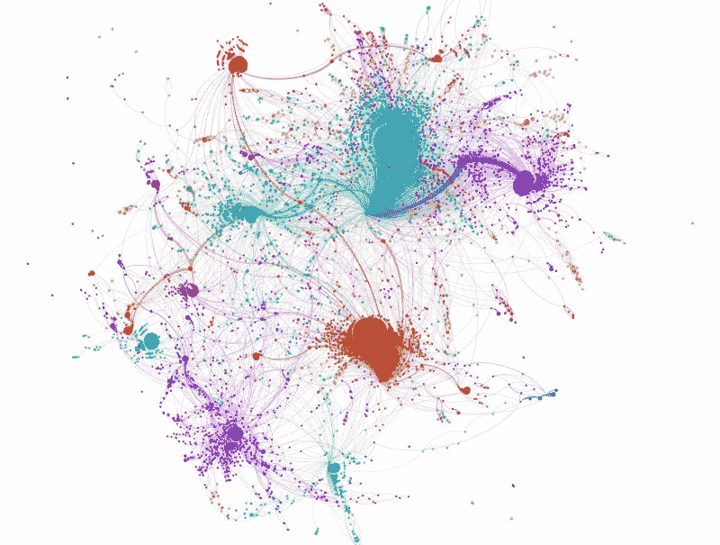
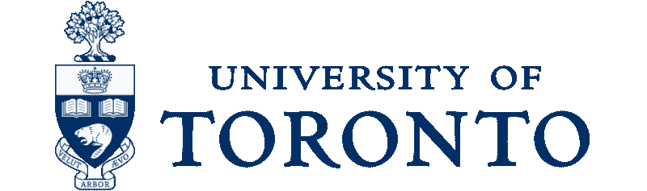

# 互联网上最好的数据科学课程，根据您的评论排名

> 原文：<https://www.freecodecamp.org/news/the-best-data-science-courses-on-the-internet-ranked-by-your-reviews-6dc5b910ea40/>

大卫·文丘里

# 互联网上最好的数据科学课程，根据您的评论排名

Photo by [Quinlan Pfiffer](https://flic.kr/p/pra3h4)

一年半前，我退出了加拿大最好的计算机科学项目之一。我开始利用在线资源创建自己的[数据科学硕士项目](https://medium.com/@davidventuri/i-dropped-out-of-school-to-create-my-own-data-science-master-s-here-s-my-curriculum-1b400dcee412#.5fwwphdqd)。我意识到，我可以通过 edX、Coursera 和 Udacity 来学习我需要的一切。我可以更快、更有效地学习它，而且只需要很少的费用。

我现在几乎完成了。我参加了许多数据科学相关的课程，并旁听了更多课程的部分内容。我知道有哪些选择，以及准备成为数据分析师或数据科学家的学员需要哪些技能。因此，我开始创建一个回顾驱动的指南，为数据科学中的每个学科推荐最好的课程。

对于本系列的第一个指南，我为初学数据科学家推荐了几个[编码类](https://medium.freecodecamp.com/if-you-want-to-learn-data-science-start-with-one-of-these-programming-classes-fb694ffe780c#.42hhzxopw)。然后是[统计和概率课](https://medium.freecodecamp.com/if-you-want-to-learn-data-science-take-a-few-of-these-statistics-classes-9bbabab098b9#.p7pac546r)。然后是[数据科学简介](https://medium.freecodecamp.com/i-ranked-all-the-best-data-science-intro-courses-based-on-thousands-of-data-points-db5dc7e3eb8e)。然后[数据可视化](https://medium.freecodecamp.com/an-overview-of-every-data-visualization-course-on-the-internet-9ccf24ea9c9b)。[机器学习](https://medium.freecodecamp.com/every-single-machine-learning-course-on-the-internet-ranked-by-your-reviews-3c4a7b8026c0)是第五个也是最新的指南。现在我回来用更多的资源来结束这个系列。

### 这里是我之前所有指南的总结，以及对其他 13 个数据科学主题的建议。

对于这一系列中的五个主要指南，我花了几个小时试图识别每个在线课程，从它们的教学大纲和评论中提取关键信息，并汇编它们的评级。我的目标是找出每个科目的三门最佳课程，并呈现给你。

13 个补充主题——如数据库、大数据和通用软件工程——没有足够的课程来证明完整指南的合理性。但是在过去的八个月里，当我遇到他们的时候，我一直在追踪他们。我还在网上搜索我可能错过的课程。

为了完成这些任务，我求助于开源课程中央社区，以及它的数千个课程评级和评论的数据库。

Class Central’s [homepage](https://www.class-central.com/).

自 2011 年以来， [Class Central](https://www.class-central.com/) 创始人[达瓦尔·沙阿](https://www.freecodecamp.org/news/the-best-data-science-courses-on-the-internet-ranked-by-your-reviews-6dc5b910ea40/undefined)比世界上任何人都更关注在线课程。Dhawal 亲自帮我整理了这个资源列表。

### 我们如何选择要考虑的课程

每个指南中的每个课程都必须符合一定的标准。有针对特定主题的标准，然后有两个每个指南共享的通用标准:

1.  必须按需提供或每隔几个月提供一次。
2.  它必须是一门互动的在线课程，所以不要书本或只读教程。虽然这些都是可行的学习方法，但本指南主要关注课程。完全是视频的课程(即没有测验、作业等。)也排除在外。

我们相信我们已经涵盖了符合每本指南标准的所有著名课程。不过，我们总有可能遗漏了什么。如果我们遗漏了好的课程，请在每个指南的评论部分告诉我们。

### 我们如何评估课程

我们收集了中央课堂和其他复习网站的平均评分和复习次数，以计算每门课程的加权平均评分。我们阅读文本评论，并使用这些反馈来补充数字评级。

我们根据每个科目的具体因素做出主观的教学大纲判断。例如，我们的编程简介指南中的标准:

1.  编程基础知识的覆盖面。
2.  涵盖更高级但有用的编程主题。
3.  **教学大纲中有多少与数据科学相关？**

### 以下是每个主题的最佳课程。这些共同构成了一个全面的数据科学课程。

#### 主题 1:编程入门

多伦多大学通过 Coursera 提供的【学习编程:基础知识(LPT1) 和[制作质量代码(LPT2)](https://www.class-central.com/mooc/390/coursera-learn-to-program-crafting-quality-code)

多伦多大学的“学习编程”系列为初学数据的科学家提供了内容难度和范围的完美组合。该系列采用 Python 教学，在 284 条评论中的加权平均评分为 4.71 星。

The University of Toronto offers [Learn to Program: The Fundamentals (LPT1)](https://www.class-central.com/mooc/385/coursera-learn-to-program-the-fundamentals) and [Crafting Quality Code (LPT2)](https://www.class-central.com/mooc/390/coursera-learn-to-program-crafting-quality-code), taught by Jennifer Campbell and Paul Gries, via Coursera.

莱斯大学通过 Coursera 提供的[Python 交互式编程介绍(第一部分)](https://www.class-central.com/mooc/408/coursera-an-introduction-to-interactive-programming-in-python-part-1)和[(第二部分)](https://www.class-central.com/mooc/3196/coursera-an-introduction-to-interactive-programming-in-python-part-2)

莱斯大学的 Python 系列交互式编程包含了有史以来最好的两个在线课程。他们倾向于游戏和交互式应用，这是数据科学中不太适用的主题。该系列在 6，069 条评论中的加权平均评分为 4.93 星。

DataCamp 的 [R 编程轨道](https://www.datacamp.com/tracks/r-programming?tap_a=5644-dce66f&tap_s=93618-a68c98)

如果你开始学习 R，DataCamp 的 R 编程课程有效地结合了编程基础和 R 语法指导。它在 14 篇评论中的加权平均评分为 4.29 星。

#### 主题 2:统计与概率

数据分析的基础—第一部分:使用 R 和[的统计第二部分:德克萨斯大学奥斯汀分校通过 edX 进行的推断统计](https://www.class-central.com/mooc/4804/edx-foundations-of-data-analysis-part-2-inferential-statistics)

德州大学奥斯汀分校的数据分析基础系列课程是为数不多的几门获得好评的课程之一，这些课程还教授统计学和概率，重点是编写示例。该系列在 28 篇评论中的加权平均评分为 4.61 星。

杜克大学通过 Coursera 提供的 R 专业统计数据

杜克大学的统计与 R 专业，分为五门课程，有一个全面的教学大纲，全节致力于概率。它在 5 次评论中的加权平均评分为 3.6 星，但它所基于的球场在 60 次评论中的加权平均评分为 4.77 星。

[麻省理工学院(MIT)通过 edX 介绍概率——不确定性科学](https://www.class-central.com/mooc/1496/edx-6-041x-introduction-to-probability-the-science-of-uncertainty)

麻省理工学院的概率介绍课程是统计和概率指南中评分最高的课程。它非常详细地介绍了概率，而且比大多数 MOOCs 更长(15 周)更具挑战性。它在 38 条评论中的加权平均评分为 4.82 星。

#### 主题 3:数据科学简介

[数据科学 A-Z:现实生活中的数据科学练习包括基里尔·叶列缅科和超级数据科学团队通过 Udemy 进行的](https://click.linksynergy.com/fs-bin/click?id=SAyYsTvLiGQ&subid=&offerid=323058.1&type=10&u1=medium-data-science-career-guide-summary&tmpid=14538&RD_PARM1=https%3A%2F%2Fwww.udemy.com%2Fdatascience%2F)

基里尔·叶列缅科的《数据科学 A-Z》在覆盖数据科学过程的广度和深度方面表现出色。导师天生的教学能力频频受到评论者的称赞。在 5，078 条评论中，它的加权平均评级为 4.5 星。

[uda city 的数据分析简介](https://www.class-central.com/mooc/4937/udacity-intro-to-data-analysis)

Udacity 的数据分析介绍使用 Python 连贯地涵盖了数据科学过程。它在 2 篇评论中的加权平均评分为 5 星。

[大数据大学的数据科学基础](https://bigdatauniversity.com/learn/data-science/)

大数据大学的数据科学基础涵盖了完整的数据科学过程，并介绍了 Python、R 和其他几个开源工具。用于此分析的评论网站上没有关于此课程的评论。

#### 主题 4:数据可视化

[加州大学戴维斯分校通过 Coursera 开发的 Tableau 专业数据可视化](https://click.linksynergy.com/fs-bin/click?id=SAyYsTvLiGQ&subid=&offerid=467035.1&type=10&u1=medium-data-science-career-guide-summary&tmpid=18061&RD_PARM1=https%3A%2F%2Fwww.coursera.org%2Fspecializations%2Fdata-visualization)

加州大学戴维斯分校的 Tableau 专业化数据可视化五门课程系列深入研究了可视化理论。练习 Tableau 的机会是通过演练和期末专题提供的。它在 2 篇评论中的加权平均评分为 4 星。

[Data camp 的 ggplot2 系列](https://www.datacamp.com/tracks/data-visualization-with-r?tap_a=5644-dce66f&tap_s=93618-a68c98)的数据可视化

由 ggplot2 创建者 Hadley Wickham 支持，DataCamp 的 ggplot2 系列数据可视化涵盖了大量的理论。学完这些课程后，你会非常了解 R 和它古怪的语法。用于此分析的评论网站上没有这些课程的评论。

Tableau 10 系列( [Tableau 10 A-Z](https://click.linksynergy.com/fs-bin/click?id=SAyYsTvLiGQ&subid=&offerid=323058.1&type=10&tmpid=14538&u1=medium-data-science-career-guide-summary&RD_PARM1=https%3A%2F%2Fwww.udemy.com%2Ftableau10%2F) 和 [Tableau 10 高级培训](https://click.linksynergy.com/fs-bin/click?id=SAyYsTvLiGQ&subid=&offerid=323058.1&type=10&u1=medium-data-science-career-guide-summary&tmpid=14538&RD_PARM1=https%3A%2F%2Fwww.udemy.com%2Ftableau10-advanced%2F))由基里尔·叶列缅科和 Udemy 上的 SuperDataScience 团队制作

一个有效的实践介绍，基里尔叶列缅科的 Tableau 10 系列主要集中在工具覆盖(Tableau)而不是数据可视化理论。这两门课程在 3，724 条评论中的加权平均评分为 4.6 星。

#### 主题 5:机器学习

斯坦福大学通过 Coursera 进行的机器学习

由著名的谷歌大脑创始人、前百度首席科学家吴恩达教授，斯坦福大学的机器学习涵盖了机器学习工作流程的所有方面和几种算法。在 MATLAB 或 Octave 中教授，它在 422 条评论中有 4.7 星的加权平均评级。

[哥伦比亚大学通过 edX 进行的机器学习](https://www.class-central.com/mooc/7231/edx-machine-learning)

哥伦比亚大学的机器学习是一门比斯坦福大学更先进的课程，是一门更新的课程，有着特殊的评论和受人尊敬的讲师。本课程的作业可以使用 Python、MATLAB 或 Octave 来完成。它在 10 次评论中的加权平均评分为 4.8 星。

[机器学习 A-Z:数据科学中的实践 Python&R](https://click.linksynergy.com/deeplink?id=SAyYsTvLiGQ&mid=39197&u1=medium-data-science-career-guide-summary&murl=https%3A%2F%2Fwww.udemy.com%2Fmachinelearning%2F)作者:基里尔·叶列缅科和哈德琳·德·庞特维斯

基里尔·叶列缅科和哈德琳·德·庞特维斯的《机器学习 A-Z》令人印象深刻地详细提供了 Python 和 R 两种语言的教学，这是罕见的，其他任何顶级课程都无法与之媲美。在 8，119 条评论中，它的加权平均评级为 4.5 星。

#### 主题 6:深度学习

[深度学习与 TensorFlow 的创造性应用](https://www.class-central.com/mooc/6679/kadenze-creative-applications-of-deep-learning-with-tensorflow)kade nze

Parag Mital 对深度学习和 Tensorflow 的创造性应用为技术主题增添了独特的转折。“创造性的应用”是鼓舞人心的，课程是专业制作的，教师知道他的东西。它用 Python 教授，在 16 篇评论中的加权平均评分为 4.75 星。

多伦多大学通过 Coursera 开发的用于机器学习的神经网络

向一个传奇学习。被称为“深度学习教父”的 Geoffrey Hinton 因其在人工神经网络方面的工作而享誉国际。他的机器学习神经网络是一门高级课程。它用 Octave 教授，练习也用 Python 编写，在 35 篇评论中有 4.11 星的加权平均评级。

[深度学习 A-Z:动手操作的人工神经网络](https://click.linksynergy.com/fs-bin/click?id=SAyYsTvLiGQ&subid=&offerid=323058.1&type=10&u1=medium-data-science-career-guide-summary&tmpid=14538&RD_PARM1=https%3A%2F%2Fwww.udemy.com%2Fdeeplearning%2F)由基里尔·叶列缅科和哈德琳·德·庞特维斯通过 Udemy

深度学习 A-Z 是对深度学习的简单介绍，有基里尔·叶列缅科的直观解释和哈德林·德·庞特维斯的有用代码演示。它用 Python 教授，在 1，314 条评论中的加权平均评分为 4.6 星。

### 这是我们为数据科学中的每个辅助学科挑选的顶级课程。

#### Python 及其工具

[data camp 的 Python 编程课程](https://www.datacamp.com/tracks/python-programming?tap_a=5644-dce66f&tap_s=93618-a68c98)，以及他们各自的熊猫课程:

*   [熊猫基金会](https://www.datacamp.com/courses/pandas-foundations?tap_a=5644-dce66f&tap_s=93618-a68c98)
*   [用熊猫操纵数据框](https://www.datacamp.com/courses/manipulating-dataframes-with-pandas?tap_a=5644-dce66f&tap_s=93618-a68c98)
*   [与熊猫合并数据帧](https://www.datacamp.com/courses/merging-dataframes-with-pandas?tap_a=5644-dce66f&tap_s=93618-a68c98)

DataCamp 的代码密集型教学风格和浏览器内编程环境非常适合学习语法。他们的 Python 课程在 14 次评论中的加权平均评分为 4.64 星。Udacity 的数据分析入门是我们推荐的数据科学入门课程之一，也涵盖了 NumPy 和 pandas。

#### r 及其工具

DataCamp 的 R 编程课程,以及他们各自的 dplyr 和 data.table 课程:

*   [使用 dplyr 在 R 中进行数据操作](https://www.datacamp.com/courses/dplyr-data-manipulation-r-tutorial?tap_a=5644-dce66f&tap_s=93618-a68c98)
*   [用 dplyr 连接 R 中的数据](https://www.datacamp.com/courses/joining-data-in-r-with-dplyr?tap_a=5644-dce66f&tap_s=93618-a68c98)
*   [数据分析以 R，data.table 方式进行](https://www.datacamp.com/courses/data-table-data-manipulation-r-tutorial?tap_a=5644-dce66f&tap_s=93618-a68c98)

同样，DataCamp 的代码密集型教学风格和浏览器内编程环境非常适合学习语法。他们的 R 编程课程，也是我们对一般编程课程的建议之一，有效地结合了编程基础和 R 语法指导。该系列在 14 篇评论中的加权平均评分为 4.29 星。

#### 数据库和 SQL

[斯坦福大学通过 Stanford OpenEdx 对数据库的介绍](https://www.class-central.com/mooc/1580/stanford-openedx-db-introduction-to-databases)(注:[评论](https://www.class-central.com/mooc/303/coursera-introduction-to-databases)来自 Coursera 上已弃用的版本)

斯坦福大学的数据库导论全面涵盖了数据库理论，同时介绍了几种开源工具。编程练习具有挑战性。詹妮弗·维多姆，现任斯坦福大学工程学院院长，清晰而精确。在 59 条评论中，它的加权平均评分为 4.61 星。

#### 数据准备

通过 DataCamp 导入和清理数据轨道:

*   [导入&用 Python 轨迹清理数据](https://www.datacamp.com/tracks/importing-cleaning-data-with-python?tap_a=5644-dce66f&tap_s=93618-a68c98)
*   [导入带 R 轨道的&清洗数据](https://www.datacamp.com/tracks/importing-cleaning-data-with-r?tap_a=5644-dce66f&tap_s=93618-a68c98)

DataCamp 的导入和清理数据工具(一个在 Python 中，一个在 R 中)擅长教授为分析和/或可视化准备数据的技巧。用于此分析的评论网站上没有这些课程的评论。

#### 探索性数据分析

由 Udacity 和脸书进行的 R 数据分析

Udacity 的 R 数据分析是探索性数据分析的有趣介绍。对脸书数据科学家的专家访谈见解深刻，令人振奋。该课程在 19 篇评论中的加权平均评分为 4.58 星。这也是对 r 的一个简单介绍。

#### 大数据

[终极实践 Hadoop —驯服您的大数据！](https://click.linksynergy.com/fs-bin/click?id=SAyYsTvLiGQ&subid=&offerid=323058.1&type=10&u1=medium-data-science-career-guide-summary&tmpid=14538&RD_PARM1=https%3A%2F%2Fwww.udemy.com%2Fthe-ultimate-hands-on-hadoop-tame-your-big-data%2F)Frank Kane via Udemy，如果你想了解更多关于特定工具的信息(全部由 Frank Kane via Udemy 提供):

*   [用 Apache Spark 和 Python 驯服大数据——动手吧！](https://click.linksynergy.com/fs-bin/click?id=SAyYsTvLiGQ&subid=&offerid=323058.1&type=10&u1=medium-data-science-career-guide-summary&tmpid=14538&RD_PARM1=https%3A%2F%2Fwww.udemy.com%2Ftaming-big-data-with-apache-spark-hands-on%2F)
*   [用 MapReduce 和 Hadoop 驯服大数据——动手吧！](https://click.linksynergy.com/fs-bin/click?id=SAyYsTvLiGQ&subid=&offerid=323058.1&type=10&u1=medium-data-science-career-guide-summary&tmpid=14538&RD_PARM1=https%3A%2F%2Fwww.udemy.com%2Ftaming-big-data-with-mapreduce-and-hadoop%2F)
*   [Apache Spark 2.0 与 Scala——大数据实践！](https://click.linksynergy.com/fs-bin/click?id=SAyYsTvLiGQ&subid=&offerid=323058.1&type=10&u1=medium-data-science-career-guide-summary&tmpid=14538&RD_PARM1=https%3A%2F%2Fwww.udemy.com%2Fapache-spark-with-scala-hands-on-with-big-data%2F)
*   [用 Spark Streaming 和 Scala 驯服大数据——动手吧！](https://click.linksynergy.com/fs-bin/click?id=SAyYsTvLiGQ&subid=&offerid=323058.1&type=10&u1=medium-data-science-career-guide-summary&tmpid=14538&RD_PARM1=https%3A%2F%2Fwww.udemy.com%2Ftaming-big-data-with-spark-streaming-hands-on%2F)

Frank Kane 的大数据系列教授所有最受欢迎的大数据技术，仅“终极”课程就包括超过 25 项。Kane 分享了他在亚马逊和 IMDb 从事分布式系统工作十年的行业经验。在 6，932 条评论中，这些课程的加权平均评分为 4.52 星。

#### 软件技能

[uda city 的软件测试](https://www.class-central.com/mooc/365/udacity-software-testing)

[uda city 软件调试](https://www.class-central.com/mooc/457/udacity-software-debugging)

由 Udacity 与 Git 和 [GitHub &合作](https://www.class-central.com/mooc/8542/udacity-github-collaboration)的[版本控制(更新 Udacity 的热门](https://www.class-central.com/mooc/8430/udacity-version-control-with-git)[如何使用 Git & GitHub](https://www.class-central.com/mooc/2661/udacity-how-to-use-git-and-github) 课程)

软件技能是数据科学教育中经常被忽视的一部分。Udacity 的测试、调试和版本控制课程介绍了与任何处理代码的人相关的三个核心主题，尤其是在基于团队的环境中。这些课程在 68 篇评论中的加权平均评分为 4.34 星。佐治亚理工学院和 Udacity 有一门[新课程](https://www.class-central.com/mooc/8568/udacity-software-analysis-testing)，涵盖了软件测试和调试，尽管它更高级，并且不完全与数据科学家相关。

#### 多方面的

约翰·霍普金斯大学通过 Coursera 建立数据科学团队

芭芭拉·奥克利博士和加州大学圣地亚哥分校通过 Coursera 撰写的《学会如何学习:帮助你掌握困难学科的强大心智工具》

芭芭拉·奥克利博士和麦克马斯特大学通过 Coursera 发表的《思维转变:突破学习障碍，发现你隐藏的潜力》

约翰霍普金斯大学的建立数据科学团队提供了一个实用的数据科学窥视。这是一个非常短的课程，可以在几个小时内完成，并免费旁听。忽略它在 12 篇评论中 3.41 星的加权平均评级，其中一些评论可能来自付费用户。

Barbara Oakley 博士的《学习如何学习》和《思维转变》本身并不是数据科学课程。学习如何学习是[有史以来最受欢迎的在线课程](https://www.class-central.com/report/mindshift-mooc/)，涵盖了研究表明对掌握困难科目最有效的最佳实践，包括记忆技术和处理拖延症。在 Mindshift 中，她展示了如何最大限度地利用在线学习和 MOOCs，如何寻找导师并与之合作，以及避免职业生涯常规和生活常规常规的秘密。这是*每个人*都应该学的两门课程。他们的加权平均评分分别为 4.74 星和 4.87 星，分别超过 959 和 407 条评论。两个课程都为期四周。

### 本指南的未来

该数据科学职业指南将随着新课程的发布以及对这些课程的评级和评论的生成而不断更新。

你对另一门学科(如计算机科学)有热情吗？你愿意帮助教育这个世界吗？如果你有兴趣创建一个结构与此类似的职业指南，请在[guides@class-central.com](mailto:guides@class-central.com)给我们留言。

### 我的未来

至于我的未来，我很兴奋地告诉大家，我已经获得了 Udacity 的一个职位，成为一名内容开发者。这意味着我将创造和教授课程。这也意味着该指南将被其他人更新。

我加入 Udacity 是因为我相信他们最有能力创造这个星球上最好的教育产品。在我参加的所有在线或大学课程中，我在注册纳米学位时学得最好。他们融合了最新的教学和制作技术，拥有优秀的项目评审系统、乐观的教师以及健康的学生和职业支持团队。虽然像我们在本指南中采用的分段方法可以工作，但贯穿项目和评审的内聚性计划对学生更加友好。

更新 [Data Analyst Nanodegree](https://www.udacity.com/course/data-analyst-nanodegree--nd002) 是我的第一项任务，这是为所有数据创建一条清晰的 Nanodegree 路径的更大努力的一部分。学生们很快就可以在 Udacity 从数据基础开始，一路进步到[机器学习](https://www.udacity.com/course/machine-learning-engineer-nanodegree--nd009)、[人工智能](https://www.udacity.com/ai)，如果他们愿意，甚至[自动驾驶汽车](https://www.udacity.com/drive)。

### 包装它

这是六篇系列文章的最后一篇，涵盖了帮助您进入数据科学领域的最佳在线课程。我们在[的第一篇文章](https://medium.freecodecamp.com/if-you-want-to-learn-data-science-start-with-one-of-these-programming-classes-fb694ffe780c#.fhrn45v3c)中介绍了编程，在[的第二篇文章](https://medium.freecodecamp.com/if-you-want-to-learn-data-science-take-a-few-of-these-statistics-classes-9bbabab098b9#.p7pac546r)中介绍了统计和概率，在[的第三篇文章](https://medium.freecodecamp.com/i-ranked-all-the-best-data-science-intro-courses-based-on-thousands-of-data-points-db5dc7e3eb8e)中介绍了数据科学，在[的第四篇文章](https://medium.freecodecamp.com/an-overview-of-every-data-visualization-course-on-the-internet-9ccf24ea9c9b)中介绍了数据可视化，在[的第五篇文章](https://medium.freecodecamp.com/every-single-machine-learning-course-on-the-internet-ranked-by-your-reviews-3c4a7b8026c0)中介绍了机器学习。

[**互联网上每一个单个的机器学习课程，根据你的评论排名**](https://medium.freecodecamp.com/every-single-machine-learning-course-on-the-internet-ranked-by-your-reviews-3c4a7b8026c0)
[【medium.freecodecamp.com】](https://medium.freecodecamp.com/every-single-machine-learning-course-on-the-internet-ranked-by-your-reviews-3c4a7b8026c0)

在这里，我们总结了以上五篇文章，并推荐了数据库、大数据，甚至软件工程等其他重点课题的最佳在线课程。

如果您正在寻找数据科学在线课程的完整列表，您可以在 Class Central 的[数据科学和大数据](https://www.class-central.com/subject/data-science)主题页面上找到它们。

如果你喜欢读这篇文章，可以看看 [Class Central](https://www.class-central.com/) 的其他作品:

这里有 250 门常春藤盟校的课程，你现在就可以在网上免费选修
[*布朗大学、哥伦比亚大学、康奈尔大学、达特茅斯大学、哈佛大学、宾夕法尼亚大学、普林斯顿大学和耶鲁大学的 250 门 MOOCs 课程。*medium.freecodecamp.com](https://medium.freecodecamp.com/ivy-league-free-online-courses-a0d7ae675869)

如果您觉得这很有帮助，请单击？所以更多的人会在媒体上看到它。

这是我在课堂中心发表的[原文](https://www.class-central.com/report/best-data-science-curriculum/)的修改版，也提供了这里提到的课程的简单列表。