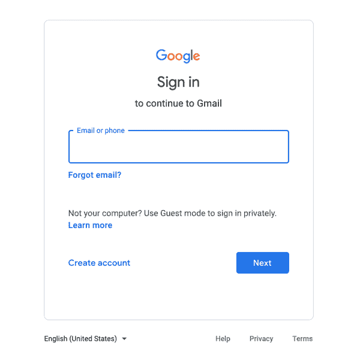
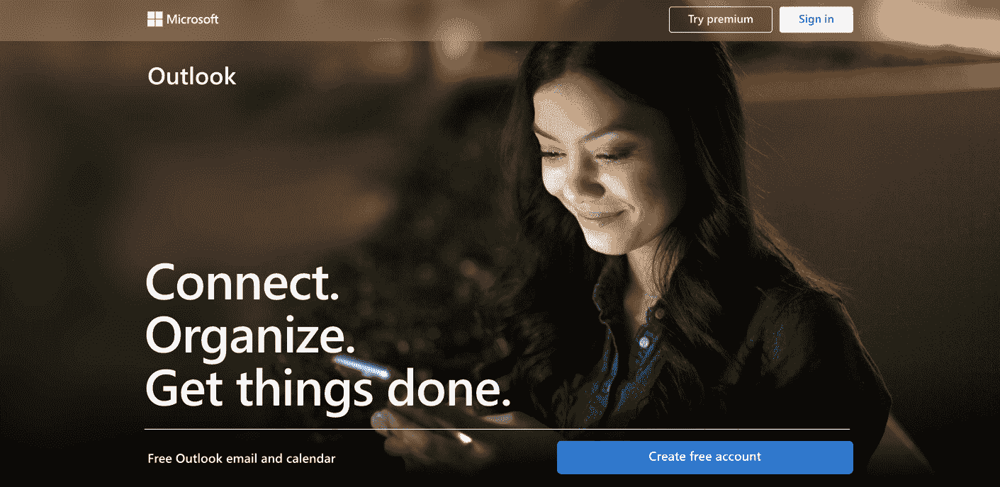
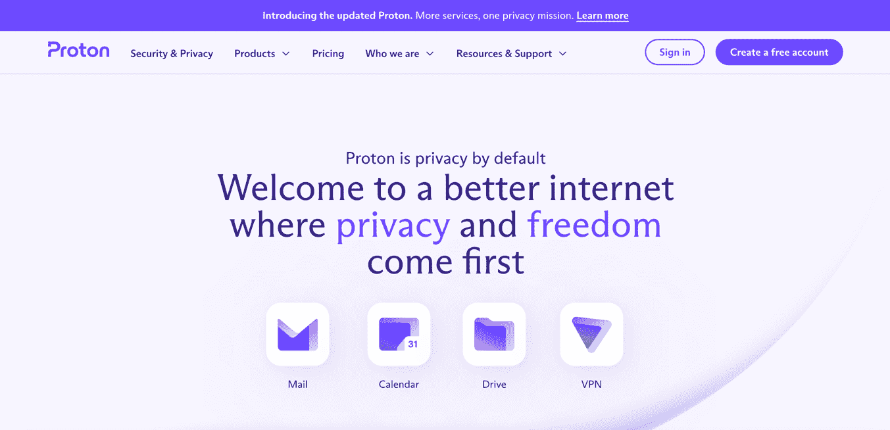
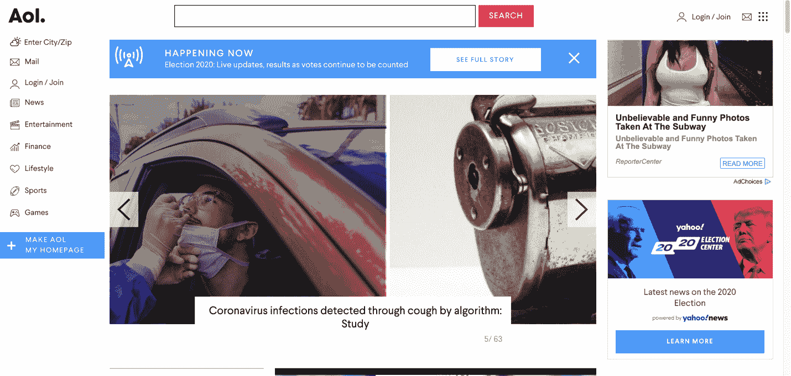
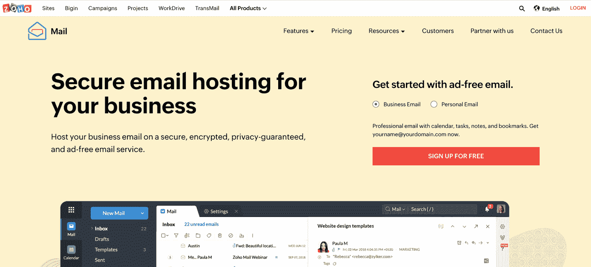
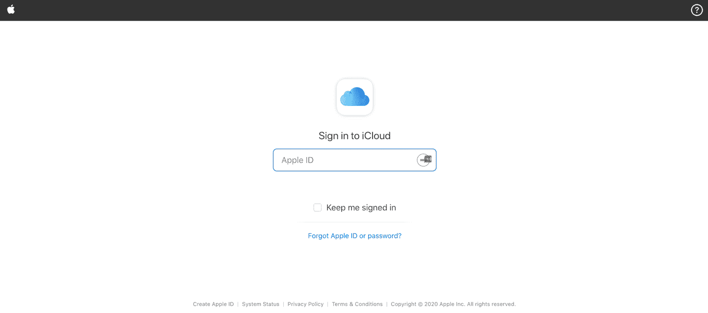
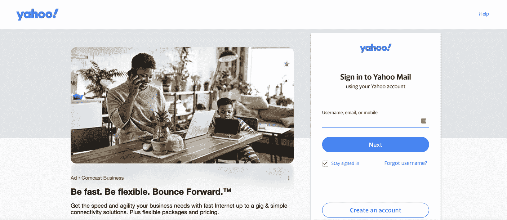
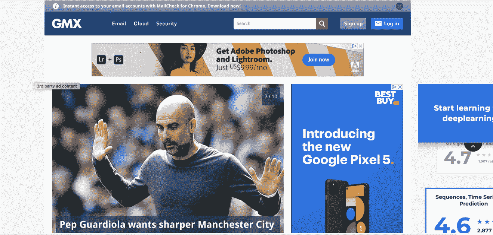
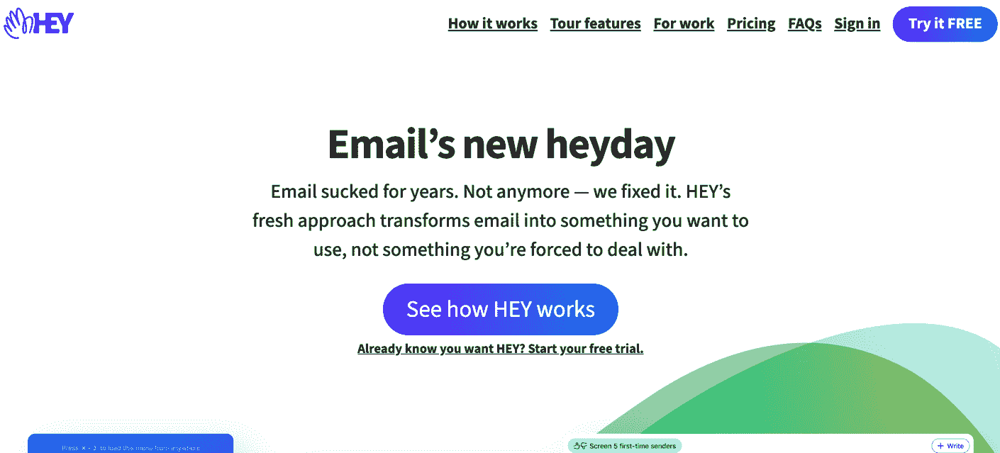

# 最佳免费电子邮件提供商[2021 在线电子邮件账户服务指南]

> 原文：<https://www.freecodecamp.org/news/the-best-free-email-providers-2021-guide-to-online-email-account-services/>

如果你想选择一个功能合适的免费电子邮件服务，你会发现有很多选择。

这很好，因为每个人都有适合自己的东西，但它会让你在做决定时有点麻痹。

为了帮助你选择适合你需求的邮件服务，这里列出了一些最受欢迎的免费邮件服务。我们将看看他们有多少存储空间，他们让您做什么，以及为什么他们可能为您工作。

这些是我们将在本文中探讨的电子邮件服务:

*   谷歌邮箱
*   观点
*   质子机
*   美国境内提供线上加值网络服务的公司(American On Line)
*   Zoho 邮件
*   iCloud 邮件
*   雅虎！邮件
*   GMX
*   嘿(作为奖励-不是免费的，但新的)

所以让我们开始吧。

## 谷歌邮箱

Gmail 是最知名、使用最广泛的电子邮件服务之一。它是谷歌服务套件的一部分，它如此受欢迎有很多原因。

如果你想要功能丰富的电子邮件，如果你喜欢 G-suite，Gmail 可能是一个很好的选择。

### Gmail 功能

以下是它的一些令人惊叹的功能:

*   您可以安排在特定时间发送电子邮件，暂停它们以便不会丢失它们，并自定义您的通知
*   你可以通过 Google Drive 用电子邮件发送大型附件(并在那里保存文件，这样它们就不会把你的本地电脑弄得乱七八糟)
*   你可以使用智能撰写(比如自动完成)来帮助你更快地写邮件，你甚至可以在 Gmail 中翻译你的邮件(在三个点下面——“翻译邮件”)
*   使用阅读窗格功能，这样您就可以同时看到您的收件箱和正在阅读的电子邮件(只需进入设置-阅读窗格-并选择您想要的位置)。
*   有高级搜索选项可用(只需单击搜索栏右侧的向下箭头)。
*   除了常规的搜索功能(按文件夹等)，你还可以按日期查找电子邮件(键入 before:date-如 2020/1/1-它将只搜索那些邮件)。
*   Gmail 的安全性很好，你可以通过你的邮箱来收发钱。它还有“保密模式”,你可以设置信息的过期时间。
*   其他一些很酷的功能？自定义您必须撤销已发送电子邮件的时间，自动进入收件箱(在“设置”的“高级”选项卡下)，离线模式，以及在选项卡之间拖动电子邮件。

存储空间 : Gmail 给你 15GB 的免费存储空间。虽然这听起来很多，但请记住，谷歌照片、谷歌驱动和你使用的任何其他谷歌工具都使用它。

因此，如果你的电脑上有数千兆字节的谷歌照片，你可能会耗尽你的电子邮件存储能力。

如果您想创建一个 Gmail 帐户，[您可以在此处](https://accounts.google.com/)创建。

## 观点

如果你正在寻找一个强大的电子邮件服务，提供大量的功能，并能够与一堆商业友好的应用程序集成，Outlook 是一个很好的选择。

例如，它不像 Gmail 那样简单易用，但是你可以用它做更多的事情。许多大公司使用 Outlook 收发电子邮件，它提供了强大的日历、任务管理器和其他可定制的功能。

### Outlook 功能

以下是 Outlook 的其他一些最佳卖点:

*   您可以直接从收件箱创建新的会议/任务/联系人(无需切换窗口)。
*   您还可以与同事共享或分配任务(如待办事项)，也可以与他们共享您的日历。
*   Outlook 允许您制定自己的自定义规则(如总是从 x 向此文件夹发送电子邮件，等等)。您还可以自定通知，以及如何查看邮件(如更改 x sender 的文本颜色等)。
*   如果您发送的邮件内容不经常改变，您也可以轻松地创建自定义电子邮件模板(节省您自己的额外输入！).
*   你可以安排电子邮件在你需要的时候发送，并暂停它们，这样你就可以在以后阅读它们而不会忘记它们。
*   你还可以设置消息提醒(再也不会错过一封 VIP 邮件！)，并使用标志和类别来帮助您跟踪重要邮件和整理收件箱。
*   与其他 Microsoft 产品轻松集成(例如，如果有人将 Word 文档作为附件发送给您，您可以直接在 Outlook 中打开它)。
*   如果您想创建一个新的联系人，只需将他们的电子邮件拖放到联系人选项卡中，瞧，就为您创建好了。
*   你可以使用便笺作为提醒(只需在 Outlook 界面的任何地方键入 Ctrl+Shift+N，就有了你的便笺)。
*   Outlook 也有自己的自动完成版本，称为 quick parts，可以为您节省一些时间。
*   你还可以在群发邮件中提到某人，提醒他们这与他们有关

许多人将 Outlook 描述为“功能丰富”的电子邮件-现在你可以明白为什么了。

**存储:**在存储方面，Outlook 免费提供 15GB，与 Gmail 一样。

### 等等，Outlook 和 Hotmail 是一回事吗？

这很令人困惑，但这里有一个长话短说:

微软在 1997 年收购了 Hotmail(是的，那是很久以前)。他们经历了几次更名(MSN Hotmail，Windows Live Mail)，但最终在 2012 年左右选定了 Windows Live Hotmail。

也是在那时，微软推出了 Outlook.com，这是 Hotmail(名称)相关产品的最终更名。

如果您已经有一个旧的@hotmail.com 电子邮件地址，您可以保留它。但是如果你注册了 Outlook today，你必须选择一个@outlook.com 地址。抱歉，怀旧邮件的希望。

不管怎样，如果你想试试 Outlook，你可以[在这里](https://outlook.live.com/owa/)注册。

## 质子

对于不希望组织或黑客窥探他们电子邮件的普通用户来说，Proton(以前的 ProtonMail)是一个很好的选择。这不是世界上最严密的安全措施，但对普通用户来说已经足够了。

Proton 是一家位于瑞士的开源加密电子邮件提供商(由著名的 CERN(欧洲核研究组织)为您带来),为您提供瑞士法律和隐私/安全的所有好处。

### 质子特征:

这不是唯一的加密电子邮件选项，但它是最知名的选项之一。让我们看看为什么:

*   Proton 因其加密电子邮件服务而闻名(使用端到端和零访问加密标准来保护所有电子邮件)
*   免费计划为您提供一个电子邮件地址、每天 150 封邮件、3 个文件夹/标签和有限的支持
*   注册帐户时，您不必提供任何个人信息。
*   它使用相当强大的 PGP 加密标准
*   网络客户端、加密算法和 iOS 代码都是开源的
*   IP 地址会从你所有的邮件中删除
*   质子桥功能可以让你使用它与其他电子邮件客户端(这意味着它可以从其他客户端拉电子邮件，并让你从他们那里导入联系人)
*   你可以发送在特定时间后“自毁”的信息
*   你可以给不使用质子的人发送加密邮件
*   地址验证允许您将签名的密钥保存到数字签名的合同中，这样密钥一旦被验证就不能被篡改(这取代了早期的方法，使加密密钥管理自动化且对用户不可见)。这有助于防止中间人攻击

不过，有一件与安全相关的重要事情需要注意:你的电子邮件的主题行(和地址信息)没有加密。因此，如果 ProtonMail 出于任何原因需要将这些信息交给当局，他们可以也将会这样做。

存储空间:宝腾的免费计划“仅”提供 500MB 的存储空间。但如果你需要更多，并愿意支付，有 3 个付费计划可用(他们也有更多的功能)。

想试试质子吗？您可以在这里创建一个账户[。](https://proton.me/)

虽然我们不会在本文中涉及它，但是一个不错的选择是德国的 Tutanota。

## 美国境内提供线上加值网络服务的公司(American On Line)

啊，美国在线邮件。如果你是 80 年代末或 90 年代的孩子，你的第一个电子邮件账户很可能是 AOL 的。谁不喜欢听到那三个字——“你有邮件！”

自那以后，世界似乎已经向前发展了，但美国在线并没有完全被甩在后面。这家长期的电子邮件提供商一直保持他们简单的服务是最新和相关的。如果你只是想用你的服务收发邮件，这尤其有用。

### AOL 功能

所以这就是为什么你可能想考虑 AOL:

*   只是得出来先说一句:AOL mail 的存储空间是无限的。据我所知，只有这一个。它还有一个相当大的 25 MB 附件限制。
*   它具有所有典型的(和预期的)垃圾邮件和病毒防护，以及其他基本功能，如拼写检查器和过滤器，让您对收到的电子邮件进行分类。
*   您还可以使用它的面板来保持有序，这些面板有指向待办事项功能、日历和博客的快速链接
*   它还有阅读窗格模式(这样你不用离开收件箱就可以阅读邮件——邮件出现在旁边)
*   你可以创建定制的文件夹来进一步组织邮件(尽管这个功能不像 Gmail 或 Outlook 那么复杂)。
*   电子邮件文具可让您使用主题、风格等自定义您的电子邮件模板，这样您就可以让您的电子邮件在节日、生日等场合更具节日气氛。
*   它支持 POP 和 IMAP 协议(可以让你把电子邮件下载到你的电脑上，这样即使没有互联网你也可以访问它们)

虽然 AOL mail 并不太花哨，但它对于基本的电子邮件功能来说非常棒。无限存储功能也使它脱颖而出，并帮助它保持相关性。

想要无尽的储物空间吗？您可以[在这里](https://www.aol.com/)获得一个账户。

## 一些其他免费电子邮件选项

也许你想要更多的选择——我听到了。你喜欢做研究。那么，这里有几个更好的免费电子邮件服务的选择。

## Zoho 邮件

Zoho Mail 提供 5 GB 的存储空间——不算太差——并提供加密电子邮件。对于创业公司和小企业来说，这是一个很好的选择。

以下是一些很酷的 Zoho 邮件功能的快速运行:

*   您可以创建多达 25 个企业地址(因此，您可以使用@tastytreatsbakery.com 或任何您的企业名称来代替@zoho.com)。
*   从收件箱中管理所有任务、日历、笔记和文档(轻松的 Google Drive 集成)非常容易
*   完全加密的数据和隐私保证
*   使用内置工具轻松地从以前的电子邮件服务中迁移电子邮件
*   社交媒体风格的“流”帮助您与队友沟通和协作
*   按类型组织附件

听起来像你喜欢的茶？一眨眼就能[注册 Zoho mail](https://www.zoho.com/mail/) 了。

## iCloud 邮件

如果你对苹果生态系统很感兴趣，那么你可能会考虑 iCloud mail。它提供 5 GB 的免费存储空间(你可以以每月 0.99 美元的价格购买更多的存储空间)，并且界面使用起来非常愉快。

以下是其他一些很棒的 iCloud mail 功能:

*   没有广告——平静地撰写你的电子邮件
*   有效收发电子邮件的有用键盘快捷键
*   垃圾邮件过滤(自动和手动)–您还可以设置规则来阻止您不想要的邮件
*   干净、简约的界面(想想苹果的设计美学)
*   您可以将某些发件人标记为“VIP ”, I cloud mail 会将他们的电子邮件发送到一个特殊的文件夹中

如果你想试试 iCloud mail，[可以在这里报名](https://www.icloud.com/mail)。

## 雅虎！邮件

你难道没听到那个唱着“雅虎”的人在唱吗？我可以。

无论如何，雅虎提供了令人印象深刻的 1TB 存储空间(也就是 1000GB)，仅次于 AOL 的无限存储空间。

这里有一些其他酷雅虎！邮件功能:

*   可定制的收件箱主题和布局
*   轻松整合日历，直接从您的收件箱(您也可以使用谷歌日历和任何其他 iCal 地址)。
*   整合你的其他电子邮件服务(如 Gmail、AOL、Outlook ),这样你就可以在一个地方管理你所有的收件箱
*   雅虎将你的电子邮件组织到左边面板的“视图”中(比如“照片”、“文档”、“收据”、“旅行”信息等等)
*   可定制的外出响应

你可以试试雅虎来了解更多。寄出。

## GMX

GMX 邮件提供了所有东西的一点点-65gb 的免费存储空间，加上高达 50MB 的附件，这是一个非常合理的免费电子邮件选项。

让我们来看看你为什么会想去看看:

*   加密选项-保持安全(以及内置的防病毒软件和垃圾邮件过滤器)
*   如果您需要在一个地方接收来自不同地址的电子邮件(如支持、团队、帮助等)，您可以有多达 10 个不同的别名
*   Chrome 的 MailCheck 扩展确保你在收到新邮件时得到通知
*   能够组织所有电子邮件从您的其他帐户到一个地方
*   可自定义的过滤器设置(创建自己的过滤器，或使用 GMX 提供的过滤器)
*   强大的搜索、在线日历和易于使用的联系人功能

GMX 听起来像是你理想的电子邮件提供商吗？你可以[在这里](https://www.gmx.com/)注册一个账户。

## 奖金-嘿[这不是免费的，但它是新的]

你可能听说过 Basecamp 大胆的新嘿邮件的炒作。它不是免费的，但它确实承诺对旧的处理电子邮件的方式进行许多重大改进。

以下是 Hey.com 的一些主要功能:

*   你可以屏蔽你的邮件——如果你收到一封讨厌的发件人发来的邮件，就立刻阻止它。
*   您可以一次打开并通读多封电子邮件。不再打开、阅读、关闭...打开、阅读、关闭...诸如此类。
*   您可以向任何电子邮件主题添加私人注释(因此您关于该主题的所有信息都在一个位置)。
*   有一个“文件跟踪”文件夹，你可以在那里发送所有收据和其他交易信息(很容易找到，但不会弄乱你的收件箱)
*   一个“附件库”收集了你所有的附件，所以你可以直接在那里搜索(不需要先找到邮件)。
*   广泛的安全功能，如强制性双因素身份验证和对硬件安全密钥和指纹读取器的支持。
*   包含 100GB 存储空间

还有很多更酷的功能，你可以在 Hey.com 阅读。个人计划为 99 美元/年，团队计划为 12 美元/用户/月。如果你想先试用的话，他们会提供两周的免费试用。

好了，现在你应该准备好选择一个免费的电子邮件提供商。祝你找到适合你的那一个！