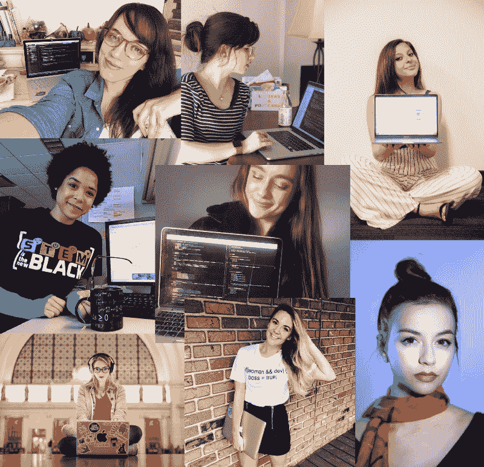
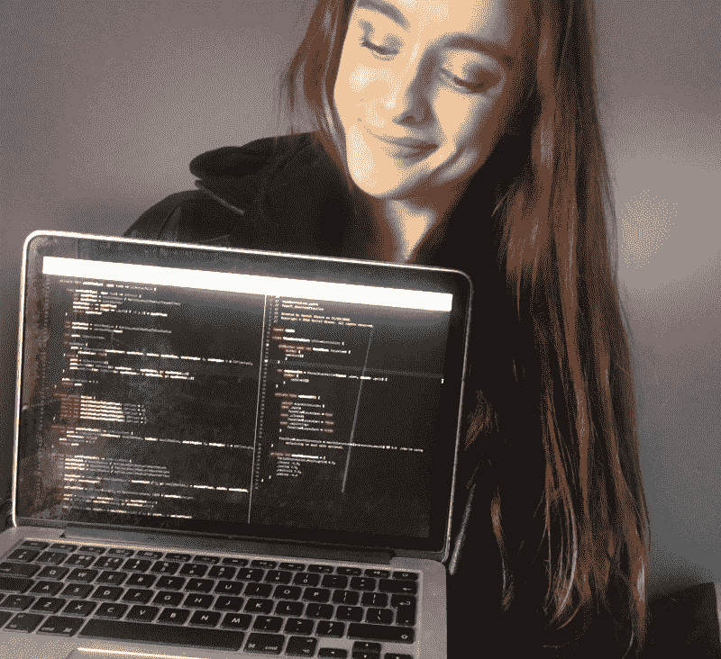
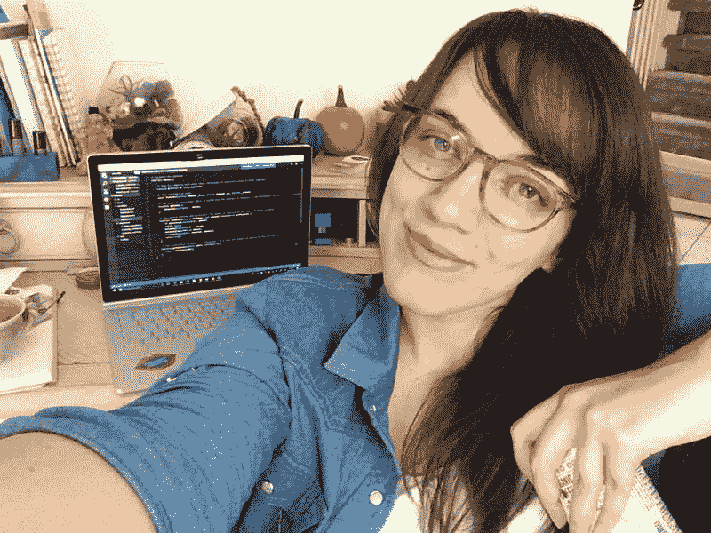
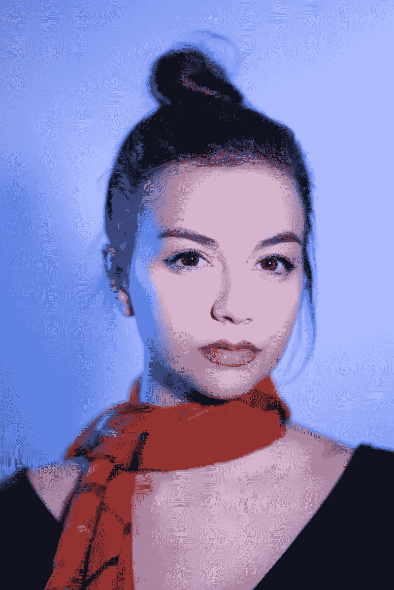
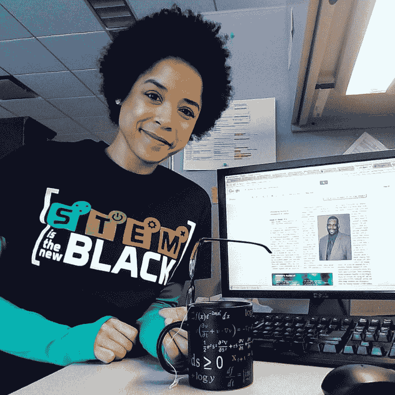
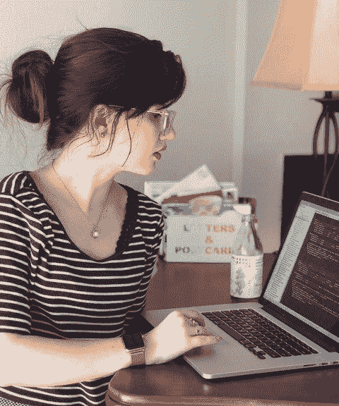
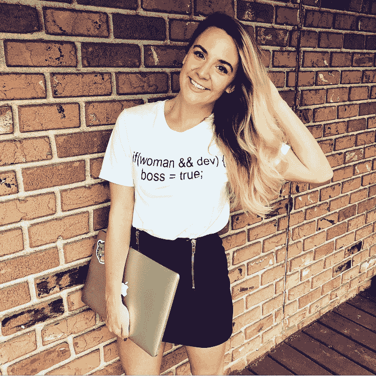

# “我科技职业生涯中走得最好的一步”——来自八位科技女性的见解。

> 原文：<https://www.freecodecamp.org/news/the-best-move-i-made-in-my-tech-career-insights-from-8-tech-ladies-b2ac5bf488eb/>

作者瑞秋

# “我科技生涯中做得最好的一步”——来自八位科技女性的见解。

我对“故事”很感兴趣——那些引导人们过上现在生活的决定和环境。在过去的一个月里，我一直在寻找我的第一份专业软件工程工作，并且一直在思考为我提供这个机会的一切。有些步骤推动我前进，有些又把我拉回。

因此，我邀请了一些我喜欢的科技女性来分享她们的见解和观点，谈谈她们认为对自己的科技职业生涯来说最好的一步。

我们也很乐意听到你的意见——如果你经历或做过的事情推动了你的职业发展，请在这篇文章上发表评论！

### **1。瑞秋——回到学校。**

2015 年，我参加了第一批美国编码训练营之一，下一步自然是出去找份工作。但是有些事情让我犹豫了。我希望工程成为我的“职业”——我对编程充满热情，但我的计算机科学知识存在巨大缺口。我想弄清楚计算机是如何工作的，如何应用设计原则，编译器是如何工作的，如何选择正确的数据结构和优化算法。

因此，我申请了计算机科学硕士课程，并得到了我在伦敦的首选。事后看来，这是我能做出的最明智的决定——尽管我最初担心堆积如山的债务，并拒绝了其他工作邀请。硕士课程的目的是在一年内教授尽可能多的计算机科学本科学位——所以这是一个关于基础知识的密集速成班，正是我想要的。

一些亮点是开始做一个伟大的人工智能模块作为我的选修科目，并与微软合作进行我的最终研究项目——我为他们的 HoloLens 设备开发了一个基于遗传学的增强现实应用程序。与我一年前的职位相比，我毕业后打开的大门令人难以置信。

瑞秋是一名软件工程师，现在在都柏林工作。她最近从 UCL 大学毕业，获得了计算机科学硕士学位。她是前 GSoC-er(谷歌代码之夏)，前 She++ London 社区负责人。

### **2。** **迈拉尔——决定全力以赴成为一名科技企业家。**

到目前为止，我做的最好的一步是当我决定成为一名科技企业家的时候。在加州大学洛杉矶分校(UCLA)读大三的时候，我开始接触洛杉矶地区科技初创公司的创始人/首席执行官，主动提出帮助他们从产品到增长再到送咖啡的任何事情——作为交换，我可以参加一个从头开始创建公司的速成班。数百次拒绝和忽视之后，我通过冷冰冰的 LinkedIn 邮件联系到了 Dust Messaging(一家马克·库班公司)的首席执行官和联合创始人。剩下的就是历史了。我很快认识到，要成为最优秀的人，你必须和最优秀的人在一起，并向他们学习——所以在接下来的一年里，我继续与导师、同事和商业伙伴交往。我就是这样认识了扎克·蔡(Zac Choi)，当时他正开始为一家新的科技初创公司 Hello Chava 工作。

当我在加州大学洛杉矶分校和 Dust 的日子即将结束时，我下定决心要创办自己的公司——直到一次命运攸关的旧金山之行，在那里我重新联系上了扎克和他的联合创始人伦纳德(创始人/首席执行官@ Syncplicity，2012 年收购)。

我爱上了他们对 Hello Chava 的愿景，并兴奋地作为联合创始人加入了公司。今天，我为我们在 Hello Chava(人工智能短信自动化和增强)所做的一切感到自豪——我很高兴在 23 岁时推出了一个科技产品和公司。

迈拉·阿里克(@my.startuplife )是一家科技初创公司 [Hello Chava](http://www.hellochava.com/) 的联合创始人，该公司利用人工智能通过短信加强客户关系。她还是[实干家协会](http://www.doersociety.com/)的创始人，这是一个快速发展的创业女性社区。

### **3。** **圣人——跟着自己的直觉走。**

我职业生涯中最好的一步棋也恰好是我个人生活中最好的一步棋。2016 年，我本该搬迁到西雅图，加入微软总部的一个团队。这是我梦寐以求的工作，在我梦寐以求的城市。

但当时，我母亲正在接受癌症治疗，所以我决定搬回多伦多的家，而不是越过边境进入美国。我重新加入了我在实习期间工作过的加拿大福音团队，在这个团队中，我可以自由地使用我最感兴趣的新兴技术进行开发。

通过这个角色，我建立了我的第一个全息应用程序，在全球舞台上发言，并与一些了不起的人一起工作，他们已经成为我最好的朋友和导师。最重要的是，在我妈妈生命的最后两年里，我能够陪在她身边。

虽然这最终是我的决定，但如果没有微软那些理解我优先考虑的事情并让我有可能改变角色的了不起的人，这是不可能的。最好的职业变动是在强烈的直觉、合理的逻辑和他人的支持下做出的。

Sage Franch[(@ thetrendytechie](https://www.instagram.com/thetrendytechie/))是 [Crescendo](http://getcrescendo.co/) 的联合创始人兼首席技术官，这是一款人工智能聊天机器人，用于多元化和包容性培训。在 Crescendo 之前，Sage 在微软专攻认知计算和混合现实，并在多伦多的训练营教授区块链开发。

### **4。** **艾莉森——冒险，把自己扔进深水区。**

虽然这看起来很模糊，但我迄今为止所取得的一切都来自于被恐惧和自我怀疑的压倒性感觉所包围和吞噬的感觉——但无论如何都要挺过去。这适用于我投资于一个编码训练营，当我们失去一个团队成员时自愿担当 SCRUM master 的角色，申请我从未想过会被考虑的奖学金，抱着完全相信它会成功的信念投入一个商业想法，等等。

做一些我认为我永远做不到的事情把我带到了一些地方，给了我一些我从未想过会有的机会。如果你坚持尝试，把失败当成成长，你就会到达你想要的地方。事实上，你通常会到达一个比你想象的还要好的地方。

艾莉森是一家医疗解决方案公司的前端应用程序开发人员。除了朝九晚五的工作时间，她还是一名内衣模特，并参加了乔治华盛顿大学的网络安全工程硕士项目。她是 [@momscancode](https://www.instagram.com/momscancode/) 的助理教练，也是[@ the menofsextech](https://www.instagram.com/thewomenofsextech/)的成员。

### **5。** **杰米——弄清楚我在为什么'***'***编码。**

我现在有目的地编码。科技是一个有吸引力的领域，因为它有大量的机会和高薪，但这对我来说还不够。我需要感觉到我在发挥作用，才能对自己在这个世界上的地位感到满意。

在研究生院找到一个能让我支持一个社区的研究课题是我做的最好的一步。我不仅对我的工作充满热情，而且我能看到我对他人生活的直接影响。感觉太棒了！

不要让你的科技职业把你束缚在肤浅和物质主义中。把它作为一种工具，在你的社区中做出积极的改变。

杰米是密西根科技大学的计算机科学博士研究员。她专门从事美国原住民的文化包容性计算机科学教育。

### **6。****Johna——毫无期待地和陌生人交谈。**

不仅在我的技术生涯中，在生活中也是如此:与陌生人交谈。我有很多工作经验，但没有多少找工作的经验。我去的第一个“招聘会”是大学三年级的时候。我在活动结束前一个小时出现，手里拿着五份简历，却不知道自己在实习中想要什么。

发完简历并与多家公司谈过之后，我走向门口，注意到几个人静静地站在一家咨询公司的桌旁，这家公司需要计算机科学专业的学生。我以前从未听说过这家公司，所以我走过去搭讪。他们没有任何实习岗位，我也没有留下任何简历，我们只是聊天，交换邮箱，没有任何期待。

一周后，我参加了公司的面试，三年后我仍在为 Credera 工作(他们最终在那个夏天为我找到了一个实习职位)。我觉得我正处于职业生涯中我应该处于的位置，但如果那天我没有停下来聊天就走出去，我的生活会看起来完全不同。

Johna Rutz[(@ jonesdoeslife](https://www.instagram.com/jonesdoeslife/))工作日在 Credera 为客户开发定制软件解决方案，周末则和朋友在达拉斯周围寻找特色咖啡店。

### **7。** **罗宾——insta gram。**

一个词:Instagram。我做的最好的一步——不是在的*，而是在*的*——是在社交媒体上建立我的在线形象。*

当我在一家初创公司实习时，我遇到了一位女士，她从我的 Instagram 账户上认出了我。我实习的那家初创公司位于 WeWork，这是成长型公司的理想合作空间。她在同一家 WeWork 公司的不同公司工作。

几周后，也就是我实习结束前的几周，我在厨房碰到了她。聊了一会儿后，我发现她是一家很酷的初创公司的全栈开发人员……他们正在招人！她把我介绍给她的同事，帮我打开了面试的大门。实习结束三天后，我收到了她公司的录用通知。社交媒体是让你在职业上出名的好方法。

罗宾·西尔伯是一名软件工程师，拥有计算机科学硕士学位。她目前是一家初创公司的 Ruby on Rails 全栈开发人员，也是自闭症之声的董事会成员。

### **8。** **白兰地——不能用一招就概括！**

我不知道我是否能定义任何一个动作是最好的，但我确实有一些亮点。我的第一件事，回到学校。我已经开始运行一个大型的移动会议，我唯一不会做的事情就是为它创建移动应用程序。我开始在业余时间自学编程，并决定全力以赴重返校园。

下一个亮点发生在我上学的时候:我得到了一个实习机会。我一直在参加聚会，在技术社区会见了许多不同的人，他们都告诉我，我需要真实的世界经验。于是，我得到了一份实习工作(免费工作)，大约一个月后开始写生产代码(而且他们开始给我发工资了！).

下一个亮点发生在我决定在一次会议上发言的时候。那是在我毕业后的四个月，我飞到多伦多谈论用 React Native 制作手机游戏。就在那一刻，我知道我喜欢教别人，向别人展示科技和一点自信的可能性。

下一个重要的亮点是我决定在社交媒体上记录我的旅程。它为这么多的机会和这么多了不起的人打开了大门。它让我有能力与像我一样热爱科技的人联系。

如果没有这些亮点，我想我不会有现在的职业生涯。我目前白天在我丈夫的科技创业公司帮助他，晚上我和我的商业伙伴 Dania Micala 一起发展我自己的公司 Creators Code。我们正在建立一个平台，教其他人如何真正发展他们的社会存在，并建立一个社区。从事技术工作意味着身处一个相互支持、相互帮助的社区。我的人生使命是帮助他人获得成功，同时教会他们如何通过社交展示成功。

Brandy (@ [brandymorgan](https://www.instagram.com/msbrandymorgan) )是一名开发者、设计师和实干家，她的工作得到了全世界的认可和好评。Brandy 因其在社交媒体方面的工作为其他女性开发人员铺平了道路而被《魅力和金钱》杂志选中。

— — — — — — — — — — — — — — — — — — — — — — — — — — — — — —

#### 如果你喜欢这个——为它鼓掌，并与那些会觉得它有趣的人分享。❤

#### 如果您对其他想要涵盖的主题有想法/建议，请发送电子邮件至 secretlifeofcode[at]Gmail[dot]com。

#### 感谢阅读！❤