# 新程序员的最佳播客，以及收听播客的最佳工具

> 原文：<https://www.freecodecamp.org/news/the-best-podcasts-for-new-coders-and-the-best-tools-for-listening-to-them-df393b1c8dc/>

作者 Ayo Isaiah

# 新程序员的最佳播客，以及收听播客的最佳工具

最近[自由代码营/CodeNewbie 调查](https://medium.freecodecamp.com/we-asked-15-000-people-who-they-are-and-how-theyre-learning-to-code-4104e29b2781?source=featured---#2b47)的结果让我有点惊讶。全世界只有大约 26%学习编码的人听编码相关的播客。[一位受访者](https://medium.com/@filipina/thanks-for-including-this-survey-question-ec54c49fd07d#.aopk4ij3n)甚至说她“不知道编码播客的存在”

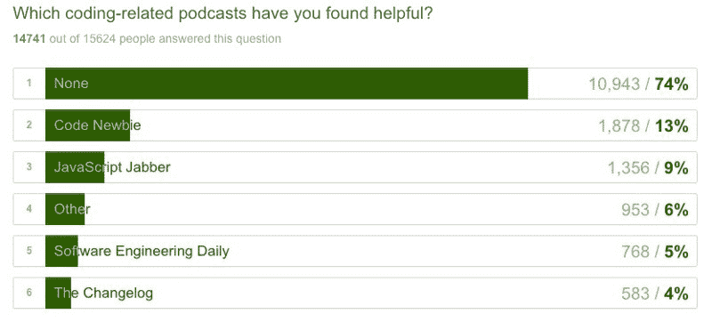

Only a small percentage of upcoming developers listen to podcasts

如果有 74%的人正在学习编码，但还没有听过任何与开发相关的播客，那么这篇文章就是为你准备的。

#### 为什么你应该听播客

播客是简单的广播式音频节目，通过互联网传播，通常是免费的。它们提供了一种极好的方式来消费高质量的信息，同时执行日常任务，如通勤、清洁或健身。

播客多年来越来越受欢迎，现在涵盖了非常广泛的主题。不缺少高质量的节目，这些节目将帮助你变得更有知识，跟上你最喜欢的工具，并帮助你在不断变化的技术领域开拓更广阔的视角。

我建议你订阅一些与编码相关的播客，并把它们融入到你的日常生活中，而不是一直听音乐。

下面的大多数播客都是前端和 JavaScript 相关的，但是也有很多其他的涵盖了其他技术。

#### 1.[商店脱口秀](http://shoptalkshow.com/)

如果你对前端开发和用户体验设计感兴趣，Shop Talk 是一个很好的节目。它的特点是采访业内顶级开发人员，以及主持人 Dave Rupert 和 Chris Coyier 回答听众提出的大量问题的快速会议。

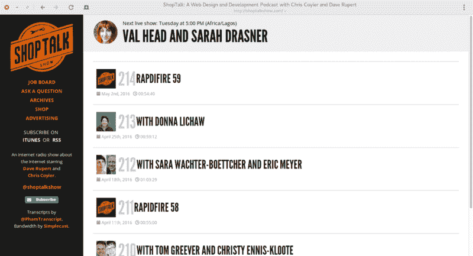

#### 2. [CodeNewbie](http://www.codenewbie.org/podcast/)

CodeNewbie 播客是为初学编码的人准备的——你猜对了！主持人 Saron Yitbarek 每周采访一位新嘉宾，他们谈论他们的编码之旅，他们如何获得第一份编码工作，等等。昆西·拉森不久前出现在《T1》节目中，所以这将是一个很好的开始。

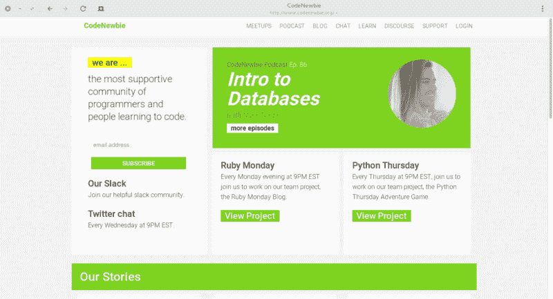

#### 3.[前端欢乐时光](http://frontendhappyhour.com/)

前端欢乐时光是一个新的播客，由来自 LinkedIn、网飞和苹果等地的软件开发人员组成，他们一边喝着他们最喜欢的欢乐时光饮料，一边讨论所有关于网络开发的事情。

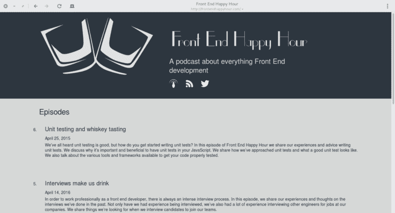

#### 4.[软件工程日报](http://softwareengineeringdaily.com/)

无论你对编程的哪个方面感兴趣,《软件工程日报》都将是一个极好的技术信息来源。有超过 200 集，大多数大约一个小时长——有足够的内容让你狼吞虎咽。

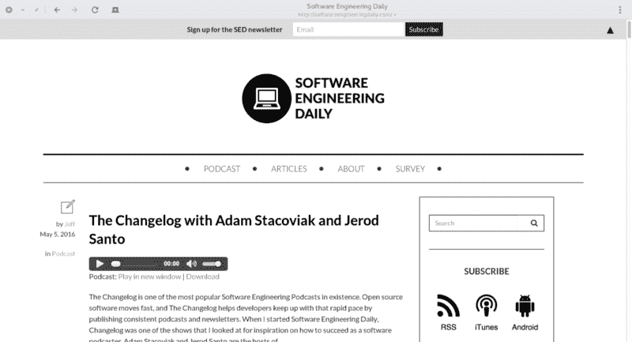

#### 5. [JavaScript Jabber](http://devchat.tv/js-jabber/)

JavaScript Jabber 是一个每周一次的播客，讨论 JavaScript 的所有内容:框架、服务器端技术，以及开发人员的编码技术和最佳实践。

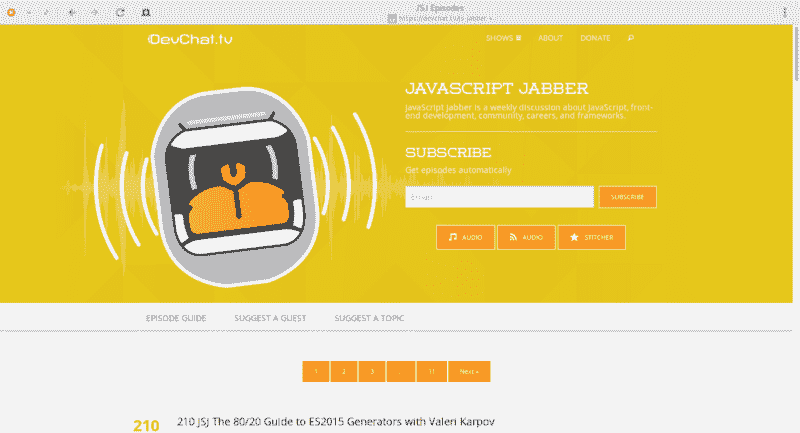

#### 6.[变更日志](http://thechangelog.com/podcast/)

始于 2009 年的 Changelog 主要讨论与开源软件相关的话题。主持人是亚当·斯塔科维奇和杰罗德·桑托。[如果你有兴趣看的话，自由代码营在其中一集里有深入的讨论](https://changelog.com/195/)。

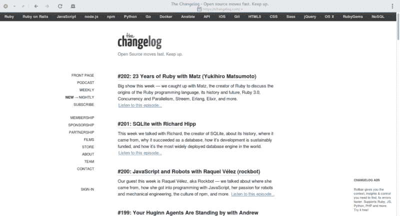

#### 7.[开发者茶](https://www.developertea.com/)

这是一个 15-20 分钟的简短播客，旨在“适合您的茶歇时间”每两三天就会有一集新的内容，内容包括与客户建立健康的关系、准备面试、人际交往等等。我建议你下载所有的剧集，因为这里有太多高质量的东西。

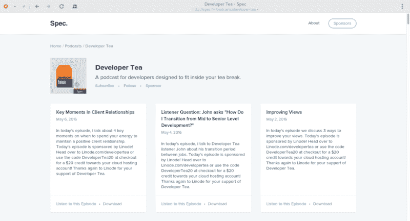

#### 8.[编码块](http://www.codingblocks.net/)

这个月度播客面向所有类型的开发人员，涵盖性能、设计模式、数据库实现和大量面向对象编程技巧。

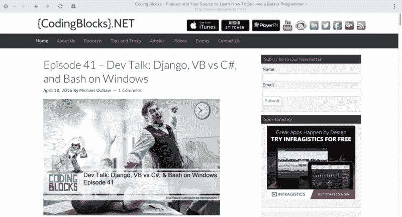

#### 9.[响应式网页设计播客](http://responsivewebdesign.com/podcast/)

在凯伦·麦克格兰和伊桑·马科特主持的每周播客中，你可以了解所有与移动响应相关的事情，以及让这些事情发生的人。

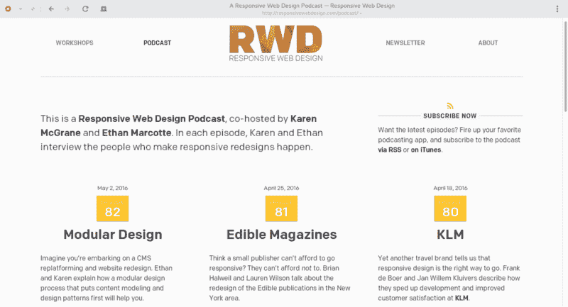

#### 10.[现代网络](http://www.modern-web.org)

Modern Web 是一个以 JavaScript 为中心的播客，涵盖了 EmberJS、React、AngularJS、RxJS 和 ES2015 等现代工具的最新新闻和发展。

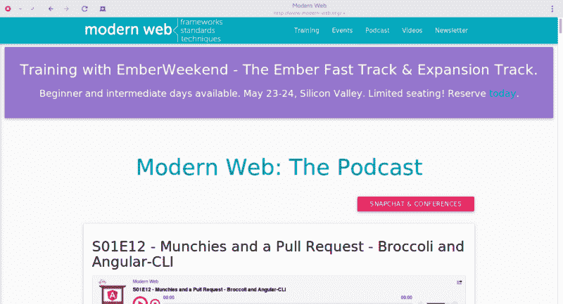

#### 11.[前端五个](https://frontendfive.codeschool.com/)

Front-end Five 是由 Code School 制作的每周五分钟的播客，涵盖了 web 开发领域的所有有趣新闻，包括社区活动。

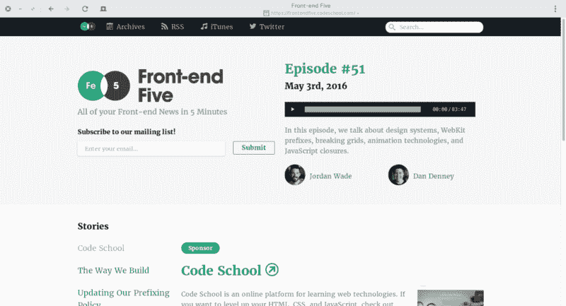

#### 12.[网络平台](http://www.thewebplatformpodcast.com/)

该播客讨论了与 web 开发、移动、项目管理、Git 工作流、现代 JavaScript (ES2015)相关的所有事情。有超过 85 集，每集大约一个小时。

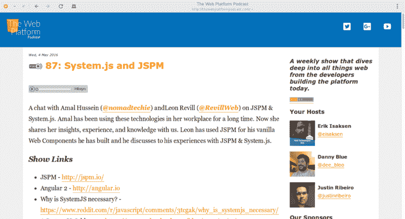

#### 13.[角状冒险](http://devchat.tv/adventures-in-angular)

正如你可能已经猜到的，这个播客涵盖了 Angular.js 的所有内容。如果你是 Angular.js 或者经常使用它，你肯定会想继续关注这个。

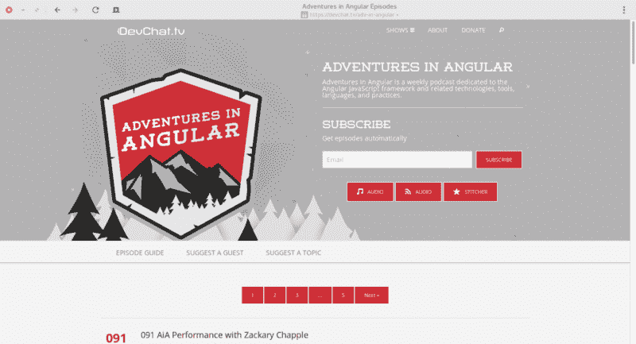

#### 14.[电码笔收音机](https://blog.codepen.io/radio/)

如果你正在寻找开始你自己的软件生意或创业，CodePen Radio 已经覆盖了你。CodePen 的联合创始人克里斯·科伊尔、亚历克斯·瓦兹奎和蒂姆·萨巴特讲述了简单创意向真正商业的演变。有 80 多集可以仔细研读，新节目大约每周发布一次。强烈推荐。

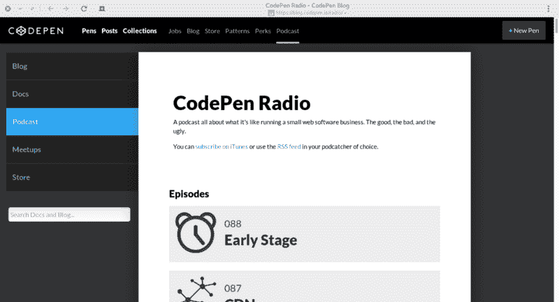

#### 15.[风格指南播客](http://styleguides.io/podcast/)

《时尚指南播客》是由安娜·德本汉姆和布拉德·弗罗斯特主持的一系列简短访谈。在 12 集的每一集中，他们都谈到了创建和维护风格指南，设计可重用的模式，以及如何向利益相关者推销风格指南。

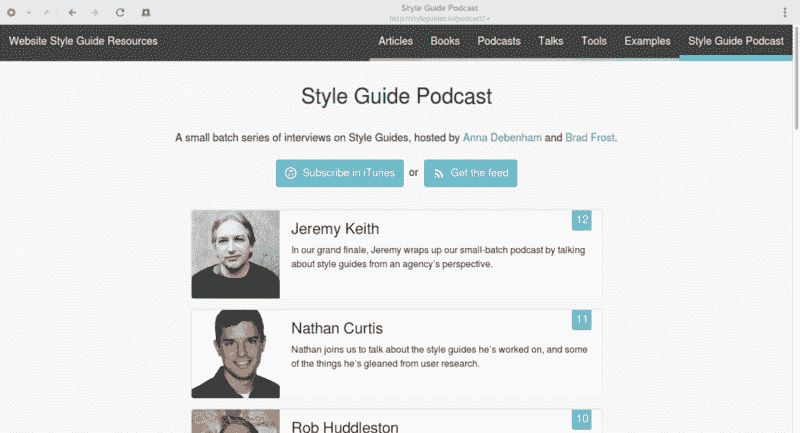

我提供了一个. opml 文件，你可以下载并导入到你最喜欢的播客应用程序中，一键订阅所有这些节目。

[**此处下载整个榜单订阅文件**](https://cdn.rawgit.com/ayoisaiah/ayoisaiah.github.io/master/coding-podcasts.opml) **。**

说到播客，如果你不知道如何收听播客，或者你刚刚开始接触这种形式的媒体，这里有几个你应该考虑的软件选项。

#### Linux 操作系统

如果你运行 Linux， [gPodder](http://gpodder.org/) 似乎是你最好的选择。这是我在我的机器上使用的一个，它在整理我的收藏方面做得很好。然而，它不能自己播放任何东西——你需要在外部应用程序中打开下载的文件。

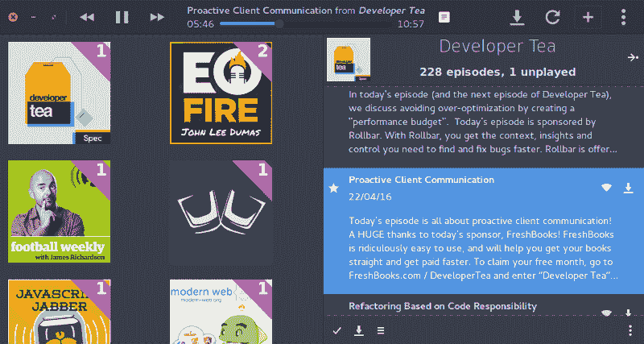

Vocal Podcast app for Linux

另一个选项是 [Vocal](http://vocalproject.net/) ，它是专门为初级操作系统构建的，但也适用于其他基于 Ubuntu 的发行版、RPM 发行版(如 Fedora)和 Arch Linux。

克莱曼婷是一款音乐应用，也非常支持播客，但它不支持视频播客，因为它只是一个音频播放器。

#### Windows 操作系统

iTunes 是最受欢迎的 Windows podcast 应用程序，但我发现它笨重、缓慢，如果你想要的只是一个简单的 podcast 管理器，那肯定是多余的。

Grover Podcast (免费)是 Windows 10 设备的一个不错的选择。它看起来真的很好，并提供 iTunes 集成。

前面提到的 gPodder 应用也可以在 Windows 上使用。

#### OS X

对于不想使用 iTunes 的 OS X 用户来说，[down cast](http://www.downcastapp.com/)(7.99 美元)提供了一个很好的选择，或者你可以只使用价格为 9 美元的 [Pocket Casts](https://play.pocketcasts.com/) 网络版。gPodder 在 OS X 上也能工作。

#### 移动的

移动设备上不缺少播客客户端，可以随时随地了解您最喜爱的节目。

在 iOS 方面，许多人认为[阴云](https://overcast.fm/)(免费——iPhone/iPad)是最好的播客应用。

如果你想在 iPhone 和 Macbook 之间同步你的订阅，down cast(2.99 美元)是另一个很好的选择。

如果你喜欢在不同设备之间切换，[Pocket Casts](http://www.shiftyjelly.com/pocketcasts)(3.99 美元——安卓、iPhone/iPad、Windows Phone)是在这些设备之间同步你的收藏的最佳选择，它还提供了一个在你的电脑上收听的网络客户端。

其他值得注意的应用包括:[Doggcatcher](https://play.google.com/store/apps/details?id=com.snoggdoggler.android.applications.doggcatcher.v1_0)(3.99 美元——仅限安卓)、 [Player FM](https://play.google.com/store/apps/details?id=fm.player) (免费——安卓、网络)、以及[Grover Pro](https://www.microsoft.com/en-us/store/apps/grover-pro/9nblggh5kjks?tduid=%287799dd7ce8bcb242c6d8bc05a6fa7022%29%28259740%29%282804580%29%28%29%28%29)(2.99 美元——Windows 10 Mobile)。开源的书呆子应该用 [AntennaPod](https://play.google.com/store/apps/details?id=de.danoeh.antennapod&hl=en) (免费——仅限 Android)。

就我个人而言，我使用的是 [Podcast Addict](https://play.google.com/store/apps/details?id=com.bambuna.podcastaddict) (免费/2.99 美元——仅限安卓系统)，我的使用体验完美无瑕，所以这也是一个很好的选择。

我希望这篇文章能帮助你发现一些值得订阅并融入日常生活的优秀编码播客。我希望它们对你成为软件开发人员的旅程有价值。

感谢阅读。如果你喜欢这篇文章，请点击下面的绿色心脏，与你初露头角的开发者朋友分享。

在我的个人博客上跟随我的旅程去写精彩的代码。干杯。

