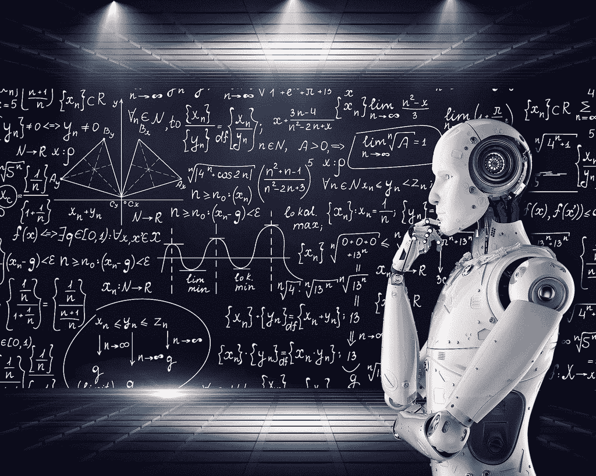

# 我用来自学机器学习的最好资源

> 原文：<https://www.freecodecamp.org/news/the-best-resources-i-used-to-teach-myself-machine-learning-part-1-292232d167/>

机器学习领域每年都在变得越来越主流。随着这种增长，出现了许多库和工具来抽象出一些对初学者来说最难实现的概念。

大多数人会说你需要一个更高水平的 ML 学位才能在这个行业工作。如果你喜欢与数据和实用数学打交道，那么我会说这不是真的。我大学毕业时没有机器学习或数据学位，但我现在在一家初创公司 ML 工作。我想分享我过去学到的东西和我是如何来到这里的，希望它能帮助其他人。

### 入门指南

当我开始学习 Python 时，我已经知道了，但是，如果你不知道，我建议你先学习初级和中级 Python。与其他语言相比，这种语言很容易学。Python 也是最大的数据科学/ML 社区的所在地，所以有大量的工具可以帮助你学习。

[学习 Python: freeCodeCamp Python 速成班](https://www.youtube.com/watch?v=rfscVS0vtbw)

解决了这个问题，你要做的第一件事就是把 OCDevel 的“机器学习播客”下载到你最喜欢的播客应用程序中。听前 10-15 集。他们非常擅长给出机器学习生态系统的概述，也有链接到 [OCDevel 网站](http://ocdevel.com/mlg)的推荐资源。

### 工具作业

Anaconda & Jupyter 笔记本——这些是 ML & data science 的必备。按照此处的[说明](https://jupyter.org/install)进行安装和设置。

带有 [Python 插件](https://code.visualstudio.com/docs/languages/python)的 Visual Studio 代码——我从来没有想过我会推荐微软的产品，但老实说，我对他们最近的开源承诺印象深刻。这是我现在最喜欢的代码编辑器，甚至可以用来在 Python 中做一些事情——比如调试代码。

当你刚起步时，Kaggle.com 是寻找数据集的最佳地点。去注册一个账户，在网站上逛逛。你会注意到，这里有很多面向各种经验水平的人的比赛，甚至还有与之配套的教程(比如[这个适合初学者的](https://www.kaggle.com/c/titanic#tutorials)关于泰坦尼克号)。在学习 Python 库时，这些数据集将非常有助于实践。

### Python 库

接下来，学习处理数据的常用 Python 库很重要:Numpy、Matplotlib、Pandas、Scikit-Learn 等。我建议从 datacamp 的[课程开始。它讲述了一些基础知识，您可以跳过或用于复习，Numpy 部分是一个很好的介绍。](https://campus.datacamp.com/courses/intro-to-python-for-data-science)

熊猫是必须学习的，但也需要一点时间来掌握，因为它做了很多事情。它构建在 Numpy 之上，用于清理、准备和分析数据。它还内置了可视化工具。我用了很多资源来学习熊猫，用它来练习。以下是一些例子:

1.  [在 Kaggle 上学习熊猫](https://www.kaggle.com/learn/pandas)
2.  [学习熊猫视频课程](https://www.youtube.com/playlist?list=PL5-da3qGB5ICCsgW1MxlZ0Hq8LL5U3u9y) | [笔记本课程](https://nbviewer.jupyter.org/github/justmarkham/pandas-videos/blob/master/pandas.ipynb)
3.  Jupyter 笔记本额外示例:[基础知识](https://nbviewer.jupyter.org/github/fonnesbeck/Bios8366/blob/master/notebooks/Section2_1-Introduction-to-Pandas.ipynb) | [用 Matplotlib &绘图熊猫](https://nbviewer.jupyter.org/github/fonnesbeck/Bios8366/blob/master/notebooks/Section0_2-Plotting-and-Visualization.ipynb) | [等等](https://github.com/fonnesbeck/Bios8366/tree/master/notebooks)

熊猫之后是 Scikit-Learn。这是事情开始更多地应用于实际机器学习算法的地方。Scikit-Learn 是一个用于机器学习的科学 Python 库。

到目前为止，我找到的最好的资源是《用 Scikit-Learn 和 Tensorflow 实践机器学习》这本书。我认为它很好地用实际例子一步一步地教你。前半部分是关于 Scikit-Learn 的，所以我先做了那部分，然后再回到 Tensorflow 部分。

还有许多其他的 Python 库，比如 Keras 和 PyTorch，但是我将在后面详细介绍。这已经是很多要学的了:)

### 浅薄的学问

这是进入机器学习的第一步。Scikit-Learn 具有像库中内置的线性回归这样的浅层学习功能。我上面提到的 Scikit-Learn 书讲述了许多类型的常见机器学习算法，并让您通过实例实践。

虽然这很好，但我仍然觉得在斯坦福大学学习吴恩达的机器学习课程很有用。Coursera 上可以免费旁听(iTunes 上有这门课程的播客，但有点难跟上，而且已经有十多年的历史了)。教学质量惊人，是网上最值得推荐的资源之一(这不是最容易理解的，所以我在这里推荐它)。

开始慢慢学习吴恩达课程，如果你有不明白的地方，不要灰心丧气。我不得不放下它，又拿起它好几次。我在大学也上过 Matlab，这是他在课程中使用的语言，所以我在那部分没有遇到麻烦。但是如果你想用 Python 代替，可以找[网上翻译的例子](https://github.com/kaleko/CourseraML)。

### 数学:)

是的，数学是必须的。然而，我不觉得一种强烈的、数学至上的方法是最好的学习方法；这对许多人来说是令人生畏的。正如 OCDevel 在他的播客中建议的那样(链接如上)，花大部分时间学习实用的机器学习，也许 15-20%的时间学习数学。

我认为这里的第一步是学习/温习统计学。它可能更容易消化，而且既有趣又实用。在统计学之后，你肯定需要学习一点线性代数和一些微积分，才能真正知道深度学习是怎么回事。这需要一些时间，但是这里有一些我推荐的资源。

**统计资源:**

1.  我觉得 Udacity 上的统计学课程挺不错的。你可以从这个开始，然后探索他们提供的其他服务。
2.  我喜欢这本书，《赤裸裸的统计数据》。它充满了实际的例子，读起来令人愉快。
3.  理解贝叶斯统计以及它与频率主义模型和经典模型的区别也很有用。这个 coursera 课程很好地解释了这些概念——这里还有一个[课程的第二部分](https://www.coursera.org/learn/mcmc-bayesian-statistics)。

**线性代数资源:**

1.  《线性代数，[循序渐进](https://www.amazon.com/Linear-Algebra-Step-Kuldeep-Singh/dp/0199654441/ref=sr_1_7)这本书很优秀。这就像高中/大学的教科书，但写得很好，易于理解。每一章都有大量的练习，后面还有答案。
2.  [线性代数视频系列精华](https://www.youtube.com/playlist?list=PLZHQObOWTQDPD3MizzM2xVFitgF8hE_ab)—3 blue 1 brown 的数学讲解令人惊叹。我强烈推荐他的数学内容。
3.  在吴恩达的课程中也有线性代数的概述，但我认为我上面列出的两个资源更容易用于学习这门学科。

**微积分资源:**

我以前学过几年微积分，但我仍然需要好好复习。我拿起一本旧的 Calc 教科书。从当地的一家书店开始。这里有一些在线资源也帮助了我。

1.  [微积分精华视频系列](https://www.youtube.com/playlist?list=PLZHQObOWTQDMsr9K-rj53DwVRMYO3t5Yr)
2.  [从精品课程 Plus 中了解微积分](https://www.thegreatcoursesplus.com/understanding-calculus)

**其他有用的数学:**

1.  [数学决策](https://www.thegreatcoursesplus.com/mathematical-decision-making-predictive-models-and-optimization)来自伟大的课程 Plus

### 深度学习

在学习了一些数学以及数据科学和机器学习的基础知识之后，是时候跳入更多的算法和神经网络了。

使用我在第 1 部分中提到的一些资源，您可能已经尝到了深度学习的滋味，但是无论如何，这里有一些非常好的资源可以向您介绍神经网络。至少他们会是一个很好的复习，为你填补一些空白。

1.  [3blue1brown 系列讲解神经网络](https://www.youtube.com/watch?v=aircAruvnKk&list=PLZHQObOWTQDNU6R1_67000Dx_ZCJB-3pi)
2.  [Deeplizard 的深度学习播放列表简介](https://www.youtube.com/watch?v=gZmobeGL0Yg&list=PLZbbT5o_s2xq7LwI2y8_QtvuXZedL6tQU)

当你在学习吴恩达斯坦福大学的课程时，我建议你去看看 fast.ai。他们有几个高质量、实用的视频课程，可以真正帮助你学习和巩固这些概念。第一个是[面向程序员的实用深度学习](http://course.fast.ai/)，第二个是刚刚发布的[面向程序员的前沿深度学习，第二部分](http://course.fast.ai/part2.html)。我从观看和重新观看这些视频中学到了很多东西。fast.ai 的另一个令人惊叹的功能是[社区论坛](https://forums.fast.ai/)；可能是网上最活跃的人工智能论坛之一。

### Python 中的深度学习库

我认为从这三个库中学习一点是个好主意。Keras 是一个很好的起点，因为它的 API 更简单、更直观。现在，我几乎完全使用 PyTorch，这是我个人最喜欢的，但它们都有利弊。因此，能够在不同的情况下选择哪一个是很好的。

**Keras**

*   Deeplizard Keras 播放列表 —这个频道有一些非常好的解释和例子。你可以免费观看视频，或者通过[以 3 美元的价格订阅 Patreon](https://www.patreon.com/deeplizard) 来访问代码笔记本。
*   我还发现 Keras 的[文档相当不错](https://keras.io/)
*   Datacamp 有很多写得很好的 ML 和 Keras 教程，比如[这个](https://www.datacamp.com/community/tutorials/deep-learning-python)

**Tensorflow**

*   本书的 Tensorflow 部分，"[用 Scikit-Learn 和 Tensorflow](https://www.amazon.com/Hands-Machine-Learning-Scikit-Learn-TensorFlow/dp/1491962291/ref=sr_1_4) 来实践机器学习"(上面也提到了)
*   [Deeplizard Tensorflow 系列](https://www.youtube.com/watch?v=HEQDRWMK6yY&list=PLZbbT5o_s2xr83l8w44N_g3pygvajLrJ-)

**指针**

*   [深蜥蜴 Pytorch 系列](https://www.youtube.com/watch?v=v5cngxo4mIg&list=PLZbbT5o_s2xrfNyHZsM6ufI0iZENK9xgG)
*   [Udacity Pytorch 训练营](https://www.udacity.com/course/deep-learning-pytorch--ud188) —我目前正在参加 Udacity 的深度强化学习 nanodegree，我认为他们在课程早期的 Pytorch 部分非常好。他们即将向公众免费推出它！[这里是他们在 Github](https://github.com/udacity/DL_PyTorch) 上的一些 PyTorch 笔记本。
*   Fast.ai 也是用 PyTorch 构建的——如果你学习他们的课程，你会对这个库有所了解。

### 博客和研究论文

我发现在我学习的时候阅读当前的研究很有帮助。有大量的资源可以帮助人们更容易理解复杂的概念及其背后的数学原理。这些论文读起来也比你可能意识到的有趣得多。

1.  [fast.ai 博客](http://www.fast.ai/topics/)
2.  [蒸馏。pub](https://distill.pub/) —机器学习研究解释清楚
3.  [二分钟论文](https://www.youtube.com/user/keeroyz) —人工智能短视频分析及其他研究论文
4.  Arvix Sanity —更直观的搜索、分类和保存研究论文的工具
5.  [深度学习论文路线图](https://github.com/floodsung/Deep-Learning-Papers-Reading-Roadmap)
6.  [机器学习子编辑](https://www.reddit.com/r/MachineLearning/)——他们有“你在读什么”的帖子来讨论研究论文
7.  Arxiv Insights —这个频道有一些人工智能研究论文的详细分类

### 音频辅助教育

1.  [数据怀疑论者](https://dataskeptic.com/podcast/)——他们有很多很好的短片，叫做[迷你]s，其中涵盖了机器学习概念
2.  [软件工程日常机器学习](https://itunes.apple.com/us/podcast/machine-learning-software-engineering-daily/id1230807136?mt=2)
3.  OCDevel 机器学习播客——我已经提到过这个，但我再次列出它，以防你错过它

### 其他学习资源

*   [神经网络和深度学习电子书](http://neuralnetworksanddeeplearning.com/)
*   [机器学习向往](https://www.deeplearning.ai/machine-learning-yearning/)(自由稿)吴恩达著

### 结束了

如果这有帮助，请鼓掌:)

社交媒体: [@gwen_faraday](https://twitter.com/gwen_faraday)

如果你知道任何其他好的资源，或者看到我遗漏了什么，请在评论中留下链接。谢谢你。