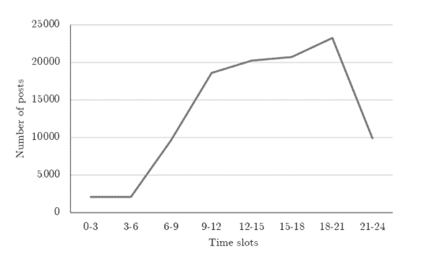

# 在 Instagram 上发帖的最佳时间——接触你的搞笑粉丝的最佳日期和时间

> 原文：<https://www.freecodecamp.org/news/the-best-time-to-post-on-instagram-the-best-days-and-times-to-reach-your-ig-followers/>

如果你想在 Instagram 上积累粉丝，你可能会想在最好的时机发帖。毕竟，如果人们实际上没有看到你的帖子，它们真的会发生吗...？

虽然没有确切的科学规定在 Instagram 上分享内容的最佳时间，但你可以使用一些策略。而且有某些时间和窗口似乎总是比其他时间和窗口更好。

在本文中，我们将使用 freeCodeCamp Instagram 帐户作为例子——因为我运行它，所以我最熟悉它的行为和趋势。

我将分享我的时间策略背后的推理，以及什么对我们最有效。我还将讨论一些关于发布时间以及如何决定何时分享内容的一般性建议。

让我们开始吧。

## 一般来说，发布到 Instagram 的最佳时间是什么时候？

正如我上面提到的，发布到 Instagram 的时间并没有普遍的正确或错误。这取决于你的受众、你的目标、你的位置以及许多其他因素。但是让我们试着获得一些见解。

首先，一些数据:

A graph showing how many posts people share in various time slots throughout the day ([Source](https://www.mdpi.com/2078-2489/11/9/453/htm))

这是一个非常普通的图表，但是你可以看到在上午 9 点到下午 6 点之间有最多的帖子。这是有道理的，因为人们在这些时间通常是清醒和活跃的。

为了更深入地了解人们发帖的时间和原因，让我们更深入地探讨一下。

### 设身处地为你的观众着想

好吧，让我们从逻辑上考虑一下。或许，如果你是 Instagram 用户，想想你自己在这个应用上的行为。

如果你是一个有点典型的用户，你可能会在醒来时检查 IG。没有什么比一点灵感/FOMO/政治评论更能让一天顺利开始的了。

然后，当你吃午餐时，你可能会再次打开应用程序，查看你整个早上工作或做其他事情时分享的所有美味。

当你的一天结束时，你的大脑变得疲惫，或者从工作、照顾孩子或找工作中分心——或者无论你如何度过你的一天——你可能会再次登录 Instagram，只是为了逃避和浏览一分钟。

明白我的意思了吗？人们倾向于在工作前、需要休息时或想要灵感或信息时查看 Instagram。

当然，Instagram 并不总是宁静的——许多人使用它进行主动学习，分享他们的艺术，消费和分享关于政治和社会正义的信息，等等。

但这取决于你是否了解你的观众。无论你发布的是旅行照片还是技术教程，想想谁可能会对这些图片或视频感兴趣，以及他们可能会在什么时候浏览应用程序。

### 如何选择发布到 Instagram 的最佳时间

既然你已经想到了谁可能会查看你的帖子(以及你希望谁查看这些帖子)，那么让我们来谈谈 Instagram 浏览量的一些总体趋势。我将把重点放在技术和教育领域，因为这是 freeCodeCamp 的地盘。

首先，有一点要记住:如果你有一个相对全球化的受众——意味着你的观众遍布世界各地——当你发帖的时候就没那么重要了。或者说，你不可能一下子迎合所有时区。如果你能找出你的大多数听众在哪里，甚至是一小部分，那么就把注意力集中在那个地区最理想的时间。

这是我遵循的一个策略。我住在美国西海岸，各州有很多人以某种方式参与 freeCodeCamp(无论是通过[课程](https://www.freecodecamp.org/learn)、出版物、[论坛](https://forum.freecodecamp.org/)、 [YouTube 频道](https://www.youtube.com/channel/UC8butISFwT-Wl7EV0hUK0BQ)，还是我们的[社交](https://twitter.com/freeCodeCamp) [媒体](https://www.instagram.com/freecodecamp/) [频道](https://www.linkedin.com/school/free-code-camp/))。

freeCodeCamp 的部分策略是我们不会提前安排帖子。我喜欢让内容保持新鲜和最新，我每周都会在 freeCodeCamp 的账户上发布几次。

通过计划，我只是联系那些我想分享帖子的人，请求他们允许我这么做。一旦我得到了它，我就把那个帖子的 URL 添加到一个电子表格中，这样我就可以跟踪我在什么时候分享了哪些帖子。

现在的主要问题是——一旦我有了计划好的帖子，我什么时候分享它们？

嗯，我考虑了我上面讨论的因素，这是我的总体策略。

#### 专注于工作日

我想在人们学习、工作或做一些可能需要休息的事情时抓住他们。一点点灵感。我在 freeCodeCamp 的 IG 账户上分享的大部分内容正在被重新分享，所以这是别人创作和发布的内容。

我这样做，部分是为了展示 freeCodeCamp 社区的全球性。我分享的许多图片都是开发人员和新程序员使用或正在使用 freeCodeCamp 课程学习编码的。人们到处都在这么做，所以我希望我们的 Instagram feed 能反映这一点。

所以在这一周，大约在午餐时间(太平洋时间)，我分享人们编码的照片，人们设置的照片，以及人们学习编码的照片。这样，当一个人滚动他们的 feed 看到 freeCodeCamp 分享的东西时，他们有希望收到积极、包容、支持和灵感。

### 专注于白天

作为一个补充说明，当世界上的大部分人都醒着的时候，我会试着分享内容。

当然，并不是每个人在我发帖的时候都会目光炯炯(就像我妈妈说的那样)，但我们的目标是在搞笑世界继续前进，用更多的帖子淹没人们的订阅之前，给尽可能多的人一个看到图片的机会。

#### 想想一周中的每一天

最后，我想人们的时间表可能是什么样的。我意识到我没有一个完全典型的时间表，但我承认我把自己作为一个案例研究。

我通常周一至周五工作，周末专注于其他事情。有时一些与工作相关的事情需要我在周六或周日集中注意力，但我尽量坚持有规律的时间表。

当我在周一开始一周的工作时，我的收件箱很满，各种重复的任务需要我的注意，我还有一两个会议。星期二通常也是如此。

到了周三，我差不多赶上进度了，可以做更大的项目或其他对时间不那么敏感的任务。

周四和周五也更自由，我经常有时间为 freeCodeCamp 的出版物写文章，补上积压的工作。

尽管如此，我通常会在周二或周三分享照片，然后在周四或周五再次分享。这非常符合我的工作日程，我想其他人也会在那几天抽出时间来查看一两次 IG。

事实证明，这些时间相当理想——人们似乎在周三和周五大量使用 Instagram(尤其是在科技领域)，午餐时间是阅读的热门时间。

我在发完帖子后的一天中查看每篇帖子，然后过一天左右，看看有多少人参与。如果它有超过 1000 个赞和至少 5-10 条评论，我知道它做得相当好。

### 好吧，那么什么时候不应该发布到 Instagram 呢？

我一直在讨论我如何制定策略，以及何时应该在 Instagram 上发布。但是你如何确定什么时候你**不应该**？

嗯，我做了一些调查，普遍的共识是周日是最糟糕的时间。在那段时间里，很少有人使用这款应用并分享，如果你仔细想想，这是有道理的。

在我家，星期天经常被用来完成你在一周中没有做的事情。或者，除此之外，在重新开始之前减压和恢复活力。一般来说，我不会在周末花太多时间在社交媒体上，有时我只是在周六和周日到来时才在屏幕上敲敲键盘。

除了周日，似乎没有哪一天对 Instagram 的浏览量和参与度不利。这就是你需要针对你的情况做一些研究的地方。

## 算出你自己理想的发布时间

你也可以经历这个心理过程——思考你的听众的潜在时间表，与你自己的相互参照，等等。这可能需要一些尝试和错误，但跟踪结果，你将能够磨练你的策略。

但是也许你知道你的大多数观众都在某个地理区域。然后，你应该做一些研究，看看你所在地区或国家的人们何时使用 Instagram，并以此为基础制定你的发布时间表(因为这对你或你的品牌有意义)。

当你进行研究和制定发布时间表时，可以考虑以下一些概括(同样基于技术世界):

*   工作日往往会带来更高的参与度
*   有时候你可以在人们刚醒来的时候抓住他们，所以清晨也能起作用
*   午餐时间相当可靠，因为许多人在吃饭的时候会查看/浏览手机
*   工作日的晚些时候也不错，因为人们厌倦了工作/他们整天做的任何事情，需要休息
*   在爱尔兰，星期天往往相对安静

你有收集到的关于发布到 Instagram 的最佳时间的数据吗？如果你与我们分享它，我们也许能把它包括在这篇文章中:)只需[在 Twitter](https://twitter.com/abbeyrenn) 上联系。

祝你好运，用你的 Instagram 内容接触尽可能多的人！