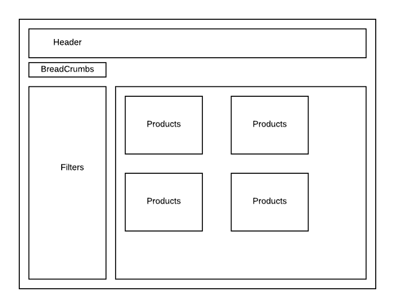
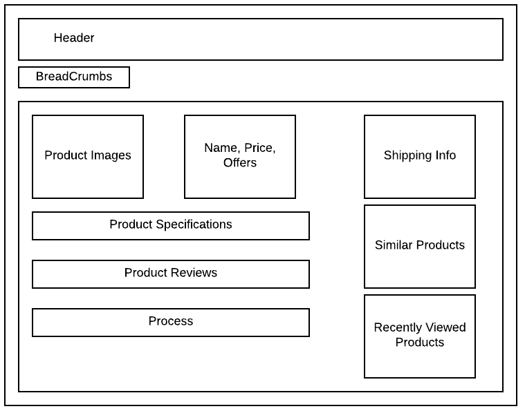
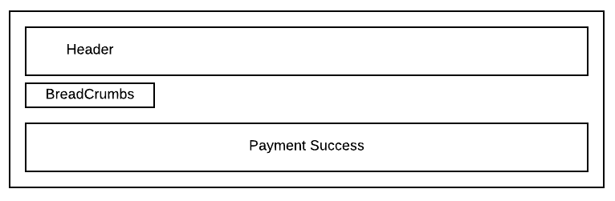
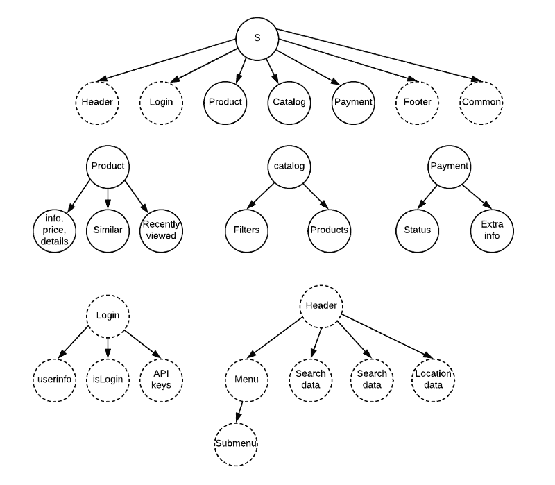
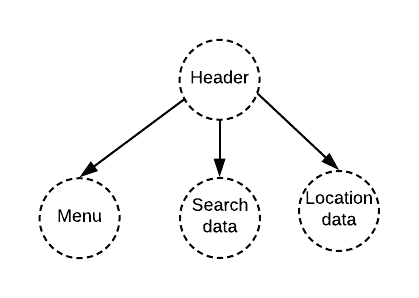
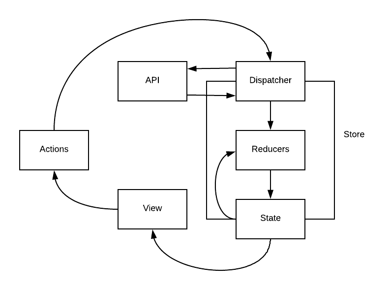

# 设计 Redux 应用的最佳方式

> 原文：<https://www.freecodecamp.org/news/the-best-way-to-architect-your-redux-app-ad9bd16c8e2d/>

这篇文章是关于如何用 Redux 思考的。我们将试图理解如何利用这个奇妙的库来使我们的应用程序更加稳定、健壮和可维护。它是语言不可知的，但是我们将保留使用 React 来还原的范围。

对于以前没用过 Redux 的人，我引用一下[文档](https://redux.js.org/):

> Redux 是 JavaScript 应用程序的可预测状态容器。

它只是一个 2kb 的库，解决了维护大型 JavaScript 应用程序的最大问题之一:状态管理。

这篇文章不是关于 Redux 的，因为已经有很多关于它的文章了。相反，它是关于我们应该如何可视化 Redux 应用程序并有效地使用它。

假设我们正在构建一个电子商务应用程序，其中有一些基本页面，如目录、产品详情和支付成功。

以下是该应用程序的线框外观:



Catalog Page



Product Page



Payment Success

因此，Redux 中的架构意味着我们必须将应用程序视为一个实体，每个页面都是一个子实体。

构建 Redux 应用程序有四个阶段:

1.  可视化状态树
2.  设计您的减速器
3.  实施行动
4.  实现演示

### 步骤 1:可视化状态树

从上面的线框，让我们设计我们的状态树。



Application state tree

这是最重要的一步。在我们完成了状态树的可视化之后，实现 Redux 技术就变得非常容易了！虚线圆圈是应用程序共享的状态，实线圆圈是特定于页面的状态。

### 第二步:设计你的减速器

如果你想知道减速器到底是什么，我将直接引用文件:

> **reducer**指定应用程序的状态如何改变，以响应发送到商店的[动作](https://redux.js.org/basics/actions)。记住动作只描述了*发生了什么*，而没有描述应用程序的状态如何变化。

每个重要的状态都可以有自己的还原。稍后，我们可以将它们合并到一个根归约器中，这个归约器将最终定义存储(应用程序真实的单一来源)。这就是真正的力量所在:你完全控制你的状态和它们的行为。商店什么都看得见。沉默的观察者一直在观察。


The store keeping watch

让我们来看一个例子，看看如何在我们上面设计的应用程序状态树的帮助下设计一个缩减器。

```
// Root Reducer
const rootReducer = combineReducer({  
    header: headerReducer,  
    login: loginReducer,  
    footer: footerReducer,  
    common: commonReducer,  
    product: productReducer,  
    catalog: catalogReducer,  
    payment: paymentReducer
});
```

Root Reducer

减根器说明了一切。它包含了商店需要了解的关于应用程序的所有信息。

现在让我们看看子实体 headerReducer 是什么样子的。

还记得我们是如何设计标题状态的吗？



Header state tree

```
// Header Reducer

const headerReducer = combineReducer({
    menu: menuReducer,  
    search: searchReducer,  
    location: locationReducer
});
```

我们的缩减器是我们之前在状态树中设计的一个复制品。这就是观想的力量。

请注意一个异径管如何包含更多的异径管。我们不需要制造一个巨大的减速器。它可以很容易地被分解成更小的 reducerss，因为每个 reducer 都有自己的身份，并有自己特定的操作。这有助于我们创建逻辑分离，这对维护大型应用程序非常重要。

现在让我们了解一个典型的 reducer 文件应该如何设置，例如 searchReducer。

```
// Search Reducer

const initialState = {  payload: [],  isLoading: false,  error: {}};

export function searchReducer( state=initialState, action ) { 	 
    switch(action.type) {    
        case FETCH_SEARCH_DATA:      
            return {        
                	...state,        
                    isLoading: true    
            };        
        case FETCH_SEARCH_SUCCESS:      
            return {        
	                ...state,        
                    payload: action.payload,        
                    isLoading: false      
                   };        
        case FETCH_SEARCH_FAILURE:      
            return {        
	                ...state,        
                    error: action.error,        
                    isLoading: false            
            };

        case RESET_SEARCH_DATA:      
            return { ...state, ...initialState }        
		default:      return state;
    }
}
```

这个 reducer 模式定义了在调用搜索 API 时其搜索状态可能发生的变化。

```
FETCH_SEARCH_DATA, FETCH_SEARCH_SUCCESS, FETCH_SEARCH_FAILURE, RESET_SEARCH_DATA
```

以上所有都是可能的常数，它们定义了什么可能的**动作**可以被执行。

> *注意:保持一个 RESET_SEARCH_DATA 动作是很重要的，以防我们需要在卸载一个组件的过程中重置数据。*

### 步骤 3:实施行动

在一个应用程序中，每个有 API 调用的动作通常会经历三个阶段。

1.  加载状态->提取搜索数据
2.  成功->获取搜索成功
3.  失败->获取 _ 搜索 _ 失败

维护这些动作类型有助于我们在应用程序中调用 API 时检查数据流。

让我们深入代码，了解典型的动作是什么样子的。

```
export function fetchSearchData(args) {  
	return async (dispatch) => {    
        // Initiate loading state    
        dispatch({      
            type: FETCH_SEARCH_DATA    
        });
        try {      
            // Call the API      
            const result = await fetchSearchData(
                args.pageCount, 
                args.itemsPerPage
            );           
            // Update payload in reducer on success     
            dispatch({        
                type: FETCH_SEARCH_SUCCESS,        
                payload: result,        
                currentPage: args.pageCount      
            });    
        } catch (err) {     
            // Update error in reducer on failure           
            dispatch({        
                type: FETCH_SEARCH_FAILURE,        
                error: err      
            });    
        }  
    };
}
```

请注意商店是如何通过操作跟踪数据流的。这使得应用程序中的每一个变化都是有责任的。

因此，为各种状态的减速器的每次变化编写了类似的动作。

Redux 最大的好处之一是每一个动作的抽象。



Data Flow in a Redux App

### 步骤 4:实施演示

```
import React, { Component } from 'react';
import { connect } from 'react-redux';;

import fetchSearchData from './action/fetchSearchData';
import SearchData from './SearchData';

const Search = (props) => (  
    <SearchData     
    	search={props.search}    
		fetchSearchData={props.fetchSearchData}   
	/>
);

const mapStateToProps = (state) => ({  
    search: state.header.search.payload
});

const mapDispatchToProps = {  fetchSearchData};

export default connect(mapStateToProps, mapDispatchToProps)(Search)
```

如您所见，表示组件非常简单，易于理解。

### 结论

我想提一下我发现的使用 Redux 的一些最大的好处:

1.  它确实减少了代码味道。
2.  代码的抽象更容易实现。
3.  Redux 还向我们介绍了其他一些原则，比如不变性、函数式编程等等。
4.  它允许你想象每一个动作，并用“时间旅行”来追踪它们

我希望这篇文章能帮助你更清楚地了解为什么 Redux 真的很棒，以及我们如何利用可视化的力量来制作可维护的应用程序。

*在 **[twitter](https://twitter.com/daslusan)** 上关注我，获取更多关于新文章的更新，并了解最新的前端开发。也在 twitter 上分享这篇文章，帮助其他人了解它。分享就是关爱 **^_^.***

### 一些有用的资源

1.  [https://redux.js.org/](https://redux.js.org/)
2.  [https://github.com/reduxjs/redux/blob/master/examples](https://github.com/reduxjs/redux/blob/master/examples)
3.  [https://medium . com/@ rajaraodv/a-guide-for-building-a-react-redux-crud-app-7 Fe 0 b 8943d 0 f # . C4 yhvk 0d](https://medium.com/@rajaraodv/a-guide-for-building-a-react-redux-crud-app-7fe0b8943d0f#.c4yhhvk0d)

### 我以前的文章

1.  [https://medium . freecodecamp . org/how-to-use-redux-persist-when-migrating-your-States-a5 dee 16 b5 EAD](https://medium.freecodecamp.org/how-to-use-redux-persist-when-migrating-your-states-a5dee16b5ead)
2.  [https://code burst . io/redux-observable-to-the-rescue-b27f 07406 cf2](https://codeburst.io/redux-observable-to-the-rescue-b27f07406cf2)
3.  [https://code burst . io/building-web app-for-the-future-68d 69054 cbbd](https://codeburst.io/building-webapp-for-the-future-68d69054cbbd)
4.  [https://code burst . io/CORS-story-of-requested-twice-85219 da 7172d](https://codeburst.io/cors-story-of-requesting-twice-85219da7172d)