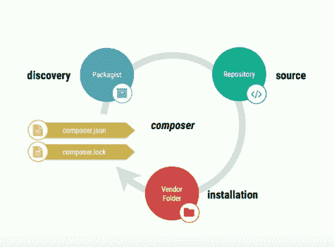
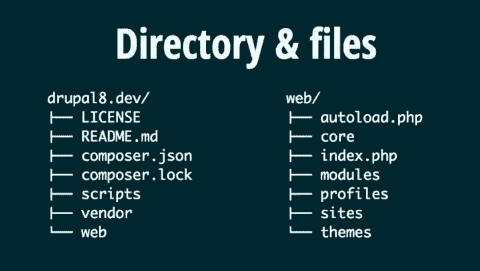

# 管理 Drupal 工作流的最佳方式

> 原文：<https://www.freecodecamp.org/news/the-best-way-to-manage-your-drupal-workflow-ade9525a84c0/>

开发人员在迁移到 Drupal 8 时面临的一个难题是缺乏部署 Drupal 站点的最佳实践。部署中的挑战围绕着依赖管理、Drupal 贡献模块/主题、配置管理，当然还有代码库。

Drupal 7 没有这些问题。但是啊，Drupal 8 附带了很多需要管理的东西。Drupal 8 最大的变化之一是采用了 Composer。好东西是有代价的。

我们将为一个 Drupal 站点使用一个代码库，并使用 Git 进行版本控制和部署。

### 设计者

[Composer](https://getcomposer.org/) 是 PHP 的依赖管理器(就像 Node 的 npm 或者 Python 的 pip)。Drupal core 使用 Composer 来管理核心依赖项，如 Symfony 组件和 Guzzle。Composer 允许我们系统地管理依赖项及其附属依赖项的列表。Composer 通过名为 composer.json 的清单文件安装这些依赖项。



这个 composer.json 文件包含项目所需的依赖项。您可以运行以下命令来安装它

```
composer install
```

第一次。它定位、下载、验证和加载软件包。它还确保每个包都使用正确的版本，并维护名为 composer.lock 的日志文件。

**注意:始终提交 composer.lock 文件，**,因为它包含您在项目中定义的依赖项的精确版本。

如果您想要更新任何特定的软件包，最好运行以下命令:

```
composer update package/package-name
```

您不应该运行 **composer update，**，因为 composer 会尝试更新每个依赖项。这可能会给你的网站带来问题。

### Drupal 作曲家

Drupal-composer/Drupal-project 是用 Composer 管理站点依赖关系的救命工程。

若要安装此项目模板，请运行以下命令:

```
composer create-project drupal-composer/drupal-project:8.x-dev drupal8 — stability dev — no-interaction
```

它将自动安装一个包含所有依赖项的 Drupal 站点。它还会在本地安装 [Drupal 控制台](https://drupalconsole.com/)和 [Drush](https://github.com/drush-ops/drush) 。

Composer 是安装依赖项的最快方法之一，因为它缓存依赖项，并在下次从缓存中加载数据。

#### **目录结构**



它不同于 Drupal 目录结构。您可以用包含 Drupal 文件的公共目录重新组装 web 目录。所有第三方依赖项都在 web 文件夹之外。

您可以通过 composer 安装任何 Drupal 模块、主题和概要文件，它们将分别下载到模块、主题和概要文件内的 contrib 文件夹中。这样，composer.lock 文件将拥有所有 Drupal contrib 模块以及第三方依赖项的记录。

要使用 composer 下载任何模块和主题，请运行以下命令:

```
composer require drupal/mediumish_blog
```

```
# For installing theme, we will use drupal console
```

```
drupal theme:install mediumish_blog
```

#### git ignore

与所有依赖项和 Drupal contrib 模块一样，主题由 composer 管理。因此，我们不会将这些内容推送给 Git。

```
# Ignore directories generated by Composer /drush/contrib /vendor/ /web/core/ /web/modules/contrib/ /web/themes/contrib/ /web/profiles/contrib/ /web/libraries/
```

```
# Ignore sensitive information /web/sites/*/settings.php /web/sites/*/settings.local.ph
```

### 结构管理

部署和配置管理是项目生命周期的常见操作。我们已经安装了各种模块并配置了我们的本地站点，但是我们的生产站点没有这样的配置。

在 Drupal 7 中，我们有特性模块，用于同步配置。但是 Drupal 8 有一个管理配置的内置解决方案。这允许您导出完整的网站配置，并将它们存储在 YAML 文件中。导出的文件可以导入到另一个网站，结果相同。

Drupal 的配置系统有助于以两种方式解决配置文件同步问题:一种存储配置的统一方式，以及一种在同一站点的实例之间导入/导出更改的过程。

#### **如何同步配置文件**

打开/web/sites/default/settings . PHP 并设置$ config _ directory[' sync ']

```
$config_directories[‘sync’] = ‘../config/sync’;
```

将配置文件存储在 web 目录之外是一个很好的做法，这样可以避免从互联网上访问它们。

现在使用 Drupal 控制台导出配置:

```
drupal config:export
```

```
# import on prod server
```

```
drupal config:import
```

**注意:**生产和本地 Drupal 站点应该有相同的 UUIDs。查看[此处](https://www.drupal.org/docs/8/configuration-management/managing-your-sites-configuration)了解更多信息。

**注意:** Drupal 配置管理有一个 bug——自定义块数据既不能导入也不能导出。点击查看问题链接[。](https://www.drupal.org/project/drupal/issues/2756331)

### 饭桶

我们将使用 Git 添加、提交和推送本地站点的数据以及所有配置。这将从生产服务器/站点获取。让我们看看流程:

```
# Local
```

```
git add .
```

```
git commit -m”Add commit message”
```

```
git push origin HEAD
```

```
# Server
```

```
git pull otigin HEAD
```

```
composer install # to install any new dependencies, drupal contrib modules, themes
```

```
drupal config:import # to import the configuration
```

```
drupal cache:rebuild all # rebuild the cache
```

#### **更新模块、主题和个人资料**

```
composer update drupal/mediumish_blog
```

```
drupal update:execute mediumish_blog
```

```
drupal update:execute all
```

#### **更新 Drupal 核心**

一般来说，我们在更新 Drupal 核心时会遇到问题。但是 composer 也有一个简单的方法来管理它:

```
composer update drupal/core — with-dependencies
```

它将更新 Drupal 核心及其所有相关的依赖项。

### 管理环境配置

作为开发人员，我最喜欢 Drupal 的一个方面是管理不同环境配置的能力。这可以通过使用 [vlucas/phpdotenv](https://github.com/vlucas/phpdotenv) 模块来完成，该模块也带有 Drupal composer 模板。

任何可能在部署环境之间发生变化的东西——比如数据库凭证或第三方服务的凭证——都应该从代码中提取到环境变量中。基本上，`.env`文件是一种简单的方法，可以加载应用程序需要的定制配置变量，而不必修改任何其他文件。

将. env.example 重命名为。env 文件，并将所有凭证作为键值对添加到。环境文件。

根目录下的 load.environment.php 文件将加载这个。env 文件并使它对您可用。

#### **如何使用。环境文件**

打开/web/sites/default/setting.php 并添加这组代码:

```
$databases[‘default’][‘default’] = [ ‘database’ => getenv(‘MYSQL_DATABASE’), ‘driver’ => ‘mysql’, ‘host’ => getenv(‘MYSQL_HOSTNAME’), ‘namespace’ => ‘Drupal\\Core\\Database\\Driver\\mysql’, ‘password’ => getenv(‘MYSQL_PASSWORD’), ‘port’ => getenv(‘MYSQL_PORT’), ‘prefix’ => ‘’, ‘username’ => getenv(‘MYSQL_USER’), ];
```

打开。env 文件，并设置以下凭据:

```
MYSQL_DATABASE=’db_name’ MYSQL_HOSTNAME=’localhost’ MYSQL_PASSWORD=’secret’ MYSQL_PORT=’3306' MYSQL_USER=’root’
```

现在，由于我们所有的凭据都存储在。env 文件，我们可以将我们的 settings.php 推送到服务器，并通过。环境文件。

我们通常在开发时启用 twig 调试，在生产时禁用。这也可以通过。环境文件。

在中添加一个新的键值对。环境文件:

```
APP_ENV=’local’
```

现在，将 web/sites/example . settings . local . PHP 复制到 web/sites/default/settings . local . PHP，并将此代码添加到 web/sites/development . services . yml 中的参数下:

```
twig.config: debug: true auto_reload: true cache: false
```

现在打开 web/sites/default/settings.php 并添加以下代码:

```
$env = getenv(‘APP_ENV’);
```

```
$base_path = $app_root . ‘/’ . $site_path; $settingsFile = $base_path . ‘/settings.’ . $env . ‘.php’;
```

```
if (file_exists($settingsFile)) { include $settingsFile; }
```

所以，这样一来，如果你设置你的 APP_ENV='local '，就会启用 Twig debug。在生产时，您可以通过设置 APP_ENV='prod '来禁用。您还可以为不同的环境配置不同的配置。

### 结论

Drupal 8 为导出和导入站点配置提供了一个内置的解决方案，这比在 D7 中要好得多。依赖项和贡献模块/主题由设计者自己管理。

它还不完美，因为没有标准的方法，但是上面描述的工作流是一个简单而有效的解决方案。您可以根据需要定义自己的工作流程。

作为参考，我已经把代码推送到[这个回购](https://github.com/ankitjain28may/drupal-best-practices)。

我希望这篇文章对你有用。我希望听到您的反馈:)

这篇文章来自我自己的博客。要阅读更多此类文章，请点击[这里](http://ankitjain28.me/)。