# 测试无服务器应用程序的最佳方式

> 原文：<https://www.freecodecamp.org/news/the-best-ways-to-test-your-serverless-applications-40b88d6ee31e/>

无服务器不仅仅是一个云计算执行模型。它改变了我们规划、构建和部署应用的方式。但它也改变了我们测试应用的方式。

见见亚历克斯。Alex 是一名普通的 JavaScript 开发人员，最近专注于 Node.js。

This is Alex

在过去的几个月里，他的好朋友安娜和杰夫总是在谈论那个无服务器的东西。尽管它们有时很烦人，但他喜欢无服务器应用的想法。他甚至在某个时候给 AWS Lambda 和 Azure 部署了几个简单的功能。

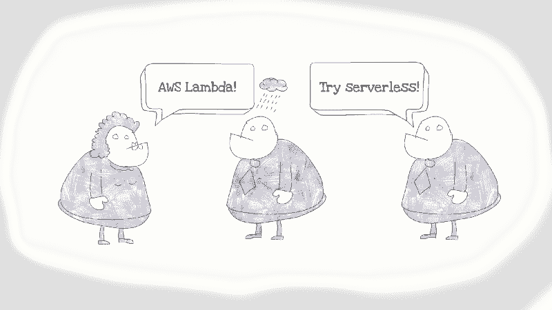

Anna and Jeff are always talking about that serverless thingy

在某个时候，Alex 和他的团队得到了一个新项目。经过一些分析后，Alex 认为它非常适合无服务器。他向他的团队提出了这个想法。一些团队成员很兴奋，其中一个不喜欢，但大多数人没有强烈的意见。所以，他们决定试一试——项目不算太大，风险也低。

Alex’s team discussing using serverless on their new project

该团队阅读了关于无服务器的资料，并有了如何构建新应用的想法。但是没有人确定他们应该如何将无服务器应用到他们的通用开发过程中。

在那一刻，他们的过程是这样的:

1.  他们分析了一个新特征。
2.  对于不太复杂的特性，他们从代码开始，然后在本地运行，最后添加一些测试。
3.  对于更复杂的特性，他们使用他们的 TDD 版本:他们从测试开始，然后编写代码，并在本地测试。
4.  当特性准备好了，它就被 CI 工具部署到测试环境中。
5.  然后 QA 团队对新特性进行另一轮手动测试。如果一切看起来不错，该应用程序将通过 CI 进入生产阶段。

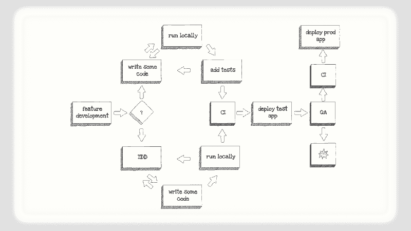

Alex’s team’s common development process

他们决定一步一步地开始，然后遇到问题就解决。

他们挑选了一个小特性，因为它很简单，所以他们从代码开始。当编码部分准备好时，他们遇到了第一个障碍:如何在本地运行无服务器应用程序？

### 本地测试

使用无服务器应用程序，您不需要管理基础架构。听起来不错，但是如何在本地运行应用程序呢？你能做到吗？

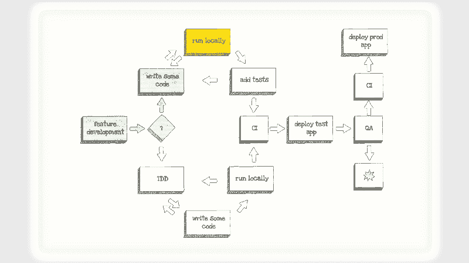

First roadblock: how do you run serverless application locally?

根据您的应用和无服务器供应商，您可以在本地运行应用的某些部分。为此，您可以使用以下一些工具和技术:

*   [Azure 功能核心工具](https://github.com/Azure/azure-functions-core-tools)(针对 Azure 功能)
*   [AWS SAM CLI](https://github.com/awslabs/aws-sam-cli) (针对使用 AWS SAM 构建的 AWS Lambda 应用)
*   第三方工具(即[本地堆栈](https://localstack.cloud)
*   [docker-lambda](https://github.com/lambci/docker-lambda) 为 AWS Lambda 本地模拟
*   在本地运行 Node.js 函数

当然，这个列表并不完整——还有更多的工具，我们现在几乎每天都会看到新的工具。

大多数工具都有一定的局限性。它们可以模拟无服务器功能和一些其他服务，如 API Gateway。但是权限、授权层和其他服务呢？

本地测试有助于快速验证，以确保您的功能正常工作。但是，有没有更好的方法来确保你的无服务器应用程序正常工作呢？是的有。第一步也是最重要的一步是:编写测试。

所以 Alex 和他的团队在本地尝试了他们的第一个功能，看起来效果不错。然后他们进行下一步。

### 自动化测试

Alex 和他的团队刚刚切换到 [Jest](https://facebook.github.io/jest/) 来测试他们的 Node.js 应用程序。他们仍然做很多前端工作，所以他们希望尽可能对整个堆栈使用相同的工具。他们也能使用 Jest 测试无服务器应用吗？他们应该测试什么？

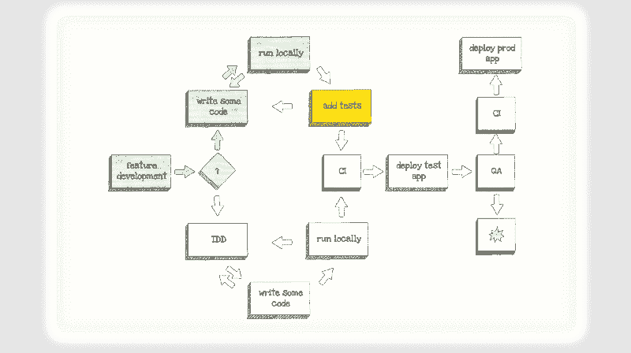

Second roadblock: how does serverless affect automated testing?

经过快速调查，他们意识到可以使用他们最喜欢的 Node.js 测试工具。Jest、Jasmine、Mocha 和其他软件在无服务器环境下运行良好。

#### 在无服务器应用程序中应该测试什么？

Alex 和他的团队使用 Node.js 应用程序，遵循三层测试自动化金字塔。测试金字塔是由 Mike Cohn 在他的书《敏捷的成功之路》中首次提到的。

正如测试金字塔所定义的，他们有:

*   大量的单元测试，因为它们是最便宜的(编写和运行最快的)
*   更少的集成测试，因为它们更昂贵，并且需要更多的时间来运行
*   一些 UI 测试，因为它们是最昂贵的(需要一些 GUI 工具)并且运行最慢

除此之外，他们还有基于会话的手动测试，由他们的 QA 团队完成。

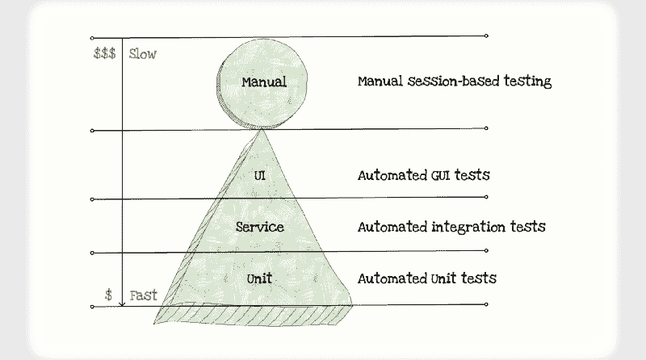

[test pyramid](https://martinfowler.com/bliki/TestPyramid.html) with manual testing

无服务器如何影响测试自动化金字塔？

答案取决于层级。但是这个测试金字塔看起来不太像埃及金字塔 T1，更像 T2 玛雅金字塔 T3。

单元测试层不会受到太大影响。单元测试仍然是编写和运行最便宜的，但是单元可以更小。

集成测试层变得前所未有的重要，因为无服务器应用严重依赖集成。它也更便宜，因为仅用于测试的无服务器数据库很便宜。因此，在一个无服务器的“测试金字塔”中，你需要有更多的集成测试。

GUI 测试层也更便宜和更快，因为并行化更便宜。

手动测试层保持不变。但是 serverless 可以帮你稍微改善一下。我们稍后将详细讨论这一点。

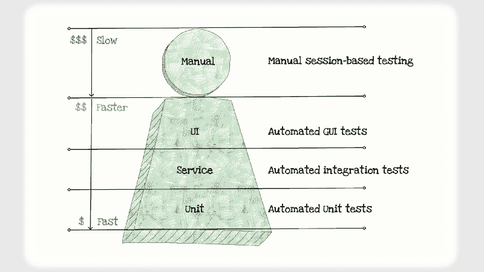

Serverless “test pyramid”

亚历克斯和他的团队终于有了一些关注点。下一个问题是如何编写一个函数来更容易地测试它们。

#### 如何编写一个可测试的无服务器函数

在编写无服务器函数时，您需要考虑以下风险:

*   **配置风险**数据库和表格是否正确？或者，你有访问权限吗？
*   **技术工作流程风险** 您是否按照您应该的那样解析和使用了传入的请求？或者，您是否正确处理了成功的响应和错误？
*   **业务逻辑风险** 您是否遵循了应用程序的所有业务逻辑规则？
*   **集成风险**您是否正确地阅读了传入的请求结构？或者您是否正确地将订单存储到数据库中？

为了确认您的无服务器功能正常工作，您需要测试所有这些风险。

您可以像测试集成测试一样测试其中的每一项。但是每次您想要测试这些风险时设置和配置服务并不是最佳的。正如我的朋友亚历山大·西蒙维克喜欢说的:

> 想象一下，如果测试汽车是这样做的。这意味着每次你想测试汽车上的一个螺丝钉，甚至是一面镜子，你都必须组装然后拆卸整辆汽车。

为了使应用程序更具可测试性，清晰的解决方案是将你的功能分成几个更小的部分。

其中一个很好的方法是将[六边形架构](https://www.google.com/url?sa=t&rct=j&q=&esrc=s&source=web&cd=1&cad=rja&uact=8&ved=0ahUKEwjF8vPNsMnbAhXBVywKHSTxAskQFggmMAA&url=http%3A%2F%2Falistair.cockburn.us%2FHexagonal%252Barchitecture&usg=AOvVaw3e6eQDT3ptDvw8FnumhByp) 应用到您的无服务器功能中。

六角形架构，或称**端口和适配器**，是一种应用程序架构形式，通过责任层促进关注点的分离。作为它的创造者，[阿利斯泰尔·考克伯恩](http://alistair.cockburn.us)解释道:

> 允许应用程序同样由用户、程序、自动化测试或批处理脚本驱动，并且独立于其最终运行时设备和数据库进行开发和测试。

那么，这如何应用于无服务器功能呢？

随着 Alex 和他的团队使用 AWS，他们最终得到了如下结构:

*   功能业务逻辑暴露很少的“端口”(或者期望很少的参数)。例如，一个用于传入事件，一个用于永久存储，一个用于通知。
*   他们有两个适配器用于触发函数的事件，一个用于真正的 AWS Lambda 触发器，另一个用于本地测试。
*   他们有几个适配器用于永久存储和通知。比如 DynamoDB 表适配器和内存适配器。

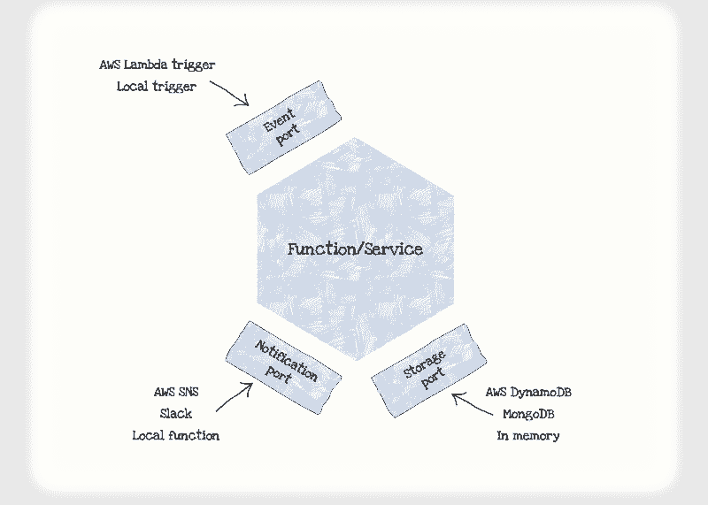

Hexagonal architecture of AWS Lambda function

亚历克斯和他的团队很高兴他们正在前进。但是在我们继续之前，让我们看看六边形架构如何影响测试金字塔的每一层。

#### 单元测试

单元测试保持不变。但是因为六边形的架构，所以更容易写单元测试。他们可以简单地使用本地适配器或 mock 作为适配器来单独测试功能业务层。

#### 集成测试

集成测试从六边形架构中受益匪浅。他们能够全面测试他们拥有的集成。使用其他适配器模拟第三方集成。

这在实践中是如何运作的？

他们的每个无服务器函数都有 *lambda.js* 和 *main.js* 文件。主文件包含无服务器功能的业务逻辑。而 *lambda.js* 文件负责连接适配器和调用 *main.js* 文件。

主文件有自己的单元和集成测试。但它的集成测试不会测试与终端服务的完全集成，比如 AWS S3，因为那会降低它们的速度。相反，他们使用内存适配器来测试文件存储集成的功能。

AWS S3 集成是通过 *FileRepository* 完成的，它有自己的单元和集成测试。集成测试检查使用 AWS S3 来确保最终的集成确实有效。

与 *main.js* 相反， *lambda.js* 文件没有测试，因为大多数时候它只有几行代码。

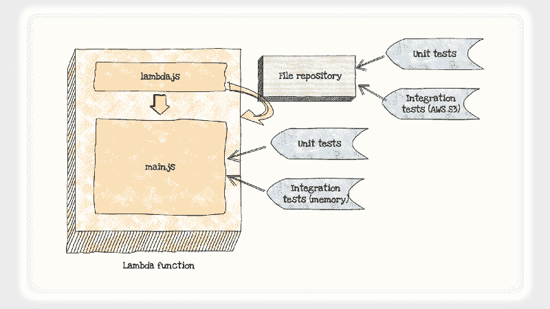

Visual representation of single AWS Lambda function with tests

这种方法类似于 MindMup 团队用来测试无服务器功能的技术。有了它，您可以轻松地测试您的功能的集成，并且仍然使您的集成测试更快。

#### GUI 测试

由于 Alex 和他的团队正在为应用程序构建后端，GUI 测试层并不相关。但是随着他们对无服务器的了解越来越多，他们意识到他们可以使用它来改进他们正在开发的其他应用程序的 GUI 测试层。

UI 测试既昂贵又缓慢，因为它们在浏览器中运行。但是，无服务器很便宜，而且扩展速度很快。

如果他们可以在 AWS Lambda 中运行浏览器，他们将获得廉价的并行化。这将使他们的 UI 测试更便宜、更快。

但是，你能在一个无服务器的功能中运行一个浏览器吗，比如 Chrome？

是啊！借助工具，如[无服务器 Chrome](https://github.com/adieuadieu/serverless-chrome) 、 [Chromeless](https://github.com/prismagraphql/chromeless) 和[木偶师](https://github.com/GoogleChrome/puppeteer)，这很容易。

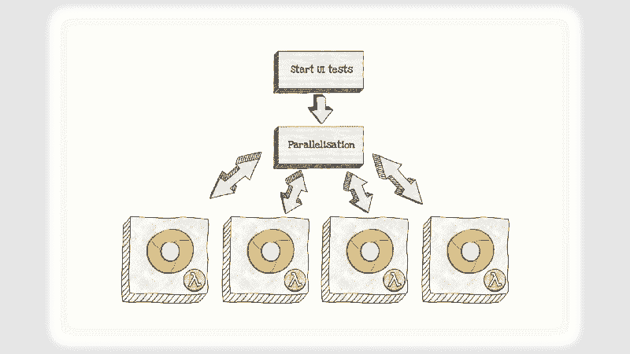

Using AWS Lambda functions for parallelization of UI tests

无服务器和无头浏览器的结合可以给我们带来新一代的 UI 测试工具。我们已经可以看到和尝试其中的一些，比如[评](http://appraise.qa)。

### CI / CD

随着 Alex 和他的团队测试他们的第一个无服务器功能，是时候将代码部署到测试环境中了。这带来了一个新问题:他们如何使用 CI/CD 工具来部署他们的无服务器应用程序？

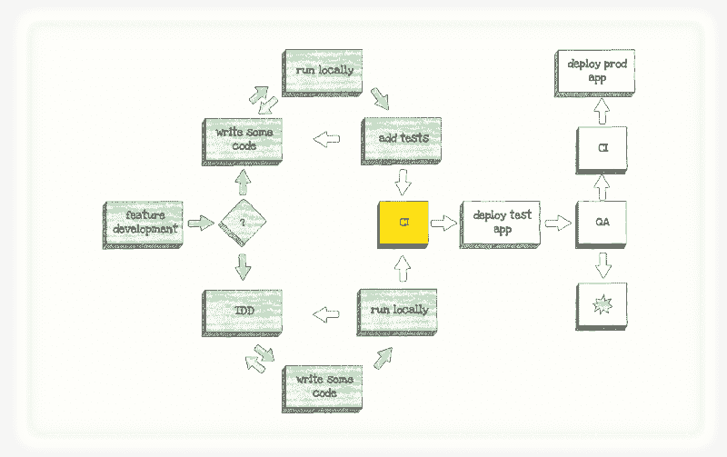

答案很简单:他们可以使用 CI 工具来运行测试和部署应用程序。部署应用程序，使用任何流行的工具，如 [Claudia.js](https://claudiajs.com) 、 [AWS SAM](https://github.com/awslabs/serverless-application-model) 和[无服务器框架](https://serverless.com)。

你仍然可以使用你最喜欢的 CI 工具(比如[詹金斯](https://jenkins.io)、[特拉维斯奇](https://travis-ci.org)或[塞弗塞奇](https://semaphoreci.com))，或者如果你想坚持使用 AWS，你可以尝试 [AWS CodeBuild](https://aws.amazon.com/codebuild/) 。

### 人工测试

即使手动测试不受无服务器的直接影响，该团队也找到了一种方法来改进他们的 QA 流程。

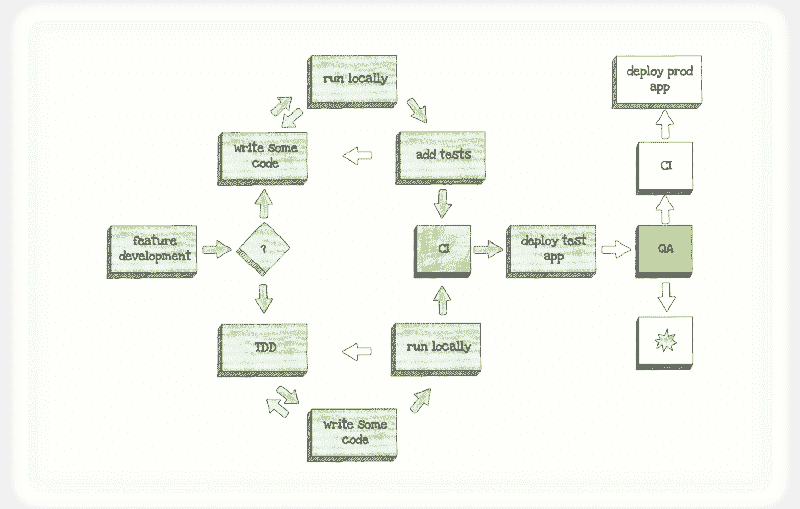

无服务器应用程序的阶段和部署很便宜，并且通常设置很快。此外，使用无服务器，如果没有人使用它，你就不用为应用程序付费。

这意味着拥有一个测试环境从来没有这么便宜过！

同样，有了无服务器，你通常可以*将功能从一个阶段提升到另一个阶段。这意味着您的 QA 团队可以测试一个功能，当他们确认它可以工作时，您可以将相同的功能推广到生产中。*

### 超越测试

Alex 和他的团队将他们的第一个无服务器功能交付给了预生产，团队很高兴他们学会了如何测试无服务器应用程序。

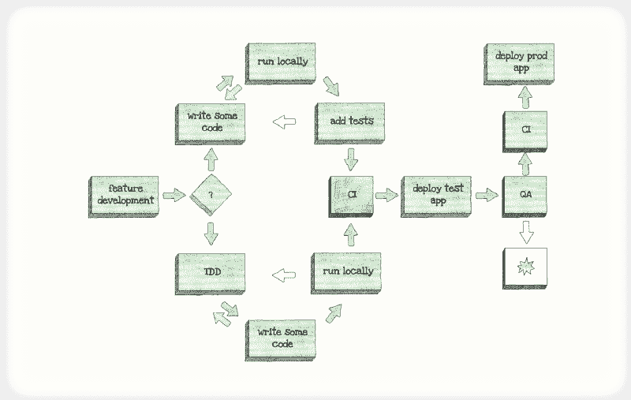

他们继续在这个项目中使用无服务器，并将其引入到其他几个项目中。亚历克斯加入了他的朋友安娜和杰夫，成为第三个，有时令人讨厌的，无服务器的传教士。从此他们幸福地生活在一起。

Serverless preachers crew got a new member

### 后期脚本

但是即使他们的应用程序经过了很好的测试，一夜之间还是发生了一些事情。

经过调查，他们发现其中一个集成发生了变化。他们了解到测试对于无服务器应用很重要，但这还不够。

由于无服务器应用严重依赖集成，风险从您的代码转移到集成。此外，为了能够捕捉集成变化并快速做出反应，您的应用程序需要适当的监控。

幸运的是，市场上每天都有越来越多的无服务器监控工具。一些好的和受欢迎的选项是 [IOpipe](https://www.iopipe.com) 、[桑德拉](https://www.thundra.io)、 [Dashbird](https://dashbird.io) 和 [Epsagon](https://www.epsagon.com) 。

但是，无服务器应用程序通常有一个胖客户端，这意味着后端监控是不够的。您的前端需要一个类似的工具。这个市场也有很多不错的工具，比如[哨兵](https://sentry.io)和[滚动条](https://rollbar.com)。

但是本着无服务器的精神，我们创建了一个名为 [Desole](https://desole.io) 的开源错误跟踪应用。这是一个无服务器的应用程序，你可以安装在你的 AWS 帐户。它使组织能够跟踪应用程序异常和错误，而不必在软件即服务的便利性和自托管解决方案的安全性之间做出选择。可以在这里查看: [https://desole.io](https://desole.io.) 。

[Desole](https://desole.io), open source error-tracking, tightly integrated with AWS

> 所有插图都是使用 [SimpleDiagrams4](https://www.simplediagrams.com) 应用程序创建的。

如果您想了解更多关于使用 Node.js 和 AWS 测试和构建无服务器应用程序的信息，请查看“使用 Node.js 的无服务器应用程序”，这是我与 Aleksandar Simovic 为 Manning Publications 撰写的一本书:

[**使用 Node.js 的无服务器应用**](https://www.manning.com/books/serverless-applications-with-nodejs)
[*使用 Claudia.js 的无服务器部署的精彩介绍*www.manning.com](https://www.manning.com/books/serverless-applications-with-nodejs)

这本书将通过代码示例教你更多关于无服务器测试的知识，但你也将学习如何使用 Node 和 Claudia.js 构建和调试真实世界的无服务器 API(带数据库和认证)，你还将学习如何为 Facebook Messenger 和 SMS(使用 Twilio)构建聊天机器人，以及 Alexa 技能。