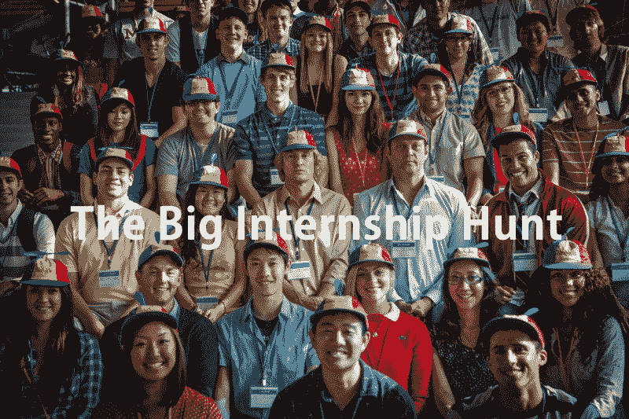
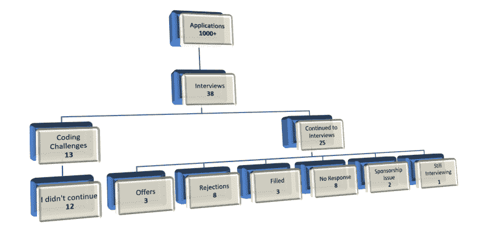
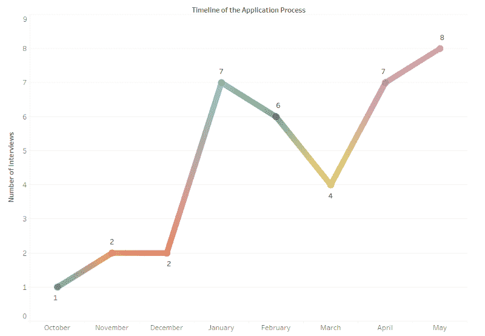
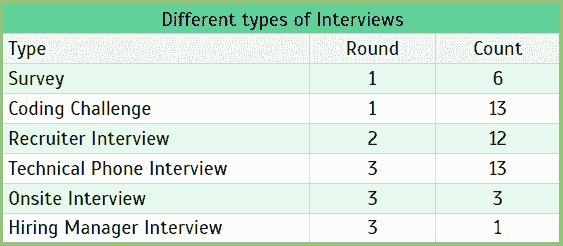

# 如果你想得到梦想中的实习机会，要避免的错误

> 原文：<https://www.freecodecamp.org/news/the-big-internship-hunt-my-experience-7506d1c053dd/>

由密码破译员

# 如果你想得到梦想中的实习机会，要避免的错误

Source: Image from the The Internship Movie

嘿伙计们！我叫皮尤什。这是我在互联网上的第一篇文章，所以原谅我讲故事。这篇文章比我预期的要长，但是值得一试。我根据我对实习申请和面试过程的理解，分享我的知识、经验和注意事项。我试图避免你可能已经在其他文章或博客中读到的一般性建议。这篇文章是基于我申请软件实习的经验，但是这些建议中的大部分可以用于其他实习领域。所以，让我们开始吧。

### 关于我自己的一点点

2017 年 10 月左右开始申请暑期实习。我从一开始就对秋季学期结束前可能会有有利结果的面试电话充满信心，这将带来一个充满乐趣的寒假。

但事实是，由于这些暑期实习的疯狂竞争，我的任何申请都没有得到回复。大多数公司的实习生职位中有相当大一部分是由本科生填补的。此外，大多数公司对他们挑选的学生就读的大学非常挑剔。

最初，我的申请没有接到面试电话，这让我有点害怕，但经过一点点研究，我发现几乎 99%的电话会在春季学期。所以那些在冬歇期前没有得到面试机会的人，相信我，你会在冬歇期后得到很多电话。

我收到微软的一封电子邮件，安排在秋季学期的期末周进行一次电话面试。面试进行得很顺利，招聘人员告诉我，如果他们决定继续面试，他们会在一周内回来。没有收到他们的回复让我对他们的招聘期感到好奇，结果却看到微软在我的面试时间之前结束了招聘程序。我确实收到了招聘人员的电子邮件，说他们正在打电话给我，让我去他们在西雅图的总部办公室参加最后几轮面试，但遗憾的是，他们已经缓冲过度了。所以，我的梦想就在那里破灭了。

但我满怀希望。这是**错误 1:** 我错过了在秋季开始时申请一些好公司的机会。这条规则适用于所有公司，尤其是像谷歌、微软、彭博等知名公司。

> 小贴士:一些大公司会在 11 月份结束夏季实习生的招聘，所以当他们在 8 月份开始招聘时，尽快申请。

于是，寒假开始了，我打算准备编码面试，申请尽可能多的实习岗位。但是日子一天天过去，我严格地申请，很少考虑磨练我的编码技能。

这是**错误#2:** 我只是准备了数据结构和算法的基础知识，并试图从 Leetcode 中做一些我认为可能会在面试中出现的本质问题。我太专注于短期收益，以至于把整个面试准备都搞砸了。我采取的方法是错误的，我没有为长期的成功做好计划。

> 提示:你永远不要在面试前的一两周准备编码面试，你必须每天编码，即使你的时间表不符合这种方式。

至于**错误#3** ，我没有迅速弄清楚并决定我的职业目标和兴趣——但你应该。说起来容易做起来难，对吧？

这条规则不仅适用于寻找实习机会，也适用于你职业生涯的任何阶段。尽管我意识到没有弄清楚我想从事的相关职位的后果，比如说，至少 3-4 年，如果不是更久的话。但我为此付出了巨大的代价。我接到了机器学习、全栈、UI 设计、云以及类似职位的电话，尽管我没有明确申请所有这些职位，也没有在所有这些职位的面试中成功。所以我的建议是:

> 小贴士:不要做一个什么都不懂的人。我就是其中之一，而且我悲惨地失败了。

其中一句鼓舞人心的话激励着我，鼓舞着我，因为它深深地打动了我，让我意识到它是多么的真实。

> 我想要回报，而不是奋斗。我想要结果，而不是过程。我爱的不是战斗，而是胜利。生活不是这样的。

> —马克·曼森

所以，我们来做一些分析，分解一下我的实习申请流程。

### 简历

你可能已经厌倦了阅读申请过程的这一部分。如果你没有接到任何面试电话，那么你的简历可能是最大的罪魁祸首。所以，这里列出了一些可能的原因。

*   申请与你的简历毫不相关的职位。
*   你的简历对 ATS 不友好。
*   你的简历有一些小错误，比如拼写错误、格式不当。

### 应用程序

就我而言，我申请了美国各公司和加拿大几家公司的 1000 多个职位。

最初，我坚持只申请通用软件工程师实习和一些全栈开发人员实习的计划。但当我在学习大数据、机器学习和云计算等 CS 课程时，我开始申请涉及这些技能的角色。我没有申请 QA 职位，因为我确实有一些测试经验，我想改变一下熟悉的工作。

我确实接到了其中一些角色的电话，但由于我不是很精通，我无法破解这些面试，这让我想到了我的 ***错误#4:***

> 只申请你有丰富经验的职位或者你真正热爱的工作。

但是失败不应该阻止你去做你想做的事情，即使对你不利。在你感兴趣的领域找不到实习或全职工作不应该阻止你努力学习这些技能并变得精通。实习的最终目的是让你探索并找到合适的工作。

即使没有接到电话，也不要停止申请。我得到的最后一份工作是我错过申请的一个职位；招聘人员会保留我的简历，并匹配一个非常适合我的角色。

说够了，让我们进入这篇文章的实质。这些是我参加实习面试的一些公司。

### 申请渠道

我最初只在我的申请中使用 Linkedin jobs，最终会将你重定向到公司的职业页面。但后来，当我意识到并非所有公司都使用 Linkedin 发布职位空缺时，我也尝试了 Glassdoor。

我在申请过程中犯的最大错误是我在请求推荐时犹豫不决。我想我会要求推荐一个人作为后备。但这让我事与愿违，因为我最初没有使用推荐信，当我使用了之后，这一季的招聘程序几乎完成了。 ***错误五。***

> 在请求转诊时，不要拖延或犹豫。当你知道公司正在招聘时，利用你的推荐。

### 编码挑战——面试过程中单调乏味的部分

在第一轮中，我收到了来自几家公司的大量编码挑战。说到时间管理，我不是最好的，我为此付出了代价。管理我的课程、准备和接受这些采访变得很困难。我甚至没有试图尝试这些编码挑战，因为我只做了最少的准备，也没有考虑我的编码技能。我没有给出一个单独的编码挑战，这让我指出了我最大的错误之一。 ***错误#6:***

> 永远不要假设任何事情。至少对于编码挑战来说不是这样。即使你没有准备好，也要尝试编码挑战，因为你永远不会完全准备好或者对你的准备感到满意。

当我意识到在那段时间因为我的消极态度我错过了什么之后，当我在期末考试期间收到谷歌的电子邮件时，我甚至没有多想推迟或不接受面试。

Breakdown of the application process and the results

### 申请流程的时间表

如果你在 3 月份移除一个小的异常值，你只能看到我从 2017 年 10 月到 2018 年 5 月获得的面试数量呈线性增长。所以，如果你在 4 月份之前没有收到邀请，不要失去希望，因为一些大公司，如特斯拉、英特尔、Adobe、Salesforce、SAP 和其他公司一般会在 5 月份结束招聘。

圣诞节假期后，你很有可能会接到面试电话。

The timeline of my application process (Oct — May)

### 面试根据地点来计算

似乎篱笆那边的草总是更绿，对吗？在大多数情况下，另一边通常是湾区(除非你明确申请主要位于纽约地区的东海岸公司)。

下面的 3D 地理图像显示了我在实习中得到的面试次数的分布。这可以帮助你推断，无论你在哪里从事软件工程或相关的实习工作，你都可以从美国境内或境外的任何一个地方接到面试电话。尽管如此，一些公司还是很在乎位置，会优先考虑离他们办公室近的候选人。

顶级公司通常不会在意你的位置；他们只关注你的技术和人际交往能力。

Interviews based on location across US and Canada

### 不同层次的面试

下面是我面试过程中各个阶段的分类。面试的次数和顺序都没有固定的模式。一般来说，实习包括 2-3 轮。我已经参加了第五轮的一些面试(下面没有提到，因为我取了这几轮的平均值)。但总的来说，考虑到我这种情况下的两种极端情况，三轮被证明是实习的理想最大轮数。

Various Types and Rounds of interviews

### 准备

#### 编码

这必须是中心焦点，或者至少是你面试准备阶段的重要部分。尝试分配 70–80%的准备时间来练习数据结构和算法。在我看来，三个最主要和最有用的资源是 LeetCode、GeeksforGeeks 和 CTCI。尝试解决所有或组合的关键问题。

#### 系统设计

这一部分对我来说不是实习面试过程中非常重要的一部分，但当你遇到设计问题时，掌握一些知识和诀窍是很好的。不过，你不需要在这上面花太多时间。看几个 Youtube 视频，并获得一种能力，找出面试官在寻找什么，你应该没问题。与其他部分相比，这是最容易准备的部分之一。所以，我不建议错过这个。

#### 特定角色

如果你在谷歌、亚马逊、微软、脸书这样的四大公司寻找实习机会，它们大多是通用软件工程实习，在面试中不会太关注你的专业技能。但大多数其他公司同样关注你的技能，除了实习生角色所必需的数据结构和算法。所以，选择大数据、云、全栈、机器学习、DevOps、测试等专业。专注于提高和建立你在该领域的专业知识。然后只申请那些你渴望工作或者对自己的技能有信心的职位。

### 面试技巧

我避开了一般的面试技巧，直接跳到我认为重要的一些建议，因为我忽略了这些，搞砸了一些面试。

1.  我在一家初创公司面试 ML 实习，面试进行得很顺利。但是讨论延长了 5 分钟，预订下一个时段房间的人走进房间，开始和我讨论延长的时间，这导致面试官失去兴趣并挂断电话。所以，当你在你的大学、图书馆或任何地方预订面试的包房时，一定要多预订三十分钟。
2.  对于电话面试，试着有一个很好的手机网络连接，或者选择一个网络最好的区域或房间，并且在所有的面试中使用相同的网络。请记住，有时招聘人员会在没有任何事先通知的情况下打电话来，所以最好有良好的关系。
3.  除非必要，否则接到面试电话后不要推迟面试。总是尽快安排你的面试。通过进入最后一轮面试，我离一些公司的录用通知只差一步之遥，但他们在面试时间内完成了招聘程序。

提前准备，快速行动，打破面试。

### 谈判

如果你在这个过程中走到了这一步，这是一个值得骄傲的时刻，如果你得到了你想要的，你应该感到高兴。即使你不得不退而求其次，也要积极向上。

也就是说:你应该一直努力协商报价。

#### 技巧

1.  查看 Glassdoor 以前的工资率，并相应地添加您的通货膨胀率，或者询问您的朋友，他们在一家公司获得了类似的报价。
2.  一些公司对所有实习生都有固定的薪酬，所以不要固执己见或进行艰难的谈判。你的提议可能会被撤销。
3.  如果公司不愿意提高工资，尝试要求住房、旅行或食物补偿，因为有时招聘人员可以在不改变目标预算的情况下调整福利。

### 剧终

我一直相信为我所做的任何工作设定更高期望的想法，我努力工作并实现它或至少试图接近它。这是我最喜欢的一句话。

> 向月亮射击。即使你错过了，你也会在群星中着陆。

> ― Norman Vincent Peale

我想感谢你能走到这一步。我希望你不介意我糟糕的写作技巧。我试图更多地关注我的经历，并帮助别人避免我犯的错误。

我经历了实习求职的整个过程，这是一次复杂的经历。我知道这不会就此结束，我的旅程才刚刚开始，我的梦想工作。让我们从现在开始努力吧。如果你喜欢这篇文章，如果你认为我能有所帮助，请在下面评论。