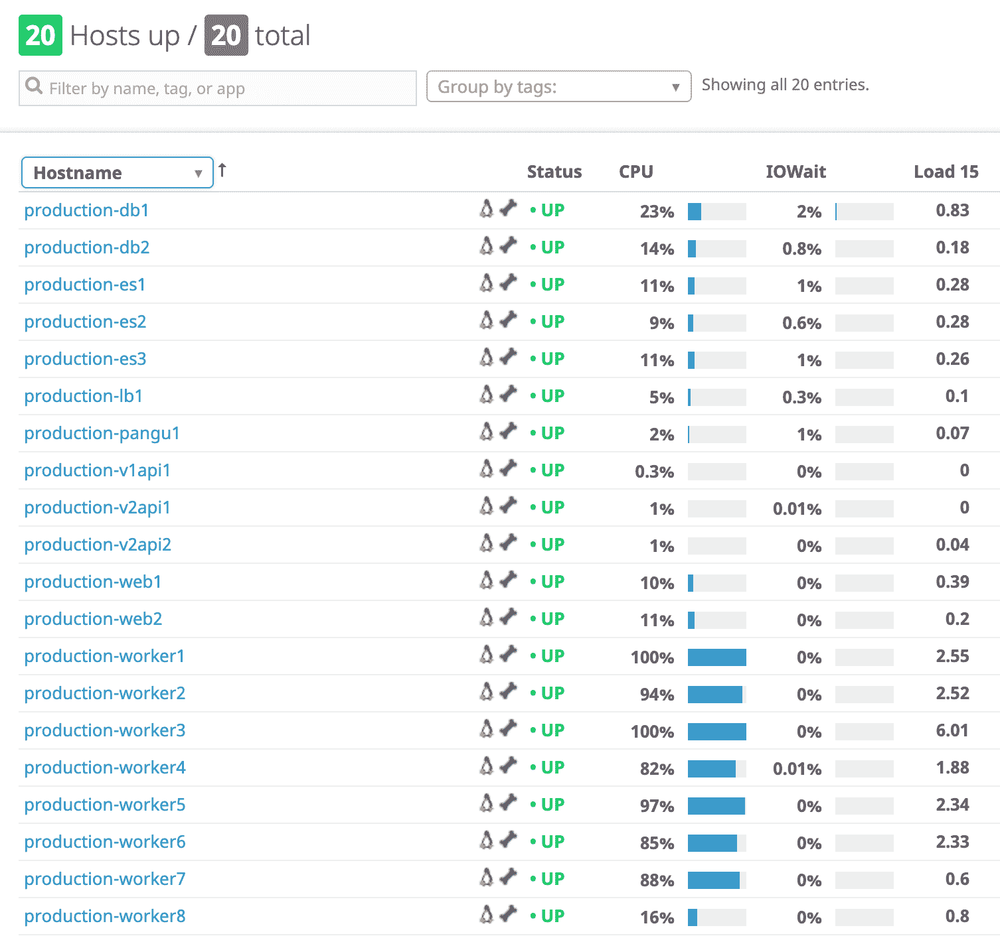
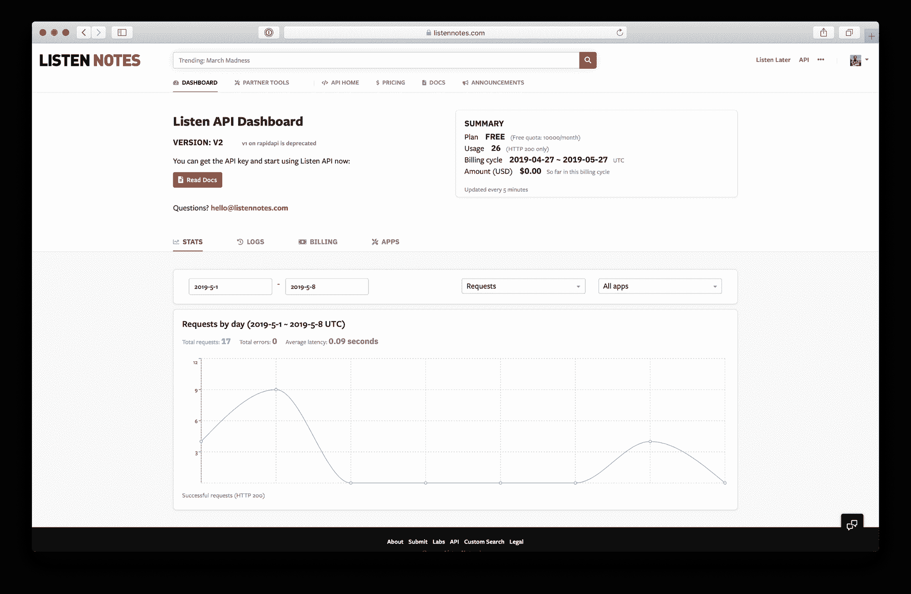
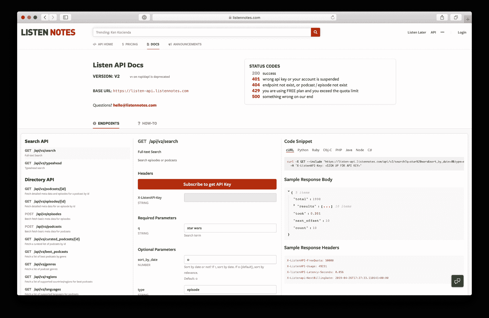
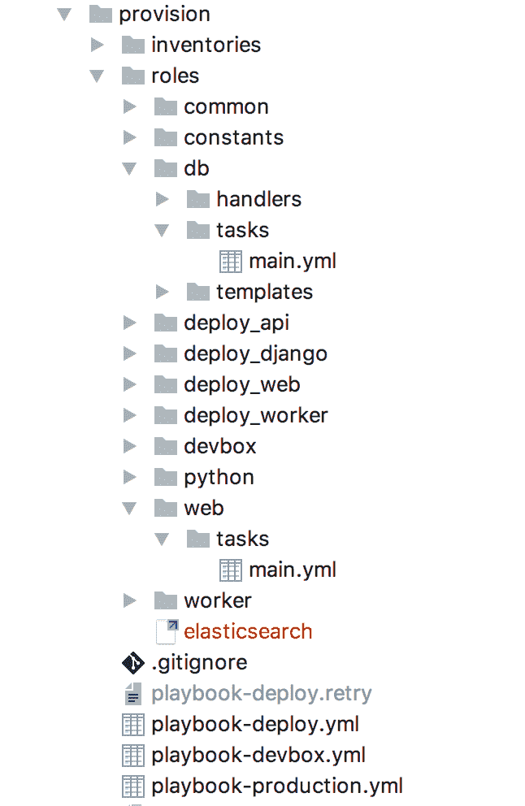
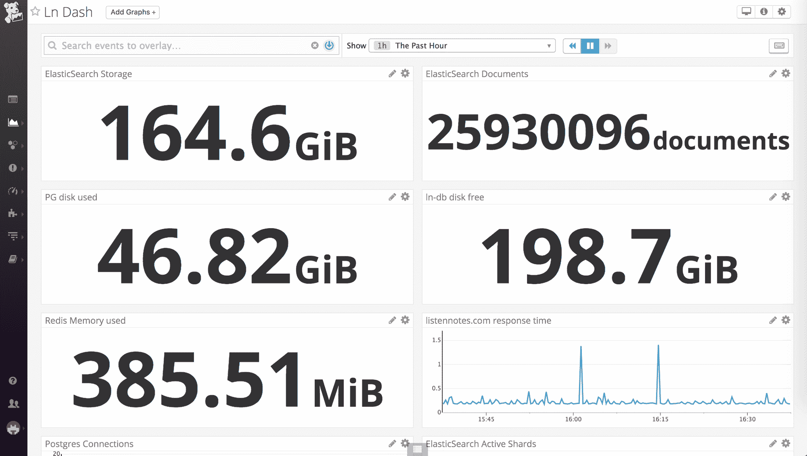
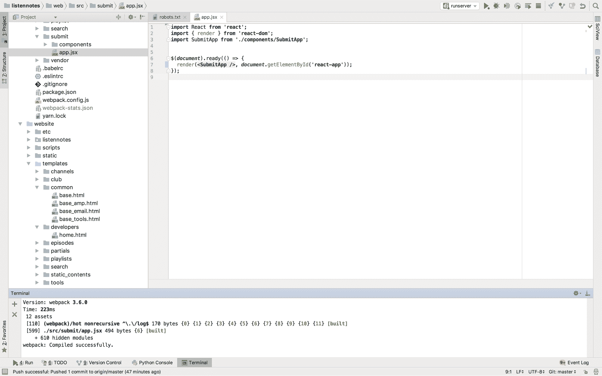

# 一个人的互联网公司背后的无聊技术

> 原文：<https://www.freecodecamp.org/news/the-boring-technology-behind-a-one-person-internet-company/>

[听笔记](https://www.listennotes.com/)是播客搜索引擎和数据库。《聆听笔记》背后的技术其实非常非常无聊。没有人工智能，没有深度学习，没有区块链。[“任何必须说我在用 AI 的人都不是在用真正的 AI”](https://www.youtube.com/watch?v=4sJY7BTIuPY):)

读完这篇文章后，你应该能够复制我为 Listen Notes 构建的东西，或者轻松地做一些类似的事情。你不需要雇佣很多工程师。请记住，当 Instagram 筹集了 5750 万美元并被脸书以 1B 的价格收购时，他们只有 13 名员工，并非所有人都是工程师。Instagram 的故事发生在 2012 年初。现在是 2019 年，比以往任何时候都更有可能用一个小小的工程团队——甚至一个人——来建造一些有意义的东西。

如果您还没有使用过听力笔记，现在就试试吧:

[https://www.listennotes.com/](https://www.listennotes.com/)

### 概观

让我们从这个 Listen Notes 项目的需求或特性开始。

“聆听笔记”为最终用户提供了两样东西:

*   播客听众的网站[ListenNotes.com](https://www.listennotes.com/)。它提供了一个搜索引擎，一个播客数据库，[稍后收听](https://www.listennotes.com/listen/?s=nav)播放列表，[收听剪辑](https://www.listennotes.com/clips/?s=nav)允许你剪切任何播客片段，以及[收听提醒](https://www.listennotes.com/alerts)当互联网上的新播客中提到特定关键词时通知你。
*   [播客搜索&开发者目录 API](https://www.listennotes.com/api/)。我们需要跟踪 API 的使用，从付费用户那里赚钱，做客户支持，等等。

我在 AWS 上运行一切。有 20 台生产服务器(截至 2019 年 5 月 5 日):

The servers that run Listen Notes

你可以很容易地从主机名中猜出每台服务器是做什么的。

*   ****生产网**** 为【ListenNotes.com】的[提供网络流量。](https://www.listennotes.com/)
*   ****生产-api**** 服务于 api 流量。我们运行两个版本的 API(截至 2019 年 5 月 4 日)，即 v1api(遗留版本)和 v2api(新版本)。
*   ****生产数据库**** 运行 PostgreSQL(主数据库和副本数据库)
*   ****production-es****runs**a elastic search 集群。**
*   ******制作工人**** 运行离线处理任务，使播客数据库始终保持最新，并提供一些神奇的东西(如搜索结果排名、剧集/播客推荐……)。**
*   ******production-lb**** 是负载均衡器。为了方便起见，我也在这个服务器上运行 Redis & RabbitMQ。我知道这并不理想。但我不是一个完美的人:)**
*   ******生产-盘古**** 是类似于生产的服务器，我有时会运行一次性脚本并测试变更。“[盘古](https://en.wikipedia.org/wiki/Pangu)是什么意思？**

**这些服务器中的大多数都可以水平扩展。这就是为什么我将它们命名为*生产级 1* 、*生产级 2*……将*生产级 3* 和*生产级 4* 加入舰队会非常容易。**

### **后端**

**整个后端都是用 Django / Python3 写的。选择的操作系统是 Ubuntu。**

**我使用 [uWSGI](https://uwsgi-docs.readthedocs.io/en/latest/) 来服务网络流量。我将 [NGINX](https://www.nginx.com/) 放在 uWSGI 进程的前面，它也充当负载平衡器。**

**主要的数据存储是 [PostgreSQL](https://www.postgresql.org/) ，这是我多年来积累的开发&运营经验——久经考验的技术好，晚上可以睡个好觉。 [Redis](https://redis.io/) 有多种用途(例如，缓存、统计等)。不难猜到 [Elasticsearch](https://www.elastic.co/) 用在了什么地方。是的，我使用 Elasticsearch 来索引播客&集并提供搜索查询，就像[最](https://medium.com/netflix-techblog/tagged/elasticsearch) [无聊的](https://engineeringblog.yelp.com/2017/06/moving-yelps-core-business-search-to-elasticsearch.html) [公司](https://eng.uber.com/tag/elasticsearch/)一样。**

**[芹菜](http://www.celeryproject.org/)用于离线加工。而 [Celery Beat](http://docs.celeryproject.org/en/latest/userguide/periodic-tasks.html) 是用于调度任务的，它类似于 Cron jobs，但更好一些。如果在未来，Listen Notes 获得了牵引力，而芹菜&节拍导致了一些缩放问题，我可能会转而使用我为前雇主做的两个项目: [ndkale](https://github.com/Nextdoor/ndkale) 和 [ndscheduler](https://github.com/Nextdoor/ndscheduler) 。**

**超级管理员用于每台服务器上的进程管理。**

**等等，Docker / Kubernetes / serverless 怎么样？没有。随着经验的积累，你知道什么时候不要过度设计。我实际上在 2014 年为我的前雇主做过一些早期码头工人的工作，这对一家中型十亿美元的创业公司来说是不错的，但对一个人的小型创业公司来说可能有点过头了。**

### **前端**

**web 前端主要用[React](https://reactjs.org/)+[Redux](https://redux.js.org/)+[web pack](https://webpack.js.org/)+[ES](https://en.wikipedia.org/wiki/ECMAScript)构建。这在当今相当普遍。当部署到生产中时，JS 包将被上传到[亚马逊 S3](https://aws.amazon.com/s3/) 并通过 [CloudFront](https://aws.amazon.com/cloudfront/) 提供服务。**

**在[ListenNotes.com](https://www.listennotes.com/)上，大多数网页都是一半服务器端渲染( [Django 模板](https://docs.djangoproject.com/en/2.0/topics/templates/)，一半客户端渲染( [React](https://reactjs.org/) )。服务器端呈现的部分提供了一个网页的样板，客户端呈现的部分基本上是一个交互式的 web app。但是有几个网页是完全通过服务器端呈现的，因为我的懒惰让事情变得完美&一些潜在的 SEO 好东西。**

#### **音频播放器**

**我在 ListenNotes.com 上使用了一个经过大量修改的版本 [react-media-player](https://github.com/souporserious/react-media-player) 来构建音频播放器，这个播放器在很多地方都有使用，包括 [Listen Notes 网站](https://www.listennotes.com/p/321dd0ce5b974079bd3fc8d65d132912/)、 [Twitter 嵌入式播放器](https://twitter.com/ListenHistoryFM/status/955913550605688832)，以及第三方网站上的嵌入式播放器:**

**

Embedded player on 3rd party websites** 

### **播客 API**

**我们向开发者提供简单可靠的播客 API。构建 API 类似于构建[网站](https://www.listennotes.com/)。我在后端使用相同的 Django/Python 栈，在前端使用 ReactJs(例如，API dashboard、documentation…)。**

**

Listen API dashboard** **

Listen API documentation** 

**对于 API，我们需要跟踪用户在当前计费周期中使用了多少请求，并在计费周期结束时收取$$$的费用。不难想象 Redis 在这里被大量使用:)**

### **DevOps**

#### **机器供应和代码部署**

**我使用 [Ansible](http://docs.ansible.com/) 进行机器供应。基本上，我写了一堆 yaml 文件来指定什么类型的服务器需要有什么配置文件&什么软件。我可以用所有正确的配置文件启动服务器&一键安装所有软件。以下是这些 Ansible yaml 文件的目录结构:**

**

I could’ve done a better job in naming things. But again, it’s good enough for now.** 

**我还使用 Ansible 将代码部署到生产环境中。基本上，我有一个运行在 macOS 上的包装脚本 *deploy.sh* :**

> ***。/deploy.sh 制作头网***

**deploy.sh 脚本有三个参数:**

*   ******环境**** :生产或暂存。**
*   ******版本列表注意到回购**** : HEAD 表示“刚部署最新版本”。如果指定了 git 提交的阿沙，那么它将部署特定版本的代码——这在我需要从糟糕的部署中回滚时特别有用。**
*   ******什么样的服务器**** : web，worker，api，或者 all。我不必一次部署到所有服务器上。有时我会修改 Javascript 代码，然后我只需要部署到 web 上，而不需要接触 api 或 worker。**

**部署过程大部分是由 Ansible yaml 文件编排的，当然，这非常简单:**

*   ******在我的 Macbook Pro**** 上，如果是为了部署到 web 服务器，那么构建 Javascript 捆绑包，上传到 S3。**
*   ******在目标服务器**** 上，git 将 listennotes repo 克隆到一个以时间戳命名的文件夹中，检查具体的版本，如果有的话，pip 安装新的 Python 依赖项。**
*   ******在目标服务器**** 上，将 symlink 切换到上述时间戳命名的文件夹，通过 supervisorctl 重启服务器。**

**如你所见，我不使用那些花哨的 CI 工具。只是一些非常简单的实际可行的东西。**

#### **监控和警报**

**我用 [Datadog](https://www.datadoghq.com/) 来监控&报警。我在一个简单的控制面板中获得了一些高级指标。无论我在这里做什么，都是为了在我摆弄生产服务器时增强我的信心。**

**

Datadog dashboard for Listen Notes, as of Dec 2017.** 

**我将[数据狗](https://www.datadoghq.com/)连接到 PagerDuty。如果出了问题，[传呼机](https://www.pagerduty.com/)会通过电话通知&短信给我发警报。**

**我还使用 [Rollbar](https://rollbar.com/) 来关注 Django 代码的健康状况，它将捕捉意外的异常，并通过电子邮件& Slack 通知我。**

**我经常使用 Slack。是的，这是一个一个人的公司，所以我不用 Slack 来和人类交流。我使用 Slack 来监控有趣的应用程序级事件。除了将 Datadog 和 Rollbar 与 Slack 集成之外，我还在 Listen Notes 后端代码中使用了 [Slack incoming webhooks](https://api.slack.com/incoming-webhooks) ，以便在用户注册或执行一些有趣的操作(例如，添加或删除内容)时通知我。这在科技公司是很常见的做法。当你阅读一些关于亚马逊或 PayPal 早期历史的书籍时，你会知道这两家公司都有类似的通知机制:每当用户注册时，都会有“叮”的一声通知办公室的每个人。**

**自 2017 年初推出以来，除了[这个](https://broadcast.listennotes.com/postmortem-on-apr-22-2018-outage-e5a87723d003)，Listen Notes 没有出现过任何大的中断(> 5 分钟)。我总是非常小心&实际操作这些东西。网络服务器被过度配置了，以防由于媒体事件或其他原因出现巨大的高峰。**

### **发展**

**我在旧金山的一个联合办公空间工作。有些人可能想知道为什么不在家或者在一些随机的咖啡店工作。嗯，我非常重视生产力，我愿意在生产力上投资。我不相信堆积时间有助于软件开发(或任何知识/创造性的工作)。很少有一天工作超过 8 小时的(抱歉， [996 人](https://www.nytimes.com/2019/04/29/technology/china-996-jack-ma.html))。我想让每一分钟都有价值。因此，一个漂亮的&相对昂贵的私人办公室是我所需要的:)与其优化花费更多的时间&省钱，我优化花费更少的时间&赚钱:)**

**

My office at WeWork** 

**我用的是 MacBook Pro。我在[流浪者](https://www.vagrantup.com/) + [VirtualBox](https://www.virtualbox.org/wiki/Downloads) 内部运行(几乎)相同的基础设施。我使用与上面描述的相同的 Ansible yaml 文件集来在 vagger 中提供开发环境。**

**我赞同整体回购哲学。所以有一个也是唯一一个 listennotes repo，包含 DevOps 脚本，前端&后端代码。这个 listennotes 回购作为 GitHub 私有回购托管。我负责主要分支的所有开发工作。我很少使用特征分支。**

**我通过使用 [PyCharm](https://www.jetbrains.com/pycharm/) 编写代码并运行开发服务器(Django runserver & web pack dev server)。是的，我知道，很无聊。毕竟，它不是 Visual Studio 代码或 Atom 或任何酷 ide。但是 PyCharm 对我来说很好。我是守旧派。**

**

My PyCharm** 

### **多方面的**

**我使用许多有用的工具和服务来构建作为产品和公司的 Listen Notes:**

*   **终端人员的 [iTerm2](https://www.iterm2.com/) 和 [tmux](https://github.com/tmux/tmux/wiki) 。**
*   **用于待办事项列表、维基、记笔记、设计文档的概念**
*   **用于@listennotes.com 电子邮件帐户、日历和其他谷歌服务的 G 套件。**
*   **[MailChimp](http://www.mailchimp.com/monkey-rewards/?utm_source=freemium_newsletter&utm_medium=email&utm_campaign=monkey_rewards&aid=da29e56f1e479faf6b4ef3f72&afl=1) 发送[月度邮件简讯](https://us16.campaign-archive.com/home/?u=da29e56f1e479faf6b4ef3f72&id=ba72067923)。**
*   **[亚马逊 SES](https://aws.amazon.com/ses/) 发送交易&一些营销邮件。**
*   **[兴致勃勃](https://gusto.com/r/wenbin)支付我自己和非高空作业的承包商。**
*   **[继续工作](https://www.upwork.com/)寻找承包商。**
*   **[谷歌广告经理](https://admanager.google.com/home/)管理直销广告并跟踪业绩。**
*   **[碳广告](https://www.carbonads.net/)和[购买广告](https://www.buysellads.com/)作为后备广告。**
*   **[Cloudflare](https://www.cloudflare.com/) 用于 DNS 管理、CDN 和防火墙。**
*   **[扎皮尔](https://zapier.com/)和[特雷罗](https://trello.com/)精简[播客采访](https://www.listennotes.com/interviews/)工作流程。**
*   **[介质](https://broadcast.listennotes.com/)为公司博客(显然)。**
*   **[Godaddy](https://www.godaddy.com/) 和 [Namecheap](https://www.namecheap.com/) 为域名。**
*   **[Stripe](https://stripe.com/) 用于从用户那里取钱(主要用于 [API](https://www.listennotes.com/api/) )。**
*   **[谷歌语音转文本 API](https://cloud.google.com/speech-to-text/) 转录剧集。**
*   **[Kaiser Permanente](https://healthy.kaiserpermanente.org/) 医疗保险。**
*   **[条纹图册](https://atlas.stripe.com/)纳入聆听笔记公司。**
*   **为资金筹集(SAFE)和雇佣非 Upwork 的承包商生成法律文件。**
*   **[Quickbooks](https://www.referquickbooks.com/s/Wenbin) 记账。**
*   **[1 密码](https://1password.com/)管理大量服务的登录凭证。**
*   **[Brex](http://brex.com/signup?rc=oPLQ0ZQ) 对于签帐卡，您可以获得 5000 美元的 AWS 积分，这些积分可以在 WeWork 或 Stripe Atlas 的 AWS 积分之上使用。**
*   **[Bonvoy 商务运通卡](http://refer.amex.us/WENBIFIUoH?XLINK=MYCP) —您可以在豪华酒店和航班上赢取万豪 Bonvoy 积分。这是旅行的最佳信用卡积分:)**
*   **[资金一星火](https://www.capitalone.com/small-business-bank/)用于支票账户。**

### **保持冷静，继续…**

**如你所见，我们生活在一个开创公司的美好时代。有许多现成的工具和服务可以节省我们的时间和金钱，并提高我们的生产力。使用简单而乏味的技术，由一个小团队(或只有一个人)来创造对世界有用的东西，这比以往任何时候都更有可能。**

**随着时间的推移，公司变得越来越小。你不需要雇佣大量的全职员工。你可以雇佣服务(SaaS)和随需应变的承包商来完成工作。**

**大多数时候，建造和运输物品的最大障碍是过度思考。如果这个，如果那个。小子，你一点都不重要。每个人都在忙自己的生活。没有人关心你和你建造的东西，直到你证明你值得别人关注。即使你搞砸了最初的产品发布，也很少有人会注意到。[从大处着眼，从小处着手，快速行动](https://hackernoon.com/think-big-start-small-act-fast-6fdab1f771ea)。使用枯燥的技术，从简单的(甚至是丑陋的)事情开始，这是完全可以的，只要你实际解决了问题。**

> **你的过度思考是我的机会。**
> 
> **— Wenbin ??? (@wenbinf) [January 8, 2019](https://twitter.com/wenbinf/status/1082725746160746496?ref_src=twsrc%5Etfw)**