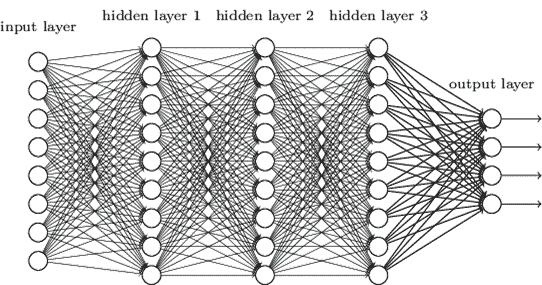
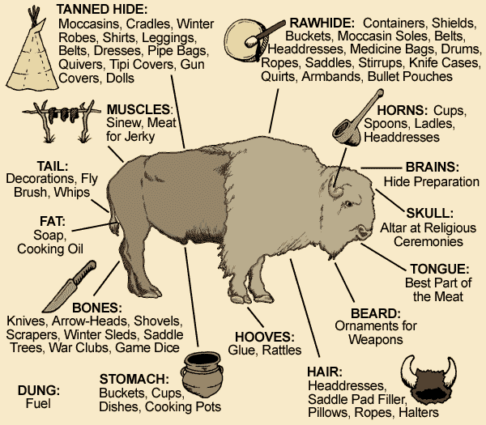
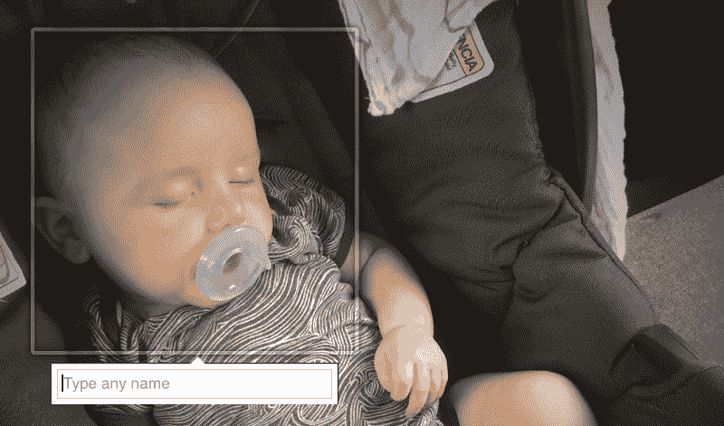
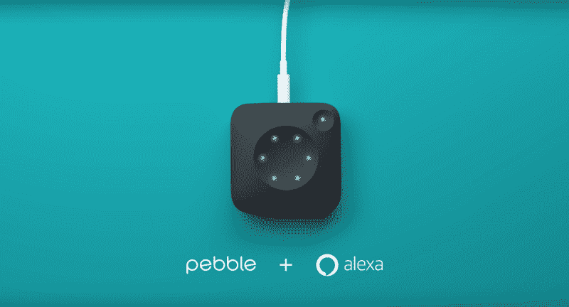

# 机器学习的商业含义

> 原文：<https://www.freecodecamp.org/news/the-business-implications-of-machine-learning-11480b99184d/>

作者德鲁·布鲁尼格

# 机器学习的商业含义

#### 这不是关于它能做什么，而是它的优先化的效果

随着流行语变得无处不在，它们变得更容易被忽视。

我们精心打造了这种防御机制，目的是好的。与其关注一周的风味，不如关注眼前的事物。CRISPR 可能会改变我们的生活，但是知道它是如何工作的对你没有帮助。虚拟现实可以吃掉所有的媒体，但是 T2 的硬件要求让它在很多年后才能被普遍使用。

但是请:**不要忽视机器学习**。

是的，机器学习将帮助我们构建精彩的应用程序。但这并不是我认为你应该关注它的原因。

你应该关注机器学习，因为它已经被推动技术行业的公司优先考虑，即谷歌、脸书和亚马逊。机器学习的本质——它是如何工作的，它的优点是什么，以及它是如何交付的——确保了这种战略优先次序将在机器学习的价值释放出哪怕一点点之前就显著改变科技行业。

为了理解机器学习的影响，让我们首先探索它的本质。

(我准备把深度学习和机器学习互换使用。原谅我，书呆子。)

#### 机器学习让一切程序化

机器学习或深度学习的目标是让一切都程序化。[正如我在一月份写的](https://medium.com/@dbreunig/discussions-we-will-have-in-2016-abc1e1d1c4e6#.owe1fdwzn):

> 简单来说，深度学习就是人类在计算机规模上的识别。创建算法的第一步是为程序提供大量的数据，这些数据是由人类组织的，比如带标签的照片。然后，该程序分析原始数据，并记录与人类组织的数据相关的模式。然后程序在野外寻找这些已知的模式。这就是脸书建议朋友在照片和谷歌照片搜索中添加标签的方式。

> 到目前为止，人们使用的大多数深度学习应用本质上都是玩具:[更智能的相册](http://www.theverge.com/a/sundars-google/google-photos-google-io-2015)和[更好的语音识别](http://www.androidheadlines.com/2015/08/google-turns-to-deep-learning-to-fix-speech-recognition.html)。这些早期的应用是宽容的。如果一个学习算法漏掉了一张脸或者强迫你编辑一个棘手的单词，那也没关系([通常是](http://mashable.com/2015/07/01/google-photos-black-people-gorillas/#Ghnc81lHCGql))。但随着我们的投资继续，这些算法变得更加可靠，我们将看到它们部署在更有趣的环境中，有更有趣的用例。

这里的要点是，机器学习允许公司构建更好的应用程序，与人们创造的东西进行交互:图片、语音、文本和其他*杂乱的东西*。这使得公司可以开发理解*美国的软件。*自从[Eniac](https://en.wikipedia.org/wiki/ENIAC)问世以来，用户界面问题就一直困扰着人们，解决这些问题的潜力就在那里。主要的 UI 进步往往会开启计算的主要时代。

鼠标和图形界面使计算机变得触手可及，成为家用物品。

触摸界面使电脑成为普通的日常工具。

由机器学习驱动的界面将使计算无处不在。(最终)

但是有一个问题:

Someone had to file all of these.

#### 机器学习的好坏取决于它的训练数据

要制作一个机器学习模型，你需要三样东西，按重要性排序:

1.  **训练数据:**已经被人类标记、分类或以其他方式分类的数据。
2.  **软件:**通过评估训练数据建立机器学习模型的软件库。
3.  **硬件:**运行软件计算的 CPU 和 GPU。

硬件很容易获得。[租](https://aws.amazon.com)[it](https://azure.microsoft.com/en-us/)[买 it](https://blogs.nvidia.com/blog/2016/05/06/geforce-gtx-1080/) ，随便。

软件更容易获得！如果你是租来的，你可能已经不小心[做过了](https://aws.amazon.com/machine-learning/) [已经](https://azure.microsoft.com/en-us/services/machine-learning/)了。如果没有，[几乎所有的都是免费的](https://en.wikipedia.org/wiki/Comparison_of_deep_learning_software)。

现在你只需要训练数据。很多很多！

**好运**。

在我们进入你到底有多糟糕之前，让我们首先理解为什么你首先需要这么多的训练数据。

我们的深度和机器学习软件不错。比以前更好！但是要想做得好，需要*吨*的训练数据来产生好的结果。这一点怎么强调都不为过:你制作的模型的质量，与软件获取的训练数据的数量和质量直接相关。除非我们有更好的软件，否则我们无法从小型数据集建立良好的模型。(我说的“小”是指，而不是巨大的*。)*

*不幸的是，更好的软件不会在一夜之间出现。虽然大多数软件越来越好，但随着开发人员一周接一周地消灭错误，机器学习可能会以一种[间断平衡](https://en.wikipedia.org/wiki/Punctuated_equilibrium)的方式前进:以几个来之不易的大飞跃。*

*原因是深度学习软件几乎不可能调试，因为*我们并不完全了解它是如何工作的*。对我来说，这是机器学习最奇怪的地方。我们真的不知道是什么让它滴答作响。我们无法系统调试，只能猜测和核对。*

*皮特·沃顿，机器学习的杰出倡导者，[解释了](https://petewarden.com/2014/06/10/why-is-everyone-so-excited-about-deep-learning/):*

> *尽管 Krizhevsky 方法赢得了 2012 年的 Imagenet 竞赛，但没有人能够完全理解它为什么如此有效，哪些设计决策和参数是最重要的。这是一个在实践中可行的奇妙的试错解决方案，但我们离理解它在理论上如何工作还有很长的路要走。这意味着我们可以期待看到速度和结果的改善，因为研究人员对它为什么有效以及如何优化有了更好的理解。正如我的一个朋友所说的，[整整一代的研究生正在为这种努力而牺牲，但是他们这样做是因为潜在的回报是如此之大。](https://twitter.com/dfarmer/status/474609077671034880)*

*在我们理解深度学习如何工作之前，我们需要用大量的训练数据来弥补它的不足。*

*训练数据是机器学习的命脉。*

*那么我们如何得到它呢？*

*

Platform companies have yet to so efficiently utilize their users.* 

#### *学习使用水牛(或使用者)的每一部分*

*如果计算机要理解混乱的人类事物，它们需要由混乱的人类来教。有道理。但是当我们记起我们需要多少数据来制作我们的模型时，我们面临着一个挑战:*我们到哪里去找成千上万愿意花业余时间来创建我们的训练数据的人呢？**

*如果你说，“我会雇用他们，”我有一些坏消息。在这种规模下，付钱给他们几乎是不可能的。*

*如果你说，“我来骗他们”，你就变得更热情了。*

*写互联网的人经常重复的一句话是:“如果你不付钱，你就是产品。”这些作家正在评论广告支持的产品，如脸书、谷歌、Tumblr、SnapChat 和几乎所有其他在线产品，这些产品包装你的注意力，并将其出售给广告商。但是他们的重复也同样适用于机器学习。*

*免费服务的用户是那些训练计算机来开发更好的产品和服务的人。“免费”部分至关重要，因为它允许大量用户使用我们的数据。*

*所有这一切让我想起了一句古老的谚语:美洲原住民利用水牛的每一部分。在线服务正在学习如何利用用户的更多部分。我们的注意力创造了他们的广告，我们的知识推动了他们的深度学习模型。*

*因此，获得足够的训练数据的技巧是双重的。您需要:*

1.  *吸引一堆人。*
2.  *说服他们创建你的训练数据。*

*这是汤姆索亚和尖桩栅栏，只是乘以几个亿。*

*

“Help us help you.”* 

#### ***互惠数据应用(RDAs)的兴起***

*一种新的应用类别，或应用功能，已经出现，以方便您的围栏绘画。这些应用程序旨在刺激培训数据的创建，并交付由捕获的数据驱动的产品。人们得到更好的应用，公司得到更好的数据。*

*这种互惠数据应用程序(简称 RDA)最明显的例子是脸书照片。*

*脸书照片旨在提示观众轻松快捷地标记照片中的人物。上传图片后，清晰的行动号召将你的朋友和家人的脸框起来。标记为您提供了明显的好处，既有利于以后的搜索，也有利于提醒照片中被标记的人。标签能吸引注意力并引发对话，这(并非巧合)是人们使用脸书的两个主要原因。*

*同时，所有这些标记创建了一个巨大的训练数据池，可用于训练机器学习模型。有了更好的模型，就有了更好的标签建议和其他功能。多亏了这个 RDA，[脸书可能拥有世界上最好的人类图像识别模型之一](http://www.wired.com/2015/06/facebook-can-recognize-even-dont-show-face/)。*

*谷歌搜索是另一个 RDA。您的搜索和选择为谷歌提供了训练数据，这有助于使其搜索更好。*

*像他们的其他产品一样，谷歌搜索和脸书照片展示了 RDAs 如何产生巨大的网络效应。用一个 app 的人越多，产生的数据就越多，app 变得越好，用 app 的人就越多……*

*在赢家通吃的市场中，网络效应是风险投资公司所需的引擎。以前，硅谷默认的网络效应方法是社交/聊天(你的朋友在哪里，你就去哪里)或市场(卖家去哪里，买家就去哪里)。这就是为什么几乎每一个非市场风险投资支持的应用程序或服务都在分享或交流功能上做文章——即使它在应用程序中没有意义。*

*RDA 是一种创造网络效果的新方法，现在才被人们所理解。随着对其商业价值认识的增长，RDAs 有望在整个领域传播开来。*

*RDAs 的传播将是机器学习的第一个重大商业影响。不仅因为它们会转移资源，还因为 RDA 的质量和要求会影响部署它们的硬件和软件。*

*以下是互惠数据应用程序的品质:*

1.  *应用程序必须联网，最好是一直联网。否则，它无法将捕获的数据发送回国内。*
2.  *几乎所有的计算都在设备外进行。大部分计算是创建模型，这需要访问所有用户创建的海量数据集。因此，模型构建不能在设备上进行。将新数据与计算模型进行比较(例如，识别图片中的对象或人，或者识别口语短语)的计算成本很低。*
3.  *好的应用需要大量的受众。更多的人等于更多的工人创建培训数据。*
4.  *好的应用需要大量的使用。使用应用程序的时间越长，意味着每个用户都有更多的机会来创建训练数据。*
5.  *好的应用程序鼓励创建准确的数据。如果一个 app 的设计方式是经常出现编码错误，那么数据会比较弱。应用程序设计需要让用户能够快速输入准确的数据。*

*那么我们如何建立一个好的呢？*

#### *构建有价值的 RDA 的途径*

*RDA 的数据值可以表示为上面后三点的乘积。*

*例如，如果这些用户每天花几个小时以可靠的方式编写数据，那么你的安装基础可能相对薄弱(参见:Tinder，他正坐在一组令人惊叹的数据上，以确定照片的吸引力)。或者，你可能有一个庞大的安装群，只是偶尔编码数据(脸书，其用户通常在上传照片时标记照片)。*

*这里的挑战是质量#3 和#4 是一个零和游戏(就像广告，水牛的另一部分)。如果世界上 50%的人花 20%的时间在脸书，那就没有多少氧气可供你工作了。即使你获得了几亿用户，并借用了他们每天 2 分钟的时间，脸书的数据收集将超过你通过许多许多因素获得的任何收益。因为数据是不断收集的，RDAs 的值不应该被认为是绝对的，而应该被认为是一个*速度*。*

**但是*，如果在上述场景中，你能够从你的用户那里收集脸书无法通过设计收集的训练数据，你就不会被超越，尽管你的规模较小。小公司和其他新贵如果想要竞争，就必须追求独特的数据集。*

*我们可以看到构建有价值的交互数据应用程序的三条途径:*

1.  ***获得大量用户:**创建吸引大量用户的引人注目的应用程序。这是硅谷熟知并喜爱的模式。建立一些颠覆性的东西，获得牵引力，拼命投资做大。在某种程度上，这条路径是偶然的 RDA 路径。一旦变大，调整你的应用程序以更好地收集训练数据仅仅是一种使你从用户那里获得的价值多样化的方式。这条路非常艰难，需要大量的运气，然后是大量的金钱。另外，这有点像第二十二条军规。一旦你这么大了，广告就可能成为唾手可得的果实。你可能不应该选择这条路。*
2.  ***获得大量时间:**创建一个应用程序，说服一定数量的人花大量时间使用它。在许多情况下，这些种类的应用程序或服务将被被动地使用。想象一下捕捉驾驶员输入的导航应用程序或始终在线的数字助理。环境应用程序总是可以观察或提示用户，提高他们产生数据的速度。*
3.  ***收集独特数据:**创建一个 app，收集别人无法收集的训练数据。在这里，你的应用在发布时不需要很大，但必须有一个愿景，你收集的独特数据将如何用于构建完全独特的功能。这些新功能需要足够引人注目，以推动安装和使用的增加，从而在大型竞争对手改变其应用程序的设计并进入市场之前，保持您的 RDA 足够高的速度。这就是你可能超越谷歌和脸书的方法。*

*您可能已经注意到，路径 2 给出了一些可能无法在智能手机上运行的示例。好眼力！通过将计算带入新的环境，我们可以创建更持久的 RDA，增加使用它们的时间。更好的是，这些新的上下文带来了对新类型数据的访问，这通常会将路径 2 合并到路径 3 中。*

*令人欣慰的是，由于 RDAs 的几乎所有功能价值都是由处理海量数据集的远程服务器产生的，单个设备几乎没有什么可做的。他们的大脑在别处，所以他们能适应更多的地方。*

*

There’s a reason they don’t mention the Pebble’s CPU speed. It does most of its thinking elsewhere.* 

#### *机器学习如何影响硬件*

*由于大多数想法发生在服务器场中，提供 RDA 的设备可能是低功耗的。他们的 CPU 可能很慢，因为比较输入和预先计算的模型需要很少的计算。较慢的 CPU 可以很小，因为它们需要较少的晶体管和较少的散热。更慢的 CPU 需要更少的电力，这意味着电池可以更小(或者保持相同的大小，将它们的容量用在其他地方，如蜂窝连接上)。另外:它们很便宜！*

*所有这一切都意味着能够提供 RDAs 的设备将会疯狂地扩散。如果我们能在一个产品中安装一台带 wifi 的廉价电脑，并从该环境中获取良好的数据，我们很可能会制造它。具备 RDA 能力的计算机将被注入到每一个地方:你的车里、你的手腕上、你的浏览器里、通过你的便携式扬声器、你的电视里，等等。*

*这方面最纯粹的例子就是[卵石核](https://blog.getpebble.com/2016/06/02/ks3u03/)。Core 定位为跑步跟踪和音乐设备，实际上更像是一个通用的计算加密狗。很便宜，69 美元起。它有一个低功耗的 CPU，WiFi，蜂窝连接，蓝牙，一点存储空间，一个耳机插孔，两个按钮和一个电池。就是这样。它的界面是语音控制的，而且——对我们的讨论来说最重要的——集成了亚马逊的 Alexa。Alexa 是 RDA。*

*通过将 Alexa 所需的计算移到服务器端，亚马逊几乎可以在任何地方部署 Alexa。Alexa 现在通过蓝牙扬声器、 [HDMI 棒](http://www.theverge.com/2016/2/3/10904996/amazon-alexa-original-fire-tv-announcement)以及任何核心来交付。自动整合是不可避免的。*

*亚马逊和其他公司受到激励，使他们的分销多样化，以增加他们的普遍性和你花在应用上的时间。此外，新的集成带来了新的数据，实现了更好的模型。*

*重要的是，优先考虑机器学习的公司*没有*被激励开发最强大的设备。强大的消费类设备由于其昂贵和新颖的特点，其销售受到限制，限制了其对 RDA 的价值，因为 RDA 需要大量的用户。预计设备计算能力将停滞不前，因为行业专注于多样化、无处不在的廉价设备，而不是功能强大的设备。*

#### *机器学习的商业含义*

*概括地说，这就是机器和深度学习投资可能会如何影响科技行业:*

1.  *赢家将赢得更多:像脸书和谷歌这样的现有大玩家拥有巨大的优势。他们有大量的用户，大量的时间，以及装满训练数据和资金的战争箱。与这些公司正面竞争，创造与它们相同的训练数据，是徒劳的。*
2.  ***成功的创业公司将创造独特的训练数据:**挑战者可以通过追求训练数据的新前沿来否定谷歌和脸书的大部分优势。这可能涉及移动应用程序，但通常会涉及新的硬件，以将 RDA 带到新的环境中。成功的挑战者可能会建立这样一个滩头阵地，并在开发模型之前被收购。对于这些公司来说，困难的部分将是从开发产生大量独特的、良好的训练数据的产品过渡到构建独特的 RDA 来产生和保持速度。*
3.  ***RDA 是一种新的网络效应模式:**随着 RDA 的出现和成熟，公司和投资者将更好地理解 RDA 如何建立具有网络效应的商业模式。一旦有了明确的例子，机器学习初创公司也会出现同样的市场业务(“X 的优步”)和社交公司(“X 的脸书”)爆炸式增长。*
4.  ***机器学习将加速物联网:**硬件能力将停滞不前，但形状因素将多样化。计算机会殖民每一个能适合传感器和网络连接的环境，以搜索训练数据。*