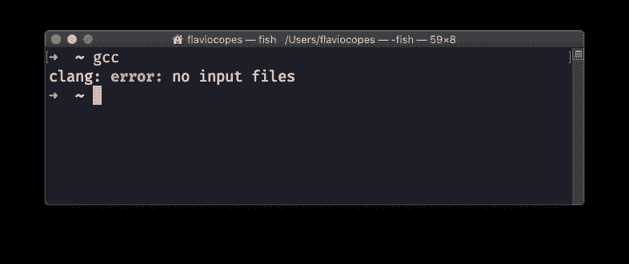
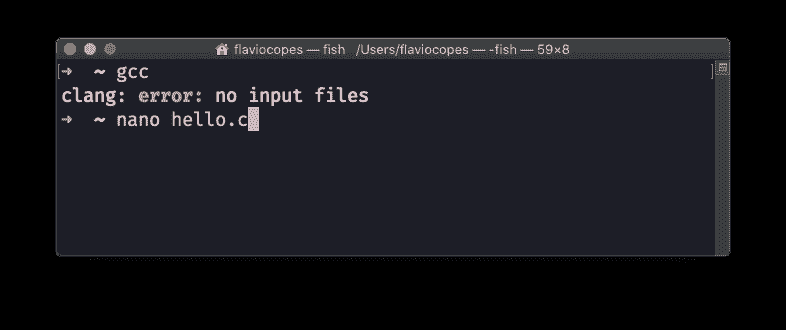
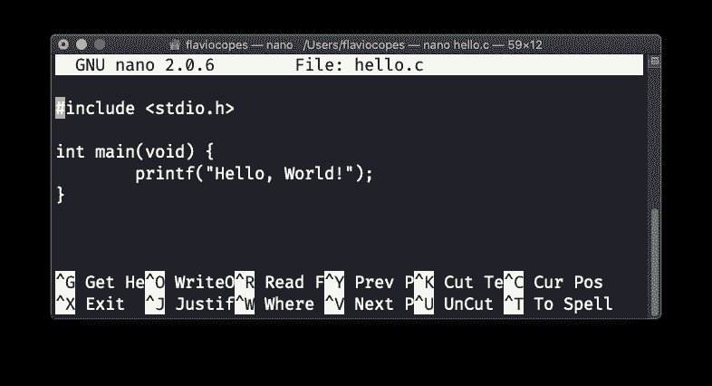
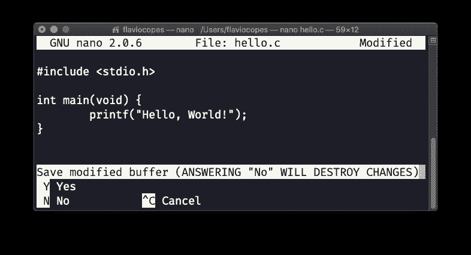
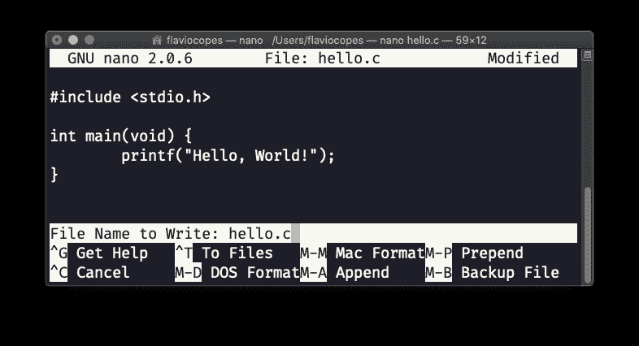
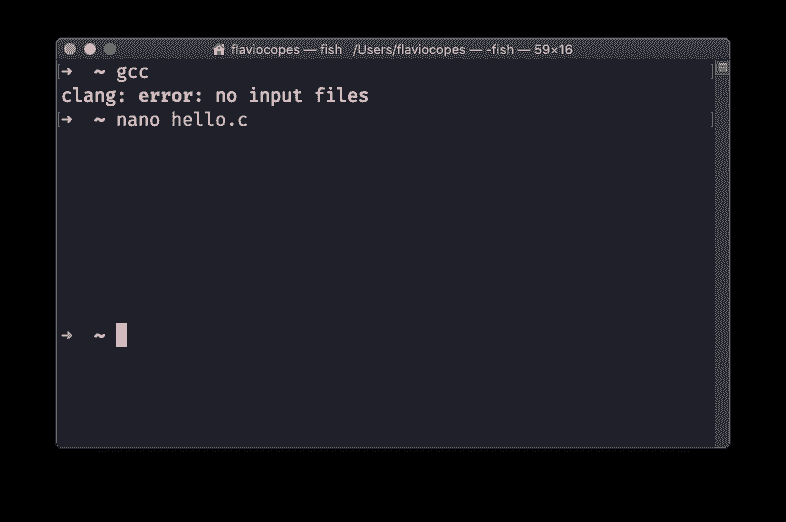
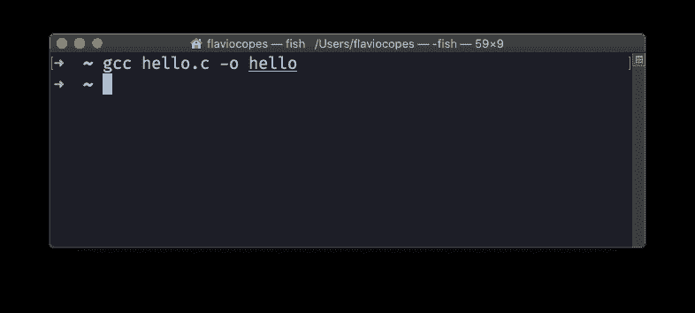
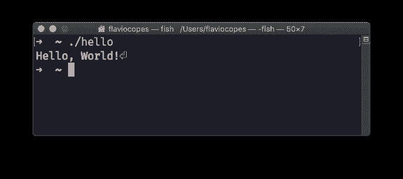
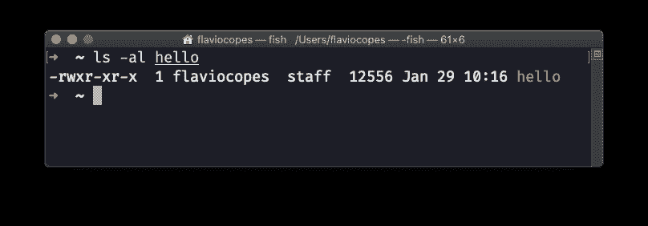

# C 初学者手册:在几个小时内学会 C 编程语言基础

> 原文：<https://www.freecodecamp.org/news/the-c-beginners-handbook/>

这本 C 初学者手册遵循 80/20 法则。你将在 20%的时间里学会 80%的 C 语言。

这种方法会让你对这门语言有一个全面的了解。

本手册并不试图涵盖与 c 语言相关的所有内容，而是关注语言的核心，试图简化更复杂的主题。

并且注意:[你可以在这里](https://flaviocopes.com/page/c-handbook/)获得这本 C 初学者手册的 PDF 和 ePub 版本。

尽情享受吧！

## 目录

1.  [C 语言简介](#introduction-to-c)
2.  [变量和类型](#variables-and-types)
3.  [常数](#constants)
4.  [操作员](#operators)
5.  [条件句](#conditionals)
6.  [循环](#loops)
7.  [数组](#arrays)
8.  [琴弦](#strings)
9.  [指针](#pointers)
10.  [功能](#functions)
11.  [输入和输出](#input-and-output)
12.  [变量范围](#variables-scope)
13.  [静态变量](#static-variables)
14.  [全局变量](#global-variables)
15.  [类型定义](#type-definitions)
16.  [枚举类型](#enumerated-types)
17.  [结构](#structures)
18.  [命令行参数](#command-line-parameters)
19.  [头文件](#header-files)
20.  [预处理器](#the-preprocessor)
21.  [结论](#conclusion)

## C 语言简介

c 可能是最广为人知的编程语言。它被用作世界各地计算机科学课程的参考语言，它可能是人们在学校与 Python 和 Java 一起学习最多的语言。

我记得它是我的第二种编程语言，仅次于 Pascal。

c 不仅仅是学生用来学习编程的。它不是一种学术语言。我要说它不是最简单的语言，因为 C 是一种相当低级的编程语言。

今天，C 语言被广泛应用于嵌入式设备中，它为大多数使用 Linux 构建的互联网服务器提供动力。Linux 内核是用 C 语言构建的，这也意味着 C 语言是所有 Android 设备的核心。我们可以说 C 代码运行了整个世界的很大一部分。就现在。相当了不起。

当它被创建时，C 被认为是一种高级语言，因为它可以跨机器移植。今天，我们似乎理所当然地认为，我们可以在 Windows 或 Linux 上运行在 Mac 上编写的程序，也许使用 Node.js 或 Python。

曾几何时，根本不是这样。C 带来的是一种易于实现的语言，它的编译器可以很容易地移植到不同的机器上。

我说编译器:C 是编译型编程语言，像 Go，Java，Swift 或者 Rust。其他流行的编程语言如 Python、Ruby 或 JavaScript 都被解释。区别是一致的:编译语言生成一个可以直接执行和分发的二进制文件。

c 不是垃圾回收的。这意味着我们必须自己管理内存。这是一项复杂的任务，需要花很多精力来防止错误，但这也是 C 语言非常适合为像 Arduino 这样的嵌入式设备编写程序的原因。

c 并没有隐藏机器的复杂性和功能。一旦你知道你能做什么，你就有很大的力量。

我现在要介绍第一个 C 程序，我们称之为“你好，世界！”

hello.c

```
#include <stdio.h>

int main(void) {
    printf("Hello, World!");
} 
```

我们来描述一下程序源代码:我们先导入`stdio`库(名字代表标准输入输出库)。

这个库让我们可以访问输入/输出函数。

c 语言本质上是一种非常小的语言，任何不属于核心的东西都是由库提供的。其中一些库是由普通程序员构建的，并提供给其他人使用。编译器内置了其他一些库。像`stdio`等。

`stdio`是提供`printf()`函数的库。

这个函数被包装成一个`main()`函数。`main()`函数是任何 C 程序的入口点。

但是函数到底是什么呢？

函数是接受一个或多个参数并返回单个值的例程。

在`main()`的情况下，函数没有参数，返回一个整数。我们使用关键字`void`作为参数，使用关键字`int`作为返回值。

该函数有一个主体，用花括号括起来。在主体内部，我们有函数执行操作所需的所有代码。

如您所见，`printf()`函数的编写方式有所不同。它没有定义返回值，我们传递一个字符串，用双引号括起来。我们没有指定参数的类型。

这是因为这是一个函数调用。在`stdio`库中的某个地方，`printf`被定义为

```
int printf(const char *format, ...); 
```

你现在不需要明白这是什么意思，总之就是这个定义。而当我们调用`printf("Hello, World!");`时，那就是函数运行的地方。

我们上面定义的`main()`函数:

```
#include <stdio.h>

int main(void) {
    printf("Hello, World!");
} 
```

将在程序执行时由操作系统运行。

我们如何执行一个 C 程序？

如前所述，C 是一种编译语言。要运行这个程序，我们必须先编译它。任何 Linux 或 macOS 电脑都已经内置了 C 编译器。对于 Windows，您可以使用 Linux 的 Windows 子系统(WSL)。

在任何情况下，当您打开终端窗口时，您可以键入`gcc`，该命令应该会返回一个错误，说明您没有指定任何文件:



那很好。意味着 C 编译器在那里，我们可以开始使用它了。

现在将上面的程序输入到一个`hello.c`文件中。您可以使用任何编辑器，但是为了简单起见，我将在命令行中使用`nano`编辑器:



键入程序:



现在按`ctrl-X`退出:



按`y`键确认，然后按 enter 键确认文件名:



好了，我们现在应该回到终点站了:



现在打字

```
gcc hello.c -o hello 
```

这个程序应该不会给你任何错误:



但是它应该已经生成了一个`hello`可执行文件。现在打字

```
./hello 
```

要运行它:



我在程序名前添加了`./`,告诉终端该命令在当前文件夹中

厉害！

现在如果你调用`ls -al hello`，你可以看到程序只有 12KB 大小:



这是 C 的优点之一:它高度优化，这也是它对资源非常有限的嵌入式设备如此有用的原因之一。

## 变量和类型

c 是一种静态类型语言。

这意味着任何变量都有关联的类型，并且这种类型在编译时是已知的。

这与您在 Python、JavaScript、PHP 和其他解释型语言中处理变量的方式非常不同。

当你在 C 中创建一个变量时，你必须在声明中指定变量的类型。

在这个例子中，我们用类型`int`初始化变量`age`:

```
int age; 
```

变量名可以包含任何大写或小写字母，可以包含数字和下划线字符，但不能以数字开头。`AGE`和`Age10`是有效的变量名，`1age`不是。

也可以在声明时初始化变量，指定初始值:

```
int age = 37; 
```

一旦你声明了一个变量，你就可以在你的程序代码中使用它。您可以随时更改它的值，例如使用`=`操作符，就像在`age = 100;`中一样(假设新值是相同类型的)。

在这种情况下:

```
#include <stdio.h>

int main(void) {
    int age = 0;
    age = 37.2;
    printf("%u", age);
} 
```

编译器将在编译时发出警告，并将十进制数转换为整数值。

C 内置数据类型有`int`、`char`、`short`、`long`、`float`、`double`、`long double`。让我们了解更多。

### 整数

c 提供了以下类型来定义整数值:

*   `char`
*   `int`
*   `short`
*   `long`

大多数时候，你可能会使用一个`int`来存储一个整数。但是在某些情况下，你可能想从其他三个选项中选择一个。

`char`类型通常用于存储 ASCII 图表的字母，但是它也可以用于保存从`-128`到`127`的小整数。它至少需要 1 个字节。

`int`至少需要 2 个字节。`short`至少需要 2 个字节。`long`至少需要 4 个字节。

如您所见，我们无法保证不同环境下的值相同。我们只有一个指示。问题是每种数据类型中可以存储的确切数量取决于实现和体系结构。

我们保证`short`不会比`int`长。我们保证`long`不会比`int`短。

ANSI C spec 标准确定了每种类型的最小值，有了它，我们至少可以知道我们可以期望拥有的最小值是多少。

如果你在 Arduino 上编程 C，不同的主板会有不同的限制。

在 Arduino Uno 板上，`int`存储一个 2 字节的值，范围从`-32,768`到`32,767`。在 Arduino MKR 1010 上，`int`存储一个 4 字节的值，范围从`-2,147,483,648`到`2,147,483,647`。差别很大。

在所有 Arduino 板卡上，`short`存储一个 2 字节的值，范围从`-32,768`到`32,767`。`long`存储 4 个字节，范围从`-2,147,483,648`到`2,147,483,647`。

### 无符号整数

对于上述所有数据类型，我们可以在前面加上`unsigned`以从 0 开始，而不是负数。这在许多情况下可能是有意义的。

*   `unsigned char`的范围将从`0`到至少`255`
*   `unsigned int`的范围将从`0`到至少`65,535`
*   `unsigned short`的范围将从`0`到至少`65,535`
*   `unsigned long`的范围将从`0`到至少`4,294,967,295`

### 溢出的问题

考虑到所有这些限制，可能会出现一个问题:我们如何确保我们的数量不超过限制？如果我们真的超过了极限会发生什么？

如果你有一个 255 的`unsigned int`数，你增加它，你将得到 256 作为回报。不出所料。如果你有一个 255 的`unsigned char`数，你增加它，你将得到 0 的回报。它从可能的初始值开始复位。

如果你有一个 255 的`unsigned char`数字，你给它加上 10，你将得到数字`9`:

```
#include <stdio.h>

int main(void) {
  unsigned char j = 255;
  j = j + 10;
  printf("%u", j); /* 9 */
} 
```

如果没有带符号的值，则行为是未定义的。它会给你一个很大的数字，这个数字可以变化，就像这样:

```
#include <stdio.h>

int main(void) {
  char j = 127;
  j = j + 10;
  printf("%u", j); /* 4294967177 */
} 
```

换句话说，C 不能防止你超越类型的限制。你需要自己处理这件事。

### 声明错误类型时的警告

当您声明变量并用错误的值初始化它时，`gcc`编译器(您可能正在使用的那个)应该警告您:

```
#include <stdio.h>

int main(void) {
  char j = 1000;
} 
```

```
hello.c:4:11: warning: implicit conversion 
  from 'int' to
      'char' changes value from 1000 to -24
      [-Wconstant-conversion]
        char j = 1000;
             ~   ^~~~
1 warning generated. 
```

它还在直接分配中警告您:

```
#include <stdio.h>

int main(void) {
  char j;
  j = 1000;
} 
```

但如果您使用例如`+=`来增加数量，则不会出现这种情况:

```
#include <stdio.h>

int main(void) {
  char j = 0;
  j += 1000;
} 
```

### 浮点数

浮点类型可以表示比整数大得多的一组值，还可以表示分数，这是整数做不到的。

使用浮点数，我们将数字表示为十进制数乘以 10 的幂。

您可能会看到浮点数被写成

*   `1.29e-3`
*   `-2.3e+5`

以及其他看似怪异的方式。

以下类型:

*   `float`
*   `double`
*   `long double`

用于表示带小数点的数字(浮点类型)。都可以表示正数和负数。

任何 c 实现的最低要求是`float`可以表示 10^-37 和 10^+37 之间的范围，并且通常使用 32 位来实现。`double`可以代表更大的一组数字。`long double`可以容纳更多的数字。

与整数值一样，确切的数字取决于实现方式。

在现代 Mac 上，`float`用 32 位表示，精度为 24 个有效位。8 位用于编码指数。

`double`号用 64 位表示，精度为 53 个有效位。11 位用于编码指数。

类型`long double`用 80 位表示，具有 64 个有效位的精度。15 位用于编码指数。

在您的特定计算机上，如何确定类型的具体大小？你可以写一个程序来实现:

```
#include <stdio.h>

int main(void) {
  printf("char size: %lu bytes\n", sizeof(char));
  printf("int size: %lu bytes\n", sizeof(int));
  printf("short size: %lu bytes\n", sizeof(short));
  printf("long size: %lu bytes\n", sizeof(long));
  printf("float size: %lu bytes\n", sizeof(float));
  printf("double size: %lu bytes\n", 
    sizeof(double));
  printf("long double size: %lu bytes\n", 
    sizeof(long double));
} 
```

在我的系统中，一台现代的 Mac，它打印:

```
char size: 1 bytes
int size: 4 bytes
short size: 2 bytes
long size: 8 bytes
float size: 4 bytes
double size: 8 bytes
long double size: 16 bytes 
```

## 常数

现在让我们来谈谈常数。

常量的声明类似于变量，除了它被加上了关键字`const`，并且您总是需要指定一个值。

像这样:

```
const int age = 37; 
```

这是完全有效的 C 语言，尽管通常将常量声明为大写，如下所示:

```
const int AGE = 37; 
```

这只是一个约定，但是它可以在阅读或编写 C 程序时给你很大的帮助，因为它提高了可读性。大写的名字表示常量，小写的名字表示变量。

常量名称遵循与变量名相同的规则:可以包含任何大写或小写字母，可以包含数字和下划线字符，但不能以数字开头。`AGE`和`Age10`是有效的变量名，`1AGE`不是。

定义常数的另一种方法是使用以下语法:

```
#define AGE 37 
```

这种情况下，不需要添加类型，也不需要`=`等号，省略了末尾的分号。

C 编译器将在编译时从指定的值推断类型。

## 经营者

c 为我们提供了各种各样的操作符，我们可以用它们来操作数据。

特别是，我们可以识别不同的操作员组:

*   算术运算符
*   比较运算符
*   逻辑运算符
*   复合赋值运算符
*   按位运算符
*   指针运算符
*   结构运算符
*   杂项运算符

在这一节中，我将用两个假想变量`a`和`b`作为例子来详细说明它们。

为了简单起见，我将按位操作符、结构操作符和指针操作符排除在这个列表之外

### 算术运算符

在这个宏组中，我将把二元运算符和一元运算符分开。

二元运算符使用两个操作数:

| 操作员 | 名字 | 例子 |
| --- | --- | --- |
| `=` | 分配 | `a = b` |
| `+` | 添加 | `a + b` |
| `-` | 减法 | `a - b` |
| `*` | 增加 | `a * b` |
| `/` | 分开 | `a / b` |
| `%` | 以…为模 | `a % b` |

一元运算符只接受一个操作数:

| 操作员 | 名字 | 例子 |
| --- | --- | --- |
| `+` | 一元加号 | `+a` |
| `-` | 一元减操作 | `-a` |
| `++` | 增量 | `a++`或`++a` |
| `--` | 减量 | `a--`或`--a` |

`a++`和`++a`的区别在于`a++`在使用完`a`变量后递增。`++a`在使用`a`变量之前对其进行递增。

例如:

```
int a = 2;
int b;
b = a++ /* b is 2, a is 3 */
b = ++a /* b is 4, a is 4 */ 
```

这同样适用于减量运算符。

### 比较运算符

| 操作员 | 名字 | 例子 |
| --- | --- | --- |
| `==` | 相等运算符 | `a == b` |
| `!=` | 不等运算符 | `a != b` |
| `>` | 大于 | `a > b` |
| `<` | 不到 | `a < b` |
| `>=` | 大于或等于 | `a >= b` |
| `<=` | 小于或等于 | `a <= b` |

### 逻辑运算符

*   `!`否(例如:`!a`)
*   `&&`和(例如:`a && b`)
*   `||`或(例如:`a || b`)

这些运算符在处理布尔值时非常有用。

### 复合赋值运算符

这些运算符对于执行赋值操作并同时执行算术运算非常有用:

| 操作员 | 名字 | 例子 |
| --- | --- | --- |
| `+=` | 加法赋值 | `a += b` |
| `-=` | 减法赋值 | `a -= b` |
| `*=` | 乘法赋值 | `a *= b` |
| `/=` | 分部分配 | `a /= b` |
| `%=` | 模数分配 | `a %= b` |

### 三元运算符

三元运算符是 C 语言中唯一使用三个操作数的运算符，它是表达条件的一种简单方式。

看起来是这样的:

```
<condition> ? <expression> : <expression> 
```

示例:

```
a ? b : c 
```

如果`a`评估为`true`，则执行`b`语句，否则`c`为。

三元运算符在功能上与 if/else 条件运算符相同，只是它的表达式更短，并且可以内联到表达式中。

### 尺寸

`sizeof`运算符返回您传递的操作数的大小。你可以传递一个变量，甚至一个类型。

示例用法:

```
#include <stdio.h>

int main(void) {
  int age = 37;
  printf("%ld\n", sizeof(age));
  printf("%ld", sizeof(int));
} 
```

### 运算符优先级

对于所有这些操作符(还有更多，我在本文中没有涉及到，包括按位操作符、结构操作符和指针操作符)，我们在一个表达式中一起使用它们时必须小心。

假设我们有这样的操作:

```
int a = 2;
int b = 4;
int c = b + a * a / b - a; 
```

`c`值多少？我们在乘法和除法之前执行加法吗？

有一套规则可以帮助我们解决这个难题。

按照从低到高的顺序，我们有:

*   `=`赋值运算符
*   `+`和`-` **二元**运算符
*   `*`和`/`运算符
*   `+`和`-`一元运算符

运算符还有一个结合性规则，除了一元运算符和赋值之外，它总是从左到右。

在:

```
int c = b + a * a / b - a; 
```

我们先执行`a * a / b`，由于是从左到右，我们可以分为`a * a`和结果`/ b` : `2 * 2 = 4`，`4 / 4 = 1`。

然后我们可以执行加法和减法:4 + 1 - 2。`c`的值为`3`。

然而，在所有情况下，我想确保您意识到可以使用括号来使任何类似的表达更容易阅读和理解。

括号比其他任何东西都有更高的优先级。

上面的示例表达式可以重写为:

```
int c = b + ((a * a) / b) - a; 
```

我们也不用考虑那么多。

## 条件式

任何编程语言都为程序员提供了进行选择的能力。

我们想在某些情况下做 X，在另一些情况下做 Y。

我们希望检查数据，并根据数据的状态做出选择。

c 为我们提供了两种方法。

第一个是带有`else`助手的`if`语句，第二个是`switch`语句。

### 如果

在`if`语句中，您可以检查条件是否为真，然后执行花括号中提供的代码块:

```
int a = 1;

if (a == 1) {
  /* do something */
} 
```

如果原来的条件为假，您可以附加一个`else`块来执行不同的块:

```
int a = 1;

if (a == 2) {
  /* do something */
} else {
  /* do something else */
} 
```

当心一个常见的错误来源——在比较中总是使用比较操作符`==`,而不是赋值操作符`=`。如果您不这样做，`if`条件检查将始终为真，除非参数为`0`，例如如果您这样做:

```
int a = 0;

if (a = 0) {
  /* never invoked */
} 
```

为什么会这样？因为条件检查会寻找一个布尔结果(比较的结果)，而`0`号总是等于一个假值。其他都是真的，包括负数。

通过将多个`if`语句堆叠在一起，可以有多个`else`块:

```
int a = 1;

if (a == 2) {
  /* do something */
} else if (a == 1) {
  /* do something else */
} else {
  /* do something else again */
} 
```

### 转换

如果您需要执行太多的 if / else / if 块来执行检查，可能是因为您需要检查变量的确切值，那么`switch`会非常有用。

您可以提供一个变量作为条件，并为您期望的每个值提供一系列的`case`入口点:

```
int a = 1;

switch (a) {
  case 0:
    /* do something */
    break;
  case 1:
    /* do something else */
    break;
  case 2:
    /* do something else */
    break;
} 
```

我们需要在每个案例的末尾添加一个`break`关键字，以避免当前一个案例结束时执行下一个案例。这种“级联”效应在一些创造性的方面是有用的。

您可以在末尾添加一个“包罗万象”的案例，标记为`default`:

```
int a = 1;

switch (a) {
  case 0:
    /* do something */
    break;
  case 1:
    /* do something else */
    break;
  case 2:
    /* do something else */
    break;
  default:
    /* handle all the other cases */
    break;
} 
```

## 环

c 为我们提供了三种执行循环的方法: **for 循环**、 **while 循环**和 **do while 循环**。它们都允许你迭代数组，但是有一些不同。下面我们来详细看看。

### 对于循环

第一种也可能是最常见的执行循环的方式是 **for loops** 。

使用`for`关键字，我们可以预先定义循环的*规则*，然后提供将要重复执行的块。

像这样:

```
for (int i = 0; i <= 10; i++) {
  /* instructions to be repeated */
} 
```

`(int i = 0; i <= 10; i++)`块包含循环细节的 3 个部分:

*   初始条件(`int i = 0`)
*   测试(`i <= 10`)
*   增量(`i++`)

我们首先定义一个循环变量，在这里命名为`i`。`i`是用于循环的常见变量名，与`j`一起用于嵌套循环(一个循环在另一个循环中)。这只是一个惯例。

变量初始化为 0 值，第一次迭代完成。然后，它按照递增部分所说的那样递增(在本例中为`i++`，递增 1)，所有的循环重复进行，直到到达数字 10。

在循环主块中，我们可以访问变量`i`来知道我们在哪个迭代中。这个程序应该打印`0 1 2 3 4 5 5 6 7 8 9 10`:

```
for (int i = 0; i <= 10; i++) {
  /* instructions to be repeated */
  printf("%u ", i);
} 
```

循环也可以从一个较高的数字开始，然后转到一个较低的数字，如下所示:

```
for (int i = 10; i > 0; i--) {
  /* instructions to be repeated */
} 
```

您也可以将循环变量递增 2 或另一个值:

```
for (int i = 0; i < 1000; i = i + 30) {
  /* instructions to be repeated */
} 
```

### While 循环

**While 循环**比`for`循环更容易编写，因为它需要你做更多的工作。

不像在`for`循环中那样，在开始循环时预先定义所有的循环数据，而是使用`while`来检查一个条件:

```
while (i < 10) {

} 
```

这里假设`i`已经定义并初始化了一个值。

这个循环将是一个无限循环，除非你在循环中的某个点增加变量`i`。无限循环是不好的，因为它会阻塞程序，不允许其他事情发生。

这是“正确的”while 循环所需要的:

```
int i = 0;

while (i < 10) {
  /* do something */

  i++;
} 
```

有一个例外，我们一分钟后会看到。之前，我先介绍一下`do while`。

### Do while 循环

虽然循环很棒，但是有时你需要做一件特殊的事情:你想总是执行一个块，然后*也许*重复它。

这是使用`do while`关键字完成的。在某种程度上，它非常类似于`while`循环，但略有不同:

```
int i = 0;

do {
  /* do something */

  i++;
} while (i < 10); 
```

不管底部的条件检查如何，包含`/* do something */`注释的块总是至少执行一次。

然后，直到`i`小于 10，我们将重复该块。

### 使用 break 中断循环

在所有的 C 循环中，我们都有一种方法可以在任何时间点立即中断循环，不管循环的条件是什么。

这是使用`break`关键字完成的。

这在许多情况下是有用的。您可能希望检查变量的值，例如:

```
for (int i = 0; i <= 10; i++) {
  if (i == 4 && someVariable == 10) {
    break;
  }
} 
```

对于`while`循环(以及`do while`循环)来说，拥有这种跳出循环的选项特别有趣，因为我们可以创建看似无限的循环，当一个条件出现时就结束了。您可以在循环块中定义它:

```
int i = 0;
while (1) {
  /* do something */

  i++;
  if (i == 10) break;
} 
```

这种循环在 c 语言中很常见。

## 数组

数组是存储多个值的变量。

数组中的每一个值，在 C 中，都必须有**相同类型的**。这意味着您将拥有`int`值数组、`double`值数组等等。

您可以像这样定义一组`int`值:

```
int prices[5]; 
```

您必须始终指定数组的大小。c 不提供开箱即用的动态数组(为此，您必须使用类似链表的数据结构)。

您可以使用常数来定义大小:

```
const int SIZE = 5;
int prices[SIZE]; 
```

您可以在定义时初始化数组，如下所示:

```
int prices[5] = { 1, 2, 3, 4, 5 }; 
```

但是您也可以在定义后赋值，方式如下:

```
int prices[5];

prices[0] = 1;
prices[1] = 2;
prices[2] = 3;
prices[3] = 4;
prices[4] = 5; 
```

或者，更实际的是，使用一个循环:

```
int prices[5];

for (int i = 0; i < 5; i++) {
  prices[i] = i + 1;
} 
```

通过在数组变量名后使用方括号，添加一个整数来确定索引值，可以引用数组中的一个项。像这样:

```
prices[0]; /* array item value: 1 */
prices[1]; /* array item value: 2 */ 
```

数组索引从 0 开始，所以一个有 5 个元素的数组，像上面的`prices`数组，元素的范围从`prices[0]`到`prices[4]`。

关于 C 数组有趣的事情是数组的所有元素都是顺序存储的，一个接一个。这在高级编程语言中并不常见。

另一件有趣的事情是:数组的变量名，在上面的例子中是指向数组第一个元素的指针。因此，它可以像普通指针一样使用。

很快会有更多关于指针的内容。

## 用线串

在 C 语言中，字符串是一种特殊的数组:字符串是由`char`值组成的数组:

```
char name[7]; 
```

我在介绍类型时介绍了`char`类型，但简言之，它通常用于存储 ASCII 图表的字母。

可以像初始化普通数组一样初始化字符串:

```
char name[7] = { "F", "l", "a", "v", "i", "o" }; 
```

或者更方便地使用字符串文字(也称为字符串常量)，即用双引号括起来的字符序列:

```
char name[7] = "Flavio"; 
```

您可以使用`%s`通过`printf()`打印字符串:

```
printf("%s", name); 
```

你注意到“Flavio”有 6 个字符长，但是我定义了一个长度为 7 的数组吗？为什么？这是因为字符串中的最后一个字符必须是一个`0`值，字符串终止符，我们必须为它腾出空间。

记住这一点很重要，尤其是在操作字符串的时候。

说到操作字符串，C 提供了一个重要的标准库:`string.h`。

这个库是必不可少的，因为它抽象了许多使用字符串的低级细节，并为我们提供了一组有用的函数。

您可以在程序中加载库，方法是在顶部添加:

```
#include <string.h> 
```

一旦你做到了这一点，你就可以访问:

*   `strcpy()`将一个字符串复制到另一个字符串上
*   `strcat()`将一个字符串追加到另一个字符串
*   `strcmp()`比较两个字符串是否相等
*   `strncmp()`比较两个字符串的第一个`n`字符
*   `strlen()`计算字符串的长度

还有很多很多。

## 两颗北极指极星

在我看来，指针是 C 语言中最令人困惑/最具挑战性的部分之一。尤其是如果您是编程新手，而且如果您来自更高级的编程语言，如 Python 或 JavaScript。

在这一节中，我想尽可能用最简单而不简单的方式来介绍它们。

指针是包含变量的内存块的地址。

当您像这样声明一个整数时:

```
int age = 37; 
```

我们可以使用`&`操作符来获取变量在内存中的地址值:

```
printf("%p", &age); /* 0x7ffeef7dcb9c */ 
```

我使用了`printf()`中指定的`%p`格式来打印地址值。

我们可以将地址赋给一个变量:

```
int *address = &age; 
```

在声明中使用`int *address`，我们不是声明一个整数变量，而是声明一个指向整数的**指针。**

我们可以使用指针操作符`*`来获取地址所指向的变量的值:

```
int age = 37;
int *address = &age;
printf("%u", *address); /* 37 */ 
```

这一次我们再次使用指针操作符，但是因为这一次它不是一个声明，它意味着“指针所指向的变量的值”。

在这个例子中，我们声明了一个`age`变量，并使用一个指针来初始化这个值:

```
int age;
int *address = &age;
*address = 37;
printf("%u", *address); 
```

当使用 C 时，你会发现很多东西都是建立在这个简单的概念之上的。因此，通过自己运行上面的示例，确保您对它有所熟悉。

指针是一个很好的机会，因为它们迫使我们思考内存地址和数据是如何组织的。

数组就是一个例子。声明数组时:

```
int prices[3] = { 5, 4, 3 }; 
```

`prices`变量实际上是指向数组第一项的指针。在这种情况下，您可以使用这个`printf()`函数获得第一项的值:

```
printf("%u", *prices); /* 5 */ 
```

有趣的是，我们可以通过在`prices`指针上加 1 来获得第二项:

```
printf("%u", *(prices + 1)); /* 4 */ 
```

对于所有其他值也是如此。

我们还可以做许多很好的字符串操作，因为字符串是幕后的数组。

我们还有更多应用，包括传递对象或函数的引用，以避免消耗更多资源来复制它。

## 功能

函数是我们将代码组织成子程序的方式，我们可以:

1.  给…命名
2.  当我们需要他们的时候打电话

从你的第一个节目开始，一句“你好，世界！”，您可以立即使用 C 函数:

```
#include <stdio.h>

int main(void) {
    printf("Hello, World!");
} 
```

函数是一个非常重要的函数，因为它是 C 程序的入口点。

这是另一个功能:

```
void doSomething(int value) {
    printf("%u", value);
} 
```

功能有 4 个重要方面:

1.  它们有一个名字，所以我们可以在以后调用它们
2.  它们指定一个返回值
3.  他们可以有争论
4.  他们有一个身体，裹在花括号里

函数体是我们调用函数时执行的一组指令。

如果函数没有返回值，可以在函数名前使用关键字`void`。否则，您需要指定函数返回值的类型(`int`表示整数，`float`表示浮点值，`const char *`表示字符串，等等)。

一个函数不能返回多个值。

函数可以有参数。它们是可选的。如果没有，我们在括号内插入`void`，就像这样:

```
void doSomething(void) {
   /* ... */
} 
```

在这种情况下，当我们调用这个函数时，我们将在括号中不带任何内容地调用它:

```
doSomething(); 
```

如果我们有一个参数，我们指定参数的类型和名称，如下所示:

```
void doSomething(int value) {
   /* ... */
} 
```

当我们调用这个函数时，我们将在括号中传递这个参数，就像这样:

```
doSomething(3); 
```

我们可以有多个参数，如果是这样，我们在声明和调用中用逗号分隔它们:

```
void doSomething(int value1, int value2) {
   /* ... */
}

doSomething(3, 4); 
```

参数由**复制**传递。这意味着如果你修改`value1`，它的值会被本地修改。在调用中传递的函数外部的值不会改变。

如果您将一个**指针**作为参数传递，您可以修改该变量值，因为您现在可以使用它的内存地址直接访问它。

您不能为参数定义默认值。C++可以做到这一点(Arduino 语言程序也可以)，但 C 不能。

请确保在调用该函数之前定义了它，否则编译器会发出警告和错误:

```
➜  ~ gcc hello.c -o hello; ./hello
hello.c:13:3: warning: implicit declaration of
      function 'doSomething' is invalid in C99
      [-Wimplicit-function-declaration]
  doSomething(3, 4);
  ^
hello.c:17:6: error: conflicting types for
      'doSomething'
void doSomething(int value1, char value2) {
     ^
hello.c:13:3: note: previous implicit declaration
      is here
  doSomething(3, 4);
  ^
1 warning and 1 error generated. 
```

你得到的警告是关于排序的，我已经提到过了。

错误是关于另一件事，相关的。因为 C 在调用前看不到函数声明，所以它必须做出假设。并且它承担了返回`int`的函数。然而，该函数返回`void`，因此出现错误。

如果将函数定义更改为:

```
int doSomething(int value1, int value2) {
  printf("%d %d\n", value1, value2);
  return 1;
} 
```

您只会得到警告，而不是错误:

```
➜  ~ gcc hello.c -o hello; ./hello
hello.c:14:3: warning: implicit declaration of
      function 'doSomething' is invalid in C99
      [-Wimplicit-function-declaration]
  doSomething(3, 4);
  ^
1 warning generated. 
```

在任何情况下，确保在使用函数之前声明它。要么将函数上移，要么在头文件中添加函数原型。

在函数内部，可以声明变量。

```
void doSomething(int value) {
  int doubleValue = value * 2;
} 
```

变量在函数调用时创建，在函数结束时销毁。从外面看不到。

在函数内部，你可以调用函数本身。这被称为**递归**，它提供了特殊的机会。

## 输入和输出

C 是一种小型语言，C 的“核心”不包括任何输入/输出(I/O)功能。

当然，这不是 C 语言独有的。语言核心不知道 I/O 是很常见的。

在 C 的情况下，输入/输出由 C 标准库通过一组在`stdio.h`头文件中定义的函数提供给我们。

您可以使用以下方式导入此库:

```
#include <stdio.h> 
```

在你的 C 文件上面。

该库为我们提供了许多其他功能:

*   `printf()`
*   `scanf()`
*   `sscanf()`
*   `fgets()`
*   `fprintf()`

在描述这些函数做什么之前，我想花一点时间来谈谈 **I/O 流**。

在 C 语言中，我们有 3 种 I/O 流:

*   `stdin`(标准输入)
*   `stdout`(标准输出)
*   `stderr`(标准误差)

对于 I/O 函数，我们总是使用流。流是可以表示设备或文件的高级接口。从 C 的角度来看，我们从文件读取和从命令行读取没有任何区别:在任何情况下都是 I/O 流。

这是需要记住的一件事。

有些函数被设计成与特定的流一起工作，比如`printf()`，我们用它将字符打印到`stdout`。使用其更通用的对等物`fprintf()`，我们可以指定写入哪个流。

既然开始说`printf()`，那现在就介绍一下吧。

`printf()`是你学习 C 编程时最先使用的函数之一。

最简单的用法是，向它传递一个字符串文字:

```
printf("hey!"); 
```

程序会将字符串的内容打印到屏幕上。

您可以打印变量的值。但是这有点棘手，因为你需要添加一个特殊的字符，一个占位符，它根据变量的类型而变化。例如，我们使用`%d`表示有符号的十进制整数:

```
int age = 37;

printf("My age is %d", age); 
```

我们可以使用逗号打印多个变量:

```
int age_yesterday = 37;
int age_today = 36;

printf("Yesterday my age was %d and today is %d", age_yesterday, age_today); 
```

还有其他格式说明符，如`%d`:

*   `%c`对于一个 char 来说
*   `%s`对于一个 char 来说
*   `%f`为浮点数
*   `%p`为指针

还有很多。

我们可以在`printf()`中使用转义字符，比如`\n`，我们可以用它让输出创建一个新行。

### `scanf()`

`printf()`用作输出函数。我现在想引入一个输入函数，所以我们可以说我们可以做所有的 I/O 事情:`scanf()`。

该函数用于从命令行获取运行程序的用户的值。

我们必须首先定义一个变量来保存我们从输入中得到的值:

```
int age; 
```

然后我们用两个参数调用`scanf()`:变量的格式(类型)和变量的地址:

```
scanf("%d", &age); 
```

如果我们想得到一个字符串作为输入，请记住字符串名称是指向第一个字符的指针，所以它前面不需要有`&`字符:

```
char name[20];
scanf("%s", name); 
```

这里有一个同时使用`printf()`和`scanf()`的小程序:

```
#include <stdio.h>

int main(void) {
  char name[20];
  printf("Enter your name: ");
  scanf("%s", name);
  printf("you entered %s", name);
} 
```

## 变量作用域

当你在 C 程序中定义一个变量时，取决于你在哪里声明它，它将有一个不同的**范围**。

这意味着它将在一些地方可用，但在其他地方不可用。

职位决定了两种类型的变量:

*   **全局变量**
*   **局部变量**

区别在于:在函数内部声明的变量是局部变量，如下所示:

```
int main(void) {
  int age = 37;
} 
```

局部变量只能从函数内部访问，当函数结束时，它们就不存在了。它们被从存储器中清除(有一些例外)。

在函数外部定义的变量是全局变量，如下例所示:

```
int age = 37;

int main(void) {
  /* ... */
} 
```

全局变量可以从程序的任何函数中访问，并且在程序的整个执行过程中都可以使用，直到程序结束。

我提到过，函数结束后，局部变量不再可用。

原因是默认情况下，局部变量是在**栈**上声明的，除非你使用指针在堆上显式地分配它们。但是你必须自己管理内存。

## 静态变量

在函数内部，可以使用关键字`static`初始化静态变量**。**

**我说“在函数内部”是因为全局变量在默认情况下是静态的，所以没有必要添加关键字。**

**什么是静态变量？如果没有指定初始值，静态变量被初始化为 0，并且在函数调用中保持该值。**

**考虑这个函数:**

```
`int incrementAge() {
  int age = 0;
  age++;
  return age;
}` 
```

**如果我们调用`incrementAge()`一次，我们将得到`1`作为返回值。如果我们调用它不止一次，我们将总是返回 1，因为`age`是一个局部变量，它在每次函数调用时都会被重新初始化为`0`。**

**如果我们将函数改为:**

```
`int incrementAge() {
  static int age = 0;
  age++;
  return age;
}` 
```

**现在每次我们调用这个函数，我们都会得到一个递增的值:**

```
`printf("%d\n", incrementAge());
printf("%d\n", incrementAge());
printf("%d\n", incrementAge());` 
```

**会给我们**

```
`1
2
3` 
```

**我们也可以省略在`static int age = 0;`中将`age`初始化为 0，只写`static int age;`，因为静态变量在创建时自动设置为 0。**

**我们也可以有静态数组。在这种情况下，数组中的每一项都被初始化为 0:**

```
`int incrementAge() {
  static int ages[3];
  ages[0]++;
  return ages[0];
}` 
```

## **全局变量**

**在这一节中，我想更多地谈谈**全局变量和局部变量**之间的区别。**

**一个**局部变量**被定义在一个函数内部，并且它只在那个函数内部可用。**

**像这样:**

```
`#include <stdio.h>

int main(void) {
  char j = 0;
  j += 10;
  printf("%u", j); //10
}` 
```

**`j`在`main`功能之外的任何地方都不可用。**

**一个**全局变量**被定义在任何函数之外，就像这样:**

```
`#include <stdio.h>

char i = 0;

int main(void) {
  i += 10;
  printf("%u", i); //10
}` 
```

**程序中的任何函数都可以访问全局变量。访问不限于读取值:变量可以由任何函数更新。**

**因此，全局变量是我们在函数间共享相同数据的一种方式。**

**局部变量的主要区别在于，一旦函数结束，分配给变量的内存就会被释放。**

**只有当程序结束时，全局变量才会被释放。**

## **类型定义**

**C 中的`typedef`关键字允许你定义新的类型。**

**从内置的 C 类型开始，我们可以使用以下语法创建自己的类型:**

```
`typedef existingtype NEWTYPE` 
```

**按照惯例，我们创建的新类型通常是大写的。**

**这使它更容易分辨它，并立即认出它是铅字。**

**例如，我们可以定义一个新的`NUMBER`类型，它是一个`int`:**

```
`typedef int NUMBER` 
```

**一旦你这样做了，你就可以定义新的`NUMBER`变量:**

```
`NUMBER one = 1;` 
```

**现在你可能会问:为什么？为什么不用内置类型`int`代替呢？**

**好吧，`typedef`在与两个东西配对时变得非常有用:枚举类型和结构。**

## **枚举类型**

**使用`typedef`和`enum`关键字，我们可以定义一个可以有一个值或另一个值的类型。**

**这是关键字`typedef`最重要的用途之一。**

**这是枚举类型的语法:**

```
`typedef enum {
  //...values
} TYPENAME;` 
```

**按照惯例，我们创建的枚举类型通常是大写的。**

**这里有一个简单的例子:**

```
`typedef enum {
  true,
  false
} BOOLEAN;` 
```

**c 带有一个`bool`类型，所以这个例子并不实际，但是你明白了。**

**另一个例子是定义工作日:**

```
`typedef enum {
  monday,  
  tuesday,
  wednesday,
  thursday,
  friday,
  saturday,
  sunday
} WEEKDAY;` 
```

**下面是一个使用这个枚举类型的简单程序:**

```
`#include <stdio.h>

typedef enum {
  monday,  
  tuesday,
  wednesday,
  thursday,
  friday,
  saturday,
  sunday
} WEEKDAY;

int main(void) {
  WEEKDAY day = monday;

  if (day == monday) {
    printf("It's monday!"); 
  } else {
    printf("It's not monday"); 
  }
}` 
```

**枚举定义中的每一项在内部都与一个整数成对出现。所以在这个例子中`monday`是 0，`tuesday`是 1，以此类推。**

**这意味着条件可能是`if (day == 0)`而不是`if (day == monday)`，但是对于我们人类来说，用名字而不是数字来推理要简单得多，所以这是一个非常方便的语法。**

## **结构**

**使用`struct`关键字，我们可以用基本的 C 类型创建复杂的数据结构。**

**结构是不同类型的值的集合。C 语言中的数组仅限于一种类型，所以在很多用例中，结构可以被证明是非常有趣的。**

**这是一个结构的语法:**

```
`struct <structname> {
  //...variables
};` 
```

**示例:**

```
`struct person {
  int age;
  char *name;
};` 
```

**您可以声明具有该结构类型的变量，方法是将它们添加到右花括号之后，分号之前，如下所示:**

```
`struct person {
  int age;
  char *name;
} flavio;` 
```

**或者多个，像这样:**

```
`struct person {
  int age;
  char *name;
} flavio, people[20];` 
```

**在本例中，我声明了一个名为`flavio`的单个`person`变量，以及一个名为`people`的 20 个`person`的数组。**

**我们也可以稍后使用以下语法声明变量:**

```
`struct person {
  int age;
  char *name;
};

struct person flavio;` 
```

**我们可以在声明时初始化一个结构:**

```
`struct person {
  int age;
  char *name;
};

struct person flavio = { 37, "Flavio" };` 
```

**一旦我们定义了一个结构，我们就可以使用一个点来访问其中的值:**

```
`struct person {
  int age;
  char *name;
};

struct person flavio = { 37, "Flavio" };
printf("%s, age %u", flavio.name, flavio.age);` 
```

**我们还可以使用点语法来更改这些值:**

```
`struct person {
  int age;
  char *name;
};

struct person flavio = { 37, "Flavio" };

flavio.age = 38;` 
```

**结构非常有用，因为我们可以将它们作为函数参数或返回值传递，并在其中嵌入各种变量。每个变量都有一个标签。**

**重要的是要注意，结构是由副本传递的**，当然，除非你传递一个指向结构的指针，在这种情况下，它是通过引用传递的。****

**使用`typedef`我们可以在处理结构时简化代码。**

**让我们看一个例子:**

```
`typedef struct {
  int age;
  char *name;
} PERSON;` 
```

**按照惯例，我们使用`typedef`创建的结构通常是大写的。**

**现在我们可以像这样声明新的`PERSON`变量:**

```
`PERSON flavio;` 
```

**我们可以这样在声明时初始化它们:**

```
`PERSON flavio = { 37, "Flavio" };` 
```

## **命令行参数**

**在 C 程序中，当命令启动时，您可能需要从命令行接受参数。**

**对于简单的需求，您需要做的就是将`main()`函数签名从**

```
`int main(void)` 
```

**到**

```
`int main (int argc, char *argv[])` 
```

**`argc`是一个整数，包含命令行中提供的参数数量。**

**`argv`是一个字符串数组。**

**当程序启动时，我们得到了这两个参数中的变量。**

**注意在`argv`数组中至少有一项:程序的名称**

**让我们以运行程序的 C 编译器为例，如下所示:**

```
`gcc hello.c -o hello` 
```

**如果这是我们的程序，我们会让`argc`是 4，`argv`是一个数组，包含**

*   **`gcc`**
*   **`hello.c`**
*   **`-o`**
*   **`hello`**

**让我们编写一个程序来打印它接收到的参数:**

```
`#include <stdio.h>

int main (int argc, char *argv[]) {
  for (int i = 0; i < argc; i++) {
    printf("%s\n", argv[i]);
  }
}` 
```

**如果我们程序的名字是`hello`，我们像这样运行它:`./hello`，我们会得到这样的输出:**

```
`./hello` 
```

**如果我们传递一些随机参数，像这样:`./hello a b c`我们会得到这个输出到终端:**

```
`./hello
a
b
c` 
```

**这个系统非常适合简单的需求。对于更复杂的需求，有一些常用的包，比如 **getopt** 。**

## **头文件**

**简单的程序可以放在一个文件中。但是当你的程序变得越来越大的时候，把它保存在一个文件中是不可能的。**

**您可以将程序的某些部分移动到单独的文件中。然后创建一个**头文件**。**

**头文件看起来像一个普通的 C 文件，除了它以`.h`而不是`.c`结尾。它保存了**声明**，而不是你的函数和程序的其他部分的实现。**

**当您第一次使用`printf()`函数或其他 I/O 函数时，您已经使用了头文件，您必须键入:**

```
`#include <stdio.h>` 
```

**去使用它。**

**`#include`是一个预处理指令。**

**预处理器在标准库中查找`stdio.h`文件，因为您在它周围使用了括号。要包含您自己的头文件，您将使用引号，就像这样:**

```
`#include "myfile.h"` 
```

**上面会在当前文件夹中查找`myfile.h`。**

**您也可以对库使用文件夹结构:**

```
`#include "myfolder/myfile.h"` 
```

**让我们看一个例子。该程序计算从给定年份开始的年数:**

```
`#include <stdio.h>

int calculateAge(int year) {
  const int CURRENT_YEAR = 2020;
  return CURRENT_YEAR - year;
}

int main(void) {
  printf("%u", calculateAge(1983));
}` 
```

**假设我想将`calculateAge`函数移动到一个单独的文件中。**

**我创建了一个`calculate_age.c`文件:**

```
`int calculateAge(int year) {
  const int CURRENT_YEAR = 2020;
  return CURRENT_YEAR - year;
}` 
```

**还有一个`calculate_age.h`文件，我在里面放了*的函数原型*，和`.c`文件里的函数一样，除了主体:**

```
`int calculateAge(int year);` 
```

**现在，在主`.c`文件中，我们可以删除`calculateAge()`函数定义，并且我们可以导入`calculate_age.h`，这将使`calculateAge()`函数可用:**

```
`#include <stdio.h>
#include "calculate_age.h"

int main(void) {
  printf("%u", calculateAge(1983));
}` 
```

**不要忘记，要编译由多个文件组成的程序，您需要在命令行中列出它们，就像这样:**

```
`gcc -o main main.c calculate_age.c` 
```

**对于更复杂的设置，需要一个 Makefile 来告诉编译器如何编译程序。**

## **预处理器**

**预处理器是一个在用 C 编程时帮了我们很多忙的工具，它是 C 标准的一部分，就像语言、编译器、标准库一样。**

**它分析我们的程序，并确保编译器在继续处理之前得到所有需要的东西。**

**实际上，它是做什么的？**

**例如，它查找所有包含在`#include`指令中的头文件。**

**它还会查看您使用`#define`定义的每个常数，并用它的实际值替换它。**

**这只是开始。我提到这两种操作是因为它们是最常见的。预处理器可以做更多的事情。**

**你有没有注意到`#include`和`#define`开头有一个`#`？这是所有预处理器指令的共同点。如果一行以`#`开头，那么预处理程序会处理它。**

### **条件式**

**我们能做的事情之一是，根据表达式的值，使用条件来改变程序的编译方式。**

**例如，我们可以检查`DEBUG`常数是否为 0:**

```
`#include <stdio.h>

const int DEBUG = 0;

int main(void) {
#if DEBUG == 0
  printf("I am NOT debugging\n");
#else
  printf("I am debugging\n");
#endif
}` 
```

### **符号常数**

**我们可以定义一个**符号常数**:**

```
`#define VALUE 1
#define PI 3.14
#define NAME "Flavio"` 
```

**当我们在程序中使用 NAME 或 PI 或 value 时，预处理器在执行程序之前用 VALUE 替换它的名字。**

**符号常量非常有用，因为我们可以在编译时给值命名，而不用创建变量。**

### **宏指令**

**用`#define`我们也可以定义一个**宏**。宏和符号常量的区别在于，宏可以接受参数，并且通常包含代码，而符号常量是一个值:**

```
`#define POWER(x) ((x) * (x))` 
```

**请注意参数周围的括号:这是一个避免在预编译过程中替换宏时出现问题的好习惯。**

**然后我们可以像这样在代码中使用它:**

```
`printf("%u\n", POWER(4)); //16` 
```

**函数的最大区别是宏不指定参数或返回值的类型，这在某些情况下可能很方便。**

**然而，宏仅限于一行定义。**

### **如果定义了**

**我们可以使用`#ifdef`检查是否定义了符号常量或宏:**

```
`#include <stdio.h>
#define VALUE 1

int main(void) {
#ifdef VALUE
  printf("Value is defined\n");
#else
  printf("Value is not defined\n");
#endif
}` 
```

**我们还需要`#ifndev`来检查相反的情况(未定义宏)。**

**我们也可以用`#if defined`和`#if !defined`来做同样的任务。**

**将一些代码块包装成这样的块是很常见的:**

```
`#if 0

#endif` 
```

**暂时阻止它运行，或者使用调试符号常量:**

```
`#define DEBUG 0

#if DEBUG
  //code only sent to the compiler
  //if DEBUG is not 0
#endif` 
```

### **可以使用的预定义符号常量**

**预处理器还定义了许多可以使用的符号常量，由名称前后的两个下划线标识，包括:**

*   **`__LINE__`翻译成源代码文件中的当前行**
*   **`__FILE__`翻译成文件的名称**
*   **`__DATE__`翻译成编译日期，格式为`Mmm gg aaaa`**
*   **`__TIME__`翻译成编译时间，格式为`hh:mm:ss`**

## **结论**

**非常感谢您阅读本手册！**

**希望能启发你更多的了解 c。**

**更多教程，请查看我的博客[flaviocopes.com](https://flaviocopes.com)。**

**在[hey@flaviocopes.com](mailto:hey@flaviocopes.com)发送任何反馈、勘误表或意见**

**并且记住:[你可以得到这本 C 初学者手册的 PDF 和 ePub 版本](https://flaviocopes.com/page/c-handbook/)**

**你可以在推特上找到我。**