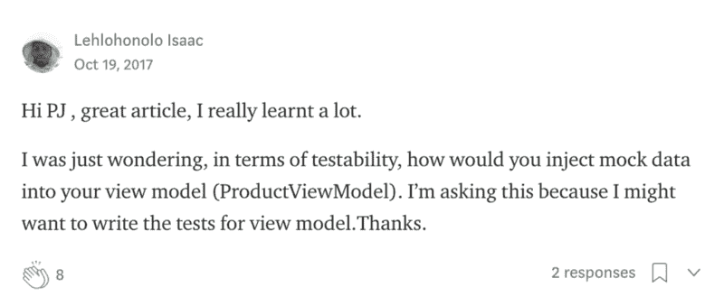

# 如何(以及为什么)在 Swinject 中使用蛋糕模式

> 原文：<https://www.freecodecamp.org/news/the-cake-pattern-with-swinject-4357c4d2bd0b/>

欢迎彼得·约翰

# 如何(以及为什么)在 Swinject 中使用蛋糕模式


[https://tinyurl.com/yacyj2pu](https://tinyurl.com/yacyj2pu)

在我的[上一篇文章](https://medium.com/swift-programming/dependency-injection-with-the-cake-pattern-3cf87f9e97af)中，我展示了我们如何使用 Cake 模式在没有任何库的情况下进行依赖注入。我从许多建议替代方法的人那里得到了很多非常棒的反馈，这表明人们对这个话题非常感兴趣。

我被问到的一个非常重要的问题是，我们如何用一个模拟来替换我们的实现进行测试。



在评论里，我提了一些建议。其中之一是使用依赖容器。

Swinject 是一个框架，它是实现依赖容器模式的依赖注入框架之一。

你可能想知道:如果我们可以使用 [Swinject](https://github.com/Swinject/Swinject) 为什么我们需要蛋糕模式？或者为什么我们要一起使用它们？嗯，这归结为个人喜好。但是我想展示一下我们如何将这两者结合起来使用。

### **入门**

为了在我们的项目中使用 [Swinject](https://github.com/Swinject/Swinject) ，我们需要安装 pod。

```
pod 'Swinject'
```

一旦我们安装了 pod，我们将开始创建两个协议。第一个将是一个可注册的协议，它将有一个采用三个参数的注册方法。

1.  Dependency —这将是我们在容器上注册的类型。
2.  实现—我们希望它解析到的依赖项的实现。
3.  ObjectScope —我们希望此依赖关系存在的范围。(可选)

我们的第二个协议将是可解析的协议，它有两个方法。第一个是 resolve 方法，它接受一个依赖类型并返回该类型的具体实现。第二个是一个重置方法，它将为我们重置可解决的问题(对测试有用)。

我们现在将创建一个符合这些协议的依赖容器类。

我们将在依赖容器类上创建一个 Swinject 容器和一个静态实例。

**警告:这段代码是在 Swift 4 中编写的，其中 private 可以在扩展中使用(不像在 Swift 3 中，需要 fileprivate)。**

首先，我们将遵循可注册的协议，使用我们创建的 Swinject 容器，并注册我们对它的依赖，以及它各自的实现。我们还将指定 objectScope 默认为 graph。

Swinject 提供了四种不同的内置作用域。请查看下面的文档链接，那里有很好的解释。

[**s winject/s winject**](https://github.com/Swinject/Swinject/blob/master/Documentation/ObjectScopes.md)
[*s winject 依赖注入框架适用于 iOS/macOS/Linux 的 Swift*github.com](https://github.com/Swinject/Swinject/blob/master/Documentation/ObjectScopes.md)

接下来，我们遵循可解析的协议，并再次使用同一个 Swinject 容器来解析依赖项。我们将通过移除容器上所有已注册的依赖项来重置 reset 方法中的容器。

我们现在有了一个依赖容器——耶！！但是我们如何使用这个容器来解决我们的依赖性呢？

我们将创建一个解析器工厂来为我们处理这个问题。它首先有一个 Resolvable 类型的容器属性，这将用依赖容器类实例初始化。我们将这种类型的容器设置为可解析的，这样我们就可以用任何符合该协议的依赖容器实例来替换它。

我们现在将创建两个静态方法，它们将在使用我们的可解析容器时解析和重置我们的容器。

我们已经创建了这个解析器工厂，现在是时候使用它了。

当创建我们的协议扩展时(在上一篇文章中我们解决了我们的实现)，我们现在可以使用我们的解析器工厂。

我们还需要记住，我们现在必须注册对容器的依赖。

这就是我们的蛋糕模式，用 Swinject 作为我们的依赖容器。

### **好处**

这种方法的好处是我们分离了应用程序的组件，并为这些组件提供了一个单一的解析源。这也使得我们更容易用模拟来替换实现进行测试。

这给了我们在应用程序的任何地方共享组件的选项，因为我们将能够在任何时候用我们的可注入协议扩展解决任何依赖性。

### **单元测试**

我们如何测试这个？嗯，我们需要做的就是在解析器上调用 reset，然后用模拟实现注册依赖项。

我们现在有我们的模拟被注入。看来我们结束了。

去试试吧！让我知道你们的想法。

Swinject 非常强大，本文只是演示了它的基本功能。如果你想让我探索它的更多特性，请在下面的评论中告诉我。

取得联系！

完整的例子可以在我的 Github 上找到。

[**pj welcome/CakePatternWithSwinject**](https://github.com/pjwelcome/CakePatternWithSwinject)
[*CakePatternWithSwinject-Cake 模式以 Swinject 为依赖容器*github.com](https://github.com/pjwelcome/CakePatternWithSwinject)[**彼得-约翰(@pjapplez)| Twitter**](https://twitter.com/pjapplez)
[*彼得-约翰的最新推文(@ pj applez)。移动应用开发者、技术探索者、摄影师、联合创始人……*twitter.com](https://twitter.com/pjapplez)

[**彼得约翰欢迎—谷歌+**](https://plus.google.com/u/0/+PeterJohnWelcome)

感谢[阿什顿欢迎](https://plus.google.com/111778165757216259863)，以及[基冈拉什](https://medium.com/@RushKeegan)对这篇文章的评论。