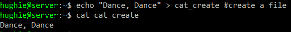
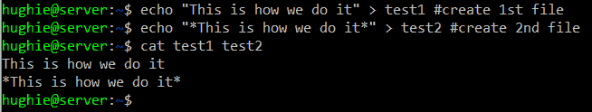
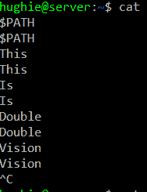
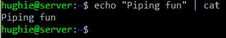
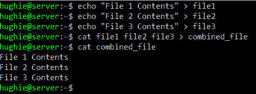
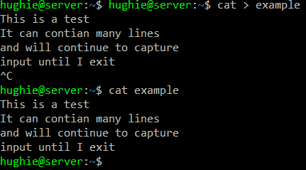

# Linux 中的 Cat 命令——如何用 Cat 或 Touch 创建文本文件

> 原文：<https://www.freecodecamp.org/news/the-cat-command-in-linux-how-to-create-a-text-file-with-cat-or-touch/>

在 nix 生态系统中,`cat`命令是一个非常流行和通用的命令。`cat`命令有 4 种常见用法。它可以显示一个文件，连接(合并)多个文件，回显文本，还可以用来创建一个新文件。

## 显示文件

cat 命令最常见的用途是输出文件的内容。下面是一个你可以尝试的例子。

```
echo "Dance, Dance" > cat_create #create a file
cat cat_create
```

在这个简单的例子中，我们使用`echo`和重定向的组合来创建一个包含“Dance，Dance”的文件。然后我们使用`cat`命令来显示内容。

输出如下所示:



The output of the example commands

## (反)猫

前面的例子实际上是 cat 命令主要功能的一个具体例子，它将文件连接起来进行显示。如果我们以同样的方式使用这个命令，但是给它两个或更多的文件，那么它输出文件的连接。

如果我们运行以下命令:

```
echo "This is how we do it" > test1 #create 1st file
echo "*This is how we do it*" > test2 #create 2nd file
cat test1 test2 
```

输出是第一个文件的内容，然后是第二个文件的内容。你可以给 cat 许多文件，它会把它们连接(组合)起来。但是请注意，cat 命令会自动在输出之间插入一个换行符。



The output of two files concatenated

`cat`还提供了一些开关来做一些事情，比如显示非打印字符(-v)，或者给你的行编号(-n)。在手册页中可以找到[的完整故障。](https://man7.org/linux/man-pages/man1/cat.1.html)

## 反照现象

这是`cat`的一个不太常见的用法，但却是下一节的基础。如果您不带任何命令运行`cat`命令，`cat`将以交互模式运行，并回显您键入的任何内容，直到您退出该命令。



Running cat in interactive mode

在这个例子中，我每行只输入一个单词。每次我按下回车键，这条线都会被回显。

您还可以通过管道将文本发送到`cat`，在这种情况下，该文本将被回显。例如:

```
echo "Piping fun" | cat 
```

这将导致以下输出:



Piping text into cat

## 创建文件

在前面的例子中，我们一直使用`echo`命令重定向到一个文件来创建新文件。Cat 可以以类似的方式使用。事实上，我们可以使用`cat`的 concat 和 echo 功能来创建文件。

我们可以创建一个包含多个文件连接的文件，如下所示:

```
echo "File 1 Contents" > file1
echo "File 2 Contents" > file2
echo "File 3 Contents" > file3
cat file1 file2 file3 > combined_file
cat combined_file
```

在上面的例子中，我们使用`echo`创建 3 个文件，使用`cat`将 3 个文件合并成一个，然后使用`cat`显示新的合并文件。



The result of the above commands. We've created 3 files, then combined them into a single file using cat

我们还可以使用`cat`的交互模式来创建一个文件，其中包含我们在终端中输入的文本。



每次按 enter 时，它都会将文本提交到文件中。如果您有未提交的文本并退出，它将不会被捕获到文件中。

这是一种快速创建文件的好方法，可以输入文件的内容。

## 使用触摸来创建文件

有时候你只需要一个文件存在。作为使用`cat`创建文件的替代方法，您可以使用`touch`命令。

`touch`命令设计用于更新文件的修改时间戳，但通常用作创建空文件的快速方法。下面是这种用法的一个例子:

```
touch new_file_name
```

touch 命令可以创建多个文件，更新修改和/或创建时间戳，以及许多其他有用的东西。可以在这里找到完整的手册页。

Touch 通常用于确保文件存在，如果您很快需要一个空文件，这是一个很好的命令。

## 摘要

Cat 是一个非常有用的命令。您可以使用它非常快速、轻松地创建、显示和组合文本文件。

如果您只需要一个文件存在，但不介意(或要求)它是空的，使用`touch`是一个很好的选择。

休吉·科尔斯是 Index Exchange 的首席开发人员。他写了关于软件架构、伸缩性、领导力和文化的文章。关于他的更多作品，请查看他在 medium 上的博客。