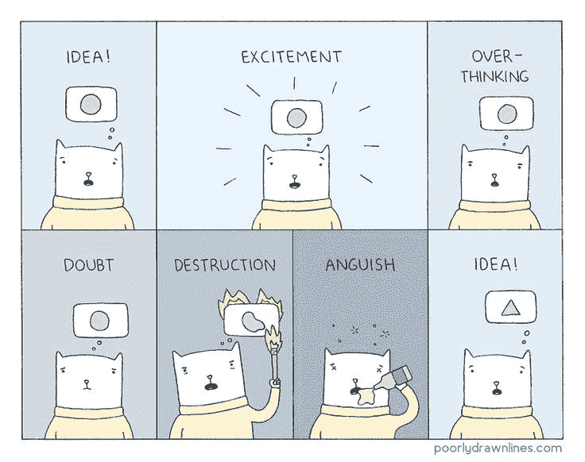
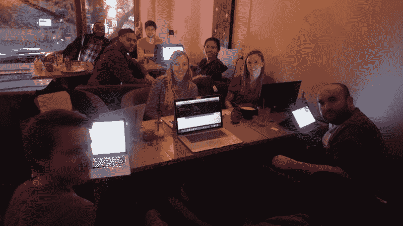

# 中情局刚刚失去了对其黑客武器库的控制。以下是你需要知道的。

> 原文：<https://www.freecodecamp.org/news/the-cia-just-lost-control-of-its-hacking-arsenal-heres-what-you-need-to-know-a9f49a64adf7/>

这里有三个值得你花时间的链接:

1.  中情局刚刚失去了对其黑客武器库的控制。以下是你需要知道的( [5 分钟阅读](http://bit.ly/2mGi71a))
2.  几分钟前，我现场采访了一位著名的 14 岁聊天机器人开发者
3.  我们如何说服创始人天使投资我们的开发工具初创公司( [6 分钟阅读](http://bit.ly/2n6uEIZ)

额外收获:创建谷歌面试大学的开发者刚刚得到了一份新工作…在亚马逊( [2 分钟阅读](http://bit.ly/2mC19AJ))

### 国际妇女节快乐！

### 想到这一天:

> “对于软件来说，只有两种可能:要么是用户控制程序，要么是程序控制用户。如果程序控制了用户，开发者控制了程序，那么程序就是不公正权力的工具。”—理查德·斯托尔曼，GNU 项目的创始人

### 今日趣事:

网络漫画作者[粗线条](http://bit.ly/2m2tSLY)

### 今日学习小组:

[斯德哥尔摩自由代码营](http://bit.ly/2m2L9ER)

编码快乐！

–昆西·拉森，自由代码营的老师