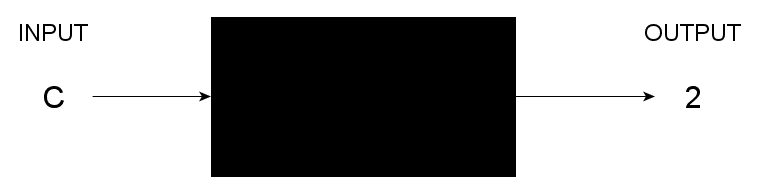
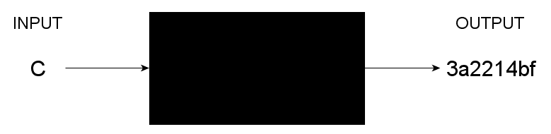
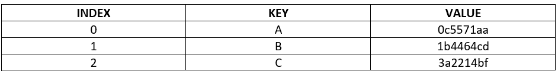

# 哈希和哈希表的无代码指南

> 原文：<https://www.freecodecamp.org/news/the-codeless-guide-to-hash/>

如果你以前编程过，你肯定会遇到散列表和哈希表。许多开发人员都以这样或那样的形式使用过哈希表，初学者必须学习这种基本的数据结构。只有一个问题:

你遇到的所有教程肯定都在讨论 JavaScript、Python 或者其他一些编程语言中的哈希和哈希表。

这意味着您可能对哈希的工作原理以及如何在[此处插入语言]中使用哈希表有所了解，但可能会忽略其工作原理。

如果我们可以在不知道任何特定语言的情况下学习哈希，这不是很好吗？如果你知道哈希是如何工作的，什么是哈希表，语言就不重要了。

这就是无代码的方法，在这篇文章中，我将教你所有关于哈希和哈希表的知识，不管你现在使用的是哪种编程语言。无论你是初级还是高级开发人员，每个人都会从这篇文章中学到一些东西。

## 那么什么是散列函数呢？

在我们进入所有花哨的东西之前，让我告诉你哈希是什么。为了简单起见，我们假设有一个黑盒:

I'm a Black Box

这个黑盒很特别。它被称为功能盒。我们称之为函数框，因为这个框将把输入上的自变量映射到输出上的因变量(听起来很数学，但请耐心等待)。

我们的功能盒是这样工作的:如果我们把一个字母放进盒子里，我们会得到一个数字。因为我们的盒子是一个功能盒，所以对于盒子中的每个输入只能有一个输出。

我们的函数盒将在输入端接收来自 A-J 的一个字母，并在输出端输出一个从 0 到 9 的相应数字。所以如果我们输入 C，我们会得到 2 的输出。

Function Box

这构成了哈希函数的基础。然而，散列函数则更进一步。我们将把输入上的数据映射到输出上的某个数值，通常是一个十六进制序列。

Hash Function

因此，基本上所有的散列都是使用一个函数将数据映射到一个有代表性的数字或字母数字值。对于哈希函数，不管输入的大小如何，输出总是保持不变。

## 哈希表呢？

所以此时你可能想知道什么是哈希表。哈希表利用哈希来形成数据结构。

哈希表使用一种关联方法来存储数据，这种方法使用一种被称为键值查找系统的方法。这意味着，在哈希表中，键被映射到唯一的值。

这种组织数据的系统可以快速有效地找到数据。这是因为每个键都映射到一个唯一的值，一旦我们知道了一个键，我们就可以立即找到相关的值。

哈希表非常快，时间复杂度为 O(1)量级。

迷茫？看一下这个图，在这里我们有多个生成哈希值的功能框。

Multiple Function Boxes

在这个场景中，输入中的每个字符(每个字符都是一个键)都应用了一个散列函数，函数框中的散列函数生成散列值。这个结果值然后被映射到用于实现哈希表的底层链表或数组中的索引。

最终的结构将如下所示:

Hash Table

## 哈希冲突

这是讨论哈希函数和哈希表中的冲突的好时机。

数学中的函数是理想的，因为输入中的一个元素正好映射到输出中的一个元素。

然而，在散列函数中，情况并不总是这样。有时，输入中不同的哈希值可能会在输出中产生相同的哈希值。当这种情况发生时，您会得到所谓的哈希冲突。

哈希冲突在大多数用例中并不常见，因为输入中的一个小变化会产生非常不同的输出。但是，您必须向散列函数输入的数据越多，就越有可能发生冲突。

在我们之前提供的哈希表示例中，我们假设使用了一个数组来实现哈希表。虽然这对于简单的哈希表来说很好，但实际上这对于处理冲突来说不是很好。

因此，使用了一种称为链接的方法。在链接中，如果哈希表为多个元素返回相同的哈希值，我们只需将这些元素与哈希表中相同索引处的相同哈希值“链接”在一起。

通过这种方式，我们使用一个链表来实现哈希表，其中每个元素都是一个列表，而不仅仅是分配给它一个值，而不是作为一个带有索引的数组来实现。

但是随着链长度的增加，哈希表的时间复杂度会变得更差。还使用了一种称为开放式寻址的方法。在其中，实现散列表的底层数据结构中的替换位置被找到。只是要记住，这种方法会降低哈希表的效率，并且时间复杂度更差。

## 哈希和加密或者编码一样吗？

许多人倾向于将哈希与加密或编码联系在一起。那么哈希是加密吗？和编码一样吗？

你看，在加密中，我们把数据混为一谈，这样只有拥有解密数据所需密钥的人才能访问它。当我们使用加密密码时，我们不仅要加密数据，还要在某个时候解密数据。在加密中，我们希望恢复原始数据。

另一方面，散列法获取数据并产生输出，以确认数据的完整性。在散列法中，我们无意恢复原始数据。

编码不同于加密和哈希，因为编码的目标不是为了任何安全目的隐藏数据，而仅仅是将数据转换成另一个系统可以使用的格式。

## 我能用哈希做什么？

哈希和哈希表有许多用途！其中包括:

1.  密码系统
2.  循环冗余校验
3.  搜索引擎
4.  数据库
5.  编译程序

或者任何具有复杂查找过程的系统。

## 包扎

在这篇文章中，我们已经介绍了哈希的基础知识，并且没有编写任何代码！这很简单，对吗？无代码方法是学习这些基本主题的更简单的方法。

我们了解到散列函数可以用来将对象转换成固定长度的字母数字输出。我们还了解到哈希表是键值查找系统，虽然它们运行良好，但并不完美，有时会发生冲突。

在这篇文章结束的时候，你应该知道散列、加密和编码之间的区别，并且知道散列可以用在什么地方。

你喜欢无代码的方法吗？想更进一步？

在《无代码数据结构和算法》一书中学习哈希表和其他数据结构和算法。您将获得这篇文章中所涵盖内容的扩展，并了解更多的主题，所有这些都无需编写一行代码！

[Codeless Data Structures and Algorithms - Learn DSA Without Writing a Single Line of Code | Armstrong Subero | ApressThis book brings you a new perspective on algorithms and data structures, completely code free. Learn about data structure algorithms (DSAs) without ever having to open your code editor, use a compiler, or look at an integrated development environment (IDE)....Armstrong SuberoSearch Menu Cart V Your cart is currently empty. Login AccountBookshelf Login Apress Access](https://www.apress.com/gp/book/9781484257241)