# 以太网协议如何工作——完整指南

> 原文：<https://www.freecodecamp.org/news/the-complete-guide-to-the-ethernet-protocol/>

不管你有没有意识到，你可能在过去使用过以太网。这电缆眼熟吗？

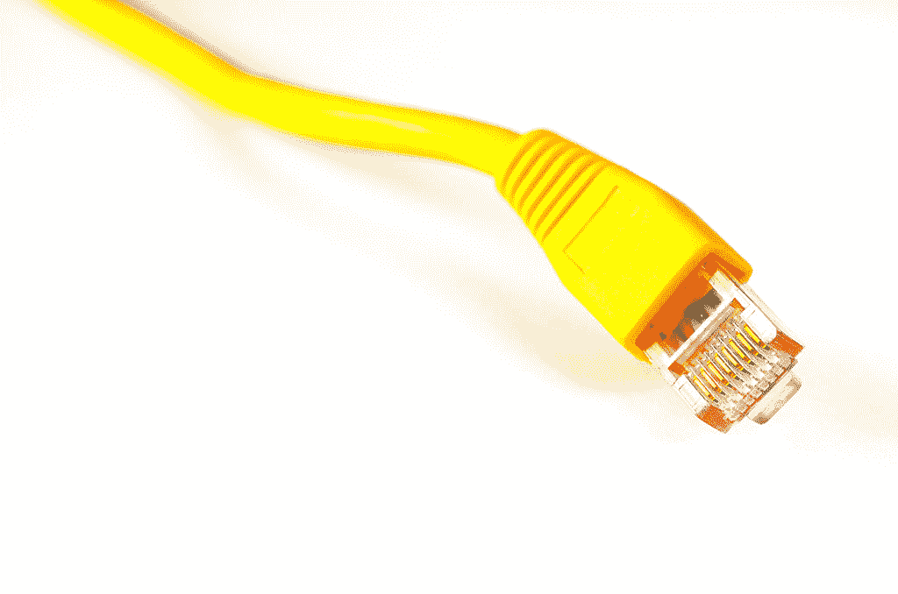

(Source: [Wikipedia](https://en.wikipedia.org/wiki/Ethernet_physical_layer#/media/File:EthernetCableYellow3.jpg))

以太网非常流行，是使用最广泛的数据链路层协议，至少在设备通过物理电缆(而不是无线)连接的情况下是如此。

如果你需要一个关于数据链路层及其在层模型中的角色的提示，请查看[我之前的帖子](https://www.freecodecamp.org/news/the-five-layers-model-explained/)。

在本教程中，您将了解以太网的一切——它的历史，以及以太网帧的每一位和每一字节。您还将了解协议是如何形成的，为什么协议发布后很难更改，以及其他协议可以借鉴的经验。

## 以下是我们将要介绍的内容:

1.  [一些以太网的历史](#some-ethernet-history)
2.  [以太网帧概述](#ethernet-frame-overview)
    –[帧前–前同步码(8 字节)](#before-the-frame-preamble-8-bytes-)
    –[目的地址和源地址(各 6 字节)](#destination-address-and-source-address-6-bytes-each-)
    –[类型/长度字段–以太网 II(类型)(2 字节)](#type-length-field-ethernet-ii-type-2-bytes-)
    –[数据和填充(46-1500 字节)](#data-and-pad-46-1500-bytes-)
    –[校验和–CRC32(4 字节)](#checksum-crc32-4-bytes-)
    –
3.  [以太网地址如何工作](#how-ethernet-addresses-work)
    –[单播和组播位](#unicast-and-multicast-bits)
    –[全球唯一/本地管理位](#globally-unique-locally-administered-bit)
4.  [为什么以太网帧有最小长度？](#why-does-an-ethernet-frame-have-a-minimum-length)
    –[以太网是如何处理冲突的？](#how-are-collisions-handled-in-ethernet)
5.  [结论](#conclusion)

# 一些以太网历史

以太网的第一个版本是在 1976 年实现的。1978 年，DEC、英特尔和施乐共同出版了第二个版本 **DIX** (代表 DEC、英特尔和施乐)。这也被称为“以太网 II”。

1983 年，IEEE 标准协会发布了新的以太网版本 IEEE 802.3 标准，我们将很快讨论这一变化。

以太网 II 和 IEEE 802.3 都被广泛使用，所以我们将涵盖它们。正如你将看到的，它们几乎是相同的。通常，两者都简称为“以太网”。

对于本教程，为了准确表达我们的意思，我将明确说明我是在谈论以太网 II 还是 IEEE 802.3。

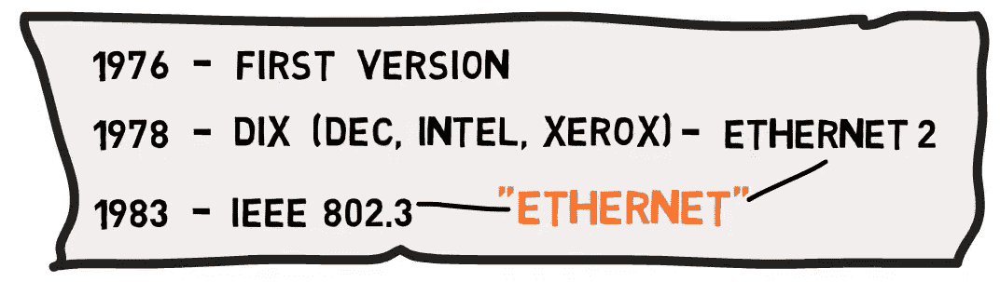

The versions of Ethernet (Source: [Brief](https://www.youtube.com/watch?v=SoTRqDLND6Y&ab_channel=Brief))

# 以太网帧概述

让我们考虑一下以太网帧格式:

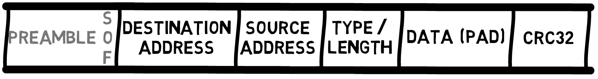

Ethernet Frame Header and Trailer (Source: [Brief](https://www.youtube.com/watch?v=SoTRqDLND6Y&ab_channel=Brief))

## 帧前——前同步码(8 字节)

首先是由 8 个字节组成的**前同步码**，每个字节包含交替的`1`和`0`的位模式，即`10101010`。

在以太网 II 中，所有 8 个字节都是这种模式。在 802.3 中，前七个字节携带值`10101010`，然而最后一个字节的最后一位被设置为`1`，因此该字节携带值`1010101**1**`。

这最后一个字节被称为帧的**开始。最后两位`1`告诉接收器帧的剩余部分即将开始。**

在新帧之前发送此位模式，可让网络上的设备轻松同步其接收器时钟。请注意，报头并不是实际帧的一部分，它只是位于每个帧的前面，因此您在许多以太网协议图中看不到它。


Ethernet Preamble (Source: [Brief](https://www.youtube.com/watch?v=SoTRqDLND6Y&ab_channel=Brief))

## 目的地址和源地址(每个 6 字节)

接下来，我们有两个地址，每个由 **6** 字节组成。我将在这篇文章的后面更详细地描述以太网地址，但是现在，让我们注意一个帧以一个**目的地**地址开始，后面是**源**地址。

为什么帧会从目的地址开始？有什么原因吗？

嗯，有。设备对收到的帧可能做的第一件事就是检查该帧是否发往它。如果该帧的目的地不是该设备，则可以简单地将其丢弃。因此，首先是目的地址。

为什么源地址很重要？嗯，如果有必要的话，知道接收者应该向谁发送回复。这个源地址在一些网络设备的实现方式中也起着作用，我们将在以后的文章中看到。

## 类型/长度字段–以太网 II(类型)(2 字节)

接下来是一个相当有问题的字段，称为**类型**或**长度**字段。

在 Ethernet II 中，这个字段被称为 **Type** ，它告诉接收方这个帧承载了什么样的有效载荷。

例如，如果这个帧携带一个 IP 层(即以太网层的*数据*是一个 IP 包)，那么接收网卡应该将该帧的有效载荷转发给 IP 处理器。如果帧的有效载荷是 ARP，那么 ARP 处理器应该处理它。

我所说的**处理器**指的是处理这个协议的代码，例如解析 ARP 的代码。

我们将很快回到对长度的需求以及它在 IEEE 802.3 中是如何处理的。

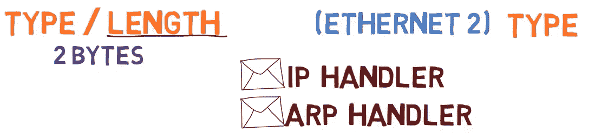

In Ethernet II, the Type field carries the type of the payload (Source: [Brief](https://www.youtube.com/watch?v=SoTRqDLND6Y&ab_channel=Brief))

## 数据和填充(46-1500 字节)

在这个字段之后，我们得到多达 1500 字节的数据。选择这个数字是因为在 1978 年 RAM 很贵，如果帧更大，接收器将需要更多的 RAM。

这意味着，如果第三层要通过以太网发送超过 1500 字节的数据，就必须跨多个帧发送。

还有一个最小数据长度，是 46 字节。加上帧的其它字段，以太网帧的最小长度总共为 64 字节。

为什么我们需要最小帧长？我们将在随后的部分中讨论这一点。

现在，假设我们有一个以太网帧的最小长度，如果发送者想要发送一个非常短的消息，比如说只有一个字节，会发生什么呢？

在这种情况下，发送者必须用**填充**消息，例如用`0`填充，直到达到最小长度。例如，如果发送方只想发送 1 个字节的数据，比如字母`A`，他们就必须加上 45 个字节的`0`


46-1500 bytes of data, with padding if needed (Source: [Brief](https://www.youtube.com/watch?v=SoTRqDLND6Y&ab_channel=Brief))

## 校验和–CRC32(4 字节)

最后但同样重要的是，我们有一个**校验和**。这是一个 [32 位 CRC 校验和](https://en.wikipedia.org/wiki/Cyclic_redundancy_check)，用于确定帧的位是否被正确接收。如果出现错误，该帧将被丢弃。

CRC 是在整个帧上计算的，也就是说，包括帧头。请注意，它不包括前同步码，因为它实际上不是帧的一部分。

当我们使用 CRC-32 作为校验和时，我们设置 32 位或 4 字节的固定开销，而不管数据的长度。换句话说，如果我们只发送 1 个字节的数据，我们会得到 32 位校验和，如果我们发送 1000 个字节的数据，我们仍然会得到 32 位校验和。

## 类型/长度字段的问题是

之前，我们提到过**数据**字段必须至少有 46 个字节长，如果没有，我们就填充它。为了简单起见，让我们假设我们用`0` s 填充，如标准所示。

嗯，我们实际上有一个问题。

假设发送者想要发送一个字节，由字符`A`组成。所以他们会发送一个`A`后跟 45 个`0`

万一发件人要发`A`和零怎么办？即数据实际上由`A0`组成。在这种情况下，他们还会发送一个`A`，后面跟着 45 个`0`，但是这一次，第一个零实际上是数据的一部分，而不是填充。


Whether the sender would like to send `A` as data or `A0` as the data, due to padding the frame consists of `A` and 45 `0`s (Source: [Brief](https://www.youtube.com/watch?v=SoTRqDLND6Y&ab_channel=Brief))

作为接收方，您需要一种方法来区分这些情况，并了解在短帧的情况下，哪些字节属于填充，哪些字节属于数据。

以太网 II 通过…嗯，不处理它来处理这个问题。也就是说，第三层将接收数据和填充，在本例中是一个`A`后跟 45 个`0`。然后，它必须自己判断哪些字节属于数据，哪些不属于数据。

当然，如果第三层包括长度字段，这是可行的。然而，这种解决方案并不完美——为什么第三层要处理应该由第二层处理的填充问题？

这明显违反了我们的层模型(如果你想看关于层模型的概述，参考[本教程](https://www.freecodecamp.org/news/the-five-layers-model-explained/))。

为此，IEEE 决定将 IEEE 802.3 中的**类型**字段改为**长度**字段。因此，例如，携带单字节数据的帧`A`，其长度字段将被设置为`1`，而携带两字节数据的帧`A0`，其长度字段将被设置为`2`。

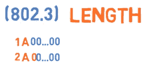

In 802.3, the Length field sets the data apart from the padding (Source: [Brief](https://www.youtube.com/watch?v=SoTRqDLND6Y&ab_channel=Brief))

这是一个优雅的解决方案，但现在出现了两个问题:

首先，如果您收到一个以太网帧，您如何知道它是以太网 II 帧(此字段表示类型)还是 IEEE 802.3 帧(此字段表示长度)？

第二，类型字段会发生什么？接收方如何知道帧中承载的是什么协议？

先说第一个问题。只是澄清一下，到 IEEE 802.3 发布时，许多以太网卡已经在使用了。人们不想仅仅因为新标准的发布就更换他们的网卡。

想想看，你会想买新网卡吗？或者也许你的朋友不是程序员——当有人告诉他们“互联网极客”决定有一个“新标准”时，他们会得到一张新卡吗(不管那是什么意思？).

解决方案是允许以太网 II 和 IEEE 802.3 在同一个网络上运行。

幸运的是，当时使用的所有**类型的**值都大于`1500`值。因此，解决方案很简单:如果这个字段的值小于或等于`1500`，它实际上意味着长度。如果其值大于或等于`1536`，则表示类型。两者之间的值目前没有意义。


The Type/Length field is divided: values equal to or lower than 1500 are Length values, and values equal to or greater than 1536 are Type values. (Source: [Brief](https://www.youtube.com/watch?v=SoTRqDLND6Y&ab_channel=Brief))

例如，如果我们看到该字段的值为`400`的帧，显然我们有一个 IEEE 802.3 帧，其长度为`400`字节。

现在你试试:万一我们看到一个帧，其中这个字段被设置为`20`，它是以太网 II 帧还是 IEEE 802.3 帧？

事实上，这是一个 IEEE 802.3 帧，它有`20`字节的数据，因此有`26`字节的填充。如果我们看到一个帧，其中该字段被设置为`2000`？

在这种情况下，我们知道这是一个以太网 II 帧，并且`2000`是类型。

这就是我们如何知道我们处理的是以太网 2 还是 IEEE 802.3 帧。

接下来，IEEE 802.3 帧如何包含类型信息？也就是说，假设 IEEE 802.3 覆盖了类型字段，接收机就无法知道如何处理传入的帧。因此，IEEE 802.3 就在数据之前添加了另一个报头 [802.2 LLC(逻辑链路控制)协议](https://en.wikipedia.org/wiki/IEEE_802.2)。这个头传递类型信息。

因此，IEEE 802.3 帧会有一个目的地址字段、一个源字段、一个长度字段和一个 LLC 报头，然后是数据和校验和。

### 等等，IEEE 802.3 不是 1983 年发布的吗？为什么相关？🤔

如前所述，1978 年，以太网 II 问世。不久之后，在 1983 年，一种新的格式出现了——其作者考虑到了向后兼容性，可能认为在几年内，所有设备都将升级到新标准。

哦，他们错了吗？

如果你检查你自己的网络(假设你连接到一个以太网)，我打赌你会看到以太网 II 帧。

您的设备可能支持这两个版本，但默认情况下，它将传输以太网 II 帧，而不是 802.3。毕竟，保证任何连接到以太网的设备都可以读取以太网 II 帧，并不保证设备可以读取 802.3 帧。如果以太网 II 能用，为什么不用呢？

所有第三层协议都必须考虑这样一个事实，即以太网不能解决区分数据和填充的问题。如果所有的协议都已经解决了这个问题，为什么我们不...让事情保持原样？

端点设备(如个人电脑)几乎总是通过以太网 II 进行通信。不过，IEEE 802.3 也很常见，它默认用于大多数现代网络设备(如交换机)。

这个故事实际上包含了一个非常重要的教训。

事后替换协议是非常非常困难的，尤其是当它们在硬件设备(比如网卡)上实现的时候。

### 什么是包间间隙？

发送以太网帧后，发送器在发送下一帧前会等待很短的时间，以便让接收器知道帧的传输已经结束。帧之间的空闲时间被称为“包间间隙”。

# 以太网地址的工作原理

每个以太网帧都携带两个地址，第一个是目的地址，第二个是源地址。我们提到过，目的地址首先出现，因此接收方将能够判断帧是否与其相关。否则，该帧将被丢弃。


Ethernet addresses within the Ethernet Frame (Source: [Brief](https://www.youtube.com/watch?v=sGZzU4U39Bw&ab_channel=Brief))

以太网地址看起来像什么？

一个以太网地址由 6 个字节组成，即 48 位。通常，它们以十六进制表示，由破折号或冒号分隔，正如您在这些示例中看到的:

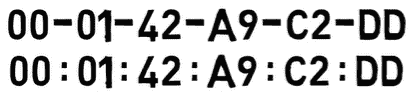

Two representations of the same Ethernet Address (Source: [Brief](https://www.youtube.com/watch?v=sGZzU4U39Bw&ab_channel=Brief))

```
00:01:42:a9:c2:dd
00-01-42-a9-c2-dd
```

这是完全相同的以太网地址的两种表示，两者之间没有真正的区别。

一般来说，以太网地址应该是全球唯一的。也就是说，没有两个以太网设备共享同一个地址(至少理论上是这样)。

任何地址的前 3 个字节称为**OUI**–组织唯一标识符。为了确保地址是唯一的，IEEE 将这些 oui 分配给不同的制造商，如戴尔、惠普或 IBM。

地址的这一部分也被称为**供应商 ID** (除了两个最低有效位，我们将会看到)。然后，制造商将剩余的 3 个字节分配给特定的主机。这个部分也被称为**主机 ID** 。

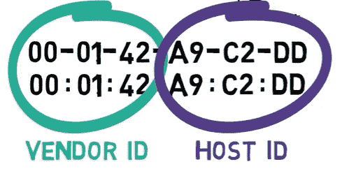

The most significant 3 bytes are the Vendor ID, and the least significant 3 bytes are the Host ID (Source: [Brief](https://www.youtube.com/watch?v=sGZzU4U39Bw&ab_channel=Brief))

例如，OUI `00:01:42`属于思科。现在，思科可以制造网卡并给它分配地址`00:01:42:00:00:01`。接下来，它可以制造另一张卡，并给它分配地址`00:01:42:00:00:02`，等等。这两个地址共享相同的**供应商 ID** ，但是具有不同的**主机 ID**。

由于单个 OUI 留下 3 个字节用于主机 id，因此每个 OUI 有`2^24`个主机 id，即 16，777，216 个主机 id。当然，大型制造商需要更多的地址，因此他们被分配了额外的 oui。例如，`00:01:64`是另一个属于思科的 OUI。

## 单播和多播位

以太网地址也由两个特殊的位组成。

第一个特殊位表示地址是单播地址还是组播地址。单播意味着该地址代表一台设备。多播地址代表一组设备，如网络上的所有打印机，或同一本地网络中的所有设备。

代表地址是单播还是组播的位是最高有效字节中的最低有效位。等等，什么？

考虑以下以太网地址:

`06:b2:d9:a2:32:9e`

最高有效字节是`06`。

让我们把它转换成二进制:

`00000110`

现在我们来看看最低有效位，也就是这个`0` :

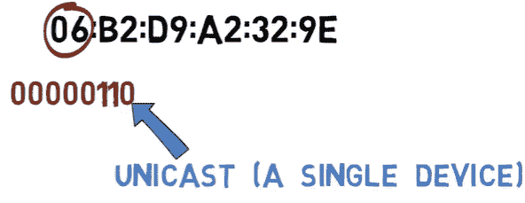

When the least significant bit within the most significant byte is set to `0`, this is a Unicast address (Source: [Brief](https://www.youtube.com/watch?v=sGZzU4U39Bw&ab_channel=Brief))

这一点是关闭的。这意味着这是一个**单播**地址。换句话说，它属于单个设备，例如计算机的网卡。

让我们考虑另一个地址:

`11:c0:ff:ee:d8:ab`

最重要的字节是`11`(十六进制)。

让我们把它转换成二进制:

`00010001`

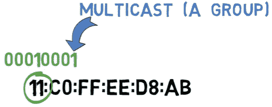

When the least significant bit within the most significant byte is set to `1`, this is a Multicast address (Source: [Brief](https://www.youtube.com/watch?v=sGZzU4U39Bw&ab_channel=Brief))

最低有效位是这个。因为它是开着的，我们可以断定这是一个**组播**地址。也就是说，它是一个组的地址。您可以向该地址发送帧，属于该组的所有设备都会认为该帧是发送给它们的。

一个非常著名的多播地址叫做**广播**地址，也就是包含所有机器的组。该组的地址是:

`FF:FF:FF:FF:FF:FF`
换句话说，所有位都在的地址。

所有的机器都是广播组的一部分。

### 全球唯一/本地管理位

第二个特殊位表示地址是否确实是全球唯一的。该位是最高有效字节中的第二个最低有效位。嗯，什么？

好吧，再一次，考虑之前的第一个地址:

`06:b2:d9:a2:32:9e`

第一个字节是`06`。

转换成二进制，我们得到:

`00000110`

第二个最低有效位就是这里:


When the second least significant bit within the most significant byte is set to `1`, this address is **not** globally unique (Source: [Brief](https://www.youtube.com/watch?v=sGZzU4U39Bw&ab_channel=Brief))

这个位是开的，因此我们知道这个地址实际上是**而不是**全局唯一的。IEEE 永远不会将此地址分配给任何供应商。这个地址是什么？嗯，在这种情况下，这只是一个我已经制定了。如果我愿意，我可以将它分配给特定的设备。该位为 on 的事实表明它不是全局唯一的。

考虑另一个地址:

`00:01:42:a9:c2:dd`

第一个字节是`00`，所以第二个最低有效位是`0`。


这确实是分配给 Cisco 的全球唯一地址。

### 以太网地址–概述

所以，总而言之，一个以太网地址有两个主要部分:供应商 ID 和主机 ID。

还有两个特殊位:最高有效字节中的最低有效位表示地址是单播还是组播。最高有效字节中的第二个最低有效位表示该地址是否是全局唯一的。

# 为什么以太网帧有最小长度？

这是这篇文章的一个“额外收获”部分，涉及到碰撞。冲突是一个非常有趣的话题，但是因为这篇文章关注的是以太网协议，所以冲突不是我们关注的焦点。因此，我将简单地谈谈这个问题。虽然理解以太网帧并不重要，但我保证会对以太网协议有一个完整的概述。

在概述中，我提到了以太网帧由最少 46 字节的数据和最多 1500 字节的数据组成。我已经解释了为什么我们有最高限额，但是最低限额呢？

为了简化我们的讨论，让我们考虑一个使用传统以太网的网络，其中所有计算机都连接到一根电缆上。

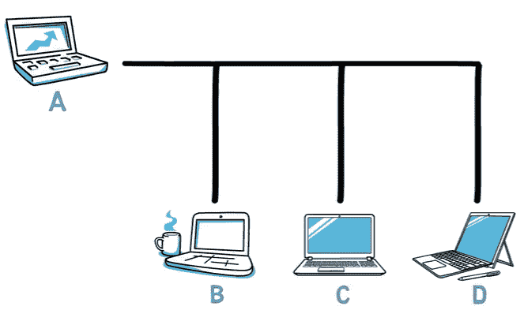

A "classic Ethernet" network with four devices connected via a single cable (Source: [Brief](https://www.youtube.com/watch?v=ECl8DnWeVD4&ab_channel=Brief))

假设 A 要向 B 发送消息，C 要向 d 发送消息，假设 A 在发送其帧的同时，C 也在发送其帧。在这种情况下，帧将*碰撞*。

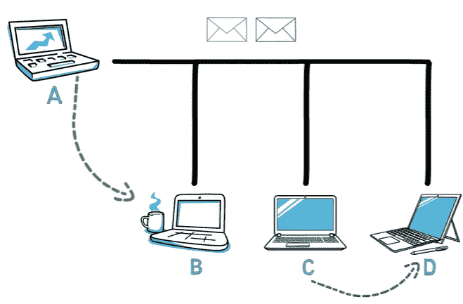

In case two devices transmit data on the same time - their frames will collide (Source: [Brief](https://www.youtube.com/watch?v=ECl8DnWeVD4&ab_channel=Brief))

当这种情况发生时，我们就会出现错误——就像两个人同时开始说话，你不可能理解其中任何一个。

## 以太网中如何处理冲突？

以太网使用两种主要机制来处理冲突。第一个叫做 **CSMA** ，代表**载波侦听多路访问**。这基本上意味着，当一个站要传输数据时，它首先通过检查线路的信号电平来感知信道，以查看是否有其他人在传输。如果频道正在使用中，电台将等待并重试。

因此，如果 A 正在传输，而 C 想要发送数据，C 将等到 A 完成传输后再开始传输。

这就像人与人之间的谈话一样，一个人一直等到另一个人停止说话，然后那个人才开始说话。

然而，就像两个人可能同时开始说话一样，两台以太网机器也可能同时开始传输数据。在这种情况下，**CD**–**碰撞检测**–开始发挥作用。冲突检测意味着发送设备检测到冲突已经发生。这是通过在传输时监听信道来实现的。

例如，假设站 A 发送比特流`11001010`。在传输的同时，A 也在监听信道。如果没有冲突发生，A 也将从线路上读取信号`11001010`。

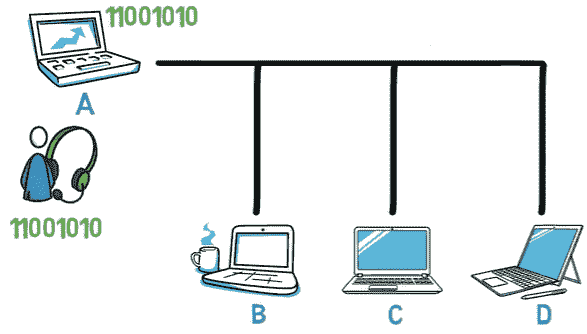

With **Collision Detection**, A is listening to the channel while transmitting data. In case no collision occurred, A will sense exactly the bitstream it has sent (Source: [Brief](https://www.youtube.com/watch?v=ECl8DnWeVD4&ab_channel=Brief))

然而，如果发生了冲突，比如说 C 发送了一个帧，那么 A 将会读取与该行不同的内容——例如，`11011010`。这样，机器 A 意识到它的框架发生了碰撞。

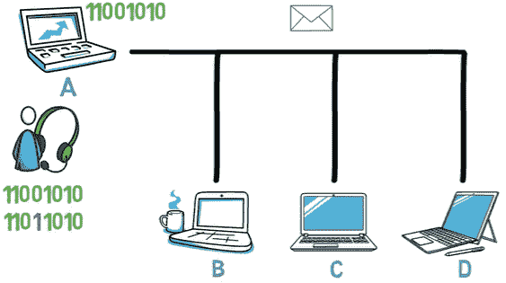

With **Collision Detection**, A is listening to the channel while transmitting data. In case of a collision, A reads a different bitstream than that it has sent (Source: [Brief](https://www.youtube.com/watch?v=ECl8DnWeVD4&ab_channel=Brief))

机器 A 甚至可以在完成帧传输之前就意识到发生了冲突。然后，机器 A 停止传输，发出一个阻塞信号，告诉另一个站发生了冲突。因此，两个站都停止传输，并在尝试再次提交之前等待一段随机的时间间隔。

站点等待的时间随着网络中冲突的数量而增加。因此，在第一次冲突中，A 和 C 在再次传输之前会等待相对较短的时间。如果另一次碰撞发生，他们可能会等待更长时间。

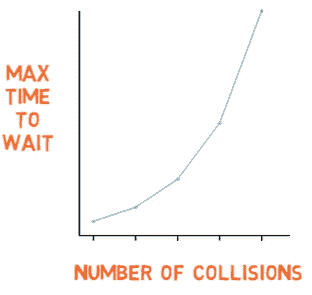

After a collision occurs, the amount of time that the stations wait increases with the number of collisions in the network (Source: [Brief](https://www.youtube.com/watch?v=ECl8DnWeVD4&ab_channel=Brief))

现在，回到以太网。以太网要求有效帧的长度至少为 64 字节，从目的地址到校验和，包括两者。因此，该数据必须至少有 46 字节长。如果框架太短，那么它必须被填充。

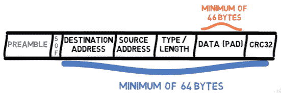

The minimum length of an Ethernet frame consists of 46 bytes of data, or 64 bytes overall (Source: [Brief](https://www.youtube.com/watch?v=ECl8DnWeVD4&ab_channel=Brief))

具有该最小值的一个原因与上述冲突检测机制直接相关。

让我们考虑下面的场景。主机 A 想要向 B 发送一个非常非常短的帧，这个帧只有 1 个字节长。我当然是夸大其词了，这个不可能真的发生在以太网里，但是会对解释有帮助。

主机 A 发送这个帧，这个帧由 8 个`1`组成，然后 A 在发送的同时监听信道，也从中读取 8 个`1`，得出该帧已经发送成功的结论。

然而，在帧到达网络的另一端之前，D 开始传输一个非常短的帧，一个字节长，由 8 个`0` s 组成，D 在传输的同时监听信道，并且还从中读取 8 个`0` s，得出该帧已经成功传输的结论。


Both A and D send a really short frame, and they finish transmitting without realizing a collision is liable to take place (Source: [Brief](https://www.youtube.com/watch?v=ECl8DnWeVD4&ab_channel=Brief))

现在，这两个非常短的帧发生碰撞。然而，A 和 D 都没有意识到这种冲突，因为它们已经断定帧已经成功传送。

为了避免这种情况，帧必须足够长，以防止站点在帧的第一位到达线路远端之前完成传输。以太网帧的最小长度解决了这个问题。

这是一个关于碰撞的简短讨论。如果你想知道更多关于这个主题的信息，请参考下面的“附加资源”部分。

# 结论

在本教程中，我们讨论了以太网协议的每一位和每一个字节。现在，您应该对该协议有了很好的理解，并且在需要时可以参考该协议。

## **关于作者**

奥马尔·罗森鲍姆是 [Swimm](https://swimm.io/) 的首席技术官。他是简介 [YouTube 频道](https://youtube.com/@BriefVid)的作者。他还是一名网络培训专家和 Checkpoint Security Academy 的创始人。他是[计算机网络(希伯来语)](https://data.cyber.org.il/networks/networks.pdf)的作者。你可以在推特上找到他。

### **附加参考文献**

*   [计算机网络播放列表-在我的简短频道上](https://www.youtube.com/playlist?list=PL9lx0DXCC4BMS7dB7vsrKI5wzFyVIk2Kg)
*   [带冲突检测的载波侦听多路访问-维基百科](https://en.wikipedia.org/wiki/Carrier-sense_multiple_access_with_collision_detection)
*   [载波侦听多路访问冲突检测(CSMA/CD)解释- ITPRC](https://www.itprc.com/carrier-sense-multiple-access-collision-detect-csmacd-explained/)