# 进化的计算机科学:遗传算法导论

> 原文：<https://www.freecodecamp.org/news/the-computer-science-of-evolution-an-introduction-to-genetic-algorithms-b3871286c7e7/>

作者:本·马里

# 进化的计算机科学:遗传算法导论

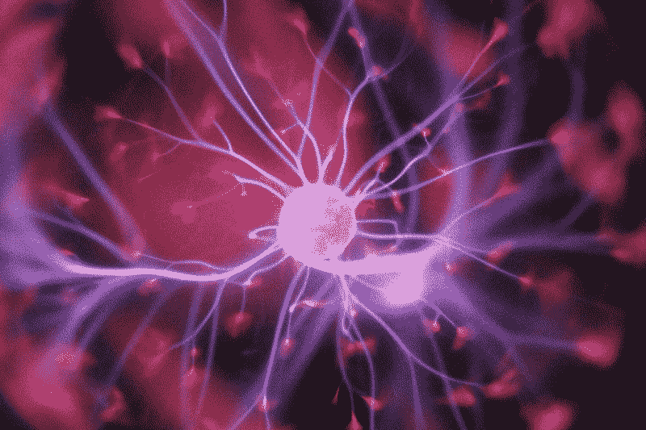

Photo by [Hal Gatewood](https://unsplash.com/photos/OgvqXGL7XO4?utm_source=unsplash&utm_medium=referral&utm_content=creditCopyText) on [Unsplash](https://unsplash.com/search/photos/dna?utm_source=unsplash&utm_medium=referral&utm_content=creditCopyText)

作为一名对进化和生物过程感兴趣的计算机科学家，遗传算法的主题，更广泛地说，进化计算对我来说就像一个糖果店对一个 5 岁的孩子一样:天堂。仅仅是能够以这样一种无缝的方式融合我的两个兴趣的可能性就已经非常令人兴奋了，对我来说把这种知识和兴奋完全留给自己是错误的。

因此，为了检验我迄今为止学到的一些东西，并与世界其他地方分享我的发现，我决定就这个主题撰写一系列文章。

在这篇文章中，我将简要介绍遗传算法，并解释它们如何模仿地球上已经发生了数十亿年的相同自然过程。

#### **地球上的生命**

在过去的 35 亿年里，自然母亲、时间父亲、进化和自然选择共同合作，产生了我们今天在地球上看到的所有特殊生命形式:像食肉的捕蝇草；生活在海洋中的大西洋飞鱼；回声定位——用蝙蝠；长颈长颈鹿；超快的猎豹，跳舞的蜜蜂；当然，你真正的，街头聪明的智人。

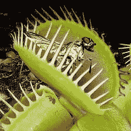

The Venus Flytrap is a carnivorous plant that primarily feasts on insects and arachnids.

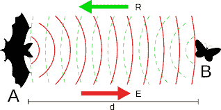

Some bats use echolocation to navigate and hunt prey and contrary to popular belief, bats are actually not blind; a species of bats known as The Flying Foxes actually have better eyesight than humans.

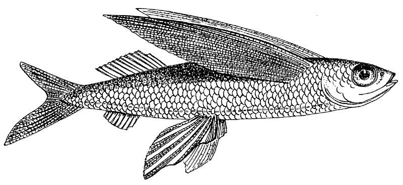

Flying Fish cannot fly in the same way that birds do, however, these fish can make powerful, self-propelled leaps out of the water where their long wing-like fins enable them to glide for considerable distances above the water’s surface.

不用说，地球上的生命是宇宙中最成功的实验之一。从这个实验令人印象深刻的结果来看，很明显，进化显然是对的。

最近，我们人类——这一过程的众多最终产品之一——意识到我们也可以利用这种巧妙的方法来逐步解决问题，自 20 世纪 50 年代以来，计算机科学家、遗传学家、数学家和生物学家一直试图通过实施计算机模拟来模仿这些生物过程。目的是以有效的方式为困难的、重要的问题产生最佳解决方案。

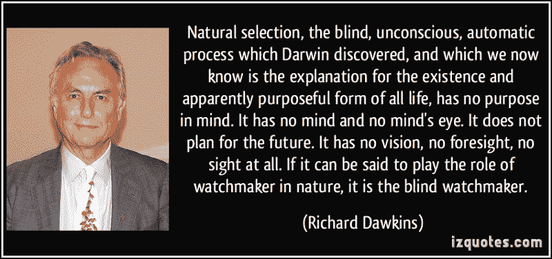

#### **盲人钟表匠**

我遇到的第一批激发我对进化生物学领域兴趣的书之一是理查德·道金斯的《盲人钟表匠》。在本书中，Richard Dawkins 解释了复杂的机制，如[回声定位](https://en.wikipedia.org/wiki/Animal_echolocation)(蝙蝠用来导航、狩猎和觅食的过程，也称为生物声纳)，复杂的结构，如蜘蛛网(蜘蛛用来吸引和捕捉猎物)，以及复杂的仪器，如人眼(你目前正在使用的两个球形物体)是数千年，如果不是数百万年进化和适应的结果。

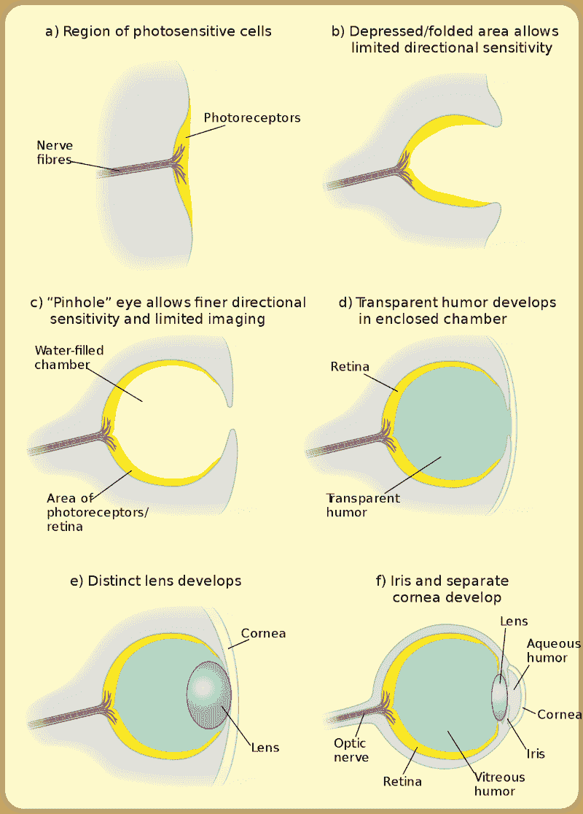

The progressive evolution of the human eye. What started off as simple photosensitive cells, evolved into a complex instrument that we often take completely for granted. The first animals with anything resembling an eye lived about 550 million years ago. And, according to one [scientist’s](https://www.pbs.org/wgbh/evolution/library/01/1/l_011_01.html) calculations, it would only take 364,000 years for a camera-like eye to evolve from a light-sensitive patch.

尽管这些大自然的奇迹给人的印象是它们从一开始就有目的地建造的(即由一个有意识的“制造者”)，但它们实际上只是反复试验和错误的结果，与不断变化的选择压力捆绑在一起(即气候、栖息地或捕食者或猎物的行为和能力的变化)。因此，尽管它们看起来和表现起来像是精确的、前瞻性的工程设计的结果，但它们实际上是完全盲目的过程的结果，这个过程事先不知道完美的“解决方案”会是什么。

#### 什么是遗传算法，我们为什么需要它们？

遗传算法是一种基于基本生物过程的技术，用于生成优化和搜索问题的高质量解决方案。这些算法用于可能的解决方案范围非常大的情况，以及像穷举搜索/蛮力这样的解决问题的更基本方法会消耗太多时间和精力的情况。

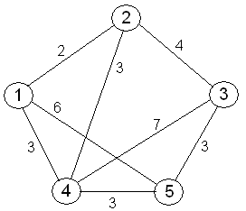

[旅行推销员问题](https://en.wikipedia.org/wiki/Travelling_salesman_problem)提出以下问题:“给定一系列城市和每对城市之间的距离，访问每个城市并返回出发城市的最短可能路线是什么？”这是组合优化中的一个 NP 难问题。

我们可以使用遗传算法为这个问题提供高质量的解决方案，比更原始的问题解决技术成本低得多，比如穷举搜索，这需要你在所有可能的解决方案中进行排列。

#### 遗传算法是如何工作的？

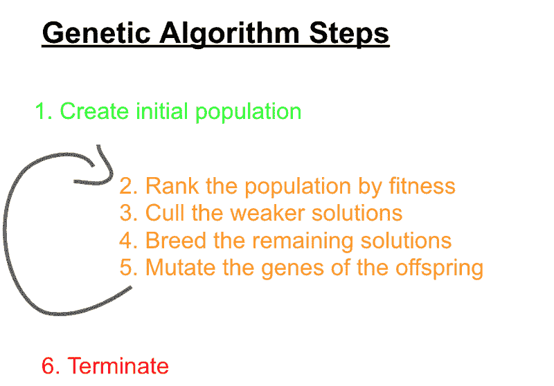

一个算法的工作原理是通过一系列步骤的迭代，直到它到达一个预定义的终止点。遗传算法的每次迭代都会产生新一代的可能解，从理论上讲，这应该是对上一代的改进。

步骤如下:

1.创建 N 个可能解决方案的初始群体(原始汤)

该算法的第一步是创建一组初始解，作为第 0 代中的基础解。这个初始群体中的每个解将携带一组染色体，这些染色体由一组基因组成，其中每个基因被分配给问题的一个可能变量。重要的是，初始种群中的解是用随机分配的基因创建的，以便具有高度的遗传变异。

2.根据适应度对群体的解决方案进行排序(适者生存，第 1 部分)。

在这一步中，算法需要能够确定什么使一个解决方案比另一个解决方案更“适合”。这是由适应度函数决定的。适应度函数的目的是评估群体中解决方案的遗传可行性，将那些具有最可行、最有利和最优越遗传特征的解决方案放在列表的顶部。

在旅行推销员问题中，适应度函数可以是解所行进的总距离的计算。较短的距离相当于较高的健康水平。

3.剔除较弱的解决方案(适者生存，第 2 部分)

在这一步中，算法从群体中删除不太适合的解决方案。“适者”并不一定意味着最强壮、最快或最凶猛，就像人类通常倾向于假设的那样。适者生存简单地说就是一个有机体在环境中生存的条件越好，它就越有可能活得足够长，以繁殖并将其基因传播给下一代。

步骤 3 和 4 统称为**选择**。

4.培育更强的解决方案(适者生存，第 3 部分)

剩下的溶液然后互相配对，以便交配和繁殖后代。在这一过程中，以其最基本的形式，每个父母将把他们基因的%贡献给他们的每个后代(在自然界中是 50/50 的比例)，其中 P1(G)% +P2(G)% = 100%。决定父母的哪些基因将被后代继承的过程被称为**交叉**。

5.突变后代的基因(**突变**

后代将包含一定比例的“母亲”基因，一定比例的“父亲”基因，偶尔会有一个或多个这些基因的“突变”。突变本质上是一种遗传异常，是一种复制错误，导致后代的一个或多个基因与其从父母那里继承的基因不同。在遗传算法中，在某些情况下，突变会增加后代的适应度，在其他情况下，它会降低适应度。

重要的是要注意，不需要每个后代都有突变，所需的突变频率也可以是算法的参数。

在遗传算法中，选择、交叉和变异被称为**遗传算子**。

6.结束

将重复步骤 2 至 5，直到预定的终止点。该终止点可以是以下之一:

1.  已达到最大时间/资源分配。
2.  固定数量的世代已经过去了。
3.  优势解的适合度是任何后代都无法超越的。

#### **解收敛**

1.全局最优

在理想情况下，最适合的解决方案将具有可能的最高适合值，即它将是最优解决方案，这意味着不需要继续该算法并产生更多代。

2.局部最优

在某些情况下，如果算法的参数不合理，种群可能会过早地收敛于一个次优解，这不是我们所追求的全局最优，而是一个局部最优。一旦到了这里，继续算法和产生更多代可能是徒劳的。

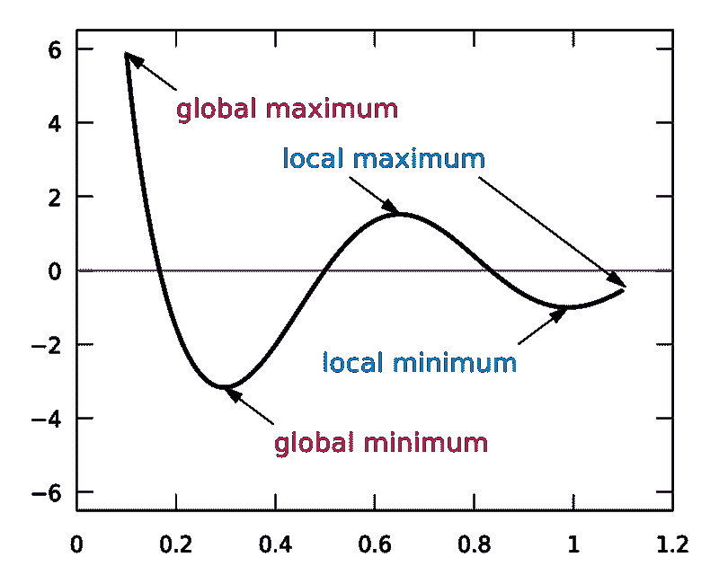

Global optimum vs local optimum

#### 如果没有突变，会发生什么？

乍一看，突变似乎是过程中不必要的、不相关的部分。但是，如果没有随机性这一基本方面，自然选择的进化将完全局限于初始种群所设定的遗传多样性，此后就不会有新的性状引入种群。这将严重阻碍大自然解决问题的能力，地球上的生命将无法“适应”它的环境，至少在生理上是这样。

如果在我们的遗传算法中是这种情况，在我们的模拟中的某个点上，人口的后代将不能探索他们的前辈没有探索的部分解空间。没有任何突变的模拟将严重限制种群内的遗传变异，并且在大多数情况下——取决于初始种群——阻止我们达到全局最优。

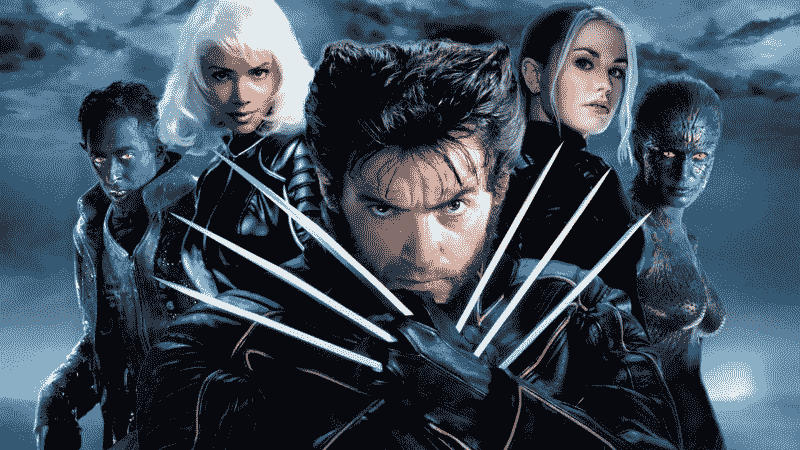

Without mutations, we wouldn’t have mutants, and without mutants, we wouldn’t have the X-men franchise.

#### 如果人口规模不够大，会发生什么？

我最近在普莱滕贝格的朱卡尼野生动物保护区，在那里我有幸见到了一只白虎。他是一只真正威严的动物。他块头很大，看起来很凶猛，而且，他 80%的眼睛都瞎了，随着时间的推移，情况越来越糟。

他为什么是瞎子？因为他是几代近亲繁殖的产物。只有当两只携带控制毛色的隐性基因的老虎在一起繁殖时，才会产生这些白虎。因此，为了确保这些老虎继续被圈养，人们一直在非常有限的数量内饲养这些老虎，以便在马戏团展示它们，在动物园展示它们，或者将它们作为家庭宠物饲养。

但是近亲繁殖的负面影响之一是，你严重限制了物种内的遗传变异，这逐渐增加了有害的隐性性状遗传给后代的机会。

The white tiger that I met at the Jukani Wildlife Sanctuary in April 2019\. He looks majestic, but he is suffering.

即使在野外，近亲繁殖仍然是一个大问题。在过去的几十年里，由于偷猎，南非的犀牛种群受到了严重影响，如果种群数量达到足够低的数量，这将意味着保持这些受威胁的犀牛物种的遗传多样性将极其困难。因此，即使偷猎没有完全导致它们灭绝，近亲繁殖也有可能。

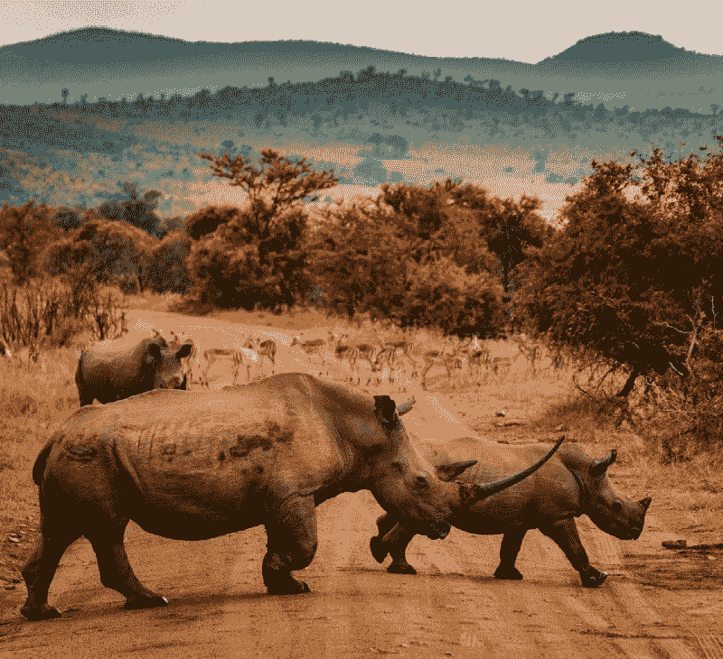

Photo by [redcharlie](https://unsplash.com/photos/xtvo0ffGKlI?utm_source=unsplash&utm_medium=referral&utm_content=creditCopyText) on [Unsplash](https://unsplash.com/search/photos/black-rhino?utm_source=unsplash&utm_medium=referral&utm_content=creditCopyText).

当然，人类对近亲繁殖并不陌生。我们自己物种内部持续近亲繁殖的一个著名结果是西班牙的查尔斯二世。

西班牙哈布斯堡国王卡洛斯二世可悲地堕落了，有一个巨大畸形的脑袋。他的哈布斯堡下巴突出得太多，他的两排牙齿无法接触；他无法咀嚼。他的舌头太大，几乎说不出话来。他的智力也同样残疾。”

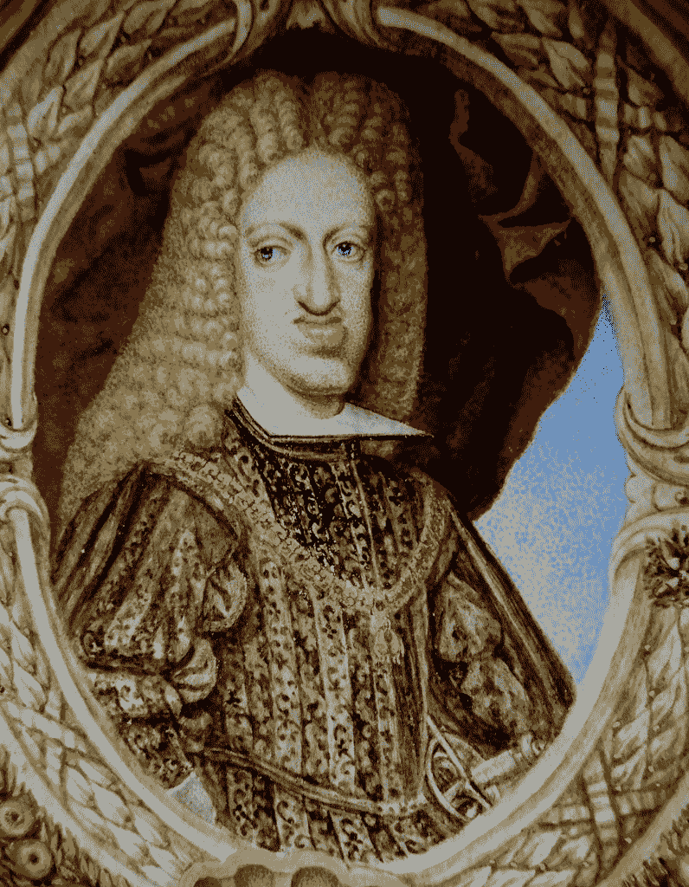

*The Habsburg King Charles II of Spain.* His father was his mother’s uncle, making Charles their son, great-nephew and first-cousin respectively.

“近亲繁殖”在我们的遗传算法中，本质上意味着繁殖具有非常相似的基因构成的解决方案，谢天谢地，在这种情况下，不会产生具有任何身体异常倾向的后代。但是如果**种群非常小**并且如果**所有的解共享一个非常相似的基因组成**，那么种群的后代的适应性将会受到严重限制。这意味着，如果我们真的达到了目标，可能需要更长的时间才能收敛到全局最优解。

近亲繁殖并不总是坏事，只是看你处于模拟的哪个阶段。在模拟的非常高级的阶段，随着种群向全局/局部最优值收敛，显然很难避免近亲繁殖，因为在某些情况下，许多主导解将彼此非常相似，因此，将共享许多相同的遗传特征。

#### 包扎

好的，那应该包括基本的。如果您有任何问题、请求或基因突变要贡献，请在下面留下评论。

在下一篇文章中，我们将深入研究一些代码，看看上面概述的每个遗传算子在编程世界中是如何发挥作用的。我将 Ruby 编程语言用于我从事的软件模拟，在其中，我展示了如何在仅仅几代时间内，遗传算法就可以从最初收集的完全的胡言乱语中产生预定义的单词或短语。所有的代码都将存放在 Github 上。