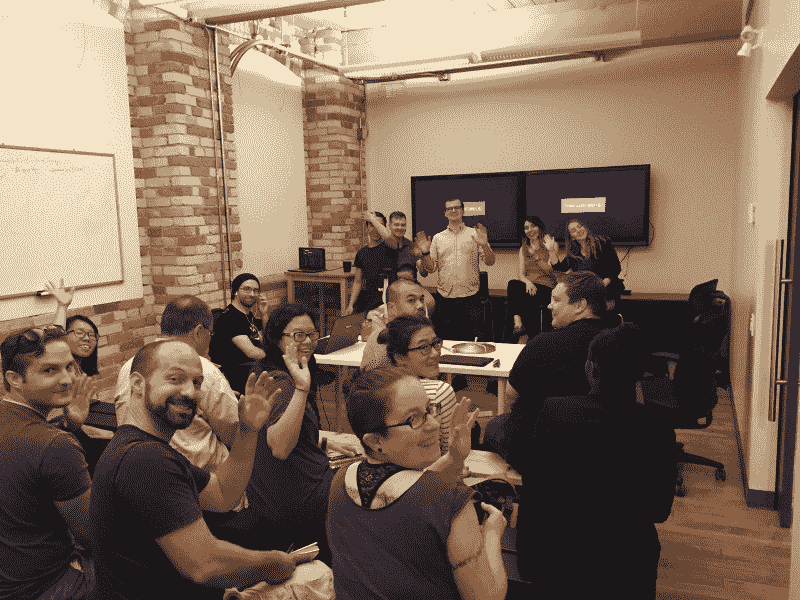
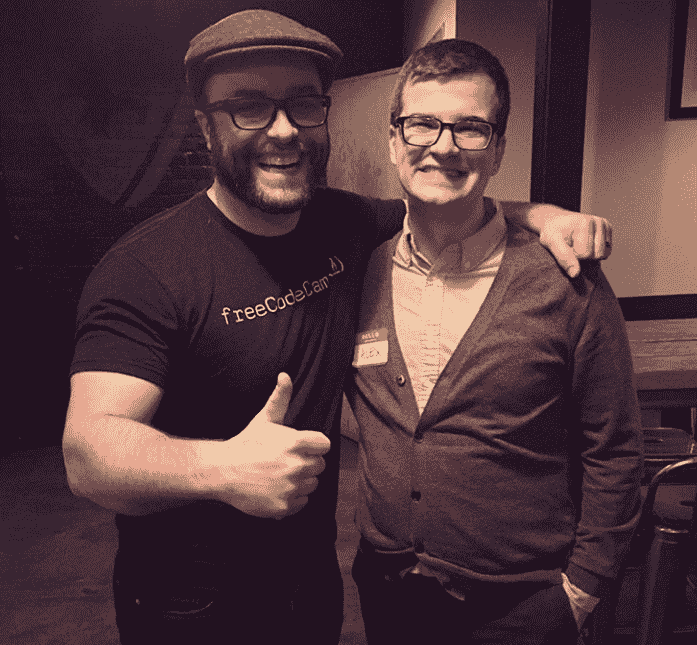

# #100DaysOfCode 挑战，它的历史，以及为什么你应该在 2021 年尝试它

> 原文：<https://www.freecodecamp.org/news/the-crazy-history-of-the-100daysofcode-challenge-and-why-you-should-try-it-for-2018-6c89a76e298d/>

早在 2016 年 6 月，我收到了一封来自一位名叫亚历山大·卡拉威(Alexander Kallaway)的开发者的电子邮件。

我知道亚历克斯，因为他创建了自由代码营多伦多学习小组。它是加拿大最活跃的学习小组之一，每周都吸引大批开发人员。

但是亚历克斯没有给我写信说多伦多学习小组的事。他给我写信是因为他想告诉我他梦想的耐力挑战。

挑战是这样的:亚历克斯想在接下来的 100 天里每天至少花一个小时编码。

Comic by [Sarah Andersen](https://www.facebook.com/DoodleTimeSarah/).

亚历克斯写了一篇文章解释他的挑战规则，并公开承诺挑战。他希望其他一些人会阅读他的文章，并加入他的挑战。

他想出了一个 Twitter 标签来搭配它: [#100DaysOfCode](https://twitter.com/search?f=tweets&vertical=default&q=%23100daysofcode&src=typd) 。

“Oh! Hi!” One of the freeCodeCamp events in Toronto, the city where the #100DaysOfCode Challenge was born. Photo by Justin Richardson.

我一点也不知道 18 个月后，成千上万的人每天会在推特上发布这个标签数百次。

今天，承诺参加#100DaysOfCode 挑战的人使用这个标签来分享他们的进展、项目和他们达到的里程碑——比如获得他们的第一份开发人员工作。

那么 Alex 是如何从一个想要提高自己编码技能的孤独开发者转变成一个涉及成千上万开发者的全球运动的领导者的呢？

### 亚历山大·卡拉威到底是谁？

几年前，亚历克斯还只是俄罗斯的一名高中生。他热衷于外语，学习英语和日语。他的热情最终带他去了日本，在日本的一所大学继续他的学业。

在日本的一天，亚历克斯在书架上发现了一本英文版的《每周 4 小时工作制》。他说，这本书让他看到了企业家精神，以及任何人都可以启动一个产生重大影响的项目的概念——不仅仅是传统的“商人”

他想出了一个搬到加拿大的办法，这样他就可以上商学院了。

就是在那里，他未来的妻子安娜找到了他，想要了解更多关于出国留学的事情，以及他是如何做到的。她现在和亚历克斯住在多伦多。

Alex and his wife Anna at Hong Kong Disneyland.

2014 年，Alex 完成了商学院的学业，开始了数字营销的职业生涯。

但是 Alex 在工作中与他周围的开发人员的互动让他意识到了一些重要的事情。他缺少一项核心创业技能。他需要学习编码。

亚历克斯没有真正的编程经验。他没有足够的时间和金钱去参加一个编码训练营，更不用说回到学校去获得一个计算机科学学位了。

但他还是决定学习编码。每天下班后，亚历克斯都会利用免费的在线资源自学编程。

在使用 freeCodeCamp 时，他决定和其他朋友一起编写代码，以承担更多的社会责任。他试图加入多伦多的一个自由代码营组织，但那里没有。所以他创造了一个。

通过他组织活动的努力，自由代码营多伦多学习小组迅速扩大。这个小组开始在咖啡店开会。很快它就占据了整个办公室空间。它最终在附近的一个合作空间找到了一个永久的场地。

通过多伦多 freeCodeCamp，Alex 和几十个想学习编程的志同道合的人成为了朋友。

他所有的努力都得到了回报。由于他新获得的技能和庞大的开发人员网络，Alex 得到了他的第一份开发人员工作。

在那个时候，很容易变得自满。他已经到了。

他有一份有趣的工作。他赚了很多钱。他交了这么多朋友。他“成功了”他是一名俄罗斯侨民，在加拿大最大、最具竞争力的城市获得了成功。

但亚历克斯知道，如果他想实现自己的创业抱负，他需要不断拓展自己的技能。他能感觉到自己的技能达到了顶峰。在漫长的一天工作之后，放松一下，看看电视，或者和朋友出去逛逛是很有诱惑力的。

亚历克斯回忆道:

> “100DaysOfCode 的想法最初来自于我个人的挫败感，我无法在工作之余坚持学习编程。我会找些其他不那么复杂的活动来消磨时间，比如狂看电视连续剧。有一天，我和妻子安娜坐在一家餐馆里，向她倾诉我的挫折。我建议，也许我应该公开承诺每天至少学习一个小时，我想我会去 3 个月。
> 
> 安娜说这是个好主意，并问道:“但为什么在 3 个月后就停止呢？”你应该把它变成 100 天！“听起来更好，”"

### #100DaysOfCode 挑战赛诞生了

I got to hang out with Alexander Kallaway in person in Toronto.

#100DaysOfCode 将作为一种承诺手段，迫使亚历克斯每天下班后都要编码，即使他想看电视。

他需要清楚地说明挑战的规则是什么，这样他以后就不能篡改规则了。

所以他创造了第一条规则:你承诺在接下来的 100 天里每天至少花 1 小时编码。

亚历克斯痴迷于生产力，并养成积极的习惯。他读过很多关于习惯养成的书。他推荐阅读的一些相关书籍有:

*   [艺术之战:赢得内心创意之战](https://www.amazon.com/gp/product/B005CFS8R0/ref=as_li_tl?ie=UTF8&camp=1789&creative=9325&creativeASIN=B005CFS8R0&linkCode=as2&tag=out0b4b-20&linkId=570b829f1e6f6ebf8a2fb6a65a8c5500)
*   习惯的力量:为什么我们在生活和工作中会这样做
*   障碍在于方式:将考验转化为胜利的永恒艺术

亚历克斯想到了我们的动力是如何来自我们的朋友和家人。我们需要社会责任感。

就在那时，他意识到这个挑战可能是社会性的，他参与的人越多，任何一个参与者就越有可能成功并度过第 100 天。

所以他创造了第二条规则:你承诺用 Twitter 鼓励至少两个每天接受挑战的人。

正如亚历克斯所说:

> “这个系统可以帮助抵消我自然想出的不做我应该做的事情的所有借口。挑战就是这样诞生的——几条简单的规则，社会责任，仅此而已。责任感是试图改变你生活某些方面的最重要因素之一。”

从一开始，Alex 就承认学习编码很难。但是我们的朋友可以帮助我们在挫折中前进。

> “很多时候，你会觉得自己已经受够了。或者你会觉得你的进展太慢，或者你绝望地停滞不前。这些都是足够严肃的辞职理由。或者至少你是这么告诉自己的。但是如果你和同路的人联系在一起，你就可以分享旅途中的起起落落，一起克服所有这些障碍。与和你同路的志趣相投的人分享你的挫折、学习经历、胜利。通过分享这些，你会渐渐明白:“不仅仅是我。”"

### 为什么#100DaysOfCode 是一个比人们承诺的大多数新年决心更现实的目标

#100DaysOfCode 挑战赛只有 100 天，不到一年的三分之一。有一大群人为你加油。

结果，许多人不仅完成了挑战——他们还会第二次尝试！

所以亚历克斯想出了“回合”的概念这些都是通过推特来表示的，告诉你哪一天(第一天)和你尝试了多少次挑战(第一轮)。

他采用了一种新的每日进展推文格式:**R1 D1**——意思是 **R** 发现**1**Day**1**。

> “有一个内部笑话就是从这种格式中诞生的:在第二轮的第二天——R2D2——人们在他们的每日进度推特上发布了心爱的 R2D2 星球大战机器人的照片或 gif。”

如果你在 Twitter 上滚动[的#100DaysOfCode 标签，你会看到人们已经完成了几轮的情况。](https://twitter.com/search?f=tweets&vertical=default&q=%23100daysofcode&src=typd)

但是 Alex 建议从一个 100 天的承诺开始，并以此为起点。他还建议一开始就保持简单。

> “新年决心不起作用是因为人们承诺过多。确保这是你唯一想要养成的习惯。”

他还说，如果出现意想不到的事情也没关系，你不能一天都写代码。

> “如果你要旅行 2-3 天而不会编码，那就带本关于编码的书去读吧。如果你每天只能抽出 20 分钟，那就去做吧。让挑战成为你自己的。我希望你保持神圣的唯一规则是你必须每天编码。你可以因为计划外的情况在这里或那里跳过一天，但不能更多。我们的目标是变得始终如一，不管生活会给你带来什么。”

如果你对提高你的动力感兴趣，你应该接受挑战。首先，在推特上发布你对挑战的承诺。

[点击此处公开参加#100DaysOfCode 挑战](https://twitter.com/intent/tweet?text=I%27m%20publicly%20committing%20to%20the%20%23100DaysOfCode%20Challenge%20starting%20today.%20Join%20me!&url=https://medium.freecodecamp.org/the-crazy-history-of-the-100daysofcode-challenge-and-why-you-should-try-it-for-2018-6c89a76e298d&hashtags=100DaysOfCode)😇

然后你可以分叉 [#100DaysOfCode GitHub 库](https://github.com/Kallaway/100-days-of-code)作为你每天进度的日志。

挑战的一大好处是，你不需要等到新年才去接受挑战。

人们每天都在开始挑战，所以会有比你先开始的人为你加油。

然后你可以转过身去，为跟在你后面起跑的人加油。

这些令人鼓舞的推文和对你项目的反馈可以极大地激励你。我和很多人谈过，他们说#100DaysOfCode 挑战帮助他们突破了阻碍他们编码几个月的障碍。社会责任方面创造了奇迹。

### 从哪里了解更多信息

Alex 做了一些很棒的播客采访，他详细讲述了#100DaysOfCode 挑战:

*   [亚历克斯在 CodeNewbie 播客上](https://www.codenewbie.org/podcast/100-days-of-code)
*   [亚历克斯在播客《跟我学编程》上](https://learntocodewith.me/podcast/100-days-of-code-with-alexander-kallaway/)

也可以去看看他们的官网:[100daysofcode.com](http://www.100daysofcode.com)

并且[阅读 Alex 的文章](https://medium.freecodecamp.org/take-the-100daysofcode-challenge-make-coding-a-habit-4a655d8663fd)关于挑战的一些改进。

即使你不想接受挑战，你也应该尽可能多的花时间写代码。

归根结底，这都是实践的结果。

> "你编码的每一天都是你成功的一天."—亚历山大·卡拉威