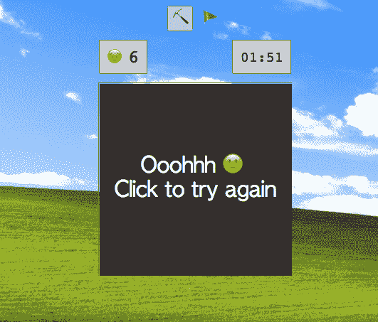
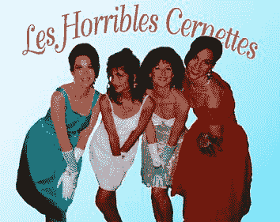
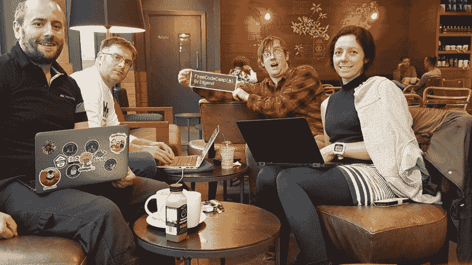

# 巴厘岛巴洛的 CSS 天才

> 原文：<https://www.freecodecamp.org/news/the-css-genius-of-bali-balo-30abd36a3d22/>

今天，法国设计师兼开发商 Bali Balo[发表了一件新作品](https://fcc.im/2t3kQ5x):一个悬浮在黑暗中的立方体，它可以自己旋转。事实上，它展现了不同的一面，每一面都让我们得以一窥不同的世界:

*   3D 乒乓游戏
*   立方体倾斜时滑动的嵌套三维形状
*   一片星空呼啸而过，仿佛以接近光速的速度行驶
*   一个似乎永远在太空中翻滚的超现实人形

[Bali Balo 在 CodePen](https://fcc.im/2t2CGoV) 上出名不仅仅是因为这些对几何学的探索，更是因为打造了一款纯 CSS 的扫雷游戏。

没错——一款功能齐全的扫雷游戏——就像几十年来预装在 Windows 上的那个一样。

您可以[在这里](https://fcc.im/2rik9DY)播放它，并看到它确实在不使用 JavaScript 的情况下运行。

如果你有时间，我鼓励你读一读 Preethi Kasireddy 对帮助创建 CodePen 平台的 Chris Coyier 的精彩采访:( [17 分钟阅读](https://fcc.im/2s1LY6o)

### 以下是其他三个值得你花时间去做的链接:

1.  亚洲拼车初创公司 Grab 的 500 多名工程师使用该指南来跟上前端开发的变化( [22 分钟阅读](https://fcc.im/2spxFsP)
2.  令牌网络效应:去中心化网络的新商业模式( [6 分钟阅读](https://fcc.im/2sbfXHy)
3.  是的——有些 Coursera 课程仍然是免费的。你只需要知道如何访问它们。以下是方法。( [6 分钟读数](https://fcc.im/2rwQ4zI))

### 想到这一天:

> “我在我所谓的‘汤姆·索威林’上相当成功；它的意思是，如果你想粉刷你的篱笆，你就和与你一起工作的人交换有价值的东西。你必须致力于他们以及你自己的成功。”—查尔斯·泰克

帮助创造了鼠标、激光打印机和以太网等技术的查尔斯·泰克于本周去世。ACM 为他发布了这条讣告:( [6 分钟阅读](https://fcc.im/2tnt5bY)

### 每日一图:

“可怕的欧洲核子研究中心女孩”是第一张在万维网上发布的图片。这张照片展示了一个完全由 CERN 员工组成的流行四重奏。

你可以在网上阅读图像的历史，以及它们最初是如何被提出的，这里:( [4 分钟阅读](https://fcc.im/2spyZfo))

### 今日学习小组:

[英国布里真德自由代码营](https://fcc.im/2stFJcX)

编码快乐！

–昆西·拉森，自由代码营的老师

如果你从这些邮件中获得了价值，请考虑[支持我们的非营利组织](http://bit.ly/donate-to-fcc)。