# CSS 手册:开发人员使用 CSS 的便捷指南

> 原文：<https://www.freecodecamp.org/news/the-css-handbook-a-handy-guide-to-css-for-developers-b56695917d11/>

我写这篇文章是为了帮助你快速学习 CSS，熟悉高级 CSS 主题。

CSS 通常很快被开发人员认为是一件容易学习的事情，或者是当你需要快速设计页面或应用程序的样式时你只需要学会的事情。由于这个原因，它经常是在飞行中学习，或者当我们必须使用它们时，我们孤立地学习。当我们发现这个工具不能简单地做我们想要的事情时，这可能是一个巨大的挫折来源。

这篇文章将帮助你快速掌握 CSS，并对你可以用来设计你的页面和应用程序的主要现代特性有一个大致的了解。

我希望能帮助你熟悉 CSS，并让你快速掌握使用这个令人敬畏的工具，让你在网络上创造出令人惊叹的设计。

**[点击这里获取这篇帖子的 PDF / ePub / Mobi 版本离线阅读](https://flaviocopes.com/page/css-handbook)**

CSS 是层叠样式表的简写，是网络的主要构件之一。它的历史可以追溯到 90 年代，随着 HTML 的发展，它已经从最初的不起眼开始发生了很大的变化。

在 CSS 出现之前，我就已经开始创建网站了，所以我看到了它的发展。

CSS 是一个令人惊叹的工具，在过去的几年里，它有了很大的发展，引入了许多奇妙的功能，如 CSS Grid、Flexbox 和 CSS 自定义属性。

这本手册面向广大读者。

首先，初学者。我以简洁但全面的方式从零开始解释 CSS，所以你可以使用这本书从基础开始学习 CSS。

然后，专业的。CSS 通常被认为是次要的东西，尤其是对于 JavaScript 开发者来说。他们知道 CSS 不是真正的编程语言，他们是程序员，因此他们不应该以正确的方式学习 CSS。我也为你写了这本书。

接下来，那些知道 CSS 几年但没有机会学习新东西的人。我们将广泛讨论 CSS 的新特性，这些新特性将构建未来十年的网络。

CSS 在过去的几年里有了很大的改进，并且发展很快。

即使你不以写 CSS 为生，当你不时需要理解它的时候，知道 CSS 是如何工作的也能帮你省去一些麻烦，例如在调整网页的时候。

感谢你得到这本电子书。我的目标是给你一个快速而全面的 CSS 概述。

弗拉维奥

你可以通过电子邮件在 flavio@flaviocopes.com 联系我，在推特上联系我。

我的网站是 flaviocopes.com。

## 目录

*   [CSS 简介](https://www.freecodecamp.org/news/the-css-handbook-a-handy-guide-to-css-for-developers-b56695917d11/www.freecodecamp.org/news/the-css-handbook-a-handy-guide-to-css-for-developers-b56695917d11/#introduction-to-css)
*   [CSS 简史](https://www.freecodecamp.org/news/the-css-handbook-a-handy-guide-to-css-for-developers-b56695917d11/#a-brief-history-of-css)
*   [给 HTML 页面添加 CSS](https://www.freecodecamp.org/news/the-css-handbook-a-handy-guide-to-css-for-developers-b56695917d11/#adding-css-to-an-html-page)
*   [选择器](https://www.freecodecamp.org/news/the-css-handbook-a-handy-guide-to-css-for-developers-b56695917d11/#selectors)
*   [级联](https://www.freecodecamp.org/news/the-css-handbook-a-handy-guide-to-css-for-developers-b56695917d11/#cascade)
*   [特异性](https://www.freecodecamp.org/news/the-css-handbook-a-handy-guide-to-css-for-developers-b56695917d11/#specificity)
*   [继承](https://www.freecodecamp.org/news/the-css-handbook-a-handy-guide-to-css-for-developers-b56695917d11/#inheritance)
*   [导入](https://www.freecodecamp.org/news/the-css-handbook-a-handy-guide-to-css-for-developers-b56695917d11/#import)
*   [属性选择器](https://www.freecodecamp.org/news/the-css-handbook-a-handy-guide-to-css-for-developers-b56695917d11/#attribute-selectors)
*   [伪类](https://www.freecodecamp.org/news/the-css-handbook-a-handy-guide-to-css-for-developers-b56695917d11/#pseudo-classes)
*   [伪元素](https://www.freecodecamp.org/news/the-css-handbook-a-handy-guide-to-css-for-developers-b56695917d11/#pseudo-elements)
*   [颜色](https://www.freecodecamp.org/news/the-css-handbook-a-handy-guide-to-css-for-developers-b56695917d11/#colors)
*   [单位](https://www.freecodecamp.org/news/the-css-handbook-a-handy-guide-to-css-for-developers-b56695917d11/#units)
*   [网址](https://www.freecodecamp.org/news/the-css-handbook-a-handy-guide-to-css-for-developers-b56695917d11/#url)
*   [CALC](https://www.freecodecamp.org/news/the-css-handbook-a-handy-guide-to-css-for-developers-b56695917d11/#calc)
*   [背景](https://www.freecodecamp.org/news/the-css-handbook-a-handy-guide-to-css-for-developers-b56695917d11/#backgrounds)
*   [评论](https://www.freecodecamp.org/news/the-css-handbook-a-handy-guide-to-css-for-developers-b56695917d11/#comments)
*   [自定义属性](https://www.freecodecamp.org/news/the-css-handbook-a-handy-guide-to-css-for-developers-b56695917d11/#custom-properties)
*   [FONTS](https://www.freecodecamp.org/news/the-css-handbook-a-handy-guide-to-css-for-developers-b56695917d11/#fonts)
*   [排版](https://www.freecodecamp.org/news/the-css-handbook-a-handy-guide-to-css-for-developers-b56695917d11/#typography)
*   [箱型](https://www.freecodecamp.org/news/the-css-handbook-a-handy-guide-to-css-for-developers-b56695917d11/#box-model)
*   [边框](https://www.freecodecamp.org/news/the-css-handbook-a-handy-guide-to-css-for-developers-b56695917d11/#border)
*   [填充](https://www.freecodecamp.org/news/the-css-handbook-a-handy-guide-to-css-for-developers-b56695917d11/#padding)
*   [边距](https://www.freecodecamp.org/news/the-css-handbook-a-handy-guide-to-css-for-developers-b56695917d11/#margin)
*   [盒子尺寸](https://www.freecodecamp.org/news/the-css-handbook-a-handy-guide-to-css-for-developers-b56695917d11/#box-sizing)
*   [显示](https://www.freecodecamp.org/news/the-css-handbook-a-handy-guide-to-css-for-developers-b56695917d11/#display)
*   [定位](https://www.freecodecamp.org/news/the-css-handbook-a-handy-guide-to-css-for-developers-b56695917d11/#positioning)
*   [浮动和清算](https://www.freecodecamp.org/news/the-css-handbook-a-handy-guide-to-css-for-developers-b56695917d11/#floating-and-clearing)
*   [Z 向步进](https://www.freecodecamp.org/news/the-css-handbook-a-handy-guide-to-css-for-developers-b56695917d11/#z-index)
*   [CSS 网格](https://www.freecodecamp.org/news/the-css-handbook-a-handy-guide-to-css-for-developers-b56695917d11/#css-grid)
*   [柔性盒](https://www.freecodecamp.org/news/the-css-handbook-a-handy-guide-to-css-for-developers-b56695917d11/#flexbox)
*   [表格](https://www.freecodecamp.org/news/the-css-handbook-a-handy-guide-to-css-for-developers-b56695917d11/#tables)
*   [定心](https://www.freecodecamp.org/news/the-css-handbook-a-handy-guide-to-css-for-developers-b56695917d11/#centering)
*   [列表](https://www.freecodecamp.org/news/the-css-handbook-a-handy-guide-to-css-for-developers-b56695917d11/#lists)
*   [媒体询问和响应设计](https://www.freecodecamp.org/news/the-css-handbook-a-handy-guide-to-css-for-developers-b56695917d11/#media-queries-and-responsive-design)
*   [功能查询](https://www.freecodecamp.org/news/the-css-handbook-a-handy-guide-to-css-for-developers-b56695917d11/#feature-queries)
*   [过滤器](https://www.freecodecamp.org/news/the-css-handbook-a-handy-guide-to-css-for-developers-b56695917d11/#filters)
*   [变换](https://www.freecodecamp.org/news/the-css-handbook-a-handy-guide-to-css-for-developers-b56695917d11/#transforms)
*   [跃迁](https://www.freecodecamp.org/news/the-css-handbook-a-handy-guide-to-css-for-developers-b56695917d11/#transitions)
*   [动画](https://www.freecodecamp.org/news/the-css-handbook-a-handy-guide-to-css-for-developers-b56695917d11/#animations)
*   [标准化 CSS](https://www.freecodecamp.org/news/the-css-handbook-a-handy-guide-to-css-for-developers-b56695917d11/#normalizing-css)
*   [错误处理](https://www.freecodecamp.org/news/the-css-handbook-a-handy-guide-to-css-for-developers-b56695917d11/#error-handling)
*   [厂商前缀](https://www.freecodecamp.org/news/the-css-handbook-a-handy-guide-to-css-for-developers-b56695917d11/#vendor-prefixes)
*   [用于打印的 CSS](https://www.freecodecamp.org/news/the-css-handbook-a-handy-guide-to-css-for-developers-b56695917d11/#css-for-print)
*   [结束](https://www.freecodecamp.org/news/the-css-handbook-a-handy-guide-to-css-for-developers-b56695917d11/#wrapping-up)

### CSS 简介

CSS(T2 层叠样式表的缩写)是一种语言，我们用它来设计一个 HTML 文件，并告诉浏览器它应该如何在页面上呈现元素。

> 在这本书里，我专门讨论 HTML 文档的样式，尽管 CSS 也可以用来设计其他东西的样式。

一个 CSS 文件包含几个 CSS 规则。

每个规则由两部分组成:

*   **选择器**
*   **声明块**

选择器是一个字符串，它标识页面上的一个或多个元素，遵循一种特殊的语法，我们很快将详细讨论这种语法。

声明块包含一个或多个**声明**，依次由一个**属性**和**值**对组成。

这些都是我们在 CSS 中拥有的东西。

仔细组织属性，关联它们的值，并使用选择器将它们附加到页面的特定元素上，这是这本电子书的全部论点。

#### CSS 看起来怎么样

一个 CSS **规则集**有一部分叫做**选择器**，另一部分叫做**声明**。该声明包含各种**规则**，每个规则由一个**属性**和一个**值**组成。

在这个例子中，`p`是选择器，并且应用一个规则将值`20px`设置到`font-size`属性:

```
p {
  font-size: 20px;
}
```

多个规则一个接一个堆叠在一起:

```
p {
  font-size: 20px;
}

a {
  color: blue;
}
```

选择器可以针对一个或多个项目:

```
p, a {
  font-size: 20px;
}
```

它还可以定位 HTML 标签，如上所述，或者包含带有`.my-class`的某个类属性的 HTML 元素，或者具有带有`#my-id`的特定`id`属性的 HTML 元素。

更高级的选择器允许您选择属性与特定值匹配的项目，或者响应伪类的项目(稍后将详细介绍)

#### 分号

每个 CSS 规则都以分号结束。分号是**而不是**可选的，除了在最后一个规则之后。但是我建议始终使用它们以保持一致性，并且避免在添加另一个属性时忘记在前一行添加分号而出错。

#### 格式和缩进

格式没有固定的规则。这个 CSS 是有效的:

```
p
      {
  font-size:           20px   ;
                      }

a{color:blue;}
```

但是看起来很痛苦。坚持一些约定，就像你在上面的例子中看到的那样:将选择器和右括号放在左边，每个规则缩进 2 个空格，将左括号放在选择器的同一行上，用一个空格隔开。

正确和一致地使用间距和缩进有助于理解代码。

### CSS 简史

在继续之前，我想简要回顾一下 CSS 的历史。

CSS 是出于设计网页样式的需要而发展起来的。在 CSS 被引入之前，人们希望有一种方式来设计他们的网页，这些网页看起来都非常相似，并且在当时是“学术性的”。你不能在个性化方面做太多。

HTML 3.2 引入了将颜色内联定义为 HTML 元素属性的选项，以及像`center`和`font`这样的表示性标签，但这很快升级到了一个远非理想的情况。

CSS 让我们将所有与表示相关的内容从 HTML 转移到 CSS 中，这样 HTML 就可以重新成为定义文档结构的格式，而不是在浏览器中的外观。

CSS 在不断发展，随着新的惯用 CSS 技术的出现和浏览器的变化，你 5 年前使用的 CSS 可能已经过时了。

很难想象 CSS 诞生的时代，web 是多么的与众不同。

At the time, we had several competing browsers, the main ones being Internet Explorer or Netscape Navigator.

页面是用 HTML 设计的，带有特殊的表示标签，如`bold`和特殊的属性，其中大部分现在都被废弃了。

这意味着您的定制机会有限。

大部分样式决定都留给了浏览器。

此外，您还专门为其中一家公司建立了一个网站，因为每家公司都引入了不同的非标准标签，以提供更多的功能和机会。

很快，人们意识到需要一种可以在所有浏览器上工作的方式来设计页面。

在 1994 年提出最初的想法后，CSS 于 1996 年发布了第一版，即 CSS Level 1(“CSS 1”)建议。

CSS Level 2(“CSS 2”)于 1998 年发布。

从那时起，CSS 级别 3 的工作就开始了。CSS 工作组决定将每一个特性分开，在模块中单独工作。

浏览器在实现 CSS 方面并不是特别快。我们不得不等到 2002 年才有第一款浏览器实现了完整的 CSS 规范:IE for Mac，正如这篇 CSS 技巧的帖子所描述的:[https://css-tricks.com/look-back-history-css/](https://css-tricks.com/look-back-history-css/)

Internet Explorer 从一开始就错误地实现了盒子模型，这导致了多年来试图在不同浏览器中一致应用相同样式的痛苦。我们不得不使用各种技巧和方法让浏览器呈现我们想要的东西。

今天，事情要好得多。大多数时候，我们可以使用 CSS 标准，而不用考虑一些奇怪的东西，CSS 从未如此强大过。

我们现在已经没有 CSS 的官方发布号了，但是 CSS 工作组发布了一些模块的“快照”,这些模块目前被认为是稳定的，可以包含在浏览器中。这是 2018 年的最新快照:[https://www.w3.org/TR/css-2018/](https://www.w3.org/TR/css-2018/)

CSS Level 2 仍然是我们今天编写的 CSS 的基础，我们在它的基础上构建了更多的特性。

### 向 HTML 页面添加 CSS

CSS 以不同的方式附加到 HTML 页面。

#### 1:使用`link`标签

标签是包含一个 CSS 文件的方法。这是使用 CSS 的首选方式:一个 CSS 文件包含在站点的所有页面中，更改该文件中的一行会影响站点中所有页面的显示。

要使用这种方法，您需要添加一个带有`href`属性的`link`标签，该标签指向您想要包含的 CSS 文件。你把它添加到站点的`head`标签里面(不是在`body`标签里面):

```
<link rel="stylesheet" type="text/css" href="myfile.css">
```

`rel`和`type`属性也是必需的，因为它们告诉浏览器我们链接的是哪种文件。

#### 2:使用`style`标签

我们可以直接将 CSS 添加到`style`标签中，而不是使用`link`标签指向包含 CSS 的单独样式表。这是语法:

```
<style>
...our CSS...
</style>
```

使用这种方法，我们可以避免创建一个单独的 CSS 文件。我发现在将 CSS“正式化”到一个单独的文件之前，或者在一个文件中添加一行特殊的 CSS 之前，这是一个很好的实验方法。

#### 3:内嵌样式

内联样式是向页面添加 CSS 的第三种方式。我们可以给任何 HTML 标签添加一个`style`属性，并在其中添加 CSS。

```
<div style="">...</div>
```

示例:

```
<div style="background-color: yellow">...</div>
```

### 选择器

选择器允许我们将一个或多个声明与页面上的一个或多个元素相关联。

#### 基本选择器

假设页面上有一个`p`元素，我们想用黄色显示其中的单词。

我们可以使用这个选择器`p`**将**元素作为目标，它将页面中使用`p`标签所有元素作为目标。实现我们想要的一个简单的 CSS 规则是:

```
p {
  color: yellow;
}
```

每个 HTML 标签都有一个对应的选择器，例如:`div`、`span`、`img`。

如果一个选择器匹配多个元素，页面中的所有元素都会受到更改的影响。

HTML 元素有两个属性，它们在 CSS 中非常常用，用来将样式与页面上的特定元素相关联:`class`和`id`。

这两者有一个很大的区别:在一个 HTML 文档中，你可以在多个元素中重复相同的`class`值，但是你只能使用一次`id`。作为推论，使用类，您可以选择一个具有两个或更多特定类名的元素，这在使用 ids 时是不可能的。

类用`.`符号标识，而 id 用`#`符号标识。

使用类的示例:

```
<p class="dog-name">
  Roger
</p>

.dog-name {
  color: yellow;
}
```

使用 id 的示例:

```
<p id="dog-name">
  Roger
</p>

#dog-name {
  color: yellow;
}
```

#### 组合选择器

到目前为止，我们已经看到了如何定位一个元素、一个类或一个 id。让我们介绍更强大的选择器。

#### 以具有类或 id 的元素为目标

您可以将附加了类或 id 的特定元素作为目标。

使用类的示例:

```
<p class="dog-name">
  Roger
</p>

p.dog-name {
  color: yellow;
}
```

使用 id 的示例:

```
<p id="dog-name">
  Roger
</p>

p#dog-name {
  color: yellow;
}
```

如果类或 id 已经提供了指向该元素的方法，为什么还要这样做呢？你可能需要这样做才能更具体。我们稍后会看到这意味着什么。

#### 针对多个类别

如前所述，您可以使用`.class-name`将特定类的元素作为目标。通过组合用点分隔的类名，不加空格，可以将一个元素定位于两个(或更多)类。

示例:

```
<p class="dog-name roger">
  Roger
</p>

.dog-name.roger {
  color: yellow;
}
```

#### 组合类和 id

同样，您可以组合一个类和一个 id。

示例:

```
<p class="dog-name" id="roger">
  Roger
</p>

.dog-name#roger {
  color: yellow;
}
```

#### 分组选择器

您可以组合选择器，将相同的声明应用于多个选择器。为此，请用逗号将它们分隔开。

示例:

```
<p>
  My dog name is:
</p>
<span class="dog-name">
  Roger
</span>

p, .dog-name {
  color: yellow;
}
```

您可以在这些声明中添加空格，使它们更加清晰:

```
p,
.dog-name {
  color: yellow;
}
```

#### 跟随带有选择器的文档树

我们已经看到了如何通过使用标签名、类或 id 来定位页面中的元素。

您可以通过组合多个项目来创建更具体的选择器，以遵循文档树结构。例如，如果您有一个嵌套在`p`标签中的`span`标签，那么您可以将该标签作为目标，而无需将样式应用于不包含在`p`标签中的`span`标签:

```
<span>
  Hello!
</span>
<p>
  My dog name is:
  <span class="dog-name">
    Roger
  </span>
</p>

p span {
  color: yellow;
}
```

看看我们如何在两个标记`p`和`span`之间使用空格。

即使右边的元素有多级深度，这也是有效的。

为了使第一级的依赖更加严格，可以在两个标记之间使用`>`符号:

```
p > span {
  color: yellow;
}
```

在这种情况下，如果一个`span`不是`p`元素的第一个子元素，就不会应用新的颜色。

直系子女将应用该样式:

```
<p>
  <span>
    This is yellow
  </span>
  <strong>
    <span>
      This is not yellow
    </span>
  </strong>
</p>
```

相邻的兄弟选择器允许我们仅在一个元素前面有一个特定的元素时才设计它的样式。我们使用`+`操作符:

示例:

```
p + span {
  color: yellow;
}
```

这将把黄色分配给前面有`p`元素的所有 span 元素:

```
<p>This is a paragraph</p>
<span>This is a yellow span</span>
```

我们有更多的选择器可以使用:

*   属性选择器
*   伪类选择器
*   伪元素选择器

我们将在下一节中找到关于它们的所有内容。

### 串联

级联是 CSS 的一个基本概念。毕竟它本身就在名字里，CSS 的第一个 C——层叠样式表——一定是很重要的东西。

这是什么意思？

Cascade 是确定应用于页面上每个元素的属性的过程或算法。试图从在不同地方定义的 CSS 规则列表中聚合。

它这样做是考虑到:

*   特征
*   重要
*   遗产
*   文件中的顺序

它还负责解决冲突。

应用于同一元素的同一属性的两个或多个竞争的 CSS 规则需要根据 CSS 规范进行细化，以确定需要应用哪一个。

即使你的页面只加载了一个 CSS 文件，这个过程中也会加载其他的 CSS 文件。我们有浏览器(用户代理)CSS。浏览器有一套默认的规则，不同的浏览器有不同的规则。

然后你的 CSS 就发挥作用了。

然后浏览器应用任何用户样式表，这也可能被浏览器扩展应用。

所有这些规则都在呈现页面时发挥作用。

我们现在将看到特异性和继承性的概念。

### 特征

当一个元素被影响同一属性的具有不同选择器的多个规则作为目标时会发生什么？

例如，让我们来谈谈这个元素:

```
<p class="dog-name">
  Roger
</p>
```

我们可以有

```
.dog-name {
  color: yellow;
}
```

另一个规则以`p`为目标，将颜色设置为另一个值:

```
p {
  color: red;
}
```

以及另一个针对`p.dog-name`的规则。哪条规则将优先于其他规则，为什么？

输入特异性。**更具体的规则将赢得**。如果两个或多个规则具有**相同的特性，最后出现的规则获胜**。

有时候实践中比较具体的东西，对初学者来说有点困惑。我要说的是，对于那些不经常查看这些规则，或者只是忽略它们的专家来说，这也是令人困惑的。

#### 如何计算特异性

特异性是使用约定来计算的。

我们有 4 个槽，每个槽都从 0: `0 0 0 0 0`开始。左边的槽最重要，最右边的最不重要。

就像十进制的数字一样:`1 0 0 0`大于`0 1 0 0`。

#### 插槽 1

最右边的第一个槽是最不重要的。

当我们有一个**元素选择器**时，我们增加这个值。元素是一个标记名。如果规则中有多个元素选择器，那么存储在这个槽中的值就会相应地增加。

示例:

```
p {}                    /* 0 0 0 1 */
span {}                 /* 0 0 0 1 */
p span {}               /* 0 0 0 2 */
p > span {}             /* 0 0 0 2 */
div p > span {}         /* 0 0 0 3 */
```

#### 插槽 2

第二个时隙增加 3 项:

*   类别选择器
*   伪类选择器
*   属性选择器

每当一个规则满足其中一个条件时，我们就增加右边第二列的值。

示例:

```
.name {}                 /* 0 0 1 0 */
.users .name {}          /* 0 0 2 0 */
[href$='.pdf'] {}        /* 0 0 1 0 */
:hover {}                /* 0 0 1 0 */
```

当然，插槽 2 选择器可以与插槽 1 选择器结合使用:

```
div .name {}             /* 0 0 1 1 */
a[href$='.pdf'] {}       /* 0 0 1 1 */
.pictures img:hover {}   /* 0 0 2 1 */
```

使用类的一个很好的技巧是，您可以重复相同的类并增加特异性。例如:

```
.name {}              /* 0 0 1 0 */
.name.name {}         /* 0 0 2 0 */
.name.name.name {}    /* 0 0 3 0 */
```

#### 插槽 3

Slot 3 保存了影响 CSS 文件中 CSS 特异性的最重要的东西:`id`。

每个元素都可以分配一个`id`属性，我们可以在样式表中使用它来定位元素。

示例:

```
#name {}                    /* 0 1 0 0 */
.user #name {}              /* 0 1 1 0 */
#name span {}               /* 0 1 0 1 */
```

#### 插槽 4

插槽 4 受内嵌样式的影响。任何内联样式都将优先于在外部 CSS 文件中定义的任何规则，或者在页眉的`style`标签中定义的任何规则。

示例:

```
<p style="color: red">Test</p> /* 1 0 0 0 */
```

即使 CSS 中的任何其他规则定义了颜色，也将应用这个内联样式规则。除了一种情况——如果使用`!important`,填充槽 5。

#### 重要

如果规则以`!important`结尾，具体性并不重要:

```
p {
  font-size: 20px!important;
}
```

该规则将优先于任何更具体的规则

根据特殊性规则，在 CSS 规则中添加`!important`将使该规则比任何其他规则都更重要。另一个规则可以优先的唯一方式是让`!important`也优先，并且在其他不太重要的槽中具有更高的特异性。

#### 技巧

一般来说，你应该使用你所需要的具体数量，但不要更多。通过这种方式，您可以设计其他选择器来覆盖前面规则设置的规则，而不会发疯。

是 CSS 提供给我们的一个备受争议的工具。许多 CSS 专家反对使用它。我发现自己在使用它，尤其是在尝试一些样式的时候，CSS 规则有如此多的特殊性，以至于我需要使用`!important`让浏览器应用我的新 CSS。

但是一般来说，`!important`不应该出现在你的 CSS 文件中。

使用`id`属性来样式化 CSS 也有很多争论，因为它有很高的特异性。一个很好的替代方法是使用类，类没有那么具体，因此更容易使用，而且功能更强大(一个元素可以有多个类，一个类可以重用多次)。

#### 计算特异性的工具

您可以使用站点[https://specificity.keegan.st/](https://specificity.keegan.st/)为您自动执行特异性计算。

这是非常有用的，尤其是当你想弄清楚事情的时候，因为这是一个很好的反馈工具。

### 遗产

当您在 CSS 中的选择器上设置一些属性时，它们会被该选择器的所有子级继承。

我说*一些*，因为不是所有的属性都表现出这种行为。

发生这种情况是因为有些属性被继承是有意义的。这有助于我们更简洁地编写 CSS，因为我们不必在每个子节点上再次显式设置该属性。

其他一些属性对于*而不是*被继承更有意义。

想想字体:你不需要将`font-family`应用到页面的每一个标签上。您设置了`body`标签字体，每个子标签都会继承它以及其他属性。

另一方面,`background-color`财产继承起来没有什么意义。

#### 继承的属性

下面是继承的属性列表。该列表并不全面，但这些规则只是您可能会用到的最常用的规则:

*   边界塌陷
*   边框间距
*   标题侧
*   颜色
*   光标
*   方向
*   空单元格
*   字体系列
*   字体大小
*   字体样式
*   字体变体
*   字体粗细
*   字体大小-调整
*   字体拉伸
*   字体
*   字母间距
*   行高
*   列表样式图像
*   列表样式位置
*   列表样式类型
*   列表样式
*   孤儿
*   引用
*   标签尺寸
*   文本对齐
*   文本-对齐-最后
*   文本-装饰-颜色
*   文本缩进
*   文本对齐
*   文本阴影
*   文本转换
*   能见度
*   空白
*   窗子
*   断词
*   单词间距

我从这篇关于 CSS 继承的文章中得到了它。

#### 强制属性继承

如果你有一个默认情况下不能继承的财产，而你想让它在孩子身上继承，那该怎么办？

在 children 中，您将属性值设置为特殊关键字`inherit`。

示例:

```
body {
    background-color: yellow;
}

p {
  background-color: inherit;
}
```

#### 强制属性不继承

相反，你可能继承了一项财产，而你想避免这样。

您可以使用`revert`关键字来恢复它。在这种情况下，该值被还原为浏览器在其默认样式表中赋予它的原始值。

实际上这很少使用，大多数情况下，您只需为该属性设置另一个值来覆盖该继承值。

#### 其他特殊值

除了我们刚刚看到的`inherit`和`revert`特殊关键字之外，您还可以将任何属性设置为:

*   `initial`:如果可用，使用默认浏览器样式表。如果不是，并且属性默认继承，则继承该值。否则什么都不做。
*   `unset`:如果属性默认继承，则继承。否则什么都不做。

### 进口

使用`@import`指令，你可以从任何 CSS 文件导入另一个 CSS 文件。

以下是您使用它的方法:

```
@import url(myfile.css)
```

url()可以管理绝对或相对 URL。

你需要知道的一件重要事情是`@import`指令必须放在文件中任何其他 CSS 之前，否则它们将被忽略。

您可以使用媒体描述符仅在特定媒体上加载 CSS 文件:

```
@import url(myfile.css) all;
@import url(myfile-screen.css) screen;
@import url(myfile-print.css) print;
```

### 属性选择器

我们已经介绍了几个基本的 CSS 选择器:使用元素选择器、类、id、如何组合它们、如何定位多个类、如何在同一规则中设计几个选择器的样式、如何遵循带有子和直接子选择器以及相邻兄弟的页面层次结构。

在这一节中，我们将分析属性选择器，在接下来的两节中，我们将讨论伪类和伪元素选择器。

#### 属性存在选择器

第一种选择器类型是属性存在选择器。

我们可以使用`[]`语法检查元素**是否有**属性。`p[id]`将选择页面中所有具有`id`属性的`p`标签，而不考虑其值:

```
p[id] {
  /* ... */
}
```

#### 精确属性值选择器

在括号内，您可以使用`=`来检查属性值，只有当属性与指定的值完全匹配时，才会应用 CSS:

```
p[id="my-id"] {
  /* ... */
}
```

#### 匹配属性值部分

虽然`=`让我们检查确切的值，但我们还有其他操作符:

*   `*=`检查属性是否包含部分
*   `^=`检查属性是否以部分开始
*   `$=`检查属性是否以部分结束
*   `|=`检查属性是以部分开始，后面跟一个破折号(例如，在类中很常见)，还是只包含部分
*   `~=`检查部分是否包含在属性中，但用空格与其余部分隔开

我们提到的所有检查都**区分大小写**。

如果您在右括号前添加一个`i`，检查将是不区分大小写的。许多浏览器都支持它，但并不是所有的浏览器都支持，看看[https://caniuse.com/#feat=css-case-insensitive](https://caniuse.com/#feat=css-case-insensitive)。

### 伪类

伪类是预定义的关键字，用于根据元素的**状态**选择元素，或者以特定的子元素为目标。

他们以一个**单冒号**开始`:`。

它们可以用作选择器的一部分，对于设置活动链接或已访问链接的样式非常有用，例如，改变悬停、聚焦、定位第一个子链接或奇数行的样式。在许多情况下非常方便。

这些是您可能会使用的最流行的伪类:

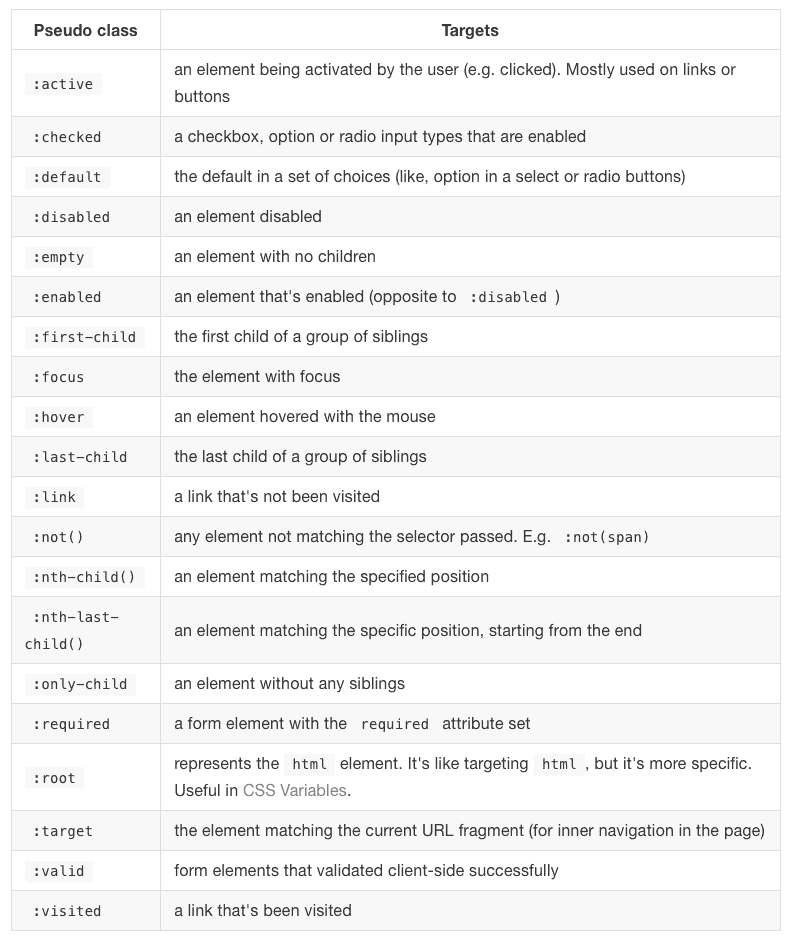

我们来做一个例子。实际上，很普通。您想要样式化一个链接，所以您创建了一个 CSS 规则来定位`a`元素:

```
a {
  color: yellow;
}
```

事情似乎工作得很好，直到你点击一个链接。单击该链接时，它会变回预定义的颜色(蓝色)。然后当你打开链接，回到页面，现在链接是蓝色的。

为什么会这样？

因为链接在被点击时会改变状态，并进入`:active`状态。当它被访问时，它处于`:visited`状态。永远，直到用户清除浏览历史。

因此，要正确地使所有州的链接都变成黄色，您需要编写

```
a,
a:visited,
a:active {
  color: yellow;
}
```

值得一提的是。它可以用于针对具有`:nth-child(odd)`和`:nth-child(even)`的奇数或偶数孩子。

它通常用于列表中，使奇数行的颜色不同于偶数行:

```
ul:nth-child(odd) {
  color: white;
    background-color: black;
}
```

您还可以使用它来定位带有`:nth-child(-n+3)`的元素的前 3 个子元素。或者你可以用`:nth-child(5n)`在每 5 个元素中设置 1 个样式。

有些伪类只是用来打印的，像`:first`、`:left`、`:right`，所以你可以针对第一页、所有左边的页面、所有右边的页面，这些页面的样式通常略有不同。

### 伪元素

#### 伪元素用于样式化元素的特定部分。

他们以一个双冒号`::`开始。

> 有时你会发现它们只有一个冒号，但这只是为了向后兼容才支持的语法。您应该使用两个冒号来区分它们和伪类。

`::before`和`::after`大概是使用最多的伪元素了。它们用于在元素之前或之后添加内容，例如图标。

下面是伪元素的列表:

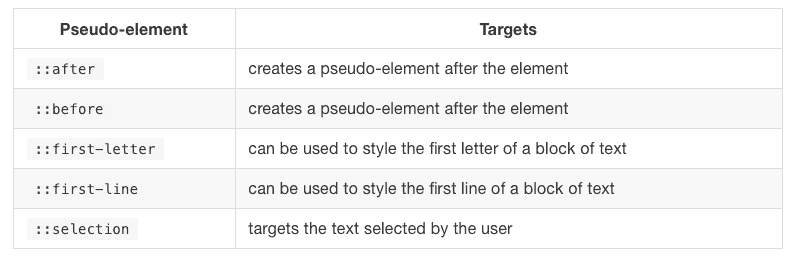

我们来做一个例子。假设您想让段落的第一行的字体稍微大一点，这在排版中很常见:

```
p::first-line {
  font-size: 2rem;
}
```

或者，您可能希望第一个字母更粗一些:

```
p::first-letter {
  font-weight: bolder;
}
```

`::after`和`::before`有点不太直观。我记得当我不得不使用 CSS 添加图标时，我就使用它们。

您可以指定`content`属性在元素前后插入任何类型的内容:

```
p::before {
  content: url(/myimage.png);
}

.myElement::before {
    content: "Hey Hey!";
}
```

### 颜色；色彩；色调

默认情况下，网页浏览器呈现的 HTML 页面在颜色方面非常糟糕。

我们有一个白色背景，黑色，蓝色的链接。就是这样。

幸运的是，CSS 给了我们在设计中添加颜色的能力。

我们有这些属性:

*   `color`
*   `background-color`
*   `border-color`

都接受一个**颜色值**，可以是不同的形式。

#### 命名颜色

首先，我们有定义颜色的 CSS 关键字。CSS 从 16 开始，但是今天有大量的颜色名称:

*   `aliceblue`
*   `antiquewhite`
*   `aqua`
*   `aquamarine`
*   `azure`
*   `beige`
*   `bisque`
*   `black`
*   `blanchedalmond`
*   `blue`
*   `blueviolet`
*   `brown`
*   `burlywood`
*   `cadetblue`
*   `chartreuse`
*   `chocolate`
*   `coral`
*   `cornflowerblue`
*   `cornsilk`
*   `crimson`
*   `cyan`
*   `darkblue`
*   `darkcyan`
*   `darkgoldenrod`
*   `darkgray`
*   `darkgreen`
*   `darkgrey`
*   `darkkhaki`
*   `darkmagenta`
*   `darkolivegreen`
*   `darkorange`
*   `darkorchid`
*   `darkred`
*   `darksalmon`
*   `darkseagreen`
*   `darkslateblue`
*   `darkslategray`
*   `darkslategrey`
*   `darkturquoise`
*   `darkviolet`
*   `deeppink`
*   `deepskyblue`
*   `dimgray`
*   `dimgrey`
*   `dodgerblue`
*   `firebrick`
*   `floralwhite`
*   `forestgreen`
*   `fuchsia`
*   `gainsboro`
*   `ghostwhite`
*   `gold`
*   `goldenrod`
*   `gray`
*   `green`
*   `greenyellow`
*   `grey`
*   `honeydew`
*   `hotpink`
*   `indianred`
*   `indigo`
*   `ivory`
*   `khaki`
*   `lavender`
*   `lavenderblush`
*   `lawngreen`
*   `lemonchiffon`
*   `lightblue`
*   `lightcoral`
*   `lightcyan`
*   `lightgoldenrodyellow`
*   `lightgray`
*   `lightgreen`
*   `lightgrey`
*   `lightpink`
*   `lightsalmon`
*   `lightseagreen`
*   `lightskyblue`
*   `lightslategray`
*   `lightslategrey`
*   `lightsteelblue`
*   `lightyellow`
*   `lime`
*   `limegreen`
*   `linen`
*   `magenta`
*   `maroon`
*   `mediumaquamarine`
*   `mediumblue`
*   `mediumorchid`
*   `mediumpurple`
*   `mediumseagreen`
*   `mediumslateblue`
*   `mediumspringgreen`
*   `mediumturquoise`
*   `mediumvioletred`
*   `midnightblue`
*   `mintcream`
*   `mistyrose`
*   `moccasin`
*   `navajowhite`
*   `navy`
*   `oldlace`
*   `olive`
*   `olivedrab`
*   `orange`
*   `orangered`
*   `orchid`
*   `palegoldenrod`
*   `palegreen`
*   `paleturquoise`
*   `palevioletred`
*   `papayawhip`
*   `peachpuff`
*   `peru`
*   `pink`
*   `plum`
*   `powderblue`
*   `purple`
*   `rebeccapurple`
*   `red`
*   `rosybrown`
*   `royalblue`
*   `saddlebrown`
*   `salmon`
*   `sandybrown`
*   `seagreen`
*   `seashell`
*   `sienna`
*   `silver`
*   `skyblue`
*   `slateblue`
*   `slategray`
*   `slategrey`
*   `snow`
*   `springgreen`
*   `steelblue`
*   `tan`
*   `teal`
*   `thistle`
*   `tomato`
*   `turquoise`
*   `violet`
*   `wheat`
*   `white`
*   `whitesmoke`
*   `yellow`
*   `yellowgreen`

加上指向`color`属性的`tranparent`和`currentColor`，例如让`border-color`继承它是有用的。

它们在 [CSS 颜色模块的第 4 级](https://www.w3.org/TR/css-color-4/)中定义。它们不区分大小写。

维基百科有一个[漂亮的表格](https://en.wikipedia.org/wiki/Web_colors)，可以让你根据它的名字选择最完美的颜色。

命名的颜色不是唯一的选择。

### RGB 和 RGBa

您可以使用`rgb()`函数根据颜色的 RGB 符号来计算颜色，RGB 符号根据颜色的红绿蓝部分来设置颜色。从 0 到 255:

```
p {
  color: rgb(255, 255, 255); /* white */
    background-color: rgb(0, 0, 0); /* black */
}
```

`rgba()`让你添加 alpha 通道进入透明部分。可以是 0 到 1 之间的一个数字:

```
p {
    background-color: rgb(0, 0, 0, 0.5);
}
```

#### 十六进制符号

另一种选择是用十六进制表示法来表示颜色的 RGB 部分，它由 3 个块组成。

黑色，也就是`rgb(0,0,0)`表示为`#000000`或`#000`(如果两个数相等，我们可以将两个数简化为 1)。

白色，`rgb(255,255,255)`可表示为`#ffffff`或`#fff`。

十六进制记数法让我们只用两位数来表示从 0 到 255 的数，因为它们可以从 0 到“15”(f)。

我们可以通过在末尾多加 1 或 2 个数字来增加 alpha 通道，比如`#00000033`。并非所有浏览器都支持缩写符号，因此请使用所有 6 位数字来表示 RGB 部分。

#### HSL 和 HSLa

这是 CSS 的一个新成员。

HSL =色调饱和度亮度。

在这个符号中，黑色是`hsl(0, 0%, 0%)`，白色是`hsl(0, 0%, 100%)`。

如果你因为过去的知识而对 HSL 比对 RGB 更熟悉，那你绝对可以用那个。

你也有`hsla()`将 alpha 通道添加到混音中，也是一个从 0 到 1 的数字:`hsl(0, 0%, 0%, 0.5)`

### 单位

CSS 中每天都会用到的一个东西就是单位。它们用于设置长度、填充、边距、对齐元素等等。

像`px`、`em`、`rem`或者百分比之类的东西。

他们无处不在。也有一些晦涩难懂的。我们将在这一部分逐一介绍。

#### 像素

最广泛使用的测量单位。像素实际上并不与屏幕上的物理像素相关，因为不同的设备会有很大的差异(想想高 DPI 设备与非 retina 设备)。

有一个约定使得这个单元在不同设备上一致地工作。

#### 百分率

另一个非常有用的方法是百分比，您可以用父元素对应属性的百分比来指定值。

示例:

```
.parent {
  width: 400px;
}

.child {
  width: 50%; /* = 200px */
}
```

#### 真实世界的测量单位

我们有那些从外部世界翻译过来的测量单位。它们在屏幕上几乎没有用，但在打印样式表时却很有用。它们是:

*   `cm`一厘米(映射到 37.8 像素)
*   `mm`一毫米(0.1 厘米)
*   四分之一毫米
*   `in`一英寸(映射到 96 像素)
*   `pt`一分(1 英寸= 72 分)
*   `pc`一个十二点活字(1 个十二点活字= 12 点)

#### 相对单位

*   `em`是分配给该元素的`font-size`的值，因此它的确切值在元素之间是变化的。它不会根据所使用的字体而改变，只会根据字体大小而改变。在印刷术中，这是测量`m`字母的宽度。
*   `rem`类似于`em`，但是它使用根元素(`html`)的字体大小，而不是改变当前元素的字体大小。您只需设置一次字体大小，`rem`将是所有页面一致度量。
*   `ex`和`em`一样，只是插入了测量`m`的宽度，它测量的是`x`字母的高度。它可以根据所使用的字体和字体大小而变化。
*   `ch`类似于`ex`，但它测量的不是`x`的高度，而是`0`(零)的宽度。

#### Viewport units

*   `vw`**视口宽度单位**表示视口宽度的百分比。`50vw`表示视窗宽度的 50%。
*   `vh`**视口高度单位**代表视口高度的百分比。`50vh`表示视口高度的 50%。
*   `vmin`**视口最小单位**以百分比表示高度或宽度之间的最小值。`30vmin`是当前宽度或高度的 30%，取决于哪一个更小
*   `vmax`**视口最大单位**以百分比表示高度或宽度之间的最大值。`30vmax`是当前宽度或高度的 30%，取决于哪一个更大

#### 分数单位

`fr`是分数单位，在 CSS 网格中用于将空间划分成分数。

稍后我们将在 CSS 网格的上下文中讨论它们。

### 统一资源定位器

当我们谈到背景图像、`@import`等等时，我们使用`url()`函数来加载一个资源:

```
div {
  background-image: url(test.png);
}
```

在本例中，我使用了一个相对 URL，它在定义 CSS 文件的文件夹中搜索文件。

我可以回到上一层

```
div {
  background-image: url(../test.png);
}
```

或者进入一个文件夹

```
div {
  background-image: url(subfolder/test.png);
}
```

或者我可以从 CSS 所在的域的根目录开始加载一个文件:

```
div {
  background-image: url(/test.png);
}
```

或者我可以使用绝对 URL 来加载外部资源:

```
div {
  background-image: url(https://mysite.com/test.png);
}
```

### 计算(calculation)

`calc()`函数允许您对值执行基本的数学运算，当您需要从百分比中增加或减去长度值时，它特别有用。

它是这样工作的:

```
div {
    max-width: calc(80% - 100px)
}
```

它返回一个长度值，因此可以在任何需要像素值的地方使用。

你可以表演

*   使用`+`的加法
*   使用`-`进行减法运算
*   乘法使用`*`
*   除法使用`/`

> *一个警告:对于加法和减法，运算符周围的空格是必需的，否则它不能按预期工作。*

示例:

```
div {
    max-width: calc(50% / 3)
}

div {
    max-width: calc(50% + 3px)
}
```

### 背景

可以使用几个 CSS 属性来更改元素的背景:

*   `background-color`
*   `background-image`
*   `background-clip`
*   `background-position`
*   `background-origin`
*   `background-repeat`
*   `background-attachment`
*   `background-size`

以及速记属性`background`，它允许我们缩短定义并将它们组合在一行中。

`background-color`接受颜色值，该值可以是颜色关键字之一，或者是`rgb`或`hsl`值:

```
p {
  background-color: yellow;
}

div {
  background-color: #333;
}
```

通过指定图像位置 URL，您可以使用图像作为元素的背景，而不是使用颜色:

```
div {
  background-image: url(image.png);
}
```

`background-clip`让你决定背景图像所使用的区域，或颜色。默认值为`border-box`，延伸至边框外缘。

其他值有

*   `padding-box`将背景扩展到填充边缘，但没有边框
*   `content-box`将背景扩展到内容边缘，但不填充
*   `inherit`应用父代的值

当使用一幅图像作为背景时，您将需要使用`background-position`属性来设置图像的位置:`left`、`right`、`center`都是 X 轴的有效值，而`top`、`bottom`是 Y 轴的有效值:

```
div {
  background-position: top right;
}
```

如果图像比背景小，您需要使用`background-repeat`设置行为。应该是所有轴上的`repeat-x`、`repeat-y`还是`repeat`？最后一个是默认值。另一个价值是`no-repeat`。

`background-origin`让您选择应用背景的位置:使用`padding-box`应用于包括填充(默认)的整个元素，使用`border-box`应用于包括边框的整个元素，使用`content-box`应用于没有填充的元素。

使用`background-attachment`,我们可以将背景附加到视口，这样滚动就不会影响背景:

```
div {
  background-attachment: fixed;
}
```

默认情况下，该值为`scroll`。还有一个值，`local`。形象化他们行为的最好方法是[这支笔](https://codepen.io/BernLeech/pen/mMNKJV)。

最后一个背景属性是`background-size`。我们可以用 3 个关键词:`auto`、`cover`和`contain`。`auto`是默认的。

`cover`扩展图像，直到整个元素被背景覆盖。

`contain`当一维(x 或 y)覆盖图像的整个最小边缘时，停止扩展背景图像，因此它完全包含在元素中。

您还可以指定一个长度值，如果是这样，它将设置背景图像的宽度(并且自动定义高度):

```
div {
  background-size: 100%;
}
```

如果指定两个值，一个是宽度，另一个是高度:

```
div {
  background-size: 800px 600px;
}
```

速记属性`background`允许缩短定义并将它们组合在一行上。

这是一个例子:

```
div {
  background: url(bg.png) top left no-repeat;
}
```

如果您使用图像，并且无法加载该图像，您可以设置一种备用颜色:

```
div {
  background: url(image.png) yellow;
}
```

您也可以将渐变设定为背景:

```
div {
  background: linear-gradient(#fff, #333);
}
```

### 评论

CSS 让你能够在 CSS 文件中，或者在页眉的`style`标签中写注释

格式是 C 风格(或者 JavaScript 风格，如果你喜欢的话)的注释。

这是一个多行注释。在添加结束标记之前，在开始标记之后的所有行都会被注释。

示例:

```
#name { display: block; } /* Nice rule! */

/* #name { display: block; } */

#name {
    display: block; /*
    color: red;
    */
}
```

CSS 没有内联注释，像 C 或 JavaScript 中的`//`。

但是要注意——如果你在一个规则前添加了`//`,这个规则将不会被应用，看起来像注释起作用了。实际上，CSS 检测到了一个语法错误，由于它的工作方式，它忽略了有错误的那一行，直接进入下一行。

了解这种方法可以让你有目的地编写行内注释，尽管你必须小心，因为你不能像在块注释中那样添加随机文本。

例如:

```
// Nice rule!
#name { display: block; }
```

在这种情况下，由于 CSS 的工作方式，`#name`规则实际上被注释掉了。如果你对此感兴趣，你可以在这里找到更多细节。为了避免搬起石头砸自己的脚，只要避免使用行内注释，依靠块注释。

### 自定义属性

在过去的几年里，CSS 预处理程序取得了很大的成功。对于绿地项目来说，以少或少开始是很常见的。这仍然是一项非常受欢迎的技术。

在我看来，这些技术的主要优势在于:

*   它们允许你嵌套选择器
*   提供了简单的导入功能
*   他们给你变量

现代 CSS 有一个新的强大功能叫做 **CSS 自定义属性**，也就是俗称的 **CSS 变量**。

CSS 不是像 [JavaScript](https://flaviocopes.com/javascript/) 、Python、PHP、Ruby 或 Go 那样的编程语言，在那里变量是做有用事情的关键。CSS 的功能非常有限，它主要是一种声明性语法，告诉浏览器应该如何显示 HTML 页面。

但是变量就是变量:一个引用值的名字，CSS 中的变量通过集中值的定义帮助减少 CSS 中的重复和不一致。

它还引入了一个 CSS 预处理程序没有的独特特性:**您可以使用 JavaScript** 以编程方式访问和更改 CSS 变量的值。

#### 使用变量的基础

CSS 变量是用特殊的语法定义的，在名称(`--variable-name`)前面加上**两个破折号**，然后是冒号和值。像这样:

```
:root {
  --primary-color: yellow;
}
```

(详见`:root`稍后)

您可以使用`var()`访问变量值:

```
p {
  color: var(--primary-color)
}
```

变量值可以是任何有效的 CSS 值，例如:

```
:root {
  --default-padding: 30px 30px 20px 20px;
  --default-color: red;
  --default-background: #fff;
}
```

#### 在任何元素中创建变量

CSS 变量可以在任何元素中定义。一些例子:

```
:root {
  --default-color: red;
}

body {
  --default-color: red;
}

main {
  --default-color: red;
}

p {
  --default-color: red;
}

span {
  --default-color: red;
}

a:hover {
  --default-color: red;
}
```

在那些不同的例子中变化的是**范围**。

#### 变量范围

将变量添加到选择器中使它们对它的所有子级都可用。

在上面的例子中，你看到了在定义 CSS 变量时使用了`:root`:

```
:root {
  --primary-color: yellow;
}
```

`:root`是一个 CSS 伪类，标识一棵树的根元素。

在 HTML 文档的上下文中，使用`:root`选择器指向`html`元素，除了`:root`具有更高的特异性(优先)。

在 SVG 图像的上下文中，`:root`指向`svg`标签。

向`:root`添加一个 CSS 自定义属性使其对页面中的所有元素都可用。

如果你在一个`.container`选择器中添加一个变量，它只对`.container`的子节点可用:

```
.container {
  --secondary-color: yellow;
}
```

在这个元素之外使用它是行不通的。

变量可以被**重新分配**:

```
:root {
  --primary-color: yellow;
}

.container {
  --primary-color: blue;
}
```

在`.container`、`--primary-color`外面会是*黄色*，里面会是*蓝色*。

您还可以使用**内联样式**在 HTML 中分配或覆盖变量:

```
<main style="--primary-color: orange;">
  <!-- ... -->
</main>
```

> CSS 变量遵循正常的 CSS 级联规则，根据特殊性设置优先级。

#### 使用 JavaScript 与 CSS 变量值交互

CSS 变量最酷的地方是能够使用 JavaScript 访问和编辑它们。

以下是使用普通 JavaScript 设置变量值的方法:

```
const element = document.getElementById('my-element')
element.style.setProperty('--variable-name', 'a-value')
```

如果变量是在`:root`上定义的，以下代码可用于访问变量值:

```
const styles = getComputedStyle(document.documentElement)
const value = String(styles.getPropertyValue('--variable-name')).trim()
```

或者，在使用不同范围设置变量的情况下，将样式应用于特定元素:

```
const element = document.getElementById('my-element')
const styles = getComputedStyle(element)
const value = String(styles.getPropertyValue('--variable-name')).trim()
```

#### 处理无效值

如果一个变量被赋给一个不接受变量值的属性，那么它就被认为是无效的。

例如，您可以将一个像素值传递给一个`position`属性，或者将一个 rem 值传递给一个颜色属性。

在这种情况下，该行被视为无效并被忽略。

#### 浏览器支持

浏览器对 CSS 变量的支持**非常好**，[根据我能不能用](https://www.caniuse.com/#feat=css-variables)。

CSS 变量一直存在，如果你不需要支持 Internet Explorer 和其他浏览器的旧版本，你今天就可以使用它们。

如果你需要支持旧的浏览器，你可以使用像 [PostCSS](https://flaviocopes.com/postcss/) 或[神话](http://www.myth.io/)这样的库，但是你将失去通过 JavaScript 或浏览器开发工具与变量交互的能力，因为它们被转换成良好的旧的无变量 CSS(因此，你失去了 CSS 变量的大部分功能)。

#### CSS 变量区分大小写

这个变量:

```
--width: 100px;
```

与这个不同:

```
--Width: 100px;
```

#### CSS 变量中的数学

要在 CSS 变量中做数学运算，需要使用`calc()`，例如:

```
:root {
  --default-left-padding: calc(10px * 2);
}
```

#### 使用 CSS 变量的媒体查询

这里没什么特别的。CSS 变量通常应用于媒体查询:

```
body {
  --width: 500px;
}

@media screen and (max-width: 1000px) and (min-width: 700px) {
  --width: 800px;
}

.container {
  width: var(--width);
}
```

#### 为 var()设置回退值

`var()`接受第二个参数，该参数是未设置变量值时的默认回退值:

```
.container {
  margin: var(--default-margin, 30px);
}
```

### 字体

在网络出现之初，你只有少数几种字体可供选择。

谢天谢地，今天你可以在你的页面上加载任何类型的字体。

这些年来，CSS 在字体方面获得了许多不错的功能。

`font`属性是许多属性的简写:

*   `font-family`
*   `font-weight`
*   `font-stretch`
*   `font-style`
*   `font-size`

让我们看看他们每一个人，然后我们会谈到`font`。

然后我们将讨论如何加载定制字体，使用`@import`或`@font-face`，或者通过加载字体样式表。

#### `font-family`

设置元素将使用的字体系列。

为什么是“家人”？因为我们所知道的字体实际上是由几个子字体组成的，这些子字体提供了所有的样式(粗体、斜体、浅体..)我们需要。

这里有一个来自我的 Mac 的字体簿应用程序的例子 Fira Code 字体系列包含几种专用字体:

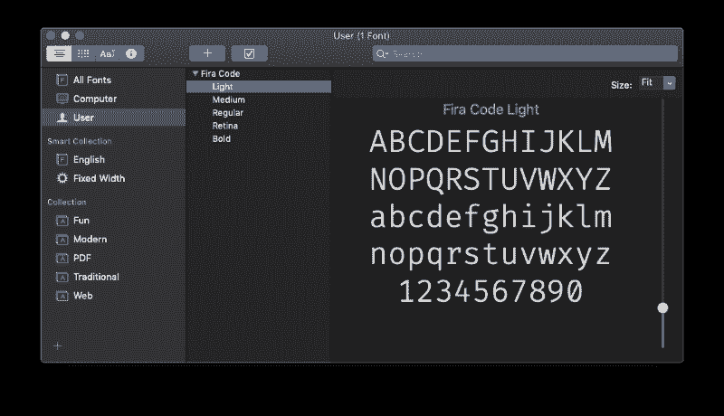

此属性允许您选择特定的字体，例如:

```
body {
  font-family: Helvetica;
}
```

您可以设置多个值，因此如果第一个选项由于某种原因无法使用(例如，如果在机器上找不到它，或者下载字体的网络连接失败)，将使用第二个选项:

```
body {
  font-family: Helvetica, Arial;
}
```

到目前为止，我使用了一些特定的字体，我们称之为**网络安全字体**，因为它们预装在不同的操作系统上。

我们把它们分为衬线字体、无衬线字体和等宽字体。以下是一些最受欢迎的列表:

**衬线**

*   格鲁吉亚
*   帕拉蒂诺
*   时代新罗马
*   英国泰晤士报(1785 年创刊)

无衬线

*   天线
*   Helvetica
*   韦尔达纳
*   日内瓦
*   前面有突出的护架
*   大露希达
*   影响
*   投石机 MS
*   Arial 黑色

**等宽**

*   信使新闻
*   信使
*   Lucida 控制台
*   摩纳哥

您可以使用所有这些属性作为`font-family`属性，但是不能保证每个系统都有这些属性。其他的也存在，有不同程度的支持。

您也可以使用通用名称:

*   `sans-serif`没有连字的字体
*   `serif`带有连字的字体
*   一种特别适合代码的字体
*   `cursive`用于模拟手写棋子
*   名字说明了一切

这些通常用在`font-family`定义的末尾，以在没有其他可以应用的情况下提供一个回退值:

```
body {
  font-family: Helvetica, Arial, sans-serif;
}
```

#### `font-weight`

这个属性设置字体的宽度。您可以使用这些预定义的值:

*   常态
*   大胆的
*   粗体(相对于父元素)
*   较亮(相对于父元素)

或者使用数字关键字

*   One hundred
*   Two hundred
*   Three hundred
*   400，映射到`normal`
*   Five hundred
*   Six hundred
*   700 映射到`bold`
*   eight hundred
*   Nine hundred

其中 100 是最浅的字体，900 是最粗的字体。

其中一些数值可能无法映射到字体，因为必须在字体系列中提供。当缺少一个时，CSS 会使该数字至少与前一个数字一样粗体，因此可能会有指向相同字体的数字。

#### `font-stretch`

允许您选择字体的窄面或宽面(如果有)。

这一点很重要:字体必须配备不同的面孔。

允许的值从窄到宽为:

*   `ultra-condensed`
*   `extra-condensed`
*   `condensed`
*   `semi-condensed`
*   `normal`
*   `semi-expanded`
*   `expanded`
*   `extra-expanded`
*   `ultra-expanded`

#### `font-style`

允许您对字体应用斜体样式:

```
p {
  font-style: italic;
}
```

该属性还允许值`oblique`和`normal`。使用`italic`和`oblique`几乎没有区别。第一个对我来说更容易，因为 HTML 已经提供了一个表示斜体的`i`元素。

#### `font-size`

该属性用于确定字体的大小。

您可以传递两种值:

1.  长度值，如`px`、`em`、`rem`等，或百分比
2.  预定义的值关键字

在第二种情况下，您可以使用的值是:

*   xx-小型
*   x-small
*   小的
*   媒介
*   大的
*   超大号
*   xx-大
*   较小(相对于父元素)
*   较大(相对于父元素)

用法:

```
p {
  font-size: 20px;
}

li {
  font-size: medium;
}
```

#### `font-variant`

该属性最初用于将文本更改为小型大写字母，它只有 3 个有效值:

*   `normal`
*   `inherit`
*   `small-caps`

小型大写字母表示文本在其大写字母旁边以“小型大写字母”呈现。

#### `font`

属性允许你在一个单独的字体中应用不同的字体属性，减少混乱。

我们必须至少设置两个属性，`font-size`和`font-family`，其他的是可选的:

```
body {
  font: 20px Helvetica;
}
```

如果我们添加其他属性，它们需要按正确的顺序排列。

顺序如下:

```
font: <font-stretch> <font-style> <font-variant> <font-weight> <font-size> <line-height> <font-family>;
```

示例:

```
body {
  font: italic bold 20px Helvetica;
}

section {
  font: small-caps bold 20px Helvetica;
}
```

#### 使用`@font-face`加载自定义字体

`@font-face`允许您添加新的字体系列名称，并将其映射到保存字体的文件。

这种字体将被浏览器下载并在网页中使用，这是对网页排版的根本性改变——我们现在可以使用任何我们想要的字体。

我们可以将`@font-face`声明直接添加到 CSS 中，或者链接到专门用于导入字体的 CSS。

在我们的 CSS 文件中，我们也可以使用`@import`来加载 CSS 文件。

一个`@font-face`声明包含几个我们用来定义字体的属性，包括`src`，字体的 URI(一个或多个 URIs)。这遵循同源策略，这意味着字体只能从当前源(域+端口+协议)下载。

字体通常采用以下格式

*   `woff`(网页开放字体格式)
*   `woff2`(网页打开字体格式 2.0)
*   `eot`(嵌入式开放式)
*   `otf` (OpenType 字体)
*   `ttf`truetype 字体

下面的属性允许我们定义将要加载的字体的属性，正如我们在上面看到的:

*   `font-family`
*   `font-weight`
*   `font-style`
*   `font-stretch`

#### 关于性能的说明

当然，加载字体会影响性能，这是你在设计页面时必须考虑的。

### 排印

我们已经讨论了字体，但是对文本进行样式化还有更多的内容。

在本节中，我们将讨论以下属性:

*   `text-transform`
*   `text-decoration`
*   `text-align`
*   `vertical-align`
*   `line-height`
*   `text-indent`
*   `text-align-last`
*   `word-spacing`
*   `letter-spacing`
*   `text-shadow`
*   `white-space`
*   `tab-size`
*   `writing-mode`
*   `hyphens`
*   `text-orientation`
*   `direction`
*   `line-break`
*   `word-break`
*   `overflow-wrap`

#### `text-transform`

该属性可以转换元素的大小写。

有 4 个有效值:

*   `capitalize`将每个单词的第一个字母大写
*   `uppercase`将所有文本全部大写
*   `lowercase`将所有文本小写
*   `none`禁止转换文本，用于避免继承属性

示例:

```
p {
  text-transform: uppercase;
}
```

#### `text-decoration`

这个属性用来给文本添加装饰，包括

*   `underline`
*   `overline`
*   `line-through`
*   `blink`
*   `none`

示例:

```
p {
  text-decoration: underline;
}
```

你也可以设置装饰的风格和颜色。

示例:

```
p {
  text-decoration: underline dashed yellow;
}
```

有效的样式值为`solid`、`double`、`dotted`、`dashed`、`wavy`。

您可以在一行中完成所有操作，或者使用特定的属性:

*   `text-decoration-line`
*   `text-decoration-color`
*   `text-decoration-style`

示例:

```
p {
  text-decoration-line: underline;
  text-decoration-color: yellow;
  text-decoration-style: dashed;
}
```

#### `text-align`

默认情况下，文本对齐具有`start`值，这意味着文本从包含它的框的“开始”,原点 0，0 开始。这意味着在从左到右的语言中是左上，在从右到左的语言中是右上。

可能的值有`start`、`end`、`left`、`right`、`center`、`justify`(在行尾有一致的间距很好):

```
p {
  text-align: right;
}
```

#### `vertical-align`

确定行内元素如何垂直对齐。

这个属性有几个值。首先，我们可以指定一个长度或百分比值。它们用于将文本对齐到高于或低于(使用负值)父元素基线的位置。

然后我们有了关键词:

*   `baseline`(默认值)，将基线与父元素的基线对齐
*   使元素下标，模拟 HTML 元素结果
*   `super`使元素上标，模拟`sup` HTML 元素结果
*   `top`将元素的顶部与行的顶部对齐
*   `text-top`将元素的顶部与父元素字体的顶部对齐
*   `middle`将元素的中间与父元素的中线对齐
*   `bottom`将元素的底部与行的底部对齐
*   `text-bottom`将元素底部与父元素字体底部对齐

#### `line-height`

这允许您更改线条的高度。每一行文本都有一定的字体高度，但是行与行之间还有额外的垂直间距。这是行高:

```
p {
  line-height: 0.9rem;
}
```

#### `text-indent`

将段落的首行缩进设定的长度或段落宽度的百分比:

```
p {
  text-indent: -10px;
}
```

#### `text-align-last`

默认情况下，段落的最后一行按照`text-align`值对齐。使用该属性更改行为:

```
p {
  text-align-last: right;
}
```

#### `word-spacing`

修改每个单词之间的间距。

您可以使用`normal`关键字来重置继承的值，或者使用长度值:

```
p {
  word-spacing: 2px;
}

span {
  word-spacing: -0.2em;
}
```

#### `letter-spacing`

修改每个字母之间的间距。

您可以使用`normal`关键字来重置继承的值，或者使用长度值:

```
p {
  letter-spacing: 0.2px;
}

span {
  letter-spacing: -0.2em;
}
```

#### `text-shadow`

对文本应用阴影。默认情况下，文本现在有阴影。

该属性接受可选的颜色和一组设置的值

*   文本阴影的 X 偏移量
*   阴影相对于文本的 Y 偏移量
*   模糊半径

如果未指定颜色，阴影将使用文本颜色。

示例:

```
p {
  text-shadow: 0.2px 2px;
}

span {
  text-shadow: yellow 0.2px 2px 3px;
}
```

#### `white-space`

设置 CSS 如何处理元素中的空白、新行和制表符。

折叠空白的有效值包括:

*   `normal`折叠空白。当文本到达容器末尾时，根据需要添加新行
*   `nowrap`折叠空白。当文本到达容器末尾时，不添加新行，并取消添加到文本中的任何换行符
*   `pre-line`折叠空白。当文本到达容器末尾时，根据需要添加新行

保留空白的有效值包括:

*   `pre`保留空白。当文本到达容器末尾时不添加新行，但保留添加到文本的换行符
*   `pre-wrap`保留空白。当文本到达容器末尾时，根据需要添加新行

#### `tab-size`

设置制表符的宽度。默认情况下，它是 8，您可以设置一个整数值来设置它所占用的字符间距，或者设置一个长度值:

```
p {
  tab-size: 2;
}

span {
  tab-size: 4px;
}
```

#### `writing-mode`

定义文本行是水平布局还是垂直布局，以及块前进的方向。

您可以使用的值有

*   `horizontal-tb`(默认)
*   `vertical-rl`内容垂直排列。新的行放在前一行的左边
*   `vertical-lr`内容垂直排列。新的行放在前一行的右边

#### `hyphens`

确定在转到新行时是否应自动添加连字符。

有效值包括

*   `none`(默认)
*   仅在已经有可见连字符或隐藏连字符(特殊字符)时添加连字符
*   `auto`在确定文本可以有连字符时添加连字符。

#### `text-orientation`

当`writing-mode`处于垂直模式时，确定文本的方向。

有效值包括

*   `mixed`是默认设置，如果一种语言是垂直的(如日语),它会保持该方向，同时旋转用西方语言书写的文本
*   `upright`使所有文本垂直
*   `sideways`使所有文本水平放置

#### `direction`

设置文本的方向。有效值为`ltr`和`rtl`:

```
p {
  direction: rtl;
}
```

#### `word-break`

此属性指定如何在单词中换行。

*   `normal`(默认)表示文本仅在单词之间断开，而不在单词内部断开
*   浏览器可以打断一个单词(但不添加连字符)
*   `keep-all`压制软包裹。主要用于 CJK(中文/日文/韩文)文本。

说到 CJK 文本，属性`line-break`用于确定文本行如何换行。我不是这些语言的专家，所以我将避免涉及它。

#### `overflow-wrap`

如果一个单词太长而不适合一行，它可能会溢出容器。

> *这个属性也被称为`word-wrap`，虽然那是非标准的(但仍然作为别名使用)*

这是默认行为(`overflow-wrap: normal;`)。

我们可以使用:

```
p {
  overflow-wrap: break-word;
}
```

在直线的精确长度处断开，或者

```
p {
  overflow-wrap: anywhere;
}
```

如果浏览器提前发现某处有软装机会。在任何情况下，都不会添加连字符。

这个属性和`word-break`很像。我们可能希望在西方语言上选择这个，而`word-break`对非西方语言有特殊处理。

### 箱状模式

每个 CSS 元素本质上都是一个盒子。每个元素都是一个通用的盒子。

盒子模型基于一些 CSS 属性解释了元素的大小。

从内到外，我们有:

*   内容区域
*   填料
*   边界
*   边缘

可视化盒子模型的最佳方式是打开浏览器 DevTools 并检查它是如何显示的:

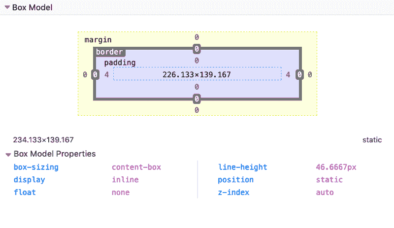

在这里你可以看到 Firefox 如何告诉我一个我突出显示的`span`元素的属性。我右击它，按下 Inspect Element，然后进入 DevTools 的布局面板。

看，淡蓝色的空间是内容区。围绕它的是填充，然后是边框，最后是边距。

默认情况下，如果您在元素上设置了宽度(或高度)，它将被应用到**内容区域**。所有的填充、边框和边距计算都是在值之外进行的，所以在计算时必须记住这一点。

稍后，您将看到如何使用框大小调整来改变这种行为。

### 边界

边框是填充和边距之间的薄层。通过编辑边框，您可以让元素在屏幕上绘制它们的周长。

您可以使用这些属性来处理边框:

*   `border-style`
*   `border-color`
*   `border-width`

属性`border`可以用作所有这些属性的简写。

`border-radius`用于创建圆角。

您还可以使用图像作为边框，这是`border-image`赋予您的能力，它具有特定的独立属性:

*   `border-image-source`
*   `border-image-slice`
*   `border-image-width`
*   `border-image-outset`
*   `border-image-repeat`

先说`border-style`。

#### 边框样式

属性让你选择边框的样式。您可以使用的选项有:

*   `dotted`
*   `dashed`
*   `solid`
*   `double`
*   `groove`
*   `ridge`
*   `inset`
*   `outset`
*   `none`
*   `hidden`

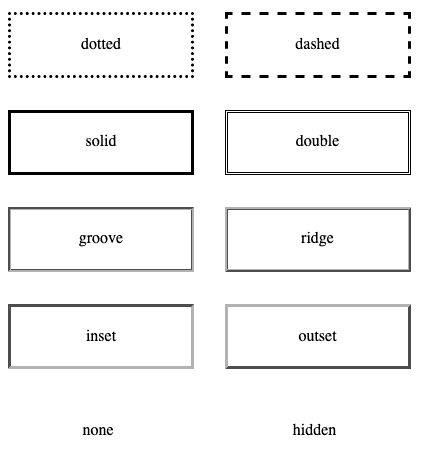

看看这个代码笔的一个真实例子。

样式的默认值是`none`，所以要让边框出现，你需要把它改成别的。`solid`大部分时候是个不错的选择。

您可以使用属性为每条边设置不同的样式

*   `border-top-style`
*   `border-right-style`
*   `border-bottom-style`
*   `border-left-style`

或者您可以使用带有多个值的`border-style`来定义它们，使用通常的右上-左下顺序:

```
p {
  border-style: solid dotted solid dotted;
}
```

#### 边框宽度

`border-width`用于设置边框的宽度。

您可以使用预定义的值之一:

*   `thin`
*   `medium`(默认值)
*   `thick`

或者以像素、em 或 rem 或任何其他有效长度值来表示值。

示例:

```
p {
  border-width: 2px;
}
```

您可以使用 4 个值分别设置每条边的宽度(右上-左下):

```
p {
  border-width: 2px 1px 2px 1px;
}
```

或者可以使用特定的边缘属性`border-top-width`、`border-right-width`、`border-bottom-width`、`border-left-width`。

#### 边框颜色

`border-color`用于设置边框的颜色。

如果不设置颜色，默认情况下，边框使用元素中文本的颜色来着色。

您可以将任何有效的颜色值传递给`border-color`。

示例:

```
p {
  border-color: yellow;
}
```

您可以使用 4 个值分别设置每条边的颜色(右上-左下):

```
p {
  border-color: black red yellow blue;
}
```

或者可以使用特定的边缘属性`border-top-color`、`border-right-color`、`border-bottom-color`、`border-left-color`。

#### 边框速记属性

提到的这三个属性，`border-width`、`border-style`和`border-color`可以使用简写属性`border`来设置。

示例:

```
p {
  border: 2px black solid;
}
```

您也可以使用特定于边缘的属性`border-top`、`border-right`、`border-bottom`、`border-left`。

示例:

```
p {
  border-left: 2px black solid;
  border-right: 3px red dashed;
}
```

#### 边框半径

`border-radius`用于给边框设置圆角。您需要传递一个值，该值将用作圆的半径，该圆将用于使边框变圆。

用法:

```
p {
  border-radius: 3px;
}
```

您也可以使用特定于边缘的属性`border-top-left-radius`、`border-top-right-radius`、`border-bottom-left-radius`、`border-bottom-right-radius`。

#### 使用图像作为边框

边框的一个很酷的地方是能够使用图片来设计它们。这让你对边框很有创意。

我们有 5 处房产:

*   `border-image-source`
*   `border-image-slice`
*   `border-image-width`
*   `border-image-outset`
*   `border-image-repeat`

还有速记`border-image`。我不会在这里做太多的细节，因为边界的图片需要更深入的报道，因为我可以在这个小章节里做什么。我推荐阅读关于边框图像的 [CSS 技巧年鉴条目以获取更多信息。](https://css-tricks.com/almanac/properties/b/border-image/)

### 填料

CSS 属性通常在 CSS 中用来在元素内部增加空间。

请记住:

*   `margin`在元素边框外添加空格
*   `padding`在元素边框内添加空格

#### 特定填充属性

`padding`有 4 个相关属性，可以一次改变单个边缘的填充:

*   `padding-top`
*   `padding-right`
*   `padding-bottom`
*   `padding-left`

这些词的用法非常简单，不能混淆，例如:

```
padding-left: 30px;
padding-right: 3em;
```

#### 使用`padding`速记

`padding`是同时指定多个填充值的简写，根据输入值的数量，它的行为会有所不同。

#### 1 个值

使用单个值将应用于所有填充:顶部、右侧、底部、左侧。

```
padding: 20px;
```

#### 2 个值

使用 2 个值将第一个应用于底部**顶部**的&，第二个应用于左侧&右侧的**。**

```
padding: 20px 10px;
```

#### 3 个价值观

使用 3 个值将第一个应用于**顶部**，第二个应用于**左侧&右侧**，第三个应用于**底部**。

```
padding: 20px 10px 30px;
```

#### 4 种价值观

使用 4 个值将第一个应用于**顶部**，第二个应用于**右侧**，第三个应用于**底部**，第四个应用于**左侧**。

```
padding: 20px 10px 5px 0px;
```

所以，顺序是*右上-左下*。

#### 接受的值

`padding`接受以任何长度单位表示的值，最常见的是 px，em，rem，但是[还有很多其他的](https://developer.mozilla.org/en-US/docs/Web/CSS/length)。

### 边缘

CSS 属性通常用于在元素周围添加空间。

请记住:

*   `margin`在元素边框外添加空格
*   `padding`在元素边框内添加空格

#### 特定边距属性

`margin`有 4 个相关属性，可立即改变单个边缘的边距:

*   `margin-top`
*   `margin-right`
*   `margin-bottom`
*   `margin-left`

这些词的用法非常简单，不能混淆，例如:

```
margin-left: 30px;
margin-right: 3em;
```

#### 使用`margin`速记

`margin`是同时指定多个边距的简写，根据输入值的数量，它的行为会有所不同。

#### 1 个值

使用单个值将应用于所有的页边距:上、右、下、左。

```
margin: 20px;
```

#### 2 个值

使用 2 个值将第一个应用于底部**顶部**的&，第二个应用于左侧&右侧的**。**

```
margin: 20px 10px;
```

#### 3 个价值观

使用 3 个值将第一个应用于**顶部**，第二个应用于**左侧&右侧**，第三个应用于**底部**。

```
margin: 20px 10px 30px;
```

#### 4 种价值观

使用 4 个值将第一个应用于**顶部**，第二个应用于**右侧**，第三个应用于**底部**，第四个应用于**左侧**。

```
margin: 20px 10px 5px 0px;
```

所以，顺序是*右上-左下*。

#### 接受的值

`margin`接受以任何长度单位表示的值，最常见的是 px，em，rem，但是[还有很多其他的](https://developer.mozilla.org/en-US/docs/Web/CSS/length)。

它还接受百分比值和特殊值`auto`。

#### 使用`auto`使元素居中

`auto`可用于告诉浏览器自动选择边距，它最常用于以这种方式使元素居中:

```
margin: 0 auto;
```

如上所述，使用 2 个值将第一个应用于底部**顶部**的&，第二个应用于左侧&右侧的**。**

使元素居中的现代方法是使用 [Flexbox](https://flaviocopes.com/flexbox/) 和它的`justify-content: center;`指令。

旧的浏览器当然不会实现 Flexbox，如果你需要支持它们的话`margin: 0 auto;`仍然是一个不错的选择。

#### 使用负边距

`margin`是与大小调整相关的唯一可以有负值的属性。它也非常有用。设置一个负的上边距会使一个元素移动到它前面的元素上，如果有足够大的负值，它会移出页面。

负的下边距会将它后面的元素上移。

负的右边距会使元素的内容超出其允许的内容大小。

负的左边距会将元素向左移动到它前面的元素上，如果给定足够大的负值，它会移出页面。

### 盒子尺寸

浏览器在计算元素宽度时的默认行为是将计算的宽度和高度应用到**内容区域**，而不考虑任何填充、边框和边距。

这种方法被证明是非常复杂的。

您可以通过设置`box-sizing`属性来改变这种行为。

属性是一个很大的帮助。它有两个值:

*   `border-box`
*   `content-box`

`content-box`是默认的，在`box-sizing`成为一个东西之前我们有了很久的那个。

是我们一直在寻找的新的伟大的东西。如果在元素上设置该属性:

```
.my-div {
  box-sizing: border-box;
}
```

宽度和高度计算包括填充和边框。只有边距被忽略了，这是合理的，因为在我们的头脑中，我们通常也把它看作是一个独立的东西:边距在盒子外面。

这个属性是一个很小的变化，但是有很大的影响。CSS Tricks 甚至宣布了一个[国际框尺寸意识日](https://css-tricks.com/international-box-sizing-awareness-day/)，只是说，并且建议将它应用于页面上的每个元素，开箱即用，用这个:

```
*, *:before, *:after {
  box-sizing: border-box;
}
```

### 展示

对象的`display`属性决定了浏览器如何呈现它。

这是一个非常重要的属性，可能是您可以使用的值最多的属性。

这些价值包括:

*   `block`
*   `inline`
*   `none`
*   `contents`
*   `flow`
*   `flow-root`
*   `table`(以及所有的`table-*`个)
*   `flex`
*   `grid`
*   `list-item`
*   `inline-block`
*   `inline-table`
*   `inline-flex`
*   `inline-grid`
*   `inline-list-item`

加上其他你不太可能用到的，比如`ruby`。

选择其中的任何一个都会极大地改变元素及其子元素的浏览器行为。

在本节中，我们将分析其他地方没有涉及的最重要的几个问题:

*   `block`
*   `inline`
*   `inline-block`
*   `none`

我们将在后面的章节中看到其他一些，包括对`table`、`flex`和`grid`的介绍。

#### `inline`

Inline 是 CSS 中每个元素的默认显示值。

除了一些元素像`div`、`p`和`section`被用户代理(浏览器)设置为`block`之外，所有的 HTML 标签都是内联显示的。

内联元素没有应用任何边距或填充。

高度和宽度相同。

您*可以*添加它们，但是页面中的外观不会改变——它们是由浏览器自动计算和应用的。

#### `inline-block`

与`inline`类似，但是按照您的指定应用了`inline-block` `width`和`height`。

#### `block`

如前所述，通常元素是内联显示的，除了一些元素，包括

*   `div`
*   `p`
*   `section`
*   `ul`

这些被浏览器设置为`block`。

使用`display: block`，元素一个接一个地垂直堆叠，每个元素占据页面的 100%。

分配给`width`和`height`属性的值，如果你设置了它们，以及`margin`和`padding`的值。

#### `none`

使用`display: none`使一个元素消失。它仍然在 HTML 中，只是在浏览器中看不到。

### 配置

定位是让我们决定元素出现在屏幕上的什么地方，以及它们是如何出现的。

您可以四处移动元素，并将它们准确地放置在您想要的位置。

在这一节中，我们还将基于不同`position`的元素如何相互交互来了解页面上的内容是如何变化的。

我们有一个主要的 CSS 属性:`position`。

它可以有这 5 个值:

*   `static`
*   `relative`
*   `absolute`
*   `fixed`
*   `sticky`

#### 静态定位

这是元素的默认值。静态定位的元素显示在普通页面流中。

#### 相对定位

如果您在一个元素上设置了`position: relative`,那么您现在可以使用属性，用一个偏移量来定位它

*   顶端
*   正确
*   底部
*   左边的

它们被称为**偏移属性**。它们接受长度值或百分比。

就拿我在 Codepen 上做的这个例子来说吧。我创建了一个父容器、一个子容器和一个包含一些文本的内框:

```
<div class="parent">
  <div class="child">
    <div class="box">
      <p>Test</p>
    </div>
  </div>
</div>
```

用一些 CSS 来给一些颜色和填充，但不影响定位:

```
.parent {
  background-color: #af47ff;
  padding: 30px;
  width: 300px;
}

.child {
  background-color: #ff4797;
  padding: 30px;
}

.box {
  background-color: #f3ff47;
  padding: 30px;
  border: 2px solid #333;
  border-style: dotted;
  font-family: courier;
  text-align: center;
  font-size: 2rem;
}
```

结果如下:

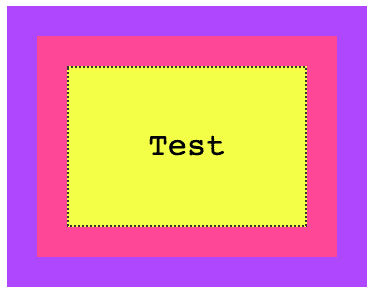

你可以试着把我之前提到的任何一个属性(`top`、`right`、`bottom`、`left`)加到`.box`，什么都不会发生。位置是`static`。

现在，如果我们将`position: relative`设置为 box，起初显然没有任何变化。但是这个元素现在可以使用`top`、`right`、`bottom`、`left`属性来移动，现在您可以改变它相对于包含它的元素的位置。

例如:

```
.box {
  /* ... */
  position: relative;
  top: -60px;
}
```

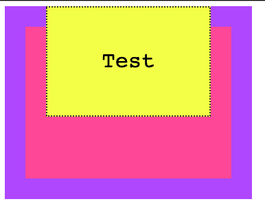

`top`的负值将使盒子相对于其容器向上移动。

或者

```
.box {
  /* ... */
  position: relative;
  top: -60px;
  left: 180px;
}
```

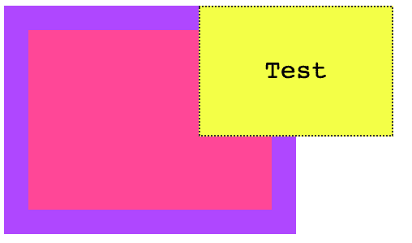

注意盒子所占据的空间是如何保留在容器中的，就像它仍然在原来的位置一样。

另一个现在可以工作的属性是`z-index`来改变 z 轴的位置。我们以后会谈到它。

#### 绝对定位

在元素上设置`position: absolute`会将其从文档流中移除。

还记得在相对定位中，我们注意到一个元素最初占据的空间被保留了下来，即使它被移动了？

有了绝对定位，我们一把`position: absolute`设置在`.box`上，它原来的空间现在就塌陷了，只有原点(x，y 坐标)保持不变。

```
.box {
  /* ... */
  position: absolute;
}
```

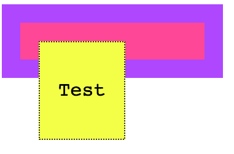

我们现在可以随意移动盒子，使用`top`、`right`、`bottom`、`left`属性:

```
.box {
  /* ... */
  position: absolute;
  top: 0px;
  left: 0px;
}
```

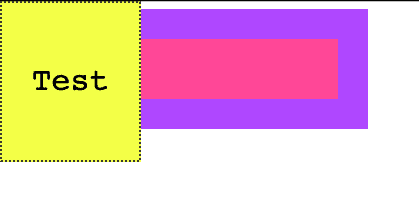

或者

```
.box {
  /* ... */
  position: absolute;
  top: 140px;
  left: 50px;
}
```

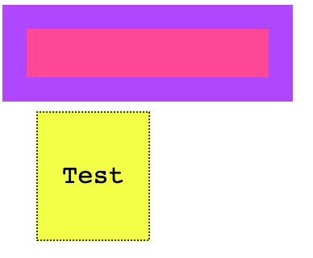

坐标是相对于非`static`的最近容器而言的。

这意味着，如果我们将`position: relative`添加到`.child`元素中，并将`top`和`left`设置为 0，盒子将不会被定位在*窗口*的左上角，而是被定位在`.child`的 0，0 坐标处:

```
.child {
  /* ... */
  position: relative;
}

.box {
  /* ... */
  position: absolute;
  top: 0px;
  left: 0px;
}
```

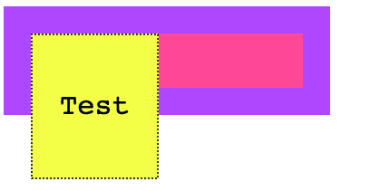

下面是我们已经看到的`.child`是静态的(默认):

```
.child {
  /* ... */
  position: static;
}

.box {
  /* ... */
  position: absolute;
  top: 0px;
  left: 0px;
}
```


像相对定位一样，您可以使用`z-index`来改变 z 轴的位置。

#### 固定定位

与绝对定位一样，当一个元素被赋值`position: fixed`时，它将从页面流中移除。

绝对定位的区别在于:元素现在总是相对于窗口定位，而不是第一个非静态容器。

```
.box {
  /* ... */
  position: fixed;
}
```

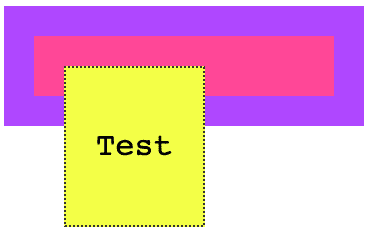

```
.box {
  /* ... */
  position: fixed;
  top: 0;
  left: 0;
}
```

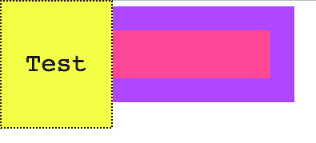

另一个很大的区别是元素不受滚动的影响。一旦你把一个粘性元素放到某个地方，滚动页面并不会把它从页面的可见部分移除。

#### 粘性定位

虽然上述值已经存在很长时间了，但是这个值是最近才引入的，相对来说仍然不受支持([参见 caniuse.com](https://caniuse.com/#feat=css-sticky))

UITableView iOS 组件是我想到`position: sticky`时想到的东西。你知道当你在联系人列表中滚动时，第一个字母粘在顶部，让你知道你正在查看特定字母的联系人吗？

我们使用 JavaScript 来模拟这一点，但这是 CSS 所采用的方法，以允许它在本地实现。

### 浮动和清算

浮动在过去是一个非常重要的话题。

它被用在许多黑客和创造性的用法中，因为它是少数几种方法之一，和表格一起，我们可以真正实现一些布局。在过去，我们习惯于将侧边栏浮动到左边，例如，显示在屏幕的左侧，并给主要内容增加一些空白。

幸运的是，时代已经改变了，今天我们有 Flexbox 和 Grid 来帮助我们进行布局，float 回到了它最初的范围:将内容放在容器元素的一侧，并让它的兄弟出现在它周围。

`float`属性支持 3 个值:

*   `left`
*   `right`
*   `none`(默认)

假设我们有一个盒子，里面有一段文字，这段文字里还有一张图片。

下面是一些代码:

```
<div class="parent">
  <div class="child">
    <div class="box">
      <p>This is some random paragraph and an image.  The image is in the middle of the text. The image is in the middle of the text. The image is in the middle of the text. The image is in the middle of the text. The image is in the middle of the text. The image is in the middle of the text. The image is in the middle of the text. The image is in the middle of the text. The image is in the middle of the text.
      </p>
    </div>
  </div>
</div>

.parent {
  background-color: #af47ff;
  padding: 30px;
  width: 500px;
}

.child {
  background-color: #ff4797;
  padding: 30px;
}

.box {
  background-color: #f3ff47;
  padding: 30px;
  border: 2px solid #333;
  border-style: dotted;
  font-family: courier;
  text-align: justify;
  font-size: 1rem;
}
```

和视觉外观:

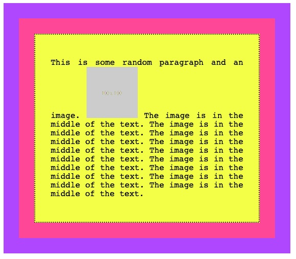

正如您所看到的，默认情况下，正常流认为图像是内嵌的，并在行本身中为其留出空间。

如果我们给图像添加`float: left`和一些填充:

```
img {
  float: left;
  padding: 20px 20px 0px 0px;
}
```

这是结果:

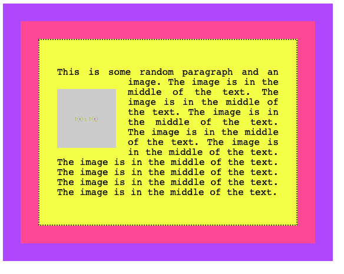

这是我们通过应用浮动得到的结果:对，相应地调整填充:

```
img {
  float: right;
  padding: 20px 0px 20px 20px;
}
```

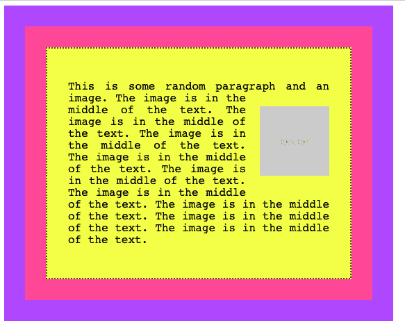

浮动元素从页面的正常流动中移除，其他内容围绕它流动。

[参见 Codepen 上的示例](https://codepen.io/flaviocopes/pen/WWGqPr?editors=1100)

你也不局限于浮动图像。这里我们用一个`span`元素切换图像:

```
<div class="parent">
  <div class="child">
    <div class="box">
      <p>This is some random paragraph and an image. <span>Some text to float</span> The image is in the middle of the text. The image is in the middle of the text. The image is in the middle of the text. The image is in the middle of the text. The image is in the middle of the text. The image is in the middle of the text. The image is in the middle of the text. The image is in the middle of the text. The image is in the middle of the text.
      </p>
    </div>
  </div>
</div>

span {
  float: right;
  margin: 20px 0px 20px 20px;
  padding: 10px;
  border: 1px solid black
}
```

这就是结果:

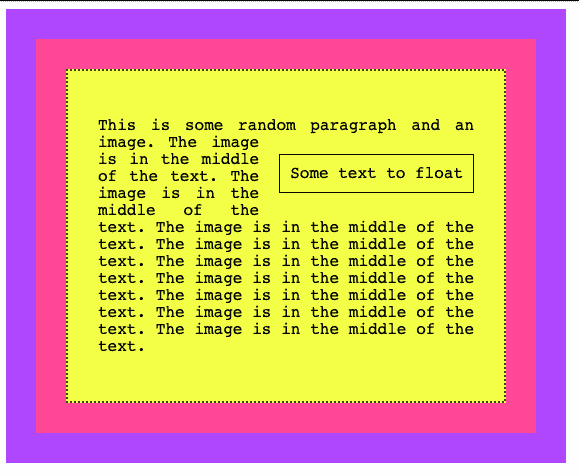

#### 清算

当你浮动不止一个元素时会发生什么？

如果当它们浮动时发现另一个浮动图像，默认情况下，它们会一个挨着一个水平堆叠。直到没有空间，它们将开始被堆叠在新的一行上。

假设我们在一个`p`标签中有 3 个内嵌图像:

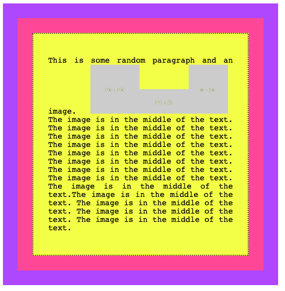

如果我们给这些图像加上`float: left`:

```
img {
  float: left;
  padding: 20px 20px 0px 0px;
}
```

这是我们要吃的:

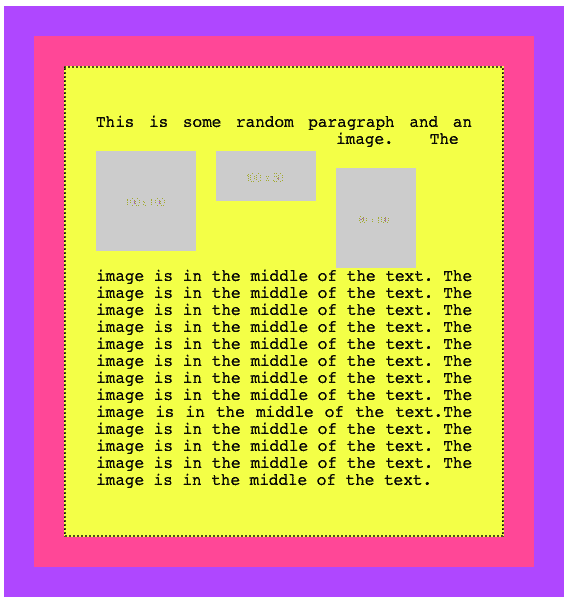

如果您将`clear: left`添加到图像中，这些图像将垂直堆叠，而不是水平堆叠:

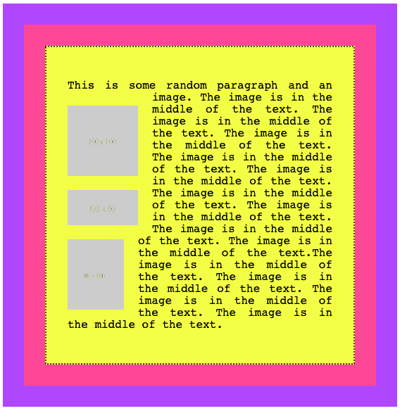

我使用了`clear`的`left`值。它允许

*   `left`清除左侧浮动
*   `right`清除右侧浮动
*   `both`清除左右浮动
*   `none`(默认)禁用清除

### z 指数

当我们谈到定位时，我提到你可以使用`z-index`属性来控制元素的 Z 轴定位。

当你有多个元素相互重叠时，这是非常有用的，你需要决定哪一个是可见的，离用户更近，哪一个应该隐藏在后面。

该属性接受一个数字(不带小数)，并使用该数字计算 Z 轴上哪些元素看起来更靠近用户。

z 索引值越高，元素越靠近用户。

当决定哪个元素应该是可见的，哪个元素应该位于它的后面时，浏览器对 z 索引值进行计算。

默认值是`auto`，一个特殊的关键字。使用`auto`，Z 轴顺序由页面中 HTML 元素的位置决定——最后一个兄弟元素首先出现，因为它是最后定义的。

默认情况下，元素的`position`属性具有`static`值。在这种情况下，`z-index`属性没有任何区别——它必须设置为`absolute`、`relative`或`fixed`才能工作。

示例:

```
.my-first-div {
    position: absolute;
    top: 0;
    left: 0;
    width: 600px;
    height: 600px;
    z-index: 10;
}

.my-second-div {
    position: absolute;
    top: 0;
    left: 0;
    width: 500px;
    height: 500px;
    z-index: 20;
}
```

将显示类别为`.my-second-div`的元素，其后面是`.my-first-div`。

这里我们用 10 和 20，但是你可以用任何数字。负数也是。选择不连续的数字是很常见的，所以你可以把元素放在中间。如果使用连续数字，则需要重新计算定位中涉及的每个元素的 z 索引。

### CSS 网格

CSS Grid 是 CSS 领域的新生事物，虽然还没有得到所有浏览器的完全支持，但它将成为未来的布局系统。

CSS Grid 是一种使用 CSS 构建布局的全新方法。

请留意 caniuse.com([https://caniuse.com/#feat=css-grid](https://caniuse.com/#feat=css-grid))上的 CSS 网格布局页面，了解目前哪些浏览器支持它。在撰写本文时，2019 年 4 月，所有主要的浏览器(除了 IE，它永远不会有对它的支持)都已经支持这项技术，覆盖了所有用户的 92%。

CSS Grid 不是 Flexbox 的竞争对手。它们在复杂的布局上进行互操作和协作，因为 CSS Grid 在二维(行和列)上工作，而 Flexbox 在一维(行或列)上工作。

传统上，构建网页布局是一个复杂的话题。

我不会深究这种复杂性的原因，这本身就是一个复杂的话题。但是你可以认为自己是一个非常幸运的人，因为现在你有两个非常强大和支持良好的工具供你使用:

*   **CSS Flexbox**
*   **CSS 网格**

这两个是构建未来网络布局的工具。

除非您需要支持 IE8 和 IE9 之类的旧浏览器，否则没有理由搞乱像这样的东西:

*   表格布局
*   漂浮物
*   clearfix 黑客
*   `display: table`黑客

在本指南中，你需要知道如何从对 CSS 网格一无所知成为一名熟练的用户。

#### 基础知识

CSS 网格布局通过设置`display: grid`在容器元素(可以是`div`或任何其他标签)上激活。

与 flexbox 一样，您可以在容器上定义一些属性，在网格中的每个单独的项目上定义一些属性。

这些属性结合起来将决定网格的最终外观。

最基本的容器属性是`grid-template-columns`和`grid-template-rows`。

#### 网格-模板-列和网格-模板-行

这些属性定义了网格中的列数和行数，还设置了每列/行的宽度。

下面的代码片段定义了一个网格，该网格有 4 列，每列宽 200 像素，2 行高 300 像素。

```
.container {
  display: grid;
  grid-template-columns: 200px 200px 200px 200px;
  grid-template-rows: 300px 300px;
}
```

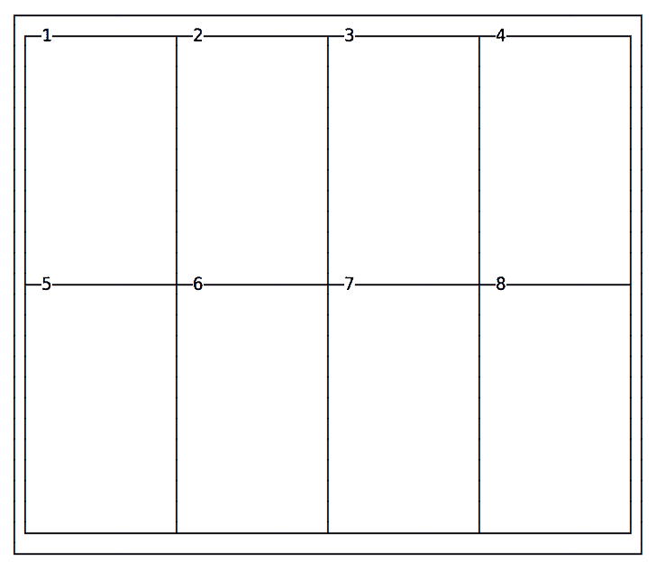

这是另一个 2 列 2 行的网格示例:

```
.container {
  display: grid;
  grid-template-columns: 200px 200px;
  grid-template-rows: 100px 100px;
}
```

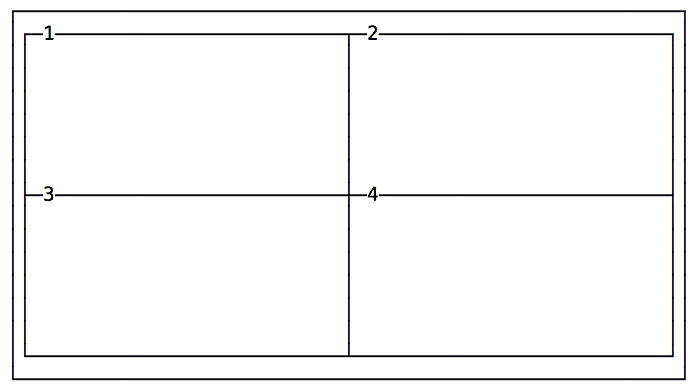

#### 自动尺寸

很多时候，你可能有一个固定的页眉尺寸，一个固定的页脚尺寸，以及高度灵活的主要内容，这取决于它的长度。在这种情况下，您可以使用 auto 关键字:

```
.container {
  display: grid;
  grid-template-rows: 100px auto 100px;
}
```

#### 不同的列和行维度

在上面的例子中，我们通过对行使用相同的值和对列使用相同的值来制作规则的网格。

您可以为每一行/列指定任何值，以创建许多不同的设计:

```
.container {
  display: grid;
  grid-template-columns: 100px 200px;
  grid-template-rows: 100px 50px;
}
```

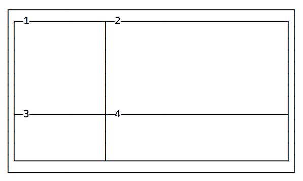

另一个例子:

```
.container {
  display: grid;
  grid-template-columns: 10px 100px;
  grid-template-rows: 100px 10px;
}
```

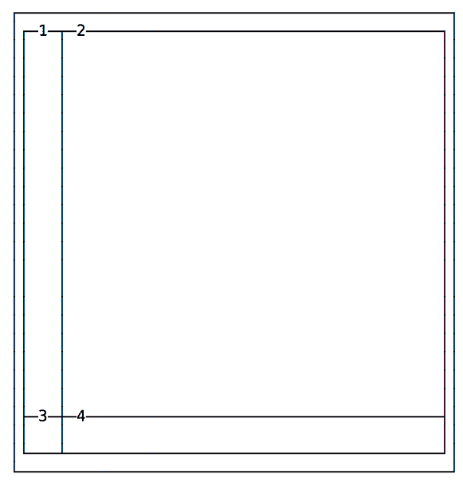

#### 增加单元格之间的间距

除非指定，否则单元格之间没有空格。

您可以使用这些属性来添加间距:

*   `grid-column-gap`
*   `grid-row-gap`

或者速记语法`grid-gap`。

示例:

```
.container {
  display: grid;
  grid-template-columns: 100px 200px;
  grid-template-rows: 100px 50px;
  grid-column-gap: 25px;
  grid-row-gap: 25px;
}
```

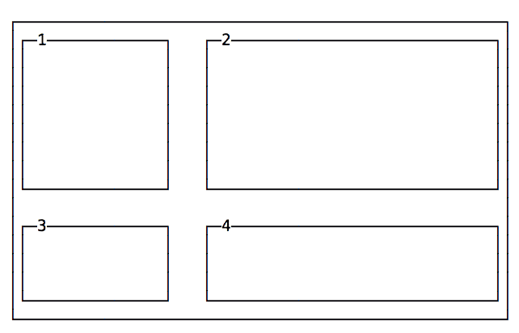

使用简写的相同布局:

```
.container {
  display: grid;
  grid-template-columns: 100px 200px;
  grid-template-rows: 100px 50px;
  grid-gap: 25px;
}
```

#### 在多列和/或多行上生成项目

每个单元格项都可以选择在一行中占据多个框，水平或垂直扩展以获得更多空间，同时考虑容器中设置的网格比例。

我们将使用这些属性:

*   `grid-column-start`
*   `grid-column-end`
*   `grid-row-start`
*   `grid-row-end`

示例:

```
.container {
  display: grid;
  grid-template-columns: 200px 200px 200px 200px;
  grid-template-rows: 300px 300px;
}

.item1 {
  grid-column-start: 2;
  grid-column-end: 4;
}

.item6 {
  grid-column-start: 3;
  grid-column-end: 5;
}
```

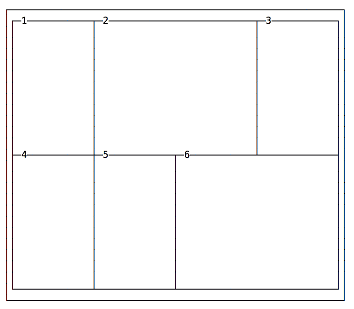

这些数字对应于分隔每列的垂直线，从 1:


同样的原理也适用于`grid-row-start`和`grid-row-end`，只不过这一次，一个单元格不是获取更多的列，而是获取更多的行。

#### 速记语法

这些属性具有由以下内容提供的简写语法:

*   `grid-column`
*   `grid-row`

用法很简单，下面是如何复制上面的布局:

```
.container {
  display: grid;
  grid-template-columns: 200px 200px 200px 200px;
  grid-template-rows: 300px 300px;
}

.item1 {
  grid-column: 2 / 4;
}

.item6 {
  grid-column: 3 / 5;
}
```

另一种方法是设置起始列/行，并使用`span`设置它应该占据多少:

```
.container {
  display: grid;
  grid-template-columns: 200px 200px 200px 200px;
  grid-template-rows: 300px 300px;
}

.item1 {
  grid-column: 2 / span 2;
}

.item6 {
  grid-column: 3 / span 2;
}
```

### 更多网格配置

#### 使用分数

指定每一列或每一行的精确宽度并不是在所有情况下都是理想的。

分数是空间的单位。

以下示例将网格分成 3 列，每列具有相同的宽度和 1/3 的可用空间。

```
.container {
  grid-template-columns: 1fr 1fr 1fr;
}
```

#### 使用百分比和 rem

您还可以使用百分比，以及混合和匹配分数、像素、rem 和百分比:

```
.container {
  grid-template-columns: 3rem 15% 1fr 2fr
}
```

#### 使用`repeat()`

`repeat()`是一个特殊的函数，它采用一个数字来表示一行/一列将要重复的次数，以及每一行/一列的长度。

如果每列都具有相同的宽度，您可以使用以下语法指定布局:

```
.container {
  grid-template-columns: repeat(4, 100px);
}
```

这将创建 4 个宽度相同的列。

或者使用分数:

```
.container {
  grid-template-columns: repeat(4, 1fr);
}
```

#### 指定行的最小宽度

常见用例:当你调整窗口大小时，拥有一个不会折叠超过一定数量像素的侧边栏。

这里有一个例子，侧边栏占据了屏幕的 1/4，并且从来不会少于 200 像素:

```
.container {
  grid-template-columns: minmax(200px, 3fr) 9fr;
}
```

您也可以使用`auto`关键字设置最大值:

```
.container {
  grid-template-columns: minmax(auto, 50%) 9fr;
}
```

或者只是一个最小值:

```
.container {
  grid-template-columns: minmax(100px, auto) 9fr;
}
```

#### 使用`grid-template-areas`定位元件

默认情况下，元素按照它们在 HTML 结构中的顺序放置在网格中。

使用`grid-template-areas`你可以定义模板区域在网格中移动它们，也可以在多行/多列上生成一个项目，而不是使用`grid-column`。

这里有一个例子:

```
<div class="container">
  <main>
    ...
  </main>
  <aside>
    ...
  </aside>
  <header>
    ...
  </header>
  <footer>
    ...
  </footer>
</div>

.container {
  display: grid;
  grid-template-columns: 200px 200px 200px 200px;
  grid-template-rows: 300px 300px;
  grid-template-areas:
    "header header header header"
    "sidebar main main main"
    "footer footer footer footer";
}
main {
  grid-area: main;
}
aside {
  grid-area: sidebar;
}
header {
  grid-area: header;
}
footer {
  grid-area: footer;
}
```

不管它们的原始顺序如何，根据与它们相关联的`grid-area`属性，项目被放置在`grid-template-areas`定义的位置。

#### 在模板区域中添加空单元格

您可以使用点`.`代替`grid-template-areas`中的区域名称来设置空单元格:

```
.container {
  display: grid;
  grid-template-columns: 200px 200px 200px 200px;
  grid-template-rows: 300px 300px;
  grid-template-areas:
    ". header header ."
    "sidebar . main main"
    ". footer footer .";
}
```

#### 用网格填充页面

您可以使用`fr`扩展网格以填充页面:

```
.container {
  display: grid;
  height: 100vh;
  grid-template-columns: 1fr 1fr 1fr 1fr;
  grid-template-rows: 1fr 1fr;
}
```

#### 一个例子:页眉、侧边栏、内容和页脚

下面是一个使用 CSS Grid 创建站点布局的简单示例，它提供了一个顶部标题、一个主要部分，左边是侧栏，右边是内容，后面是页脚。

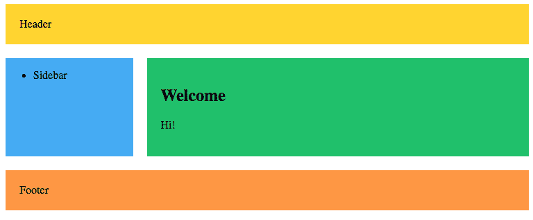

下面是标记:

```
<div class="wrapper">
  <header>Header</header>
  <article>
    <h1>Welcome</h1>
    <p>Hi!</p>
  </article>
  <aside><ul><li>Sidebar</li></ul></aside>
  <footer>Footer</footer>
</div>
```

这是 CSS:

```
header {
  grid-area: header;
  background-color: #fed330;
  padding: 20px;
}
article {
  grid-area: content;
  background-color: #20bf6b;
  padding: 20px;
}
aside {
  grid-area: sidebar;
  background-color: #45aaf2;
}
footer {
  padding: 20px;
  grid-area: footer;
  background-color: #fd9644;
}
.wrapper {
  display: grid;
  grid-gap: 20px;
  grid-template-columns: 1fr 3fr;
  grid-template-areas:
    "header  header"
    "sidebar content"
    "footer  footer";
}
```

我添加了一些颜色让它看起来更漂亮，但是基本上它给每个不同的标签分配了一个`grid-area`名称，这个名称在`.wrapper`的`grid-template-areas`属性中使用。

当布局较小时，我们可以使用媒体查询将侧栏放在内容下方:

```
@media (max-width: 500px) {
  .wrapper {
    grid-template-columns: 4fr;
    grid-template-areas:
      "header"
      "content"
      "sidebar"
      "footer";
  }
}
```

[参见上码笔](https://codepen.io/flaviocopes/pen/JZWOEK)

这些是 CSS 网格的基础。有很多东西我没有包括在这个介绍中，但我想让它非常简单，所以你可以开始使用这个新的布局系统，而不会感到势不可挡。

### flex box(flex box)的缩写形式

Flexbox，也称为柔性盒模块，是与 CSS Grid 并列的两大现代布局系统之一。

与 CSS 网格(是二维的)相比，flexbox 是一个**一维布局模型**。它将控制基于行或列的布局，但不会同时控制在一起。

flexbox 的主要目标是根据您设置的一些规则，允许项目填充其容器提供的整个空间。

除非你需要支持 IE8 和 IE9 这样的老浏览器，否则 Flexbox 是让你忘记使用

*   表格布局
*   漂浮物
*   clearfix 黑客
*   `display: table`黑客

让我们一头扎进 flexbox，在很短的时间内成为它的主人。

### 浏览器支持

在撰写本文时(2018 年 2 月)，它得到了 97.66%用户的支持。所有最重要的浏览器都已经实现它很多年了，所以甚至旧的浏览器(包括 IE10+)也包括在内:

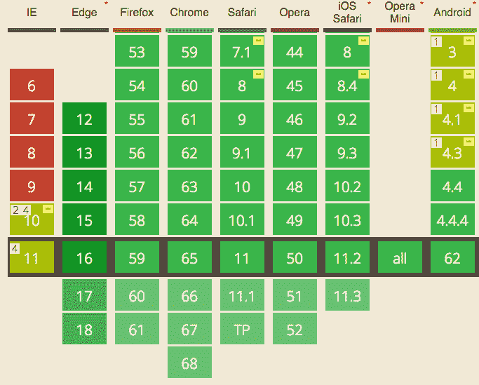

虽然我们必须等待几年才能让用户赶上 CSS Grid，但 Flexbox 是一种更老的技术，现在就可以使用。

### 启用 Flexbox

通过设置，将 flexbox 布局应用于容器

```
display: flex;
```

或者

```
display: inline-flex;
```

容器内的内容**将使用 flexbox 对齐。**

#### 容器属性

有些 flexbox 属性适用于容器，它为其项目设置一般规则。他们是

*   `flex-direction`
*   `justify-content`
*   `align-items`
*   `flex-wrap`
*   `flex-flow`

#### 对齐行或列

我们看到的第一个属性是`**flex-direction**`，它决定了容器是应该按行对齐还是按列对齐:

*   `flex-direction: row`将项目按文本方向(西方国家为从左到右)放置为一个**行**
*   `flex-direction: row-reverse`像`row`一样放置物品，但方向相反
*   `flex-direction: column`将项目放置在**列**中，从上到下排序
*   `flex-direction: column-reverse`将项目放在一列中，就像`column`一样，但方向相反

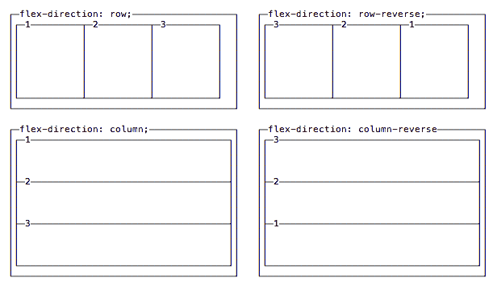

#### 垂直和水平对齐

默认情况下，如果`flex-direction`是行，从左边开始；如果`flex-direction`是列，从上面开始。

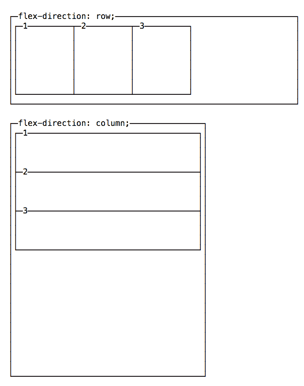

您可以使用`justify-content`来更改水平对齐，使用`align-items`来更改垂直对齐。

#### 更改水平对齐方式

`**justify-content**`有 5 个可能的值:

*   `flex-start`:对齐容器的左侧。
*   `flex-end`:对准容器的右侧。
*   `center`:对准容器的中心。
*   `space-between`:等间距显示。
*   `space-around`:周围等间距显示

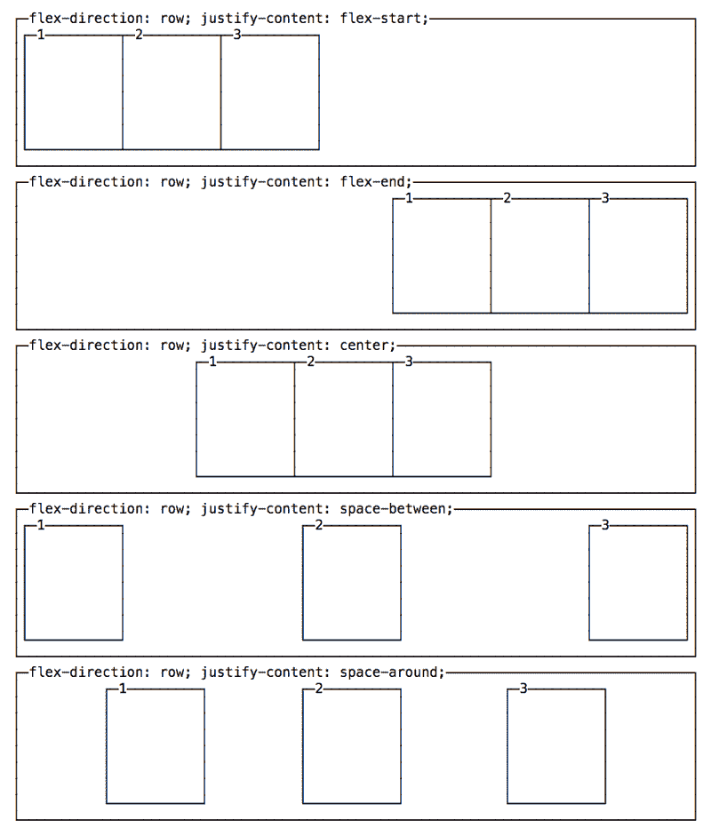

#### 更改垂直对齐方式

`**align-items**`有 5 个可能的值:

*   `flex-start`:对齐容器顶部。
*   `flex-end`:对齐容器底部。
*   `center`:对准容器的垂直中心。
*   `baseline`:显示在集装箱的基线上。
*   `stretch`:物品被拉伸以适应容器。

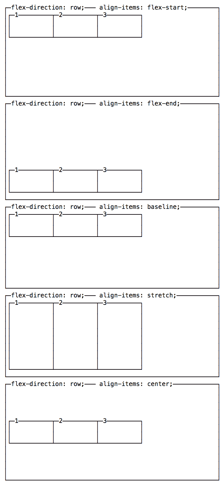

关于`baseline`的说明:

在这个例子中，`baseline`看起来与`flex-start`相似，因为我的盒子太简单了。看看[这支代码笔](https://codepen.io/flaviocopes/pen/oExoJR)有一个更有用的例子，它是我从最初由[马丁·米查莱克](https://twitter.com/machal)创造的一支笔中派生出来的。如您所见，物品尺寸是对齐的。

#### 包装

默认情况下，flexbox 容器中的项目保持在一行上，收缩它们以适合容器。

要强制项目跨多行展开，请使用`flex-wrap: wrap`。这将根据`flex-direction`中设置的顺序分发物品。使用`flex-wrap: wrap-reverse`反转这个顺序。

一个名为`flex-flow`的速记属性允许您在一行中指定`flex-direction`和`flex-wrap`，方法是首先添加`flex-direction`值，然后添加`flex-wrap`值，例如:`flex-flow: row wrap`。

#### 适用于每个单项的属性

到目前为止，我们已经看到了可以应用于容器的属性。

单个项目可以有一定的独立性和灵活性，您可以使用这些属性来改变它们的外观:

*   `order`
*   `align-self`
*   `flex-grow`
*   `flex-shrink`
*   `flex-basis`
*   `flex`

下面我们来详细看看。

#### 使用顺序在另一个项目之前/之后移动项目

项目是根据它们被分配的顺序来排序的。默认情况下，每个项目都有顺序`0`，HTML 中的外观决定了最终的顺序。

您可以在每个单独的项目上使用`order`来覆盖该属性。这是您在项目上设置的属性，而不是容器。通过设置负值，可以使一个项目出现在所有其他项目之前。

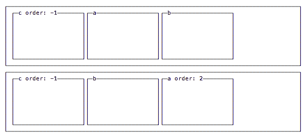

#### 使用自对齐进行垂直对齐

一个物品可以选择**覆盖**容器`align-items`设置，使用`**align-self**`，它有`align-items`相同的 5 个可能值:

*   `flex-start`:对齐容器顶部。
*   `flex-end`:对齐容器底部。
*   `center`:对准容器的垂直中心。
*   `baseline`:显示在集装箱的基线上。
*   `stretch`:物品被拉伸以适应容器。

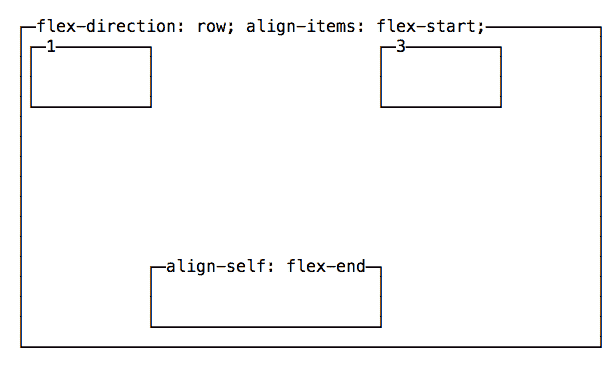

#### 如有必要，放大或缩小项目

**伸缩增长**

任何项目的默认值为 0。

如果所有项目都定义为 1，一个定义为 2，则较大的元素将占用两个“1”项目的空间。

**伸缩**

任何项目的默认值都是 1。

如果所有项目都定义为 1，其中一个定义为 3，则较大的元素将收缩 3 倍于其他元素。当可用空间减少时，占用的空间将减少 3 倍。

**弹性基础**

如果设置为`auto`，它将根据项目的宽度或高度调整项目的大小，并根据`flex-grow`属性添加额外的空间。

如果设置为 0，则在计算布局时不会为项目添加任何额外的空间。

如果您指定一个像素数值，它将使用该值作为长度值(宽度或高度取决于它是行还是列项目)

**伸缩**

该属性结合了上述 3 个属性:

*   `flex-grow`
*   `flex-shrink`
*   `flex-basis`

并提供了一个速记语法:`flex: 0 1 auto`

### 桌子

过去表格在 CSS 中被过度使用，因为它们是我们创建一个漂亮的页面布局的唯一方法之一。

如今，有了 Grid 和 Flexbox，我们可以将表格移回到它们原本要做的工作:设计表格的样式。

让我们从 HTML 开始。这是一个基本表格:

```
<table>
  <thead>
    <tr>
      <th scope="col">Name</th>
      <th scope="col">Age</th>
    </tr>
  </thead>
  <tbody>
    <tr>
      <th scope="row">Flavio</th>
      <td>36</td>
    </tr>
    <tr>
      <th scope="row">Roger</th>
      <td>7</td>
    </tr>
  </tbody>
</table>
```

默认情况下，它不是很有吸引力。浏览器提供了一些标准样式，仅此而已:

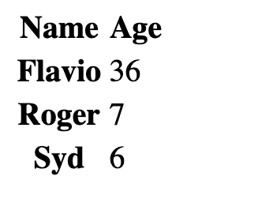

当然，我们可以使用 CSS 样式化表格的所有元素。

先说边界。一个好的边界可以走很长的路。

我们可以将它应用到`table`元素上，也可以应用到内部元素上，比如`th`和`td`:

```
table, th, td {
  border: 1px solid #333;
}
```

如果我们给它加上一些余量，我们会得到一个很好的结果:

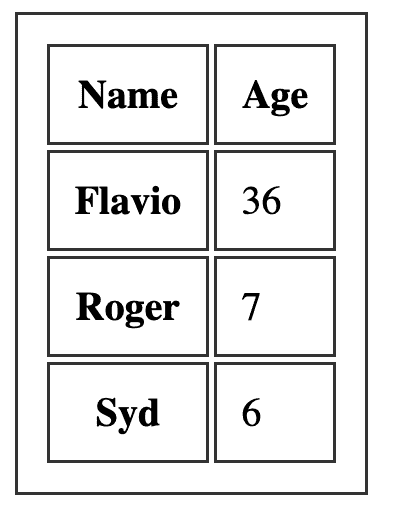

表格的一个共同点是能够向一行添加颜色，向另一行添加不同的颜色。这可以使用`:nth-child(odd)`或`:nth-child(even)`选择器:

```
tbody tr:nth-child(odd) {
  background-color: #af47ff;
}
```

这给了我们:

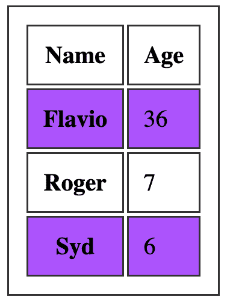

如果您将`border-collapse: collapse;`添加到表格元素中，所有的边框将合并成一个:

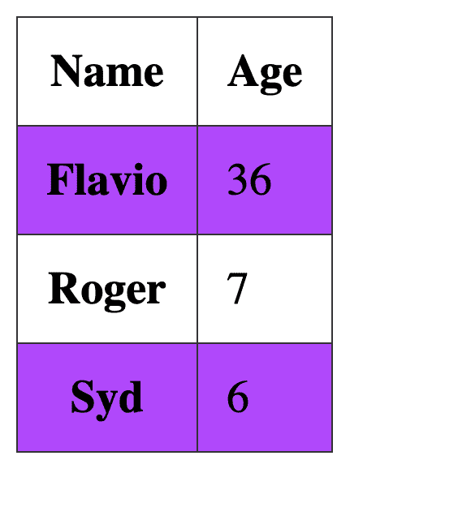

### 定中心

在 CSS 中居中是一项非常不同的任务，如果你需要水平或垂直居中。

在这篇文章中，我解释了最常见的情况以及如何解决它们。如果 Flexbox 提供了新的解决方案，我会忽略旧的技术，因为我们需要前进，Flexbox 已经被浏览器支持了很多年，包括 IE10。

### 水平居中

#### 文本

使用设置为`center`的`text-align`属性将文本水平居中非常简单:

```
p {
  text-align: center;
}
```

#### 阻碍

将非文本内容居中的现代方法是使用 Flexbox:

```
#mysection {
  display: flex;
  justify-content: center;
}
```

`#mysection`内的任何元素将水平居中。

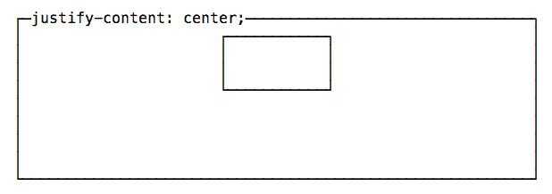

如果你不想使用 Flexbox，这里有一个替代方法。

任何不是文本的内容都可以居中，方法是在左右两边应用自动边距，并设置元素的宽度:

```
section {
  margin: 0 auto;
  width: 50%;
}
```

上面的`margin: 0 auto;`是对:

```
section {
  margin-top: 0;
  margin-bottom: 0;
  margin-left: auto;
  margin-right: auto;
}
```

如果是内联元素，记得将该项设置为`display: block`。

### 垂直居中

传统上，这一直是一项艰巨的任务。Flexbox 现在以最简单的方式为我们提供了一个很好的方法:

```
#mysection {
  display: flex;
  align-items: center;
}
```

`#mysection`内的任何元素将垂直居中。

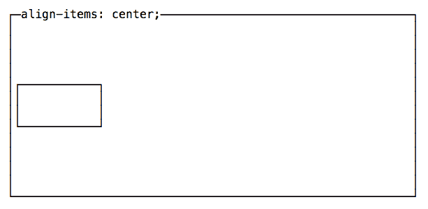

### 垂直和水平居中

可以将垂直居中和水平居中的 Flexbox 技术结合起来，使页面中的元素完全居中。

```
#mysection {
  display: flex;
  align-items: center;
  justify-content: center;
}
```

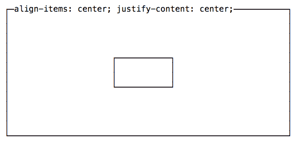

同样可以使用 [CSS 网格](https://flaviocopes.com/css-grid/)来完成:

```
body {
  display: grid;
  place-items: center;
  height: 100vh;
}
```

### 列表

列表是许多网页中非常重要的一部分。

CSS 可以使用几个属性来设置它们的样式。

`list-style-type`用于设置列表使用的预定义标记:

```
li {
  list-style-type: square;
}
```

我们有很多可能的值，你可以在这里看到[https://developer . Mozilla . org/en-US/docs/Web/CSS/list-style-type](https://developer.mozilla.org/en-US/docs/Web/CSS/list-style-type)以及它们的外观示例。一些最受欢迎的是`disc`、`circle`、`square`和`none`。

`list-style-image`用于在预定义标记不适用时使用自定义标记:

```
li {
  list-style-image: url(list-image.png);
}
```

`list-style-position`允许您在页面流中而不是页面外添加列表内容的标记`outside`(默认)或`inside`

```
li {
  list-style-position: inside;
}
```

`list-style`速记属性让我们在同一行中指定所有这些属性:

```
li {
  list-style: url(list-image.png) inside;
}
```

### 媒体询问和响应设计

在本节中，我们将首先介绍媒体类型和媒体特征描述符，然后解释媒体查询。

#### 媒体类型

媒体类型在媒体查询和@import 声明中使用，它允许我们确定一个 CSS 文件或一段 CSS 被加载到哪个媒体上。

我们有以下**种媒体类型**

*   `all`指所有媒体
*   `print`打印时使用
*   当页面出现在屏幕上时使用
*   `speech`用于屏幕阅读器

`screen`是默认值。

过去我们有更多的方法，但大多数都被否决了，因为它们被证明是确定设备需求的无效方法。

我们可以像这样在@import 语句中使用它们:

```
@import url(myfile.css) screen;
@import url(myfile-print.css) print;
```

我们可以在多种媒体类型上加载一个 CSS 文件，用逗号分隔:

```
@import url(myfile.css) screen, print;
```

这同样适用于 HTML 中的`link`标签:

```
<link rel="stylesheet" type="text/css" href="myfile.css" media="screen" />
<link rel="stylesheet" type="text/css" href="another.css" media="screen, print" />
```

我们不仅限于在`media`属性和`@import`声明中使用媒体类型。还有更多。

#### 媒体特征描述符

首先，让我们介绍一下**媒体特征描述符**。它们是额外的关键字，我们可以将它们添加到`link`的`media`属性或`@import`声明中，以表达 CSS 加载的更多条件。

以下是他们的名单:

*   `width`
*   `height`
*   `device-width`
*   `device-height`
*   `aspect-ratio`
*   `device-aspect-ratio`
*   `color`
*   `color-index`
*   `monochrome`
*   `resolution`
*   `orientation`
*   `scan`
*   `grid`

它们中的每一个都有对应的 min- *和 max-* ，例如:

*   `min-width`，`max-width`
*   `min-device-width`，`max-device-width`

诸如此类。

其中一些接受可以用`px`或`rem`表示的长度值或任何长度值。就是`width`、`height`、`device-width`、`device-height`的情况。

例如:

```
@import url(myfile.css) screen and (max-width: 800px);
```

请注意，我们使用括号中的媒体特征描述符来包装每个块。

有些接受固定值。`orientation`用于检测设备方位，接受`portrait`或`landscape`。

示例:

```
<link rel="stylesheet" type="text/css" href="myfile.css" media="screen and (orientation: portrait)" />
```

用于确定屏幕类型的`scan`，接受`progressive`(用于现代显示器)或`interlace`(用于老式 CRT 设备)。

有些人想要一个整数。

像`color`检查设备使用的每个颜色分量的位数。很低级，但是你只需要知道它就在那里供你使用(比如`grid`、`color-index`、`monochrome`)。

`aspect-ratio`和`device-aspect-ratio`接受一个表示视口宽高比的比值，用分数表示。

示例:

```
@import url(myfile.css) screen and (aspect-ratio: 4/3);
```

`resolution`代表设备的像素密度，用`dpi`一样的[分辨率数据类型](https://developer.mozilla.org/en-US/docs/Web/CSS/resolution)表示。

示例:

```
@import url(myfile.css) screen and (min-resolution: 100dpi);
```

#### 逻辑运算符

我们可以使用`and`来组合规则:

```
<link rel="stylesheet" type="text/css" href="myfile.css" media="screen and (max-width: 800px)" />
```

我们可以使用逗号执行“或”类型的逻辑运算，它组合了多个媒体查询:

```
@import url(myfile.css) screen, print;
```

我们可以使用`not`来否定一个媒体查询:

```
@import url(myfile.css) not screen;
```

> *重要:`not`只能用来否定整个媒体查询，所以必须放在它的开头(或者逗号后面)。*

#### 媒体查询

我们看到的应用于@import 或`link` HTML 标签的所有上述规则也可以应用于 CSS 内部。

你需要将它们包装在一个`@media () {}`结构中。

示例:

```
@media screen and (max-width: 800px) {
  /* enter some CSS */
}
```

而这是**响应式设计**的基础。

媒体查询可能相当复杂。本示例仅在 CSS 是屏幕设备，宽度在 600 到 800 像素之间，方向为横向时应用 CSS:

```
@media screen and (max-width: 800px) and (min-width: 600px) and (orientation: landscape) {
  /* enter some CSS */
}
```

### 功能查询

特性查询是 CSS 的一个新功能，相对来说不为人知，但却得到了很好的支持。

我们可以用它来检查使用`@supports`关键字的浏览器是否支持某个特性。

我认为在我写作的时候，这对于检查浏览器是否支持 CSS 网格特别有用，例如，可以使用:

```
@supports (display: grid) {
  /* apply this CSS */
}
```

我们检查浏览器是否支持`display`属性的`grid`值。

我们可以对任何 CSS 属性使用`@supports`来检查任何值。

我们还可以使用逻辑运算符`and`、`or`和`not`来构建复杂的特性查询:

```
@supports (display: grid) and (display: flex) {
  /* apply this CSS */
}
```

### 过滤

过滤器允许我们对元素执行操作。

您通常使用 Photoshop 或其他照片编辑软件进行的操作，如更改不透明度或亮度等。

您使用了`filter`属性。这里有一个应用于图像的例子，但是这个属性可以用在任何元素上:

```
img {
  filter: <something>;
}
```

您可以在这里使用不同的值:

*   `blur()`
*   `brightness()`
*   `contrast()`
*   `drop-shadow()`
*   `grayscale()`
*   `hue-rotate()`
*   `invert()`
*   `opacity()`
*   `sepia()`
*   `saturate()`
*   `url()`

注意每个选项后面的括号，因为它们都需要一个参数。

例如:

```
img {
  filter: opacity(0.5);
}
```

意味着图像将是 50%透明的，因为`opacity()`取 0 到 1 中的一个值，或者一个百分比。

您也可以一次应用多个过滤器:

```
img {
  filter: opacity(0.5) blur(2px);
}
```

现在让我们来详细讨论一下每个过滤器。

#### `blur()`

模糊元素内容。你给它传递一个值，用`px`或者`em`或者`rem`来表示，这个值将被用来决定模糊半径。

示例:

```
img {
  filter: blur(4px);
}
```

#### `opacity()`

`opacity()`取 0 到 1 中的一个值，或一个百分比，并根据它确定图像的透明度。

`0`或`0%`，表示完全透明。`1`，或`100%`，或更高，表示完全可见。

示例:

```
img {
  filter: opacity(0.5);
}
```

CSS 也有一个`opacity`属性。`filter`不过，根据实施情况，可以通过硬件加速，因此这应该是首选方法。

#### `drop-shadow()`

`drop-shadow()`显示元素后面的阴影，跟随 alpha 通道。这意味着，如果您有一个透明的图像，您得到的是应用于图像形状的阴影，而不是图像框。如果图像没有 alpha 通道，阴影将应用于整个图像框。

它接受最少 2 个参数，最多 5 个:

*   *偏移-x* 设置水平偏移。可以是负数。
*   *偏移-y* 设置垂直偏移。可以是负数。
*   *模糊半径*，可选，设置阴影的模糊半径。默认为 0，无模糊。
*   *扩散半径*，可选，设置扩散半径。用`px`、`rem`或`em`表示
*   *颜色*，可选，设置阴影的颜色。

您可以在不设置扩散半径或模糊半径的情况下设置颜色。CSS 知道该值是颜色而不是长度值。

示例:

```
img {
  filter: drop-shadow(10px 10px 5px orange);
}

img {
  filter: drop-shadow(10px 10px orange);
}

img {
  filter: drop-shadow(10px 10px 5px 5px #333);
}
```

#### `grayscale()`

使元素具有灰色。

您传递一个从 0 到 1 或从 0%到 100%的值，其中 1 和 100%表示完全灰色，0 或 0%表示图像未被触摸，原始颜色保持不变。

示例:

```
img {
  filter: grayscale(50%);
}
```

#### `sepia()`

使元素具有棕褐色。

您传递一个从 0 到 1 或从 0%到 100%的值，其中 1 和 100%表示完全棕褐色，0 或 0%表示图像未被触摸，原始颜色保持不变。

示例:

```
img {
  filter: sepia(50%);
}
```

#### `invert()`

反转元素的颜色。反转颜色意味着在 HSL 色轮中查找相反的颜色。如果你不知道“色轮”是什么意思，就在谷歌上搜索一下。例如，黄色的反义词是蓝色，红色的反义词是青色。每一种颜色都有对立面。

您传递一个从 0 到 1 或从 0%到 100%的数字，它决定了反转的数量。1 或 100%表示完全反转，0 或 0%表示不反转。

0.5 或 50%将总是呈现 50%的灰色，因为你总是在轮子的中间结束。

示例:

```
img {
  filter: invert(50%);
}
```

#### `hue-rotate()`

HSL 色轮以度数表示。使用`hue-rotate()`您可以使用正旋转或负旋转来旋转颜色。

该函数接受一个`deg`值。

示例:

```
img {
  filter: hue-rotate(90deg);
}
```

#### `brightness()`

改变元素的亮度。

0 或 0%表示总黑色元素。1%或 100%给出不变的图像。

高于 1%或 100%的值会使图像变得更亮，直到达到全部白色元素。

示例:

```
img {
  filter: brightness(50%);
}
```

### `contrast()`

改变元素的对比度。

0 或 0%表示总灰色元素。1%或 100%给出不变的图像。

高于 1%或 100%的值会产生更大的对比度。

示例:

```
img {
  filter: contrast(150%);
}
```

#### `saturate()`

改变元素的饱和度。

0 或 0%给出总灰度元素(饱和度较低)。1%或 100%给出不变的图像。

高于 1%或 100%的值会产生更高的饱和度。

示例:

```
img {
  filter: saturate();
}
```

#### `url()`

该过滤器允许应用 SVG 文件中定义的过滤器。您指向 SVG 文件的位置。

示例:

```
img {
  filter: url(filter.svg);
}
```

SVG 过滤器超出了本文的范围，但您可以在这篇精彩的杂志文章中阅读更多内容:[https://www . smashingmagazine . com/2015/05/why-the-SVG-filter-is-awesome/](https://www.smashingmagazine.com/2015/05/why-the-svg-filter-is-awesome/)

### 变形金刚

变换允许您在 2D 或 3D 空间中平移、旋转、缩放和倾斜元素。它们是一个非常酷的 CSS 特性，尤其是在与动画结合的时候。

#### 2D 变换

`transform`属性接受这些函数:

*   `translate()`四处移动元素
*   `rotate()`旋转元素
*   `scale()`按尺寸缩放元素
*   `skew()`扭曲或倾斜一个元素
*   一种使用 6 个元素的矩阵来执行上述任何操作的方法，一种不太用户友好但不太冗长的语法

我们还有安讯士特有的功能:

*   `translateX()`在 X 轴上移动元素
*   `translateY()`在 Y 轴上移动元素
*   `scaleX()`在 X 轴上缩放元素大小
*   `scaleY()`在 Y 轴上缩放元素大小
*   `skewX()`扭曲或倾斜 X 轴上的元素
*   `skewY()`扭曲或倾斜 Y 轴上的元素

下面是一个将`.box`元素宽度改变 2(复制)和高度改变 0.5(减少一半)的转换示例:

```
.box {
    transform: scale(2, 0.5);
}
```

`[transform-origin](https://developer.mozilla.org/en-US/docs/Web/CSS/transform-origin)`让我们设置变换的原点(`(0, 0)`坐标),让我们改变旋转中心。

#### 组合多个变换

您可以通过用空格分隔每个函数来组合多个转换。

例如:

```
transform: rotateY(20deg) scaleX(3) translateY(100px);
```

#### 3D 转换

我们可以更进一步，在 3D 空间而不是 2D 空间移动我们的元素。对于 3D，我们添加了另一个轴 Z，它增加了我们视觉的深度。

使用`perspective`属性，您可以指定 3D 对象离查看者有多远。

示例:

```
.3Delement {
  perspective: 100px;
}
```

`perspective-origin`决定了观察者的位置的外观，我们在 X 轴和 Y 轴上是如何看待它的。

现在我们可以使用额外的函数来控制 Z 轴，并添加到其他 X 轴和 Y 轴变换中:

*   `translateZ()`
*   `rotateZ()`
*   `scaleZ()`

以及相应的快捷键`translate3d()`、`rotate3d()`、`scale3d()`作为使用`translateX()`、`translateY()`、`translateZ()`等功能的快捷键。

对于本手册来说，3D 变换有点太高级了，但是这是一个你可以自己探索的很好的主题。

### 过渡

CSS 过渡是在 CSS 中创建动画的最简单的方法。

在一个转换中，你改变一个属性的值，你告诉 CSS 根据一些参数慢慢地改变它，朝着一个最终的状态。

CSS 过渡由以下属性定义:

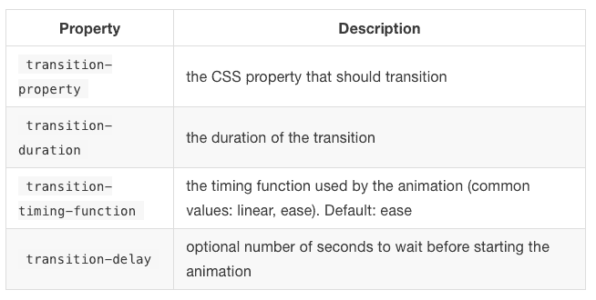

属性是一个方便的简写:

```
.container {
  transition: property
              duration
              timing-function
              delay;
}
```

#### CSS 转换的示例

这段代码实现了一个 CSS 转换:

```
.one,
.three {
  background: rgba(142, 92, 205, .75);
  transition: background 1s ease-in;
}

.two,
.four {
  background: rgba(236, 252, 100, .75);
}

.circle:hover {
  background: rgba(142, 92, 205, .25); /* lighter */
}
```

参见 Glitch [上的例子 https://flavio-CSS-transitions-example . Glitch . me](https://flavio-css-transitions-example.glitch.me/)

当将鼠标悬停在`.one`和`.three`元素上时，紫色的圆圈会显示一个过渡动画来缓解背景的变化，而黄色的圆圈则不会，因为它们没有定义`transition`属性。

#### 过渡时序函数值

`transition-timing-function`允许你指定过渡的加速曲线。

您可以使用一些简单的值:

*   `linear`
*   `ease`
*   `ease-in`
*   `ease-out`
*   `ease-in-out`

这个小故障展示了这些在实践中是如何工作的。

您可以使用[三次贝塞尔曲线](https://developer.mozilla.org/en-US/docs/Web/CSS/single-transition-timing-function)创建一个完全自定义的计时函数。这是相当先进的，但基本上任何上述功能都是使用贝塞尔曲线构建的。我们有方便的名字，因为它们很常见。

#### 浏览器开发工具中的 CSS 转换

浏览器开发工具提供了一种可视化转换的好方法。

这是 Chrome:

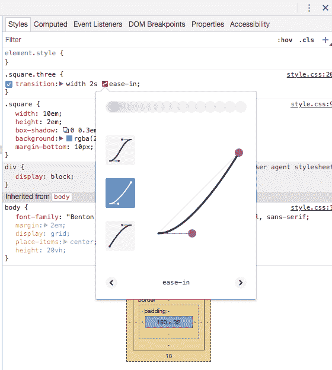

这是火狐浏览器:

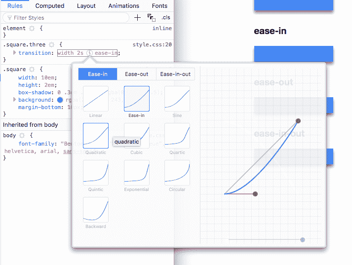

从这些面板中，您可以直接在页面中实时编辑过渡和实验，而无需重新加载代码。

#### 哪些属性可以使用 CSS 动画制作

很多！它们是一样的，你也可以使用 CSS 转场来制作动画。

以下是完整列表:

*   `background`
*   `background-color`
*   `background-position`
*   `background-size`
*   `border`
*   `border-color`
*   `border-width`
*   `border-bottom`
*   `border-bottom-color`
*   `border-bottom-left-radius`
*   `border-bottom-right-radius`
*   `border-bottom-width`
*   `border-left`
*   `border-left-color`
*   `border-left-width`
*   `border-radius`
*   `border-right`
*   `border-right-color`
*   `border-right-width`
*   `border-spacing`
*   `border-top`
*   `border-top-color`
*   `border-top-left-radius`
*   `border-top-right-radius`
*   `border-top-width`
*   `bottom`
*   `box-shadow`
*   `caret-color`
*   `clip`
*   `color`
*   `column-count`
*   `column-gap`
*   `column-rule`
*   `column-rule-color`
*   `column-rule-width`
*   `column-width`
*   `columns`
*   `content`
*   `filter`
*   `flex`
*   `flex-basis`
*   `flex-grow`
*   `flex-shrink`
*   `font`
*   `font-size`
*   `font-size-adjust`
*   `font-stretch`
*   `font-weight`
*   `grid-area`
*   `grid-auto-columns`
*   `grid-auto-flow`
*   `grid-auto-rows`
*   `grid-column-end`
*   `grid-column-gap`
*   `grid-column-start`
*   `grid-column`
*   `grid-gap`
*   `grid-row-end`
*   `grid-row-gap`
*   `grid-row-start`
*   `grid-row`
*   `grid-template-areas`
*   `grid-template-columns`
*   `grid-template-rows`
*   `grid-template`
*   `grid`
*   `height`
*   `left`
*   `letter-spacing`
*   `line-height`
*   `margin`
*   `margin-bottom`
*   `margin-left`
*   `margin-right`
*   `margin-top`
*   `max-height`
*   `max-width`
*   `min-height`
*   `min-width`
*   `opacity`
*   `order`
*   `outline`
*   `outline-color`
*   `outline-offset`
*   `outline-width`
*   `padding`
*   `padding-bottom`
*   `padding-left`
*   `padding-right`
*   `padding-top`
*   `perspective`
*   `perspective-origin`
*   `quotes`
*   `right`
*   `tab-size`
*   `text-decoration`
*   `text-decoration-color`
*   `text-indent`
*   `text-shadow`
*   `top`
*   `transform.`
*   `vertical-align`
*   `visibility`
*   `width`
*   `word-spacing`
*   `z-index`

### 动画片

CSS 动画是创建视觉动画的一种很好的方式，不局限于像 CSS 过渡这样的单一运动，而是更加清晰。

使用`animation`属性将动画应用于元素。

```
.container {
  animation: spin 10s linear infinite;
}
```

`spin`是动画的名字，我们需要单独定义。我们还告诉 CSS 让动画持续 10 秒，以线性方式执行(没有加速度或任何速度差异)，并无限重复。

你必须使用**关键帧**来**定义你的动画如何工作**。旋转项目的动画示例:

```
@keyframes spin {
  0% {
    transform: rotateZ(0);
  }
  100% {
    transform: rotateZ(360deg);
  }
}
```

在`@keyframes`定义中，你可以有任意多的中间航路点。

在这种情况下，我们指示 CSS 使用 transform 属性将 Z 轴从 0 度旋转到 360 度，完成整个循环。

您可以在这里使用任何 CSS 转换。

请注意，这并没有规定动画应该采用的时间间隔。这是通过`animation`使用时定义的。

#### 一个 CSS 动画示例

我想画四个圆，都有一个共同的起点，彼此相距 90 度。

```
<div class="container">
  <div class="circle one"></div>
  <div class="circle two"></div>
  <div class="circle three"></div>
  <div class="circle four"></div>
</div>

body {
  display: grid;
  place-items: center;
  height: 100vh;
}

.circle {
  border-radius: 50%;
  left: calc(50% - 6.25em);
  top: calc(50% - 12.5em);
  transform-origin: 50% 12.5em;
  width: 12.5em;
  height: 12.5em;
  position: absolute;
  box-shadow: 0 1em 2em rgba(0, 0, 0, .5);
}

.one,
.three {
  background: rgba(142, 92, 205, .75);
}

.two,
.four {
  background: rgba(236, 252, 100, .75);
}

.one {
  transform: rotateZ(0);
}

.two {
  transform: rotateZ(90deg);
}

.three {
  transform: rotateZ(180deg);
}

.four {
  transform: rotateZ(-90deg);
}
```

你可以在这个 Glitch 中看到它们:[https://flavio-CSS-circles . Glitch . me](https://flavio-css-circles.glitch.me/)

让我们让这个结构(所有的圆一起)旋转。为此，我们在容器上应用动画，并将该动画定义为 360 度旋转:

```
@keyframes spin {
  0% {
    transform: rotateZ(0);
  }
  100% {
    transform: rotateZ(360deg);
  }
}

.container {
  animation: spin 10s linear infinite;
}
```

请看[https://flavio-CSS-animations-tutorial . glitch . me](https://flavio-css-animations-tutorial.glitch.me/)

您可以添加更多关键帧以获得更有趣的动画:

```
@keyframes spin {
  0% {
    transform: rotateZ(0);
  }
  25% {
    transform: rotateZ(30deg);
  }
  50% {
    transform: rotateZ(270deg);
  }
  75% {
    transform: rotateZ(180deg);
  }
  100% {
    transform: rotateZ(360deg);
  }
}
```

参见[https://flavio-CSS-animations-four-steps . glitch . me](https://flavio-css-animations-four-steps.glitch.me/)上的示例

#### CSS 动画属性

CSS 动画提供了许多不同的参数，您可以调整:

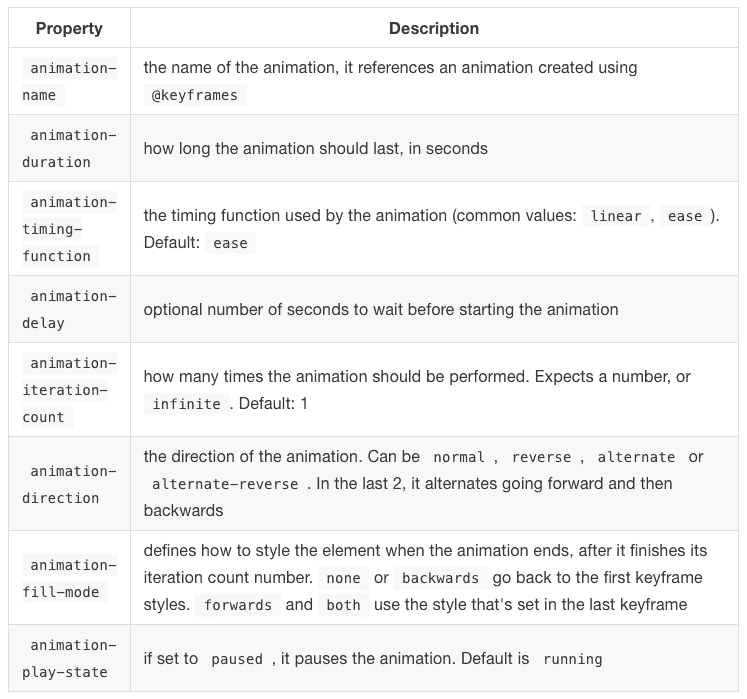

`animation`属性是所有这些属性的简写，顺序如下:

```
.container {
  animation: name
             duration
             timing-function
             delay
             iteration-count
             direction
             fill-mode
             play-state;
}
```

这是我们上面使用的例子:

```
.container {
  animation: spin 10s linear infinite;
}
```

#### CSS 动画的 JavaScript 事件

使用 JavaScript，您可以监听以下事件:

*   `animationstart`
*   `animationend`
*   `animationiteration`

小心使用`animationstart`，因为如果动画在页面加载时开始，您的 JavaScript 代码总是在 CSS 被处理后执行，所以动画已经开始了，您不能拦截事件。

```
const container = document.querySelector('.container')

container.addEventListener('animationstart', (e) => {
  //do something
}, false)

container.addEventListener('animationend', (e) => {
  //do something
}, false)

container.addEventListener('animationiteration', (e) => {
  //do something
}, false)
```

#### 哪些属性可以使用 CSS 动画制作

很多！它们是一样的，你也可以使用 CSS 转场来制作动画。

以下是完整列表:

*   `background`
*   `background-color`
*   `background-position`
*   `background-size`
*   `border`
*   `border-color`
*   `border-width`
*   `border-bottom`
*   `border-bottom-color`
*   `border-bottom-left-radius`
*   `border-bottom-right-radius`
*   `border-bottom-width`
*   `border-left`
*   `border-left-color`
*   `border-left-width`
*   `border-radius`
*   `border-right`
*   `border-right-color`
*   `border-right-width`
*   `border-spacing`
*   `border-top`
*   `border-top-color`
*   `border-top-left-radius`
*   `border-top-right-radius`
*   `border-top-width`
*   `bottom`
*   `box-shadow`
*   `caret-color`
*   `clip`
*   `color`
*   `column-count`
*   `column-gap`
*   `column-rule`
*   `column-rule-color`
*   `column-rule-width`
*   `column-width`
*   `columns`
*   `content`
*   `filter`
*   `flex`
*   `flex-basis`
*   `flex-grow`
*   `flex-shrink`
*   `font`
*   `font-size`
*   `font-size-adjust`
*   `font-stretch`
*   `font-weight`
*   `grid-area`
*   `grid-auto-columns`
*   `grid-auto-flow`
*   `grid-auto-rows`
*   `grid-column-end`
*   `grid-column-gap`
*   `grid-column-start`
*   `grid-column`
*   `grid-gap`
*   `grid-row-end`
*   `grid-row-gap`
*   `grid-row-start`
*   `grid-row`
*   `grid-template-areas`
*   `grid-template-columns`
*   `grid-template-rows`
*   `grid-template`
*   `grid`
*   `height`
*   `left`
*   `letter-spacing`
*   `line-height`
*   `margin`
*   `margin-bottom`
*   `margin-left`
*   `margin-right`
*   `margin-top`
*   `max-height`
*   `max-width`
*   `min-height`
*   `min-width`
*   `opacity`
*   `order`
*   `outline`
*   `outline-color`
*   `outline-offset`
*   `outline-width`
*   `padding`
*   `padding-bottom`
*   `padding-left`
*   `padding-right`
*   `padding-top`
*   `perspective`
*   `perspective-origin`
*   `quotes`
*   `right`
*   `tab-size`
*   `text-decoration`
*   `text-decoration-color`
*   `text-indent`
*   `text-shadow`
*   `top`
*   `transform.`
*   `vertical-align`
*   `visibility`
*   `width`
*   `word-spacing`
*   `z-index`

### 标准化 CSS

默认浏览器样式表是一组规则，浏览器必须应用这些规则来为元素提供某种最小样式。

大多数时候这些风格是非常有用的。

由于每个浏览器都有自己的一套，找到共同点是很常见的。

标准化过程不是像 **CSS 重置**方法那样移除所有默认设置，而是移除浏览器的不一致性，同时保留一组您可以依赖的基本规则。

normalize . CSS[http://necolas.github.io/normalize.css](http://necolas.github.io/normalize.css)是这个问题最常用的解决方案。

您必须在加载任何其他 CSS 之前加载标准化 CSS 文件。

### 错误处理

CSS 具有弹性。当它发现一个错误时，它不会像 JavaScript 那样打包所有的东西，然后一起离开，在发现错误后终止所有的脚本执行。

CSS 非常努力的去做你想做的事情。

如果一行有错误，它会跳过它，跳到下一行，没有任何错误。

如果您忘记了某一行的分号:

```
p {
  font-size: 20px
  color: black;
  border: 1px solid black;
}
```

有错误的那一行和下一行将**而不是**被应用，但是第三个规则将被成功地应用到页面上。基本上，它会扫描所有内容，直到找到分号，但当它到达分号时，规则现在是`font-size: 20px color: black;`，这是无效的，所以它会跳过它。

有时意识到某个地方有错误，以及错误在哪里是很棘手的，因为浏览器不会告诉我们。

这就是像 [CSS Lint](http://csslint.net/) 这样的工具存在的原因。

### 供应商前缀

供应商前缀是浏览器让 CSS 开发人员访问尚不稳定的新特性的一种方式。

在继续之前，请记住这种方法的受欢迎程度正在下降。人们现在更喜欢使用实验性标志，它必须在用户的浏览器中明确启用。

为什么？因为开发人员没有将厂商前缀作为预览特性的一种方式，而是在产品中发布它们 CSS 工作组认为这是有害的。

主要是因为一旦你添加了一个标志，开发人员开始在生产中使用它，如果浏览器意识到某些事情必须改变，他们就处于不利的地位。有了标志，你就不能发布一个功能，除非你能推动所有的访问者在他们的浏览器中启用那个标志(只是开玩笑，不要尝试)。

也就是说，让我们看看供应商前缀是什么。

我特别记得他们过去处理 CSS 过渡。除了使用`transition`属性，您还必须这样做:

```
.myClass {
    -webkit-transition: all 1s linear;
    -moz-transition: all 1s linear;
    -ms-transition: all 1s linear;
    -o-transition: all 1s linear;
    transition: all 1s linear;
}
```

现在你只要用

```
.myClass {
    transition: all 1s linear;
}
```

因为现在所有现代浏览器都很好地支持该属性。

使用的前缀有:

*   `-webkit-` (Chrome、Safari、iOS Safari / iOS WebView、Android)
*   `-moz-`(游猎)
*   `-ms-` (Edge，Internet Explorer)
*   `-o-`(歌剧，迷你歌剧)

由于 Opera 是基于 Chromium 的，Edge 很快也会如此，`-o-`和`-ms-`可能很快就会过时。但是正如我们所说的，供应商前缀作为一个整体也正在过时。

写前缀很难，主要是因为不确定性。一个属性真的需要前缀吗？一些在线资源也过时了，这使得做正确的事情更加困难。像 [Autoprefixer](https://github.com/postcss/autoprefixer) 这样的项目可以完全自动化这个过程，而不需要我们找出是否还需要一个前缀，或者这个特性现在是稳定的，应该去掉这个前缀。它使用了来自 caniuse.com 的数据，这是一个非常好的与浏览器支持相关的参考网站。

如果您使用 React 或 Vue，像`create-react-app`和 Vue CLI 这样的项目，这两种开始构建应用程序的常见方法，使用开箱即用的`autoprefixer`，所以您甚至不必担心它。

### 用于打印的 CSS

即使我们越来越多地盯着屏幕，打印仍然是一件事。

即使是博客文章。我记得 2009 年的一次，我遇到一个人，他告诉我他让他的私人助理打印我发表的每一篇博客文章(是的，我茫然地看了一会儿)。绝对出乎意料。

我研究打印的主要用例通常是打印到 PDF。我可能会在浏览器中创建一些东西，我想把它做成 PDF 格式。

浏览器使这变得非常容易，当试图打印文档并且打印机不可用时，Chrome 默认为“保存”，Safari 在菜单栏中有一个专用按钮:

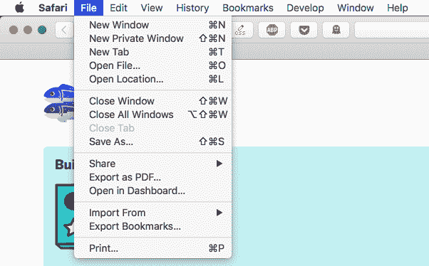

#### 打印 CSS

打印时，您可能想做的一些常见事情是隐藏文档的某些部分，可能是页脚、页眉、侧栏中的某些内容。

也许你想用不同的字体打印，这是完全合法的。

如果你有一个大的 CSS 用于打印，你最好为它使用一个单独的文件。浏览器只会在打印时下载它:

```
<link rel="stylesheet"
      src="print.css"
      type="text/css"
      media="print" />
```

#### CSS @媒体印刷

前一种方法的替代方法是媒体查询。你在这个区块中添加的任何内容:

```
@media print {
  /* ... */
}
```

将只应用于印刷文档。

#### 链接

HTML 因为链接而伟大。它被称为超文本有一个很好的理由。打印时，我们可能会丢失很多信息，这取决于内容。

CSS 提供了一个很好的方法来解决这个问题，通过编辑内容，在`<`后面附加链接；一个>标签文本，使用:

```
@media print {
    a[href*='//']:after {
        content:" (" attr(href) ") ";
        color: $primary;
    }
}
```

我的目标是`a[href*='//']`只对外部链接这样做。我可能有用于导航和内部索引目的的内部链接，这在我的大多数用例中是没有用的。如果您还想打印内部链接，只需:

```
@media print {
    a:after {
        content:" (" attr(href) ") ";
        color: $primary;
    }
}
```

#### 页边距

您可以为每一页添加页边距。`cm`或`in`是纸张打印的好单位。

```
@page {
    margin-top: 2cm;
    margin-bottom: 2cm;
    margin-left: 2cm;
    margin-right: 2cm;
}
```

`@page`也可用于使用`@page :first`仅定位第一页，或使用`@page :left`和`@page: right`仅定位左右页。

#### 分页符

您可能希望在某些元素之后或之前添加分页符。使用`page-break-after`和`page-break-before`:

```
.book-date {
    page-break-after: always;
}

.post-content {
    page-break-before: always;
}
```

那些属性[接受各种各样的值](https://developer.mozilla.org/en-US/docs/Web/CSS/page-break-after)。

#### 避免在中间破坏图像

我在 Firefox 上经历过这种情况:默认情况下，图像从中间被剪切，并在下一页继续。它也可能发生在短信上。

使用

```
p {
  page-break-inside: avoid;
}
```

并将您的图像包装在一个`p`标签中。在我的测试中，直接瞄准`img`不起作用。

这同样适用于其他内容，不仅仅是图像。如果你注意到一些你不想要的东西被剪切了，使用这个属性。

#### 调试打印演示文稿

Chrome DevTools 提供了模拟打印布局的方法:

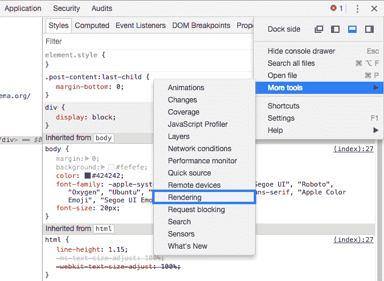

面板打开后，将渲染仿真更改为`print`:

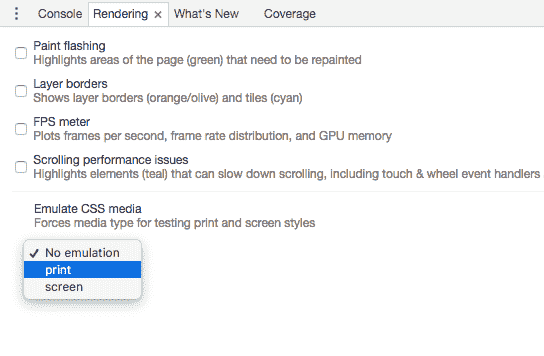

### 包扎

我希望这篇文章能帮助你熟悉 CSS，并对你可以用来设计你的页面和应用程序的主要特性有一个大致的了解。我写这篇文章是为了帮助你熟悉 CSS，并让你快速掌握使用这个令人敬畏的工具，让你在 Web 上创建令人惊叹的设计，我希望我达到了这个目标。

**[点击这里获取这篇帖子的 PDF / ePub / Mobi 版本离线阅读](https://flaviocopes.com/page/css-handbook/)**

弗拉维奥