# 性能测试超时的奇怪情况(0)

> 原文：<https://www.freecodecamp.org/news/the-curious-case-of-performance-testing-settimeout-0-347059a28acf/>

作者:内塔·邦迪

# 性能测试设置超时的奇怪情况(0)

#### (为了达到最佳效果，在烟雾缭绕中用沙哑的声音朗读)

Image by [Studio-Dee on Pixabay](https://pixabay.com/en/grain-retro-forties-trepidation-3026099/).

这一切都开始于一个灰暗的秋天。天空多云，刮风，有人告诉我`setTimeout(0)`平均会造成 4 毫秒的延迟。他们声称这是将回调弹出堆栈、放入回调队列并再次放回堆栈所需的时间。我觉得这听起来很可疑(这是你想象的我嘴里叼着雪茄的黑白画面)。考虑到渲染管道需要每 16 毫秒运行一次才能实现流畅的动画，4 毫秒对我来说似乎是一段很长的时间。很长一段时间。

用`console.time()`在 devtools 中进行的一些简单测试证实了这一点。20 次运行的平均延迟约为 1.5 毫秒。当然，20 次运行不足以产生足够的样本量，但现在我有一点需要证明。我想进行更大规模的测试，以获得更准确的答案。当然，我可以去当着我同事的面证明他们错了。

不然我们为什么要做这些？

Film Noir Photo Shoot — Portland Lightist by [Randy Kashka on flickr](https://www.flickr.com/photos/randykashka/5277322486).

### 传统的方法

很快，我发现自己陷入了困境。为了测量`setTimeout(0)`运行的时间，我需要一个函数:

*   拍摄了当前时间的快照
*   已执行`setTimeout`
*   然后立即退出，这样堆栈将被清空，预定的回调可以运行并计算时间差
*   **我需要这个函数运行足够多的次数，这样计算才有统计意义**

但是这种 go-to 结构——for 循环——不起作用。因为 for 循环在执行完每个循环之前不会清除堆栈，所以回调不会立即运行。或者，用代码表示，我们会得到这样的结果:

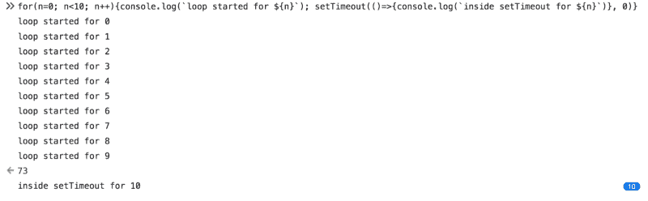

The loop executes 10 times, and only then are the callbacks popped back on the stack

这里的问题是固有的——如果我想自动多次运行`setTimeout`,我必须在另一个上下文中执行。但是，只要我从另一个上下文中运行，从我开始测试到回调执行总会有额外的延迟。

当然，我可以像这些一无是处的侦探一样，写一个函数来做我需要的事情，然后复制粘贴 10，000 次。我会学到我想知道的东西，但是执行起来一点也不优雅。如果我要让别人难堪，我宁愿用另一种方式。

然后我想到了。

### 革命性的方法

我可以用一个网络工作者。

Web workers 运行在不同的线程上。因此，如果我将`setTimeout`逻辑放在一个 web worker 中，我可以多次调用它。每个调用都会创建自己的执行上下文，调用`setTimeout`，并立即退出函数，以便回调可以执行。我一直期待着和网络工作者一起工作。

是时候切换到我信任的[崇高文本](https://www.sublimetext.com/)了。

我开始只是试水。此代码在`main.js`中:

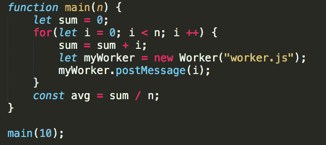

这里有一些准备实际测试的管道，但最初我只是想确保我可以与 web 工作人员正常通信。这是最初的`worker.js`:

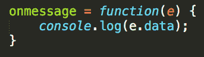

虽然它非常有效——但它产生了我应该预料到的结果，但却没有:

It sure is asynchronous…

如此习惯于 JS 中的同步性，我不禁对此感到惊讶。当我第一次看到它的时候，我的大脑记录了一个错误。但是，由于每个循环都设置了一个新的 web worker，并且它们是异步运行的，所以数字不会按顺序打印出来是有道理的。

这可能让我感到惊讶，但它正如预期的那样工作。我可以继续测试。

我想让 web worker 的`onmessage`函数注册`t0`，调用`setTimeout`，然后立即退出，以免阻塞堆栈。然而，在设置了`t1`的值之后，我可以在回调函数中加入额外的功能。我把我的`postMessage`添加到回调中，所以它不会阻塞堆栈:

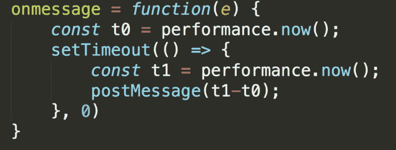

worker.js

这里是`main.js`代码:

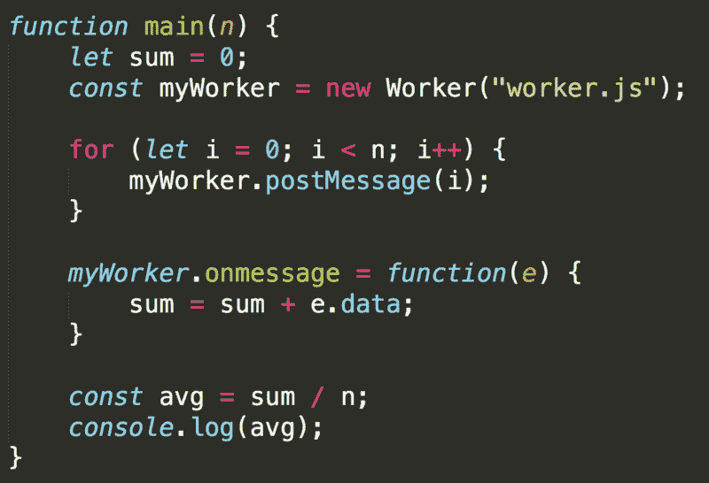

这个版本有问题。

当然——因为我是网络工作者的新手，所以一开始我没有考虑过。但是，当多次运行该函数都显示`0`时，我发现有些地方不对劲。

当我打印出内部的总数时，我得到了答案。主函数是同步进行的，并不等待来自工作线程的消息返回，所以它在 web 工作线程完成之前计算平均值。

一个快速而又肮脏的解决方案是添加一个计数器，只有当计数器达到最大值时才进行计算。这是新的`main.js:`

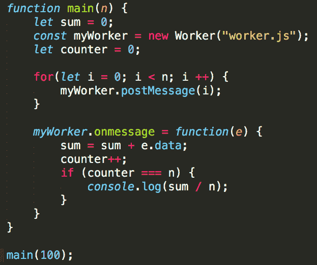

结果如下:

`main(10)` : `0.1`

`main(100)` : `1.41`

`main(1000)` : `13.082`

哦。我的。嗯，那不太好，是吧？这是怎么回事？

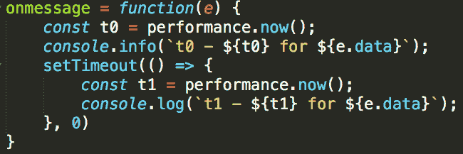

我牺牲了性能测试来了解内部情况。我现在在创建`t0`和`t1` 时记录它们，只是为了看看那里发生了什么。

结果是:

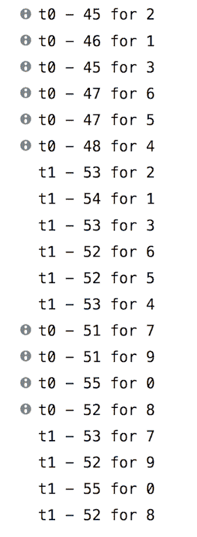

事实证明，我对在`t0`之后立即计算`t1`的期望也是被误导的。**基本上，关于 web workers 没有什么是同步的，这意味着我关于代码行为的最基本假设不再成立。**这是一个很难发现的盲点。

不仅如此，就连我拿到的`main(10)`和`main(100)`的成绩，原本让我很开心很得意的，也不是我能依靠的。

web workers 的异步性也使它们成为我们常规堆栈中事物行为的不可靠代理。因此，尽管测量网络工作者的`setTimeout`表现给出了一些有趣的结果，但这些结果并没有回答我们的问题。

### 教科书方法

我很沮丧…我真的找不到一个既优雅又能证明我的同事是错的普通 JS 解决方案吗？

然后我意识到——有些事我可以做，但我不会喜欢。

我可以递归调用`setTimeout`。

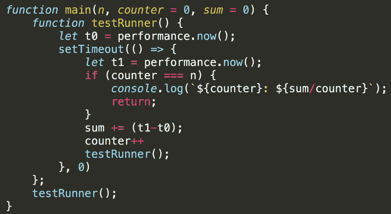

现在，当我调用`main`时，它将调用`testRunner`来测量`t0`，然后安排回调。回调然后立即运行，计算`t1`，然后再次调用`testRunner`，直到达到期望的调用次数。

这段代码的结果特别令人惊讶。以下是`main(10)`和`main(1000)`的一些打印输出:

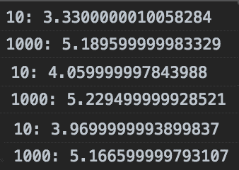

调用该函数 1000 次与调用 10 次的结果有很大不同。我已经反复尝试了，得到了基本相同的结果，`main(10)`在 3-4 毫秒内到达，而`main(1000)`超过了 5 毫秒。

老实说，我不知道这里发生了什么。我寻找答案，却找不到任何合理的解释。如果你正在读这篇文章，并且对正在发生的事情有一个有根据的猜测——我很乐意在评论中听到你的意见。

### 屡试不爽的方法

在我内心深处的某个地方，我一直知道会有这一天…华而不实的东西对那些能得到它们的人来说是美好的，但经过考验和真实的东西最终会一直在那里。即使我试图避免它，我一直知道这是一个选项。`setInterval`。

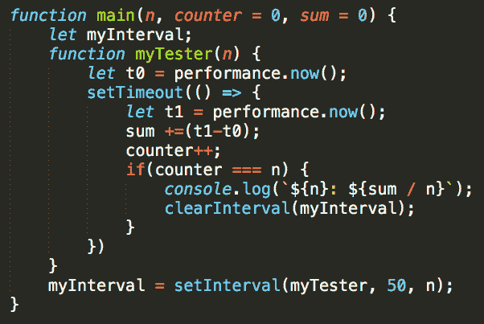

这段代码用蛮力完成了这个任务。`setInterval`重复运行该功能，每次运行之间等待 50 毫秒，以确保堆栈清空。这是不雅的，但测试正是我需要的。

结果也很有希望。时间似乎与我最初的预期相符——不到 1.5 毫秒

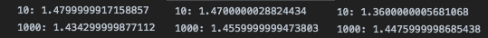

Similar results on 10,000 runs

我终于可以了结这个案子了。我经历了一些起起落落，也分享了一些意想不到的结果，但最终只有一件事很重要——我证明了另一个开发人员是错的！那对我来说已经足够好了。

想玩玩这段代码吗？看看这里:[https://github.com/NettaB/setTimeout-test](https://github.com/NettaB/setTimeout-test)