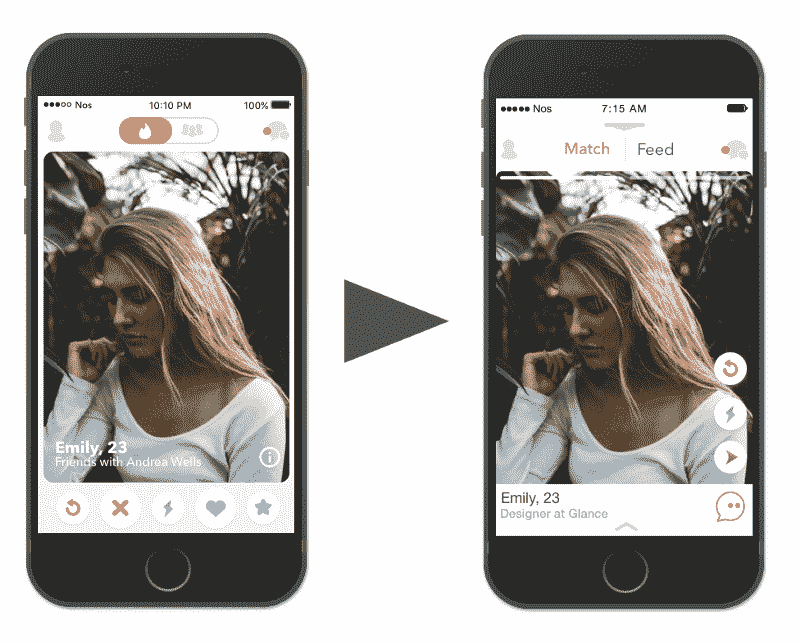
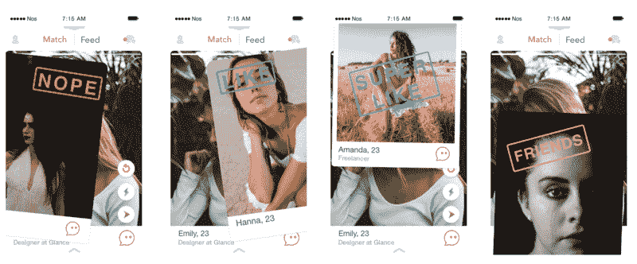
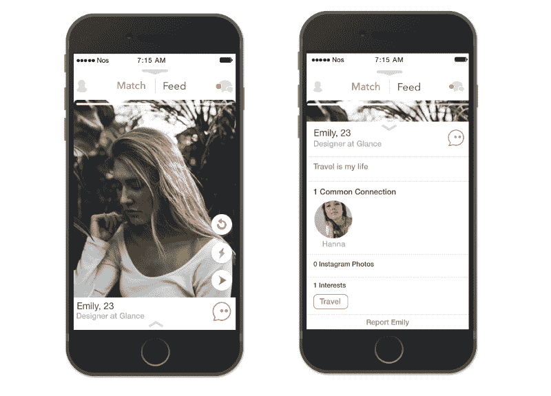
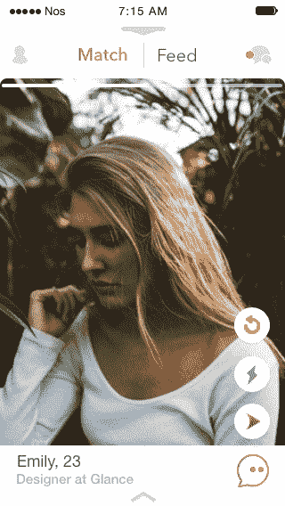
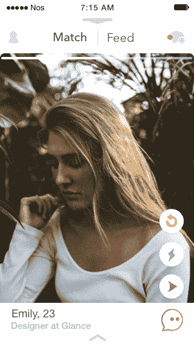
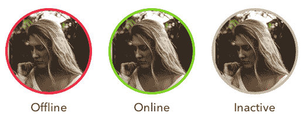

# 我重新设计了 Tinder。以下是我在这个过程中学到的。

> 原文：<https://www.freecodecamp.org/news/the-day-i-redesigned-tinder-3ee6445b9a06/>

丹尼尔·洛佩斯

# 我重新设计了 Tinder。以下是我在这个过程中学到的。

### **挑战**

我开始尝试通过改造一个我经常使用的应用程序，来看看作为一名设计师，我能在多大程度上发挥自己的创造力。

我选择 Tinder 是因为我用过几次，意识到对设计做一些修改会有帮助。当然我不是建议用我的设计代替现在的 Tinder 设计。只是和目前 App 的设计角度不同而已。

我的目标:

*   创造更好的用户体验
*   方便应用程序的使用
*   作为个人目标，完成我的第一个设计项目

### 了解应用程序

Tinder 是一个基于位置的社交应用程序，最常用作约会应用程序，目标受众为 18 至 34 岁。自 2012 年首次亮相以来，Tinder 凭借其极其简单的使用方式和惊人的有机策略获得了快速增长。

### 主页

Old screen and my redesign of it

#### **问题 1:底部按键和刷卡**

一旦用户打开应用程序，Tinder 用户就有两个主要功能来表明他们是否喜欢某个个人资料:

*   底部按钮
*   刷卡

那么他们应该使用哪一种呢？

两个选项都很好，但是刷卡提供了更流畅的体验。如果和其他越来越多实现刷卡功能的应用相比，Tinder 遥遥领先。我们应该 100%地利用它。

在分析了现有的设计后，“超级喜欢”、“喜欢”和“不喜欢”按钮被删除，这些动作用刷卡手势。

添加了以下**个新的**按钮。

Dismiss Profile Button

#### **解散简介**

比方说，你遇到一个你感兴趣但同时又不感兴趣的简介，你可以忽略它，进入下一个。

Message Button

#### **消息**

Tinder gold 的一个功能，允许你给任何个人资料发送消息，即使他们还没有喜欢你。

#### **新刷卡好友**

Tinder 被列在 App store 的“生活方式”下。虽然 Tinder 并没有作为约会应用来销售，但大多数人都认为它是一个约会应用。浏览个人资料时，我看到很多类似“只是在找朋友！”。

因此，在新的刷卡上向下滑动可以让你成为某人的朋友。

### **问题 2:换页查看个人资料**

这种修改是更加个人化的。我不喜欢用户浏览个人资料的方式。我没有考虑用户眼中的流程流体，因为我们经常改变页面，如果我们想在看到配置文件后返回，这不是很直观或实用。

所以我决定实现不用离开主页面就能看到用户个人资料的功能。向上滑动**将显示用户的个人资料，向下滑动**将使用户返回主页面。****

********

### ******重新设计火绒供给******

****Tinder 推出了 Feed 功能，可以在一个地方显示你的比赛的实时更新。是一个非常好的想法，它将带你超越“这是一个匹配！”帮你建立真正的联系。****

****但是要使用这个新功能，你需要进入信息。因为我认为我们应该利用这一点，我决定把它从消息中删除，并把它放在主屏幕上。****

****用户只需点击主屏幕上的 feed 按钮，就可以访问他们比赛的所有新闻。****

********

****为了在提要中导航，我决定实现两个按钮:****

*   ******New** -点击屏幕底部右侧的“New”会创建一个新帖子。****
*   ******Old** -点击屏幕底部左侧的“Old”会导航到最老的帖子，直到我们到达最后一个。****

****按钮:****

*   ******Message** -无需离开 feed 即可向连接发送即时消息。****
*   ******分享**——在社交媒体上分享。****

### ******新功能:Tinder 体验******

****大多数人将 Tinder 视为一款约会应用。但是多了，体验可以更强大。我实现了一个名为“Tinder Experiences”的新功能，这是一种将与朋友的约会和会面提升到另一个层次的方式。****

****探索你所在城市的各个地方，结识与你志同道合的人，开拓新的体验。****

********

### ******状态******

********

****还有一些其他的事情可以实现来大大改善用户体验。其中之一就是知道用户的状态。因此，我用一种简单明了的方式在消息中插入了用户的状态。这一改进使我们能够知道用户是在线、离线还是不活动。****

****另一个可能的功能是根据用户上次活动的时间来过滤用户。这将允许用户在您的“发现首选项”中设置一个范围，例如，显示在过去 30 分钟内活动的用户。****

### ******结论******

****进入这个项目，我知道这将是一个完美的机会，让我提高我的设计技能，并推动自己的创造力。我正在学习计算机工程，同时在家里独自学习设计，因为我想从事产品设计的职业。我发现对我来说，最好的学习方法就是全身心地投入到一个项目中去。****

****所以对我来说，这不是重新设计移动应用的结束，而只是开始。****

****感谢阅读。我希望你喜欢它。？****

****我将感谢您的反馈。****