# 装饰设计模式有点像华夫饼干

> 原文：<https://www.freecodecamp.org/news/the-decorator-design-pattern-is-kind-of-like-a-waffle-264e8c816715/>

作者:黄思慧

# 装饰设计模式有点像华夫饼干

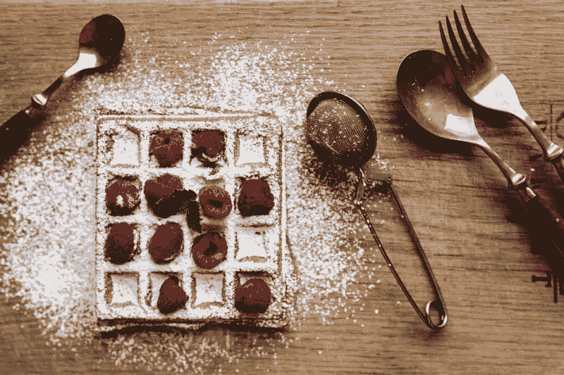

装饰模式是给现有对象添加额外的特性。

听起来像法语吗？

别担心。

我们稍后将回到这一点。

先来看看一些华夫饼吧！

华夫饼的天才之处在于它们开始简单明了。因为它们很普通，所以几乎所有的东西都很好吃

一些常见的松饼配料有草莓、蓝莓、黑莓、香蕉、杏仁和糖浆。

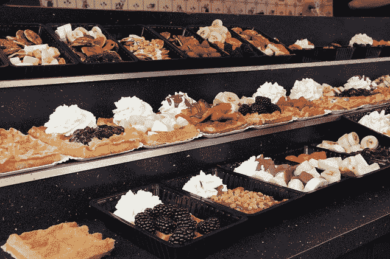

让我们试着创建一个不同华夫饼对象的集合。

会有草莓华夫饼干、蓝莓华夫饼干、黑莓华夫饼干、香蕉华夫饼干、杏仁华夫饼干和糖浆华夫饼干。

等等，我们可以在同一块华夫饼上放草莓和蓝莓。这给了我们一个草莓馅饼。

我们也可以在同一块华夫饼上放草莓和黑莓。这给了我们一个草莓蛋糕。

没人禁止我们在同一块华夫饼上放三种配料。这给了我们一个 strawberryblueberry blackberry waffle。

为了简单起见，让我们考虑草莓、蓝莓和黑莓作为潜在的配料。有八种不同的组合[1]。

这是否意味着我们需要为我们的华夫饼集合创建八个不同的对象？

如果我们把香蕉加入我们的潜在配料列表，有 16 种不同的组合。

很明显，在我们的浇头列表中添加一种浇头会导致我们的华夫饼干收藏激增。

为每种可能的浇头组合创建不同的华夫饼类别是不可行的。一定有更好的方法来做到这一点。

如果当我们想要草莓而不是创造草莓的时候，我们创造了一个华夫饼干，并在里面加入草莓，会怎么样？

那么草莓布丁怎么样？？？？

？？？我们可以做一个华夫饼干，加入草莓和蓝莓！？？？

### 创建华夫饼类

让我们来看看普通的华夫饼干类:

你可以做一个华夫饼，端上桌，然后像这样吃:

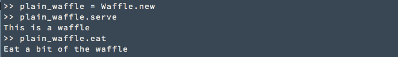

这是 StrawberryWaffle 类:

注意，我们在 StrawberryWaffle 构造函数中传递了一个 waffle 对象来创建一个 StrawberryWaffle。

StrawberryWaffle 类具有:

1.  传进来的华夫饼
2.  草莓作为配料
3.  调用传入的 waffle 的`serve`方法的`serve`方法。然后打印`topped with strawberries`
4.  一个`eat`方法，调用传入的 waffle 的`eat`方法，然后打印`and then eat some strawberries`

你可以做一个草莓华夫饼，端上来，然后像这样吃:

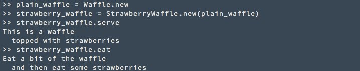

下面是 BlueberryWaffle 和 BlackberryWaffle 类:

你可以这样使用它们:

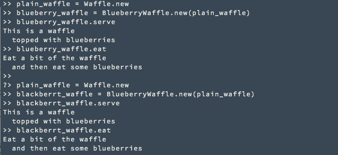

### 拉出公共部分

注意到 StrawberryWaffle 类、BlueberryWaffle 类和 BlackberryWaffle 类除了它们的`topping`之外几乎完全相同，我们可以把共同的部分作为一个父类拉出来。

在`WaffleDecorator`中，`topping`不再是对象的属性。相反，它是一个可以被子类覆盖的方法。

现在我们可以重写`StrawberryWaffle`、`BlueberryWaffle`和`BlackberryWaffle`来继承`WaffleDecorator`以获得这些通用功能:

它们应该仍然像以前一样工作:

以下是我们创建的类:

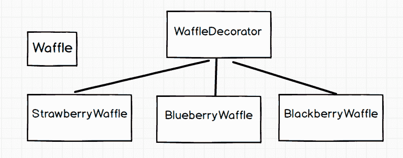

### 制作蓝莓松饼

现在我们有`Waffle`、`StrawberryWaffle`、`BlueberryWaffle`和`BlackberryWaffle`。

是时候实现我们最初设定的目标了:

制作一个华夫饼干，加入草莓，加入蓝莓。

就像这样:

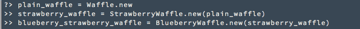

我们可以:

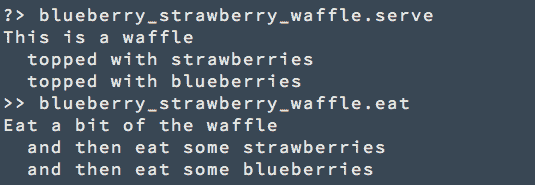

### 发生了什么事？！？？？

让我们仔细看看我们是如何创建`blueberry_strawberry_waffle`的:

首先，我们用`Waffle` : `plain_waffle = Waffle.new`创建了一个`plain_waffle`

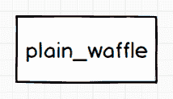

然后，我们通过将`plain_waffle`传递给`StrawberryWaffle`构造函数来创建`strawberry_waffle`。`strawberry_waffle = StrawberryWaffle.new(plain_waffle)`

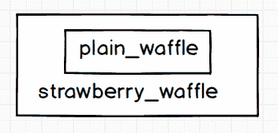

值得注意的是，当我们创建`strawberry_waffle`时，我们保存传入的`plain_waffle`作为`strawberry_waffle`的实例变量:

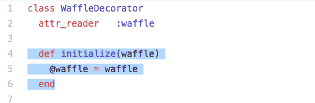

我们可以看到，`strawberry_waffle.waffle`和`plain_waffle`是同一个对象:

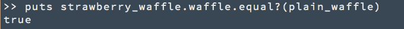

此时，当我们调用`strawberry_waffle.serve.`时，我们首先调用`plain_waffle.serve`，然后打印`topped with strawberries`。

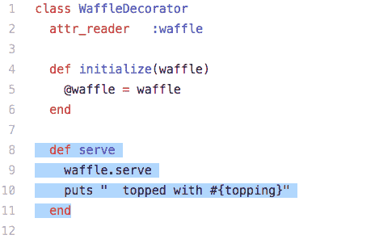

对于`strawberry_waffle.eat`，我们首先调用`plain_waffle.eat`然后打印`and then eat some strawberries`。

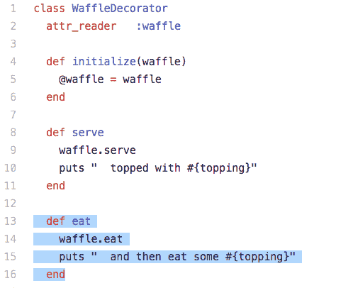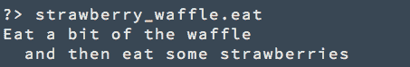

我们通过将`strawberry_waffle`传递给`BlueberryWaffle`构造函数来创建`blueberry_strawberry_waffle`。`blueberry_strawberry_waffle = BlueberryStrawberryWaffle.new(strawberry_waffle)`

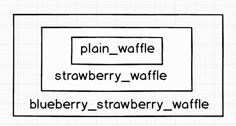

当我们创建`blueberry_strawberry_waffle`时，我们保存传入的`strawberry_waffle`作为`blueberry_strawberry_waffle`的实例变量:

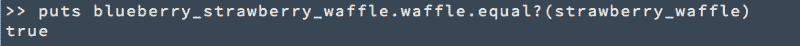

当我们调用`blueberry_strawberry_waffle.serve`时，我们首先调用`strawberry_waffle.serve`。其中调用`plain_waffle.serve`然后打印`topped with strawberries.`然后打印`topped with blueberries`。

当我们调用`blueberry_strawberry_waffle.eat`时，我们首先调用`strawberry_waffle.eat`。其中调用`plain_waffle.eat`然后打印然后`eat some strawberries`。然后打印`and then eat some blueberries`。

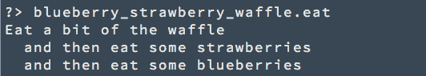

### 魔术的关键:

`strawberry_waffle`建立在`plain_waffle`之上。而`blueberry_strawberry_waffle`是建立在`strawberry_waffle`之上的。

能够在彼此之上构建华夫饼的关键是**所有华夫饼都必须遵循相同的接口**。

所有的华夫饼都有一个`serve` 法和一个`eat` 法。

这就是为什么在`StrawberryWaffle/BlueberryWaffle/BlackberryWaffle`类中，我们确信传入的`waffle`有一个`serve`方法和一个`eat`方法。

在定义新的`serve`方法和新的`eat`方法时，我们可以利用传入的华夫饼中的`serve`方法和`eat`方法。

华夫饼装饰者不在乎华夫饼的种类。它可以是普通华夫饼干、草莓华夫饼干或异形华夫饼干。

重要的是华夫饼干装饰者拿走一块华夫饼干，然后返回一块改良的华夫饼干。它获取的华夫和它返回的华夫遵循同一个接口。

由于所有接受和返回华夫饼的装饰者都遵循相同的接口，一个装饰者的结果可以传递给另一个装饰者。

就像这样:

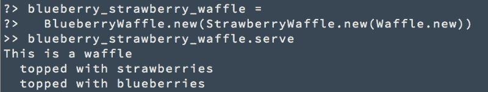

或者这个:

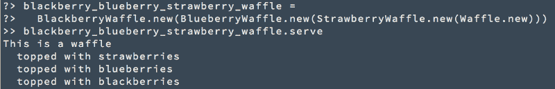

现在，有了`Waffle`、`StrawberryWaffle`、`BlueberryWaffle`和`BlackberryWaffle`，我们可以制作所有八种不同的华夫饼。

将香蕉加入我们的顶级清单非常简单:

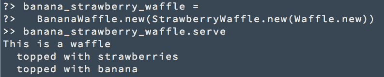

### 您刚刚学习了装饰者模式！？？？

下面是它的定义:

> Decorator 动态地给一个对象附加额外的责任。

### takealways:

1.  装饰者模式是关于轻松地给现有对象添加额外的特性。
2.  要装饰的对象(传递给所有装饰者的对象)和从装饰者返回的对象必须服从同一个接口。

感谢阅读！我希望你喜欢这篇文章。？

我每周出版给 sihui.io。

订阅吧，这样你就不会错过本系列的下一篇文章。

下次我们将看一看…

[1]原味华夫饼干、草莓华夫饼干、蓝莓华夫饼干、黑莓华夫饼干、草莓黑莓华夫饼干、草莓黑莓黑莓华夫饼干、蓝莓黑莓黑莓华夫饼干、草莓黑莓黑莓华夫饼干。

[2] [C(4，0) + C(4，1) + C(4，2) + C(4，3) + C(4，4) = 16](https://www.calculatorsoup.com/calculators/discretemathematics/combinations.php)