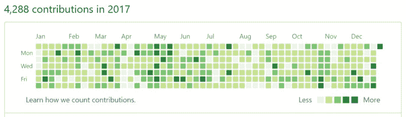
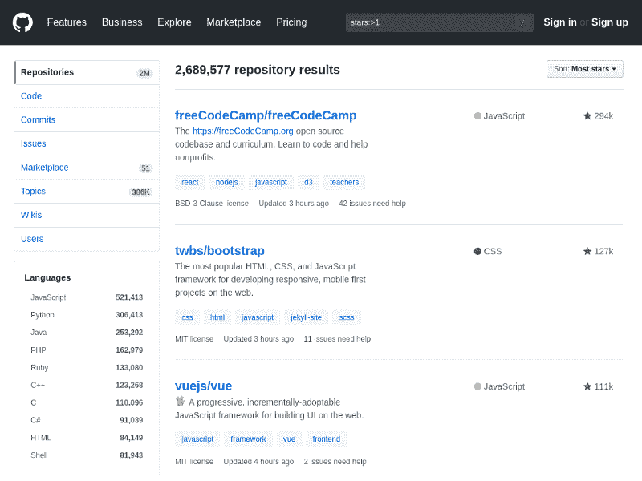
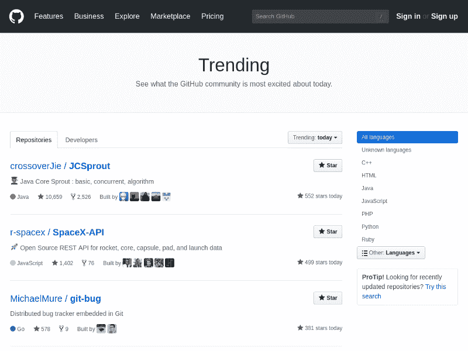
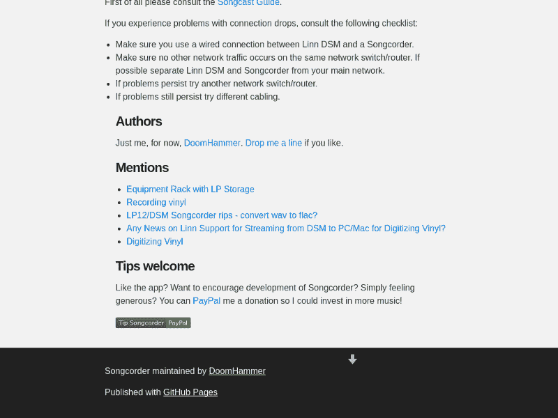
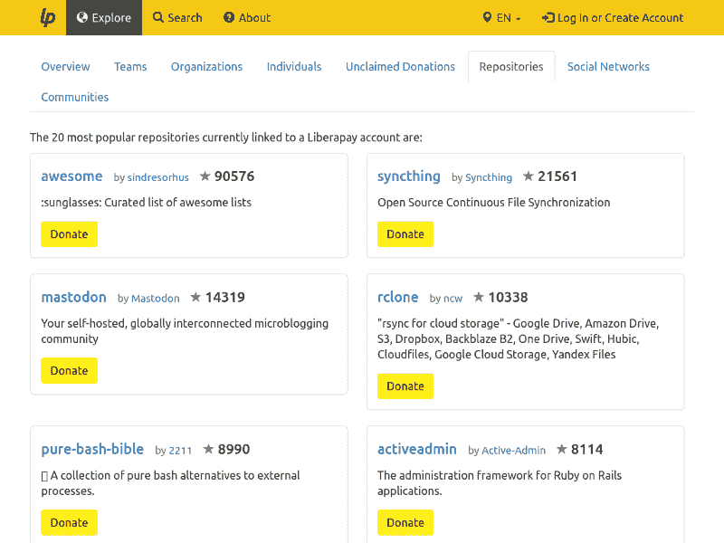

# 为开源做贡献的权威指南

> 原文：<https://www.freecodecamp.org/news/the-definitive-guide-to-contributing-to-open-source-900d5f9f2282/>

我会告诉你我所知道的关于开源的一切。先说简单的。你知道什么是产品吗？产品是你很容易消费的东西，比如餐馆里的墨西哥卷饼。但是要创造这个产品，你需要采取一些步骤。在餐馆，你有一个厨师，他有这个卷饼的食谱。他们总是遵循相同的配方，用相同的成分制作，以确保每次都有合适的质量。

> 为开源做贡献可以帮助你进入技术领域，改变你的职业或者改善你现在的职业。同时帮助社区！

在大多数餐馆，如果你去问厨师，“对不起，我喜欢你的墨西哥卷饼；能给我菜谱吗？”他们会拒绝——这不是开源的。开源是指除了产品之外，你还可以获得所有的配料和食谱，这意味着你可以在家里复制整个玉米煎饼。

现在想象你开始做这个卷饼，但是你得出的结论是你想减少肉的量。所以你用鳄梨代替它。在这种情况下，你拿着食谱，把肉换成鳄梨，不折不扣地遵循剩下的步骤，然后检查结果。

结果可能是你做的菜比餐厅的饭好吃。如果餐厅像一个开源项目一样运作，你可以去找厨师说，“嘿，你的墨西哥卷饼很棒，但我加了鳄梨，现在更好了！你可以把它加到你的菜单上。”

厨师的角色是产品维护者。他们可能会接受修改，也可能会认为鳄梨是个坏主意，不符合餐厅的理念。不管怎样，通过分享你对项目的修改，你已经成为了一个贡献者。

恭喜你！

#### 什么构成了一个项目？

“Burrito” by [samuelfernandezrivera](https://pixabay.com/en/users/samuelfernandezrivera-5770955/) on [Pixabay](https://pixabay.com)

Firefox 浏览器是开源项目的一个例子。它由数千行源代码和如何将这些源代码转化为可用产品的说明组成，比如网络浏览器。这段代码是公开的，所以每个人都可以获取、阅读、审计或构建它。每个想要修改 Firefox 行为的人都可以修改源代码并构建一个定制版本。此外，每个人都可以将这些变更发回给项目的维护者。

但是开源项目不仅仅是代码。我们也有一个用户界面和图形设计。是的，甚至像 Vim editor 这样的终端程序也有图形界面。

> *你不需要编码就能贡献开源！*

除了界面，还有用户交互、可用性以及所谓的用户体验(UX)——所有这些在最近几十年都越来越受欢迎。如果你有设计、美术或心理学背景，你可以在 UI/UX 找到自己的位置。构成产品的下一个要素是媒体，包括声音、图像或视频。不是所有的项目都有这些，但也不罕见。

然而，文档是经常被忽略的部分之一。做出贡献的一个简单方法是改进文档。文案应该对这些话题感到自在。文本资产和翻译也提供了一个简单的入口。

然后，还有市场营销，这也是开源项目经常缺乏的。如果你能解决这个问题，整个社区都会受益。用营销来帮助一个项目，这也会吸引更多的潜在贡献者。

最后，还有法律部分，这是一个相当罕见的部分，主要涉及大型项目。有些律师主要处理开源问题，他们中的大部分人都是志愿者。

> 如果你会写散文、画画、做音乐，或者是一名优秀的营销人员或律师:开源社区需要你！

如果你觉得自己没有能力设计、改变、写许可，不要害怕。你可以做出另一种贡献。您可以报告错误或建议对行为或外观进行更改。

你知道什么是最好的吗？如果社区的每个成员都贡献一点时间、一点努力和一点个人经验，整个社区就会获得一个了不起的产品，而且通常是免费的。

> *不觉得自己是个创造者？提交错误报告或发布功能请求！*

#### 为什么值得我花时间？

Photo by [Kyle Glenn](https://unsplash.com/@kylejglenn?utm_source=medium&utm_medium=referral) on [Unsplash](https://unsplash.com?utm_source=medium&utm_medium=referral)

为什么值得贡献开源？为什么你要把时间花在写一些提案或代码或做翻译上，而不是去散步？有几个原因。所有这些都源于这样一个前提，即对开源的贡献是公开可见的。每个人都可以看到其他人在做什么。这太棒了！

#### 你提高了你的能力

如果你在写一段代码，设计一个界面，或者创建图形，你就是在学习。对于那些想改变职业的人来说，这是一个很好的练习。在开源领域，没人关心你是高级开发人员还是园丁。重要的是你能带来的贡献的质量。一旦你在一个开源项目中证明了自己，你就会获得一些有价值的经验。你不应该再觉得自己是一个刚刚完成新兵训练营的冒名顶替者。你将成为一个社区的正式成员，任何人都可以查看你的记录。

即使你被困在一种技术中，这也是可行的，但是想象一下你的未来完全是另一种技术。假设你是一名 COBOL 开发人员，梦想在 UX 找到一份工作。只要开始改善火狐的 UX，并发送您的贡献。一旦他们被接受，你就可以在简历中增加一个新职位:火狐项目的 UX 设计师。你刚刚学到了一些有用的东西，提高了你的证书。

#### 你提高了你的知名度

当你加入一个社区时，比如一个开源项目，你会立刻结识新的熟人，遇到其他参与该项目的人。你可以向他们学习，和他们交流思想。

加入这样一个社区的第二个好处是，你所有的其他渠道会自动变得更加明显。例如，你参与的开源项目的访问者可以了解你的 YouTube 频道，或者在 LinkedIn 上找到你，为你提供一份工作。

这就把我们带到了下一点。

如今，It 招聘人员在 GitHub 上寻找新人才是一种常见的做法。通过公开你的代码，你实际上创建了一个任何人都可以验证的真实简历。没有必要联系你以前的雇主或客户。如果你的 GitHub 个人资料链接到你的 LinkedIn 个人资料或你的主页，你就很容易接近，这样你得到梦想中的工作的机会就会增加。

记住，你甚至不需要在那个特定领域有商业经验。对于那些招聘者来说，你的开源贡献同样有效！

#### 你找到工作或新客户

如果你真的很优秀，你可以得到一份有偿工作，从事一个开源项目。这主要是保留给那些有稳定资金支持的项目，无论是来自企业还是非营利组织。

#### 你找到新员工

反过来也一样，你可以找到潜在的员工。如果你做的东西很酷，而且对别人有用，那就把它作为开源项目发布吧！有可能有人想要改进你的项目或者为你工作。

#### 你为别人做一些事情

参与这些项目的另一个好处是有机会为他人做些事情并获得他们的感激。你收到的所有"感谢"纸条会让你的时间看起来更有价值--你甚至可能为一个了不起的项目做出了贡献。

#### 你可以得到很好的统计数据

你是游戏化的粉丝吗？那这是给你的。有些人真的喜欢统计学，GitHub 为他们提供了一些特别的东西。我们在 GitHub——最大的开源社区——采取的每一个行动都会在一个巨大的日历上用一个绿色方块标记出来。我们每天做的事情越多，广场就越明亮。当我们连续几天投稿的时候，GitHub 会把它算作连胜，保留你的分数以备将来参考。这是打破目前最好成绩的动力。

[GitHub](https://www.freecodecamp.org/news/the-definitive-guide-to-contributing-to-open-source-900d5f9f2282/undefined) contribution statistics. No, not mine.

### 你是如何找到你的第一个项目的？

有几种方法。首先，像 Firefox 或 Android 这样的大玩家拥有很高的用户基数，需要大量的改变和改进。一旦你在这样一个项目中引入了一个改变，你的改变就会被数百万人看到。你可以访问 GitHub，看看有哪些最流行的库。例如，在撰写本文的时候，排名第一的库是 [freeCodeCamp](https://github.com/freeCodeCamp/freeCodeCamp) 。

The [most starred repositories](https://github.com/search?q=stars:%3E1&s=stars&type=Repositories) on GitHub

如果你是新人，我不一定推荐第一种方法。大型项目的主要优势也是它们的主要祸根。每个人都想做出贡献，但是能够响应你的请求的维护人员数量有限。如果你真的想有所作为，你可以尝试一些正在兴起的小项目。 [GitHub Trending](https://github.com/trending) 是一个可以找到这类案例的地方。

[Trending projects](https://github.com/trending) on GitHub

另一种方法是选择一个很棒的项目作为第一次投稿人。让我们称之为节能方法。*牛逼*项目都是经过整理和策划的链接列表。例如， [awesome-shell](https://github.com/alebcay/awesome-shell) 列出了很酷的 CLI 发现，而 awesome-JavaScript 则处理每天出现的所有闪亮的新框架。还有一个*令人敬畏的*扩展心智书籍[清单](https://github.com/hackerkid/Mind-Expanding-Books)当然还有[令人敬畏的*清单*清单](https://github.com/sindresorhus/awesome)。

为什么这是一个好方法？做出实际贡献所需的努力很少，所以很有可能因为出色的工作而获得多巴胺的提升。这种多巴胺的增加应该会引发下一个贡献，以此类推。一旦球开始滚动，就很难让它停下来。

我推荐的最后一种方法是借助一个巨大的开源事件。每年 10 月庆祝的一个这样的活动是 [Hacktoberfest](https://hacktoberfest.digitalocean.com/) 。参与者需要在 GitHub 上发出五个 Pull 请求(即做出五个贡献)。每个完成这项任务的人都会从赞助商那里得到不错的额外津贴(比如 t 恤和贴纸)。为了方便参与者，网站上列出了一些范例项目。

另一个类似的事件是[谷歌代码之夏](https://summerofcode.withgoogle.com/)。您可以查看过去的项目列表。也许有一个会激励你做出贡献！哦，然后还有一个[真棒第一公关机会](https://github.com/MunGell/awesome-for-beginners)名单！

如果你想持续地为开源做贡献，找一些你经常使用的东西。这样你的贡献也会让你自己受益。这是迄今为止确保高质量工作的最佳方式。

### 什么使得贡献有价值？

Photo by [rawpixel](https://unsplash.com/@rawpixel?utm_source=medium&utm_medium=referral) on [Unsplash](https://unsplash.com?utm_source=medium&utm_medium=referral)

我们现在知道为什么要做贡献，也知道在哪里做贡献。现在让我们来关注是什么让我们的贡献有价值？一文不值的投稿是不会被接受的，不如做好准备！

#### 我们应该尊重工作条件

最重要的是，我们应该尊重他人的工作条件。在许多项目中，您可以找到像`CONTRIBUTORS.md`这样的文档，它们展示了做出贡献的首选方式。如果你想加入的项目没有类似的文档，检查其他可能的地方，比如`README.md`或者项目的 wiki 页面。熟悉这些规则，确保你理解并遵守它们。

如果你的作品不符合投稿人指南中列出的条件，它甚至可能在评审前就被拒绝。那些指导方针和条件用来保护维护人员的时间。如果您不能遵循它们，维护人员可能会认为您对您所做的其他工作一样粗心。

#### 想想你的贡献对他人有多有价值

一旦我们知道如何表现，让我们考虑我们的贡献对他人有多有价值。想象一下，一家生产定制西服的公司。你在它的店里买了一套衣服，然后去喝了一杯啤酒。灵感来了，于是你在家里把一个开瓶器附在西装上。这样，每次你去喝啤酒，都不会有问题。

在一种开源的方式中，你去找裁缝，展示你将开瓶器附加到衣服上的伟大想法。现在，不管你的想法有多巧妙，作为项目维护者的裁缝可能不会认为你的添加符合他的概念。不代表你的工作很弱或者没有价值；这只是意味着一些功能只吸引一小部分观众。由于每个特性都需要维护和保护，这增加了项目的成本，项目维护者必须确保每个特性都提供有价值的收益。

#### 交流冗长

如果你做的不是一个改变，而是一份报告，那就详细一点。写下你所知道的一切来详细解释上下文。这在报告错误时尤其重要。你描述的上下文越多，别人就越容易按照你想要的方式来解决它。记住可能的用例以及预期的行为，但是不要考虑与报告不一定相关的任何细节。说你希望一种元素是绿色的，因为它与其他竞争产品相匹配，这没问题。提供一个完整的比赛历史背景有点太多了。

#### 运行、测试、检查，然后在提交前再次检查

在提交您的更改之前，检查并测试所有内容。确保您的更改针对当前开发的版本，而不是某个历史版本。请记住，您只需要运行测试一次。维护人员每天都要运行其中的许多程序，所以通过确保所有程序都是一流的来节省他们的时间。而且不管怎么说，这恰恰说明你很在意，没有提交马虎的作业。

### 如何避免在网上泄气

Photo by [Wes Hicks](https://unsplash.com/@sickhews?utm_source=medium&utm_medium=referral) on [Unsplash](https://unsplash.com?utm_source=medium&utm_medium=referral)

请记住这一点:每次你在网上发布一些东西，你就会让自己受到批评。不管怎样，如果是一条评论、一张照片、一篇文章或一段代码，你现在都很容易受到攻击。你应该欢迎一些批评，因为它会帮助你成长。

但也有其他种类的批评:有毒和无根据的。在你开始与公众分享你的作品之前，最好学会如何应对各种不同的批评。这样你就能为等待你的事情做好准备，而不会把所有事情都当成私人恩怨。

#### 我们最好的想法并不是对每个人都是最好的

首先，你最好的想法不一定是每个人都认为的最好的想法。让我们记住这一点。如果有人告诉你你设计的开瓶器和他们的西装不相配，不要生气。如果这是项目维护者的意愿，尊重它。如果你想再次参与这个项目，它可以作为一个教训。或者你可以寻找另一个项目，他们可能需要这样的变化。

#### 我们最好的作品可能达不到标准

虽然听起来可能很难，但你最好的作品可能达不到项目的标准。我亲身经历过。在我参与的一个项目中，我收到了一份关于如何写好代码的合理指南清单。我决定第一次就做得完美(我是这么认为的)。毕竟，我知道要注意什么。我发送了我的修改，过了一段时间，我收到了回复。几乎每一行代码都被突出显示。有趣的是，所有的评论都是合理而准确的。我认为完美的几乎每一行都有所欠缺。

我更正了所有的备注，并重新提交了更改。这次我只收到了五条评论。即使你做得对，其他人也可能会让你做得更好。这就是评论家的作用。他们不应该被批评或责备——他们想帮助你，记住这一点！

#### 即使我们做的每件事都是对的，我们也可能被拒绝

有时候你得到的答案只是“不”，你无法改变这一点。你还认为带开瓶器的西装是个好主意吗？那就开始自己生产吧！在开源中，基于现有项目创建新项目的行为被称为“分叉”

相应地，新项目被认为是原项目的“分叉”。比如 Ubuntu 就是 Debian 的一个分支。如果项目维护人员拒绝将你的工作整合到他们的产品中，你可以考虑分叉项目，自己成为一名维护人员。只有在极端情况下才应该这样做。分叉不仅是两组维护人员的负担，也让社区感到困惑。如果你碰巧听到“不”，那就值得了解一下这个答案背后的原因。

这对未来可能是一个宝贵的教训。

#### 巨魔无处不在

现在，巨魔们。

由于互联网提供了匿名的假象，出现了一种亚文化，这种亚文化以摧毁他人为乐。这种亚文化被称为网络巨魔。我还没有机会和这样的人战斗。但是我建议你读一下[拉根·查斯坦](https://www.freecodecamp.org/news/the-definitive-guide-to-contributing-to-open-source-900d5f9f2282/undefined)的《[了解和应对网络流氓的完整指南](https://betterhumans.coach.me/the-complete-guide-to-understanding-and-dealing-with-online-trolls-4a606ae25c2c)》。这会帮助你为这样一次不愉快的遭遇做好准备。

### 开源赚钱

Photo by [rawpixel](https://unsplash.com/@rawpixel?utm_source=medium&utm_medium=referral) on [Unsplash](https://unsplash.com?utm_source=medium&utm_medium=referral)

如果你已经读到这里，你可能想知道是否有可能在从事开源项目的同时赚一些钱。

当然是啦！

即使软件本身通常是免费的，也有其他的开源谋生方式。在这方面，它很像艺术。就像艺术一样，一些方法可能对你有用，而另一些则不一定。这是一门不精确的科学。

#### 永久方法

我最喜欢的方法是捐赠按钮。你可以在我的一个项目中看到它: [Songcorder](https://doomhammer.github.io/songcorder/#tips-welcome) 。根据你期望的小费的多少，值得考虑的选项包括 Paypal(如果你打算收到超过 15 美元的小费)和[给我买杯咖啡](https://www.freecodecamp.org/news/the-definitive-guide-to-contributing-to-open-source-900d5f9f2282/undefined)(小费少于 15 美元)。

[Songcorder tip button](https://doomhammer.github.io/songcorder/#tips-welcome)

a 给我买杯咖啡按钮是这样的(如果你觉得我值得，可以点一下):

[https://www.buymeacoffee.com/doomhammer](https://www.buymeacoffee.com/doomhammer)

除了通用按钮之外，还有专门用于开源项目的方法，比如 Gittip/ [Liberapay](https://en.liberapay.com/explore/repositories) (这个喜欢经常改名)。有趣的是，Liberapay 支持的一个流行库是……[牛逼](https://github.com/sindresorhus/awesome)。

前提和 [Flattr](https://flattr.com/) 类似。你可以选择每月花在创作上的钱数，当你认可某部作品时，该作品的作者会得到你预算的一部分。比方说，你决定每月支付 5 美元用于开源项目。如果你在某个月批准了四个项目(通过主演或点击 Flattr 按钮)，每个项目的作者将得到 1.25 美元。很简单。

[Repositories linked to Liberapay](https://en.liberapay.com/explore/repositories)

除了支持整个项目，你还可以(几乎)直接向贡献者捐款。 [Tip4Commit](https://tip4commit.com/) 这样操作。支持者将一定数量的比特币存入一个项目，每个致力于该项目的贡献者都可以获得一部分存款。

另一种可能的方法是 [Patreon](https://www.patreon.com/) 。在这里，支持者给他们选择的任何创作者一笔固定的现金，而不是平均分配预算。如果你想知道这是否是适合你的正确方法， [Erika Sauter](https://www.freecodecamp.org/news/the-definitive-guide-to-contributing-to-open-source-900d5f9f2282/undefined) 完美地解释了“[为什么 Patreon 是创作者的 Dope AF](https://medium.com/art-for-lunch/why-patreon-is-dope-af-for-creators-687e2e1bc3c1)”。 *awesome* 的 Sindre Sorhus 是那里杰出的开源维护者之一。但是更大的项目，如家酿 T12 或 Linux brew 也使用 Patreon 进行融资。

如果你把开源作为一种爱好或副业，上面提到的所有方法都很有效。如果你幸运的话，他们甚至可以把你的热情变成一份日常工作。但是在现实中，如果你想让开源成为你的日常工作，通常的做法是提供咨询服务。这可能意味着向企业客户销售专业功能或帮助企业客户部署和定制您的产品。许多企业缺乏使开源项目适应其内部需求的必要技能。谁比原始项目的维护者更适合这项任务呢？

如果你能帮助别人并因此获得报酬，那就去做吧！

#### 一次性方法

众筹是开源项目筹集资金的一种流行方法。有许多平台致力于这一事业。例如，Kickstarter 帮助推出了开源语音助手[迈克罗夫特·马克 2 号](https://www.kickstarter.com/projects/aiforeveryone/mycroft-mark-ii-the-open-voice-assistant)。另一个大玩家 [Indiegogo](https://www.indiegogo.com/) 为电子邮件客户端 Geary 举办了一场活动。可悲的是，这个项目没有达到它的目标。MediaGoblin 甚至在没有任何第三方参与的情况下推出了自己的活动[。](https://mediagoblin.org/pages/campaign.html)

如果你担心自己找不到成功众筹所需的众多支持者，你可以试试赠款。我知道至少有两个基金会提供这种资助。其中之一是特拉维斯基金会，由广受欢迎的 T2 特拉维斯 CI T3 背后的公司支持。另一个是 [Mozilla 基金会](https://www.mozilla.org/en-US/grants/)，Firefox 网络浏览器的创造者。

到目前为止，大多数工具都集中在开源维护者身上。但是贡献者也可以通过成为赏金猎人来赚钱。奖金是由第三方请求的功能，并得到经济奖励的支持。要找到它们，你需要完成功能请求并获得奖励。目前最受欢迎的赏金猎人平台似乎是 [Bountysource](https://www.bountysource.com) 。

但如果你更愿意接受加密货币作为支付手段，那么 [Gitcoin](http://gitcoin.co/) 的运作原理也是类似的。查看[维维克·辛格](https://www.freecodecamp.org/news/the-definitive-guide-to-contributing-to-open-source-900d5f9f2282/undefined)的《[你需要知道的关于 Gitcoin](https://medium.com/gitcoin/everything-you-need-to-know-about-gitcoin-fe2e3e292a21) 的一切》了解详情。

带薪实习是另一种有效的方法。可用的两个流行选项是:

*   针对学生的谷歌代码之夏
*   [outreach](https://www.outreachy.org/)——针对科技领域的少数群体

或者，如果你真的很有激情，为什么不加入一家致力于开发开源软件的公司呢？有很多可以选择。就像咨询一样，你会得到报酬，同时为社区做些事情。

这是双赢的局面！

#### 进一步研究

如果你正在寻找更多的灵感，请查看 GitHub 上的[柠檬水摊位](https://github.com/nayafia/lemonade-stand)项目。或者在那里加上自己的想法。有了开源，一切皆有可能！

### 寻找你的亲人

Photo by ["My Life Through A Lens"](https://unsplash.com/@bamagal?utm_source=medium&utm_medium=referral) on [Unsplash](https://unsplash.com?utm_source=medium&utm_medium=referral)

我到现在才提到它，但是产品、项目和技术只是整个开源运动的一小部分。第一个也是最重要的部分是神话般的社区！一旦你开始有所贡献，你马上就会认识很多新朋友，有可以学习的人，有可以指导的人，有可以交流思想的人。

每个项目都有自己的社区，但也有开源爱好者不管背景如何都会去的地方。

你可以加入社交媒体上的群组，比如 LinkedIn 上的 [Linux &开源](https://www.linkedin.com/groups/65688/)群组。还有很多有趣的 [Gitter](https://gitter.im/) 频道可以去看看。Gitter 是一个面向开源社区的即时消息系统。也有邮件组、论坛或 GitHub 这样的平台允许协作和交流。但是如果你想亲自见到志同道合的人，可以考虑访问或加入黑客空间。

黑客空间是将对实验的热爱转移到软件世界之外的地方。软件、硬件、DIY 和手工艺同样受欢迎。有一个维基页面列出了所有的黑客空间，所以找到最近的一个，去拜访他们。当构思与执行相遇时，你会惊讶于什么是可能的！

你喜欢吃吗?我帮过你吗？如果是这样，请随时加入我的简讯:

> 如果你喜欢这篇文章，可以考虑订阅我的时事通讯。你会被告知我写的和推荐的所有东西(书籍、文章、工具，可能还有音乐)。