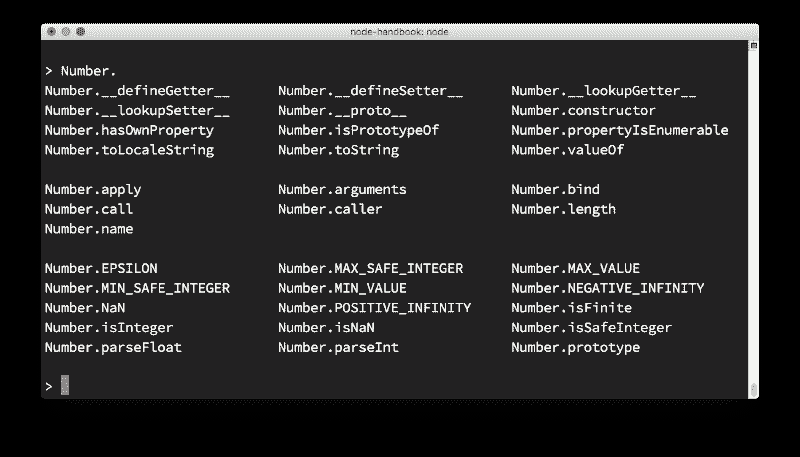
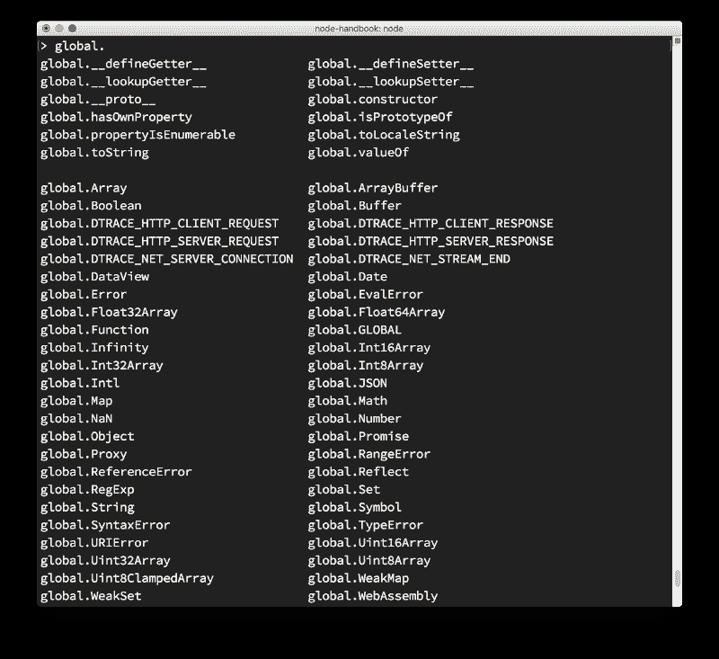
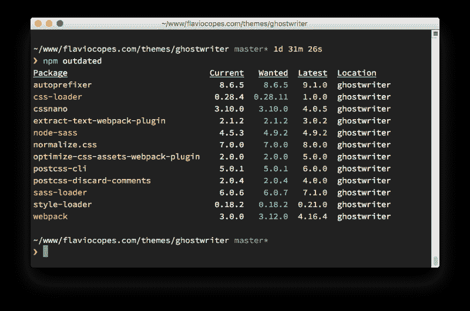
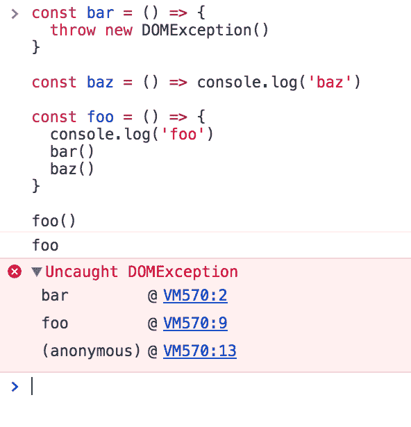
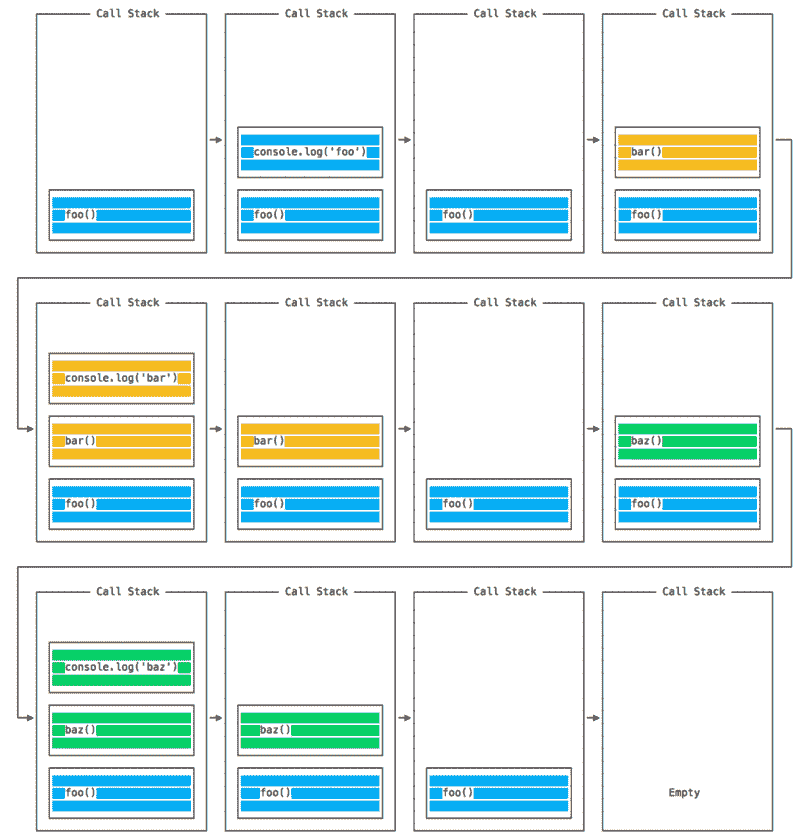
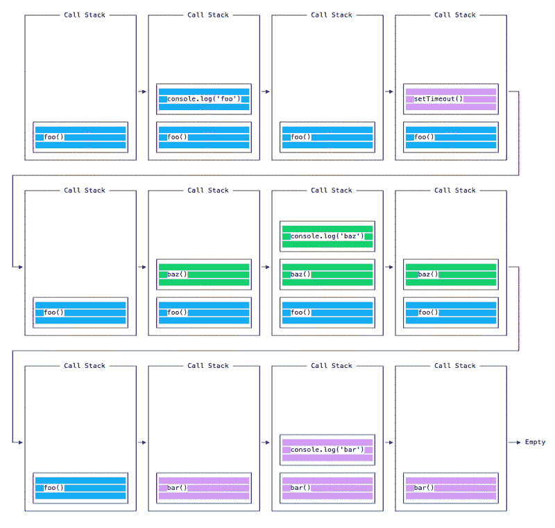
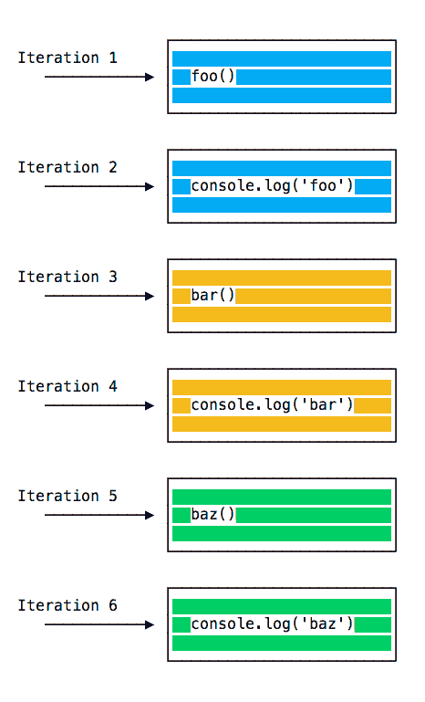
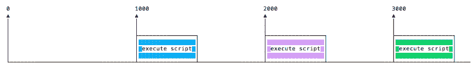
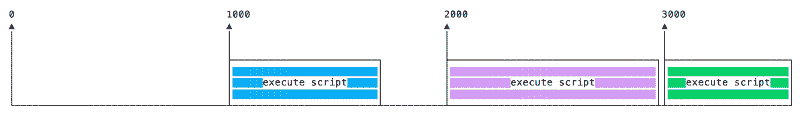
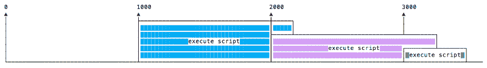

# 权威的 Node.js 手册——初学者学习 Node

> 原文：<https://www.freecodecamp.org/news/the-definitive-node-js-handbook-6912378afc6e/>

注意:你可以获得本手册的 [PDF、ePub 或 Mobi](https://flaviocopes.com/page/node-handbook/) 版本，以便于参考，或者在你的 Kindle 或平板电脑上阅读。

### Node.js 简介

本手册是服务器端 JavaScript 运行时环境 Node.js 的入门指南。

#### 概观

Node.js 是运行在**服务器**上的 JavaScript 的**运行时环境。**

Node.js 是开源的、跨平台的，自 2009 年推出以来，它非常受欢迎，现在在 web 开发领域发挥着重要作用。如果 GitHub 明星是一个受欢迎的指示因素，拥有 58000+颗明星意味着非常受欢迎。

Node.js 在浏览器之外运行 V8 JavaScript 引擎，这是谷歌 Chrome 的核心。Node.js 能够利用已经(并将继续)快速开发 Chrome JavaScript 运行时的工程师的工作，这使得 Node.js 能够受益于巨大的性能改进和 V8 执行的即时编译。得益于此，Node.js 中运行的 JavaScript 代码可以变得非常高效。

Node.js 应用程序由单个进程运行，而不是为每个请求创建一个新线程。Node 在其标准库中提供了一组异步 I/O 原语，可以防止 JavaScript 代码阻塞，通常 Node.js 中的库是使用非阻塞范例编写的，这使得阻塞行为成为一种异常而不是正常现象。

当 Node.js 需要执行 I/O 操作时，比如从网络上读取，访问数据库或文件系统，而不是阻塞线程 Node.js 将在响应返回时恢复操作，而不是浪费 CPU 周期等待。

这使得 Node.js 可以处理单个服务器的数千个并发连接，而不会带来管理线程并发性的负担，这将是错误的主要来源。

Node.js 具有独特的优势，因为数百万为浏览器编写 JavaScript 的前端开发人员现在可以运行服务器端代码和前端代码，而无需学习完全不同的语言。

在 Node.js 中，可以毫无问题地使用新的 ECMAScript 标准，因为您不必等待所有用户更新他们的浏览器——您可以通过更改 Node.js 版本来决定使用哪个 ECMAScript 版本，还可以通过运行带有标志的 Node 来启用特定的实验功能。

#### 它有大量的图书馆

凭借其简单的结构，节点包管理器( [npm](https://flaviocopes.com/npm/) )帮助 Node.js 的生态系统增殖。现在 [npm 注册中心](https://www.npmjs.com/)拥有近 50 万个你可以免费使用的开源包。

### Node.js 示例应用程序

Node.js 最常见的例子 Hello World 是一个 web 服务器:

```
const http = require('http')

const hostname = '127.0.0.1'
const port = 3000

const server = http.createServer((req, res) => {
  res.statusCode = 200
  res.setHeader('Content-Type', 'text/plain')
  res.end('Hello World\n')
})

server.listen(port, hostname, () => {
  console.log(`Server running at http://${hostname}:${port}/`)
})
```

要运行这个代码片段，将其保存为一个`server.js`文件，并在您的终端中运行`node server.js`。

这段代码首先包含 Node.js `http` [模块](https://nodejs.org/api/http.html)。

Node.js 有一个惊人的[标准库](https://nodejs.org/api/)，包括对网络的一流支持。

`http`的`createServer()`方法创建一个新的 HTTP 服务器并返回它。

服务器被设置为监听指定的端口和主机名。当服务器准备好了，回调函数被调用，在这种情况下通知我们服务器正在运行。

每当接收到一个新的请求，就会调用`request` [事件](https://nodejs.org/api/http.html#http_event_request)，提供两个对象:一个请求(一个`[http.IncomingMessage](https://nodejs.org/api/http.html#http_class_http_incomingmessage)`对象)和一个响应(一个`[http.ServerResponse](https://nodejs.org/api/http.html#http_class_http_serverresponse)`对象)。

这两个对象对于处理 HTTP 调用是必不可少的。

第一个提供了请求细节。在这个简单的例子中，没有使用这个，但是您可以访问请求头和请求数据。

第二个用于向调用者返回数据。

在这种情况下:

```
res.statusCode = 200
```

我们将`statusCode`属性设置为`200`，表示响应成功。

我们设置内容类型头:

```
res.setHeader('Content-Type', 'text/plain')
```

…我们结束关闭响应，将内容作为参数添加到`end()`:

```
res.end('Hello World\n')
```

### Node.js 框架和工具

Node.js 是一个底层平台。为了让事情变得更简单，让开发者更感兴趣，在 Node.js 上构建了数千个库。

其中许多随着时间的推移成为流行的选择。以下是我认为非常相关且值得学习的一个不全面的列表:

*   [**Express**](https://expressjs.com/)
    创建 web 服务器的一种最简单而又强大的方法。其极简主义方法和对服务器核心功能的专注是其成功的关键。
*   [**流星**](https://flaviocopes.com/meteor/)
    一个非常强大的全栈框架，让您能够以同构的方式用 JavaScript 构建应用，并在客户端和服务器上共享代码。曾经是提供一切的现成工具，现在集成了前端库，如 [React](https://flaviocopes.com/react/) 、 [Vue](https://flaviocopes.com/vue-introduction/) 和 [Angular](https://angularjs.org/) 。Meteor 也可以用来创建移动应用程序。
*   [**Koa**](http://koajs.com/)
    由 Express 背后的同一个团队打造，Koa 的目标是更简单、更小，建立在多年知识的基础上。新项目诞生于在不破坏现有社区的情况下创建不兼容的变更的需求。
*   [**Next.js**](https://flaviocopes.com/nextjs/)
    这是一个渲染服务器端渲染 [React](https://reactjs.org/) 应用的框架。
*   [**微**](https://github.com/zeit/micro)
    这是一个创建异步 HTTP 微服务的非常轻量级的服务器。
*   [**Socket.io**](https://socket.io/)
    这是一个构建网络应用的实时通信引擎。

### Node.js 简史

#### Node.js 从 2009 年到今天的历史回顾

信不信由你，Node.js 刚刚 9 岁。

相比之下，JavaScript 已经有 23 年的历史了，而我们所知道的网络(在引入 Mosaic 之后)已经有 25 年了。

对于一项技术来说，9 年是如此短暂的一段时间，但 Node.js 似乎一直都在。

自从 Node.js 诞生 2 年以来，我就很高兴能与它一起工作，尽管可用的信息很少，但你已经可以感觉到它是一个巨大的东西。

在这一节中，我想画出 Node.js 历史的全貌，以便正确看待事情。

#### 一点历史

JavaScript 是一种编程语言，由网景公司开发，作为一种脚本工具，在他们的浏览器 [Netscape Navigator](https://en.wikipedia.org/wiki/Netscape_Navigator) 中操作网页。

网景的部分商业模式是销售网络服务器，其中包括一个名为“网景 LiveWire”的环境，它可以使用服务器端的 JavaScript 创建动态页面。所以服务器端 JavaScript 的想法并不是 Node.js 引入的，它和 JavaScript 一样古老——但当时并不成功。

导致 Node.js 崛起的一个关键因素是时机。几年前，JavaScript 开始被认为是一种严肃的语言，这要感谢“Web 2.0”应用程序向世界展示了网络上的现代体验(想想谷歌地图或 GMail)。

得益于浏览器之争，JavaScript 引擎的性能指标大幅提高，这场竞争仍在继续。各大浏览器背后的开发团队每天都在努力工作，为我们提供更好的性能，这是 JavaScript 作为一个平台的巨大胜利。Node.js 使用的引擎 Chrome V8 就是其中之一，尤其是 Chrome JavaScript 引擎。

但当然，Node.js 的流行并不仅仅是因为纯粹的运气或者时机。它引入了很多关于如何在服务器上用 JavaScript 编程的创新思想。

#### Two thousand and nine

*   Node.js 诞生了
*   第一种形式的 [npm](https://flaviocopes.com/npm/) 被创建

#### Two thousand and ten

*   [快递](https://flaviocopes.com/express/)诞生
*   [Socket.io](https://socket.io/) 诞生

#### Two thousand and eleven

*   npm 命中 1.0
*   大公司开始采用节点: [LinkedIn](https://www.linkedin.com) ，[优步](https://www.uber.com)
*   [哈比神](https://hapijs.com/)出生了

#### Two thousand and twelve

*   采用速度非常快

#### Two thousand and thirteen

*   第一个使用 Node.js 的大型博客平台: [Ghost](https://ghost.org/)
*   [Koa](https://koajs.com/) 出生

#### Two thousand and fourteen

*   大剧: [IO.js](https://iojs.org/) 是 Node.js 的一个主要分支，目标是引入 ES6 支持，移动更快

#### Two thousand and fifteen

*   Node.js 基金会诞生了
*   IO.js 被合并回 Node.js
*   npm 引入了私有模块
*   [节点 4](https://nodejs.org/en/blog/release/v4.0.0/) (之前没有发布 1、2、3 版本)

#### Two thousand and sixteen

*   [leftpad 事件](https://blog.npmjs.org/post/141577284765/kik-left-pad-and-npm)
*   [纱](https://flaviocopes.com/yarn/)诞生:节点 6

#### Two thousand and seventeen

*   npm 更关注安全性:节点 8
*   [HTTP/2](https://nodejs.org/api/http2.html)
*   V8 在其测试套件中引入了 Node，正式使 Node 成为了除 Chrome 之外 JavaScript 引擎的目标
*   每周 30 亿次 npm 下载

#### Two thousand and eighteen

*   节点 10
*   [ES 模块](https://flaviocopes.com/es-modules/)。mjs 实验支持

### 如何安装 Node.js

#### 如何在你的系统上安装 Node.js:一个包管理器，官方网站安装程序或 nvm

Node.js 可以通过不同的方式安装。这篇文章强调了最常见和最方便的方法。

所有主要平台的官方软件包都可以在这里得到。

安装 Node.js 的一个非常方便的方法是通过包管理器。在这种情况下，每个操作系统都有自己的。

在 macOS 上， [Homebrew](https://brew.sh/) 是事实上的标准，并且——一旦安装——允许非常容易地安装 Node.js，通过在 CLI 中运行以下命令:

```
brew install node
```

Linux 和 Windows 的其他包管理器在这里列出[。](https://nodejs.org/en/download/package-manager/)

nvm 是一种流行的运行 Node.js 的方式。它允许你轻松地切换 Node.js 版本，安装新版本来尝试，并在出现问题时轻松回滚。

用旧的 Node.js 版本测试代码也非常有用。

我的建议是使用官方安装程序，如果你刚刚开始，你还没有使用自制软件。否则，自制是我最喜欢的解决方案。

### 使用 Node.js 需要了解多少 JavaScript？

如果你刚开始学习 JavaScript，你需要对这门语言了解多少？

作为初学者，很难对自己的编程能力有足够的信心。

在学习编码时，您可能还会对 JavaScript 在哪里结束，Node.js 在哪里开始感到困惑，反之亦然。

我建议您在深入学习 Node.js 之前，先要很好地掌握主要的 JavaScript 概念:

*   词汇结构
*   公式
*   类型
*   变量
*   功能
*   这
*   箭头功能
*   环
*   循环和范围
*   数组
*   模板文字
*   分号
*   严格模式
*   ECMAScript 6，2016，2017

记住这些概念，您就可以成为精通浏览器和 Node.js 的 JavaScript 开发人员了。

以下概念也是理解异步编程的关键，异步编程是 Node.js 的一个基本部分:

*   异步编程和回调
*   倍
*   承诺
*   异步和等待
*   关闭
*   事件循环

幸运的是，我写了一本解释所有这些话题的免费电子书，书名是 [JavaScript 基础](https://flaviocopes.com/javascript/)。这是你能找到的学习所有这些的最简洁的资源。

### Node.js 和浏览器的区别

在 Node.js 中编写 JavaScript 应用程序与在浏览器中为 Web 编程有何不同。

浏览器和节点都使用 JavaScript 作为编程语言。

构建在浏览器中运行的应用程序与构建 Node.js 应用程序是完全不同的事情。

尽管事实上它总是 JavaScript，但是有一些关键的不同使得体验完全不同。

编写 Node.js 应用程序的前端开发人员有一个巨大的优势——语言还是一样的。

你有一个巨大的机会，因为我们知道完全、深入地学习一门编程语言有多难。通过使用同一种语言在 web 上执行所有工作——无论是在客户端还是在服务器上——您处于一种独特的优势地位。

改变的是生态系统。

在浏览器中，大多数时候你所做的是与 DOM 或其他 Web 平台 API 如 Cookies 进行交互。当然，这些在 Node.js 中并不存在。您没有浏览器提供的`document`、`window`和所有其他对象。

在浏览器中，我们没有 Node.js 通过其模块提供的所有漂亮的 API，如文件系统访问功能。

另一个很大的区别是，在 Node.js 中，你控制环境。除非您正在构建一个任何人都可以在任何地方部署的开源应用程序，否则您知道您将在哪个版本的 Node.js 上运行该应用程序。与浏览器环境相比，在浏览器环境中，你不能奢侈地选择你的访问者将使用什么浏览器，这是非常方便的。

这意味着您可以编写您的节点版本支持的所有现代 ES6–7–8–9 JavaScript。

由于 JavaScript 运行如此之快，但浏览器可能会有点慢，用户升级也有点慢——有时在 web 上，您只能使用旧版本的 JavaScript/ECMAScript。

在将代码发布到浏览器之前，您可以使用 Babel 将代码转换成兼容 ES5 的，但是在 Node.js 中，您不需要这样做。

另一个区别是 Node.js 使用了 [CommonJS](https://flaviocopes.com/commonjs/) 模块系统，而在浏览器中我们开始看到 es 模块标准正在实现。

实际上，这意味着暂时在 Node.js 中使用`require()`，在浏览器中使用`import`。

### V8 JavaScript 引擎

V8 是驱动谷歌 Chrome 的 JavaScript 引擎的名字。它是在用 Chrome 浏览时获取并执行我们的 JavaScript 的东西。

V8 提供了 JavaScript 执行的运行时环境。DOM 和其他 Web 平台 API 是由浏览器提供的。

最酷的是 JavaScript 引擎独立于它所在的浏览器。这个关键特性促成了 Node.js 的崛起。早在 2009 年，Node.js 就选择了 V8 作为引擎，随着 Node.js 的流行，V8 成为了现在支持大量 JavaScript 编写的服务器端代码的引擎。

Node.js 生态系统是巨大的，由于它，V8 也支持桌面应用程序，如[electronic](https://electronjs.org/)等项目。

#### 其他 JS 引擎

其他浏览器有自己的 JavaScript 引擎:

*   火狐有[蜘蛛猴](https://developer.mozilla.org/en-US/docs/Mozilla/Projects/SpiderMonkey)
*   Safari 有 [JavaScriptCore](https://developer.apple.com/documentation/javascriptcore) (也叫 Nitro)
*   边缘有[脉轮](https://github.com/Microsoft/ChakraCore)

还有很多其他的。

所有这些引擎都实现了 ECMA ES-262 标准，也称为 ECMAScript，JavaScript 使用的标准。

#### 对性能的追求

V8 是用 C++写的，还在不断改进。它是可移植的，可以在 Mac、Windows、Linux 和其他几个系统上运行。

在这个 V8 介绍中，我将忽略 V8 的实现细节。它们可以在更权威的网站上找到，包括 [V8 官方网站](https://developers.google.com/v8/)，它们会随着时间的推移而改变，通常是彻底的改变。

V8 一直在发展，就像周围的其他 JavaScript 引擎一样，以加快 Web 和 Node.js 生态系统的速度。

在 web 上，性能竞赛已经持续了多年，我们(作为用户和开发人员)从这场竞争中受益匪浅，因为我们年复一年地获得了更快、更优化的机器。

#### 汇编

JavaScript 通常被认为是一种解释语言，但是现代 JavaScript 引擎不再只是解释 JavaScript，而是编译它。

这种情况发生在 2009 年，当时 SpiderMonkey JavaScript 编译器被添加到 Firefox 3.5 中，每个人都遵循了这一想法。

JavScript 由 V8 内部编译，通过实时(JIT)编译来加速执行。

这可能看起来违背直觉。但是自从 2004 年推出谷歌地图以来，JavaScript 已经从一种通常执行几十行代码来完成浏览器中运行的几千到几十万行应用程序的语言演变而来。

我们的应用程序现在可以在浏览器中运行几个小时，而不仅仅是一些表单验证规则或简单的脚本。

在这个**新世界**中，编译 JavaScript 非常有意义，因为虽然 JavaScript **准备就绪**可能需要多一点时间，但一旦完成，它将比纯解释代码的性能好得多。

### 如何退出 Node.js 程序

有多种方法可以终止 Node.js 应用程序。

当在控制台中运行一个程序时，你可以用`ctrl-C`关闭它，但是我在这里想讨论的是以编程方式退出。

让我们从最激烈的一个开始，看看为什么你最好**而不是**使用它。

`process`核心模块提供了一个方便的方法，允许您以编程方式退出 Node.js 程序:`process.exit()`。

当 Node.js 运行这一行时，进程立即被强制终止。

这意味着任何未决的回调，任何仍在发送的网络请求，任何文件系统访问，或写入到`stdout`或`stderr`的进程——都将被立即终止。

如果这对您来说没问题，您可以传递一个整数来通知操作系统退出代码:

```
process.exit(1)
```

默认情况下，退出代码是`0`，表示成功。不同的退出代码有不同的含义，您可能希望在自己的系统中使用这些代码来使程序与其他程序进行通信。

你可以在这里阅读更多退出代码[。](https://nodejs.org/api/process.html#process_exit_codes)

您也可以设置`process.exitCode`属性:

```
process.exitCode = 1
```

当程序稍后结束时，Node.js 将返回退出代码。

当所有处理完成后，程序将优雅地退出。

很多时候，我们使用 Node.js 启动服务器，比如这个 HTTP 服务器:

```
const express = require('express')
const app = express()

app.get('/', (req, res) => {
  res.send('Hi!')
})

app.listen(3000, () => console.log('Server ready')) 
```

这个项目永远不会结束。如果您调用`process.exit()`，任何当前未决或正在运行的请求都将被中止。这是**不好听的**。

在这种情况下，您需要向命令发送一个`SIGTERM`信号，并用过程信号处理器处理它:

**注意:** `process`不需要`require`，自动可用。

```
const express = require('express')

const app = express()

app.get('/', (req, res) => {
  res.send('Hi!')
})

const server = app.listen(3000, () => console.log('Server ready'))

process.on('SIGTERM', () => {
  server.close(() => {
    console.log('Process terminated')
  })
}) 
```

什么是信号？信号是一个可移植操作系统接口(POSIX)内部通信系统:发送给进程的通知，目的是通知它发生了一个事件。

`SIGKILL`是告知进程立即终止的信号，并且在理想情况下会像`process.exit()`一样运行。

`SIGTERM`是告知进程正常终止的信号。这是流程经理发出的信号，如`upstart`或`supervisord`和许多其他人。

您可以在程序内部的另一个函数中发送这个信号:

```
process.kill(process.pid, 'SIGTERM')
```

或者从另一个 Node.js 运行程序，或者在您的系统中运行的、知道您想要终止的进程的 PID 的任何其他应用程序。

### 如何从 Node.js 读取环境变量

Node 的核心模块`process`提供了`env`属性，该属性托管所有在流程开始时设置的环境变量。

下面是一个访问`NODE_ENV`环境变量的例子，该变量默认设置为`development`。

```
process.env.NODE_ENV // "development"
```

在脚本运行之前将其设置为`production`将告诉 Node.js 这是一个生产环境。

同样，您可以访问您设置的任何自定义环境变量。

这里我们为 API_KEY 和 API_SECRET 设置了两个变量

```
API_KEY=123123 API_SECRET=456456 node app.js
```

我们可以通过运行以下命令在 Node.js 中获取它们

```
process.env.API_KEY // "123123"
process.env.API_SECRET // "456456" 
```

您可以将环境变量写在一个`.env`文件中(您应该将该文件添加到`.gitignore`中，以避免推送到 GitHub)，然后

```
npm install dotenv
```

在主节点文件的开头，添加

```
require('dotenv').config() 
```

这样你可以避免在命令行中的`node`命令之前列出环境变量，这些变量将会被自动选取。

**注意:**一些工具，比如 Next.js，让`.env`中定义的环境变量自动可用，而不需要使用`dotenv`。

### 在哪里托管 Node.js 应用程序

Node.js 应用程序可以托管在许多地方，这取决于您的需要。

当您想要部署应用程序并使其可供公众访问时，以下是可供您探索的选项的非详尽列表。

我将列出从最简单和受限到更复杂和强大的选项。

#### 最简单的选择:本地隧道

即使你有一个动态 IP，或者你在一个 NAT 下，你也可以部署你的应用程序，并使用本地隧道从你的电脑服务请求。

该选项适用于一些快速测试、产品演示或与一小群人分享应用程序。

一个非常好的工具是 [ngrok](https://ngrok.com/) ，它可以在所有平台上使用。

使用它，你只需输入`ngrok PORT`，你想要的端口就会暴露在互联网上。你将获得一个 ngrok.io 域名，但通过付费订阅，你可以获得一个自定义 URL 以及更多的安全选项(记住，你是在向公共互联网开放你的机器)。

你可以使用的另一个服务是 [localtunnel](https://github.com/localtunnel/localtunnel) 。

#### 零配置部署

#### 小故障

Glitch 是一个游乐场，也是一种比以往任何时候都更快地构建你的应用程序的方式，你可以看到它们在自己的 glitch.com 子域上运行。你目前不能有一个自定义域名，并且有一些 T2 限制，但是原型真的很棒。它看起来很有趣(这是一个优点)，而且它不是一个愚蠢的环境——您可以获得 Node.js、CDN、凭证安全存储、GitHub 导入/导出等所有功能。

由 FogBugz 和 Trello 背后的公司(以及 Stack Overflow 的共同创作者)提供。

我经常用它来做演示。

#### 密码笔

[Codepen](https://codepen.io/) 是一个了不起的平台和社区。您可以创建一个包含多个文件的项目，并使用自定义域部署它。

#### 无服务器

发布应用程序的一种方式是无服务器的，根本不需要管理服务器。无服务器是一种范式，在这种范式中，你将应用发布为**功能**，它们在网络端点上做出响应(也称为 FAAS——功能即服务)。

非常流行的解决方案是:

*   [无服务器框架](https://serverless.com/framework/)
*   [标准库](https://stdlib.com/)

它们都为 AWS Lambda 和其他基于 Azure 或谷歌云产品的 FAAS 解决方案的发布提供了一个抽象层。

#### PAAS

PAAS 代表平台即服务。这些平台消除了您在部署应用程序时应该担心的许多事情。

#### 现在时代

Zeit 是一个有趣的选择。您只需在终端中键入`now`，它就会负责部署您的应用程序。有免费版有限制，付费版更强大。你只是忘记了有一个服务器，你只是部署应用程序。

#### Nanobox

[纳米盒](https://nanobox.io/)

#### Heroku

Heroku 是一个令人惊叹的平台。

这是一篇关于 Heroku 上的 Node.js 入门的好文章。

#### 微软 Azure

Azure 是微软的云产品。

查看如何在 Azure 中[创建 Node.js web 应用。](https://docs.microsoft.com/en-us/azure/app-service/app-service-web-get-started-node)

#### 谷歌云平台

谷歌云对你的应用程序来说是一个惊人的结构。

他们有很好的 [Node.js 文档部分](https://cloud.google.com/node/)。

#### 虚拟专用服务器

在本节中，您会发现一些常见的疑点，按用户友好程度从高到低排序:

*   [数字海洋](https://www.digitalocean.com/)
*   里诺德
*   亚马逊网络服务，我特别提到亚马逊弹性豆茎，因为它抽象出了 AWS 的一点复杂性。

因为它们提供了一台空的 Linux 机器，您可以在上面工作，所以没有专门的教程。

在 VPS 类别中有更多的选项，这些只是我使用过的选项，我会推荐这些选项。

#### Bare metal

另一个解决方案是获得一个裸机服务器，安装一个 Linux 发行版，连接到互联网上(或者每月租用一个，就像你可以使用 T2 的 Vultr 裸机服务)

### 如何使用 Node.js REPL

REPL 代表读取-评估-打印-循环，这是快速探索 Node.js 特性的好方法。

`node`命令是我们用来运行 Node.js 脚本的命令:

```
node script.js
```

如果我们省略文件名，我们在 REPL 模式下使用它:

```
node
```

如果您现在在终端中尝试，将会发生以下情况:

```
❯ node
> 
```

该命令处于空闲模式，等待我们输入内容。

**提示**:如果你不确定如何打开你的终端，谷歌“如何在<你的操作系统>上打开终端”。

REPL 正等着我们输入一些 JavaScript 代码。

从简单开始，输入:

```
> console.log('test')
test
undefined
> 
```

第一个值`test`，是我们告诉控制台打印的输出，然后我们得到 undefined，这是运行`console.log()`的返回值。

我们现在可以输入一行新的 JavaScript 代码。

#### 使用选项卡自动完成

REPL 最酷的地方在于它是交互式的。

当你写代码的时候，如果你按下`tab`键，REPL 会自动完成你写的内容，以匹配你已经定义的变量或者预定义的变量。

#### 探索 JavaScript 对象

尝试输入一个 JavaScript 类的名称，比如`Number`，添加一个点，然后按`tab`。

REPL 将打印您可以在该类上访问的所有属性和方法:



#### 浏览全局对象

您可以通过键入`global.`并按下`tab`来检查您有权访问的全局变量:



#### _ 特殊变量

如果在一些代码之后你输入`_`，那将会打印出最后一次操作的结果。

#### 点命令

REPL 有一些特殊的命令，都以点`.`开头。他们是

*   `.help`:显示点命令帮助
*   `.editor`:使编辑器更容易编写多行 JavaScript 代码。一旦进入这种模式，输入 ctrl-D 运行您编写的代码。
*   `.break`:输入多行表达式时，输入。中断命令将中止进一步的输入。与按 ctrl-C 相同。
*   `.clear`:将 REPL 上下文重置为空对象，并清除当前正在输入的任何多行表达式。
*   `.load`:加载一个 JavaScript 文件，相对于当前工作目录
*   `.save`:将您在 REPL 会话中输入的所有内容保存到一个文件中(指定文件名)
*   `.exit`:存在 repl(相当于按两次 ctrl-C)

REPL 知道你什么时候输入多行语句，而不需要调用`.editor`。

例如，如果您开始像这样键入一个迭代:

```
[1, 2, 3].forEach(num => {
```

你按下`enter`，REPL 将转到一个以 3 个点开始的新行，表示你现在可以继续在那个块上工作。

```
...   console.log(num)
... }) 
```

如果在一行的末尾输入`.break`，多行模式将会停止，语句将不会被执行。

### Node.js，接受来自命令行的参数

如何在 Node.js 程序中接受从命令行传递的参数

调用 Node.js 应用程序时，可以使用以下命令传递任意数量的参数:

```
node app.js
```

参数可以是独立的，也可以有一个键和值。

例如:

```
node app.js flavio
```

或者

```
node app.js name=flavio
```

这将改变您在 Node.js 代码中检索该值的方式。

检索它的方法是使用 Node.js 内置的`process`对象。

它公开了一个`argv`属性，这是一个包含所有命令行调用参数的数组。

第一个参数是`node`命令的完整路径。

第二个元素是正在执行的文件的完整路径。

所有的附加参数都是从第三个位置开始的。

您可以使用循环迭代所有参数(包括节点路径和文件路径):

```
process.argv.forEach((val, index) => {
  console.log(`${index}: ${val}`)
}) 
```

通过创建一个排除前两个参数的新数组，可以只获得附加参数:

```
const args = process.argv.slice(2)
```

如果有一个没有索引名的参数，如下所示:

```
node app.js flavio
```

您可以使用以下方式访问它

```
const args = process.argv.slice(2)
args[0] 
```

在这种情况下:

```
node app.js name=flavio
```

`args[0]`是`name=flavio`，需要解析。最好的方法是使用`minimist` [库](https://www.npmjs.com/package/minimist)，它有助于处理参数:

```
const args = require('minimist')(process.argv.slice(2))
args['name'] // flavio 
```

### 使用 Node.js 输出到命令行

如何使用 Node.js 打印到命令行控制台，从基本的 console.log 到更复杂的场景

#### 使用控制台模块的基本输出

Node.js 提供了一个`console` [模块](https://nodejs.org/api/console.html)，它提供了大量非常有用的与命令行交互的方式。

和你在浏览器中找到的`console`对象基本相同。

最基本也是最常用的方法是`console.log()`，它将你传递给它的字符串打印到控制台。

如果您传递一个对象，它将把它呈现为一个字符串。

您可以将多个变量传递给`console.log`，例如:

```
const x = 'x'
const y = 'y'
console.log(x, y) 
```

Node.js 将打印两者。

我们还可以通过传递变量和格式说明符来格式化漂亮的短语。

例如:

```
console.log('My %s has %d years', 'cat', 2)
```

*   `%s`将变量格式化为字符串
*   `%d`或`%i`将变量格式化为整数
*   `%f`将变量格式化为浮点数
*   `%O`用于打印一个对象表示

示例:

```
console.log('%O', Number)
```

#### 清空控制台

`console.clear()`清除控制台(行为可能取决于所使用的控制台)

#### 计数元素

`console.count()`是一种简便的方法。

以这段代码为例:

```
const x = 1
const y = 2
const z = 3

console.count(
  'The value of x is ' + x + ' and has been checked .. how many times?'
)

console.count(
  'The value of x is ' + x + ' and has been checked .. how many times?'
)

console.count(
  'The value of y is ' + y + ' and has been checked .. how many times?'
)
```

发生的情况是，`count`会统计一个字符串被打印的次数，并在旁边打印计数。

你可以只数苹果和橘子:

```
const oranges = ['orange', 'orange']
const apples = ['just one apple']

oranges.forEach(fruit => {
  console.count(fruit)
})

apples.forEach(fruit => {
  console.count(fruit)
})
```

#### 打印堆栈跟踪

在某些情况下，打印函数的调用堆栈跟踪可能会很有用，也许是为了回答这样一个问题:“您是如何到达代码的那个部分的？”

您可以使用`console.trace()`来完成:

```
const function2 = () => console.trace()
const function1 = () => function2()
function1() 
```

这将打印堆栈跟踪。如果我在节点 REPL 中尝试这样做，就会打印出这样的结果:

```
Trace
  at function2 (repl:1:33)
  at function1 (repl:1:25)
  at repl:1:1
  at ContextifyScript.Script.runInThisContext (vm.js:44:33)
  at REPLServer.defaultEval (repl.js:239:29)
  at bound (domain.js:301:14)
  at REPLServer.runBound [as eval] (domain.js:314:12)
  at REPLServer.onLine (repl.js:440:10)
  at emitOne (events.js:120:20)
  at REPLServer.emit (events.js:210:7)
```

#### 计算花费的时间

使用`time()`和`timeEnd()`，你可以很容易地计算出一个函数运行需要多长时间

```
const doSomething = () => console.log('test')
const measureDoingSomething = () => {
  console.time('doSomething()')
  // do something, and measure the time it takes
  doSomething()
  console.timeEnd('doSomething()')
}

measureDoingSomething() 
```

#### stdout and stderr

正如我们所见，console.log 非常适合在控制台中打印消息。这就是所谓的标准输出，或`stdout`。

`console.error`打印到`stderr`流。

它不会出现在控制台中，但会出现在错误日志中。

#### 给输出着色

您可以通过使用转义序列来为控制台中的文本输出着色。转义序列是标识颜色的一组字符。

示例:

```
console.log('\x1b[33m%s\x1b[0m', 'hi!')
```

你可以在节点 REPL 中试试，它会用黄色打印出`hi!`。

但是，这是低级的做法。给控制台输出着色的最简单的方法是使用一个库。Chalk 就是这样一个库，除了着色之外，它还有助于其他样式工具，比如使文本加粗、倾斜或加下划线。

你用`npm install chalk`安装，然后就可以用了:

```
const chalk = require('chalk')
console.log(chalk.yellow('hi!')) 
```

使用`chalk.yellow`比试图记住转义码要方便得多，代码可读性也强得多。

查看我在上面发布的项目链接，获取更多的使用示例。

#### 创建进度条

[Progress](https://www.npmjs.com/package/progress) 是一个很棒的软件包，可以在控制台中创建进度条。使用`npm install progress`安装。

这个代码片段创建了一个 10 步进度条，每 100 毫秒完成一步。当小节结束时，我们清空间隔:

```
const ProgressBar = require('progress')

const bar = new ProgressBar(':bar', { total: 10 })
const timer = setInterval(() => {
  bar.tick()
  if (bar.complete) {
    clearInterval(timer)
  }
}, 100) 
```

### 接受 Node.js 中命令行的输入

如何让 Node.js CLI 程序具有交互性？

从版本 7 开始，Node 提供了`readline` [模块](https://nodejs.org/api/readline.html)来执行这一任务:从可读流(如`process.stdin`流)中获取输入，在 Node 程序执行期间，这是终端输入，一次一行。

```
const readline = require('readline').createInterface({
  input: process.stdin,
  output: process.stdout
})

readline.question(`What's your name?`, (name) => {
  console.log(`Hi ${name}!`)
  readline.close()
}) 
```

这段代码询问用户名，一旦输入文本，用户按 enter，我们就发送一个问候。

`question()`方法显示第一个参数(一个问题)并等待用户输入。一旦按下回车键，它就调用回调函数。

在这个回调函数中，我们关闭了 readline 接口。

提供了几个其他的方法，我会让你在我上面链接的包文档中查看它们。

如果你需要一个密码，最好现在回显它，而不是显示一个`*`符号。

最简单的方法是使用 readline-sync [包](https://www.npmjs.com/package/readline-sync)，这个包在 API 方面非常相似，并且可以立即处理。

更完整抽象的解决方案由 [Inquirer.js 包](https://github.com/SBoudrias/Inquirer.js)提供。

可以用`npm install inquirer`安装，然后可以这样复制上面的代码:

```
const inquirer = require('inquirer')

var questions = [{
  type: 'input',
  name: 'name',
  message: "What's your name?",
}]

inquirer.prompt(questions).then(answers => {
  console.log(`Hi ${answers['name']}!`)
}) 
```

Inquirer.js 允许你做很多事情，比如询问多项选择、单选按钮、确认等等。

了解所有的替代方法是值得的，尤其是 Node.js 提供的内置方法，但是如果您打算将 CLI 输入提高一个级别，Inquirer.js 是一个最佳选择。

### 使用导出从 Node.js 文件公开功能

如何使用`module.exports` API 向应用程序中的其他文件或其他应用程序公开数据

Node.js 内置了模块系统。

Node.js 文件可以导入由其他 Node.js 文件公开的功能。

当您想要导入您使用的东西时:

```
const library = require('./library') 
```

导入当前文件夹中的`library.js`文件中显示的功能。

在此文件中，功能必须在被其他文件导入之前公开。

默认情况下，文件中定义的任何其他对象或变量都是私有的，不向外界公开。

这就是由`module` [系统](https://nodejs.org/api/modules.html)提供的`module.exports` API 允许我们做的事情。

当你分配一个对象或者一个函数作为一个新的`exports`属性时，这就是被暴露的东西。因此，它可以导入到应用程序的其他部分，也可以导入到其他应用程序中。

您可以通过两种方式来实现。

第一种是给`module.exports`分配一个对象，它是模块系统提供的现成对象，这将使您的文件导出**只是那个对象**:

```
const car = {
  brand: 'Ford',
  model: 'Fiesta'
}

module.exports = car

// ...in the other file

const car = require('./car') 
```

第二种方法是将导出的对象添加为`exports`的属性。这种方式允许您导出**多个**对象、函数或数据:

```
const car = {
  brand: 'Ford',
  model: 'Fiesta'
}

exports.car = car 
```

或者直接

```
exports.car = {
  brand: 'Ford',
  model: 'Fiesta'
} 
```

在另一个文件中，您将通过引用导入的属性来使用它:

```
const items = require('./items')
items.car 
```

或者

```
const car = require('./items').car
```

`module.exports`和`exports`有什么区别？

第一个暴露了它所指向的对象。后者暴露了**它所指向的对象的属性**。

### 国家预防机制简介

`npm`表示**节点包管理器**。

2017 年 1 月，超过 350，000 个软件包被报告列在 npm 注册表中，使其成为地球上最大的单一语言代码库，你可以肯定有一个软件包(几乎！)一切。

它最初是作为下载和管理 Node.js 包的依赖项的一种方式，但后来它变成了前端 JavaScript 中也使用的一种工具。

`npm`做的事情很多。

#### 下载

管理项目依赖项的下载。

#### 安装所有依赖项

如果一个项目有一个`packages.json`文件，通过运行

```
npm install
```

它将在`node_modules`文件夹中安装项目需要的所有东西，如果它不存在的话就创建它。

#### 安装单个软件包

您还可以通过运行以下命令来安装特定的软件包

```
npm install <package-name>
```

您通常会看到更多的标志添加到该命令中:

*   `--save`安装并添加条目到`package.json`文件`dependencies`
*   `--save-dev`安装并添加条目到`package.json`文件`devDependencies`

区别主要是`devDependencies`通常是开发工具，像测试库，而`dependencies`是和生产中的 app 捆绑在一起的。

#### 更新包

通过运行以下命令，更新也变得很容易

```
npm update
```

`npm`将检查所有包中是否有满足您的版本限制的新版本。

您也可以指定要更新的单个软件包:

```
npm update <package-name>
```

#### 版本控制

除了普通下载，`npm`还管理**版本控制**，所以你可以指定软件包的任何特定版本，或者要求比你需要的版本更高或更低的版本。

很多时候你会发现一个库只与另一个库的主要版本兼容。

或者是某个库的最新版本中的一个 bug(仍未修复)导致了一个问题。

指定一个库的显式版本也有助于让每个人都使用同一个版本的包，这样整个团队都会运行同一个版本，直到`package.json`文件被更新。

在所有这些情况下，版本控制很有帮助，`npm`遵循语义版本控制(semver)标准。

#### 运行任务

package.json 文件支持一种指定命令行任务的格式，可以使用

```
npm run <task-name>
```

例如:

```
{
  "scripts": {
    "start-dev": "node lib/server-development",
    "start": "node lib/server-production"
  },
} 
```

使用这个特性来运行 Webpack 是很常见的:

```
{
  "scripts": {
    "watch": "webpack --watch --progress --colors --config webpack.conf.js",
    "dev": "webpack --progress --colors --config webpack.conf.js",
    "prod": "NODE_ENV=production webpack -p --config webpack.conf.js",
  },
} 
```

因此，您可以运行以下命令，而不是键入那些很容易忘记或输入错误的长命令

```
$ npm watch
$ npm dev
$ npm prod 
```

### npm 在哪里安装软件包？

当您使用`npm`(或[纱线](https://flaviocopes.com/yarn/)安装套件时，您可以执行两种类型的安装:

*   本地安装
*   全局安装

默认情况下，当您键入一个`npm install`命令时，比如:

```
npm install lodash
```

该包安装在当前文件树的`node_modules`子文件夹下。

发生这种情况时，`npm`还会在当前文件夹中的`package.json`文件的`dependencies`属性中添加`lodash`条目。

使用`-g`标志执行全局安装:

```
npm install -g lodash
```

发生这种情况时，npm 不会在本地文件夹下安装软件包，而是使用全局位置。

具体在哪里？

`npm root -g`命令会告诉你在你机器上的确切位置。

在 macOS 或 Linux 上，这个位置可能是`/usr/local/lib/node_modules`。在 Windows 上可能是`C:\Users\YOU\AppData\Roaming\npm\node_modules`

但是，如果您使用`nvm`来管理 Node.js 版本，那么位置会有所不同。

例如，我使用了`nvm`，我的包位置显示为`/Users/flavio/.nvm/versions/node/v8.9.0/lib/node_modules`。

### 如何使用或执行使用 npm 安装的软件包

#### 如何在代码中包含和使用安装在 node_modules 文件夹中的包

当您使用`npm`将一个包安装到您的`node_modules`文件夹中，或者全局安装时，您如何在您的节点代码中使用它？

假设您使用以下命令安装了流行的 JavaScript 实用程序库`lodash`

```
npm install lodash
```

这将把软件包安装在本地的`node_modules`文件夹中。

要在您的代码中使用它，您只需要使用`require`将它导入到您的程序中:

```
const _ = require('lodash')
```

如果你的包是一个可执行文件呢？

在这种情况下，它会将可执行文件放在`node_modules/.bin/`文件夹下。

证明这一点的一个简单方法是 [cowsay](https://www.npmjs.com/package/cowsay) 。

cowsay 包提供了一个命令行程序，执行该程序可以让一头牛(以及其他动物)说话。

当您使用`npm install cowsay`安装包时，它将在 node_modules 文件夹中安装自己和一些依赖项。

有一个隐藏的。bin 文件夹，其中包含指向 cowsay 二进制文件的符号链接。

你是如何执行的？

当然，你可以输入`./node_modules/.bin/cowsay`来运行它，它可以运行，但是最近版本的 npm(从 5.2 开始)中包含的 [npx](https://flaviocopes.com/npx/) 是一个更好的选择。你只要跑:

```
npx cowsay
```

npx 会找到包的位置。

### package.json 指南

package.json 文件是许多基于 Node.js 生态系统的应用程序代码库中的关键元素。

如果您使用 JavaScript，或者您曾经与 JavaScript 项目、Node.js 或前端项目进行过交互，您肯定会遇到`package.json`文件。

那是干什么用的？关于它你应该知道些什么，你能用它做些什么很酷的事情？

`package.json`文件是您项目的清单。它可以做很多事情，完全不相关。例如，它是工具配置的中央存储库。它也是`[npm](https://flaviocopes.com/npm/)`和`[yarn](https://flaviocopes.com/yarn/)`存储它所安装的软件包的名称和版本的地方。

#### 文件结构

下面是一个 package.json 文件示例:

```
{

} 
```

是空的！对于一个应用程序，`package.json`文件中应该有什么没有固定的要求。唯一的要求是它遵守 JSON 格式，否则试图以编程方式访问其属性的程序无法读取它。

如果您正在构建一个 Node.js 包，并希望通过`npm`进行分发，那么事情会发生根本性的变化，您必须有一组属性来帮助其他人使用它。稍后我们会看到更多关于这方面的内容。

这是另一个包. json:

```
{
  "name": "test-project"
}
```

它定义了一个`name`属性，该属性告诉应用程序或包的名称，它包含在这个文件所在的同一个文件夹中。

下面是一个更复杂的例子，我从一个示例 Vue.js 应用程序中提取了这个例子:

```
{
  "name": "test-project",
  "version": "1.0.0",
  "description": "A Vue.js project",
  "main": "src/main.js",
  "private": true,
  "scripts": {
    "dev": "webpack-dev-server --inline --progress --config build/webpack.dev.conf.js",
    "start": "npm run dev",
    "unit": "jest --config test/unit/jest.conf.js --coverage",
    "test": "npm run unit",
    "lint": "eslint --ext .js,.vue src test/unit",
    "build": "node build/build.js"
  },
  "dependencies": {
    "vue": "^2.5.2"
  },
  "devDependencies": {
    "autoprefixer": "^7.1.2",
    "babel-core": "^6.22.1",
    "babel-eslint": "^8.2.1",
    "babel-helper-vue-jsx-merge-props": "^2.0.3",
    "babel-jest": "^21.0.2",
    "babel-loader": "^7.1.1",
    "babel-plugin-dynamic-import-node": "^1.2.0",
    "babel-plugin-syntax-jsx": "^6.18.0",
    "babel-plugin-transform-es2015-modules-commonjs": "^6.26.0",
    "babel-plugin-transform-runtime": "^6.22.0",
    "babel-plugin-transform-vue-jsx": "^3.5.0",
    "babel-preset-env": "^1.3.2",
    "babel-preset-stage-2": "^6.22.0",
    "chalk": "^2.0.1",
    "copy-webpack-plugin": "^4.0.1",
    "css-loader": "^0.28.0",
    "eslint": "^4.15.0",
    "eslint-config-airbnb-base": "^11.3.0",
    "eslint-friendly-formatter": "^3.0.0",
    "eslint-import-resolver-webpack": "^0.8.3",
    "eslint-loader": "^1.7.1",
    "eslint-plugin-import": "^2.7.0",
    "eslint-plugin-vue": "^4.0.0",
    "extract-text-webpack-plugin": "^3.0.0",
    "file-loader": "^1.1.4",
    "friendly-errors-webpack-plugin": "^1.6.1",
    "html-webpack-plugin": "^2.30.1",
    "jest": "^22.0.4",
    "jest-serializer-vue": "^0.3.0",
    "node-notifier": "^5.1.2",
    "optimize-css-assets-webpack-plugin": "^3.2.0",
    "ora": "^1.2.0",
    "portfinder": "^1.0.13",
    "postcss-import": "^11.0.0",
    "postcss-loader": "^2.0.8",
    "postcss-url": "^7.2.1",
    "rimraf": "^2.6.0",
    "semver": "^5.3.0",
    "shelljs": "^0.7.6",
    "uglifyjs-webpack-plugin": "^1.1.1",
    "url-loader": "^0.5.8",
    "vue-jest": "^1.0.2",
    "vue-loader": "^13.3.0",
    "vue-style-loader": "^3.0.1",
    "vue-template-compiler": "^2.5.2",
    "webpack": "^3.6.0",
    "webpack-bundle-analyzer": "^2.9.0",
    "webpack-dev-server": "^2.9.1",
    "webpack-merge": "^4.1.0"
  },
  "engines": {
    "node": ">= 6.0.0",
    "npm": ">= 3.0.0"
  },
  "browserslist": ["> 1%", "last 2 versions", "not ie <= 8"]
} 
```

这里有很多事情在进行:

*   `name`设置应用程序/包名
*   `version`表示当前版本
*   `description`是应用程序/包的简要描述
*   `main`设置应用程序的入口点
*   `private`如果设置为`true`防止应用/包意外发布到`npm`
*   `scripts`定义一组您可以运行的节点脚本
*   `dependencies`设置作为依赖项安装的`npm`包的列表
*   `devDependencies`设置作为开发依赖项安装的`npm`包列表
*   `engines`设置该包/应用在哪个版本的节点上工作
*   `browserslist`用于告知您想要支持哪些浏览器(及其版本)

所有这些属性要么被`npm`使用，要么被我们可以使用的其他工具使用。

#### 属性细分

本节详细描述了您可以使用的属性。我指的是“包”,但同样的事情也适用于本地应用程序，你不用它作为包。

这些属性中的大部分只在 npm [网站](https://www.npmjs.com/)上使用，其他的由与你的代码交互的脚本使用，比如`npm`或其他。

#### `name`

设置包名。

示例:

```
"name": "test-project"
```

名称必须少于 214 个字符，不能有空格，只能包含小写字母、连字符(`-`)或下划线(`_`)。

这是因为当一个包在`npm`发布时，它会根据这个属性获得自己的 URL。

如果您在 GitHub 上公开发布了这个包，那么这个属性的一个很好的值就是 GitHub 存储库名称。

#### `author`

列出软件包作者的姓名

示例:

```
{
  "author": "Flavio Copes <flavio@flaviocopes.com> (https://flaviocopes.com)"
}
```

也可用于以下格式:

```
{
  "author": {
    "name": "Flavio Copes",
    "email": "your@email.com",
    "url": "https://flaviocopes.com"
  }
} 
```

#### `contributors`

除了作者，项目还可以有一个或多个参与者。这个属性是一个列出它们的数组。

示例:

```
{
  "contributors": ["Flavio Copes <your@email.com> (https://flaviocopes.com)"]
} 
```

也可用于以下格式:

```
{
  "contributors": [
    {
      "name": "Flavio Copes",
      "email": "your@email.com",
      "url": "https://flaviocopes.com"
    }
  ]
} 
```

#### `bugs`

链接到包问题跟踪器，很可能是一个 GitHub 问题页面

示例:

```
{
  "bugs": "https://github.com/flaviocopes/package/issues"
}
```

#### `homepage`

设置包主页

示例:

```
{
  "homepage": "https://flaviocopes.com/package"
} 
```

#### `version`

指示包的当前版本。

示例:

```
"version": "1.0.0"
```

该属性遵循版本的语义版本化(semver)符号，这意味着版本总是用 3 个数字表示:`x.x.x`。

第一个数字是主要版本，第二个是次要版本，第三个是修补版本。

这些数字有一个含义:只修复 bug 的版本是补丁版本，引入向后兼容变化的版本是次要版本，主要版本可以有突破性的变化。

#### `license`

指示包的许可证。

示例:

```
"license": "MIT"
```

#### `keywords`

该属性包含一组关键字，这些关键字与您的包的功能相关联。

示例:

```
"keywords": [
  "email",
  "machine learning",
  "ai"
] 
```

这有助于人们在浏览类似的包或浏览 npm 网站时找到您的包。

#### `description`

此属性包含包的简短描述。

示例:

```
"description": "A package to work with strings"
```

如果你决定将你的包发布到`npm`上，这是非常有用的，这样人们就可以知道这个包是关于什么的。

#### `repository`

此属性指定此包存储库的位置。

示例:

```
"repository": "github:flaviocopes/testing",
```

注意前缀`github`。还有其他受欢迎的服务:

```
"repository": "gitlab:flaviocopes/testing",
```

```
"repository": "bitbucket:flaviocopes/testing",
```

您可以显式设置版本控制系统:

```
"repository": {
  "type": "git",
  "url": "https://github.com/flaviocopes/testing.git"
} 
```

您可以使用不同的版本控制系统:

```
"repository": {
  "type": "svn",
  "url": "..."
} 
```

#### `main`

设置包的入口点。

当您在应用程序中导入这个包时，应用程序将在那里搜索模块导出。

示例:

```
"main": "src/main.js"
```

#### `private`

如果设置为`true`，则防止应用/包在`npm`意外发布

示例:

```
"private": true
```

#### `scripts`

定义一组可以运行的节点脚本

示例:

```
"scripts": {
  "dev": "webpack-dev-server --inline --progress --config build/webpack.dev.conf.js",
  "start": "npm run dev",
  "unit": "jest --config test/unit/jest.conf.js --coverage",
  "test": "npm run unit",
  "lint": "eslint --ext .js,.vue src test/unit",
  "build": "node build/build.js"
} 
```

这些脚本是命令行应用程序。你可以通过调用`npm run XXXX`或`yarn XXXX`来运行它们，其中`XXXX`是命令名。

例:
`npm run dev`

您可以为命令使用任何您想要的名称，脚本可以做任何您想要做的事情。

#### `dependencies`

设置作为依赖项安装的`npm`包列表。

当您使用 npm 或 yarn 安装软件包时:

```
npm install <PACKAGENAME>
yarn add <PACKAGENAME> 
```

该软件包会自动插入到该列表中。

示例:

```
"dependencies": {
  "vue": "^2.5.2"
} 
```

#### `devDependencies`

设置作为开发依赖项安装的`npm`包列表。

它们与`dependencies`不同，因为它们只能安装在开发机器上，不需要在生产中运行代码。

使用`npm`或`yarn`安装软件包时:

```
npm install --dev <PACKAGENAME>
yarn add --dev <PACKAGENAME> 
```

该软件包会自动插入到该列表中。

示例:

```
"devDependencies": {
  "autoprefixer": "^7.1.2",
  "babel-core": "^6.22.1"
} 
```

#### `engines`

设置此包/应用程序使用的 Node.js 和其他命令的版本。

示例:

```
"engines": {
  "node": ">= 6.0.0",
  "npm": ">= 3.0.0",
  "yarn": "^0.13.0"
} 
```

#### `browserslist`

用于告诉您想要支持哪些浏览器(及其版本)。它被 Babel、Autoprefixer 和其他工具引用，只向目标浏览器添加所需的 polyfills 和 fallbacks。

示例:

```
"browserslist": [
  "> 1%",
  "last 2 versions",
  "not ie <= 8"
] 
```

这种配置意味着你要支持所有浏览器的后两个主要版本，至少有 1%的使用率(来自[CanIUse.com](https://caniuse.com/)统计)，除了 IE8 和更低版本([在 browserslist 上查看更多](https://www.npmjs.com/package/browserslist))。

#### 特定于命令的属性

`package.json`文件也可以托管特定于命令的配置，例如 Babel、ESLint 等等。

每个都有特定的属性，像`eslintConfig`、`babel`等等。这些是特定于命令的，您可以在相应的命令/项目文档中找到如何使用它们。

#### 包版本

你在上面的描述中已经看到了这样的版本号:`~3.0.0`或`^0.13.0`。它们是什么意思，您还可以使用哪些版本说明符？

该符号指定您的包从该依赖关系中接受哪些更新。

假设使用 semver(语义版本控制),所有版本都有 3 个数字，第一个是主版本，第二个是次版本，第三个是补丁版本，您有这些规则:

*   `~`:如果你写`~0.13.0`，你想只更新补丁发布:`0.13.1`可以，但是`0.14.0`不行。
*   `^`:如果你写`^0.13.0`，你想更新补丁和次要版本:`0.13.1`、`0.14.0`等等。
*   `*`:如果你写`*`，那意味着你接受所有更新，包括主要版本升级。
*   您接受任何高于您指定的版本
*   您接受等于或高于您指定版本的任何版本
*   您接受等于或低于您指定的任何版本
*   你接受比你指定的版本低的任何版本

还有其他规则:

*   无符号:您只接受您指定特定版本
*   `latest`:您想要使用最新版本

并且您可以在范围内组合以上的大部分，像这样:`1.0.0 || >=1.1.0 <1.2.0`，要么使用 1.0.0，要么使用 1.1.0 以上的一个版本，但低于 1.2.0。

### package-lock.json 文件

package-lock.json 文件是在安装节点程序包时自动生成的。

在版本 5 中，npm 引入了`package-lock.json`文件。

那是什么？您可能知道`package.json`文件，这种文件更为常见，而且存在的时间也更长。

该文件的目标是跟踪每个被安装的包的确切版本，这样即使包被维护者更新，产品也能以同样的方式 100%可复制。

这解决了`package.json`没有解决的一个非常具体的问题。在 package.json 中，您可以使用 **semver** 符号设置要升级到的版本(补丁或次要版本)，例如:

*   如果你写`~0.13.0`，你想只更新补丁发布:`0.13.1`可以，但是`0.14.0`不行。
*   如果你写`^0.13.0`，你想更新补丁和次要版本:`0.13.1`、`0.14.0`等等。
*   如果你写`0.13.0`，那就是将被使用的确切版本，总是

您不需要提交您的 node_modules 文件夹，它通常很大，当您试图通过使用`npm install`命令在另一台机器上复制项目时，如果您指定了`~`语法并且已经发布了一个包的补丁，那么将会安装该补丁。同样适用于`^`和次要版本。

如果您指定了确切的版本，比如示例中的`0.13.0`，您就不会受到这个问题的影响。

可能是你，或者是另一个在世界另一端试图通过运行`npm install`来初始化项目的人。

所以你原来的项目和新初始化的项目实际上是不同的。即使一个补丁或者一个小版本不应该引入突破性的变化，我们都知道错误可能(并且将会)出现。

`package-lock.json`将你当前安装的每个包**的版本固定在**中，`npm`将在运行`npm install`时使用那些确切的版本。

这个概念并不新鲜，其他编程语言包管理器(如 PHP 中的 Composer)多年来一直使用类似的系统。

如果项目是公共的或者您有合作者，或者如果您使用 Git 作为部署源，那么需要将`package-lock.json`文件提交到您的 Git 存储库中，这样其他人就可以获取它。

当您运行`npm update`时，依赖版本将在`package-lock.json`文件中更新。

#### 一个例子

这是我们在空文件夹中运行`npm install cowsay`时得到的`package-lock.json`文件的结构示例:

```
{
  "requires": true,
  "lockfileVersion": 1,
  "dependencies": {
    "ansi-regex": {
      "version": "3.0.0",
      "resolved": "https://registry.npmjs.org/ansi-regex/-/ansi-regex-3.0.0.tgz",
      "integrity": "sha1-7QMXwyIGT3lGbAKWa922Bas32Zg="
    },
    "cowsay": {
      "version": "1.3.1",
      "resolved": "https://registry.npmjs.org/cowsay/-/cowsay-1.3.1.tgz",
      "integrity": "sha512-3PVFe6FePVtPj1HTeLin9v8WyLl+VmM1l1H/5P+BTTDkMAjufp+0F9eLjzRnOHzVAYeIYFF5po5NjRrgefnRMQ==",
      "requires": {
        "get-stdin": "^5.0.1",
        "optimist": "~0.6.1",
        "string-width": "~2.1.1",
        "strip-eof": "^1.0.0"
      }
    },
    "get-stdin": {
      "version": "5.0.1",
      "resolved": "https://registry.npmjs.org/get-stdin/-/get-stdin-5.0.1.tgz",
      "integrity": "sha1-Ei4WFZHiH/TFJTAwVpPyDmOTo5g="
    },
    "is-fullwidth-code-point": {
      "version": "2.0.0",
      "resolved": "https://registry.npmjs.org/is-fullwidth-code-point/-/is-fullwidth-code-point-2.0.0.tgz",
      "integrity": "sha1-o7MKXE8ZkYMWeqq5O+764937ZU8="
    },
    "minimist": {
      "version": "0.0.10",
      "resolved": "https://registry.npmjs.org/minimist/-/minimist-0.0.10.tgz",
      "integrity": "sha1-3j+YVD2/lggr5IrRoMfNqDYwHc8="
    },
    "optimist": {
      "version": "0.6.1",
      "resolved": "https://registry.npmjs.org/optimist/-/optimist-0.6.1.tgz",
      "integrity": "sha1-2j6nRob6IaGaERwybpDrFaAZZoY=",
      "requires": {
        "minimist": "~0.0.1",
        "wordwrap": "~0.0.2"
      }
    },
    "string-width": {
      "version": "2.1.1",
      "resolved": "https://registry.npmjs.org/string-width/-/string-width-2.1.1.tgz",
      "integrity": "sha512-nOqH59deCq9SRHlxq1Aw85Jnt4w6KvLKqWVik6oA9ZklXLNIOlqg4F2yrT1MVa",
      "requires": {
        "is-fullwidth-code-point": "^2.0.0",
        "strip-ansi": "^4.0.0"
      }
    },
    "strip-ansi": {
      "version": "4.0.0",
      "resolved": "https://registry.npmjs.org/strip-ansi/-/strip-ansi-4.0.0.tgz",
      "integrity": "sha1-qEeQIusaw2iocTibY1JixQXuNo8=",
      "requires": {
        "ansi-regex": "^3.0.0"
      }
    },
    "strip-eof": {
      "version": "1.0.0",
      "resolved": "https://registry.npmjs.org/strip-eof/-/strip-eof-1.0.0.tgz",
      "integrity": "sha1-u0P/VZim6wXYm1n80SnJgzE2Br8="
    },
    "wordwrap": {
      "version": "0.0.3",
      "resolved": "https://registry.npmjs.org/wordwrap/-/wordwrap-0.0.3.tgz",
      "integrity": "sha1-o9XabNXAvAAI03I0u68b7WMFkQc="
    }
  }
} 
```

我们安装了`cowsay`，这取决于:

*   `get-stdin`
*   `optimist`
*   `string-width`
*   `strip-eof`

反过来，这些包需要其他包，正如我们从`requires`属性中看到的，有些包具有:

*   `ansi-regex`
*   `is-fullwidth-code-point`
*   `minimist`
*   `wordwrap`
*   `strip-eof`

它们按字母顺序添加到文件中，每个都有一个`version`字段、一个指向包位置的`resolved`字段和一个我们可以用来验证包的`integrity`字符串。

### 查找 npm 软件包的安装版本

要查看安装的所有 npm 软件包的最新版本，包括它们的依赖项:

```
npm list
```

示例:

```
❯ npm list
/Users/flavio/dev/node/cowsay
└─┬ cowsay@1.3.1
  ├── get-stdin@5.0.1
  ├─┬ optimist@0.6.1
  │ ├── minimist@0.0.10
  │ └── wordwrap@0.0.3
  ├─┬ string-width@2.1.1
  │ ├── is-fullwidth-code-point@2.0.0
  │ └─┬ strip-ansi@4.0.0
  │ └── ansi-regex@3.0.0
  └── strip-eof@1.0.0 
```

你也可以直接打开`package-lock.json`文件，但是这需要一些视觉扫描。

`npm list -g`是相同的，但适用于全球安装的软件包。

要仅获取您的顶层包(基本上就是您告诉 npm 安装并在`package.json`中列出的包)，运行`npm list --depth=0`:

```
❯ npm list --depth=0
/Users/flavio/dev/node/cowsay
└── cowsay@1.3.1
```

您可以通过指定名称来获取特定包的版本:

```
❯ npm list cowsay
/Users/flavio/dev/node/cowsay
└── cowsay@1.3.1
```

这也适用于您安装的软件包的依赖关系:

```
❯ npm list minimist
/Users/flavio/dev/node/cowsay
└─┬ cowsay@1.3.1
  └─┬ optimist@0.6.1
  └── minimist@0.0.10
```

如果您想查看 npm 存储库中最新可用的软件包版本，请运行`npm view [package_name] version`:

```
❯ npm view cowsay version

1.3.1 
```

### 安装旧版本的 npm 软件包

安装旧版本的 npm 软件包可能有助于解决兼容性问题。

您可以使用`@`语法安装旧版本的 npm 软件包:

```
npm install <package>@<version>
```

示例:

```
npm install cowsay
```

安装版本 1.3.1(在撰写本文时)。

安装 1.2.0 版，包括:

```
npm install cowsay@1.2.0
```

对全局包也可以这样做:

```
npm install -g webpack@4.16.4
```

您可能还对列出软件包的所有早期版本感兴趣。你可以用`npm view <package> ve`来表达:

```
❯ npm view cowsay versions

[ '1.0.0',
  '1.0.1',
  '1.0.2',
  '1.0.3',
  '1.1.0',
  '1.1.1',
  '1.1.2',
  '1.1.3',
  '1.1.4',
  '1.1.5',
  '1.1.6',
  '1.1.7',
  '1.1.8',
  '1.1.9',
  '1.2.0',
  '1.2.1',
  '1.3.0',
  '1.3.1' ]
```

### 将所有节点依赖项更新到最新版本

当您使用`npm install <packagena` me >安装软件包时，该软件包的最新可用版本会被下载并放入 I`n the node_m`modules 文件夹中，相应的条目会被添加到当前文件夹中的`o the packag` e.jso `n and package-loc` k.json 文件中。

npm 会计算依赖项，并安装这些依赖项的最新可用版本。

假设你安装了`[cowsay](https://www.npmjs.com/package/cowsay)`，一个很酷的命令行工具，让你让一头牛说**事情**。

当您`npm install cowsay`时，该条目被添加到`package.json`文件中:

```
{
  "dependencies": {
    "cowsay": "^1.3.1"
  }
} 
```

这是`package-lock.json`的摘录，为了清楚起见，我删除了嵌套的依赖关系:

```
{
  "requires": true,
  "lockfileVersion": 1,
  "dependencies": {
    "cowsay": {
      "version": "1.3.1",
      "resolved": "https://registry.npmjs.org/cowsay/-/cowsay-1.3.1.tgz",
      "integrity": "sha512-3PVFe6FePVtPj1HTeLin9v8WyLl+VmM1l1H/5P+BTTDkMAjufp+0F9eLjzRnOH",
      "requires": {
        "get-stdin": "^5.0.1",
        "optimist": "~0.6.1",
        "string-width": "~2.1.1",
        "strip-eof": "^1.0.0"
      }
    }
  }
} 
```

现在这两个文件告诉我们，我们安装了 cowsay 的版本`1.3.1`，我们的更新规则是`^1.3.1`，这对于 npm 版本控制规则(稍后解释)意味着 npm 可以更新到补丁和次要版本:`0.13.1`、`0.14.0`等等。

如果有一个新的小版本或补丁发布，我们输入`npm update`，安装的版本就会更新，`package-lock.json`文件就会被新版本填充。

`package.json`保持不变。

要发现软件包的新版本，您可以运行`npm outdated`。

下面是我很久没有更新的一个库中的一些过时的包的列表:



其中一些更新是主要版本。运行`npm update`不会更新那些的版本。主要版本从来不会以这种方式更新，因为它们(根据定义)引入了突破性的变化，而`npm`想为你省去麻烦。

要将所有软件包更新到新的主要版本，请全局安装`npm-check-updates`软件包:

```
npm install -g npm-check-updates
```

然后运行它:

```
ncu -u
```

这将把`package.json`文件中的所有版本提示升级到`dependencies`和`devDependencies`，这样 npm 就可以安装新的主要版本。

您现在可以运行更新了:

```
npm update
```

如果您刚刚下载了没有`node_modules`依赖项的项目，并且您想先安装全新的版本，只需运行

```
npm install
```

### 使用 npm 的语义版本控制

语义版本化是一种约定，用于为版本提供一种意义。

如果 Node.js 包中有一件很棒的事情，那就是所有人都同意对他们的版本编号使用语义版本化。

语义版本化的概念很简单:所有版本都有 3 个数字:`x.y.z`。

*   第一个数字是主要版本
*   第二个数字是次要版本
*   第三个数字是补丁版本

当你发布一个新版本时，你不只是随心所欲地增加一个数字，而是要有规则:

*   当您做出不兼容的 API 更改时，您就升级了主版本
*   当您以向后兼容的方式添加功能时，您升级了次要版本
*   当您进行向后兼容的错误修复时，您就升级了补丁版本

所有编程语言都采用了这个约定，每个`npm`包都遵守它是非常重要的，因为整个系统都依赖于它。

为什么这如此重要？

因为`npm`设置了一些规则，当我们运行`npm update`时，我们可以在 [`package.json`文件](https://flaviocopes.com/package-json/)中使用这些规则来选择它可以将我们的包更新到哪个版本。

规则使用这些符号:

*   `^`
*   `~`
*   `>
*   `>=`
*   `<`
*   `<=`
*   `=`
*   `-`
*   `||`

让我们详细看看这些规则:

*   `^`:如果你在运行`npm update`时写`^0.13.0`，它可以更新到补丁和次要版本:`0.13.1`、`0.14.0`等等。
*   `~`:如果你写`~0.13.0`，当运行`npm update`时，它可以更新到补丁版本:`0.13.1`可以，但是`0.14.0`不行。
*   您接受任何高于您指定的版本
*   您接受等于或高于您指定版本的任何版本
*   您接受等于或低于您指定的任何版本
*   你接受比你指定的版本低的任何版本
*   你接受了确切版本
*   你接受一系列的版本。示例:`2.1.0 - 2.6.2`
*   你组合器械包。示例:`< 2.1 || > 2.6`

您可以组合其中一些符号，例如使用`1.0.0 || >=1.1.0 <1.2.0`来使用 1.0.0 或 1.1.0 以上但低于 1.2.0 的版本。

还有其他规则:

*   无符号:您只接受您指定特定版本(`1.2.1`)
*   `latest`:您想要使用最新版本

### 本地或全局卸载 npm 软件包

要卸载您之前在本地安装的**软件包(使用`npm install <package-na`me>I`n the node_m`modules 文件夹)，运行:**

```
npm uninstall <package-name>
```

从项目根文件夹(包含 node_modules 文件夹的文件夹)。

该操作也将删除`[package.json](https://flaviocopes.com/package-json/)` [文件](https://flaviocopes.com/package-json/)中的引用。

如果这个包是一个开发依赖项，列在`package.json`文件的 devDependencies 中，您必须使用`-D` / `--save-dev`标志将它从文件中移除:

```
npm uninstall -D <package-name>
```

如果软件包是全局安装**，则需要添加`-g` / `--global`标志:**

```
`npm uninstall -g <package-name>`
```

**示例:**

```
`npm uninstall -g webpack`
```

**您可以在系统上的任何地方运行这个命令，因为您当前所在的文件夹并不重要。**

### **npm 全局或本地包**

**什么时候最好在全球范围内安装一个软件包？为什么呢？**

**本地包和全局包的主要区别在于:**

*   ****本地包**安装在运行`npm install <package-name>`的目录下，放在该目录下的`node_modules`文件夹中**
*   ****全局包**都放在你系统的一个地方(具体位置取决于你的设置)，不管你在哪里运行`npm install -g <package-name>`**

**在您的代码中，以相同的方式要求它们:**

```
`require('package-name')`
```

**那么什么时候应该以这种或那种方式安装呢？**

**一般来说，所有的包都应该安装在本地。**

**这确保了你可以在你的电脑里有几十个应用程序，如果需要的话，每个应用程序都运行不同版本的软件包。**

**更新一个全局包会使你的所有项目都使用新版本，正如你所想象的，这可能会导致维护方面的噩梦，因为一些包可能会破坏与其他依赖项的兼容性，等等。**

**所有的项目都有自己的本地版本的包，即使这看起来像是一种资源浪费，但与可能的负面后果相比，这是微不足道的。**

**当一个包提供了一个可以从 shell (CLI)中运行的可执行命令时，它应该被全局安装**，并且可以在多个项目中重用。****

**您也可以在本地安装可执行命令，并使用 [npx](https://flaviocopes.com/npx/) 运行它们，但是有些包最好全局安装。**

**您可能知道的流行全球软件包的典型例子有:**

*   **`npm`**
*   **`create-react-app`**
*   **`vue-cli`**
*   **`grunt-cli`**
*   **`mocha`**
*   **`react-native-cli`**
*   **`gatsby-cli`**
*   **`forever`**
*   **`nodemon`**

**您的系统上可能已经全局安装了一些软件包。您可以通过运行以下命令来查看它们:**

```
`npm list -g --depth 0`
```

**在你的命令行上。**

### **npm 依赖项和开发依赖项**

**什么时候包是依赖，什么时候是开发依赖？**

**当你使用`npm install <package-name>`安装一个 npm 包时，你是把它**作为一个依赖**来安装的。**

**该包自动列在 package.json 文件中的`dependencies`列表下(从 npm 5 开始:在您必须手动指定`--save`之前)。**

**当您添加`-D`标志或`--save-dev`时，您正在将它作为开发依赖项安装，这将它添加到`devDependencies`列表中。**

****开发依赖**旨在作为开发专用包，在生产中不需要。例如测试包、webpack 或 Babel。**

**当您进入生产中的**时，如果您键入`npm install`并且文件夹包含一个`package.json`文件，它们就会被安装，因为 npm 认为这是一个开发部署。****

**您需要设置`--production`标志(`npm install --production`)来避免安装那些开发依赖项。**

### **npx 节点包运行程序**

**`npx`是一种非常酷的运行 Node.js 代码的方式，并提供了许多有用的特性。**

**在这一节中，我想介绍一个非常强大的命令，它已经在 2017 年 7 月发布的**NPM**5.2 版本中可用: **npx** 。**

**如果不想安装 npm，可以将 npx 作为[独立包](https://www.npmjs.com/package/npx)安装。**

**`npx`允许您运行用 Node.js 构建并通过 npm 注册表发布的代码。**

#### **轻松运行本地命令**

**Node.js 开发人员过去常常将大多数可执行命令发布为全局包，以便它们位于路径中并可立即执行。**

**这是一个痛苦，因为你不能真正安装同一命令的不同版本。**

**运行`npx commandname`会自动在一个项目的`node_modules`文件夹内找到该命令的正确引用，不需要知道确切的路径，也不需要将包全局安装在用户的路径下。**

#### **免安装命令执行**

**`npm`还有一个很棒的特性，就是允许在没有安装命令的情况下运行命令。**

**这非常有用，主要是因为:**

1.  **你不需要安装任何东西**
2.  **您可以使用语法`@version`运行同一命令的不同版本**

**使用`npx`的典型演示是通过`cowsay`命令。`cowsay`会打印一条牛说你在命令里写了什么。例如:**

**`cowsay "Hello"`将打印**

```
 `_______
< Hello >
 -------
        \   ^__^
         \  (oo)\_______
            (__)\       )\/\
                ||----w |
                ||     ||`
```

**现在，如果您之前已经从 npm 全局安装了`cowsay`命令，否则当您尝试运行该命令时会出现错误。**

**`npx`允许您运行 npm 命令，而无需在本地安装该命令:**

```
`npx cowsay "Hello"`
```

**现在，这是一个有趣的无用命令。其他场景包括:**

*   **运行`vue` CLI 工具创建新的应用程序并运行它们:`npx vue create my-vue-app`**
*   **使用`create-react-app` : `npx create-react-app my-react-app`创建新的 React 应用程序**

**还有很多。**

**一旦下载，下载的代码将被清除。**

#### **使用不同的 Node.js 版本运行一些代码**

**使用`@`指定版本，并将其与`node` npm 包结合使用:**

```
`npx node@6 -v #v6.14.3
npx node@8 -v #v8.11.3`
```

**这有助于避免像`nvm`或其他节点版本管理工具这样的工具。**

#### **直接从 URL 运行任意代码片段**

**`npx`不会将您限制在 npm 注册表上发布的包。**

**您可以运行位于 [GitHub](https://flaviocopes.com/github/) gist 中的代码，例如:**

```
`npx https://gist.github.com/zkat/4bc19503fe9e9309e2bfaa2c58074d32`
```

**当然，在运行不受你控制的代码时，你需要小心，因为权力越大，责任越大。**

### **事件循环**

**事件循环是理解 JavaScript 最重要的方面之一。本节解释 JavaScript 如何与单线程一起工作的内部细节，以及它如何处理异步函数。**

**我用 JavaScript 编程多年，但我从来没有完全理解幕后的工作原理。不详细了解这个概念完全没问题。但是像往常一样，知道它是如何工作的是有帮助的，而且你可能在这一点上有点好奇。**

**您的 JavaScript 代码运行单线程。一次只能发生一件事。**

**这是一个实际上非常有用的限制，因为它简化了许多编程，而不用担心并发问题。**

**你只需要注意如何编写代码，避免任何可能阻塞线程的事情，比如同步网络调用或无限循环。**

**一般来说，在大多数浏览器中，每个浏览器标签都有一个事件循环，以使每个进程相互隔离，并避免一个具有无限循环或繁重处理的网页阻塞整个浏览器。**

**该环境管理多个并发事件循环，例如处理 API 调用。Web Workers 也在他们自己的事件循环中运行。**

**你主要需要关心的是**你的代码**将在一个单一的事件循环上运行，并在编写代码时牢记这一点以避免阻塞它。**

#### **阻止事件循环**

**任何花费太长时间将控制返回到事件循环的 JavaScript 代码都将阻塞页面中任何 JavaScript 代码的执行，甚至阻塞 UI 线程，并且用户不能四处点击、滚动页面等等。**

**JavaScript 中几乎所有的 I/O 原语都是非阻塞的。网络请求、Node.js 文件系统操作等等。阻塞是个例外，这就是为什么 JavaScript 如此基于回调，以及最近基于承诺和 async/await。**

#### **调用堆栈**

**调用堆栈是一个 LIFO 队列(后进先出)。**

**事件循环不断检查**调用堆栈**以查看是否有任何需要运行的函数。**

**这样做的时候，它会将找到的任何函数调用添加到调用堆栈中，并按顺序执行每个函数调用。**

**您知道在调试器或浏览器控制台中您可能熟悉的错误堆栈跟踪吗？**

**浏览器在调用堆栈中查找函数名，以通知您哪个函数发起了当前调用:**

****

#### **简单的事件循环解释**

**让我们举一个例子:**

```
`const bar = () => console.log('bar')

const baz = () => console.log('baz')

const foo = () => {
  console.log('foo')
  bar()
  baz()
}

foo()` 
```

**该代码打印:**

```
`foo
bar
baz`
```

**不出所料。**

**当这段代码运行时，第一个`foo()`被调用。在`foo()`里面我们先叫`bar()`，然后我们叫`baz()`。**

**此时，调用堆栈如下所示:**

****

**每次迭代中的事件循环都会查看调用堆栈中是否有内容，并执行它:**

****

**直到调用堆栈为空。**

#### **排队功能执行**

**上面的例子看起来很正常，没有什么特别的:JavaScript 找到要执行的东西，并按顺序运行它们。**

**让我们看看如何推迟一个函数直到堆栈清空。**

**`setTimeout(() => {}), 0)`的用例是调用一个函数，但是在代码中每执行一个函数就执行一次。**

**举个例子:**

```
`const bar = () => console.log('bar')

const baz = () => console.log('baz')

const foo = () => {
  console.log('foo')
  setTimeout(bar, 0)
  baz()
}

foo()`
```

**令人惊讶的是，这段代码打印出来:**

```
`foo
baz
bar`
```

**当这段代码运行时，第一个`foo()`被调用。在`foo()`内部，我们首先调用`setTimeout`，传递`bar`作为参数，我们指示它尽可能快地立即运行，传递`0`作为计时器。然后我们叫`baz()`。**

**此时，调用堆栈如下所示:**

****

**下面是我们程序中所有函数的执行顺序:**

****

**为什么会这样？**

#### **消息队列**

**当调用`setTimeout()`时，浏览器或 Node.js 启动计时器。一旦定时器超时，在这种情况下，当我们将`0`设为超时时，回调函数将被放入**消息队列**。**

**消息队列也是用户发起的事件(如点击和键盘事件或获取响应)在代码有机会对其做出反应之前进行排队的地方。或者像`onLoad`这样的 DOM 事件。**

**循环优先考虑调用堆栈。它首先处理它在调用堆栈中找到的所有东西，一旦那里什么都没有，它就去获取消息队列中的东西。**

**我们不用等类似`setTimeout`、fetch 或者其他的东西来做自己的工作，因为它们是浏览器提供的，它们活在自己的线程上。例如，如果您将`setTimeout`超时设置为 2 秒，您不必等待 2 秒——等待发生在别处。**

#### **ES6 作业队列**

**ECMAScript 2015 引入了作业队列的概念，由 Promises 使用(也在 ES6/ES2015 中引入)。这是一种尽快执行异步函数结果的方法，而不是放在调用堆栈的末尾。**

**在当前函数结束前解析的承诺将在当前函数结束后立即执行。**

**我觉得这很像在游乐园坐过山车:消息队列让你和其他人一起排队，而工作队列是一张快速通行证，让你在完成前一次后可以乘坐另一次。**

**示例:**

```
`const bar = () => console.log('bar')

const baz = () => console.log('baz')

const foo = () => {
  console.log('foo')
  setTimeout(bar, 0)
  new Promise((resolve, reject) =>
    resolve('should be right after baz, before bar')
  ).then((resolve) => console.log(resolve))
  baz()
}

foo()` 
```

**这将打印:**

```
`foo
baz
should be right after foo, before bar
bar`
```

**这是 promises(和建立在 Promises 基础上的`async/await`)和通过`setTimeout()`或其他平台 API 的普通老式异步函数之间的巨大差异。**

### **了解 process.nextTick()**

**当您试图理解 Node.js 事件循环时，它的一个重要部分是`process.nextTick()`。它以一种特殊的方式与事件循环交互。**

**每次事件循环走完整个行程，我们称之为滴答。**

**当我们将一个函数传递给`process.nextTick()`时，我们指示引擎在当前操作结束时，在下一个事件循环滴答开始之前调用这个函数:**

```
`process.nextTick(() => {
  // do something
})` 
```

**事件循环正忙于处理当前的函数代码。**

**当该操作结束时，JavaScript 引擎运行该操作期间传递给`nextTick`调用的所有函数。**

**这是我们可以告诉 JavaScript 引擎异步处理一个函数(在当前函数之后)的方式，但是要尽快，不要排队。**

**调用`setTimeout(() => {}, 0)`将在下一个节拍执行函数，比使用`nextTick()`要晚得多。**

**当您想要确保在下一次事件循环迭代中代码已经被执行时，使用`nextTick()`。**

### **了解 setImmediate()**

**当您想要异步地但尽可能快地执行某段代码时，一种选择是使用 Node.js 提供的`setImmediate()`函数:**

```
`setImmediate(() => {
  // run something
})` 
```

**任何作为`setImmediate()`参数传递的函数都是在事件循环的下一次迭代中执行的回调函数。**

**`setImmediate()`与`setTimeout(() => {}, 0)`(经过 0 毫秒的超时)和`process.nextTick()`有什么不同？**

**在当前操作结束后，传递给`process.nextTick()`的函数将在事件循环的当前迭代中执行。这意味着它总是在`setTimeout()`和`setImmediate()`之前执行。**

**延迟为 0 毫秒的`setTimeout()`回调与`setImmediate()`非常相似。执行顺序将取决于各种因素，但它们都将在事件循环的下一次迭代中运行。**

### **倍**

**编写 JavaScript 代码时，您可能希望延迟函数的执行。了解将来如何使用`setTimeout()`和`setInterval()`安排功能。**

#### **`setTimeout()`**

**编写 JavaScript 代码时，您可能希望延迟函数的执行。这是`setTimeout`的工作。**

**您可以指定一个稍后执行的回调函数，以及一个表示您希望它运行多长时间(以毫秒为单位)的值:**

```
`setTimeout(() => {
  // runs after 2 seconds
}, 2000)

setTimeout(() => {
  // runs after 50 milliseconds
}, 50)` 
```

**这个语法定义了一个新函数。您可以在那里调用您想要的任何其他函数，或者您可以传递一个现有的函数名和一组参数:**

```
`const myFunction = (firstParam, secondParam) => {
  // do something
}

// runs after 2 seconds
setTimeout(myFunction, 2000, firstParam, secondParam)`
```

**`setTimeout()`返回定时器 id。这通常不被使用，但是你可以存储这个 id，并且如果你想要删除这个预定的功能执行，清除它:**

```
`const id = setTimeout(() => {
  // should run after 2 seconds
}, 2000)

// I changed my mind
clearTimeout(id)`
```

#### **零延迟**

**如果将超时延迟指定为`0`，回调函数将尽快执行，但在当前函数执行后:**

```
`setTimeout(() => {
  console.log('after ')
}, 0)

console.log(' before ')` 
```

**会打印`before after`。**

**通过在调度程序中对函数进行排队，这对于避免在执行密集型任务时阻塞 CPU，以及在执行繁重计算时让其他函数执行特别有用。**

**一些浏览器(IE 和 Edge)实现了一个`setImmediate()`方法来实现同样的功能，但是它不是标准的，并且[在其他浏览器](https://caniuse.com/#feat=setimmediate)上不可用。但它是 Node.js 中的标准函数。**

#### **`setInterval()`**

**`setInterval()`是一个类似于`setTimeout()`的函数，只是有所不同。它将永远运行回调函数，而不是运行一次，按照您指定的特定时间间隔(以毫秒为单位):**

```
`setInterval(() => {
  // runs every 2 seconds
}, 2000)` 
```

**上面的函数每 2 秒运行一次，除非您使用`clearInterval`告诉它停止，并向它传递`setInterval`返回的间隔 id:**

```
`const id = setInterval(() => {
  // runs every 2 seconds
}, 2000)

clearInterval(id)` 
```

**通常在`setInterval`回调函数中调用`clearInterval`，让它自动决定是应该再次运行还是停止。例如，这段代码运行一些东西，除非`App.somethingIWait`的值为`arrived`:**

```
`const interval = setInterval(() => {
  if (App.somethingIWait === 'arrived') {
    clearInterval(interval)
    return
  }
  // otherwise do things
}, 100)` 
```

#### **递归设置超时**

**`setInterval`每隔`n`毫秒启动一个函数，不考虑函数何时完成执行。**

**如果一个函数总是花费相同的时间，那就没问题了:**

****

**根据网络条件，该功能可能需要不同的执行时间，例如:**

****

**也许一个长时间的执行会与下一个重叠:**

****

**为了避免这种情况，您可以安排在回调函数完成时调用递归 setTimeout:**

```
`const myFunction = () => {
  // do something
  setTimeout(myFunction, 1000)
}

setTimeout(
  myFunction()
}, 1000)` 
```

**要实现这一场景:**

****

**通过[定时器模块](https://nodejs.org/api/timers.html)，Node.js 中也有`setTimeout`和`setInterval`。**

**Node.js 还提供了`setImmediate()`，相当于使用了`setTimeout(() => {}, 0)`，大多用来配合 Node.js 事件循环。**

### **异步编程和回调**

**默认情况下，JavaScript 是同步的，并且是单线程的。这意味着代码不能创建新线程并并行运行。**

#### **编程语言中的异步性**

**计算机在设计上是异步的。**

**异步意味着事情可以独立于主程序流发生。**

**在目前的消费类计算机中，每个程序都运行一个特定的时间段，然后它停止执行，让另一个程序继续执行。这个东西在一个循环中运行得如此之快，以至于不可能注意到，我们认为我们的计算机同时运行许多程序，但这是一种错觉(除了在多处理器机器上)。**

**程序在内部使用**中断**，这是一个发送给处理器以引起系统注意的信号。**

**我不会深入探讨这个问题的内部原因，但请记住，程序异步是正常的，在需要关注之前暂停执行，同时计算机可以执行其他事情。当一个程序在等待网络的响应时，它不能停止处理器，直到请求结束。**

**正常情况下，编程语言是同步的，有些语言通过语言或库提供了管理异步的方法。C，Java，C#，PHP，Go，Ruby，Swift，Python，默认都是同步的。其中一些通过使用线程来处理异步，产生了一个新的进程。**

#### **Java Script 语言**

**JavaScript 默认是**同步**的，并且是单线程的。这意味着代码不能创建新的线程并并行运行。**

**一行行代码被一个接一个地连续执行。**

**例如:**

```
`const a = 1
const b = 2
const c = a * b
console.log(c)
doSomething()` 
```

**但是 JavaScript 诞生于浏览器内部。最初，它的主要工作是响应用户的动作，比如`onClick`、`onMouseOver`、`onChange`、`onSubmit`等等。它如何用同步编程模型做到这一点呢？**

**答案就在它的环境中。通过提供一组能够处理这种功能的 API，**浏览器**提供了一种方法。**

**最近，Node.js 引入了非阻塞 I/O 环境，将这个概念扩展到文件访问、网络调用等等。**

#### **回收**

**你不能知道用户什么时候会点击一个按钮，所以你要做的是**为点击事件**定义一个事件处理程序。**

**该事件处理程序接受一个函数，该函数将在事件被触发时被调用:**

```
`document.getElementById('button').addEventListener('click', () => {
  // item clicked
})` 
```

**这就是所谓的**回调**。**

**回调是一个简单的函数，作为一个值传递给另一个函数，只在事件发生时执行。我们能做到这一点是因为 JavaScript 有一级函数，这些函数可以赋给变量并传递给其他函数(称为**高阶函数**)**

**通常将所有客户端代码包装在`window`对象的`load`事件监听器中，该监听器仅在页面准备就绪时运行回调函数:**

```
`window.addEventListener('load', () => {
  // window loaded
  //do what you want
})` 
```

**回调在任何地方都被使用，而不仅仅是在 DOM 事件中。**

**一个常见的例子是使用计时器:**

```
`setTimeout(() => {
  // runs after 2 seconds
}, 2000)` 
```

**[XHR 请求](https://en.wikipedia.org/wiki/XMLHttpRequest)也接受回调，在这个例子中，通过将一个函数分配给一个在特定事件发生时将被调用的属性(在这个例子中，请求的状态改变了):**

```
`const xhr = new XMLHttpRequest()
xhr.onreadystatechange = () => {
  if (xhr.readyState === 4) {
  xhr.status === 200 ? console.log(xhr.responseText) : console.error('error')
  }
}

xhr.open('GET', 'https://yoursite.com')
xhr.send()` 
```

#### **处理回调中的错误**

**你如何处理回调错误？一个非常常见的策略是使用 Node.js 所采用的:任何回调函数中的第一个参数都是错误对象——错误优先回调。**

**如果没有错误，对象是`null`。如果有错误，它包含一些错误描述和其他信息。**

```
`fs.readFile('/file.json', (err, data) => {
  if (err !== null) {
    //handle error
    console.log(err)
    return
  }

  // no errors, process data
  console.log(data)
})` 
```

#### **回调的问题是**

**回调对于简单的案例非常有用！**

**但是，每次回调都会增加一层嵌套。当你有很多回调的时候，代码会很快变得复杂:**

```
`window.addEventListener('load', () => {
  document.getElementById('button').addEventListener('click', () => {
    setTimeout(() => {
      items.forEach(item => {
        // your code here
      })
    }, 2000)
  })
})` 
```

**这只是一个简单的 4 层代码，但我见过更多层的嵌套，这并不有趣。**

**我们如何解决这个问题？**

#### **回调的替代方案**

**从 ES6 开始，JavaScript 引入了几个特性来帮助我们处理不涉及回调的异步代码:**

*   **承诺(ES6)**
*   **异步/等待(ES8)**

### **承诺**

**承诺是 JavaScript 中处理异步代码的一种方式，无需在代码中编写太多回调。**

#### **承诺介绍**

**一个承诺通常被定义为**一个最终将变得可用的价值的代理**。**

**虽然已经存在多年，但它们已经在 ES2015 中被标准化和引入，现在它们已经在 ES2017 中被异步函数取代。**

**异步函数使用 promises API 作为它们的构建模块，所以理解它们是基本的，即使在新的代码中你可能会使用异步函数而不是 promises。**

#### **简而言之，承诺是如何起作用的**

**一旦承诺被调用，它将从**未决状态**开始。这意味着调用者函数继续执行，同时等待承诺进行自己的处理，并给调用者函数一些反馈。**

**此时，调用者函数等待它返回处于**已解决状态**或者处于**已拒绝状态**的承诺，但是正如您所知道的，JavaScript 是异步的——所以当承诺工作时，函数继续执行。**

#### **哪些 JS API 使用承诺？**

**除了您自己的代码和库代码，promises 还被标准的现代 Web APIs 使用，例如:**

*   *****电池 API*****
*   **[获取 API](https://flaviocopes.com/fetch-api/)**
*   **[服务人员](https://flaviocopes.com/service-workers/)**

**在现代 JavaScript 中，你不太可能发现自己**而不是**在使用承诺，所以让我们开始深入了解它们。**

#### **创造承诺**

**Promise API 公开了一个 Promise 构造函数，您可以使用`new Promise()`来初始化它:**

```
`let done = true

const isItDoneYet = new Promise((resolve, reject) => {
  if (done) {
    const workDone = 'Here is the thing I built'
    resolve(workDone)
  } else {
    const why = 'Still working on something else'
    reject(why)
  }
})` 
```

**正如你所看到的，承诺检查了`done`全局常量，如果这是真的，我们返回一个解析的承诺，否则返回一个拒绝的承诺。**

**使用`resolve`和`reject`我们可以传递回一个值，在上面的例子中我们只是返回一个字符串，但是它也可以是一个对象。**

#### **履行诺言**

**在上一节中，我们介绍了如何创建承诺。**

**现在让我们看看如何**消费**或使用承诺:**

```
`const isItDoneYet = new Promise()
//...

const checkIfItsDone = () => {
  isItDoneYet
    .then((ok) => {
      console.log(ok)
    })
    .catch((err) => {
      console.error(err)
    })
}` 
```

**运行`checkIfItsDone()`将执行`isItDoneYet()`承诺，并等待它解决，使用`then`回调，如果有错误，它将在`catch`回调中处理它。**

#### **连锁承诺**

**一个承诺可以转化为另一个承诺，形成一个承诺链。**

**一个链接承诺的很好的例子是由[获取 API](https://flaviocopes.com/fetch-api) 给出的，它是在`XMLHttpRequest` API 之上的一层，我们可以用它来获取资源，并在获取资源时对要执行的承诺链进行排队。**

**Fetch API 是一个基于承诺的机制，调用`fetch()`相当于使用`new Promise()`定义我们自己的承诺。**

#### **连锁承诺示例**

```
`const status = (response) => {
  if (response.status >= 200 && response.status < 300) {
    return Promise.resolve(response)
  }
  return Promise.reject(new Error(response.statusText))
}

const json = (response) => response.json()

fetch('/todos.json')
  .then(status)
  .then(json)
  .then((data) => {
    console.log('Request succeeded with JSON response', data)
  })
  .catch((error) => {
    console.log('Request failed', error)
  })` 
```

**在这个例子中，我们调用`fetch()`从域根中找到的`todos.json`文件中获取 TODO 项的列表，并且我们创建了一个承诺链。**

**运行`fetch()`返回一个[响应](https://fetch.spec.whatwg.org/#concept-response)，它有许多属性，在我们引用的属性中:**

*   **`status`，代表 HTTP 状态码的数值**
*   **`statusText`，状态消息，如果请求成功，则为`OK`**

**`response`也有一个`json()`方法，它返回一个承诺，这个承诺将通过处理并转换成 JSON 的正文内容来解决。**

**给定这些前提，事情是这样的:链中的第一个承诺是我们定义的函数，称为`status()`，它检查响应状态，如果不是成功响应(在 200 和 299 之间)，它拒绝这个承诺。**

**该操作将导致承诺链跳过列出的所有连锁承诺，并将直接跳到底部的`catch()`语句，记录`Request failed`文本和错误消息。**

**如果成功了，它调用我们定义的`json()`函数。因为前一个承诺成功时返回了`response`对象，所以我们将它作为第二个承诺的输入。**

**在本例中，我们返回 JSON 处理的数据，因此第三个承诺直接接收 JSON:**

```
`.then((data) => {
  console.log('Request succeeded with JSON response', data)
})`
```

**我们只需将它记录到控制台。**

#### **处理错误**

**在前面的例子中，我们有一个附加到承诺链的`catch`。**

**当承诺链中的任何一项失败并引发错误或拒绝承诺时，控制权将转移到链中最近的`catch()`语句。**

```
`new Promise((resolve, reject) => {
  throw new Error('Error')
}).catch((err) => {
  console.error(err)
})

// or

new Promise((resolve, reject) => {
  reject('Error')
}).catch((err) => {
  console.error(err)
})` 
```

#### **级联错误**

**如果在`catch()`中引发了一个错误，可以追加第二个`catch()`来处理它，以此类推。**

```
`new Promise((resolve, reject) => {
  throw new Error('Error')
})
  .catch((err) => {
    throw new Error('Error')
  })
  .catch((err) => {
    console.error(err)
  })` 
```

### **精心策划的承诺**

#### **`Promise.all()`**

**如果您需要同步不同的承诺，`Promise.all()`帮助您定义一个承诺列表，并在它们都解决后执行一些事情。**

**示例:**

```
`const f1 = fetch('/something.json')
const f2 = fetch('/something2.json')

Promise.all([f1, f2])
  .then((res) => {
    console.log('Array of results', res)
  })
  .catch((err) => {
    console.error(err)
  })` 
```

**[ES2015 析构赋值](https://flaviocopes.com/ecmascript/#destructuring-assignments)语法还允许您:**

```
`Promise.all([f1, f2]).then(([res1, res2]) => {
  console.log('Results', res1, res2)
})` 
```

**你当然不局限于使用`fetch`，**任何承诺都行**。**

#### **`Promise.race()`**

**`Promise.race()`在您传递给它的第一个承诺解析时运行，它只运行一次附加的回调，并解析第一个承诺的结果。**

**示例:**

```
`const promiseOne = new Promise((resolve, reject) => {
  setTimeout(resolve, 500, 'one')
})

const promiseTwo = new Promise((resolve, reject) => {
  setTimeout(resolve, 100, 'two')
})

Promise.race([promiseOne, promiseTwo]).then((result) => {
  console.log(result) // 'two'
})` 
```

#### **常见错误，未捕获的类型错误:未定义不是承诺**

**如果你在控制台中得到`Uncaught TypeError: undefined is not a promise`错误，确保你使用`new Promise()`而不仅仅是`Promise()`。**

### **异步和等待**

**探索 JavaScript 中异步函数的现代方法。**

**JavaScript 在很短的时间内从回调发展到承诺(ES2015)，自 ES2017 以来，异步 JavaScript 通过 async/await 语法变得更加简单。**

**异步函数是承诺和生成器的组合，基本上，它们是对承诺的更高层次的抽象。让我重复一遍:建立在承诺之上。**

#### **为什么引入 async/await？**

**它们减少了承诺周围的样板文件，以及链接承诺的“不要打破链条”限制。**

**当 ES2015 中引入承诺时，它们旨在解决异步代码的问题，它们确实解决了问题，但在 ES2015 和 ES2017 之间的两年时间里，很明显承诺不可能是最终的解决方案。**

**承诺的引入是为了解决著名的回调地狱问题，但它们本身也带来了复杂性和语法复杂性。**

**它们是很好的原语，围绕它们可以向开发人员展示更好的语法，所以当时机成熟时，我们得到了**异步函数**。**

**它们使代码看起来像是同步的，但在幕后却是异步的和非阻塞的。**

#### **它是如何工作的**

**一个`async`函数返回一个承诺，如下例所示:**

```
`const doSomethingAsync = () => {
  return new Promise((resolve) => {
    setTimeout(() => resolve('I did something'), 3000)
  })
}` 
```

**当你想调用这个函数时，你要预先考虑`await`，调用代码将停止**，直到承诺被解决或拒绝**。一个警告:客户端函数必须定义为`async`。**

**这里有一个例子:**

```
`const doSomething = async () => {
  console.log(await doSomethingAsync())
}` 
```

#### **一个简单的例子**

**这是一个简单的用于异步运行函数的例子:**

```
`const doSomethingAsync = () => {
  return new Promise((resolve) => {
    setTimeout(() => resolve('I did something'), 3000)
  })
}

const doSomething = async () => {
  console.log(await doSomethingAsync())
}

console.log('Before')
doSomething()
console.log('After')` 
```

**上述代码会将以下内容打印到浏览器控制台:**

```
`Before
After
I did something // after 3s` 
```

#### **答应所有的事情**

**在任何函数前面加上`async`关键字意味着该函数将返回一个承诺。**

**即使它没有明确地这样做，它也会在内部让它返回一个承诺。**

**这就是这段代码有效的原因:**

```
`const aFunction = async () => {
  return 'test'
}

aFunction().then(alert) // This will alert 'test'` 
```

**这和:**

```
`const aFunction = async () => {
  return Promise.resolve('test')
}

aFunction().then(alert) // This will alert 'test'` 
```

#### **代码更容易阅读**

**正如你在上面的例子中看到的，我们的代码看起来非常简单。与使用简单承诺的代码相比，它具有链接和回调函数。**

**这是一个非常简单的例子，当代码非常复杂时，主要的好处就会出现。**

**例如，下面是使用 promises 获取 JSON 资源并解析它的方法:**

```
`const getFirstUserData = () => {
  return fetch('/users.json') // get users list
    .then((response) => response.json()) // parse JSON
    .then((users) => users[0]) // pick first user
    .then((user) => fetch(`/users/${user.name}`)) // get user data
    .then((userResponse) => userResponse.json()) // parse JSON
}

getFirstUserData()`
```

**这里是使用`await/async`提供的相同功能:**

```
`const getFirstUserData = async () => {
  const response = await fetch('/users.json') // get users list
  const users = await response.json() // parse JSON
  const user = users[0] // pick first user
  const userResponse = await fetch(`/users/${user.name}`) // get user data
  const userData = await userResponse.json() // parse JSON
  return userData
}

getFirstUserData()` 
```

#### **多个异步函数串联**

**函数可以很容易地链接起来，而且语法比简单的承诺更易读:**

```
`const promiseToDoSomething = () => {
  return new Promise(resolve => {
    setTimeout(() => resolve('I did something'), 10000)
  })
}

const watchOverSomeoneDoingSomething = async () => {
  const something = await promiseToDoSomething()
  return something + ' and I watched'
}

const watchOverSomeoneWatchingSomeoneDoingSomething = async () => {
  const something = await watchOverSomeoneDoingSomething()
  return something + ' and I watched as well'
}

watchOverSomeoneWatchingSomeoneDoingSomething().then(res => {
  console.log(res)
})` 
```

**将打印:**

```
`I did something and I watched and I watched as well`
```

#### **更容易调试**

**调试承诺是困难的，因为调试器不会跳过异步代码。**

**这非常简单，因为对编译器来说，这就像同步代码一样。**

### **Node.js 事件发射器**

**您可以在 Node.js 中使用自定义事件。**

**如果您在浏览器中使用过 JavaScript，您就会知道有多少用户交互是通过事件来处理的:鼠标点击、键盘按键、对鼠标移动的反应等等。**

**在后端方面，Node.js 为我们提供了使用`events` [模块](https://nodejs.org/api/events.html)构建类似系统的选项。**

**这个模块特别提供了`EventEmitter`类，我们将使用它来处理我们的事件。**

**您可以使用以下方式进行初始化:**

```
`const EventEmitter = require('events')
const eventEmitter = new EventEmitter()` 
```

**这个对象公开了`on`和`emit`方法。**

*   **`emit`用于触发一个事件**
*   **`on`用于添加事件触发时将要执行的回调函数**

**例如，让我们创建一个`start`事件，作为一个示例，我们只需登录到控制台就可以对其做出反应:**

```
`eventEmitter.on('start', () => {
  console.log('started')
})` 
```

**当我们跑步时:**

```
`eventEmitter.emit('start')`
```

**事件处理函数被触发，我们得到控制台日志。**

****注:** `addListener()`是`on()`的别名，以防你看到那个用。**

#### **向事件传递参数**

**您可以通过将参数作为附加参数传递给`emit()`来将参数传递给事件处理程序:**

```
`eventEmitter.on('start', (number) => {
  console.log(`started ${number}`)
})

eventEmitter.emit('start', 23)` 
```

**多个参数:**

```
`eventEmitter.on('start', (start, end) => {
  console.log(`started from ${start} to ${end}`)
})

eventEmitter.emit('start', 1, 100)` 
```

**EventEmitter 对象还公开了其他几个与事件交互的方法，例如:**

*   **`once()`:添加一次性监听器**
*   **`removeListener()` / `off()`:从事件中删除事件监听器**
*   **`removeAllListeners()`:删除事件的所有监听器**

### **HTTP 请求如何工作**

**当你在浏览器中键入一个 URL，从开始到结束，会发生什么？**

**本节描述浏览器如何使用 HTTP/1.1 协议执行页面请求。**

**如果你曾经接受过采访，你可能会被问到:“当你在谷歌搜索框中输入一些东西，然后按下回车键，会发生什么？”。**

**这是你最常被问到的问题之一。人们只是想看看你是否能解释一些相当基本的概念，以及你是否知道互联网实际上是如何工作的。**

**在这一节中，我将分析当您在浏览器的地址栏中键入 URL 并按回车键时会发生什么。**

**这是本手册中一个非常有趣的主题，因为它涉及到许多技术，我可以在单独的文章中深入研究。**

**这是一项很少改变的技术，它为人类建造的最复杂、最广阔的生态系统之一提供动力。**

### **HTTP 协议**

**我只分析 URL 请求。**

**现代浏览器有能力知道你在地址栏中写的东西是一个实际的 URL 还是一个搜索词，如果它不是一个有效的 URL，他们将使用默认的搜索引擎。**

**我假设您键入了一个实际的 URL。**

**当您输入 URL 并按 enter 键时，浏览器首先构建完整的 URL。**

**如果你刚刚输入了一个域，比如`flaviocopes.com`，默认情况下浏览器会在它前面加上`HTTP://`，默认为 HTTP 协议。**

#### **与 macOS / Linux 相关的事情**

**仅供参考。Windows 可能会做一些稍微不同的事情。**

#### **DNS 查找阶段**

**浏览器开始 DNS 查找以获取服务器 IP 地址。**

**域名对我们人类来说是一个方便的快捷方式，但互联网的组织方式是计算机可以通过其 IP 地址来查找服务器的确切位置，IP 地址是一组类似于`222.324.3.1` (IPv4)的数字。**

**首先，它检查 DNS 本地缓存，查看最近是否已经解析了该域。**

*****Chrome 有一个方便的 DNS 缓存可视化工具你可以在这个网址看到:chrome://net-internals/#dns(复制粘贴到 Chrome 浏览器地址栏)*****

**如果没有找到，浏览器使用 DNS 解析器，使用`gethostbyname` POSIX 系统调用来检索主机信息。**

#### **gethostbyname**

**`gethostbyname`首先查看本地主机文件，在 macOS 或 Linux 上，该文件位于`/etc/hosts`中，查看系统是否在本地提供信息。**

**如果这没有给出关于域的任何信息，则系统向 DNS 服务器发出请求。**

**DNS 服务器的地址储存在系统偏好设置中。**

**这是两种流行的 DNS 服务器:**

*   **`8.8.8.8`:谷歌公共 DNS 服务器**
*   **`1.1.1.1`:cloud flare DNS 服务器**

**大多数人使用互联网提供商提供的 DNS 服务器。**

**浏览器使用 UDP 协议执行 DNS 请求。**

**TCP 和 UDP 是计算机网络的两个基本协议。它们位于相同的概念层次，但是 TCP 是面向连接的，而 UDP 是无连接的协议，更轻量级，用于以很少的开销发送消息。**

**如何执行 UDP 请求不在本手册的讨论范围之内。**

**DNS 服务器可能在缓存中有域 IP。如果不是，它将询问根 DNS 服务器。这是一个驱动整个互联网的系统(由分布在全球的 13 个实际服务器组成)。**

**DNS 服务器不知道地球上每个域名的地址。**

**它所知道的是**顶级 DNS 解析器**在哪里。**

**顶级域名是域名扩展名:`.com`、`.it`、`.pizza`等等。**

**根 DNS 服务器收到请求后，会将请求转发给顶级域名(TLD) DNS 服务器。**

**说你找`flaviocopes.com`。根域 DNS 服务器返回。TLD 服务器。**

**现在，我们的 DNS 解析器将缓存 TLD 服务器的 IP，因此它不必再次向根 DNS 服务器请求。**

**TLD DNS 服务器将拥有我们正在寻找的域名的权威域名服务器的 IP 地址。**

**怎么会？当你购买一个域名时，域名注册机构会向域名服务器发送相应的 TDL。当您更新名称服务器时(例如，当您更改主机提供商时)，此信息将由您的域注册商自动更新。**

**这些是主机提供商的 DNS 服务器。它们通常多于 1 个，以作为备份。**

**例如:**

*   **`ns1.dreamhost.com`**
*   **`ns2.dreamhost.com`**
*   **`ns3.dreamhost.com`**

**DNS 解析器从第一个开始，并试图询问您正在寻找的域的 IP 地址(也包括子域)。**

**这是 IP 地址的最终来源。**

**现在我们有了 IP 地址，我们可以继续我们的旅程了。**

#### **TCP 请求握手**

**有了可用的服务器 IP 地址，现在浏览器可以启动一个 TCP 连接。**

**TCP 连接在完全初始化之前需要一点握手，然后您就可以开始发送数据了。**

**一旦连接建立，我们就可以发送请求**

#### **发送请求**

**该请求是以由通信协议确定的精确方式构造的纯文本文档。**

**它由三部分组成:**

*   **请求行**
*   **请求标头**
*   **请求体**

#### **请求行**

**请求行在一行中设置:**

*   **HTTP 方法**
*   **资源位置**
*   **协议版本**

**示例:**

```
`GET / HTTP/1.1`
```

#### **请求标头**

**请求头是一组设置特定值的`field: value`对。**

**有两个必填字段，其中一个是`Host`，另一个是`Connection`，其他字段都是可选的:**

```
`Host: flaviocopes.com
Connection: close` 
```

**`Host`表示我们想要定位的域名，而`Connection`总是被设置为`close`，除非连接必须保持打开。**

**一些最常用的标题字段是:**

*   **`Origin`**
*   **`Accept`**
*   **`Accept-Encoding`**
*   **`Cookie`**
*   **`Cache-Control`**
*   **`Dnt`**

**但是还有更多。**

**标题部分以一个空行结束。**

#### **请求体**

**请求体是可选的，不在 GET 请求中使用，但在 POST 请求中经常使用，有时也在其他动词中使用，它可以包含 JSON 格式的数据。**

**因为我们现在正在分析一个 GET 请求，所以主体是空白的，我们不会深入研究它。**

#### **回应**

**一旦发送了请求，服务器就处理它并发回一个响应。**

**响应以状态代码和状态消息开始。如果请求成功并返回 200，它将从以下内容开始:**

```
`200 OK`
```

**请求可能会返回不同的状态代码和消息，如下所示:**

```
`404 Not Found
403 Forbidden
301 Moved Permanently
500 Internal Server Error
304 Not Modified
401 Unauthorized` 
```

**然后，响应包含一个 HTTP 头列表和响应体(因为我们是在浏览器中发出请求，所以响应体将是 HTML)。**

#### **解析 HTML**

**浏览器现在已经接收到 HTML 并开始解析它，并将对页面所需的所有资源重复完全相同的过程:**

*   **CSS 文件**
*   **形象**
*   **网站图标**
*   **JavaScript 文件**
*   **…**

**浏览器如何呈现页面已经超出了讨论范围，但是重要的是要理解我描述的过程不只是针对 HTML 页面，而是针对任何通过 HTTP 服务的项目。**

### **用 Node.js 构建一个 HTTP 服务器**

**下面是我们在简介中用作 Node.js Hello World 应用程序的 HTTP web 服务器:**

```
`const http = require('http')

const hostname = 'localhost'
const port = 3000

const server = http.createServer((req, res) => {
  res.statusCode = 200
  res.setHeader('Content-Type', 'text/plain')
  res.end('Hello World\n')
})

server.listen(port, hostname, () => {
  console.log(`Server running at http://${hostname}:${port}/`)
})` 
```

**下面简单分析一下。我们包括`http` [模块](https://nodejs.org/api/http.html)。**

**我们使用该模块创建一个 HTTP 服务器。**

**服务器被设置为监听指定的端口`3000`。当服务器准备好了，就调用`listen`回调函数。**

**我们传递的回调函数是在收到每个请求时执行的函数。每当接收到一个新的请求，就会调用`request` [事件](https://nodejs.org/api/http.html#http_event_request)，提供两个对象:一个请求(一个`[http.IncomingMessage](https://nodejs.org/api/http.html#http_class_http_incomingmessage)`对象)和一个响应(一个`[http.ServerResponse](https://nodejs.org/api/http.html#http_class_http_serverresponse)`对象)。**

**`request`提供请求详情。通过它，我们可以访问请求头和请求数据。**

**`response`用于填充我们将要返回给客户端的数据。**

**在这种情况下:**

```
`res.statusCode = 200`
```

**我们将`statusCode`属性设置为`200`，表示响应成功。**

**我们还设置了`Content-Type`头:**

```
`res.setHeader('Content-Type', 'text/plain')`
```

**我们结束关闭响应，将内容作为参数添加到`end()`:**

```
`res.end('Hello World\n')`
```

### **使用 Node.js 发出 HTTP 请求**

**如何使用 GET、POST、PUT 和 DELETE 对 Node.js 执行 HTTP 请求？**

**我使用术语 HTTP，但是 HTTPS 应该在任何地方使用，因此这些例子使用 HTTPS 而不是 HTTP。**

#### **执行获取请求**

```
`const https = require('https')
const options = {
  hostname: 'flaviocopes.com',
  port: 443,
  path: '/todos',
  method: 'GET'
}

const req = https.request(options, (res) => {
  console.log(`statusCode: ${res.statusCode}`)
  res.on('data', (d) => {
    process.stdout.write(d)
  })
})

req.on('error', (error) => {
  console.error(error)
})

req.end()` 
```

#### **执行 POST 请求**

```
`const https = require('https')

const data = JSON.stringify({
  todo: 'Buy the milk',
})

const options = {
  hostname: 'flaviocopes.com',
  port: 443,
  path: '/todos',
  method: 'POST',
  headers: {
    'Content-Type': 'application/json',
    'Content-Length': data.length,
  },
}

const req = https.request(options, (res) => {
  console.log(`statusCode: ${res.statusCode}`)
  res.on('data', (d) => {
    process.stdout.write(d)
  })
})

req.on('error', (error) => {
  console.error(error)
})

req.write(data)
req.end()` 
```

#### **上传并删除**

**PUT 和 DELETE 请求使用相同的 POST 请求格式，只需更改`options.method`值。**

### **使用 Axios 的 Node.js 中的 HTTP 请求**

**Axios 是一个非常流行的 JavaScript 库，可以用来执行 HTTP 请求，可以在浏览器和 Node.js 平台上运行。**

**它支持所有现代浏览器，包括对 IE8 和更高版本的支持。**

**它是基于承诺的，这让我们可以非常容易地编写异步/等待代码来执行 [XHR](https://flaviocopes.com/xhr/) 请求。**

**与原生 Fetch API 相比，使用 Axios 有很多优势:**

*   **支持较旧的浏览器(获取需要多填充)**
*   **有办法中止请求**
*   **有办法设置响应超时**
*   **内置 CSRF 保护**
*   **支持上传进度**
*   **执行自动 JSON 数据转换**
*   **在 Node.js 中工作**

#### **装置**

**Axios 可以使用 npm 安装:**

```
`npm install axios`
```

**或纱线:**

```
`yarn add axios`
```

**或者使用 unpkg.com 将它包含在您的页面中:**

```
`<script src="https://unpkg.com/axios/dist/axios.min.js"></script>` 
```

#### **Axios API**

**您可以从`axios`对象启动 HTTP 请求:**

```
`axios({
  url: 'https://dog.ceo/api/breeds/list/all',
  method: 'get',
  data: {
    foo: 'bar'
  }
})` 
```

**但是为了方便起见，您通常会使用:**

*   **`axios.get()`**
*   **`axios.post()`**

**(就像在 jQuery 中，你可以使用`$.get()`和`$.post()`而不是`$.ajax()`)**

**Axios 提供了所有 HTTP 动词的方法，这些方法不太流行，但仍在使用:**

*   **`axios.delete()`**
*   **`axios.put()`**
*   **`axios.patch()`**
*   **`axios.options()`**

**和一个获取请求的 HTTP 头的方法，丢弃请求体:**

*   **`axios.head()`**

#### **获取请求**

**使用 Axios 的一种便捷方式是使用 modern (ES2017) `async/await`语法。**

**这个 Node.js 示例使用`axios.get()`查询 [Dog API](https://dog.ceo/) 来检索所有狗品种的列表，并对它们进行计数:**

```
`const axios = require('axios')

const getBreeds = async () => {
  try {
    return await axios.get('https://dog.ceo/api/breeds/list/all')
  } catch (error) {
    console.error(error)
  }
}

const countBreeds = async () => {
  const breeds = await getBreeds()
  if (breeds.data.message) {
    console.log(`Got ${Object.entries(breeds.data.message).length} breeds`)
  }
}

countBreeds()` 
```

**如果你不想使用`async/await`你可以使用[承诺](https://flaviocopes.com/javascript-promises/)语法:**

```
`const axios = require('axios')

const getBreeds = () => {
  try {
    return axios.get('https://dog.ceo/api/breeds/list/all')
  } catch (error) {
    console.error(error)
  }
}

const countBreeds = async () => {
  const breeds = getBreeds()
    .then((response) => {
      if (response.data.message) {
        console.log(
          `Got ${Object.entries(response.data.message).length} breeds`
        )
      }
    })
    .catch((error) => {
      console.log(error)
    })
}

countBreeds()` 
```

#### **添加参数以获取请求**

**GET 响应可以在 URL 中包含参数，比如:`[https://site.com/?foo=bar](https://site.com/?foo=bar.)`**

**有了 Axios，您只需使用以下 URL 即可实现这一点:**

```
`axios.get('https://site.com/?foo=bar')`
```

**或者您可以在选项中使用一个`params`属性:**

```
`axios.get('https://site.com/', {
  params: {
    foo: 'bar'
  }
})` 
```

#### **发布请求**

**执行 POST 请求就像执行 GET 请求一样，但是不用`axios.get`，而是使用`axios.post`:**

```
`axios.post('https://site.com/')`
```

**包含 POST 参数的对象是第二个参数:**

```
`axios.post('https://site.com/', {
  foo: 'bar'
})` 
```

### **在 Node.js 中使用 WebSockets**

**WebSockets 是 Web 应用程序中 HTTP 通信的替代方案。**

**它们在客户机和服务器之间提供了一个长期的双向通信通道。**

**一旦建立，通道就保持开放，以低延迟和低开销提供非常快速的连接。**

### **对 WebSockets 的浏览器支持**

**所有现代浏览器都支持 WebSockets。**

### **WebSockets 与 HTTP 有何不同**

**HTTP 是一个非常不同的协议，有不同的通信方式。**

**HTTP 是一个请求/响应协议:当客户机请求时，服务器返回一些数据。**

**使用 WebSockets:**

*   ****服务器可以向客户端**发送消息，而无需客户端明确请求什么**
*   **客户端和服务器可以同时**相互通话****
*   **发送消息需要交换非常少的数据开销。这意味着**低延迟通信**。**

**WebSockets 非常适合实时和长时间的通信。**

**HTTP 非常适合客户端发起的偶尔的数据交换和交互。**

**HTTP 的实现要简单得多，而 WebSockets 需要更多的开销。**

### **安全 WebSockets**

**始终对 WebSockets 使用安全的加密协议。**

**`ws://`指的是不安全的 WebSockets 版本(WebSockets 的`http://`)，显然应该避免。**

### **创建新的 WebSockets 连接**

```
`const url = 'wss://myserver.com/something'
const connection = new WebSocket(url)` 
```

**`connection`是一个 [WebSocket](https://developer.mozilla.org/en-US/docs/Web/API/WebSocket) 对象。**

**当连接成功建立时，触发`open`事件。**

**通过给`connection`对象的`onopen`属性分配一个回调函数来监听它:**

```
`connection.onopen = () => {
  // ...
}` 
```

**如果有错误，触发`onerror`函数回调:**

```
`connection.onerror = error => {
  console.log(`WebSocket error: ${error}`)
}` 
```

### **使用 WebSockets 向服务器发送数据**

**一旦连接打开，您就可以向服务器发送数据。**

**您可以在`onopen`回调函数中方便地这样做:**

```
`connection.onopen = () => {
  connection.send('hey')
}` 
```

### **使用 WebSockets 从服务器接收数据**

**在`onmessage`上用回调函数监听，当接收到`message`事件时调用该函数:**

```
`connection.onmessage = e => {
  console.log(e.data)
}` 
```

### **在 Node.js 中实现 WebSockets 服务器**

**ws 是 Node.js 的一个流行的 WebSockets 库。**

**我们将使用它来构建一个 WebSockets 服务器。它还可以用来实现一个客户端，并使用 WebSockets 在两个后端服务之间进行通信。**

**使用以下工具轻松安装:**

```
`yarn init
yarn add ws` 
```

**您需要编写的代码非常少:**

```
`const WebSocket = require('ws')

const wss = new WebSocket.Server({ port: 8080 })

wss.on('connection', (ws) => {
  ws.on('message', (message) => {
    console.log(`Received message => ${message}`)
  })
  ws.send('ho!')
})` 
```

**这段代码在端口 8080(web sockets 的默认端口)上创建一个新的服务器，并在连接建立时添加一个回调函数，向客户端发送`ho!`，并记录它接收到的消息。**

### **查看 Glitch 的真实示例**

**这里的是一个 WebSockets 服务器的实例。**

**[这里的](https://glitch.com/edit/#!/flavio-websockets-client-example)是一个与服务器交互的 WebSockets 客户端。**

### **在 Node.js 中使用文件描述符**

**在能够与文件系统中的文件进行交互之前，您必须获得一个文件描述符。**

**文件描述符是使用由`fs`模块提供的`open()`方法打开文件所返回的内容:**

```
`const fs = require('fs')

fs.open('/Users/flavio/test.txt', 'r', (err, fd) => {
  //fd is our file descriptor
})` 
```

**注意我们用作调用`fs.open()`的第二个参数的`r`。**

**这个标志意味着我们打开文件进行读取。**

**您通常会用到的其他标志有**

*   **`r+`打开文件进行读写**
*   **`w+`打开文件进行读写，将流定位在文件的开头。如果文件不存在，则创建该文件**
*   **`a`打开文件进行写入，将流定位在文件的末尾。如果文件不存在，则创建该文件**
*   **`a+`打开文件进行读写，将流定位在文件的末尾。如果文件不存在，则创建该文件**

**您还可以使用`fs.openSync`方法打开文件，该方法不是在回调中提供文件描述符对象，而是返回它:**

```
`const fs = require('fs')

try {
  const fd = fs.openSync('/Users/flavio/test.txt', 'r')
} catch (err) {
  console.error(err)
}` 
```

**一旦您获得了文件描述符，无论您选择什么方式，您都可以执行所有需要它的操作，比如调用`fs.open()`和许多其他与文件系统交互的操作。**

### **Node.js 文件统计信息**

**每个文件都有一组细节，我们可以使用 Node.js 来检查这些细节。**

**特别是使用`fs`模块提供的`stat()`方法。**

**您称之为传递文件路径，一旦 Node.js 获得文件细节，它将调用您传递的回调函数，带有两个参数:错误消息和文件统计信息:**

```
`const fs = require('fs')
fs.stat('/Users/flavio/test.txt', (err, stats) => {
  if (err) {
    console.error(err)
    return
  }
  // we have access to the file stats in `stats`
})` 
```

**Node.js 还提供了一个 sync 方法，该方法会阻塞线程，直到文件统计数据准备就绪:**

```
`const fs = require('fs')
try {
  const stats = fs.stat('/Users/flavio/test.txt')
} catch (err) {
  console.error(err)
}` 
```

**文件信息包含在 stats 变量中。我们可以从这些数据中提取什么样的信息？**

**很多，包括:**

*   **如果文件是目录或文件，使用`stats.isFile()`和`stats.isDirectory()`**
*   **如果文件是使用`stats.isSymbolicLink()`的符号链接**
*   **使用`stats.size`以字节为单位的文件大小。**

**还有其他高级方法，但是您在日常编程中使用的主要方法是:**

```
`const fs = require('fs')
fs.stat('/Users/flavio/test.txt', (err, stats) => {
  if (err) {
    console.error(err)
    return
  }

  stats.isFile() // true
  stats.isDirectory() // false
  stats.isSymbolicLink() // false
  stats.size // 1024000 //= 1MB
})` 
```

### **Node.js 文件路径**

**系统中的每个文件都有一个路径。**

**在 Linux 和 macOS 上，路径可能如下所示:**

**`/users/flavio/file.txt`**

**而 Windows 计算机则不同，具有如下结构:**

**`C:\users\flavio\file.txt`**

**在应用程序中使用路径时，您需要注意，因为必须考虑到这种差异。**

**您可以使用以下命令将此模块包含在您的文件中:**

```
`const path = require('path')`
```

**你可以开始使用它的方法。**

#### **从路径中获取信息**

**给定一个路径，您可以使用以下方法从中提取信息:**

*   **`dirname`:获取文件的父文件夹**
*   **`basename`:获取文件名部分**
*   **`extname`:获取文件扩展名**

**示例:**

```
`const notes = '/users/flavio/notes.txt'

path.dirname(notes) // /users/flavio
path.basename(notes) // notes.txt
path.extname(notes) // .txt`
```

**您可以通过为`basename`指定第二个参数来获得不带扩展名的文件名:**

```
`path.basename(notes, path.extname(notes)) // notes`
```

#### **使用路径**

**您可以使用`path.join()`连接路径的两个或多个部分:**

```
`const name = 'flavio'
path.join('/', 'users', name, 'notes.txt') // '/users/flavio/notes.txt'`
```

**您可以使用`path.resolve()`获得相对路径的绝对路径计算:**

```
`path.resolve('flavio.txt') // '/Users/flavio/flavio.txt' if run from my home folder`
```

**在这种情况下，Node.js 将简单地把`/flavio.txt`添加到当前工作目录中。如果指定第二个参数文件夹，`resolve`将使用第一个作为第二个的基础:**

```
`path.resolve('tmp', 'flavio.txt') // '/Users/flavio/tmp/flavio.txt' if run from my home folder`
```

**如果第一个参数以斜杠开头，这意味着它是一个绝对路径:**

```
`path.resolve('/etc', 'flavio.txt') // '/etc/flavio.txt'`
```

**`path.normalize()`是另一个有用的函数，当它包含像`.`或`..`或双斜线这样的相对说明符时，它将尝试并计算实际路径:**

```
`path.normalize('/users/flavio/..//test.txt') //  /users/test.txt`
```

**但是`resolve`和`normalize`将**而不是**检查路径是否存在。他们只是根据得到的信息计算出一条路径。**

### **使用 Node.js 读取文件**

**在 Node.js 中读取文件的最简单的方法是使用`fs.readFile()`方法，向它传递文件路径和一个回调函数，该函数将用文件数据(和错误)调用:**

```
`const fs = require('fs')

fs.readFile('/Users/flavio/test.txt', (err, data) => {
  if (err) {
    console.error(err)
    return
  }
  console.log(data)
})` 
```

**或者，您可以使用同步版本`fs.readFileSync()`:**

```
`const fs = require('fs')

try {
  const data = fs.readFileSync('/Users/flavio/test.txt', 'utf8')
  console.log(data)
} catch (err) {
  console.error(err)
}` 
```

**默认编码是`utf8`，但是您可以使用第二个参数指定一个定制编码。**

**在返回数据之前，`fs.readFile()`和`fs.readFileSync()`都会读取内存中文件的全部内容。**

**这意味着大文件将对你的内存消耗和程序执行速度产生重大影响。**

**在这种情况下，更好的选择是使用流读取文件内容。**

### **使用 Node.js 编写文件**

**在 Node.js 中写入文件最简单的方法是使用`fs.writeFile()` API。**

**示例:**

```
`const fs = require('fs')

const content = 'Some content!'

fs.writeFile('/Users/flavio/test.txt', content, (err) => {
  if (err) {
    console.error(err)
    return
  }
  // file written successfully
})`
```

**或者，您可以使用同步版本`fs.writeFileSync()`:**

```
`const fs = require('fs')

const content = 'Some content!'

try {
  const data = fs.writeFileSync('/Users/flavio/test.txt', content)
  // file written successfully
} catch (err) {
  console.error(err)
}` 
```

**默认情况下，如果文件已经存在，这个 API 将**替换它的内容。****

**您可以通过指定标志来修改默认值:**

```
`fs.writeFile('/Users/flavio/test.txt', content, { flag: 'a+' }, (err) => {})`
```

**您可能会使用的标志有:**

*   **`r+`打开文件进行读写**
*   **`w+`打开文件进行读写，将流定位在文件的开头。如果文件不存在，则创建该文件**
*   **`a`打开文件进行写入，将流定位在文件的末尾。如果文件不存在，则创建该文件**
*   **`a+`打开文件进行读写，将流定位在文件的末尾。如果文件不存在，则创建该文件**

**你可以找到更多关于[标志](https://nodejs.org/api/fs.html#fs_file_system_flags)的信息。**

#### **添加到文件中**

**将内容附加到文件末尾的一种简便方法是`fs.appendFile()`(及其对应的`fs.appendFileSync()`):**

```
`const content = 'Some content!'

fs.appendFile('file.log', content, (err) => {
  if (err) {
    console.error(err)
    return
  }
  // done!
})` 
```

#### **使用流**

**所有这些方法都是在将控制权返回给程序之前将全部内容写入文件(在异步版本中，这意味着执行回调)**

**在这种情况下，更好的选择是使用流来编写文件内容。**

### **使用 Node.js 中的文件夹**

**Node.js `fs`核心模块提供了许多方便的方法来处理文件夹。**

#### **检查文件夹是否存在**

**使用`fs.access()`检查文件夹是否存在，Node.js 是否可以使用其权限访问它。**

#### **创建新文件夹**

**使用`fs.mkdir()`或`fs.mkdirSync()`创建新文件夹:**

```
`const fs = require('fs')

const folderName = '/Users/flavio/test'

try {
  if (!fs.existsSync(dir)) {
    fs.mkdirSync(dir)
  }
} catch (err) {
  console.error(err)
}` 
```

#### **读取目录的内容**

**使用`fs.readdir()`或`fs.readdirSync`读取目录的内容。**

**这段代码读取文件夹的内容，包括文件和子文件夹，并返回它们的相对路径:**

```
`const fs = require('fs')
const path = require('path')

const folderPath = '/Users/flavio'

fs.readdirSync(folderPath)` 
```

**您可以获得完整的路径:**

```
`fs.readdirSync(folderPath).map(fileName => {
  return path.join(folderPath, fileName)
}` 
```

**您也可以过滤结果，只返回文件，排除文件夹:**

```
`const isFile = fileName => {
  return fs.lstatSync(fileName).isFile()
}

fs.readdirSync(folderPath).map(fileName => {
  return path.join(folderPath, fileName)
}).filter(isFile)` 
```

#### **重命名文件夹**

**使用`fs.rename()`或`fs.renameSync()`重命名文件夹。**

**第一个参数是当前路径，第二个是新路径:**

```
`const fs = require('fs')

fs.rename('/Users/flavio', '/Users/roger', err => {
  if (err) {
    console.error(err)
    return
  }
  // done
})`
```

**`fs.renameSync()`是同步版本:**

```
`const fs = require('fs')

try {
  fs.renameSync('/Users/flavio', '/Users/roger')
} catch (err) {
  console.error(err)
}` 
```

#### **删除文件夹**

**使用`fs.rmdir()`或`fs.rmdirSync()`移除文件夹。**

**移除包含内容的文件夹可能比您需要的更复杂。**

**在这种情况下，我建议安装`fs-extra`模块，它非常受欢迎并且维护良好，它是`fs`模块的替代产品，在它的基础上提供更多的功能。**

**在这种情况下,`remove()`方法就是您想要的。**

**使用以下方式安装:**

**`npm install fs-extra`**

**像这样使用它:**

```
`const fs = require('fs-extra')

const folder = '/Users/flavio'

fs.remove(folder, err => {
  console.error(err)
})` 
```

**它也可以和承诺一起使用:**

```
`fs.remove(folder).then(() => {
  // done
}).catch(err => {
  console.error(err)
})` 
```

**或者用`async/await`:**

```
`async function removeFolder(folder) {
  try {
    await fs.remove(folder)
    // done
  } catch (err) {
    console.error(err)
  }
}

const folder = '/Users/flavio'
removeFolder(folder)` 
```

### **Node.js fs 模块**

**`fs`模块提供了许多非常有用的功能来访问文件系统并与之交互。**

**没必要安装。作为 Node.js 核心的一部分，只需简单地要求它:**

```
`const fs = require('fs')`
```

**一旦这样做，您就可以访问它的所有方法，包括:**

*   **`fs.access()`:检查文件是否存在，节点是否有权限访问**
*   **`fs.appendFile()`:向文件追加数据。如果文件不存在，则创建该文件**
*   **`fs.chmod()`:更改由传递的文件名指定的文件的权限。相关:`fs.lchmod()`，`fs.fchmod()`**
*   **`fs.chown()`:更改由传递的文件名指定的文件的所有者和组。相关:`fs.fchown()`，`fs.lchown()`**
*   **`fs.close()`:关闭文件描述符**
*   **`fs.copyFile()`:复制文件**
*   **`fs.createReadStream()`:创建一个可读的文件流**
*   **`fs.createWriteStream()`:创建可写文件流**
*   **`fs.link()`:创建一个新的文件硬链接**
*   **`fs.mkdir()`:新建一个文件夹**
*   **`fs.mkdtemp()`:创建一个临时目录**
*   **`fs.open()`:设置文件模式**
*   **`fs.readdir()`:读取目录的内容**
*   **`fs.readFile()`:读取文件内容。相关:`fs.read()`**
*   **`fs.readlink()`:读取符号链接的值**
*   **`fs.realpath()`:将相对文件路径指针(`.`、`..`)解析为完整路径**
*   **`fs.rename()`:重命名文件或文件夹**
*   **`fs.rmdir()`:删除文件夹**
*   **`fs.stat()`:返回由传递的文件名标识的文件的状态。相关:`fs.fstat()`，`fs.lstat()`**
*   **`fs.symlink()`:创建一个新的文件符号链接**
*   **`fs.truncate()`:将传递的文件名标识的文件截断到指定长度。相关:`fs.ftruncate()`**
*   **`fs.unlink()`:删除文件或符号链接**
*   **`fs.unwatchFile()`:停止监视文件的变化**
*   **`fs.utimes()`:更改由传递的文件名标识的文件的时间戳。相关:`fs.futimes()`**
*   **开始观察文件的变化。相关:`fs.watch()`**
*   **`fs.writeFile()`:将数据写入文件。相关:`fs.write()`**

**关于`fs`模块的一个奇特之处在于，默认情况下所有的方法都是异步的，但是通过添加`Sync`，它们也可以同步工作。**

**例如:**

*   **`fs.rename()`**
*   **`fs.renameSync()`**
*   **`fs.write()`**
*   **`fs.writeSync()`**

**这在你的应用程序流程中产生了巨大的差异。**

****注意:**节点 10 包括用于基于承诺的 API 的[实验支持](https://nodejs.org/api/fs.html#fs_fs_promises_api)。**

**例如，让我们检查一下`fs.rename()`方法。异步 API 与回调一起使用:**

```
`const fs = require('fs')

fs.rename('before.json', 'after.json', (err) => {
  if (err) {
    return console.error(err)
  }
  // done
})` 
```

**同步 API 可以这样使用，用一个`try/catch`块来处理错误:**

```
`const fs = require('fs')

try {
  fs.renameSync('before.json', 'after.json')
  // done
} catch (err) {
  console.error(err)
}` 
```

**这里的关键区别在于，在第二个示例中，脚本的执行将被阻塞，直到文件操作成功。**

### **Node.js 路径模块**

**`path`模块提供了许多非常有用的功能来访问文件系统并与之交互。**

**没必要安装。作为 Node.js 核心的一部分，只需简单地要求它:**

```
`const path = require('path')`
```

**该模块提供了`path.sep`，它提供了路径段分隔符(Windows 上的`\`，Linux / macOS 上的`/`)，以及提供路径分隔符(Windows 上的`;`，Linux / macOS 上的`:`)。**

**这些是`path`方法。**

#### **`path.basename()`**

**返回路径的最后一部分。第二个参数可以过滤掉文件扩展名:**

```
`require('path').basename('/test/something') // something
require('path').basename('/test/something.txt') // something.txt
require('path').basename('/test/something.txt', '.txt') // something` 
```

#### **`path.dirname()`**

**返回路径的目录部分:**

```
`require('path').dirname('/test/something') // /test
require('path').dirname('/test/something/file.txt') // /test/something` 
```

#### **`path.extname()`**

**返回路径的扩展部分:**

```
`require('path').dirname('/test/something') // ''
require('path').dirname('/test/something/file.txt') // '.txt'` 
```

#### **`path.isAbsolute()`**

**如果是绝对路径，则返回 true:**

```
`require('path').isAbsolute('/test/something') // true
require('path').isAbsolute('./test/something') // false` 
```

#### **`path.join()`**

**连接路径的两个或多个部分:**

```
`const name = 'flavio'
require('path').join('/', 'users', name, 'notes.txt') // '/users/flavio/notes.txt'` 
```

#### **`path.normalize()`**

**当包含相对说明符(如`.`或`..`)或双斜线时，尝试计算实际路径:**

```
`require('path').normalize('/users/flavio/..//test.txt') // /users/test.txt`
```

#### **`path.parse()`**

**使用组成对象的线段解析对象的路径:**

*   **`root`:根**
*   **`dir`:从根目录开始的文件夹路径**
*   **`base`:文件名+扩展名**
*   **`name`:文件名**
*   **`ext`:文件扩展名**

**示例:**

```
`require('path').parse('/users/test.txt')`
```

**结果是:**

```
`{
  root: '/',
  dir: '/users',
  base: 'test.txt',
  ext: '.txt',
  name: 'test'
}` 
```

#### **`path.relative()`**

**接受两个路径作为参数。基于当前工作目录，返回从第一个路径到第二个路径的相对路径。**

**示例:**

```
`require('path').relative('/Users/flavio', '/Users/flavio/test.txt') // 'test.txt'
require('path').relative('/Users/flavio', '/Users/flavio/something/test.txt') // 'something/test.txt'`
```

#### **`path.resolve()`**

**您可以使用`path.resolve()`获得相对路径的绝对路径计算:**

```
`path.resolve('flavio.txt') // '/Users/flavio/flavio.txt' if run from my home folder`
```

**通过指定第二个参数，`resolve`将使用第一个参数作为第二个参数的基础:**

```
`path.resolve('tmp', 'flavio.txt') // '/Users/flavio/tmp/flavio.txt' if run from my home folder` 
```

**如果第一个参数以斜杠开头，这意味着它是一个绝对路径:**

```
`path.resolve('/etc', 'flavio.txt') // '/etc/flavio.txt'` 
```

### **Node.js 操作系统模块**

**该模块提供了许多功能，您可以使用这些功能从底层的**操作系统**和运行程序的计算机中检索信息，并与之交互。**

```
`const os = require('os')`
```

**有几个有用的属性告诉我们一些与处理文件相关的重要事情:**

**`os.EOL`给出了行分隔符序列。在 Linux 和 macOS 上是`\n`，在 Windows 上是`\r\n`。**

**当我说 Linux 和 macOS 时，我指的是 POSIX 平台。为了简单起见，我排除了节点可以运行的其他不太流行的操作系统。**

**告诉我们所有与处理进程信号相关的常量，比如 SIGHUP、SIGKILL 等等。**

**`os.constants.errno`设置错误报告的常量，如 EADDRINUSE、EOVERFLOW 等。**

**你可以在这里阅读全部[。](https://nodejs.org/api/os.html#os_signal_constants)**

**现在让我们看看`os`提供的主要方法:**

*   **`os.arch()`**
*   **`os.cpus()`**
*   **`os.endianness()`**
*   **`os.freemem()`**
*   **`os.homedir()`**
*   **`os.hostname()`**
*   **`os.loadavg()`**
*   **`os.networkInterfaces()`**
*   **`os.platform()`**
*   **`os.release()`**
*   **`os.tmpdir()`**
*   **`os.totalmem()`**
*   **`os.type()`**
*   **`os.uptime()`**
*   **`os.userInfo()`**

#### **`os.arch()`**

**返回标识底层架构的字符串，如`arm`、`x64`、`arm64`。**

#### **`os.cpus()`**

**返回系统中可用 CPU 的信息。**

**示例:**

```
`[
  {
    model: 'Intel(R) Core(TM)2 Duo CPU P8600 @ 2.40GHz',
    speed: 2400,
    times: {
      user: 281685380,
      nice: 0,
      sys: 187986530,
      idle: 685833750,
      irq: 0,
    },
  },
  {
    model: 'Intel(R) Core(TM)2 Duo CPU P8600 @ 2.40GHz',
    speed: 2400,
    times: {
      user: 282348700,
      nice: 0,
      sys: 161800480,
      idle: 703509470,
      irq: 0,
    },
  },
]` 
```

#### **`os.endianness()`**

**根据 Node.js 是用[大端还是小端](https://en.wikipedia.org/wiki/Endianness)编译的，返回`BE`或`LE`。**

#### **`os.freemem()`**

**返回表示系统中空闲内存的字节数。**

#### **`os.homedir()`**

**返回当前用户主目录的路径。**

**示例:**

```
`'/Users/flavio'`
```

#### **`os.hostname()`**

**返回主机名。**

#### **`os.loadavg()`**

**返回操作系统对平均负载的计算结果。**

**它只在 Linux 和 macOS 上返回一个有意义的值。**

**示例:**

```
`[ 3.68798828125, 4.00244140625, 11.1181640625 ]`
```

#### **`os.networkInterfaces()`**

**返回系统上可用网络接口的详细信息。**

**示例:**

```
`{
  lo0: [
    {
      address: '127.0.0.1',
      netmask: '255.0.0.0',
      family: 'IPv4',
      mac: 'fe:82:00:00:00:00',
      internal: true,
    },
    {
      address: '::1',
      netmask: 'ffff:ffff:ffff:ffff:ffff:ffff:ffff:ffff',
      family: 'IPv6',
      mac: 'fe:82:00:00:00:00',
      scopeid: 0,
      internal: true,
    },
    {
      address: 'fe80::1',
      netmask: 'ffff:ffff:ffff:ffff::',
      family: 'IPv6',
      mac: 'fe:82:00:00:00:00',
      scopeid: 1,
      internal: true,
    },
  ],
  en1: [
    {
      address: 'fe82::9b:8282:d7e6:496e',
      netmask: 'ffff:ffff:ffff:ffff::',
      family: 'IPv6',
      mac: '06:00:00:02:0e:00',
      scopeid: 5,
      internal: false,
    },
    {
      address: '192.168.1.38',
      netmask: '255.255.255.0',
      family: 'IPv4',
      mac: '06:00:00:02:0e:00',
      internal: false,
    },
  ],
  utun0: [
    {
      address: 'fe80::2513:72bc:f405:61d0',
      netmask: 'ffff:ffff:ffff:ffff::',
      family: 'IPv6',
      mac: 'fe:80:00:20:00:00',
      scopeid: 8,
      internal: false,
    },
  ]
}` 
```

#### **`os.platform()`**

**返回编译 Node.js 的平台:**

*   **`darwin`**
*   **`freebsd`**
*   **`linux`**
*   **`openbsd`**
*   **`win32`**
*   **…更多**

#### **`os.release()`**

**返回标识操作系统版本号的字符串。**

#### **`os.tmpdir()`**

**返回指定临时文件夹的路径。**

#### **`os.totalmem()`**

**返回表示系统中可用总内存的字节数。**

#### **`os.type()`**

**标识操作系统:**

*   **`Linux`**
*   **在 macOS 上**
*   **`Windows_NT`在 Windows 上**

#### **`os.uptime()`**

**返回自上次重新启动以来计算机已经运行的秒数。**

### **Node.js 事件模块**

**`events`模块为我们提供了`EventEmitter`类，这是在 Node.js 中处理事件的关键。**

**我就此发表了一篇完整的[文章](https://flaviocopes.com/node-event-emitter/),所以在这里我将只描述这个 API，而没有更多关于如何使用它的例子。**

```
`const EventEmitter = require('events')
const door = new EventEmitter()` 
```

**事件监听器吃自己的狗粮，使用这些事件:**

*   **`newListener`添加监听器时**
*   **`removeListener`当监听器被移除时**

**下面是对最有用的方法的详细描述:**

*   **`emitter.addListener()`**
*   **`emitter.emit()`**
*   **`emitter.eventNames()`**
*   **`emitter.getMaxListeners()`**
*   **`emitter.listenerCount()`**
*   **`emitter.listeners()`**
*   **`emitter.off()`**
*   **`emitter.on()`**
*   **`emitter.once()`**
*   **`emitter.prependListener()`**
*   **`emitter.prependOnceListener()`**
*   **`emitter.removeAllListeners()`**
*   **`emitter.removeListener()`**
*   **`emitter.setMaxListeners()`**

#### **`emitter.addListener()`**

**`emitter.on()`的别名。**

#### **`emitter.emit()`**

**发出事件。它按照注册的顺序同步调用每个事件侦听器。**

#### **`emitter.eventNames()`**

**返回表示在当前 EventListener 上注册的事件的字符串数组:**

```
`door.eventNames()`
```

#### **`emitter.getMaxListeners()`**

**获取可以添加到 EventListener 对象的最大侦听器数量，默认为 10 个，但可以使用`setMaxListeners()`增加或减少:**

```
`door.getMaxListeners()`
```

#### **`emitter.listenerCount()`**

**获取作为参数传递的事件的侦听器计数:**

```
`door.listenerCount('open')`
```

#### **`emitter.listeners()`**

**获取作为参数传递的事件的侦听器数组:**

```
`door.listeners('open')`
```

#### **`emitter.off()`**

**在节点 10 中添加了`emitter.removeListener()`的别名。**

#### **`emitter.on()`**

**添加在发出事件时调用的回调函数。**

**用法:**

```
`door.on('open', () => {
  console.log('Door was opened')
})` 
```

#### **`emitter.once()`**

**添加一个回调函数，在注册该函数后第一次发出事件时调用该函数。这个回调只会被调用一次，不会再调用了。**

```
`const EventEmitter = require('events')
const ee = new EventEmitter()

ee.once('my-event', () => {
  // call callback function once
})` 
```

#### **`emitter.prependListener()`**

**当您使用`on`或`addListener`添加一个监听器时，它被添加到监听器队列的最后，并被称为 last。使用`prependListener`它被添加，并在其他监听器之前被调用。**

#### **`emitter.prependOnceListener()`**

**当您使用`once`添加一个监听器时，它被最后添加到监听器队列中，并被最后调用。使用`prependOnceListener`它在其他监听器之前被添加和调用。**

#### **`emitter.removeAllListeners()`**

**移除监听特定事件的事件发射器对象的所有监听器:**

```
`door.removeAllListeners('open')`
```

#### **`emitter.removeListener()`**

**删除特定的侦听器。您可以在添加回调函数时将其保存到变量中，以便以后引用它:**

```
`const doSomething = () => {}
door.on('open', doSomething)
door.removeListener('open', doSomething)` 
```

#### **`emitter.setMaxListeners()`**

**设置可以添加到 EventListener 对象的侦听器的最大数量，默认为 10 个，但可以增加或减少:**

```
`door.setMaxListeners(50)`
```

### **Node.js http 模块**

**Node.js 的`http`模块提供了有用的函数和类来构建 HTTP 服务器。它是 Node.js 网络的关键模块。**

**可以使用以下方法将其包括在内:**

```
`const http = require('http')`
```

**该模块提供了一些属性和方法，以及一些类。**

#### **性能**

#### **`http.METHODS`**

**此属性列出了所有支持的 HTTP 方法:**

```
`> require('http').METHODS

/* [
  'ACL',
  'BIND',
  'CHECKOUT',
  'CONNECT',
  'COPY',
  'DELETE',
  'GET',
  'HEAD',
  'LINK',
  'LOCK',
  'M-SEARCH',
  'MERGE',
  'MKACTIVITY',
  'MKCALENDAR',
  'MKCOL',
  'MOVE',
  'NOTIFY',
  'OPTIONS',
  'PATCH',
  'POST',
  'PROPFIND',
  'PROPPATCH',
  'PURGE',
  'PUT',
  'REBIND',
  'REPORT',
  'SEARCH',
  'SUBSCRIBE',
  'TRACE',
  'UNBIND',
  'UNLINK',
  'UNLOCK',
  'UNSUBSCRIBE'
] */` 
```

#### **`http.STATUS_CODES`**

**此属性列出所有 HTTP 状态代码及其描述:**

```
`> require('http').STATUS_CODES

/* {
  100: 'Continue',
  101: 'Switching Protocols',
  102: 'Processing',
  200: 'OK',
  201: 'Created',
  202: 'Accepted',
  203: 'Non-Authoritative Information',
  204: 'No Content',
  205: 'Reset Content',
  206: 'Partial Content',
  207: 'Multi-Status',
  208: 'Already Reported',
  226: 'IM Used',
  300: 'Multiple Choices',
  301: 'Moved Permanently',
  302: 'Found',
  303: 'See Other',
  304: 'Not Modified',
  305: 'Use Proxy',
  307: 'Temporary Redirect',
  308: 'Permanent Redirect',
  400: 'Bad Request',
  401: 'Unauthorized',
  402: 'Payment Required',
  403: 'Forbidden',
  404: 'Not Found',
  405: 'Method Not Allowed',
  406: 'Not Acceptable',
  407: 'Proxy Authentication Required',
  408: 'Request Timeout',
  409: 'Conflict',
  410: 'Gone',
  411: 'Length Required',
  412: 'Precondition Failed',
  413: 'Payload Too Large',
  414: 'URI Too Long',
  415: 'Unsupported Media Type',
  416: 'Range Not Satisfiable',
  417: 'Expectation Failed',
  418: "I'm a teapot",
  421: 'Misdirected Request',
  422: 'Unprocessable Entity',
  423: 'Locked',
  424: 'Failed Dependency',
  425: 'Unordered Collection',
  426: 'Upgrade Required',
  428: 'Precondition Required',
  429: 'Too Many Requests',
  431: 'Request Header Fields Too Large',
  451: 'Unavailable For Legal Reasons',
  500: 'Internal Server Error',
  501: 'Not Implemented',
  502: 'Bad Gateway',
  503: 'Service Unavailable',
  504: 'Gateway Timeout',
  505: 'HTTP Version Not Supported',
  506: 'Variant Also Negotiates',
  507: 'Insufficient Storage',
  508: 'Loop Detected',
  509: 'Bandwidth Limit Exceeded',
  510: 'Not Extended',
  511: 'Network Authentication Required',
} */` 
```

#### **`http.globalAgent`**

**指向代理对象的全局实例，它是`http.Agent`类的一个实例。**

**它用于管理 HTTP 客户端的连接持久性和重用，并且是 Node.js HTTP 网络的关键组件。**

**稍后在`http.Agent`类中会有更多的描述。**

#### **方法**

#### **`http.createServer()`**

**返回`http.Server`类的一个新实例。**

**用法:**

```
`const server = http.createServer((req, res) => {
  // handle every single request with this callback
})` 
```

#### **`http.request()`**

**向服务器发出 HTTP 请求，创建一个`http.ClientRequest`类的实例。**

#### **`http.get()`**

**类似于`http.request()`，但是自动设置 HTTP 方法为 GET，自动调用`req.end()`。**

#### **班级**

**HTTP 模块提供了 5 个类:**

*   **`http.Agent`**
*   **`http.ClientRequest`**
*   **`http.Server`**
*   **`http.ServerResponse`**
*   **`http.IncomingMessage`**

#### **`http.Agent`**

**Node 创建了一个`http.Agent`类的全局实例来管理 HTTP 客户端的连接持久性和重用，这是 Node HTTP 网络的一个关键组件。**

**该对象确保对服务器的每个请求都被排队，并且单个套接字被重用。**

**它还维护一个套接字池。出于性能原因，这很关键。**

#### **`http.ClientRequest`**

**当调用`http.request()`或`http.get()`时，会创建一个`http.ClientRequest`对象。**

**当接收到响应时，`response`事件被响应调用，使用一个`http.IncomingMessage`实例作为参数。**

**可以通过两种方式读取响应的返回数据:**

*   **你可以调用`response.read()`方法**
*   **在`response`事件处理程序中，您可以为`data`事件设置一个事件监听器，这样您就可以监听传入的数据。**

#### **`http.Server`**

**这个类通常在使用`http.createServer()`创建新服务器时被实例化并返回。**

**一旦有了服务器对象，就可以访问它的方法:**

*   **`close()`停止服务器接受新连接**
*   **`listen()`启动 HTTP 服务器并监听连接**

#### **`http.ServerResponse`**

**由一个`http.Server`创建，并作为第二个参数传递给它触发的`request`事件。**

**通常在代码中称为`res`:**

```
`const server = http.createServer((req, res) => {
  // res is an http.ServerResponse object
})` 
```

**您将在处理程序中调用的方法是`end()`，它关闭响应，消息是完整的，服务器可以将它发送给客户机。必须在每次响应时调用它。**

**这些方法用于与 HTTP 头进行交互:**

*   **`getHeaderNames()`获取已经设置的 HTTP 头的名称列表**
*   **`getHeaders()`获取已经设置的 HTTP 头的副本**
*   **`setHeader('headername', value)`设置 HTTP 头值**
*   **`getHeader('headername')`获取已经设置的 HTTP 报头**
*   **`removeHeader('headername')`删除已经设置的 HTTP 报头**
*   **`hasHeader('headername')`如果响应设置了标题，则返回 true**
*   **`headersSent()`如果报头已经发送到客户端，则返回 true**

**处理完消息头后，您可以通过调用`response.writeHead()`将它们发送给客户端，它接受 statusCode 作为第一个参数、可选的状态消息和 headers 对象。**

**要在响应体中向客户机发送数据，可以使用`write()`。它会将缓冲的数据发送到 HTTP 响应流。**

**如果还没有使用`response.writeHead()`发送报头，它将首先发送报头，并在请求中设置状态代码和消息，您可以通过设置`statusCode`和`statusMessage`属性值来编辑:**

```
`response.statusCode = 500
response.statusMessage = 'Internal Server Error'` 
```

#### **`http.IncomingMessage`**

**一个`http.IncomingMessage`对象是通过以下方式创建的:**

*   **`http.Server`监听`request`事件时**
*   **`http.ClientRequest`监听`response`事件时**

**它可用于访问响应:**

*   **使用其`statusCode`和`statusMessage`方法的状态**
*   **使用其`headers`方法或`rawHeaders`的标题**
*   **使用其`method`方法的 HTTP 方法**
*   **使用`httpVersion`方法的 HTTP 版本**
*   **使用`url`方法的 URL**
*   **使用`socket`方法的底层套接字**

**使用流来访问数据，因为`http.IncomingMessage`实现了可读的流接口。**

### **Node.js 流**

**流是支持 Node.js 应用程序的基本概念之一。**

**它们是一种高效处理读/写文件、网络通信或任何类型的端到端信息交换的方式。**

**流并不是 Node.js 独有的概念，几十年前就在 Unix 操作系统中引入了，程序可以通过管道操作符(`|`)传递流来相互交互。**

**例如，在传统的方式中，当你告诉程序读取一个文件时，该文件被读入内存，从开始到结束，然后你处理它。**

**使用流，你一段一段地读取它，处理它的内容，而不是把它全部保存在内存中。**

**Node.js `stream` [模块](https://nodejs.org/api/stream.html)提供了构建所有流式 API 的基础。**

#### **为什么是溪流？**

**使用其他数据处理方法，流基本上提供了两个主要优势:**

*   ****内存效率**:在能够处理大量数据之前，您不需要在内存中加载这些数据**
*   ****时间效率**:一有数据就开始处理，比等到所有数据都可用时才开始处理花费的时间更少**

#### **一个流的例子**

**一个典型的例子是从磁盘读取文件。**

**使用 Node.js `fs`模块，您可以读取一个文件，并在与您的`http`服务器建立新连接时通过 HTTP 提供给它:**

```
`const http = require('http')
const fs = require('fs')

const server = http.createServer(function (req, res) {
  fs.readFile(__dirname + '/data.txt', (err, data) => {
    res.end(data)
  })
})

server.listen(3000)` 
```

**读取文件的全部内容，并在完成后调用回调函数。**

**`res.end(data)`在回调中将文件内容返回给 HTTP 客户端。**

**如果文件很大，操作将花费相当多的时间。下面是使用流编写的相同内容:**

```
`const http = require('http')
const fs = require('fs')

const server = http.createServer((req, res) => {
  const stream = fs.createReadStream(__dirname + '/data.txt')
  stream.pipe(res)
})

server.listen(3000)` 
```

**我们没有等到文件被完全读取，而是在有一大块数据准备好发送时就开始将文件流式传输到 HTTP 客户端。**

#### **管道()**

**上面的例子使用了行`stream.pipe(res)`:在文件流上调用了`pipe()`方法。**

**这段代码是做什么的？它获取源，并通过管道将其传输到目的地。**

**您在源流上调用它，所以在这种情况下，文件流通过管道传输到 HTTP 响应。**

**`pipe()`方法的返回值是目的流，这是一个非常方便的事情，它让我们可以链接多个`pipe()`调用，就像这样:**

```
`src.pipe(dest1).pipe(dest2)`
```

**此构造与执行以下操作相同:**

```
`src.pipe(dest1)
dest1.pipe(dest2)`
```

#### **streams-powered node . js API**

**由于其优势，许多 Node.js 核心模块提供了本机流处理功能，最显著的是:**

*   **`process.stdin`返回连接到标准输入的流**
*   **`process.stdout`返回连接到标准输出的流**
*   **`process.stderr`返回连接到 stderr 的流**
*   **创建一个可读的文件流**
*   **创建一个文件的可写流**
*   **`net.connect()`发起基于流的连接**
*   **`http.request()`返回 http 的一个实例。ClientRequest 类，这是一个可写的流**
*   **使用 gzip(一种压缩算法)将数据压缩成流**
*   **`zlib.createGunzip()`解压一个 gzip 流。**
*   **使用 deflate(一种压缩算法)将数据压缩成流**
*   **`zlib.createInflate()`解压缩放气的流**

#### **不同类型的流**

**有四类流:**

*   **`Readable`:可以通过管道传输的流，但不能通过管道传输(可以接收数据，但不能向其发送数据)。当您将数据推入可读流时，它会被缓冲，直到使用者开始读取数据。**
*   **`Writable`:可以通过管道传入但不能通过管道传出的流(可以发送数据，但不能从中接收数据)**
*   **一个你可以通过管道输入和输出的流，基本上是一个可读和可写的流的组合**
*   **转换流类似于双工，但是输出是其输入的转换**

#### **如何创建一个可读的流**

**我们从`stream`模块获取`Readable`流，并初始化它:**

```
`const Stream = require('stream')
const readableStream = new Stream.Readable()` 
```

**既然流已经初始化，我们可以向它发送数据:**

```
`readableStream.push('hi!')
readableStream.push('ho!')` 
```

#### **如何创建可写流**

**为了创建一个可写的流，我们扩展了基本的`Writable`对象，并实现了它的`_write()`方法。**

**首先创建一个流对象:**

```
`const Stream = require('stream')
const writableStream = new Stream.Writable()` 
```

**然后执行`_write`:**

```
`writableStream._write = (chunk, encoding, next) => {
  console.log(chunk.toString())
  next()
}` 
```

**现在，您可以通过管道将可读的流传输到:**

```
`process.stdin.pipe(writableStream)`
```

#### **如何从可读流中获取数据**

**我们如何从可读的流中读取数据？使用可写流:**

```
`const Stream = require('stream')

const readableStream = new Stream.Readable()
const writableStream = new Stream.Writable()

writableStream._write = (chunk, encoding, next) => {
  console.log(chunk.toString())
  next()
}

readableStream.pipe(writableStream)

readableStream.push('hi!')
readableStream.push('ho!')` 
```

**您也可以使用`readable`事件直接使用可读流:**

```
`readableStream.on('readable', () => {
  console.log(readableStream.read())
})` 
```

#### **如何向可写流发送数据**

**使用流`write()`方法:**

```
`writableStream.write('hey!\n')`
```

#### **用信号通知一个可写的流你已经结束写了**

**使用`end()`方法:**

```
`const Stream = require('stream')

const readableStream = new Stream.Readable()
const writableStream = new Stream.Writable()

writableStream._write = (chunk, encoding, next) => {
  console.log(chunk.toString())
  next()
}

readableStream.pipe(writableStream)

readableStream.push('hi!')
readableStream.push('ho!')

writableStream.end()` 
```

### **使用 MySQL 和 Node.js 的基础知识**

**MySQL 是世界上最流行的关系数据库之一。**

**Node.js 生态系统有几个不同的包，允许您与 MySQL 交互、存储数据、检索数据等等。**

**我们将使用`[mysqljs/mysql](https://github.com/mysqljs/mysql)`，这是一个拥有超过 12，000 颗 GitHub 星星的包，已经存在多年了。**

#### **安装 Node.js MySql 包**

**您可以使用以下方式安装它:**

```
`npm install mysql`
```

#### **正在初始化与数据库的连接**

**首先，您要包含包:**

```
`const mysql = require('mysql')`
```

**你建立了一个连接:**

```
`const options = {
  user: 'the_mysql_user_name',
  password: 'the_mysql_user_password',
  database: 'the_mysql_database_name'
}

const connection = mysql.createConnection(options)` 
```

**您可以通过拨打以下电话来启动新连接:**

```
`connection.connect(err => {
  if (err) {
    console.error('An error occurred while connecting to the DB')
    throw err
  }
})` 
```

#### **连接选项**

**在上面的例子中，`options`对象包含 3 个选项:**

```
`const options = {
  user: 'the_mysql_user_name',
  password: 'the_mysql_user_password',
  database: 'the_mysql_database_name'
}` 
```

**您还可以使用更多工具，包括:**

*   **数据库主机名`host`，默认为`localhost`**
*   **MySQL 服务器端口号`port`，默认为 3306**
*   **`socketPath`，用于指定 unix 套接字而不是主机和端口**
*   **`debug`，默认禁用，可用于调试**
*   **`trace`，默认启用，出错时打印堆栈跟踪**
*   **`ssl`，用于建立到服务器的 SSL 连接(超出了本教程的范围)**

#### **执行选择查询**

**现在，您已经准备好对数据库执行 SQL 查询了。查询一旦执行，将调用回调函数，该函数包含最终错误、结果和字段:**

```
`connection.query('SELECT * FROM todos', (error, todos, fields) => {
  if (error) {
    console.error('An error occurred while executing the query')
    throw error
  }
  console.log(todos)
})` 
```

**您可以传入将被自动转义的值:**

```
`const id = 223
connection.query('SELECT * FROM todos WHERE id = ?', [id], (error, todos, fields) => {
  if (error) {
    console.error('An error occurred while executing the query')
    throw error
  }
  console.log(todos)
})` 
```

**要传递多个值，只需将更多的元素放入作为第二个参数传递的数组中:**

```
`const id = 223
const author = 'Flavio'
connection.query('SELECT * FROM todos WHERE id = ? AND author = ?', [id, author], (error,
  if (error) {
    console.error('An error occurred while executing the query')
    throw error
  }
  console.log(todos)
})` 
```

#### **执行插入查询**

**您可以传递一个对象:**

```
`const todo = {
  thing: 'Buy the milk'
  author: 'Flavio'
}

connection.query('INSERT INTO todos SET ?', todo, (error, results, fields) => {
  if (error) {
    console.error('An error occurred while executing the query')
    throw error
  }
})` 
```

**如果表有一个带`auto_increment`的主键，其值将在`results.insertId`值中返回:**

```
`const todo = {
  thing: 'Buy the milk'
  author: 'Flavio'
}

connection.query('INSERT INTO todos SET ?', todo, (error, results, fields) => {
  if (error) {
    console.error('An error occurred while executing the query')
    throw error
  }}

  const id = results.resultId
  console.log(id)
)` 
```

#### **关闭连接**

**当您需要终止与数据库的连接时，您可以调用`end()`方法:**

```
`connection.end()`
```

**这确保了任何未决的查询被发送，并且连接被正常终止。**

### **开发和生产的区别**

**生产和开发环境可以有不同的配置。**

**Node.js 假设它总是运行在开发环境中。您可以通过设置`NODE_ENV=production`环境变量来通知 Node.js 您正在生产环境中运行。**

**这通常通过执行以下命令来完成:**

```
`export NODE_ENV=production`
```

**但是最好将它放在您的 shell 配置文件中(就像 Bash shell 中的`.bash_profile`),因为否则在系统重启的情况下，该设置不会持久。**

**还可以通过将环境变量添加到应用程序初始化命令的前面来应用它:**

```
`NODE_ENV=production node app.js`
```

**这个环境变量也是外部库中广泛使用的一个约定。**

**将环境设置为`production`通常可以确保:**

*   **日志记录保持在最低的必要水平**
*   **更多的缓存级别可以优化性能**

**例如，如果`NODE_ENV`没有被设置为`production`，Express 使用的模板库 [Pug](https://pugjs.org/api/express.html) 将在调试模式下编译。在开发模式下，Express 视图在每个请求中都被编译，而在生产模式下，它们被缓存。还有很多例子。**

**Express 提供了特定于环境的配置挂钩，这些挂钩是基于`NODE_ENV`变量值自动调用的:**

```
`app.configure('development', () => {
  // ...
})

app.configure('production', () => {
  // ...
})

app.configure('production', 'staging', () => {
  // ...
})` 
```

**例如，您可以使用它为不同的模式设置不同的错误处理程序:**

```
`app.configure('development', () => {
  app.use(express.errorHandler({ dumpExceptions: true, showStack: true }));
})

app.configure('production', () => {
  app.use(express.errorHandler())
})` 
```

### **结束语**

**希望这篇 Node.js 的介绍能帮助你入门使用，或者帮助你掌握它的一些概念。希望现在你已经知道了足够多的知识，可以开始构建一些伟大的东西了！**