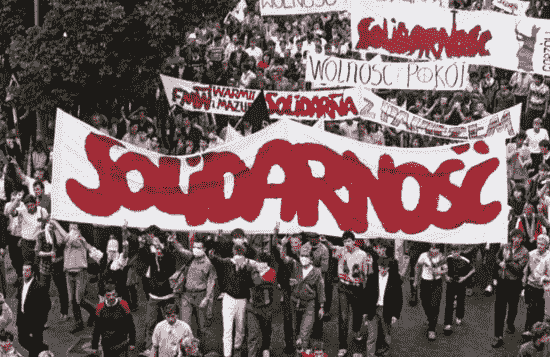
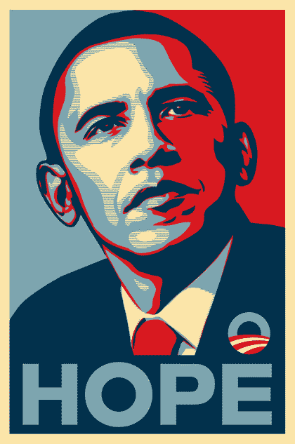
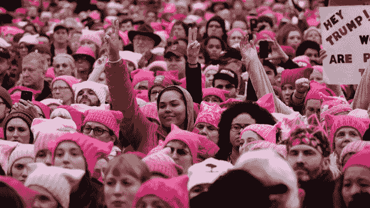
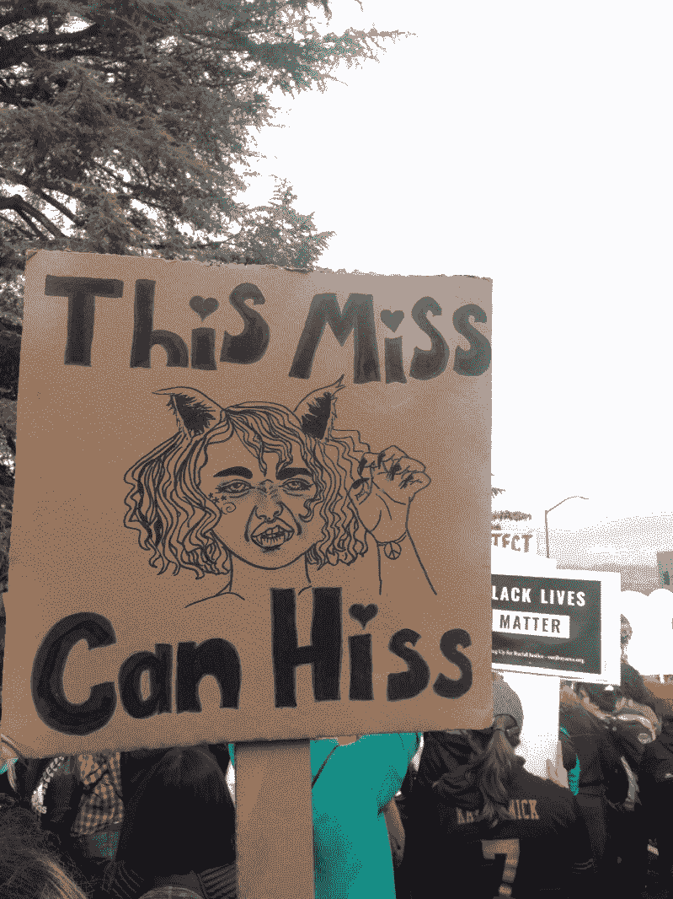
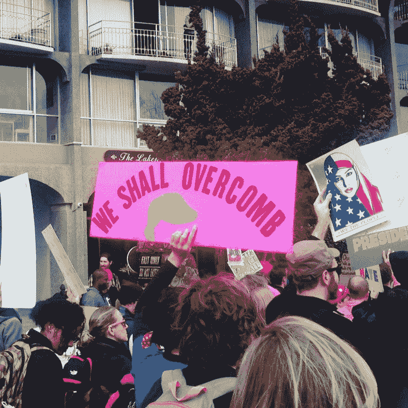
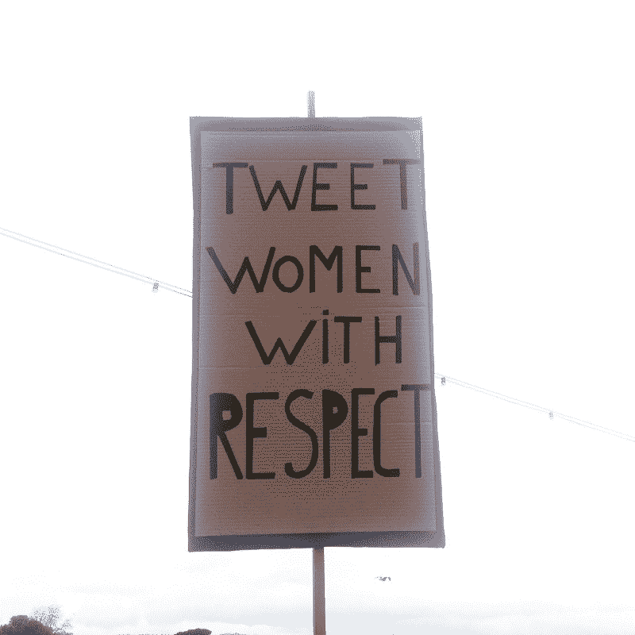
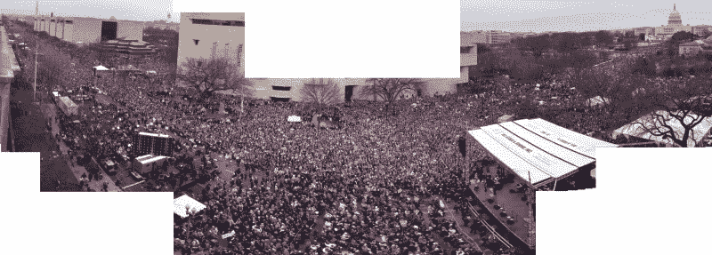
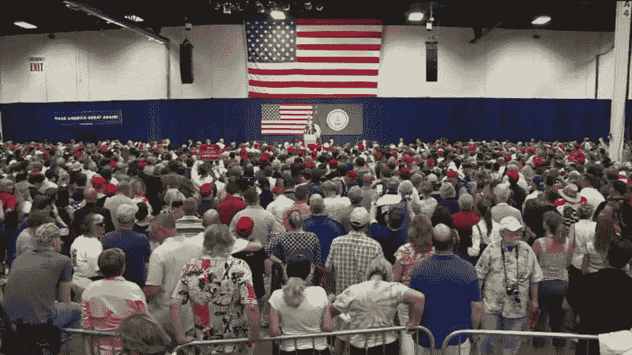

# 政治运动的设计

> 原文：<https://www.freecodecamp.org/news/the-design-of-political-movements-243b1329d242/>

作者 Lukasz Lysakowski

# 政治运动的设计

作为设计师，我们可以运用我们的技能来影响公众舆论，并最终影响政治变革。

本文将通过**品牌**、**产品设计**和**平面设计**探索设计师在过去产生影响的一些方式。

### **品牌化**

品牌是一个强大的工具。品牌是对共同价值观的承诺。它通过来自许多人的统一信息将不同的人团结成一个整体。作为设计师，我们可以借我们的技能来定义身份和品牌的变化。

#### [**Solidarnosc**](https://en.wikipedia.org/wiki/Solidarity_(Polish_trade_union))

在共产主义波兰时期，品牌是团结运动的核心，成立于 1980 年，当时是为了争取工人权利。

从罢工开始，设计师 Jerzy Janiszewski 就想把标语和标志的大杂烩结合起来。一位诗人向他建议了一句简单的格言“[团结工会](http://washington.mfa.gov.pl/en/bilateral_cooperation/press/newsletter/interviews/janiszewski)耶日回家后，只尝试了三次，就创作出了这个标志，从而给这场运动打上了烙印。

Photo from [Encyclopædia Britannica](https://www.britannica.com/editor/The-Editors-of-Encyclopdia-Britannica/4419)

这个标志和座右铭成为许多波兰抗议运动的共同标志。这种简单的标识非常具有表现力，以至于今天仍能引起共鸣。

Obama Hope Poster from the [Obey website](https://obeygiant.com/obama-hope/)

#### [奥巴马希望海报](https://en.wikipedia.org/wiki/Barack_Obama_%22Hope%22_poster)

奥巴马希望海报是谢泼德·费尔雷的标志性设计。这张海报最初是一个非官方的图像。其图形的大胆与清晰的信息“希望”交织在一起，使图像令人难忘。

该图像开始是一个有限的附加海报，但它很快传播到大众市场的印刷品，t 恤和更多的随身用品。它的病毒式传播导致它成为奥巴马 2008 年大选最常见的代表。这个设计如此成功，以至于产生了一种模仿和模仿变体的亚文化。

Photo from [Pussy Hat Project](https://www.pussyhatproject.com)

#### [**《女子进行曲》和《娘娘腔帽子》**](https://www.womensmarch.com)

妇女游行是 2017 年 1 月 21 日在全球范围内举行的草根抗议活动。这是一次有 500 万人参加的全球游行。据估计，美国有 400 万人加入。

游行是为了支持人权，作为对新行政当局的异议之声。这也是人们表达创造力和异议的自发示威。

Photos from Oakland Women’s March

pussy hat 项目是妇女游行的一个独立的基层项目。目标是创造一个低成本的独特的视觉声明，在游行中创造团结。阴道帽是一种强有力的策略，因为它将女性气质的许多方面结合成一种抗议的象征。粉红色与女性特质联系在一起。

Composite image of Women’s March by [Joe Ward at NYTimes](https://www.nytimes.com/interactive/2017/01/22/us/politics/womens-march-trump-crowd-estimates.html) based on video from Urdu Voice of America

传统上，编织是女人的手艺。这也是一项合作活动，妇女们以小组的形式一起编织。这顶帽子的名称和设计是对女性生殖器的贬义词的一种发挥。Pussy Hat 是一个有趣的颠覆性设计的例子，是一个强大的品牌。

#### 让美国再次伟大的卡车司机帽

#MAGA cap 是一个强势品牌。帽子和标志比看上去更复杂。卡车司机帽是部落的标志。一个由农民和卡车司机组成的美国农村的怀旧标识。你怎么能错过大声喊着“让美国再次伟大”的纯红白色帽子呢？

[A sea of red caps at a Trump rally in Fredericksburg](http://wtvr.com/2016/08/20/donald-trump-fredericksburg-rally-video/)

排版故意不复杂。是一个任何人都可以用 [MS Word](http://www.latimes.com/entertainment/arts/miranda/la-ca-cam-anger-donald-trump-make-america-great-again-hat-20160706-snap-story.html) 打出来的 logo。字体或者是[时代新罗马](http://www.dafont.com/forum/read/234166/donald-trump-make-america-great-again-hat-font)或者是[新世纪教科书](https://www.myfonts.com/WhatTheFont/forum/case/1019796/)。MAGA 帽看起来像是一件俗气的遗物。相反，这是一个不容错过的刻意认同。帽子是一种徽章。

### 产品设计

选举还导致了新一波应用程序和网站的推出。对选举不满的技术人员将这些服务作为夜间和周末项目来开发。作为设计师，我们可以利用我们在研究、交互和 UI 设计方面的专业知识，为变革提供更多服务。

#### [5 次通话](https://5calls.org)

这是作为一个网站推出的，以简化发现立法问题和与你的立法机构联系。你只需输入你的邮政编码，作为回报，网站会提供电话号码和脚本。

给你的代表打电话是让别人听到你声音的有效方式。我在上下班途中打了 5 个电话，并且能够挤出时间打几个电话。

[**5 通话**](https://5calls.org)
[*花费 5 分钟。打 5 个电话。让别人听到你的声音。*5calls.org](https://5calls.org)

#### [第一个 100 天](https://www.track-trump.com)

由 Y Combinator 总裁 Sam Altman 与 Alec Baum、Peter Federman 和 Gregory Koberger 共同创建的网站。该项目是一个实时仪表板，跟踪特朗普上任头 100 天的行动和政策。Melissa Cameron 一幅幅精彩的插图。

[**前 100 天**](https://www.track-trump.com)
[*我们将跟踪唐纳德·特朗普承诺的履行情况，并在最初的 100 天内每天更新。*www.track-trump.com](https://www.track-trump.com)

#### [和伟大的人在一起](https://greatcompany.org)

Y Combinator 合伙人丹尼尔·格罗斯的周末项目。该网站记录了公司对特朗普政府的公开立场。基于他们的立场，你可以选择支持或不支持该公司。

[**伟大的公司**](https://greatcompany.org)
[*了解贵公司对近期政策事件的看法。*greatcompany.org](https://greatcompany.org)

#### [可数的](https://www.countable.us)

用一个工具了解国会立法并让人们听到你的声音。有了 Countable 的服务，你可以了解即将到来的立法，跟踪投票，并发送反馈。它由两位前科技初创公司联合创始人于 2013 年推出，其相关性并未减弱。

[**可数——联系国会，在 App Store 上投票表决议案**](https://itunes.apple.com/us/app/countable-government-made/id893853823?mt=8)
[*我们无法在你的电脑上找到 iTunes。下载免费应用程序 Countable -联系国会并投票表决议案…*itunes.apple.com](https://itunes.apple.com/us/app/countable-government-made/id893853823?mt=8)

### 装帧设计艺术

平面设计也是一种强大的交流工具。清晰简洁的视觉设计对于让人们听到你的信息至关重要。图形设计师可以借他们的技能，使这些沟通的努力响亮而清晰。

#### [只有你能阻止所有的事实](https://cottonbureau.com/products/only-you-can-prevent-alt-facts)

受国家公园基金会 alt 媒体账户启发的图形球座设计。设计师 Matthew Spiel 创作了一部关于熊 Smokey 身份的戏剧，作为图形手段来表示对抵抗运动和我们国家公园的支持。

所有的 t 恤都是在棉花局印刷的，收入捐给国家森林服务局。总共售出了 8，848 件衬衫，这是一次成功的宣传活动。

[**【只有你能阻止】事实由马修·斯皮尔**](https://cottonbureau.com/products/only-you-can-prevent-alt-facts)
[*图形球座设计师所得收益归国家公园基金会和国家森林基金会所有。还有……*cottonbureau.com](https://cottonbureau.com/products/only-you-can-prevent-alt-facts)

#### [不可分割的](https://www.indivisibleguide.com)

前国会工作人员编写的抵制特朗普议程指南。《不可分割》是让国会倾听的最佳实践指南。材料的美感。

不可分割是美学上的美丽，并注意到一致性和图形设计，这有助于它沟通信任。

[**不可分割:抵制川普议程实用指南**](https://www.indivisibleguide.com)
[*前国会工作人员透露让国会倾听的最佳做法。*www.indivisibleguide.com](https://www.indivisibleguide.com)

#### [bymariandrew](https://www.instagram.com/bymariandrew/)

一个展示关心和反抗的个人项目。不是所有的项目都需要一个小组。相反，我们可以找到我们自己的声音，并用我们自己的设计项目来引导它。Instagram 艺术家玛丽·安德鲁(Mari Andrew)将她的日常生活插图与反对派插图混合在一起。这张专辑让她拥有了一大批追随者，也让更多的观众了解了她的想法。

[**反抗会图文并茂**](https://thinkprogress.org/the-resistance-will-be-illustrated-f23c4db1da2d)
[*Instagram 艺术家玛丽·安德鲁(Mari Andrew)谈感同身受，谈政治，同时关心流行文化和时事。*thinkprogress.org](https://thinkprogress.org/the-resistance-will-be-illustrated-f23c4db1da2d)

### 作为设计师你能做什么？

作为设计师，你能做些什么来带来改变？首先，你可以深呼吸。你应该试着找到你相信的问题(你不可能解决所有问题)。

你可以发现你关心的立法，并打电话给你的国会代表。你也可以找到需要你技能的个人和组织。这样，你可以用你的技能来履行你的公民义务，改变我们的政府和社会。

### 附加阅读

关于科技工作者应对和创造公民变革的进一步阅读。

在艰难时期保持高效
[*这是我的邮件列表中第一次发布的——窥镜。每周，我都会回答一个读者的问题。*medium.com](https://medium.com/the-year-of-the-looking-glass/staying-productive-during-rough-times-fca751cc40c6)[**科技抵制觉醒**](https://backchannel.com/the-tech-resistance-awakens-7de14850579f)
[*硅谷员工正在成为一个强大的反特朗普活动家群体。他们能有所作为吗？*backchannel.com](https://backchannel.com/the-tech-resistance-awakens-7de14850579f)