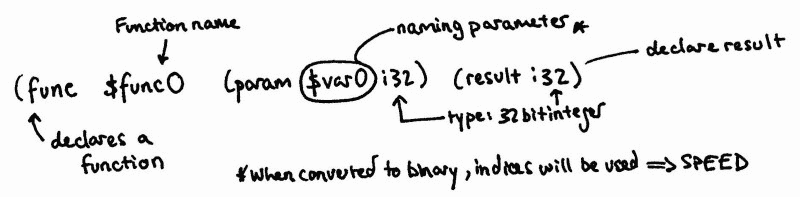

# web 组件的设计

> 原文：<https://www.freecodecamp.org/news/the-design-of-webassembly-81f1dcabaddd/>

帕特里克·费里斯

# web 组件的设计

Photo by [Émile Perron](https://unsplash.com/photos/xrVDYZRGdw4?utm_source=unsplash&utm_medium=referral&utm_content=creditCopyText) on [Unsplash](https://unsplash.com/search/photos/web?utm_source=unsplash&utm_medium=referral&utm_content=creditCopyText)

我喜欢网络。它是现代信息传播和个人赋权的超级大国。当然，它也有不利的一面，比如网络钓鱼(很大程度上可能是通过匿名)和隐私问题，更不用说所有权和侵犯版权的问题，这些问题将随着高度分裂的第 13 条而生效。但是，让我们暂时忘记这一点，惊叹于互联网的技术创新和支持它的浏览器。

我第一次学习用 Javascript 编码，因为喜欢它而被许多人嘲笑。是的，我知道有像这个宝石一样的[怪异的](https://github.com/denysdovhan/wtfjs)比特:`[] == ![] // true`但是由于互联网、浏览器和运行代码的解释器(仅举几个例子，[谷歌的 V8](https://v8.dev/) 和[火狐的蜘蛛猴](https://developer.mozilla.org/en-US/docs/Mozilla/Projects/SpiderMonkey))，它已经成为这个星球上最普遍的语言之一。

随着我对 web 开发的深入了解，我注意到了一个新名字:WebAssembly。作为一名计算机科学学生和开发人员，我相信学习的最好方法之一是尝试并理解为什么建造它的工程师会做出那些设计选择。所以这里简单介绍一下 WebAssembly 中一些有趣的设计原则，以及为什么我认为每个人都应该感到兴奋。

#### 为什么我们需要 WebAssembly？

好的，首先，我要告诉所有的 Javascript 爱好者——不，你们不应该担心。当 Javascript 第一次出现时，它被设计成以一种轻量级的方式使用，但是从那以后，它开始做很多繁重的工作。也许它被用于操作一些 DOM 元素，一些表单中的客户端验证，但不是现在试图在 web 上做的所有事情。当然不是运行完全成熟的游戏。

为什么 Javascript 没有那么快或者很棒？主要原因之一是因为它是一种解释型语言。逐行扫描代码并执行，幸运的是有了即时编译器，效率大大提高了，但仍然只有这么大的改进空间。但是即使这样，Javascript 的动态类型问题也会导致另一个性能上限

Alex Danilo 在 2017 年的谷歌 I/O 演讲中讨论了 WebAssembly 可能带来的改进。真正让人们认识到低效的是他的示例`add(a, b)`函数以及 Javascript 解释器为了理解它而必须经历的复杂性。

A simple Javascript function — [ECMAScript Rabbit Hole p.263](https://www.ecma-international.org/publications/files/ECMA-ST/Ecma-262.pdf) (be sure to follow the links of the other function calls)

WebAssembly 打开了编译的大门，也打开了优化的另一扇门。它获取 C/C++源语言的能力允许它做一些静态类型检查，这有助于提高速度。这就是 Mozilla 基金会的开发者意识到并想要解决的问题。总结一下这个[伟大的视频](https://www.youtube.com/watch?time_continue=3&v=o52_5qAJhNg)，Javascript 是为人类设计的，浏览器只能尝试让它变得更快；WebAssembly 被设计为浏览器已经可以快速运行的编译器的目标语言。

意识到我们可以在引擎中运行两种代码选择是一个令人兴奋的前景——四大浏览器(Chrome、Safari、Firefox 和 IE)都开始计划让他们的引擎运行 Javascript 和 WebAssembly。让我再次重申… WebAssembly 是**而不是**取代 Javascript。

#### 为什么要编译代码？

编译代码实际上意味着从一种(源)语言中提取代码，并将其翻译成另一种(目标)语言。这是对编译难以置信的简化理解。大多数现代编译管道涉及更多阶段，允许我们真正微调和优化我们的代码，使其更快、更节能。

第一步通常包括词法、句法和语义分析器，以将代码转换成某种非常适合优化的中间语言。然后我们独立优化，生成目标代码，然后可能根据硬件或环境进行优化。

所有项目都需要从小处着手，Mozilla 的工程师们决定从他们的源语言 C/C++开始，并使用他们将使用的名为 [LLVM](https://llvm.org/) (不是首字母缩写)的现有工具链进行编译。

最初，对性能更好的 web 的探索始于`[asm.js](http://asmjs.org/spec/latest/)`(至少在 WebAssembly 的叙述中是这样。参见[PNaCL](https://developer.chrome.com/native-client)——谷歌的早期尝试)Javascript 的一个小子集，可以作为 C/C++程序的编译目标，这些程序使用注释和其他巧妙的技巧来提高 Javascript 的性能。

不幸的是，它缺少一个关键的设计原则:便携性。不同的 Javascript 引擎给出了不同的性能评价，但这清楚地表明这可能是一个好方法。

WebAssembly 的开发人员决定他们的目标表示将是一种二进制格式，它提供了抽象语法的"[密集的线性编码……这是一个很大的单词量，所以让我们打开它。](https://webassembly.github.io/spec/core/binary/conventions.html)

“密集”部分指的是实现大小和加载时间高效格式的[高级目标](https://webassembly.org/docs/high-level-goals/)。互联网就是通过电线发送数据，虽然有很多项目来改善这种延迟，但实现这一点的一个简单方法是发送更少的数据。另一个重要的方面是由于数组索引比字典查找(如果他们使用压缩文本格式)更快的解码速度。点击阅读更多关于这个设计选择[的信息。](https://webassembly.org/docs/rationale/#why-a-binary-encoding)

#### 水是什么？

C 和 C++程序编译成的二进制格式是`.wasm`文件，它们与(某种程度上)人类可读的文本格式有 1:1 的映射。这些文件被标记为`.wat`，这个 [WasmExplorer](https://mbebenita.github.io/WasmExplorer/) 非常适合让你了解文本表示以及它与原始代码的关系。我们举个简单的例子。

这里发生了很多事情，所以让我们慢慢来，并在概念出现时解释它们。

首先，有一个奇怪的词，它是从哪里来的？[梅金·李乔](https://www.youtube.com/watch?v=Th-Z6le3bHA)就 Javascript 中的模块做了一个精彩的演讲，并将其描述为给代码“结构和边界”。这与 WebAssembly 模块的想法非常相似(并且未来有计划尝试与 es6 模块集成)。

直接从文档中，我们知道模块是 WebAssembly 中的“[可分发、可加载和可执行的代码单元”。模块可以包含以下部分，每个部分都有自己独特的职责:导入、导出、开始、全局、内存、数据、表格、元素、函数和代码。现在，让我们看看我们模块中的内容。](https://webassembly.org/docs/modules/)

第一个声明是`(type $type0 (func (param i32) (result i32)))`。这与下一行的表调用密切相关。我们用`func`签名声明一个新类型，它接受一个 32 位整数参数并返回一个 32 位整数。如果我们要再次使用我们编写的函数，我们必须在我们的`table`中加入一个`call_indirect`，然后我们可以做一些类型检查以确保一切都是正确的。作为最小可行产品的一部分，只允许有一个表，但是将来计划允许有多个表，并为这些表建立索引。

下一个宣言是`(table 0 anyfunc)`。table 部分保留用于定义零个或多个表。表类似于线性存储器，因为它们是包含引用的可调整大小的数组。`0`表示我们的表中什么都没有，但是我们仍然需要提供 MVP 唯一可能的值`anyfunc`(一个函数)。

开发人员遇到的问题与安全性有关。如果一个函数想要调用另一个函数，让它直接访问存储在线性内存中的函数是不安全的。相反，函数存储在表中，以便在需要时进行索引。Lin Clark 写了一篇很棒的[文章](https://hacks.mozilla.org/2017/07/webassembly-table-imports-what-are-they/)更详细地描述了表(用于导入)以及它们如何提供更好的安全性。

然后我们有一个`(memory 1)`的声明，这是模块使用的线性内存，我们声明我们需要[内存(64kb)](https://webassembly.org/docs/semantics/#linear-memory)的`1`页。

下一个宣言是`(export "memory" memory)`。导出是在实例化时返回给主机的东西。基本上，我们想从 WebAssembly 代码中得到的酷的部分。

结构相当简单`(export <name-of-export> (<type> &l`t；name/index >))所以这里我们只是导出我们在前一行声明的内存。这允许在我们的 Javas `cript code,`中作为数组缓冲区直接访问内存，这极大地提高了效率，因为没有跨越 WASM/JS 边界的来回调用。类似地，我们然后导出`our function with (exp` ort "main" $func0)。

现在到了稍微有趣一点的部分，我们的代码和它的表示。

The different parts of the function declaration in WebAssembly Text Format

在继续之前，这是介绍另一个设计组件的绝佳机会:堆垛机。

#### 寄存器与堆栈机器

最简单地说，计算机消耗输入并产生输出。当“机器”执行程序时，它可以用多种不同的方式来完成。两种主要的方法是寄存器和栈机器。在寄存器机器中，函数的参数保存在内存位置，然后根据执行中的程序进行操作。

一个简单但有些缺陷的类比可能是厨房和制作食谱。这些原料被储存在不同的地方，你得到它们并做一些你可能会放在某个地方一天或立即消费的东西(好吃)。它远非完美，但希望你能明白。

另一方面，堆叠机器采用不同的模型。想象你是一名记者或秘书，你的工作是阅读和回复信件。你从你的信堆中“弹出”第一封信并开始写回复，而其他人则带来更多的工作并“推到”堆的顶部。这些是你接下来要做的。再次，非常简单，但它应该有助于可视化的机制。

WebAssembly 使用堆栈机器模型来执行代码。如果你缺少一些好的读物，并且对编程语义感兴趣，那么“[用 WebAssembly](https://people.mpi-sws.org/~rossberg/papers/Haas,%20Rossberg,%20Schuff,%20Titzer,%20Gohman,%20Wagner,%20Zakai,%20Bastien,%20Holman%20-%20Bringing%20the%20Web%20up%20to%20Speed%20with%20WebAssembly.pdf) 加快 Web 速度”这篇文章非常不错。这也表明了他们为什么选择栈机器表示:“栈组织仅仅是实现紧凑程序表示的一种方式，因为它已经被证明比寄存器机器小”参考[这篇论文](http://delivery.acm.org/10.1145/1330000/1328197/a21-shi.pdf?ip=131.111.184.4&id=1328197&acc=OPEN&key=BF07A2EE685417C5%2E6CDC43D2A5950A53%2E4D4702B0C3E38B35%2E6D218144511F3437&__acm__=1547647308_6631c4fb74b2b8d18427168494ccc927)发现“……寄存器机器的字节码大小只比对应的栈机器大 26%”。

尽管栈机器方法不一定更快，但它提供了更小的字节码；对于基于互联网的交易来说，这是一个非常重要的设计目标。

那么我们如何将文本格式理解为一个堆栈机器呢？当我们一行一行地读代码时，我们最终将参数压入堆栈，然后弹出它们，进行一些计算，并将结果压回。并重复。

A small example of WebAssembly and the implicit stack machine approach

起初，拥有文本格式似乎有点奇怪，如果最终它会被编译成二进制格式进行压缩。但是，互联网一直有查看源代码的政策，这就是 WebAssembly 背后的开发人员开发文本格式的原因。为了更进一步，避免语法冲突，他们使用了类似 Lisp 的 s 表达式风格。

#### 安全和沙盒

不安全语言中错误(和漏洞)的最大来源之一是缓冲区溢出。C 和 C++几乎可以互换，这也是你学习这些语言的第一步。作为一点开销成本的交换，WebAssembly 通过强制使用固定大小的索引内存(尽管某些内存可以增长)来增加这个安全网。

我们函数的局部变量，例如`$var0`，不是通过地址来引用的，而是通过索引来提供一层安全性。访问是通过`get_local`和`set_local`命令授权的，这一切都发生在局部变量的索引空间内。

设计 WebAssembly 时，内存安全是重中之重。直接来自文档:“[线性内存是沙箱化的](https://github.com/WebAssembly/design/blob/master/Semantics.md#linear-memory)；它不会混淆其他线性存储器、执行引擎的内部数据结构、执行堆栈、局部变量或其他进程存储器。”林毅夫再次写了一篇很棒的文章[来描述这个](https://hacks.mozilla.org/2017/07/memory-in-webassembly-and-why-its-safer-than-you-think/)。

基本思想类似于 Javascript ArrayBuffer 对象——可调整大小和绑定检查。我们试图实现的是程序隔离，以防止错误和恶意代码传播和破坏它甚至不应该访问的数据。

#### WebAssembly 能做什么？

WebAssembly 的一个主要最终目标是彻底改变 web 上图形的可能性。经典的例子是 EpicGames 的[曾加登](https://s3.amazonaws.com/mozilla-games/ZenGarden/EpicZenGarden.html)和[坦克！](https://webassembly.org/demo/Tanks/)。

由于其设计，WebAssembly 标志着 web 开发的一个关键时刻。互联网的武库中有了一个新的工具来创造惊人的体验和分享信息。WebAssembly 提供了更小的代码规模、更快的执行速度、更高的安全性和更大的扩展空间。随着类似[线程](https://github.com/WebAssembly/threads/blob/master/proposals/threads/Overview.md)、单指令多数据( [SIMD](https://github.com/WebAssembly/simd/blob/master/proposals/simd/SIMD.md) )原语和零成本执行等想法的出现，WebAssembly 的能力看起来只会扩大。