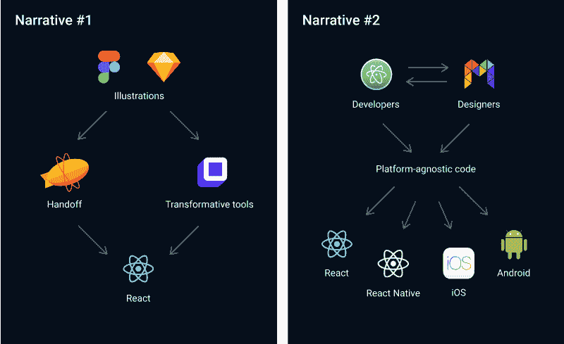
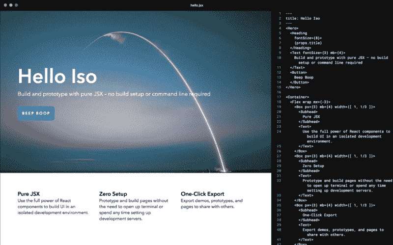
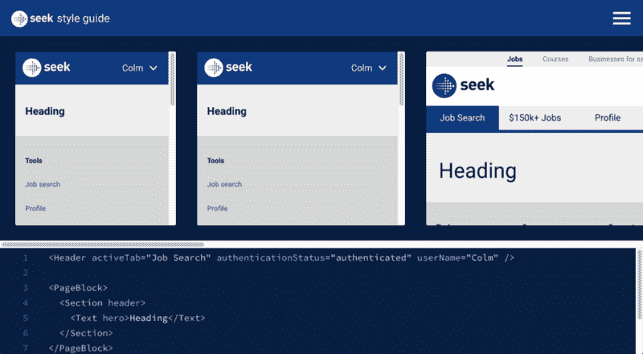
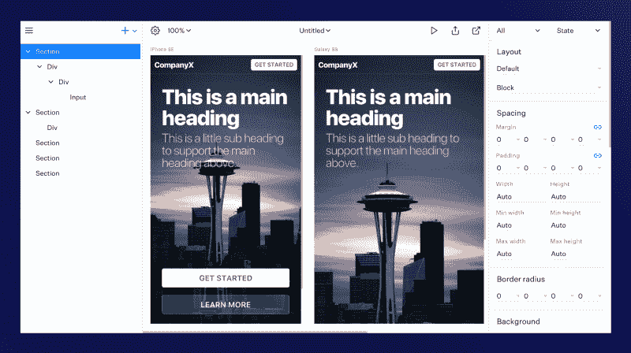
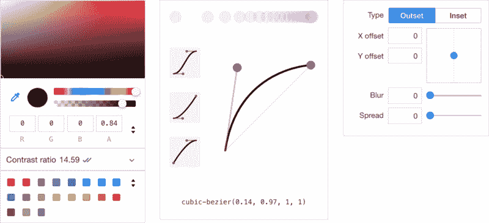
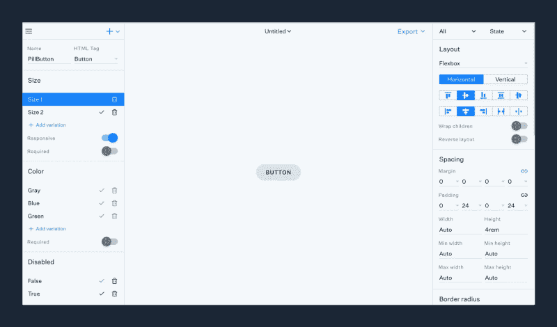

# 设计工具的困境

> 原文：<https://www.freecodecamp.org/news/the-design-tool-dilemma-225541c4ad1d/>

科尔姆·图伊特

# 设计工具的困境

#### 详细看看在设计工具领域出现的两种对立的叙述。

A diagram illustrating the two opposing narratives emerging in the design tool space.

在设计工具领域，有两种对立的说法已经发展了很多年。当谈到理解我们的工具提供的特定价值以及它们应该朝哪个方向发展时，这些叙述反映了两种非常不同的思想流派。

第一种说法是推销这样一种理念，即设计作品可以而且应该是产品真理的唯一来源。在这种叙述中，代码是次要的——它的工作是尽可能精确地再现设计作品。为了速度和无限的创造力，平台的限制被忽略了。

让我们称之为“**弥合差距**”的叙述。

第二种说法的中心思想是，在一个产品上合作的每个人都可以而且应该为同一个产品做出贡献。在这种叙述中，代码就是一切——它**是** 的产品。平台约束得到尊重和理解。决策是在上下文中做出的，工具包含了它们的目标媒介。

我们称之为“**协作**叙事。

那么这些叙述是从哪里来的呢？每一个有多大意义？让我们仔细看看。

### 叙述 1:弥合差距

自从数字设计师使用设计工具以来，我们就一直有一种强烈的愿望，那就是在生产中实现我们的想法。拥有从想法到部署的设计过程一直是圣杯。如果你看看我们设计工具的进化时间表，你会发现这种渴望正在显现。

大约在 2005 年，当我的数字设计生涯开始时，我们大多数人都在使用 Illustrator 或 Photoshop 为我们正在设计的任何产品创建基于矢量的插图。这种情况持续了很多年——大多数设计职位都要求熟练使用 Adobe 的创意套件。

直到 2010 年的某一天，Sketch 来了，摇了摇树。素描更简单，更便宜，也更专注。当然，设计师们一开始反对它，但最终发现它干净的用户界面和精致的功能集令人耳目一新。

最近，菲格玛来了。菲格玛详述了素描引发的革命。功能集很像，但是在执行上，我觉得不太接近。几乎每一个功能都实现得出奇的好。甚至好得惊人。

原型工具增加了一层额外的真实感——拍摄我们的设计工具导出的静态图片并将它们拼接在一起，模拟触摸事件和屏幕过渡。

但是在设计和开发工作流程之间仍然有一个明显的鸿沟需要弥合。我们如何采取下一步行动？

当然是有争议的“开发者交接”。[视觉](https://www.invisionapp.com/feature/inspect)和[摘要](https://www.goabstract.com/blog/introducing-inspect-where-the-file-is-the-design-spec/)展开“视察”。 [Avocode](https://avocode.com) 、[漫威](https://marvelapp.com/features/handoff/)和[泽普林](https://zeplin.io/)发布“切换”。Figma 和 Sketch 试图导出 CSS。这个想法是，当设计师有值得分享的东西时，他们可以把他们的工作以开发者理解的方式交给开发者。

这条时间线上最近的一个缺口是一种新型工具，它有望将静态图片转换成生产代码。[超新星工作室](https://supernova.studio/)、 [Rapid UI](https://rapidui.io/) 、 [PageDraw](https://pagedraw.io/) 、 [Teleport](https://teleporthq.io/) 、 [Sketch2React](https://sketch2react.io/) 和 [Anima Launchpad](https://launchpad.animaapp.com/) 只是引领这场冲锋的少数几家创业公司。

乍一看，你可能不会注意到这个时间线有什么异常。正如人们可能预料的那样，我们的工具一直在成倍地改进。它们变得更高性能、更健壮、功能更丰富。如果你把你的展望局限在过去的 10 年，这一切看起来都像是一个自然的过程。

但是再往回走一点，你会注意到一些非常奇怪的事情。

让我们暂时回到印刷是营销传播的主要形式的时代。那是一段简单的时光。关于工具或框架的无休止的争论被保持在最低限度。偶尔，一些暴发户会提到 QuarkXPress，但这种反叛并没有持续很久。大多数专业设计人员使用 Illustrator、Photoshop 和 InDesign。土坯主宰一切，仅此而已。

不过，最值得注意的是，设计师设计的是最终产品，而不是仿制品——最终产品是文具、海报、书籍、品牌标识、小册子和其他印刷材料。设计师对他们设计的产品有直接的影响。

这是可能的，因为印刷设计师已经(并且仍然)很好地掌握了他们设计的媒介。投入和产出制约因素之间有着密切的关联。

例如，印刷设计师知道，在厚卡片上复制颜色与在较轻的 120gsm 信笺上复制颜色会有细微的差别。设计师负责添加 3 毫米出血和修剪标记，以适应打印机校准的不准确性。设计师们知道周转时间——他们知道像凹陷或烫印这样的花哨效果复制起来成本更高。

特别是当数字印刷革命到来时，许多设计师开始投入时间和金钱，尽可能多地了解印刷媒体。印刷设计软件拥抱媒体并迎合它。

然后在某个时候，网页设计成为主要焦点，数百万印刷设计师一夜之间成为网页设计师。

我并不反对这种焦点的转移。我自己完成了从印刷到数字的转变。平面设计师学习的许多技能可以转移到其他行业，我喜欢看到人们扩展他们的视野。

问题是我们现在对我们设计的新媒体知之甚少。我们没有花时间去理解这种新媒体，而是试图驯服它。当我们努力将所有东西都装进一个 960 像素的容器时，这一点变得很明显，我们将界面称为“页面”，并创造了像“宣传册网站”这样的术语。

大多数设计师不会写代码，所以我们做了力所能及的事情:画图。为了做到这一点，我们使用了几十年前对我们很有用的东西:我们的图形设计软件。

设计师不再设计最终产品，而是设计其仿制品。

这种模式的转变在很长一段时间内都没有得到解决，因为基于图像的设计仍然是网页设计中非常重要的一部分。你们中的许多人会天真地记得创建巨大的精灵表来破解效果，如渐变和圆角。有人要翻转按钮吗？

然而，快进到今天，基于图像的黑客已经完全被 CSS 取代了。甚至光栅图像作为一种交流形式的使用也逐渐被更具性能和/或更具沉浸感的资产所取代，如 CSS 动画、SVG 插图和视频。

今天，网络和印刷之间的关系就像网络和建筑之间的关系一样密切。

不幸的是，我们的工具适应得不够快。我们当前的数字设计工具在很大程度上是印刷设计工具的延伸。年轻的设计师正通过静态绘图工具的镜头热情地学习数字设计。

当然，已经有了一些令人印象深刻的进步，但在很大程度上，它们仍然只是为插图而优化的基于矢量的绘图工具。正因为如此，我们的工具缺乏做出明智设计决策所必需的上下文和细微差别。

### 叙述#2:合作

这种叙述并不鼓励绘制最终产品的仿制品，而是提倡获取代码并使其更容易消化，以便整个团队可以就此进行协作。

奇怪的是，这两种说法的起源可以追溯到大约同一时间。臭名昭著的所见即所得可视化代码编辑器 Adobe Dreamweaver 于 1997 年出现。Softpress Freeway 早一年在 1996 年问世，微软 Frontpage 甚至更早，在 1995 年，比 Photoshop 晚了 5 年，比 Sketch 早了 10 多年。

不幸的是，这些工具往往是一个障碍，而不是一个帮助。它们是为出口生产而优化的，这使得它们对于设计过程来说过于笨重。

渐渐地，包括我在内的一批设计师抛弃了 WYSIWYG 编辑器，转而使用一种限制较少的设计工具:文本编辑器。

在很长一段时间里，输入代码是非常艰难的。但是随着时间的推移，一个健康的工具生态系统开始围绕代码萌芽，大大降低了进入的门槛。今天，我们有基于代码的设计工具，它根本不需要任何编码知识。

让我们仔细看看迄今为止基于代码的设计工具的演变。

**代码格式化和语法突出显示**是专注于使代码更易理解的首批“工具”之一。运用颜色和结构提高了可读性和可浏览性。最近，像 T2 漂亮 T3 这样的工具已经实现了自动化。

预处理器和模板语言在 2006 年左右出现。Haml、Sass、LESS、CoffeeScript 和其他工具通过鼓励简洁、抽象一些视觉复杂性和自动化一些更常见的任务，进一步提高了代码的可管理性。

JSX 是由脸书开发的 JavaScript 语法扩展，看起来和之前的模板语言没什么不同。React 的组件 API 也有助于促进重用和抽象视觉复杂性，同样，有助于我们使代码更容易理解和访问。

最近，我们看到工具消除了进入的障碍，比如必须设置开发环境和修改命令行等等。合成器 ISO T1 和 T2 SEEK 的风格指南沙盒 T3 正在做一些惊人的工作。

Compositor ISO and SEEK Style Guide Sandbox, where you can prototype using JSX with no build setup required.

Modulz (我正在开发的一个设计工具)和 [UXPin](https://twitter.com/marcintreder/status/1011369055817588736) 也通过消除进入壁垒让代码变得更容易理解。这些工具将 JSX 可视化，使用熟悉的图层来表现它，并使用 GUI 来操作组件道具。

[Modulz](https://www.modulz.co/) — a code-based design tool for composing UI visually.

[Polypane](https://polypane.rocks/) 正在构建一个智能设计环境，您可以在其中跨多种浏览器、设备和视窗预览您的设计。工作流的另一个例子考虑了目标媒体的全部内容。

[Polypane](https://polypane.rocks/)—a smart web browser for responsive design and development.

这些可视化代码编辑器只是让代码更容易编写的下一步。所有这些创新都是有意义和可能的，因为前端开发的很大一部分本来就是可视化的。

剧透提示:我同意杰森的预测。浏览器开发工具已经开始向这个方向发展，提供图形用户界面来直观地操作 CSS 样式，如过渡、阴影和颜色。

A set of GUIs for manipulating code visually inside Google Chrome’s dev tools.

当然，浏览器开发工具对编译的代码进行操作，但是这些相同的可视化工具也可以应用于预编译的代码。[合成器实验室](https://compositor.io/lab/)和 [Modulz 编辑器](https://twitter.com/colmtuite/status/965146829716324352)使得可视化编辑 React 组件变得容易。

[Modulz Editor](https://twitter.com/colmtuite/status/954715289517805568)—a tool for designing React components visually.

Xcode 是一个被严重低估的工具——允许团队通过代码编辑和直接操作的组合来设计、开发、测试和调试他们的产品。

Airbnb 的 [Lona](https://github.com/airbnb/Lona) 是我见过的最有前途的可视化代码编辑器之一。Lona Studio 提供了一个图形界面，用于构建组件系统，从现有组件模拟新屏幕，用真实数据预览设计，尝试多种屏幕尺寸，以及**更多**功能。

同样的进展也可以在其他行业观察到，如游戏设计、音乐制作、建筑、视频编辑等。其中， [Maya](https://www.autodesk.eu/products/maya-lt/overview) ， [Unity](https://unity3d.com/) ， [Cubase](https://www.steinberg.net/en/products/cubase/cubase_pro.html) ， [Logic Pro](https://www.apple.com/lae/logic-pro/) 和 [Final Cut](https://www.apple.com/lae/final-cut-pro/) 都提供了直接操纵的工具，因此整个团队可以在同一款产品上进行协作。

虽然这些工具在不同的抽象层次上发挥作用，但它们都有相同的目标:让代码更易理解、更易管理、更直观，并且更容易被更多的人理解。

尽管这些工具看起来非常不同，但其基本概念是不变的。没有根本性的范式转变。没有重复工作。没有白费力气。没有假模拟，也没有不准确的效果图。其中不乏脉络。只有许多形式的代码。

通过继续这样的叙述，我们可以让 UI 设计师面对我们所设计的媒介的现实，同时隐藏所有不相关的复杂性，使我们能够做出明智的设计决策。

### 进退两难

设计团队、公司和投资者投入了大量的时间和金钱来支持一个破碎的设计过程:传统的基于图像的工作流程。

整个行业都建立在这个摇摇欲坠的基础上:绘制图片的工具，给图片添加交互的工具，给图片版本的工具，存储图片的工具，从图片中提取数据的工具。他们每个人都试图让这些静态模拟看起来更像真实的产品——好像通过在模拟之上分层模拟，我们可以以某种方式弥合矢量图形和交互软件之间不可能的距离。

今天，我们的数字产品正在采用越来越复杂的技术:微交互、动画、AR、VR、语音输入、音频输出、视频、多像素密度、无限视口维度、亮度检测等。随着设计师继续探索这些新领域，基于矢量的绘图工具将继续暴露其缺点。

考虑一下设计领域在未来五年可能会发生怎样的变化。这些故事将如何发展？为了得到一个准确的感觉，我认为最好回到基础，问自己一些棘手的问题。

今天设计数码产品意味着什么？设计工具应该加速、自动化或简化设计的哪些方面？

我仍然记得我一直最喜欢的设计师之一丽贝卡·考克斯(Rebekah Cox)早期在 Quora 如何定义[产品设计的含义。](http://www.artypapers.com/ap.log/thread.php?346)

> “用户界面是设计的产物。设计是关于特定产品的一系列决策。”—丽贝卡·考克斯

自从我第一次读到这个设计的定义已经过去了将近十年，但是它一直伴随着我。这是我第一次明白界面是设计的结果，而不是设计本身。设计是导致产品产生的一系列决策。

那么，如果设计是一系列决策，那么哪些决策会被用于设计当今的数字产品呢？这是我想到的一个小例子:

*   当一个按钮被悬停、按下、聚焦或禁用时应该如何表现？
*   当没有数据填充时，这个 UI 应该如何表现？
*   当填充了非常长的数据字符串时，这个 UI 将如何处理？
*   当跳转时，元素应该以什么顺序获得焦点？
*   是否应该有键盘快捷键可以与这个 UI 交互？
*   应该有任何语音命令可以与这个 UI 交互吗？
*   与此 UI 交互时是否应该播放声音？
*   这种颜色或字体如何在所有最常见的浏览器、浏览器版本和操作系统组合中呈现？
*   我对这个按钮组件所做的微小改变会对产品的其他部分产生什么影响？
*   当 x 组件的数据尚未加载时，它应该如何表现？
*   当加载数据时，x 组件应该如何表现？
*   这种布局应该如何适应 web 的无限可能的视图尺寸、纵横比和像素密度？

这些是数码产品设计师每天都要考虑的决定。我们不仅要做出这些决定，还要测试它们，仔细检查它们，交流它们，并推销它们。

但是这种微妙的产品决策无法在向量集合中被捕获，即使交互在顶层。

早些时候，我提到“开发人员交接”是有争议的。我想说的是:考虑到两种媒介之间的巨大差异，大力提倡的从静态模型到代码的工作流程没有什么意义。

“开发者换手”的问题不在名字上。也不是执行中的问题。甚至设计师把他们的作品放在生产线上的想法在概念上也是合理的。

问题是没有什么有用的东西可以“转手”。从向量中获取信息并不困难。说实话，反正大部分都没用。在中获取必要的信息**是一个挑战。这就是基于矢量的绘图工具不太适合 UI 设计的原因。矢量图形在物理上无法保存充分告知数字产品设计所需的信息。**

但是，即使我们能够以某种方式将这些决策打包到矢量图形中，插图工具也不能提供一个有利于对数字产品做出关键决策的环境。在一个缺乏你所设计的媒介背景的环境中，你无法做出明智的产品设计决策。

这些决定了数字产品的成败。如果你想成为做这些决定的人，你必须熟悉你的产品将存在的许多环境。

> “生产代码是决策权的替代品。生产代码是真理的源泉。它是所有对话、所有决定、所有政治的实时总和…它是一切。将代码推向生产的人就是在运行产品。其他人只有影响力。”—丽贝卡·考克斯

丽贝卡提出，最有决策权的人是那些最接近准则的人。

如果我们的设计工具要为我们提供与开发人员几十年来独享的产品影响力相同的水平，他们需要从过去破碎的工作流程中走出来，继续拥抱未来的交互媒体。

如果你对我正在开发的新设计工具 [Modulz](https://www.modulz.co/) 感兴趣，我们会定期在 [Twitter](https://twitter.com/Modulz) 上发布更新。如果你想谈论工具或系统，请随时通过电子邮件或 [Twitter](https://twitter.com/colmtuite) 联系我。

感谢 Dave Feldman、Adam Morse、Scott Raymond、Patrick Smith、Michael Le、Kilian Valkhof、David Tuite 和其他帮助编辑的人。