# 实践中开发人员的工作流程——我们如何在 30 天内构建我们的 MVP

> 原文：<https://www.freecodecamp.org/news/the-developers-workflow-in-practice-how-we-built-our-mvp-in-30-days-c60d804695a8/>

由列娜·福尔

# 实践中开发人员的工作流程——我们如何在 30 天内构建我们的 MVP

Photo by [Michał Grosicki](https://unsplash.com/photos/zPfn8ap8hTY?utm_source=unsplash&utm_medium=referral&utm_content=creditCopyText) on [Unsplash](https://unsplash.com/?utm_source=unsplash&utm_medium=referral&utm_content=creditCopyText)

作为一名 web 开发人员，我经常从头开始项目，并为一系列元素做出决策，从技术堆栈到应用程序的最终外观和感觉。

尤其是当一个项目背后的风险很高时，这个过程可能会让人不知所措。

我想分享我们在巴黎市创业计划中一个月的经历，以及我们的团队为实现应用程序的第一个运行版本所采取的步骤。

首先介绍一下背景: [AlloAnim](http://alloanim.futur.paris/) 是一款网络应用，旨在帮助巴黎市立即找到可用的课后工作人员。

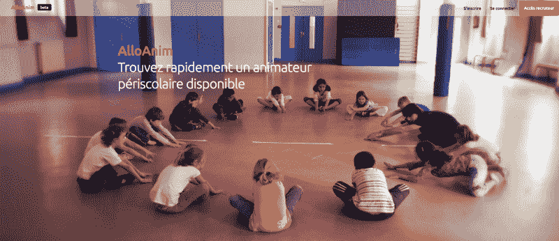

Our current Homepage for the first Sprint — Inspired from AirBnb while working on a new UI — Credit Sophie Robichon / Mairie de Paris

目标是让课后员工尽可能经常地创建和更新他们的个人资料和可用性。这将使巴黎市能够直接访问现有工作人员的实时更新数据库。

我们的团队由两个人组成。一位是产品负责人克里斯蒂安·博卡里。Christian 是在巴黎一所学校工作时发现这一棘手问题的人。

另一个是开发者(真正属于你的)，负责在 5 个月内构建全栈应用。

我们的总部位于开放创新社区实验室。我们与初创公司*vite unileu*合作，帮助组织在巴黎轻松找到会议室， [Jean Karinthi](https://www.freecodecamp.org/news/the-developers-workflow-in-practice-how-we-built-our-mvp-in-30-days-c60d804695a8/undefined) 担任产品负责人，[克里斯托夫·罗比拉德](https://www.freecodecamp.org/news/the-developers-workflow-in-practice-how-we-built-our-mvp-in-30-days-c60d804695a8/undefined)担任首席开发人员。

我们选择了后端的 Ruby on Rails 和前端的 vanilla(普通的，没有框架)JavaScript。

我们希望尽快集成 React，但是对于原型阶段，我们坚持使用好的旧 JavaScript。

那么我们是如何在一个月内从零开始创建一个工作产品的呢？以下是我们成功发布第一个版本的主要步骤。

### 1.拥抱敏捷精神

我们和一位教练一起工作了两天，学习敏捷开发的基础知识。

敏捷的主要好处是你必须与你的最终用户紧密合作。目标是根据他们提供的反馈迭代你的应用程序的每个版本。

这样你就不太可能构建人们不需要、不喜欢或者不知道如何使用的东西。

### 2.在现实生活中快速与用户见面

克里斯蒂安设法让我们很快与一所小学的课后工作人员的负责人进行了一次决定性的会面。

我们就她目前如何处理员工问题进行了一次有意义的谈话。我们了解了她在我们即将推出的网络工具中绝对需要的功能。

Credit Sophie Robichon / Mairie de Paris

事实证明，我们产品的痛点和需求确实存在。这足以让我们开始一个最小可行产品(MVP)。这是一个具有必要功能的产品版本，是我们产品的第一个可用版本。

### 3.编写用户故事

用户故事是一种让非技术产品所有者和开发人员能够很好地理解彼此的方式，让应用程序实现其目的。

它们写在模型上:“作为一个< type of user >，我可以< some goal >(这样< some reason >)”

因此，我们的一个简单用户故事的例子是:“作为课后工作人员的一员，我可以用我的个人信息创建一个档案”。

用户故事组合在一起形成一个故事地图，这是随着时间的推移构建应用程序的全局视觉计划。

然后，产品的开发周期被分成几个冲刺阶段。

每个 sprint 包含一定数量的用户故事，这些故事将被编码到功能中。

我们的第一个 sprint 通常包含一个可用的最小可行产品所需的所有用户故事。

在产品的每一次迭代中，故事地图和 sprints 的内容都可以自由改变。这通常与用户的反馈会议相一致。

当用户对开发的功能给出反馈时，用户故事会发展并适应应用的实际使用。

### 4.设置敏捷工作流程

我有幸与另一家初创公司的天才开发人员克里斯托夫·罗比拉德一起工作，他之前在 T2 政府初创公司项目中获得了敏捷工作流程和开发人员生产力方面的丰富经验。

#### 每日站立会议

从 Scrum 方法论来看，每日站立会议是在 sprint 的每一天举行的站立会议。我们每天早上都要交谈 5-15 分钟。如果我们在一起，我们就站着，如果我们远程工作，我们就打电话。

它有助于为第二天的工作设置背景，并致力于接下来必须解决的任务。

#### 开发积压

sprint backlog 通过放在任务板上变得可见，板上的每一行都是一个用户故事。较小的个人任务写在“卡片”上。

团队成员通过写新卡片或移动卡片，在整个冲刺过程中不断更新任务板。例如，可以将卡片从“待办事项”列移动到“正在做”列。

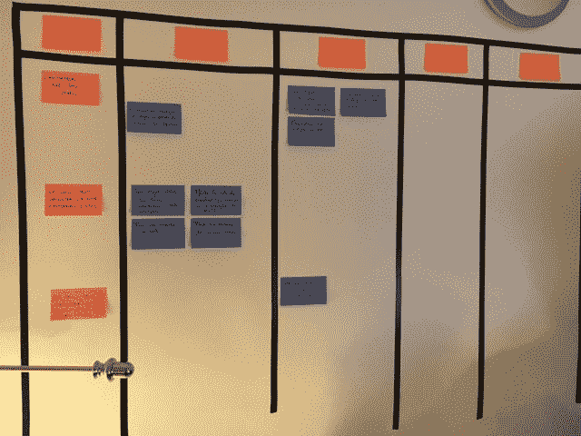

Our task board for the first sprint

你可以很容易地在 [Gitlab 发布板](https://about.gitlab.com/features/issueboard/)或 [Waffle.io](https://waffle.io/) 上重新创建这个任务板，作为数字替代。

#### 创业公司之间两周一次的会议

为了让会议高效而中肯，Christophe 与我们分享了以下策略:

*   设置会议的最长时间(30 分钟到 1 小时)
*   为将要讨论的每个主题写一张便笺，一次只谈论一个主题
*   为每个便笺讨论设置一个 5 分钟的计时器
    如果讨论超过 5 分钟，在团队之间决定是否值得将计时器再重置 5 分钟。

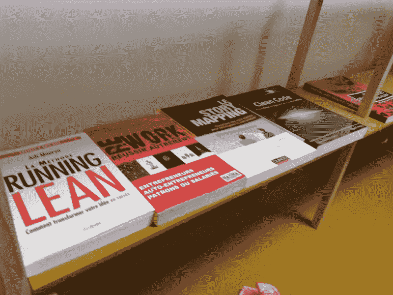

Christophe provided us with some timeless knowledge on Agile, Lean Startup and Clean Code

### 5.从精心设计的网站中获得灵感，并分享一块 moodboard

这是我在项目开始时最喜欢的部分之一——从其他 web 应用程序中寻找 UX 和 UI 的灵感，其中一些我经常使用。

我总是对我使用的一些工具背后的团队的创造力和聪明感到惊讶。例如，我的灵感来自于 [breaz.io](https://hired.com/signup?utm_source=breaz&utm_medium=referral) 的入职流程。我也很欣赏 drivy.com[的方式，它允许用户先选择一批汽车，一旦做出选择，就给每位车主发一条信息。](https://www.drivy.com/)

在这里，我将展示一些工具，它们通常可以帮助我开始并可视化应用程序的界面。

#### Dribbble

[Dribbble](https://dribbble.com/) 上的搜索功能让你挑选展示他们作品的伟大设计师的创意大脑。

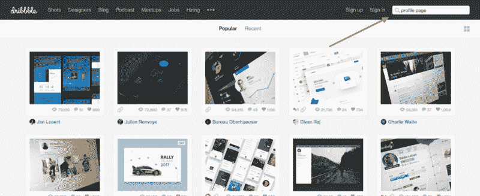

#### 情绪板

Moodboard 让你与你的团队收集、分享和评论设计。这让每个人都能感受到网站界面的灵感:

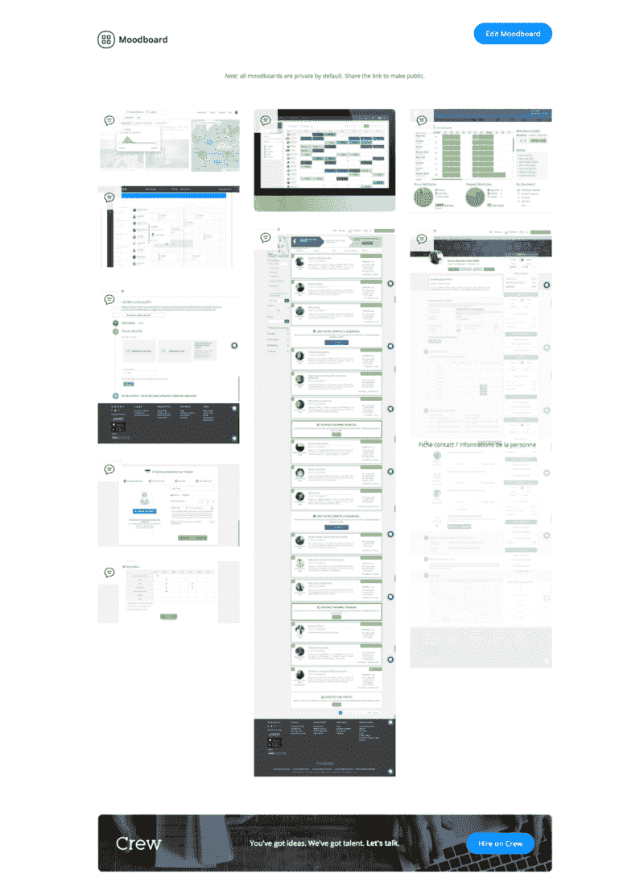

#### Adobe 颜色

[Adobe Color](https://color.adobe.com) 是和谐调色板的完美灵感来源。“探索”功能可让您浏览数千种鼓舞人心的颜色主题:

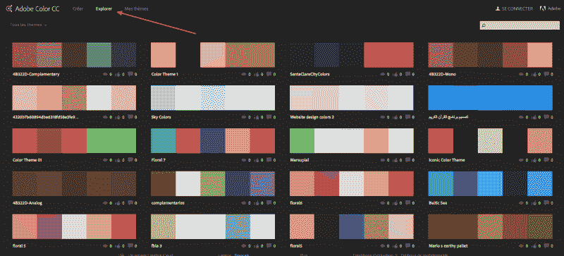

### 6.创建应用程序的第一个 Rails 版本

我们用 Ruby on Rails 和 SQLite 建立了模型和数据库。我们将“设计”宝石用于认证系统。

我一般是前端和后端同时开发。这意味着，每项功能一诞生，我就努力去设计和响应它。

这总是会引起某种“哇！”演示第一个演示时的效果。当用户采用一个产品时，这个第一印象可能是一个决定性的因素。

一些开发人员更喜欢首先关注后端。一旦他们把所有东西都整理好了，他们就会回头再去买化妆品。然而，我发现两者同时进行更容易。

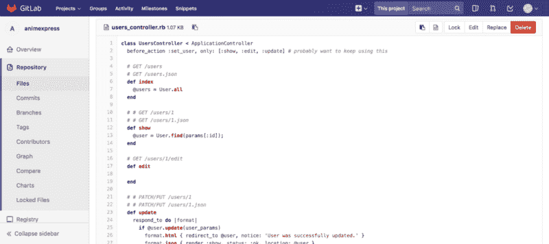

在我们的应用程序中，主要对象是用户。我们还有很长的路要走，以完善入职系统，并找到让用户经常返回应用程序的激励措施。

现在，注册过程是最基本的，只需要 MVP 工作的关键信息。

下面是一些 MVP 的截图！

**报名:**

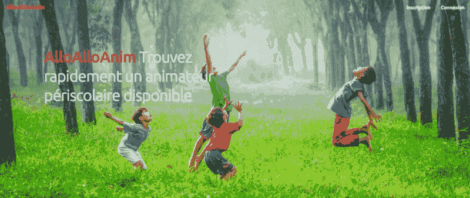

Signing Up

**寻找员工:**

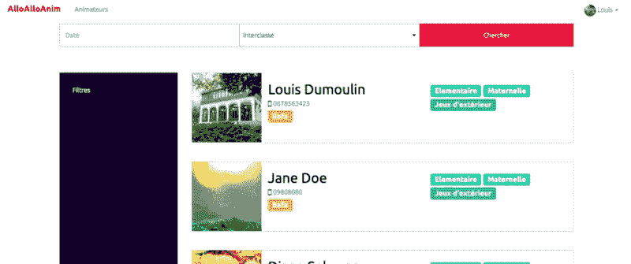

Looking for available staff

该应用程序需要一个每周日历，供课后工作人员填写他们的可用时间段。然而，我找不到符合 MVP 特定需求的 Rails gem 或 JavaScript 插件。

所以我着手构建一个完整的 Javascript 每周可用性调度程序，然后将其集成到 Rails 应用程序中。[有兴趣的可以在这里找到 JavaScript 代码](https://github.com/lenafaure/javascript-weekly-scheduler)。

**版本 0(显示星期):**

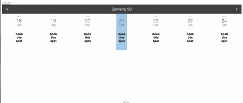

**版本 1(添加特定时隙和响应行为):**

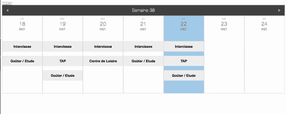

**版本 2(集成到 Rails 应用程序—个人资料页面):**

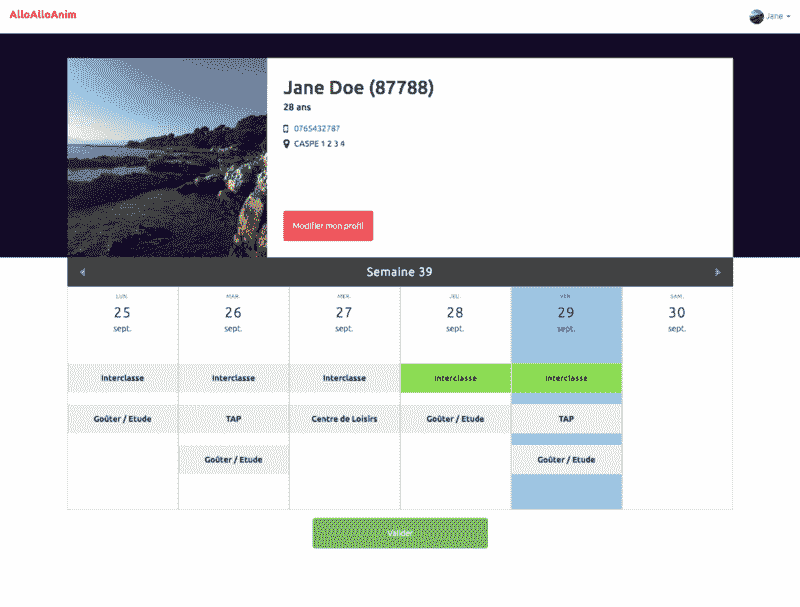

### 7.部署实时应用程序

最后一步，让 app 活起来。我发现 [**Heroku**](https://www.heroku.com/) 做主持简直易如反掌。部署是免费的，方向非常简单，可以直接在平台上找到。

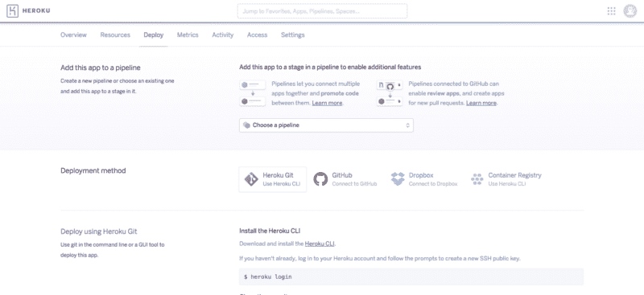

Heroku deployment instructions

### 8.重复

最后，是时候再次和用户见面了，把你在冲刺阶段所做的工作呈现给他们。

我们通常有 3 周的冲刺。这给了我们时间来实际编写足够的功能来讨论一些实质性的东西。它还能让我们的用户俱乐部在会议间隙喘口气。

在会议期间，我们听取用户的反馈，并与他们讨论应用程序的功能。

然后，我们回到任务板上计划下一次冲刺…直到下次！

### 结论

便利贴就是生活。没有他们，世界上不会有任何好事发生。

暂时就这样吧！我们已经进入了第二个冲刺阶段，以惊人的敏捷移动便笺。

欢迎您在自己的过程中使用任何工具，并愿意与我们分享！

**编辑:** [AlloAnim](http://alloanim.futur.paris/) 原型已经成功推出，目前正在接受巴黎市工作人员的日常测试和使用。

你可以在这里找到[开源代码](https://gitlab.com/startups-ville-paris/animexpress)，以及下面这个应用的完整演示:

*[#**startup DeVille**](https://twitter.com/hashtag/startupdeville?src=hash)计划是巴黎市的一项倡议，由在实地工作时明确了痛点的公共代理人推动。*

经过选择过程和一个月的加速，一个两人团队(产品负责人+开发人员)构建了一个 web 应用程序，以验证目标用户对这一新服务的需求及其采用情况。

如果你喜欢这首曲子，请展示你的爱并鼓掌，让其他人也能找到它！请随意在推特上关注我，还有 [#startupdeville](https://twitter.com/hashtag/startupdeville?src=hash) 团队成员、[克里斯蒂安·博卡里](https://twitter.com/BockarieChrist)、[让·卡琳蒂](https://twitter.com/JeanKarinthi)和[克利斯朵夫·罗比拉德](https://twitter.com/krichtof)

-列娜·福尔雷

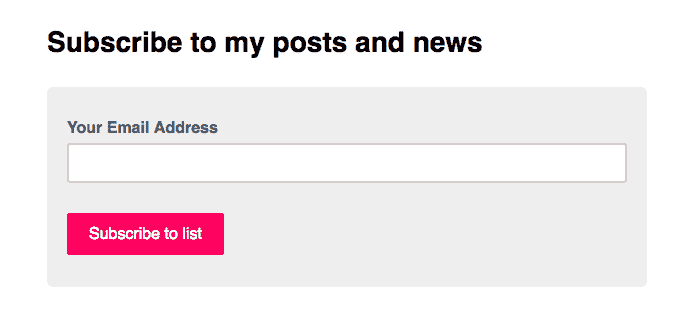