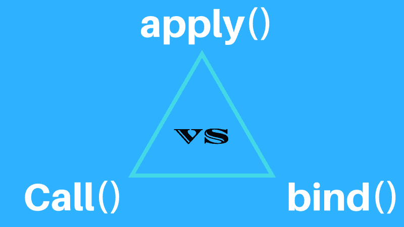

# JavaScript 的调用、应用和绑定方法之间的区别

> 原文：<https://www.freecodecamp.org/news/the-difference-between-javascripts-call-apply-and-bind-methods-4e69917f77bd/>

作者 Rajat Saxena

# JavaScript 的调用、应用和绑定方法之间的区别

#### 让我们把它灌输到我们的头脑中，一劳永逸地结束它。

JavaScript’s call vs apply vs bind

我写这篇微博是因为前面提到的问题困扰了我很长时间，我知道我不是唯一一个。每次我看到有人使用这三种方法中的任何一种，我都不得不冲向 MDN T1，以便弄清楚发生了什么。

够了。我知道我必须做些什么，我做到了。据说我创造了一个众所周知的银弹，可以帮助新的 JavaScript 开发人员。

> **免责声明**:这不是一个理论上的解决方案，而是一个记住区别的非常简单的方法。

造成`call()`和`apply()`方法混淆的主要原因是除了`this`之外，如何传入额外的参数。为什么我们会有`bind()`？

所以我们来学习一下如何轻松区分这三者。

#### 应用()

`**apply(this [, [arg1, arg2,...]])**` **:** 用提供的`this`值调用函数。进一步的论证被提供为**单个数组**。

***记忆方式****::**A**pply 接受实参作为 **A** rray "或" **AA** "*

#### 调用()

`call**(this [, arg1, arg2...])**` **:** 用提供的`this`调用函数。进一步的参数以**逗号分隔列表**的形式提供

***记忆方式:*** *“调用的参数用逗号隔开”或“ **CC** ”。*

#### 绑定()

`**bind(this)**` **:** 返回一个新函数，其`this`值绑定到所提供的值。

***方法记住:*** *bind()是三个返回新函数的方法中唯一的**。它不调用函数。***

#### **包裹**

**我希望上面的解释可以帮助你们中的一些人。它确实对我有帮助。**

**你还有其他与编程相关的记忆窍门吗？请与社区分享它，因为它会帮助每个人。尤其是在面试的时候。**

**如果您有任何疑问，请在 Twitter [@rajat1saxena](https://twitter.com/rajat1saxena) 上给我打电话，或者在 rajat@raynstudios.com[给我写信](mailto:rajat@raynstudios.com)。如果你喜欢这篇文章，请推荐它并与你的网络分享。**