# Docker 手册-初学者学习 Docker

> 原文：<https://www.freecodecamp.org/news/the-docker-handbook/>

集装箱化的概念本身是相当古老的。但是 2013 年出现的 [Docker 引擎](https://docs.docker.com/get-started/overview/#docker-engine)使得应用程序的容器化变得更加容易。

根据[栈溢出开发者调查- 2020](https://insights.stackoverflow.com/survey/2020#overview) ， [Docker](https://docker.com/) 是[排名第一的最受欢迎平台](https://insights.stackoverflow.com/survey/2020#technology-most-loved-dreaded-and-wanted-platforms-wanted5)，[排名第二的最受欢迎平台](https://insights.stackoverflow.com/survey/2020#technology-most-loved-dreaded-and-wanted-platforms-loved5)，也是[排名第三的最受欢迎平台](https://insights.stackoverflow.com/survey/2020#technology-platforms)。

尽管很受欢迎，但开始时似乎有点吓人。所以在这本书里，我们将学习从集装箱化的基础到中级水平的一切。通读整本书后，您应该能够:

*   容器化(几乎)任何应用
*   将自定义 Docker 图像上传到在线注册表
*   使用 Docker Compose 处理多个容器

## 先决条件

*   熟悉 Linux 终端
*   熟悉 JavaScript(一些后来的项目使用 JavaScript)

## 目录

*   [集装箱化和码头工人简介](#introduction-to-containerization-and-docker)
*   [如何安装 Docker](#how-to-install-docker)
    *   [如何在 macOS 上安装 Docker](#how-to-install-docker-on-macos)
    *   [如何在 Windows 上安装 Docker](#how-to-install-docker-on-windows)
    *   [如何在 Linux 上安装 Docker](#how-to-install-docker-on-linux)
*   [Docker 中的 Hello World-Docker 基础介绍](#hello-world-in-docker-intro-to-docker-basics)
    *   [什么是容器？](#what-is-a-container)
    *   [什么是码头工人形象？](#what-is-a-docker-image)
    *   什么是 Docker 注册表？
    *   [Docker 架构概述](#docker-architecture-overview)
    *   [全貌](#the-full-picture)
*   [码头集装箱操作基础知识](#docker-container-manipulation-basics)
    *   [如何运行容器](#how-to-run-a-container)
    *   [如何发布端口](#how-to-publish-a-port)
    *   [如何使用分离模式](#how-to-use-detached-mode)
    *   [如何列出集装箱](#how-to-list-containers)
    *   [如何命名或重命名容器](#how-to-name-or-rename-a-container)
    *   [如何停止或关闭运行中的容器](#how-to-stop-or-kill-a-running-container)
    *   [如何重启容器](#how-to-restart-a-container)
    *   [如何在不运行](#how-to-create-a-container-without-running)的情况下创建容器
    *   [如何移除悬空容器](#how-to-remove-dangling-containers)
    *   [如何在交互模式下运行容器](#how-to-run-a-container-in-interactive-mode)
    *   [如何在容器内执行命令](#how-to-execute-commands-inside-a-container)
    *   [如何使用可执行映像](#how-to-work-with-executable-images)
*   [Docker 图像处理基础知识](#docker-image-manipulation-basics)
    *   [如何创建 Docker 图像](#how-to-create-a-docker-image)
    *   [如何标记 Docker 图像](#how-to-tag-docker-images)
    *   [如何列出和删除 Docker 图像](#how-to-list-and-remove-docker-images)
    *   [如何理解多层次的 Docker 图像](#how-to-understand-the-many-layers-of-a-docker-image)
    *   [如何从源代码构建 NGINX】](#how-to-build-nginx-from-source)
    *   [如何优化 Docker 图像](#how-to-optimize-docker-images)
    *   [拥抱 Alpine Linux](#embracing-alpine-linux)
    *   [如何创建可执行的 Docker 映像](#how-to-create-executable-docker-images)
    *   [如何在线分享您的 Docker 图片](#how-to-share-your-docker-images-online)
*   [如何容器化一个 JavaScript 应用](#how-to-containerize-a-javascript-application)
    *   [如何编写开发 Dockerfile 文件](#how-to-write-the-development-dockerfile)
    *   [如何在 Docker 中使用绑定挂载](#how-to-work-with-bind-mounts-in-docker)
    *   [如何在 Docker 中使用匿名卷](#how-to-work-with-anonymous-volumes-in-docker)
    *   [如何在 Docker 中执行多阶段构建](#how-to-perform-multi-staged-builds-in-docker)
    *   [如何忽略不必要的文件](#how-to-ignore-unnecessary-files)
*   [Docker 中的网络操作基础知识](#network-manipulation-basics-in-docker)
    *   [Docker 网络基础知识](#docker-network-basics)
    *   [如何在 Docker 中创建自定义桥](#how-to-create-a-user-defined-bridge-in-docker)
    *   [如何在 Docker](#how-to-attach-a-container-to-a-network-in-docker) 中将容器连接到网络
    *   [如何在 Docker 中从网络中分离容器](#how-to-detach-containers-from-a-network-in-docker)
    *   [如何摆脱 Docker 中的网络](#how-to-get-rid-of-networks-in-docker)
*   [如何容器化多容器 JavaScript 应用](#how-to-containerize-a-multi-container-javascript-application)
    *   [如何运行数据库服务器](#how-to-run-the-database-server)
    *   [如何在 Docker 中使用命名卷](#how-to-work-with-named-volumes-in-docker)
    *   [如何从 Docker 中的容器访问日志](#how-to-access-logs-from-a-container-in-docker)
    *   [如何在 Docker 中创建网络并连接数据库服务器](#how-to-create-a-network-and-attaching-the-database-server-in-docker)
    *   [如何编写 Dockerfile](#how-to-write-the-dockerfile)
    *   [如何在运行的容器中执行命令](#how-to-execute-commands-in-a-running-container)
    *   [如何在 Docker 中编写管理脚本](#how-to-write-management-scripts-in-docker)
*   [如何使用 Docker-Compose 编写项目](#how-to-compose-projects-using-docker-compose)
    *   [坞站复合基础](#docker-compose-basics)
    *   [如何在 Docker Compose 中启动服务](#how-to-start-services-in-docker-compose)
    *   [如何在 Docker Compose 中列出服务](#how-to-list-services-in-docker-compose)
    *   [如何在 Docker Compose 中执行正在运行的服务中的命令](#how-to-execute-commands-inside-a-running-service-in-docker-compose)
    *   [如何在 Docker Compose 中访问正在运行的服务的日志](#how-to-access-logs-from-a-running-service-in-docker-compose)
    *   [如何停止 Docker 编写中的服务](#how-to-stop-services-in-docker-compose)
    *   [如何在 Docker Compose 中构建全栈应用](#how-to-compose-a-full-stack-application-in-docker-compose)
*   [结论](#conclusion)

## 项目代码

示例项目的代码可以在以下存储库中找到:

[fhsinchy/docker-handbook-projectsProject codes used in “The Docker Handbook” :notebook: - fhsinchy/docker-handbook-projectsfhsinchyGitHub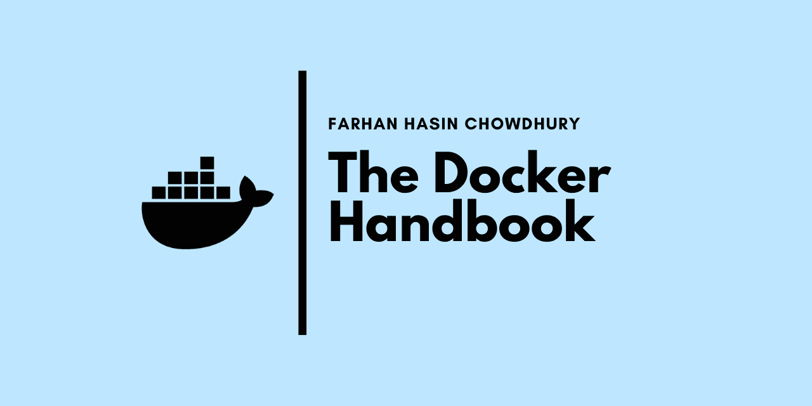](https://github.com/fhsinchy/docker-handbook-projects/)

spare a ⭐ to keep me motivated

你可以在`completed`分支中找到完整的代码。

## 贡献

这本书是完全开源的，非常欢迎高质量的贡献。您可以在以下存储库中找到完整内容:

[fhsinchy/the-docker-handbookOpen-source book on Docker. Contribute to fhsinchy/the-docker-handbook development by creating an account on GitHub.fhsinchyGitHub](https://github.com/fhsinchy/the-docker-handbook)

spare a ⭐ to keep me motivated

我通常先在书的 GitBook 版本上做我的修改和更新，然后发布在 freeCodeCamp 上。您可以在以下链接中找到该书的经常更新且经常不稳定的版本:

[](https://docker-handbook.farhan.dev/)[The Docker HandbookThe Docker Handbook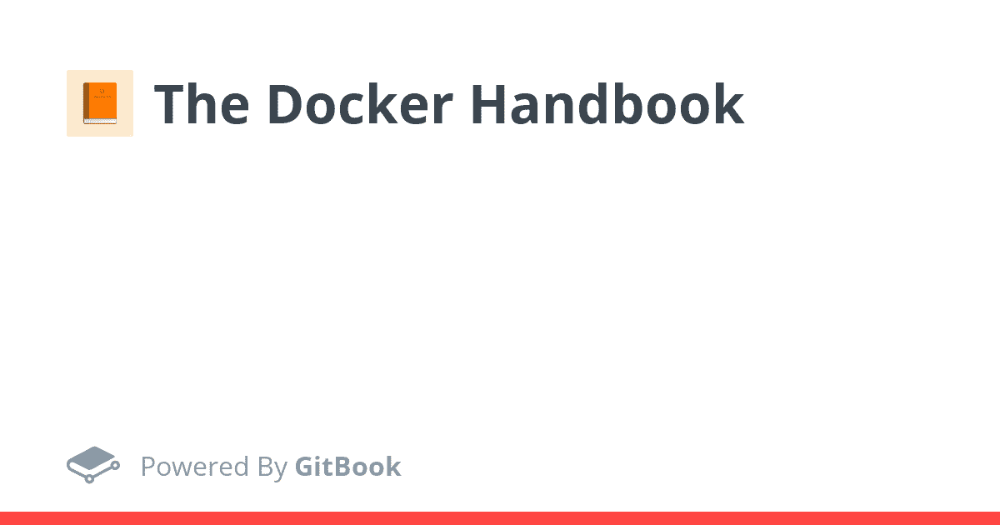](https://docker-handbook.farhan.dev/)

don't forget to leave ⭐ on the repository

如果你正在寻找这本书的一个冷冻但稳定的版本，那么 freeCodeCamp 将是最好的去处:

[The Docker HandbookThe concept of containerization itself is pretty old, but the emergence of the Docker Engine [https://docs.docker.com/get-started/overview/#docker-engine] in2013 has made it much easier to containerize your applications. According to the Stack Overflow Developer Survey - 2020[https://insights.stackoverflow.com/survey/2020#overview…Farhan Hasin ChowdhuryfreeCodeCamp.org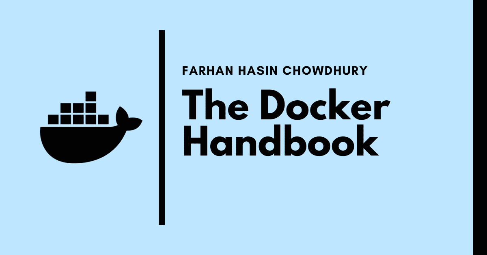](https://www.freecodecamp.org/news/the-docker-handbook/)

sharing with others may help

不管你最终读了这本书的哪个版本，别忘了让我知道你的意见。建设性的批评总是受欢迎的。

## 集装箱化和码头工人介绍

据 [IBM](https://www.ibm.com/cloud/learn/containerization#toc-what-is-co-r25Smlqq) ，

> 容器化包括封装或打包软件代码及其所有依赖项，以便它可以在任何基础设施上统一一致地运行。

‌In 换句话说，容器化让你把你的软件和它所有的依赖项打包在一个独立的包里，这样它就可以运行，而不需要经历一个麻烦的设置过程。

‌Let's 在这里考虑一个真实生活场景。假设您已经开发了一个非常棒的图书管理应用程序，它可以存储您所有图书的信息，还可以为您的朋友提供图书借阅系统。

‌If 你列一个依赖关系的列表，这个列表可能看起来像这样:

*   节点. js
*   快递. js
*   SQLite3

嗯，理论上应该是这样。但是实际上还有一些其他的东西。原来 [Node.js](https://nodejs.org/) 使用一个名为`node-gyp`的构建工具来构建本地插件。根据[官方资源库](https://github.com/nodejs/node-gyp)中的[安装说明](https://github.com/nodejs/node-gyp#installation)，这个构建工具需要 Python 2 或 3 以及一个合适的 C/C++编译器工具链。

考虑到所有这些因素，最终的依赖项列表如下:

*   节点. js
*   快递. js
*   SQLite3
*   Python 2 或 3
*   C/C++工具链

无论您使用什么平台，安装 Python 2 或 3 都非常简单。在 Linux 上建立 C/C++工具链相当容易，但在 Windows 和 Mac 上却是一项痛苦的任务。

在 Windows 上，C++构建工具包的大小为千兆字节，安装需要相当长的时间。在苹果电脑上，你可以安装巨大的 Xcode 应用程序或者更小的 Xcode 命令行工具包 T2。

无论你安装哪一个，它仍然可能在操作系统更新时中断。事实上，这个问题如此普遍，以至于在官方存储库上有 macOS Catalina 的[安装说明。](https://github.com/nodejs/node-gyp/blob/master/macOS_Catalina.md)

让我们假设您已经经历了设置依赖项的所有麻烦，并且已经开始了项目工作。这是不是意味着你现在脱离危险了？当然不是。

如果你的队友在你使用 Linux 的时候使用 Windows，那该怎么办？现在，您必须考虑这两种不同的操作系统处理路径的不一致之处。或者像 [nginx](https://nginx.org/) 这样的流行技术没有很好地优化以在 Windows 上运行。像 [Redis](https://redis.io/) 这样的一些技术甚至不是为 Windows 预先构建的。

即使您完成了整个开发阶段，如果负责管理服务器的人遵循了错误的部署过程，该怎么办呢？

所有这些问题都可以解决，只要你能以某种方式:

*   在与您的最终部署环境相匹配的隔离环境(称为容器)中开发和运行应用程序。
*   将您的应用程序及其所有依赖项和必要的部署配置放在一个文件(称为映像)中。
*   并通过具有适当授权的任何人都可以访问的中央服务器(称为注册中心)共享该图像。

然后，您的团队成员将能够从注册表中下载映像，在没有平台特定不一致的隔离环境中运行应用程序，甚至直接部署在服务器上，因为映像附带了所有适当的生产配置。

这就是容器化背后的思想:将应用程序放在一个自包含的包中，使它可以在各种环境中移植和复制。

现在的问题是“Docker 在这里扮演什么角色？”

正如我已经解释过的，容器化是一种通过把东西放进盒子里来解决软件开发中无数问题的想法。

这个想法有相当多的实现。 [Docker](https://www.docker.com/) 就是这样一个实现。这是一个开源的容器化平台，允许你容器化你的应用程序，使用公共或私有注册表共享它们，也可以[编排](https://docs.docker.com/get-started/orchestration/)它们。

现在，Docker 并不是市场上唯一的容器化工具，它只是最受欢迎的一个。另一个我喜欢的容器化引擎叫做 [Podman](https://podman.io/) 由 Red Hat 开发。其他工具，如谷歌的 [Kaniko](https://github.com/GoogleContainerTools/kaniko) ，CoreOS 的 [rkt](https://coreos.com/rkt/) 都很棒，但它们还没有准备好取代 Docker。

此外，如果你想上一堂历史课，你可以阅读令人惊叹的[容器简史:从 20 世纪 70 年代到现在](https://blog.aquasec.com/a-brief-history-of-containers-from-1970s-chroot-to-docker-2016)，它涵盖了该技术的大多数主要转折点。

## 如何安装 Docker

Docker 的安装根据你使用的操作系统有很大的不同。但是它是普遍简单的。

Docker 可以在所有三个主要平台上完美运行，Mac、Windows 和 Linux。在这三者中，Mac 上的安装过程是最简单的，所以我们将从那里开始。

### 如何在 macOS 上安装 Docker

在 mac 上，你所要做的就是导航到官方的[下载页面](https://www.docker.com/products/docker-desktop)，点击*Mac 版下载(稳定版)*按钮。

你会得到一个普通的苹果磁盘镜像文件，在这个文件中，有一个应用程序。你所要做的就是将文件拖放到你的应用程序目录中。


双击应用程序图标就可以启动 Docker。一旦应用程序启动，你会看到 Docker 图标出现在你的菜单栏上。

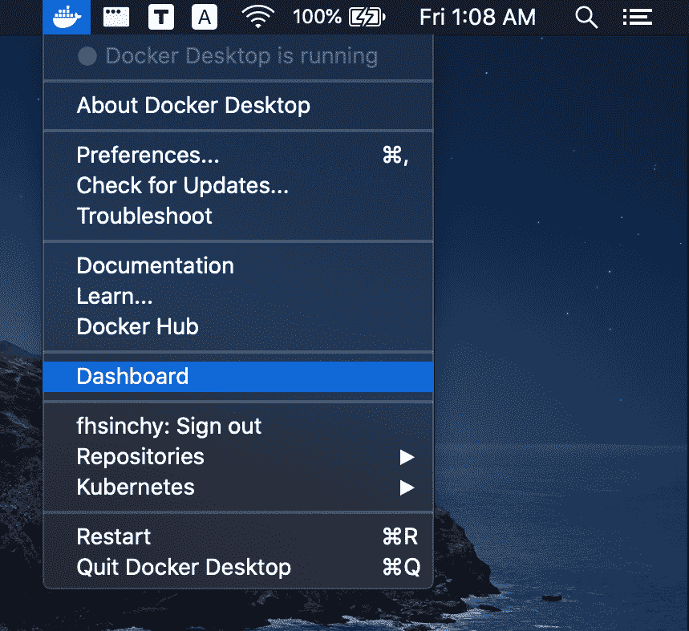

现在，打开终端，执行`docker --version`和`docker-compose --version`，确保安装成功。

### 如何在 Windows 上安装 Docker

在 Windows 上，过程几乎是相同的，除了您需要完成一些额外的步骤。安装步骤如下:

1.  导航到[这个站点](https://docs.microsoft.com/en-us/windows/wsl/install-win10)，按照说明在 Windows 10 上安装 WSL2。
2.  然后导航到官方[下载页面](https://www.docker.com/products/docker-desktop)，点击【Windows 下载(稳定)按钮。
3.  双击下载的安装程序，使用默认设置完成安装。

一旦安装完成，从开始菜单或你的桌面启动 *Docker 桌面*。docker 图标应该会出现在任务栏上。


现在，打开 Ubuntu 或你从微软商店安装的任何发行版。执行`docker --version`和`docker-compose --version`命令，确保安装成功。

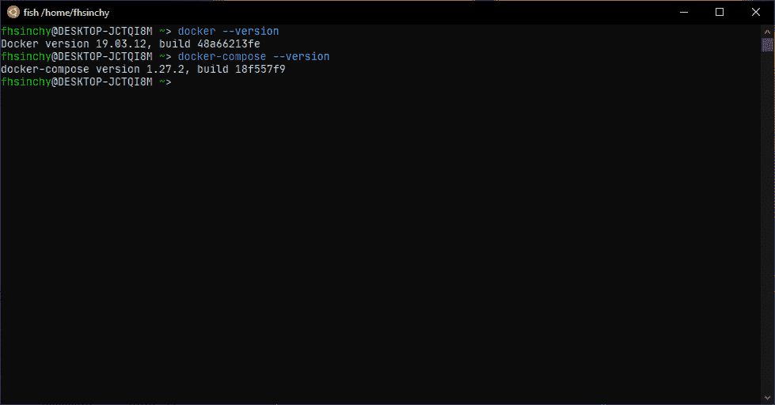

您也可以从常规命令提示符或 PowerShell 访问 Docker。只是我更喜欢在 Windows 上使用 WSL2 而不是其他命令行。

### 如何在 Linux 上安装 Docker

在 Linux 上安装 Docker 是一个有点不同的过程，根据您使用的发行版，它可能会有更多的变化。但是说实话，安装和其他两个平台一样容易(如果不是更容易的话)。

Windows 或 Mac 上的 Docker 桌面软件包是一个工具集，如`Docker Engine`、`Docker Compose`、`Docker Dashboard`、`Kubernetes`和其他一些好东西。

然而在 Linux 上，你不会得到这样一个包。相反，您需要手动安装所有必要的工具。不同发行版的安装过程如下:

*   如果你在 Ubuntu 上，你可以遵循官方文档中的[在 Ubuntu 上安装 Docker 引擎](https://docs.docker.com/engine/install/ubuntu/)部分。
*   对于其他发行版，*每个发行版的安装指南可以在官方文档中找到。*
    *   [在 Debian 上安装 Docker 引擎](https://docs.docker.com/engine/install/debian/)
    *   [在 Fedora 上安装 Docker 引擎](https://docs.docker.com/engine/install/fedora/)
    *   [在 CentOS 上安装 Docker 引擎](https://docs.docker.com/engine/install/centos/)
*   如果您使用的发行版没有在文档中列出，您可以遵循[从二进制文件安装 Docker 引擎](https://docs.docker.com/engine/install/binaries/)指南。
*   无论您遵循什么步骤，您都必须经历一些非常重要的 Linux 安装后的步骤。
*   一旦你完成了 docker 的安装，你需要安装另一个名为 Docker Compose 的工具。您可以遵循官方文档中的[安装 Docker 编写](https://docs.docker.com/compose/install/)指南。

安装完成后，打开终端并执行`docker --version`和`docker-compose --version`以确保安装成功。

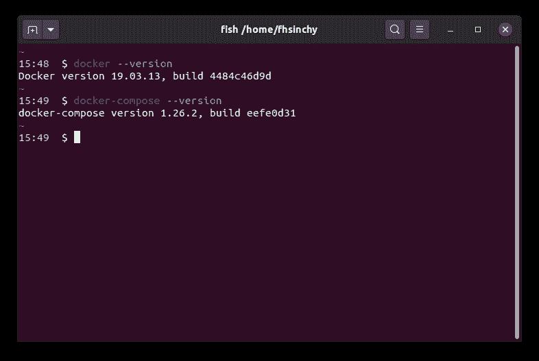

尽管 Docker 无论在什么平台上都表现得很好，但我更喜欢 Linux。在整本书中，我会在我的 Ubuntu 20.10 和 T2 Fedora 33 工作站之间切换。

我想从一开始就澄清的另一件事是，在整本书中，我不会使用任何 GUI 工具来使用 Docker。

我知道不同平台都有不错的 GUI 工具，但是学习通用的 docker 命令是本书的主要目标之一。

## Docker 中的 hello World——Docker 基础介绍

既然您已经在机器上启动并运行了 Docker，那么是时候运行您的第一个容器了。打开终端并运行以下命令:

```
docker run hello-world

# Unable to find image 'hello-world:latest' locally
# latest: Pulling from library/hello-world
# 0e03bdcc26d7: Pull complete 
# Digest: sha256:4cf9c47f86df71d48364001ede3a4fcd85ae80ce02ebad74156906caff5378bc
# Status: Downloaded newer image for hello-world:latest
# 
# Hello from Docker!
# This message shows that your installation appears to be working correctly.
# 
# To generate this message, Docker took the following steps:
#  1\. The Docker client contacted the Docker daemon.
#  2\. The Docker daemon pulled the "hello-world" image from the Docker Hub.
#     (amd64)
#  3\. The Docker daemon created a new container from that image which runs the
#     executable that produces the output you are currently reading.
#  4\. The Docker daemon streamed that output to the Docker client, which sent it
#     to your terminal.
#
# To try something more ambitious, you can run an Ubuntu container with:
#  $ docker run -it ubuntu bash
# 
# Share images, automate workflows, and more with a free Docker ID:
#  https://hub.docker.com/
#
# For more examples and ideas, visit:
#  https://docs.docker.com/get-started/ 
```

[hello-world](https://hub.docker.com/_/hello-world) 图像是 Docker 最小容器化的一个例子。它有一个由 [hello.c](https://github.com/docker-library/hello-world/blob/master/hello.c) 文件编译而成的程序，负责打印出你在终端上看到的信息。

现在，在您的终端中，您可以使用`docker ps -a`命令查看所有当前正在运行或过去已经运行过的容器:

```
docker ps -a

# CONTAINER ID        IMAGE               COMMAND             CREATED             STATUS                     PORTS               NAMES
# 128ec8ceab71        hello-world         "/hello"            14 seconds ago      Exited (0) 13 seconds ago                      exciting_chebyshev
```

在输出中，使用`hello-world`映像运行了一个名为`exciting_chebyshev`的容器，容器 id 为`128ec8ceab71`。它有`Exited (0) 13 seconds ago`，其中`(0)`退出代码表示在容器运行时没有产生错误。

现在，为了理解幕后发生的事情，您必须熟悉 Docker 架构和容器化的三个基本概念，如下所示:

*   [集装箱](https://www.freecodecamp.org/news/@fhsinchy/s/the-docker-handbook/~/drafts/-MS1b3opwENd_9qH1jTO/hello-world-in-docker#container)
*   [图像](https://www.freecodecamp.org/news/@fhsinchy/s/the-docker-handbook/~/drafts/-MS1b3opwENd_9qH1jTO/hello-world-in-docker#image)
*   [注册表](https://www.freecodecamp.org/news/@fhsinchy/s/the-docker-handbook/~/drafts/-MS1b3opwENd_9qH1jTO/hello-world-in-docker#registry)

我已经按字母顺序列出了这三个概念，我将从列表上的第一个开始解释。

### 什么是容器？

在集装箱化的世界里，没有什么比集装箱的概念更基本的了。

官方资源网站称-

> 容器是应用层的抽象，它将代码和依赖项打包在一起。容器只虚拟化主机操作系统，而不是虚拟化整个物理机。

您可能认为容器是下一代虚拟机。

就像虚拟机一样，容器是与主机系统以及彼此之间完全隔离的环境。它们也比传统虚拟机轻得多，因此可以同时运行大量容器，而不会影响主机系统的性能。‌

容器和虚拟机实际上是虚拟化物理硬件的不同方式。这两者的主要区别在于虚拟化的方法。

虚拟机通常由一个称为管理程序的程序来创建和管理，如 [Oracle VM VirtualBox](https://www.virtualbox.org/) 、 [VMware Workstation](https://www.vmware.com/) 、 [KVM](https://www.linux-kvm.org/) 、 [Microsoft Hyper-V](https://docs.microsoft.com/en-us/virtualization/hyper-v-on-windows/about/) 等等。这个虚拟机管理程序通常位于主机操作系统和虚拟机之间，充当通信媒介。


每个虚拟机都有自己的客户操作系统，其重量与主机操作系统相当。

在虚拟机内运行的应用程序与来宾操作系统通信，来宾操作系统与虚拟机管理程序通信，虚拟机管理程序则与主机操作系统通信，以便将物理基础架构中的必要资源分配给正在运行的应用程序。

如您所见，在虚拟机内部运行的应用程序和物理基础架构之间有一条长长的通信链。在虚拟机内部运行的应用程序可能只占用少量资源，但是客户操作系统会增加明显的开销。

与虚拟机不同，容器以更智能的方式完成虚拟化工作。它不是在容器中有一个完整的客户操作系统，而是通过容器运行时利用主机操作系统，同时保持隔离——就像传统的虚拟机一样。


容器运行时，即 Docker，位于容器和主机操作系统之间，而不是一个管理程序。容器然后与容器运行时通信，容器运行时然后与主机操作系统通信，以从物理基础设施获得必要的资源。

由于消除了整个客户操作系统层，容器比传统虚拟机更轻，占用的资源也更少。

作为这一点的演示，请看下面的代码块:

```
uname -a
# Linux alpha-centauri 5.8.0-22-generic #23-Ubuntu SMP Fri Oct 9 00:34:40 UTC 2020 x86_64 x86_64 x86_64 GNU/Linux

docker run alpine uname -a
# Linux f08dbbe9199b 5.8.0-22-generic #23-Ubuntu SMP Fri Oct 9 00:34:40 UTC 2020 x86_64 Linux
```

在上面的代码块中，我已经在我的主机操作系统上执行了`uname -a`命令来打印内核细节。然后在下一行，我在运行 [Alpine Linux](https://alpinelinux.org/) 的容器中执行了相同的命令。

正如您在输出中看到的，容器确实使用了我的主机操作系统的内核。这证明了容器虚拟化了主机操作系统，而不是拥有自己的操作系统。

如果你在 Windows 机器上，你会发现所有的容器都使用 WSL2 内核。这是因为 WSL2 充当了 Windows 上 Docker 的后端。在 macOS 上，默认的后端是运行在 [HyperKit](https://github.com/moby/hyperkit) hypervisor 上的虚拟机。

### 什么是 Docker 图像？

图像是多层自包含文件，用作创建容器的模板。它们就像一个容器的冻结的只读副本。图像可以通过注册表交换。

过去，不同的容器引擎有不同的图像格式。但是后来，[开放集装箱倡议(OCI)](https://opencontainers.org/) 为集装箱图像定义了一个标准规范，由主要的集装箱化引擎遵守。这意味着用 Docker 构建的映像可以与另一个运行时(如 Podman)一起使用，没有任何额外的麻烦。

容器只是运行状态下的图像。当您从互联网上获得一个图像并使用该图像运行一个容器时，您实际上是在先前的只读层之上创建了另一个临时可写层。

在本书接下来的章节中，这个概念会变得更加清晰。但是现在，请记住，图像是多层只读文件，其中包含您的应用程序所需的状态。

### 什么是 Docker 注册表？

你已经了解了这个难题的两个非常重要的部分，*容器*和*图像*。最后一块是*注册表*。

图像注册中心是一个集中的地方，您可以上传您的图像，也可以下载其他人创建的图像。Docker Hub 是 Docker 的默认公共注册表。另一个非常受欢迎的图像注册表是红帽的[码头](https://quay.io/)。

在本书中，我将使用 Docker Hub 作为我的注册表选择。

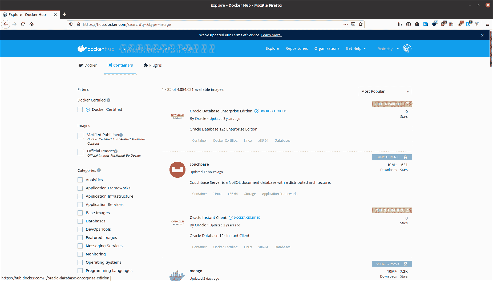

你可以在 Docker Hub 上免费分享任意数量的公开图片。世界各地的人们将能够下载并免费使用它们。我上传的图片可以在我的个人资料( [fhsinchy](https://hub.docker.com/u/fhsinchy) )页面上找到。

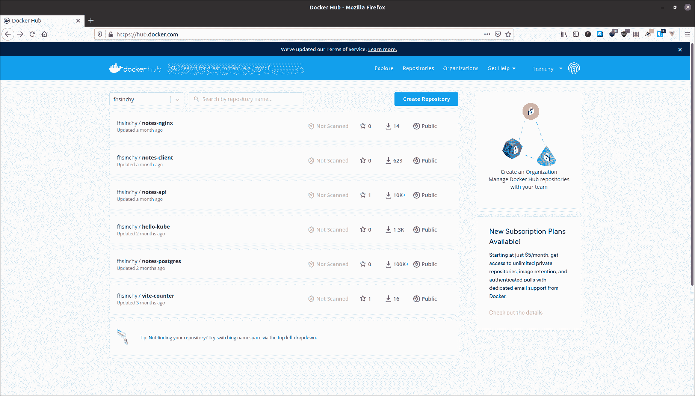

除了 Docker Hub 或 Quay，您还可以创建自己的图像注册表来存放私人图像。还有一个本地注册表运行在您的计算机中，缓存从远程注册表中提取的图像。

### Docker 架构概述

既然您已经熟悉了关于容器化和 Docker 的大多数基本概念，那么是时候让您了解 Docker 作为一个软件是如何设计的了。

发动机由三个主要部件组成:

1.  **Docker 守护进程:**守护进程(`dockerd`)是一个保持在后台运行的进程，等待来自客户端的命令。该守护程序能够管理各种 Docker 对象。
2.  **Docker 客户端:**客户端(`docker`)是一个命令行界面程序，主要负责传输用户发出的命令。
3.  **REST API:**REST API 充当守护进程和客户端之间的桥梁。使用客户机发出的任何命令都会通过 API 最终到达守护进程。

根据官方[文件](https://docs.docker.com/get-started/overview/#docker-architecture)，

> “Docker 使用客户机-服务器架构。Docker *客户端*与 Docker *守护进程*对话，后者负责构建、运行和分发 Docker 容器。

作为用户，您通常会使用客户端组件执行命令。然后，客户端使用 REST API 来访问长时间运行的守护进程，并完成您的工作。

### 完整的画面

好了，说够了。现在是时候让你理解你刚刚学到的所有这些拼图是如何和谐工作的了。在我深入解释运行`docker run hello-world`命令时会发生什么之前，让我给你看一个我做的小图表:


这张图片是官方[文件](https://docs.docker.com/engine/images/architecture.svg)中的图片的略微修改版本。执行命令时发生的事件如下:

1.  您执行`docker run hello-world`命令，其中`hello-world`是图像的名称。
2.  Docker 客户机访问守护进程，告诉它获取`hello-world`映像并从中运行一个容器。
3.  Docker 守护进程在您的本地存储库中查找图像，并意识到它不在那里，导致在您的终端上打印出`Unable to find image 'hello-world:latest' locally`。
4.  然后，守护进程访问默认的公共注册中心 Docker Hub，并获取最新的`hello-world`映像副本，由终端中的`latest: Pulling from library/hello-world`行表示。
5.  Docker 守护进程然后从新提取的映像创建一个新的容器。
6.  最后，Docker 守护进程运行使用`hello-world`图像创建的容器，在终端上输出文本墙。

Docker 守护进程的默认行为是在 hub 中寻找本地不存在的图像。但是一旦图像被获取，它将留在本地缓存中。因此，如果您再次执行该命令，您将不会在输出中看到以下行:

```
Unable to find image 'hello-world:latest' locally
latest: Pulling from library/hello-world
0e03bdcc26d7: Pull complete
Digest: sha256:d58e752213a51785838f9eed2b7a498ffa1cb3aa7f946dda11af39286c3db9a9
Status: Downloaded newer image for hello-world:latest
```

如果公共注册表上有更新版本的映像，守护程序将再次获取映像。那个`:latest`是一个标签。图像通常有有意义的标签来指示版本或构建。稍后您将会更详细地了解这一点。

## Docker 容器操作基础

在前面的章节中，您已经了解了 Docker 的构建块，并且使用`docker run`命令运行了一个容器。

在本节中，您将更加详细地了解容器操作。容器操作是您每天要执行的最常见的任务之一，因此正确理解各种命令至关重要。

但是请记住，这并不是您可以在 Docker 上执行的所有命令的详尽列表。我将只谈论最常见的。任何时候你想了解更多可用的命令，只需访问 Docker 命令行的官方参考资料。

### 如何运行容器

之前，您已经使用`docker run`创建并启动了一个使用`hello-world`映像的容器。该命令的通用语法如下:

```
docker run <image name>
```

尽管这是一个完全有效的命令，但是有一种更好的方法将命令分派给`docker`守护进程。

在版本`1.13`之前，Docker 只有前面提到的命令语法。后来，命令行被[重组为](https://www.docker.com/blog/whats-new-in-docker-1-13/)，具有以下语法:

```
docker <object> <command> <options>
```

在此语法中:

*   `object`表示您将要操作的 Docker 对象的类型。这可以是一个`container`、`image`、`network`或`volume`对象。
*   `command`表示守护进程要执行的任务，即`run`命令。
*   `options`可以是任何可以覆盖命令默认行为的有效参数，比如用于端口映射的`--publish`选项。

现在，按照这个语法，`run`命令可以写成如下形式:

```
docker container run <image name>
```

`image name`可以是来自在线注册表或本地系统的任何图像。例如，您可以尝试使用 [fhsinchy/hello-dock](https://hub.docker.com/r/fhsinchy/hello-dock) 映像运行容器。这个图像包含一个简单的 [Vue.js](https://vuejs.org/) 应用程序，它运行在容器内部的端口 80 上。

要使用此映像运行容器，请在您的终端上执行以下命令:

```
docker container run --publish 8080:80 fhsinchy/hello-dock

# /docker-entrypoint.sh: /docker-entrypoint.d/ is not empty, will attempt to perform configuration
# /docker-entrypoint.sh: Looking for shell scripts in /docker-entrypoint.d/
# /docker-entrypoint.sh: Launching /docker-entrypoint.d/10-listen-on-ipv6-by-default.sh
# 10-listen-on-ipv6-by-default.sh: Getting the checksum of /etc/nginx/conf.d/default.conf
# 10-listen-on-ipv6-by-default.sh: Enabled listen on IPv6 in /etc/nginx/conf.d/default.conf
# /docker-entrypoint.sh: Launching /docker-entrypoint.d/20-envsubst-on-templates.sh
# /docker-entrypoint.sh: Configuration complete; ready for start up
```

这个命令非常简单明了。唯一需要解释的部分是`--publish 8080:80`部分，将在下一小节中解释。

### 如何发布端口

容器是隔离的环境。您的主机系统不知道容器内部发生了什么。因此，在容器内部运行的应用程序仍然无法从外部访问。

要允许从容器外部访问，必须将容器内部的适当端口发布到本地网络上的端口。`--publish`或`-p`选项的常见语法如下:

```
--publish <host port>:<container port>
```

当您在前一小节中编写`--publish 8080:80`时，这意味着发送到您的主机系统的端口 8080 的任何请求都将被转发到 container‌.内部的端口 80

现在，要在您的浏览器上访问该应用程序，请访问`http://127.0.0.1:8080`。

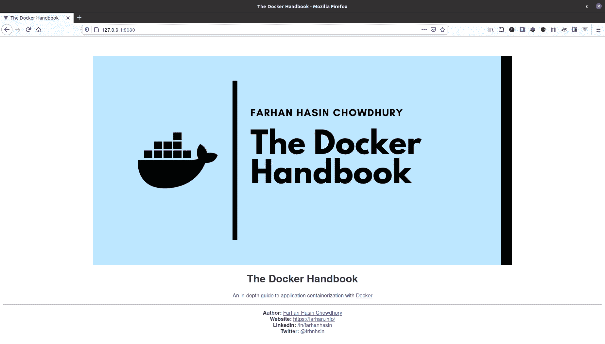

你可以在终端窗口处于焦点时简单地按下`ctrl + c`组合键或者完全关闭终端窗口来停止容器。

### 如何使用分离模式

`run`命令的另一个非常流行的选项是`--detach`或`-d`选项。在上面的例子中，为了让容器保持运行，您必须保持终端窗口打开。关闭终端窗口也会停止正在运行的容器。

这是因为，默认情况下，容器在前台运行，并像任何其他从终端调用的正常程序一样将自己附加到终端。

为了覆盖这种行为并保持容器在后台运行，您可以在`run`命令中包含`--detach`选项，如下所示:

```
docker container run --detach --publish 8080:80 fhsinchy/hello-dock

# 9f21cb77705810797c4b847dbd330d9c732ffddba14fb435470567a7a3f46cdc
```

与前面的例子不同，这次你不会看到一大堆文字。相反，您将获得的是新创建的容器的 ID。

您提供的选项的顺序并不重要。如果您将`--publish`选项放在`--detach`选项之前，它将同样工作。在使用`run`命令时，你必须记住的一点是图像名必须在最后。如果你在图像名后面放了任何东西，那么它将作为一个参数传递给容器入口点(在容器小节的[执行命令中有解释),这可能会导致意外的情况。](#executing-commands-inside-a-container)

### 如何列出集装箱

`container ls`命令可以用来列出当前正在运行的容器。为此，请执行以下命令:

```
docker container ls

# CONTAINER ID        IMAGE                 COMMAND                  CREATED             STATUS              PORTS                  NAMES
# 9f21cb777058        fhsinchy/hello-dock   "/docker-entrypoint.…"   5 seconds ago       Up 5 seconds        0.0.0.0:8080->80/tcp   gifted_sammet
```

名为`gifted_sammet`的容器正在运行。它被创建为`5 seconds ago`，状态为`Up 5 seconds,`，这表明该容器自创建以来一直运行良好。

`CONTAINER ID`是`9f21cb777058`,它是整个集装箱 ID 的前 12 个字符。完整的集装箱 ID 是 64 个字符长的`9f21cb77705810797c4b847dbd330d9c732ffddba14fb435470567a7a3f46cdc`。这个满容器 ID 作为前面章节中的`docker container run`命令的输出被打印出来。

列在`PORTS`列下，本地网络的端口 8080 指向容器内的端口 80。名字`gifted_sammet`是由 Docker 生成的，在你的电脑里可以是完全不同的东西。

`container ls`命令只列出了当前在您的系统上运行的容器。为了列出过去运行过的容器，您可以使用`--all`或`-a`选项。

```
docker container ls --all

# CONTAINER ID        IMAGE                 COMMAND                  CREATED             STATUS                     PORTS                  NAMES
# 9f21cb777058        fhsinchy/hello-dock   "/docker-entrypoint.…"   2 minutes ago       Up 2 minutes               0.0.0.0:8080->80/tcp   gifted_sammet
# 6cf52771dde1        fhsinchy/hello-dock   "/docker-entrypoint.…"   3 minutes ago       Exited (0) 3 minutes ago                          reverent_torvalds
# 128ec8ceab71        hello-world           "/hello"                 4 minutes ago       Exited (0) 4 minutes ago                          exciting_chebyshev
```

正如您所看到的，列表`reverent_torvalds`中的第二个容器是之前创建的，并以状态代码 0 退出，这表明在容器运行时没有产生错误。

### 如何命名或重命名容器

默认情况下，每个容器都有两个标识符。它们如下:

*   `CONTAINER ID` -随机的 64 个字符长的字符串。
*   两个随机单词的组合，用下划线连接。

基于这两个随机标识符来引用容器有点不方便。如果容器可以用你自己定义的名字来引用，那就太好了。

使用`--name`选项可以命名一个容器。要使用名为`hello-dock-container`的`fhsinchy/hello-dock`映像运行另一个容器，您可以执行以下命令:

```
docker container run --detach --publish 8888:80 --name hello-dock-container fhsinchy/hello-dock

# b1db06e400c4c5e81a93a64d30acc1bf821bed63af36cab5cdb95d25e114f5fb
```

本地网络上的 8080 端口被`gifted_sammet`容器(在前一小节中创建的容器)占用。这就是为什么你必须使用不同的端口号，如 8888。现在要进行验证，运行`container ls`命令:

```
docker container ls

# CONTAINER ID        IMAGE                 COMMAND                  CREATED             STATUS              PORTS                  NAMES
# b1db06e400c4        fhsinchy/hello-dock   "/docker-entrypoint.…"   28 seconds ago      Up 26 seconds       0.0.0.0:8888->80/tcp   hello-dock-container
# 9f21cb777058        fhsinchy/hello-dock   "/docker-entrypoint.…"   4 minutes ago       Up 4 minutes        0.0.0.0:8080->80/tcp   gifted_sammet
```

名为`hello-dock-container`的新容器已经启动。

您甚至可以使用`container rename`命令重命名旧容器。该命令的语法如下:

```
docker container rename <container identifier> <new name>
```

要将`gifted_sammet`容器重命名为`hello-dock-container-2`，执行以下命令:

```
docker container rename gifted_sammet hello-dock-container-2
```

该命令不会产生任何输出，但是您可以使用`container ls`命令来验证是否发生了更改。`rename`命令适用于处于运行状态和停止状态的容器。

### 如何停止或终止正在运行的容器

在前台运行的容器可以通过简单地关闭终端窗口或点击`ctrl + c`来停止。然而，在后台运行的容器不能以同样的方式停止。

有两个命令处理这项任务。第一个是`container stop`命令。该命令的通用语法如下:

```
docker container stop <container identifier>
```

其中`container identifier`可以是容器的 id 或名称。

我希望您还记得在上一节中开始的容器。它仍然在后台运行。使用`docker container ls`获取容器的标识符(在这个演示中我将使用`hello-dock-container`容器)。现在执行以下命令来停止容器:

```
docker container stop hello-dock-container

# hello-dock-container
```

如果您使用名称作为标识符，您将得到作为输出返回给您的名称。`stop`命令通过发送一个`SIGTERM`信号来关闭一个容器。如果集装箱在一定时间内没有停止，就会发出一个`SIGKILL`信号，立即关闭集装箱。

如果你想发送一个`SIGKILL`信号而不是`SIGTERM`信号，你可以使用`container kill`命令。`container kill`命令遵循与`stop`命令相同的语法。

```
docker container kill hello-dock-container-2

# hello-dock-container-2
```

### 如何重启容器

当我说重启时，我特别指的是两种情况。它们如下:

*   重新启动之前已经停止或终止的容器。
*   重启正在运行的容器。

正如您已经从上一小节中了解到的，停止的容器仍然存在于您的系统中。如果你愿意，你可以重新启动它们。`container start`命令可用于启动任何停止或停止的容器。该命令的语法如下:

```
docker container start <container identifier>
```

您可以通过执行`container ls --all`命令获得所有容器的列表。然后寻找状态为`Exited`的容器。

```
docker container ls --all

# CONTAINER ID        IMAGE                 COMMAND                  CREATED             STATUS                        PORTS               NAMES
# b1db06e400c4        fhsinchy/hello-dock   "/docker-entrypoint.…"   3 minutes ago       Exited (0) 47 seconds ago                         hello-dock-container
# 9f21cb777058        fhsinchy/hello-dock   "/docker-entrypoint.…"   7 minutes ago       Exited (137) 17 seconds ago                       hello-dock-container-2
# 6cf52771dde1        fhsinchy/hello-dock   "/docker-entrypoint.…"   7 minutes ago       Exited (0) 7 minutes ago                          reverent_torvalds
# 128ec8ceab71        hello-world           "/hello"                 9 minutes ago       Exited (0) 9 minutes ago                          exciting_chebyshev
```

现在要重启`hello-dock-container`容器，您可以执行以下命令:

```
docker container start hello-dock-container

# hello-dock-container
```

现在，您可以通过使用`container ls`命令查看正在运行的容器列表来确保容器正在运行。

默认情况下,`container start`命令以分离模式启动任何容器，并保留之前进行的任何端口配置。因此，如果你现在访问`http://127.0.0.1:8080`，你应该可以像以前一样访问`hello-dock`应用程序。


现在，如果你想重启一个正在运行的容器，你可以使用`container restart`命令。`container restart`命令遵循与`container start`命令完全相同的语法。

```
docker container restart hello-dock-container-2

# hello-dock-container-2
```

这两个命令的主要区别在于,`container restart`命令试图停止目标容器，然后再次启动它，而 start 命令只是启动一个已经停止的容器。

对于停止的容器，两个命令完全相同。但是在运行容器的情况下，必须使用`container restart`命令。

### 如何在不运行的情况下创建容器

到目前为止，在本节中，您已经使用`container run`命令启动了容器，它实际上是两个独立命令的组合。这些命令如下:

*   命令从给定的图像中创建一个容器。
*   `container start`命令启动一个已经创建的容器。

现在，要使用这两个命令执行在[运行容器](#running-containers)一节中显示的演示，您可以做如下事情:

```
docker container create --publish 8080:80 fhsinchy/hello-dock

# 2e7ef5098bab92f4536eb9a372d9b99ed852a9a816c341127399f51a6d053856

docker container ls --all

# CONTAINER ID        IMAGE                 COMMAND                  CREATED             STATUS              PORTS               NAMES
# 2e7ef5098bab        fhsinchy/hello-dock   "/docker-entrypoint.…"   30 seconds ago      Created                                 hello-dock
```

从`container ls --all`命令的输出可以看出，已经使用`fhsinchy/hello-dock`图像创建了一个名为`hello-dock`的容器。容器的`STATUS`目前是`Created`，并且，假设它没有运行，如果不使用`--all`选项，它将不会被列出。

一旦创建了容器，就可以使用`container start`命令启动它。

```
docker container start hello-dock

# hello-dock

docker container ls

# CONTAINER ID        IMAGE                 COMMAND                  CREATED              STATUS              PORTS                  NAMES
# 2e7ef5098bab        fhsinchy/hello-dock   "/docker-entrypoint.…"   About a minute ago   Up 29 seconds       0.0.0.0:8080->80/tcp   hello-dock
```

容器`STATUS`已经从`Created`变为`Up 29 seconds`，表示容器现在处于运行状态。端口配置也显示在之前为空的`PORTS`列中。‌

虽然您可以在大多数情况下使用`container run`命令，但是在本书的后面部分会有一些情况需要您使用这个`container create`命令。

### 如何移除悬空容器

正如您已经看到的，被停止或终止的容器仍然存在于系统中。这些悬空容器会占用空间，或者会与新容器冲突。

为了移除停止的容器，您可以使用`container rm`命令。通用语法如下:

```
docker container rm <container identifier>
```

要找出哪些容器没有运行，使用`container ls --all`命令并查找具有`Exited`状态的容器。

```
docker container ls --all

# CONTAINER ID        IMAGE                 COMMAND                  CREATED             STATUS                      PORTS                  NAMES
# b1db06e400c4        fhsinchy/hello-dock   "/docker-entrypoint.…"   6 minutes ago       Up About a minute           0.0.0.0:8888->80/tcp   hello-dock-container
# 9f21cb777058        fhsinchy/hello-dock   "/docker-entrypoint.…"   10 minutes ago      Up About a minute           0.0.0.0:8080->80/tcp   hello-dock-container-2
# 6cf52771dde1        fhsinchy/hello-dock   "/docker-entrypoint.…"   10 minutes ago      Exited (0) 10 minutes ago                          reverent_torvalds
# 128ec8ceab71        hello-world           "/hello"                 12 minutes ago      Exited (0) 12 minutes ago                          exciting_chebyshev
```

从输出中可以看出，ID 为`6cf52771dde1`和`128ec8ceab71`的容器没有运行。要移除`6cf52771dde1`,您可以执行以下命令:

```
docker container rm 6cf52771dde1

# 6cf52771dde1
```

您可以使用`container ls`命令检查容器是否被删除。您也可以一次移除多个容器，方法是依次传递它们的标识符，用空格分隔。

或者，如果您想一次性移除所有悬挂的容器，可以使用`container prune`命令，而不是移除单个容器。

您可以使用`container ls --all`命令检查容器列表，以确保悬挂的容器已经被删除:

```
docker container ls --all

# CONTAINER ID        IMAGE                 COMMAND                  CREATED             STATUS              PORTS                  NAMES
# b1db06e400c4        fhsinchy/hello-dock   "/docker-entrypoint.…"   8 minutes ago       Up 3 minutes        0.0.0.0:8888->80/tcp   hello-dock-container
# 9f21cb777058        fhsinchy/hello-dock   "/docker-entrypoint.…"   12 minutes ago      Up 3 minutes        0.0.0.0:8080->80/tcp   hello-dock-container-2
```

如果你完全按照到目前为止所写的那样去做，你应该只能在列表中看到`hello-dock-container`和`hello-dock-container-2`。我建议在进入下一部分之前，停止并移除这两个容器。

还有用于`container run`和`container start`命令的`--rm`选项，该选项指示您希望容器一停止就被移除。要使用`--rm`选项启动另一个`hello-dock`容器，执行以下命令:

```
docker container run --rm --detach --publish 8888:80 --name hello-dock-volatile fhsinchy/hello-dock

# 0d74e14091dc6262732bee226d95702c21894678efb4043663f7911c53fb79f3
```

您可以使用`container ls`命令来验证容器正在运行:

```
docker container ls

# CONTAINER ID   IMAGE                 COMMAND                  CREATED              STATUS              PORTS                  NAMES
# 0d74e14091dc   fhsinchy/hello-dock   "/docker-entrypoint.…"   About a minute ago   Up About a minute   0.0.0.0:8888->80/tcp   hello-dock-volatile
```

现在，如果停止集装箱，然后用`container ls --all`命令再次检查:

```
docker container stop hello-dock-volatile

# hello-dock-volatile

docker container ls --all

# CONTAINER ID   IMAGE     COMMAND   CREATED   STATUS    PORTS     NAMES
```

容器已被自动移除。从现在开始，我将对大多数容器使用`--rm`选项。我会明确提到不需要的地方。

### 如何在交互模式下运行容器

到目前为止，您只运行了从 [hello-world](https://hub.docker.com/_/hello-world) 映像或 [fhsinchy/hello-dock](https://hub.docker.com/r/fhsinchy/hello-dock) 映像创建的容器。这些图像是为执行非交互式的简单程序而制作的。

嗯，不是所有的图像都那么简单。映像可以将整个 Linux 发行版封装在其中。

像 [Ubuntu](https://ubuntu.com/) 、 [Fedora](https://fedora.org/) 和 [Debian](https://debian.org/) 这样的流行发行版在中心都有官方 Docker 图片。编程语言如 [python](https://hub.docker.com/_/python) 、 [php](https://hub.docker.com/_/php) 、 [go](https://hub.docker.com/_/golang) 或运行时如 [node](https://hub.docker.com/_/node) 和 [deno](https://hub.docker.com/r/hayd/deno) 都有它们的官方镜像。

这些图像不只是运行一些预先配置的程序。默认情况下，它们被配置为运行 shell。在操作系统映像的情况下，它可能是类似于`sh`或`bash`的东西，而在编程语言或运行时的情况下，它通常是它们的默认语言外壳。

正如您可能已经从以前使用计算机的经历中了解到的那样，shells 是交互式程序。被配置为运行这种程序的图像是交互式图像。这些图像需要在`container run`命令中传递一个特殊的`-it`选项。

例如，如果您通过执行`docker container run ubuntu`来运行一个使用`ubuntu`映像的容器，您将会看到什么也没有发生。但是如果你用`-it`选项执行相同的命令，你应该直接登陆 Ubuntu 容器中的 bash。

```
docker container run --rm -it ubuntu

# root@dbb1f56b9563:/# cat /etc/os-release
# NAME="Ubuntu"
# VERSION="20.04.1 LTS (Focal Fossa)"
# ID=ubuntu
# ID_LIKE=debian
# PRETTY_NAME="Ubuntu 20.04.1 LTS"
# VERSION_ID="20.04"
# HOME_URL="https://www.ubuntu.com/"
# SUPPORT_URL="https://help.ubuntu.com/"
# BUG_REPORT_URL="https://bugs.launchpad.net/ubuntu/"
# PRIVACY_POLICY_URL="https://www.ubuntu.com/legal/terms-and-policies/privacy-policy"
# VERSION_CODENAME=focal
# UBUNTU_CODENAME=focal
```

从`cat /etc/os-release`命令的输出可以看出，我确实在与 Ubuntu 容器内部运行的 bash 进行交互。

`-it`选项为您设置了与容器内任何交互式程序进行交互的舞台。这个选项实际上是两个独立的选项融合在一起。

*   `-i`或`--interactive`选项将您连接到容器的输入流，这样您就可以向 bash 发送输入。
*   `-t`或`--tty`选项通过分配一个伪 tty 来确保您获得一些良好的格式和类似本机终端的体验。

每当您想以交互模式运行容器时，您都需要使用`-it`选项。另一个例子是运行如下的`node`图像:

```
docker container run -it node

# Welcome to Node.js v15.0.0.
# Type ".help" for more information.
# > ['farhan', 'hasin', 'chowdhury'].map(name => name.toUpperCase())
# [ 'FARHAN', 'HASIN', 'CHOWDHURY' ]
```

任何有效的 JavaScript 代码都可以在节点 shell 中执行。不写`-it`，你可以通过单独写`--interactive --tty`来更详细。

### 如何在容器内执行命令

在本书 Docker 部分的 [Hello World 中，您已经看到我在 Alpine Linux 容器中执行一个命令。事情是这样的:](https://www.freecodecamp.org/news/@fhsinchy/s/the-docker-handbook/~/drafts/-MS1b3opwENd_9qH1jTO/hello-world-in-docker)

```
docker run alpine uname -a
# Linux f08dbbe9199b 5.8.0-22-generic #23-Ubuntu SMP Fri Oct 9 00:34:40 UTC 2020 x86_64 Linux
```

在这个命令中，我在 Alpine Linux 容器中执行了`uname -a`命令。像这样的场景(您只想在某个容器中执行某个命令)非常常见。

假设您想使用`base64`程序对一个字符串进行编码。这是几乎所有基于 Linux 或 Unix 的操作系统都有的东西(但不是在 Windows 上)。

在这种情况下，您可以使用像 [busybox](https://hub.docker.com/_/busybox) 这样的图像快速启动容器，并让它完成工作。

使用`base64`对字符串进行编码的通用语法如下:

```
echo -n my-secret | base64

# bXktc2VjcmV0
```

向未运行的容器传递命令的通用语法如下:

```
docker container run <image name> <command>
```

要使用 busybox 映像执行 base64 编码，可以执行以下命令:

```
docker container run --rm busybox sh -c "echo -n my-secret | base64

# bXktc2VjcmV0
```

这里发生的是，在一个`container run`命令中，无论您在图像名称之后传递什么，都会被传递到图像的默认入口点。

入口点就像是图像的入口。除了可执行映像之外的大多数映像(在[使用可执行映像](https://www.freecodecamp.org/news/@fhsinchy/s/the-docker-handbook/~/drafts/-MS1b3opwENd_9qH1jTO/container-manipulation-basics#working-with-executable-images)小节中解释)使用 shell 或`sh`作为默认入口点。因此任何有效的 shell 命令都可以作为参数传递给它们。

### 如何使用可执行映像

在上一节中，我简要地提到了可执行映像。这些图像被设计得像可执行程序一样。

以我的 [rmbyext](https://github.com/fhsinchy/rmbyext) 项目为例。这是一个简单的 Python 脚本，能够递归删除给定扩展名的文件。要了解有关该项目的更多信息，您可以查看存储库:

[fhsinchy/rmbyextRecursively removes all files with given extension(s). - fhsinchy/rmbyextfhsinchyGitHub](https://github.com/fhsinchy/rmbyext)

spare a ⭐ to keep me motivated

如果您同时安装了 Git 和 Python，可以通过执行以下命令来安装该脚本:

```
pip install git+https://github.com/fhsinchy/rmbyext.git#egg=rmbyext
```

假设 Python 已经在您的系统上正确设置，那么该脚本应该可以通过终端在任何地方使用。使用该脚本的一般语法如下:

```
rmbyext <file extension>
```

为了测试它，在一个空的目录中打开你的终端并在其中创建一些不同扩展名的文件。您可以使用`touch`命令来完成。现在，我的计算机上有一个目录，其中包含以下文件:

```
touch a.pdf b.pdf c.txt d.pdf e.txt

ls

# a.pdf  b.pdf  c.txt  d.pdf  e.txt
```

要删除该目录中的所有`pdf`文件，可以执行以下命令:

```
rmbyext pdf

# Removing: PDF
# b.pdf
# a.pdf
# d.pdf
```

这个程序的可执行映像应该能够将文件扩展名作为参数，并像`rmbyext`程序那样删除它们。

[fhsinchy/rmbyext](https://hub.docker.com/r/fhsinchy/rmbyext) 图像以类似的方式运行。该映像包含一个`rmbyext`脚本的副本，并被配置为在容器内的目录`/zone`上运行脚本。

现在的问题是容器与您的本地系统是隔离的，所以运行在容器中的`rmbyext`程序不能访问您的本地文件系统。因此，如果您可以将包含`pdf`文件的本地目录映射到容器中的`/zone`目录，那么容器应该可以访问这些文件。

授权容器直接访问本地文件系统的一种方法是使用[绑定挂载](https://docs.docker.com/storage/bind-mounts/)。

通过绑定挂载，您可以在本地文件系统目录(源)和容器内的另一个目录(目标)之间形成双向数据绑定。这样，在目标目录中所做的任何更改都会在源目录中生效，反之亦然。

让我们看看一个绑定安装在行动中。要使用此映像而不是程序本身删除文件，您可以执行以下命令:

```
docker container run --rm -v $(pwd):/zone fhsinchy/rmbyext pdf

# Removing: PDF
# b.pdf
# a.pdf
# d.pdf
```

通过查看命令中的`-v $(pwd):/zone`部分，您可能已经猜到了，`-v`或`--volume`选项用于为容器创建绑定挂载。该选项可以包含由冒号(`:`)分隔的三个字段。该选项的一般语法如下:

```
--volume <local file system directory absolute path>:<container file system directory absolute path>:<read write access>
```

第三个字段是可选的，但是您必须传递本地目录的绝对路径和容器内目录的绝对路径。

我的例子中的源目录是`/home/fhsinchy/the-zone`。鉴于我的终端是在目录内打开的，`$(pwd)`将被替换为`/home/fhsinchy/the-zone`，其中包含前面提到的`.pdf`和`.txt`文件。

如果你愿意，你可以在这里了解更多关于[命令替换的信息。](https://www.gnu.org/software/bash/manual/html_node/Command-Substitution.html)

`--volume`或`-v`选项对`container run`和`container create`命令有效。我们将在接下来的章节中更详细地探讨这些卷，所以如果您在这里没有很好地理解它们，请不要担心。

常规映像和可执行映像的区别在于，可执行映像的入口点被设置为自定义程序，而不是`sh`，在本例中是`rmbyext`程序。正如您在前一小节中所了解的，您在`container run`命令中写在图像名称之后的任何内容都会被传递到图像的入口点。

所以最后,`docker container run --rm -v $(pwd):/zone fhsinchy/rmbyext pdf`命令在容器中被翻译成`rmbyext pdf`。可执行映像在野外并不常见，但在某些情况下非常有用。

## Docker 图像处理基础

既然您已经对如何使用公开可用的映像运行容器有了坚实的理解，那么是时候学习如何创建自己的映像了。

在本节中，您将学习创建图像、使用图像运行容器以及在线共享图像的基础知识。

我建议你用市场上的官方 [Docker 扩展](https://marketplace.visualstudio.com/items?itemName=ms-azuretools.vscode-docker)安装 [Visual Studio 代码](https://code.visualstudio.com/)。这对你的开发体验有很大帮助。

### 如何创建 Docker 图像

正如我在 Docker 部分的 [Hello World 中已经解释过的，图像是多层的自包含文件，充当创建 Docker 容器的模板。它们就像一个容器的冻结的只读副本。](#image)

为了用你的程序创建一个图像，你必须清楚地知道你想从图像中得到什么。以官方 [nginx](https://hub.docker.com/_/nginx) 图片为例。只需执行以下命令，就可以使用该映像启动容器:

```
docker container run --rm --detach --name default-nginx --publish 8080:80 nginx

# b379ecd5b6b9ae27c144e4fa12bdc5d0635543666f75c14039eea8d5f38e3f56

docker container ls

# CONTAINER ID        IMAGE               COMMAND                  CREATED             STATUS              PORTS                  NAMES
# b379ecd5b6b9        nginx               "/docker-entrypoint.…"   8 seconds ago       Up 8 seconds        0.0.0.0:8080->80/tcp   default-nginx
```

现在，如果你在浏览器中访问`http://127.0.0.1:8080`，你会看到一个默认的响应页面。

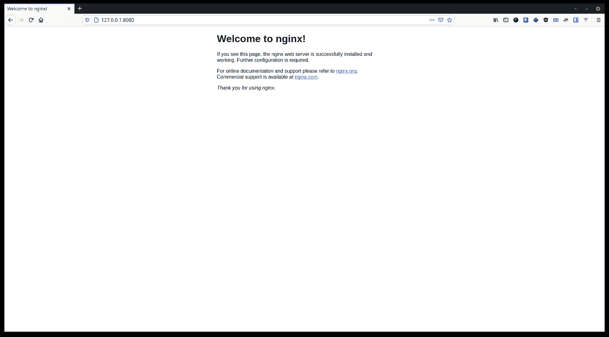

这一切都很好，但如果您想定制一个功能与官方完全一样的 NGINX 图像，但这是由您构建的，该怎么办呢？老实说，这是一个完全合理的假设。事实上，我们就这么做吧。‌

为了制作一个定制的 NGINX 图像，您必须清楚图像的最终状态。在我看来图像应该是这样的:

*   这个映像应该预先安装了 NGINX，这可以使用包管理器来完成，也可以从源代码中构建。
*   映像应该在运行时自动启动 NGINX。

这很简单。如果您已经克隆了本书中链接的项目存储库，请进入项目根目录并在其中查找名为`custom-nginx`的目录。

现在，在该目录中创建一个名为`Dockerfile`的新文件。一个`Dockerfile`是指令的集合，一旦被守护进程处理，就会产生一个映像。`Dockerfile`的内容如下:

```
FROM ubuntu:latest

EXPOSE 80

RUN apt-get update && \
    apt-get install nginx -y && \
    apt-get clean && rm -rf /var/lib/apt/lists/*

CMD ["nginx", "-g", "daemon off;"]
```

图像是多层文件，在这个文件中，你写的每一行(称为指令)为你的图像创建一层。

*   每个有效的`Dockerfile`都以一个`FROM`指令开始。此指令为结果图像设置基础图像。通过在这里将`ubuntu:latest`设置为基础映像，您可以在自定义映像中获得 Ubuntu 的所有优点，因此您可以使用类似`apt-get`命令的东西来轻松安装软件包。
*   `EXPOSE`指令用于指示需要发布的端口。使用这个指令并不意味着您不需要`--publish`端口。你仍然需要明确地使用`--publish`选项。这个`EXPOSE`指令就像是为那些试图使用你的映像运行容器的人准备的文档。它还有一些其他的用途，我不会在这里讨论。
*   `Dockerfile`中的`RUN`指令执行容器外壳内部的命令。`apt-get update && apt-get install nginx -y`命令检查更新的包版本并安装 NGINX。`apt-get clean && rm -rf /var/lib/apt/lists/*`命令用于清除包缓存，因为您不希望映像中有任何不必要的负担。这两个命令是简单的 Ubuntu 的东西，没有什么奇特的。这里的`RUN`指令是用`shell`格式写的。这些也可以写成`exec`的形式。更多信息可以咨询[官方参考](https://docs.docker.com/engine/reference/builder/#run)。
*   最后，`CMD`指令为您的图像设置默认命令。该指令在此以`exec`形式书写，包括三个独立的部分。在这里，`nginx`指的是 NGINX 可执行文件。`-g`和`daemon off`是 NGINX 的选项。将 NGINX 作为一个单独的进程在容器中运行被认为是一个最佳实践，因此使用了这个选项。`CMD`指令也可以写成`shell`形式。更多信息可以咨询[官方参考](https://docs.docker.com/engine/reference/builder/#cmd)。

现在你有了一个有效的`Dockerfile`你可以用它来构建一个图像。正如与容器相关的命令一样，可以使用以下语法发出与图像相关的命令:

```
docker image <command> <options>
```

要使用您刚刚编写的`Dockerfile`构建一个映像，请在`custom-nginx`目录中打开您的终端并执行以下命令:

```
docker image build .

# Sending build context to Docker daemon  3.584kB
# Step 1/4 : FROM ubuntu:latest
#  ---> d70eaf7277ea
# Step 2/4 : EXPOSE 80
#  ---> Running in 9eae86582ec7
# Removing intermediate container 9eae86582ec7
#  ---> 8235bd799a56
# Step 3/4 : RUN apt-get update &&     apt-get install nginx -y &&     apt-get clean && rm -rf /var/lib/apt/lists/*
#  ---> Running in a44725cbb3fa
### LONG INSTALLATION STUFF GOES HERE ###
# Removing intermediate container a44725cbb3fa
#  ---> 3066bd20292d
# Step 4/4 : CMD ["nginx", "-g", "daemon off;"]
#  ---> Running in 4792e4691660
# Removing intermediate container 4792e4691660
#  ---> 3199372aa3fc
# Successfully built 3199372aa3fc
```

为了执行映像构建，守护程序需要两条非常具体的信息。这些是`Dockerfile`的名称和构建上下文。在上面发出的命令中:

*   `docker image build`是构建图像的命令。守护进程在上下文中找到任何名为`Dockerfile`的文件。
*   结尾的`.`为这个构建设置了上下文。上下文是指在构建过程中守护程序可以访问的目录。

现在要使用这个映像运行一个容器，您可以使用`container run`命令和作为构建过程的结果而收到的映像 ID。在我的例子中，id 是由前面代码块中的`Successfully built 3199372aa3fc`行显示的`3199372aa3fc`。

```
docker container run --rm --detach --name custom-nginx-packaged --publish 8080:80 3199372aa3fc

# ec09d4e1f70c903c3b954c8d7958421cdd1ae3d079b57f929e44131fbf8069a0

docker container ls

# CONTAINER ID        IMAGE               COMMAND                  CREATED             STATUS              PORTS                  NAMES
# ec09d4e1f70c        3199372aa3fc        "nginx -g 'daemon of…"   23 seconds ago      Up 22 seconds       0.0.0.0:8080->80/tcp   custom-nginx-packaged
```

要进行验证，请访问`http://127.0.0.1:8080`，您应该会看到默认响应页面。


### 如何标记 Docker 图像

就像容器一样，您可以为图像分配自定义标识符，而不是依赖随机生成的 ID。在图像的情况下，它被称为标记而不是命名。在这种情况下使用`--tag`或`-t`选项。

该选项的一般语法如下:

```
--tag <image repository>:<image tag>
```

存储库通常被称为映像名，标签指示某个构建或版本。

以官方的 [mysql](https://hub.docker.com/_/mysql) 图片为例。如果你想运行一个使用 MySQL 特定版本的容器，比如 5.7，你可以执行`docker container run mysql:5.7`，其中`mysql`是图像库，`5.7`是标签。

为了用`custom-nginx:packaged`标记您的自定义 NGINX 图像，您可以执行以下命令:

```
docker image build --tag custom-nginx:packaged .

# Sending build context to Docker daemon  1.055MB
# Step 1/4 : FROM ubuntu:latest
#  ---> f63181f19b2f
# Step 2/4 : EXPOSE 80
#  ---> Running in 53ab370b9efc
# Removing intermediate container 53ab370b9efc
#  ---> 6d6460a74447
# Step 3/4 : RUN apt-get update &&     apt-get install nginx -y &&     apt-get clean && rm -rf /var/lib/apt/lists/*
#  ---> Running in b4951b6b48bb
### LONG INSTALLATION STUFF GOES HERE ###
# Removing intermediate container b4951b6b48bb
#  ---> fdc6cdd8925a
# Step 4/4 : CMD ["nginx", "-g", "daemon off;"]
#  ---> Running in 3bdbd2af4f0e
# Removing intermediate container 3bdbd2af4f0e
#  ---> f8837621b99d
# Successfully built f8837621b99d
# Successfully tagged custom-nginx:packaged
```

什么都不会改变，除了你现在可以用`custom-nginx:packaged`代替一些长的随机字符串来引用你的图像。

如果您在构建时忘记标记图像，或者您可能想要更改标记，您可以使用`image tag`命令来完成:

```
docker image tag <image id> <image repository>:<image tag>

## or ##

docker image tag <image repository>:<image tag> <new image repository>:<new image tag>
```

### 如何列出和删除 Docker 图像

就像`container ls`命令一样，您可以使用`image ls`命令列出本地系统中的所有映像:

```
docker image ls

# REPOSITORY     TAG        IMAGE ID       CREATED         SIZE
# <none>         <none>     3199372aa3fc   7 seconds ago   132MB
# custom-nginx   packaged   f8837621b99d   4 minutes ago   132MB
```

此处列出的图像可以使用`image rm`命令删除。通用语法如下:

```
docker image rm <image identifier>
```

标识符可以是图像 ID 或图像库。如果您使用存储库，您还必须识别标签。要删除`custom-nginx:packaged`图像，可以执行以下命令:

```
docker image rm custom-nginx:packaged

# Untagged: custom-nginx:packaged
# Deleted: sha256:f8837621b99d3388a9e78d9ce49fbb773017f770eea80470fb85e0052beae242
# Deleted: sha256:fdc6cdd8925ac25b9e0ed1c8539f96ad89ba1b21793d061e2349b62dd517dadf
# Deleted: sha256:c20e4aa46615fe512a4133089a5cd66f9b7da76366c96548790d5bf865bd49c4
# Deleted: sha256:6d6460a744475a357a2b631a4098aa1862d04510f3625feb316358536fcd8641
```

您也可以使用`image prune`命令清理所有未标记的悬挂图像，如下所示:

```
docker image prune --force

# Deleted Images:
# deleted: sha256:ba9558bdf2beda81b9acc652ce4931a85f0fc7f69dbc91b4efc4561ef7378aff
# deleted: sha256:ad9cc3ff27f0d192f8fa5fadebf813537e02e6ad472f6536847c4de183c02c81
# deleted: sha256:f1e9b82068d43c1bb04ff3e4f0085b9f8903a12b27196df7f1145aa9296c85e7
# deleted: sha256:ec16024aa036172544908ec4e5f842627d04ef99ee9b8d9aaa26b9c2a4b52baa

# Total reclaimed space: 59.19MB
```

`--force`或`-f`选项跳过任何确认问题。您也可以使用`--all`或`-a`选项删除本地注册表中所有缓存的图像。

### 如何理解 Docker 图像的多个层次

从本书一开始，我就一直在说图像是多层文件。在这一小节中，我将演示图像的各个层，以及它们如何在图像的构建过程中发挥重要作用。

在这个演示中，我将使用前一小节中的`custom-nginx:packaged`图像。

要可视化图像的许多层，您可以使用`image history`命令。`custom-nginx:packaged`图像的各层可以如下可视化:

```
docker image history custom-nginx:packaged

# IMAGE               CREATED             CREATED BY                                      SIZE                COMMENT
# 7f16387f7307        5 minutes ago       /bin/sh -c #(nop)  CMD ["nginx" "-g" "daemon…   0B                             
# 587c805fe8df        5 minutes ago       /bin/sh -c apt-get update &&     apt-get ins…   60MB                
# 6fe4e51e35c1        6 minutes ago       /bin/sh -c #(nop)  EXPOSE 80                    0B                  
# d70eaf7277ea        17 hours ago        /bin/sh -c #(nop)  CMD ["/bin/bash"]            0B                  
# <missing>           17 hours ago        /bin/sh -c mkdir -p /run/systemd && echo 'do…   7B                  
# <missing>           17 hours ago        /bin/sh -c [ -z "$(apt-get indextargets)" ]     0B                  
# <missing>           17 hours ago        /bin/sh -c set -xe   && echo '#!/bin/sh' > /…   811B                
# <missing>           17 hours ago        /bin/sh -c #(nop) ADD file:435d9776fdd3a1834…   72.9MB
```

这张图片有八层。最上面的一层是最新的一层，随着你往下走，这些层会变老。最上层是您通常用于运行容器的层。

现在，让我们仔细看看从图像`d70eaf7277ea`到`7f16387f7307`的图像。我将忽略最下面的四层，这里的`IMAGE`是`<missing>`，因为它们与我们无关。

*   `d70eaf7277ea`由`/bin/sh -c #(nop)  CMD ["/bin/bash"]`创建，表示 Ubuntu 内部的默认 shell 已经加载成功。
*   `6fe4e51e35c1`是由`/bin/sh -c #(nop)  EXPOSE 80`创建的，这是您代码中的第二条指令。
*   `587c805fe8df`是由`/bin/sh -c apt-get update && apt-get install nginx -y && apt-get clean && rm -rf /var/lib/apt/lists/*`创建的，这是您代码中的第三条指令。你也可以看到这个图像有一个`60MB`的大小，因为在执行这个指令的过程中所有必需的包都被安装了。
*   最后最上面的层`7f16387f7307`由`/bin/sh -c #(nop)  CMD ["nginx", "-g", "daemon off;"]`创建，它为这个图像设置默认命令。

如您所见，该图像由许多只读层组成，每一层都记录了由某些指令触发的一组新的状态变化。当您使用图像启动容器时，您会在其他层的顶部获得一个新的可写层。

每次使用 Docker 时都会出现这种分层现象，这是由一个叫做联合文件系统的惊人技术概念实现的。在这里，联合意味着集合论中的联合。据[维基百科](https://en.wikipedia.org/wiki/UnionFS)—

> 它允许不同文件系统(称为分支)的文件和目录透明地重叠在一起，形成一个统一的文件系统。在合并的分支内具有相同路径的目录的内容将一起出现在新的虚拟文件系统内的单个合并的目录中。

通过利用这个概念，Docker 可以避免数据重复，并可以使用以前创建的层作为以后构建的缓存。这就产生了紧凑、高效的图像，可以在任何地方使用。

### 如何从源代码构建 NGINX

在前一小节中，您学习了`FROM`、`EXPOSE`、`RUN`和`CMD`指令。在这一小节中，您将学到更多关于其他指令的内容。

在这一小节中，您将再次创建一个自定义 NGINX 映像。但问题是，您将从源代码构建 NGINX，而不是像前面的例子那样使用一些包管理器(如`apt-get`)来安装它。

为了从源代码构建 NGINX，首先需要 NGINX 的源代码。如果您已经克隆了我的项目库，您将会在`custom-nginx`目录中看到一个名为`nginx-1.19.2.tar.gz`的文件。您将使用这个归档文件作为构建 NGINX 的源代码。

在开始编写代码之前，让我们先规划一下流程。这次的图像创建过程可以通过七个步骤来完成。这些措施如下:

*   获得构建应用程序的良好基础映像，如 [ubuntu](https://hub.docker.com/_/ubuntu) 。
*   在基本映像上安装必要的构建依赖项。
*   将`nginx-1.19.2.tar.gz`文件复制到图像中。
*   提取归档文件的内容并将其删除。
*   使用`make`工具配置构建、编译和安装程序。
*   去掉提取的源代码。
*   运行`nginx`可执行文件。

现在你有了计划，让我们开始打开旧的`Dockerfile`并更新它的内容如下:

```
FROM ubuntu:latest

RUN apt-get update && \
    apt-get install build-essential\ 
                    libpcre3 \
                    libpcre3-dev \
                    zlib1g \
                    zlib1g-dev \
                    libssl1.1 \
                    libssl-dev \
                    -y && \
    apt-get clean && rm -rf /var/lib/apt/lists/*

COPY nginx-1.19.2.tar.gz .

RUN tar -xvf nginx-1.19.2.tar.gz && rm nginx-1.19.2.tar.gz

RUN cd nginx-1.19.2 && \
    ./configure \
        --sbin-path=/usr/bin/nginx \
        --conf-path=/etc/nginx/nginx.conf \
        --error-log-path=/var/log/nginx/error.log \
        --http-log-path=/var/log/nginx/access.log \
        --with-pcre \
        --pid-path=/var/run/nginx.pid \
        --with-http_ssl_module && \
    make && make install

RUN rm -rf /nginx-1.19.2

CMD ["nginx", "-g", "daemon off;"]
```

如您所见，`Dockerfile`中的代码反映了我上面谈到的七个步骤。

*   `FROM`指令将 Ubuntu 设置为基础映像，为构建任何应用程序提供了理想的环境。
*   `RUN`指令安装从源代码构建 NGINX 所需的标准包。
*   这里的`COPY`指令是新的。该指令负责复制镜像中的`nginx-1.19.2.tar.gz`文件。`COPY`指令的通用语法是`COPY <source> <destination>`，其中源文件在您的本地文件系统中，目的文件在您的映像中。作为目的地的`.`是指图像内的工作目录，默认为`/`，除非另有设置。
*   这里的第二个`RUN`指令使用`tar`从档案中提取内容，并在之后将其删除。
*   存档文件包含一个名为`nginx-1.19.2`的目录，其中包含源代码。所以在下一步，您必须在该目录中执行构建过程。你可以阅读[如何从源代码安装软件…然后删除它](https://itsfoss.com/install-software-from-source-code/)这篇文章来了解更多关于这个主题的信息。
*   构建和安装完成后，使用`rm`命令删除`nginx-1.19.2`目录。
*   在最后一步，像以前一样以单进程模式启动 NGINX。

现在，要使用这段代码构建一个映像，请执行以下命令:

```
docker image build --tag custom-nginx:built .

# Step 1/7 : FROM ubuntu:latest
#  ---> d70eaf7277ea
# Step 2/7 : RUN apt-get update &&     apt-get install build-essential                    libpcre3                     libpcre3-dev                     zlib1g                     zlib1g-dev                     libssl-dev                     -y &&     apt-get clean && rm -rf /var/lib/apt/lists/*
#  ---> Running in 2d0aa912ea47
### LONG INSTALLATION STUFF GOES HERE ###
# Removing intermediate container 2d0aa912ea47
#  ---> cbe1ced3da11
# Step 3/7 : COPY nginx-1.19.2.tar.gz .
#  ---> 7202902edf3f
# Step 4/7 : RUN tar -xvf nginx-1.19.2.tar.gz && rm nginx-1.19.2.tar.gz
 ---> Running in 4a4a95643020
### LONG EXTRACTION STUFF GOES HERE ###
# Removing intermediate container 4a4a95643020
#  ---> f9dec072d6d6
# Step 5/7 : RUN cd nginx-1.19.2 &&     ./configure         --sbin-path=/usr/bin/nginx         --conf-path=/etc/nginx/nginx.conf         --error-log-path=/var/log/nginx/error.log         --http-log-path=/var/log/nginx/access.log         --with-pcre         --pid-path=/var/run/nginx.pid         --with-http_ssl_module &&     make && make install
#  ---> Running in b07ba12f921e
### LONG CONFIGURATION AND BUILD STUFF GOES HERE ###
# Removing intermediate container b07ba12f921e
#  ---> 5a877edafd8b
# Step 6/7 : RUN rm -rf /nginx-1.19.2
#  ---> Running in 947e1d9ba828
# Removing intermediate container 947e1d9ba828
#  ---> a7702dc7abb7
# Step 7/7 : CMD ["nginx", "-g", "daemon off;"]
#  ---> Running in 3110c7fdbd57
# Removing intermediate container 3110c7fdbd57
#  ---> eae55f7369d3
# Successfully built eae55f7369d3
# Successfully tagged custom-nginx:built
```

这段代码还不错，但是有些地方我们可以改进。

*   您可以使用`ARG`指令创建一个参数，而不是像`nginx-1.19.2.tar.gz`那样对文件名进行硬编码。这样，您就可以通过更改参数来更改版本或文件名。
*   您可以让守护进程在构建过程中下载文件，而不是手动下载归档文件。还有一种类似于`COPY`的指令叫做`ADD`指令，它能够从互联网上添加文件。

打开`Dockerfile`文件并更新其内容，如下所示:

```
FROM ubuntu:latest

RUN apt-get update && \
    apt-get install build-essential\ 
                    libpcre3 \
                    libpcre3-dev \
                    zlib1g \
                    zlib1g-dev \
                    libssl1.1 \
                    libssl-dev \
                    -y && \
    apt-get clean && rm -rf /var/lib/apt/lists/*

ARG FILENAME="nginx-1.19.2"
ARG EXTENSION="tar.gz"

ADD https://nginx.org/download/${FILENAME}.${EXTENSION} .

RUN tar -xvf ${FILENAME}.${EXTENSION} && rm ${FILENAME}.${EXTENSION}

RUN cd ${FILENAME} && \
    ./configure \
        --sbin-path=/usr/bin/nginx \
        --conf-path=/etc/nginx/nginx.conf \
        --error-log-path=/var/log/nginx/error.log \
        --http-log-path=/var/log/nginx/access.log \
        --with-pcre \
        --pid-path=/var/run/nginx.pid \
        --with-http_ssl_module && \
    make && make install

RUN rm -rf /${FILENAME}}

CMD ["nginx", "-g", "daemon off;"]
```

除了在第 13、14 行添加了一条名为`ARG`的新指令以及在第 16 行使用了`ADD`指令之外，这段代码与前面的代码块几乎完全相同。对更新代码的解释如下:

*   `ARG`指令让你像在其他语言中一样声明变量。稍后可以使用`${argument name}`语法访问这些变量或参数。这里，我将文件名`nginx-1.19.2`和文件扩展名`tar.gz`放在两个独立的参数中。这样，我只需在一个地方做些改变，就可以在 NGINX 的新版本或存档格式之间切换。在上面的代码中，我已经为变量添加了默认值。变量值也可以作为`image build`命令的选项传递。更多详情可以咨询[官方参考](https://docs.docker.com/engine/reference/builder/#arg)。
*   在`ADD`指令中，我已经使用上面声明的参数动态地形成了下载 URL。在构建过程中，`https://nginx.org/download/${FILENAME}.${EXTENSION}`行将导致类似于`https://nginx.org/download/nginx-1.19.2.tar.gz`的结果。由于有了`ARG`指令，您只需在一个地方更改文件版本或扩展名即可。
*   默认情况下，`ADD`指令不提取从互联网上获得的文件，因此在第 18 行使用了`tar`。

其余的代码几乎没有变化。你现在应该能自己理解论点的用法了。最后，让我们尝试从更新后的代码中构建一个映像。

```
docker image build --tag custom-nginx:built .

# Step 1/9 : FROM ubuntu:latest
#  ---> d70eaf7277ea
# Step 2/9 : RUN apt-get update &&     apt-get install build-essential                    libpcre3                     libpcre3-dev                     zlib1g                     zlib1g-dev                     libssl-dev                     -y &&     apt-get clean && rm -rf /var/lib/apt/lists/*
#  ---> cbe1ced3da11
### LONG INSTALLATION STUFF GOES HERE ###
# Step 3/9 : ARG FILENAME="nginx-1.19.2"
#  ---> Running in 33b62a0e9ffb
# Removing intermediate container 33b62a0e9ffb
#  ---> fafc0aceb9c8
# Step 4/9 : ARG EXTENSION="tar.gz"
#  ---> Running in 5c32eeb1bb11
# Removing intermediate container 5c32eeb1bb11
#  ---> 36efdf6efacc
# Step 5/9 : ADD https://nginx.org/download/${FILENAME}.${EXTENSION} .
# Downloading [==================================================>]  1.049MB/1.049MB
#  ---> dba252f8d609
# Step 6/9 : RUN tar -xvf ${FILENAME}.${EXTENSION} && rm ${FILENAME}.${EXTENSION}
#  ---> Running in 2f5b091b2125
### LONG EXTRACTION STUFF GOES HERE ###
# Removing intermediate container 2f5b091b2125
#  ---> 2c9a325d74f1
# Step 7/9 : RUN cd ${FILENAME} &&     ./configure         --sbin-path=/usr/bin/nginx         --conf-path=/etc/nginx/nginx.conf         --error-log-path=/var/log/nginx/error.log         --http-log-path=/var/log/nginx/access.log         --with-pcre         --pid-path=/var/run/nginx.pid         --with-http_ssl_module &&     make && make install
#  ---> Running in 11cc82dd5186
### LONG CONFIGURATION AND BUILD STUFF GOES HERE ###
# Removing intermediate container 11cc82dd5186
#  ---> 6c122e485ec8
# Step 8/9 : RUN rm -rf /${FILENAME}}
#  ---> Running in 04102366960b
# Removing intermediate container 04102366960b
#  ---> 6bfa35420a73
# Step 9/9 : CMD ["nginx", "-g", "daemon off;"]
#  ---> Running in 63ee44b571bb
# Removing intermediate container 63ee44b571bb
#  ---> 4ce79556db1b
# Successfully built 4ce79556db1b
# Successfully tagged custom-nginx:built
```

现在，您应该能够使用`custom-nginx:built`映像运行容器了。

```
docker container run --rm --detach --name custom-nginx-built --publish 8080:80 custom-nginx:built

# 90ccdbc0b598dddc4199451b2f30a942249d85a8ed21da3c8d14612f17eed0aa

docker container ls

# CONTAINER ID        IMAGE                COMMAND                  CREATED             STATUS              PORTS                  NAMES
# 90ccdbc0b598        custom-nginx:built   "nginx -g 'daemon of…"   2 minutes ago       Up 2 minutes        0.0.0.0:8080->80/tcp   custom-nginx-built
```

使用`custom-nginx:built-v2`图像的容器已成功运行。现在应该可以在`http://127.0.0.1:8080`到达集装箱。


这是来自 NGINX 的可靠的默认响应页面。您可以访问[官方参考](https://docs.docker.com/engine/reference/builder/)网站，了解更多可用说明。

### 如何优化 Docker 图像

我们在上一小节中构建的图像是功能性的，但没有优化。为了证明我的观点，我们来看看图像的大小，使用`image ls`命令:

```
docker image ls

# REPOSITORY         TAG       IMAGE ID       CREATED          SIZE
# custom-nginx       built     1f3aaf40bb54   16 minutes ago   343MB
```

对于只包含 NGINX 的图像来说，这太多了。如果你打开官方图片并检查它的大小，你会发现它有多小:

```
docker image pull nginx:stable

# stable: Pulling from library/nginx
# a076a628af6f: Pull complete 
# 45d7b5d3927d: Pull complete 
# 5e326fece82e: Pull complete 
# 30c386181b68: Pull complete 
# b15158e9ebbe: Pull complete 
# Digest: sha256:ebd0fd56eb30543a9195280eb81af2a9a8e6143496accd6a217c14b06acd1419
# Status: Downloaded newer image for nginx:stable
# docker.io/library/nginx:stable

docker image ls

# REPOSITORY         TAG       IMAGE ID       CREATED          SIZE
# custom-nginx       built     1f3aaf40bb54   25 minutes ago   343MB
# nginx              stable    b9e1dc12387a   11 days ago      133MB
```

为了找出根本原因，我们先来看看`Dockerfile`:

```
FROM ubuntu:latest

RUN apt-get update && \
    apt-get install build-essential\ 
                    libpcre3 \
                    libpcre3-dev \
                    zlib1g \
                    zlib1g-dev \
                    libssl1.1 \
                    libssl-dev \
                    -y && \
    apt-get clean && rm -rf /var/lib/apt/lists/*

ARG FILENAME="nginx-1.19.2"
ARG EXTENSION="tar.gz"

ADD https://nginx.org/download/${FILENAME}.${EXTENSION} .

RUN tar -xvf ${FILENAME}.${EXTENSION} && rm ${FILENAME}.${EXTENSION}

RUN cd ${FILENAME} && \
    ./configure \
        --sbin-path=/usr/bin/nginx \
        --conf-path=/etc/nginx/nginx.conf \
        --error-log-path=/var/log/nginx/error.log \
        --http-log-path=/var/log/nginx/access.log \
        --with-pcre \
        --pid-path=/var/run/nginx.pid \
        --with-http_ssl_module && \
    make && make install

RUN rm -rf /${FILENAME}}

CMD ["nginx", "-g", "daemon off;"]
```

正如您在第 3 行看到的,`RUN`指令安装了很多东西。尽管这些包对于从源代码构建 NGINX 是必需的，但对于运行它却不是必需的。

在我们安装的 6 个包中，只有两个是运行 NGINX 所必需的。这些是`libpcre3`和`zlib1g`。因此，更好的办法是在构建过程完成后卸载其他包。

为此，请按如下方式更新您的`Dockerfile`:

```
FROM ubuntu:latest

EXPOSE 80

ARG FILENAME="nginx-1.19.2"
ARG EXTENSION="tar.gz"

ADD https://nginx.org/download/${FILENAME}.${EXTENSION} .

RUN apt-get update && \
    apt-get install build-essential \ 
                    libpcre3 \
                    libpcre3-dev \
                    zlib1g \
                    zlib1g-dev \
                    libssl1.1 \
                    libssl-dev \
                    -y && \
    tar -xvf ${FILENAME}.${EXTENSION} && rm ${FILENAME}.${EXTENSION} && \
    cd ${FILENAME} && \
    ./configure \
        --sbin-path=/usr/bin/nginx \
        --conf-path=/etc/nginx/nginx.conf \
        --error-log-path=/var/log/nginx/error.log \
        --http-log-path=/var/log/nginx/access.log \
        --with-pcre \
        --pid-path=/var/run/nginx.pid \
        --with-http_ssl_module && \
    make && make install && \
    cd / && rm -rfv /${FILENAME} && \
    apt-get remove build-essential \ 
                    libpcre3-dev \
                    zlib1g-dev \
                    libssl-dev \
                    -y && \
    apt-get autoremove -y && \
    apt-get clean && rm -rf /var/lib/apt/lists/*

CMD ["nginx", "-g", "daemon off;"]
```

正如您所看到的，在第 10 行，一条单独的`RUN`指令完成了所有必要的繁重工作。事件的确切链条如下:

*   从第 10 行到第 17 行，所有必需的包都被安装了。
*   在第 18 行，源代码被提取，下载的归档文件被删除。
*   从第 19 行到第 28 行，NGINX 被配置、构建并安装在系统上。
*   在第 29 行，从下载的归档文件中提取的文件被删除。
*   从第 30 行到第 36 行，所有不必要的包都被卸载，缓存被清除。运行 NGINX 需要`libpcre3`和`zlib1g`包，所以我们保留了它们。

你可能会问，为什么我要在一条`RUN`指令中做这么多的工作，而不是像我们以前做的那样把它们很好地分成多条指令。把他们分开是个错误。

如果你安装软件包，然后在单独的`RUN`指令中删除它们，它们将存在于映像的单独层中。虽然最终图像不会移除包，但它们的大小仍会添加到最终图像中，因为它们存在于组成图像的一个层中。因此，请确保在一个图层上进行这些更改。

让我们用这个`Dockerfile`创建一个图像，看看有什么不同。

```
docker image build --tag custom-nginx:built .

# Sending build context to Docker daemon  1.057MB
# Step 1/7 : FROM ubuntu:latest
#  ---> f63181f19b2f
# Step 2/7 : EXPOSE 80
#  ---> Running in 006f39b75964
# Removing intermediate container 006f39b75964
#  ---> 6943f7ef9376
# Step 3/7 : ARG FILENAME="nginx-1.19.2"
#  ---> Running in ffaf89078594
# Removing intermediate container ffaf89078594
#  ---> 91b5cdb6dabe
# Step 4/7 : ARG EXTENSION="tar.gz"
#  ---> Running in d0f5188444b6
# Removing intermediate container d0f5188444b6
#  ---> 9626f941ccb2
# Step 5/7 : ADD https://nginx.org/download/${FILENAME}.${EXTENSION} .
# Downloading [==================================================>]  1.049MB/1.049MB
#  ---> a8e8dcca1be8
# Step 6/7 : RUN apt-get update &&     apt-get install build-essential                     libpcre3                     libpcre3-dev                     zlib1g                     zlib1g-dev                     libssl-dev                     -y &&     tar -xvf ${FILENAME}.${EXTENSION} && rm ${FILENAME}.${EXTENSION} &&     cd ${FILENAME} &&     ./configure         --sbin-path=/usr/bin/nginx         --conf-path=/etc/nginx/nginx.conf         --error-log-path=/var/log/nginx/error.log         --http-log-path=/var/log/nginx/access.log         --with-pcre         --pid-path=/var/run/nginx.pid         --with-http_ssl_module &&     make && make install &&     cd / && rm -rfv /${FILENAME} &&     apt-get remove build-essential                     libpcre3-dev                     zlib1g-dev                     libssl-dev                     -y &&     apt-get autoremove -y &&     apt-get clean && rm -rf /var/lib/apt/lists/*
#  ---> Running in e5675cad1260
### LONG INSTALLATION AND BUILD STUFF GOES HERE ###
# Removing intermediate container e5675cad1260
#  ---> dc7e4161f975
# Step 7/7 : CMD ["nginx", "-g", "daemon off;"]
#  ---> Running in b579e4600247
# Removing intermediate container b579e4600247
#  ---> 512aa6a95a93
# Successfully built 512aa6a95a93
# Successfully tagged custom-nginx:built

docker image ls

# REPOSITORY         TAG       IMAGE ID       CREATED              SIZE
# custom-nginx       built     512aa6a95a93   About a minute ago   81.6MB
# nginx              stable    b9e1dc12387a   11 days ago          133MB
```

如你所见，图片大小从 343MB 变成了 81.6MB。官方图片是 133MB。这是一个非常优化的构建，但是我们可以在下一小节中更进一步。

### 拥抱阿尔卑斯 Linux

如果你已经摆弄容器有一段时间了，你可能听说过一个叫做 [Alpine Linux](https://alpinelinux.org/) 的东西。这是一个功能齐全的 [Linux](https://en.wikipedia.org/wiki/Linux) 发行版，就像 [Ubuntu](https://ubuntu.com/) 、 [Debian](https://www.debian.org/) 或 [Fedora](https://getfedora.org/) 。

但是 Alpine 的好处是它是围绕`musl` `libc`和`busybox`建造的，并且很轻便。最新的 [ubuntu](https://hub.docker.com/_/ubuntu) 图片重约 28MB， [alpine](https://hub.docker.com/_/alpine) 为 2.8MB

除了轻量级的特性，Alpine 也是安全的，并且比其他发行版更适合创建容器。

尽管不像其他商业发行版那样用户友好，但向 Alpine 的过渡仍然非常简单。在这一小节中，你将学习使用阿尔卑斯山图像作为基础来重新创建`custom-nginx`图像。

打开您的`Dockerfile`，按如下方式更新其内容:

```
FROM alpine:latest

EXPOSE 80

ARG FILENAME="nginx-1.19.2"
ARG EXTENSION="tar.gz"

ADD https://nginx.org/download/${FILENAME}.${EXTENSION} .

RUN apk add --no-cache pcre zlib && \
    apk add --no-cache \
            --virtual .build-deps \
            build-base \ 
            pcre-dev \
            zlib-dev \
            openssl-dev && \
    tar -xvf ${FILENAME}.${EXTENSION} && rm ${FILENAME}.${EXTENSION} && \
    cd ${FILENAME} && \
    ./configure \
        --sbin-path=/usr/bin/nginx \
        --conf-path=/etc/nginx/nginx.conf \
        --error-log-path=/var/log/nginx/error.log \
        --http-log-path=/var/log/nginx/access.log \
        --with-pcre \
        --pid-path=/var/run/nginx.pid \
        --with-http_ssl_module && \
    make && make install && \
    cd / && rm -rfv /${FILENAME} && \
    apk del .build-deps

CMD ["nginx", "-g", "daemon off;"]
```

除了几处改动之外，代码几乎完全相同。我将列出这些变化，并边走边解释:

*   我们不使用`apt-get install`来安装包，而是使用`apk add`。`--no-cache`选项意味着下载的包不会被缓存。同样，我们将使用`apk del`而不是`apt-get remove`来卸载软件包。
*   `apk add`命令的`--virtual`选项用于将一堆包捆绑成一个虚拟包，以便于管理。仅构建程序所需的包被标记为`.build-deps`，然后通过执行`apk del .build-deps`命令在第 29 行将其移除。你可以在官方文件中了解更多关于[的信息。](https://docs.alpinelinux.org/user-handbook/0.1a/Working/apk.html#_virtuals)
*   这里的包名有点不同。通常每个 Linux 发行版都有自己的包存储库，每个人都可以在那里搜索包。如果您知道某个任务所需的包，那么您可以直接到指定的发行版存储库并搜索它。你可以在这里查找 Alpine Linux 软件包。

现在使用这个`Dockerfile`构建一个新的图像，看看文件大小的不同:

```
docker image build --tag custom-nginx:built .

# Sending build context to Docker daemon  1.055MB
# Step 1/7 : FROM alpine:latest
#  ---> 7731472c3f2a
# Step 2/7 : EXPOSE 80
#  ---> Running in 8336cfaaa48d
# Removing intermediate container 8336cfaaa48d
#  ---> d448a9049d01
# Step 3/7 : ARG FILENAME="nginx-1.19.2"
#  ---> Running in bb8b2eae9d74
# Removing intermediate container bb8b2eae9d74
#  ---> 87ca74f32fbe
# Step 4/7 : ARG EXTENSION="tar.gz"
#  ---> Running in aa09627fe48c
# Removing intermediate container aa09627fe48c
#  ---> 70cb557adb10
# Step 5/7 : ADD https://nginx.org/download/${FILENAME}.${EXTENSION} .
# Downloading [==================================================>]  1.049MB/1.049MB
#  ---> b9790ce0c4d6
# Step 6/7 : RUN apk add --no-cache pcre zlib &&     apk add --no-cache             --virtual .build-deps             build-base             pcre-dev             zlib-dev             openssl-dev &&     tar -xvf ${FILENAME}.${EXTENSION} && rm ${FILENAME}.${EXTENSION} &&     cd ${FILENAME} &&     ./configure         --sbin-path=/usr/bin/nginx         --conf-path=/etc/nginx/nginx.conf         --error-log-path=/var/log/nginx/error.log         --http-log-path=/var/log/nginx/access.log         --with-pcre         --pid-path=/var/run/nginx.pid         --with-http_ssl_module &&     make && make install &&     cd / && rm -rfv /${FILENAME} &&     apk del .build-deps
#  ---> Running in 0b301f64ffc1
### LONG INSTALLATION AND BUILD STUFF GOES HERE ###
# Removing intermediate container 0b301f64ffc1
#  ---> dc7e4161f975
# Step 7/7 : CMD ["nginx", "-g", "daemon off;"]
#  ---> Running in b579e4600247
# Removing intermediate container b579e4600247
#  ---> 3e186a3c6830
# Successfully built 3e186a3c6830
# Successfully tagged custom-nginx:built

docker image ls

# REPOSITORY         TAG       IMAGE ID       CREATED         SIZE
# custom-nginx       built     3e186a3c6830   8 seconds ago   12.8MB
```

ubuntu 版本是 81.6MB，alpine 版本下降到 12.8MB，这是一个巨大的进步。除了包管理器之外，Alpine 和 Ubuntu 还有其他一些不同之处，但没什么大不了的。你只要在遇到困难的时候上网搜索就可以了。

### 如何创建可执行的 Docker 映像

在上一节中，您使用了 [fhsinchy/rmbyext](https://hub.docker.com/r/fhsinchy/rmbyext) 图像。在本节中，您将学习如何创建这样一个可执行映像。

首先，打开您克隆本书附带的存储库的目录。`rmbyext`应用程序的代码驻留在同名的子目录中。

在你开始做`Dockerfile`之前，花点时间计划一下最终的输出应该是什么。在我看来应该是这样的:

*   该映像应该预先安装了 Python。
*   它应该包含我的`rmbyext`脚本的副本。
*   应该设置一个执行脚本的工作目录。
*   应该将`rmbyext`脚本设置为入口点，这样图像就可以将扩展名作为参数。

要构建上述映像，请采取以下步骤:

*   获得运行 Python 脚本的良好基础映像，如 [python](https://hub.docker.com/_/python) 。
*   将工作目录设置为易于访问的目录。
*   安装 Git，以便可以从我的 GitHub 存储库中安装该脚本。
*   使用 Git 和 pip 安装脚本。
*   去掉构建中不必要的包。
*   将`rmbyext`设置为该图像的入口点。

现在，在`rmbyext`目录中创建一个新的`Dockerfile`，并将以下代码放入其中:

```
FROM python:3-alpine

WORKDIR /zone

RUN apk add --no-cache git && \
    pip install git+https://github.com/fhsinchy/rmbyext.git#egg=rmbyext && \
    apk del git

ENTRYPOINT [ "rmbyext" ]
```

对该文件中指令的解释如下:

*   `FROM`指令将 [python](https://hub.docker.com/_/python) 设置为基础映像，为运行 python 脚本创造了理想的环境。`3-alpine`标签表明您想要 Python 3 的 Alpine 版本。
*   这里的`WORKDIR`指令将默认工作目录设置为`/zone`。这里工作目录的名称完全是随机的。我发现 zone 是个合适的名字，你可以用任何你想用的名字。
*   假设`rmbyext`脚本是从 GitHub 安装的，`git`是一个安装时间依赖项。第 5 行的`RUN`指令安装`git`，然后使用 Git 和 pip 安装`rmbyext`脚本。之后也去掉了`git`。
*   最后在第 9 行，`ENTRYPOINT`指令将`rmbyext`脚本设置为该图像的入口点。

在整个文件中，第 9 行是将这个看似正常的图像变成可执行图像的魔法。现在，要构建映像，您可以执行以下命令:

```
docker image build --tag rmbyext .

# Sending build context to Docker daemon  2.048kB
# Step 1/4 : FROM python:3-alpine
# 3-alpine: Pulling from library/python
# 801bfaa63ef2: Already exists 
# 8723b2b92bec: Already exists 
# 4e07029ccd64: Already exists 
# 594990504179: Already exists 
# 140d7fec7322: Already exists 
# Digest: sha256:7492c1f615e3651629bd6c61777e9660caa3819cf3561a47d1d526dfeee02cf6
# Status: Downloaded newer image for python:3-alpine
#  ---> d4d4f50f871a
# Step 2/4 : WORKDIR /zone
#  ---> Running in 454374612a91
# Removing intermediate container 454374612a91
#  ---> 7f7e49bc98d2
# Step 3/4 : RUN apk add --no-cache git &&     pip install git+https://github.com/fhsinchy/rmbyext.git#egg=rmbyext &&     apk del git
#  ---> Running in 27e2e96dc95a
### LONG INSTALLATION STUFF GOES HERE ###
# Removing intermediate container 27e2e96dc95a
#  ---> 3c7389432e36
# Step 4/4 : ENTRYPOINT [ "rmbyext" ]
#  ---> Running in f239bbea1ca6
# Removing intermediate container f239bbea1ca6
#  ---> 1746b0cedbc7
# Successfully built 1746b0cedbc7
# Successfully tagged rmbyext:latest

docker image ls

# REPOSITORY         TAG        IMAGE ID       CREATED         SIZE
# rmbyext            latest     1746b0cedbc7   4 minutes ago   50.9MB
```

在这里，我没有在图像名称后面提供任何标记，所以默认情况下图像被标记为`latest`。您应该能够像在上一节中看到的那样运行映像。请记住参考您设置的实际图像名称，而不是这里的`fhsinchy/rmbyext`。

### 如何在线分享你的 Docker 图片

现在你知道如何制作图像，是时候与世界分享了。在线分享图片很容易。你所需要的只是在任何一个在线注册处有一个账户。我将在这里使用 [Docker Hub](https://hub.docker.com/) 。

导航到[注册](https://hub.docker.com/signup)页面并创建一个免费账户。一个免费账户允许你托管无限的公共库和一个私有库。

创建帐户后，您必须使用 docker CLI 登录。因此，打开您的终端并执行以下命令来实现这一点:

```
docker login

# Login with your Docker ID to push and pull images from Docker Hub. If you don't have a Docker ID, head over to https://hub.docker.com to create one.
# Username: fhsinchy
# Password: 
# WARNING! Your password will be stored unencrypted in /home/fhsinchy/.docker/config.json.
# Configure a credential helper to remove this warning. See
# https://docs.docker.com/engine/reference/commandline/login/#credentials-store
#
# Login Succeeded
```

系统会提示您输入用户名和密码。如果输入正确，您应该可以成功登录您的帐户。

为了在网上分享图片，必须给图片加标签。您已经在前面的小节中学习了标记。为了提醒您，`--tag`或`-t`选项的一般语法如下:

```
--tag <image repository>:<image tag>
```

举个例子，我们在网上分享一下`custom-nginx`图。为此，在`custom-nginx`项目目录中打开一个新的终端窗口。

要在线分享一张图片，你必须按照`<docker hub username>/<image name>:<image tag>`语法给它加标签。我的用户名是`fhsinchy`,所以命令看起来像这样:

```
docker image build --tag fhsinchy/custom-nginx:latest --file Dockerfile.built .

# Step 1/9 : FROM ubuntu:latest
#  ---> d70eaf7277ea
# Step 2/9 : RUN apt-get update &&     apt-get install build-essential                    libpcre3                     libpcre3-dev                     zlib1g                     zlib1g-dev                     libssl-dev                     -y &&     apt-get clean && rm -rf /var/lib/apt/lists/*
#  ---> cbe1ced3da11
### LONG INSTALLATION STUFF GOES HERE ###
# Step 3/9 : ARG FILENAME="nginx-1.19.2"
#  ---> Running in 33b62a0e9ffb
# Removing intermediate container 33b62a0e9ffb
#  ---> fafc0aceb9c8
# Step 4/9 : ARG EXTENSION="tar.gz"
#  ---> Running in 5c32eeb1bb11
# Removing intermediate container 5c32eeb1bb11
#  ---> 36efdf6efacc
# Step 5/9 : ADD https://nginx.org/download/${FILENAME}.${EXTENSION} .
# Downloading [==================================================>]  1.049MB/1.049MB
#  ---> dba252f8d609
# Step 6/9 : RUN tar -xvf ${FILENAME}.${EXTENSION} && rm ${FILENAME}.${EXTENSION}
#  ---> Running in 2f5b091b2125
### LONG EXTRACTION STUFF GOES HERE ###
# Removing intermediate container 2f5b091b2125
#  ---> 2c9a325d74f1
# Step 7/9 : RUN cd ${FILENAME} &&     ./configure         --sbin-path=/usr/bin/nginx         --conf-path=/etc/nginx/nginx.conf         --error-log-path=/var/log/nginx/error.log         --http-log-path=/var/log/nginx/access.log         --with-pcre         --pid-path=/var/run/nginx.pid         --with-http_ssl_module &&     make && make install
#  ---> Running in 11cc82dd5186
### LONG CONFIGURATION AND BUILD STUFF GOES HERE ###
# Removing intermediate container 11cc82dd5186
#  ---> 6c122e485ec8
# Step 8/9 : RUN rm -rf /${FILENAME}}
#  ---> Running in 04102366960b
# Removing intermediate container 04102366960b
#  ---> 6bfa35420a73
# Step 9/9 : CMD ["nginx", "-g", "daemon off;"]
#  ---> Running in 63ee44b571bb
# Removing intermediate container 63ee44b571bb
#  ---> 4ce79556db1b
# Successfully built 4ce79556db1b
# Successfully tagged fhsinchy/custom-nginx:latest
```

在这个命令中，`fhsinchy/custom-nginx`是图像库，`latest`是标签。图像名称可以是您想要的任何名称，一旦您上传了图像，就不能更改。标签可以在你需要的任何时候改变，并且通常反映软件的版本或者不同种类的构建。

以`node`图为例。`node:lts`镜像指的是 Node.js 的长期支持版本，而`node:lts-alpine`版本指的是为 Alpine Linux 构建的 Node.js 版本，比普通版本小得多。

如果您不给图像添加任何标签，它将被自动标记为`latest`。但这并不意味着`latest`标签会一直指向最新版本。如果出于某种原因，你明确地将一个旧版本的图像标记为`latest`，那么 Docker 不会做任何额外的努力来交叉检查。

一旦构建了映像，您就可以通过执行以下命令来上传它:

```
docker image push <image repository>:<image tag>
```

所以在我的例子中，命令如下:

```
docker image push fhsinchy/custom-nginx:latest

# The push refers to repository [docker.io/fhsinchy/custom-nginx]
# 4352b1b1d9f5: Pushed 
# a4518dd720bd: Pushed 
# 1d756dc4e694: Pushed 
# d7a7e2b6321a: Pushed 
# f6253634dc78: Mounted from library/ubuntu 
# 9069f84dbbe9: Mounted from library/ubuntu 
# bacd3af13903: Mounted from library/ubuntu 
# latest: digest: sha256:ffe93440256c9edb2ed67bf3bba3c204fec3a46a36ac53358899ce1a9eee497a size: 1788
```

根据图像大小，上传可能需要一些时间。完成后，您应该能够在您的中心个人资料页面中找到该图像。

## 如何将 JavaScript 应用程序容器化

既然你已经对如何创建图像有了一些了解，是时候做一些更相关的事情了。

在这一小节中，您将使用您在上一小节中使用的 [fhsinchy/hello-dock](https://hub.docker.com/r/fhsinchy/hello-dock) 图像的源代码。在将这个非常简单的应用程序容器化的过程中，您将了解到卷和多阶段构建，这是 Docker 中最重要的两个概念。

### 如何编写开发 Dockerfile 文件

首先，打开您克隆本书附带的存储库的目录。`hello-dock`应用程序的代码驻留在同名的子目录中。

这是一个非常简单的 JavaScript 项目，由 [vitejs/vite](https://github.com/vitejs/vite) 项目提供支持。不过不要担心，您不需要了解 JavaScript 或 vite 就可以完成这一小节。对 [Node.js](https://nodejs.org/) 和 [npm](https://www.npmjs.com/) 有个基本了解就够了。

就像您在上一小节中完成的任何其他项目一样，您将首先制定一个您希望该应用程序如何运行的计划。在我看来，计划应该如下:

*   获得运行 JavaScript 应用程序的良好基础映像，如[节点](https://hub.docker.com/_/node)。
*   在映像中设置默认的工作目录。
*   将`package.json`文件复制到图像中。
*   安装必要的依赖项。
*   复制项目文件的其余部分。
*   通过执行`npm run dev`命令启动`vite`开发服务器。

这个计划应该总是来自于你正在容器化的应用程序的开发者。如果您自己就是开发人员，那么您应该已经对这个应用程序需要如何运行有了正确的理解。

现在，如果你把上面提到的计划放在`Dockerfile.dev`中，文件应该如下所示:

```
FROM node:lts-alpine

EXPOSE 3000

USER node

RUN mkdir -p /home/node/app

WORKDIR /home/node/app

COPY ./package.json .
RUN npm install

COPY . .

CMD [ "npm", "run", "dev" ]
```

对该代码的解释如下:

*   这里的`FROM`指令将正式的 Node.js 映像设置为基础，为您提供运行任何 JavaScript 应用程序所需的 Node.js 的所有优点。标签表明你想使用 Alpine 版本，图像的长期支持版本。可以在[节点](https://hub.docker.com/_/node)中心页面上找到该图像的可用标签和必要文档。
*   `USER`指令将图像的默认用户设置为`node`。默认情况下，Docker 以 root 用户身份运行容器。但是根据 [Docker 和 Node.js 最佳实践](https://github.com/nodejs/docker-node/blob/master/docs/BestPractices.md)的说法，这可能会造成安全威胁。因此，尽可能以非 root 用户身份运行是一个更好的主意。节点映像带有一个名为`node`的非根用户，您可以使用`USER`指令将其设置为默认用户。
*   `RUN mkdir -p /home/node/app`指令在`node`用户的主目录中创建一个名为`app`的目录。默认情况下，Linux 中任何非 root 用户的主目录通常是`/home/<user name>`。
*   然后，`WORKDIR`指令将默认工作目录设置为新创建的`/home/node/app`目录。默认情况下，任何图像的工作目录都是根目录。你不希望任何不必要的文件喷遍你的根目录，是吗？因此，你可以将默认的工作目录改为更合理的目录，比如`/home/node/app`或者任何你喜欢的目录。该工作目录将适用于任何后续的`COPY`、`ADD`、`RUN`和`CMD`指令。
*   这里的`COPY`指令复制了`package.json`文件，该文件包含关于该应用程序所有必要依赖项的信息。`RUN`指令执行`npm install`命令，这是在 Node.js 项目中使用`package.json`文件安装依赖项的默认命令。末尾的`.`代表工作目录。
*   第二个`COPY`指令将主机文件系统的当前目录(`.`)中的剩余内容复制到映像中的工作目录(`.`)。
*   最后，这里的`CMD`指令设置了这个图像的默认命令，它是以`exec`形式写成的`npm run dev`。
*   默认情况下，`vite`开发服务器运行在端口`3000`上，添加一个`EXPOSE`命令似乎是个好主意，所以就这样吧。

现在，要从这个`Dockerfile.dev`构建一个映像，您可以执行以下命令:

```
docker image build --file Dockerfile.dev --tag hello-dock:dev .

# Step 1/7 : FROM node:lts
#  ---> b90fa0d7cbd1
# Step 2/7 : EXPOSE 3000
#  ---> Running in 722d639badc7
# Removing intermediate container 722d639badc7
#  ---> e2a8aa88790e
# Step 3/7 : WORKDIR /app
#  ---> Running in 998e254b4d22
# Removing intermediate container 998e254b4d22
#  ---> 6bd4c42892a4
# Step 4/7 : COPY ./package.json .
#  ---> 24fc5164a1dc
# Step 5/7 : RUN npm install
#  ---> Running in 23b4de3f930b
### LONG INSTALLATION STUFF GOES HERE ###
# Removing intermediate container 23b4de3f930b
#  ---> c17ecb19a210
# Step 6/7 : COPY . .
#  ---> afb6d9a1bc76
# Step 7/7 : CMD [ "npm", "run", "dev" ]
#  ---> Running in a7ff529c28fe
# Removing intermediate container a7ff529c28fe
#  ---> 1792250adb79
# Successfully built 1792250adb79
# Successfully tagged hello-dock:dev
```

如果文件名不是`Dockerfile`，你必须使用`--file`选项显式地传递文件名。通过执行以下命令，可以使用此映像运行容器:

```
docker container run \
    --rm \
    --detach \
    --publish 3000:3000 \
    --name hello-dock-dev \
    hello-dock:dev

# 21b9b1499d195d85e81f0e8bce08f43a64b63d589c5f15cbbd0b9c0cb07ae268
```

现在访问`http://127.0.0.1:3000`来看看运行中的`hello-dock`应用程序。


祝贺您在容器中运行了第一个真实世界的应用程序。你刚刚写的代码还可以，但是有一个大问题，还有一些地方需要改进。让我们先从问题开始。

### 如何在 Docker 中使用绑定挂载

如果您以前使用过任何前端 JavaScript 框架，您应该知道这些框架中的开发服务器通常都带有热重载特性。也就是说，如果您对代码进行了更改，服务器将会重新加载，并立即自动反映您所做的任何更改。

但是，如果您现在对代码进行任何更改，您将看到浏览器中运行的应用程序不会发生任何变化。这是因为您正在对本地文件系统中的代码进行更改，但是您在浏览器中看到的应用程序驻留在容器文件系统中。


为了解决这个问题，您可以再次使用一个[绑定挂载](https://docs.docker.com/storage/bind-mounts/)。使用绑定挂载，您可以轻松地在容器中挂载一个本地文件系统目录。绑定挂载可以直接从容器内部引用本地文件系统，而不是复制本地文件系统。


这样，您对本地源代码所做的任何更改都会立即反映在容器中，触发`vite`开发服务器的热重新加载特性。对容器内文件系统的更改也将反映在您的本地文件系统上。

您已经在[使用可执行映像](#working-with-executable-images)小节中了解到，绑定挂载可以使用`container run`或`container start`命令的`--volume`或`-v`选项来创建。提醒您一下，通用语法如下:

```
--volume <local file system directory absolute path>:<container file system directory absolute path>:<read write access>
```

停止先前启动的`hello-dock-dev`容器，并通过执行以下命令启动一个新容器:

```
docker container run \
    --rm \
    --publish 3000:3000 \
    --name hello-dock-dev \
    --volume $(pwd):/home/node/app \
    hello-dock:dev

# sh: 1: vite: not found
# npm ERR! code ELIFECYCLE
# npm ERR! syscall spawn
# npm ERR! file sh
# npm ERR! errno ENOENT
# npm ERR! hello-dock@0.0.0 dev: `vite`
# npm ERR! spawn ENOENT
# npm ERR!
# npm ERR! Failed at the hello-dock@0.0.0 dev script.
# npm ERR! This is probably not a problem with npm. There is likely additional logging output above.
# npm WARN Local package.json exists, but node_modules missing, did you mean to install?
```

请记住，我省略了`--detach`选项，这是为了演示非常重要的一点。如您所见，应用程序现在根本没有运行。

这是因为尽管使用卷解决了热重装的问题，但它引入了另一个问题。如果您以前使用过 Node.js，您可能知道 Node.js 项目的依赖项位于项目根目录的`node_modules`目录中。

既然您已经将项目根目录作为容器内的一个卷挂载到了本地文件系统上，那么容器内的内容将与包含所有依赖项的`node_modules`目录一起被替换。这意味着`vite`包已经丢失。

### 如何在 Docker 中使用匿名卷

使用匿名卷可以解决这个问题。匿名卷与绑定装载完全相同，只是您不需要在这里指定源目录。创建匿名卷的一般语法如下:

```
--volume <container file system directory absolute path>:<read write access>
```

因此，启动包含两个卷的`hello-dock`容器的最终命令应该如下所示:

```
docker container run \
    --rm \
    --detach \
    --publish 3000:3000 \
    --name hello-dock-dev \
    --volume $(pwd):/home/node/app \
    --volume /home/node/app/node_modules \
    hello-dock:dev

# 53d1cfdb3ef148eb6370e338749836160f75f076d0fbec3c2a9b059a8992de8b
```

在这里，Docker 将从容器中取出整个`node_modules`目录，并把它放到由主机文件系统上的 Docker 守护进程管理的其他目录中，并将该目录作为`node_modules`装入容器中。

### 如何在 Docker 中执行多阶段构建

到目前为止，在本节中，您已经构建了一个在开发模式下运行 JavaScript 应用程序的映像。现在，如果您想在生产模式下构建映像，会出现一些新的挑战。

在开发模式中,`npm run serve`命令启动一个开发服务器，为用户提供应用程序。该服务器不仅提供文件，还提供热重装功能。

在生产模式中，`npm run build`命令将所有的 JavaScript 代码编译成一些静态的 HTML、CSS 和 JavaScript 文件。要运行这些文件，您不需要节点或任何其他运行时依赖项。你所需要的只是一个像`nginx`这样的服务器。

要创建应用程序在生产模式下运行的映像，可以采取以下步骤:

*   使用`node`作为基础映像并构建应用程序。
*   在节点映像中安装`nginx`,并使用它来服务静态文件。

这种方法完全有效。但问题是,`node`图像很大，而且它携带的大部分内容对于服务静态文件是不必要的。对于这种情况，更好的方法如下:

*   使用`node`图像作为基础，构建应用程序。
*   将使用`node`图像创建的文件复制到`nginx`图像。
*   基于`nginx`创建最终图像，并丢弃所有`node`相关的东西。

这样，您的图像只包含需要的文件，变得非常方便。

这种方法是一个多阶段的构建。要执行这样的构建，在您的`hello-dock`项目目录中创建一个新的`Dockerfile`,并将以下内容放入其中:

```
FROM node:lts-alpine as builder

WORKDIR /app

COPY ./package.json ./
RUN npm install

COPY . .
RUN npm run build

FROM nginx:stable-alpine

EXPOSE 80

COPY --from=builder /app/dist /usr/share/nginx/html
```

正如你所看到的,`Dockerfile`看起来很像你之前的版本，只是有些奇怪。对该文件的解释如下:

*   第 1 行使用`node:lts-alpine`作为基础映像开始构建的第一阶段。`as builder`语法为这个阶段指定一个名称，以便以后可以引用。
*   从第 3 行到第 9 行，都是你以前见过很多次的标准素材。`RUN npm run build`命令实际上编译了整个应用程序，并将其放入`/app/dist`目录，其中`/app`是工作目录，`/dist`是`vite`应用程序的默认输出目录。
*   第 11 行使用`nginx:stable-alpine`作为基础映像开始构建的第二阶段。
*   NGINX 服务器默认运行在端口 80 上，所以添加了行`EXPOSE 80`。
*   最后一行是一条`COPY`指令。`--from=builder`部分表示您想要从`builder`阶段复制一些文件。之后，这是一个标准的复制指令，其中`/app/dist`是源，`/usr/share/nginx/html`是目的。这里使用的目的地是 NGINX 的默认站点路径，所以你放在那里的任何静态文件都会被自动提供。

如您所见，生成的图像是一个`nginx`基础图像，仅包含运行应用程序所需的文件。要构建此映像，请执行以下命令:

```
docker image build --tag hello-dock:prod .

# Step 1/9 : FROM node:lts-alpine as builder
#  ---> 72aaced1868f
# Step 2/9 : WORKDIR /app
#  ---> Running in e361c5c866dd
# Removing intermediate container e361c5c866dd
#  ---> 241b4b97b34c
# Step 3/9 : COPY ./package.json ./
#  ---> 6c594c5d2300
# Step 4/9 : RUN npm install
#  ---> Running in 6dfabf0ee9f8
# npm WARN deprecated fsevents@2.1.3: Please update to v 2.2.x
#
# > esbuild@0.8.29 postinstall /app/node_modules/esbuild
# > node install.js
#
# npm notice created a lockfile as package-lock.json. You should commit this file.
# npm WARN optional SKIPPING OPTIONAL DEPENDENCY: fsevents@~2.1.2 (node_modules/chokidar/node_modules/fsevents):
# npm WARN notsup SKIPPING OPTIONAL DEPENDENCY: Unsupported platform for fsevents@2.1.3: wanted {"os":"darwin","arch":"any"} (current: {"os":"linux","arch":"x64"})
# npm WARN hello-dock@0.0.0 No description
# npm WARN hello-dock@0.0.0 No repository field.
# npm WARN hello-dock@0.0.0 No license field.
#
# added 327 packages from 301 contributors and audited 329 packages in 35.971s
#
# 26 packages are looking for funding
#   run `npm fund` for details
#
# found 0 vulnerabilities
#
# Removing intermediate container 6dfabf0ee9f8
#  ---> 21fd1b065314
# Step 5/9 : COPY . .
#  ---> 43243f95bff7
# Step 6/9 : RUN npm run build
#  ---> Running in 4d918cf18584
#
# > hello-dock@0.0.0 build /app
# > vite build
#
# - Building production bundle...
#
# [write] dist/index.html 0.39kb, brotli: 0.15kb
# [write] dist/_assets/docker-handbook-github.3adb4865.webp 12.32kb
# [write] dist/_assets/index.eabcae90.js 42.56kb, brotli: 15.40kb
# [write] dist/_assets/style.0637ccc5.css 0.16kb, brotli: 0.10kb
# - Building production bundle...
#
# Build completed in 1.71s.
#
# Removing intermediate container 4d918cf18584
#  ---> 187fb3e82d0d
# Step 7/9 : EXPOSE 80
#  ---> Running in b3aab5cf5975
# Removing intermediate container b3aab5cf5975
#  ---> d6fcc058cfda
# Step 8/9 : FROM nginx:stable-alpine
# stable: Pulling from library/nginx
# 6ec7b7d162b2: Already exists 
# 43876acb2da3: Pull complete 
# 7a79edd1e27b: Pull complete 
# eea03077c87e: Pull complete 
# eba7631b45c5: Pull complete 
# Digest: sha256:2eea9f5d6fff078ad6cc6c961ab11b8314efd91fb8480b5d054c7057a619e0c3
# Status: Downloaded newer image for nginx:stable
#  ---> 05f64a802c26
# Step 9/9 : COPY --from=builder /app/dist /usr/share/nginx/html
#  ---> 8c6dfc34a10d
# Successfully built 8c6dfc34a10d
# Successfully tagged hello-dock:prod
```

一旦构建了映像，您可以通过执行以下命令来运行新的容器:

```
docker container run \
    --rm \
    --detach \
    --name hello-dock-prod \
    --publish 8080:80 \
    hello-dock:prod

# 224aaba432bb09aca518fdd0365875895c2f5121eb668b2e7b2d5a99c019b953
```

正在运行的应用程序应在`http://127.0.0.1:8080`可用:


在这里你可以看到我的`hello-dock`应用程序的所有优点。如果您正在构建具有大量依赖项的大型应用程序，多阶段构建会非常有用。如果配置得当，分多个阶段构建的映像可以非常优化和紧凑。

### 如何忽略不必要的文件

如果你使用`git`已经有一段时间了，你可能知道项目中的`.gitignore`文件。这些文件包含要从存储库中排除的文件和目录的列表。

嗯，Docker 也有类似的概念。`.dockerignore`文件包含要从映像构建中排除的文件和目录列表。你可以在`hello-dock`目录中找到一个预先创建的`.dockerignore`文件。

```
.git
*Dockerfile*
*docker-compose*
node_modules
```

这个`.dockerignore`文件必须在构建上下文中。这里提到的文件和目录将被`COPY`指令忽略。但是如果你进行绑定挂载，`.dockerignore`文件将不会有任何效果。我已经在项目库中必要的地方添加了`.dockerignore`文件。

## Docker 中的网络操作基础

到目前为止，在本书中，您只使用了单个容器项目。但是在现实生活中，您必须处理的大多数项目都有不止一个容器。老实说，如果你不理解容器隔离的细微差别，使用一堆容器会有点困难。

因此，在本书的这一部分，您将熟悉 Docker 的基本网络，并且将实际操作一个小型的多容器项目。

在上一节中，您已经了解到容器是隔离的环境。现在考虑一个场景，您有一个由 [Express.js](https://expressjs.com/) 支持的`notes-api`应用程序和一个运行在两个独立容器中的 [PostgreSQL](https://www.postgresql.org/) 数据库服务器。

这两个容器彼此完全隔离，对彼此的存在浑然不觉。**那么如何将两者联系起来呢？那不是一个挑战吗？** ‌

你可能会想到这个问题的两种可能的解决方案。它们如下:

*   使用公开的端口访问数据库服务器。
*   使用数据库服务器的 IP 地址和默认端口访问数据库服务器。

第一个包括从`postgres`容器中暴露一个端口，并且`notes-api`将通过该端口进行连接。假设`postgres`容器暴露的端口是 5432。现在，如果您尝试从`notes-api`容器内部连接到`127.0.0.1:5432`，您会发现`notes-api`根本找不到数据库服务器。

原因是，当你在`notes-api`容器中说`127.0.0.1`时，你只是简单地指那个容器的`localhost`,而且仅仅是那个容器。那里根本不存在`postgres`服务器。结果，`notes-api`应用程序无法连接。

您可能想到的第二个解决方案是使用`container inspect`命令找到`postgres`容器的确切 IP 地址，并将其用于端口。假设`postgres`容器的名称是`notes-api-db-server`，您可以通过执行以下命令轻松获得 IP 地址:

```
docker container inspect --format='{{range .NetworkSettings.Networks}} {{.IPAddress}} {{end}}' notes-api-db-server

#  172.17.0.2
```

现在给定`postgres`的默认端口是`5432`，您可以通过从`notes-api`容器连接到`172.17.0.2:5432`来非常容易地访问数据库服务器。

这种方法也存在问题。不建议使用 IP 地址来引用容器。此外，如果容器被破坏并重新创建，IP 地址可能会改变。跟踪这些不断变化的 IP 地址可能会非常忙乱。

现在我已经排除了原问题可能的错误答案，正确答案是，**你把它们放在一个用户定义的桥接网络下连接起来。**

### Docker 网络基础

Docker 中的网络是另一个逻辑对象，就像容器和图像一样。就像其他两个一样，在`docker network`组下有过多的命令用于操纵网络。

要列出系统中的网络，请执行以下命令:

```
docker network ls

# NETWORK ID     NAME      DRIVER    SCOPE
# c2e59f2b96bd   bridge    bridge    local
# 124dccee067f   host      host      local
# 506e3822bf1f   none      null      local
```

您应该会在系统中看到三个网络。现在看看这里表格的`DRIVER`栏。这些驱动程序可以被视为网络类型。

默认情况下，Docker 有五个网络驱动程序。它们如下:

*   `bridge`-Docker 中默认的网络驱动。当多个容器在标准模式下运行并且需要相互通信时，可以使用这种方法。
*   `host` -完全移除网络隔离。在`host`网络下运行的任何容器基本上都连接到主机系统的网络上。
*   这个驱动程序完全禁用容器的网络。我还没有找到这方面的任何用例。
*   这是用来连接计算机上的多个 Docker 守护进程的，超出了本书的范围。
*   `macvlan` -允许给容器分配 MAC 地址，使它们像网络中的物理设备一样工作。

也有第三方插件，允许你集成 Docker 与专门的网络堆栈。在上面提到的五个中，你将只使用本书中的`bridge`网络驱动。

### 如何在 Docker 中创建用户自定义的桥

在您开始创建自己的网桥之前，我想花点时间来讨论 Docker 附带的默认网桥网络。让我们首先列出您系统上的所有网络:

```
docker network ls

# NETWORK ID     NAME      DRIVER    SCOPE
# c2e59f2b96bd   bridge    bridge    local
# 124dccee067f   host      host      local
# 506e3822bf1f   none      null      local
```

如你所见，Docker 附带了一个名为`bridge`的默认桥接网络。您运行的任何容器都将自动连接到这个桥接网络:

```
docker container run --rm --detach --name hello-dock --publish 8080:80 fhsinchy/hello-dock
# a37f723dad3ae793ce40f97eb6bb236761baa92d72a2c27c24fc7fda0756657d

docker network inspect --format='{{range .Containers}}{{.Name}}{{end}}' bridge
# hello-dock
```

连接到默认桥接网络的容器可以使用 IP 地址相互通信，我在前面的小节中已经不鼓励这样做了。

然而，用户定义的网桥比默认网桥有一些额外的特性。根据关于该主题的官方[文档](https://docs.docker.com/network/bridge/#differences-between-user-defined-bridges-and-the-default-bridge)，一些值得注意的额外功能如下:

*   **用户定义的网桥在容器之间提供自动 DNS 解析:**这意味着连接到同一网络的容器可以使用容器名称相互通信。因此，如果您有两个名为`notes-api`和`notes-db`的容器，API 容器将能够使用`notes-db`名称连接到数据库容器。
*   **用户定义的网桥提供了更好的隔离:**默认情况下，所有容器都连接到默认网桥网络，这可能会导致它们之间的冲突。将容器附加到用户定义的桥可以确保更好的隔离。
*   **容器可以动态地连接到用户定义的网络或从用户定义的网络断开:**在容器的生命周期中，您可以动态地连接或断开它与用户定义的网络的连接。要从默认网桥网络中删除容器，您需要停止该容器，并使用不同的网络选项重新创建它。

既然您已经对用户定义的网络有了相当多的了解，那么是时候为自己创建一个了。可使用`network create`命令创建一个网络。该命令的通用语法如下:

```
docker network create <network name>
```

要创建名为`skynet`的网络，执行以下命令:

```
docker network create skynet

# 7bd5f351aa892ac6ec15fed8619fc3bbb95a7dcdd58980c28304627c8f7eb070

docker network ls

# NETWORK ID     NAME     DRIVER    SCOPE
# be0cab667c4b   bridge   bridge    local
# 124dccee067f   host     host      local
# 506e3822bf1f   none     null      local
# 7bd5f351aa89   skynet   bridge    local
```

如您所见，已经创建了一个具有给定名称的新网络。当前没有容器连接到此网络。在下一小节中，您将学习如何将容器连接到网络。

### 如何在 Docker 中将容器连接到网络

将容器连接到网络主要有两种方式。首先，您可以使用 network connect 命令将容器连接到网络。该命令的通用语法如下:

```
docker network connect <network identifier> <container identifier>
```

要将`hello-dock`容器连接到`skynet`网络，您可以执行以下命令:

```
docker network connect skynet hello-dock

docker network inspect --format='{{range .Containers}} {{.Name}} {{end}}' skynet

#  hello-dock

docker network inspect --format='{{range .Containers}} {{.Name}} {{end}}' bridge

#  hello-dock
```

从两个`network inspect`命令的输出可以看出，`hello-dock`容器现在同时连接到了`skynet`和默认的`bridge`网络。

将容器连接到网络的第二种方式是使用`container run`或`container create`命令的`--network`选项。该选项的一般语法如下:

```
--network <network identifier>
```

要运行连接到同一网络的另一个`hello-dock`容器，您可以执行以下命令:

```
docker container run --network skynet --rm --name alpine-box -it alpine sh

# lands you into alpine linux shell

/ # ping hello-dock

# PING hello-dock (172.18.0.2): 56 data bytes
# 64 bytes from 172.18.0.2: seq=0 ttl=64 time=0.191 ms
# 64 bytes from 172.18.0.2: seq=1 ttl=64 time=0.103 ms
# 64 bytes from 172.18.0.2: seq=2 ttl=64 time=0.139 ms
# 64 bytes from 172.18.0.2: seq=3 ttl=64 time=0.142 ms
# 64 bytes from 172.18.0.2: seq=4 ttl=64 time=0.146 ms
# 64 bytes from 172.18.0.2: seq=5 ttl=64 time=0.095 ms
# 64 bytes from 172.18.0.2: seq=6 ttl=64 time=0.181 ms
# 64 bytes from 172.18.0.2: seq=7 ttl=64 time=0.138 ms
# 64 bytes from 172.18.0.2: seq=8 ttl=64 time=0.158 ms
# 64 bytes from 172.18.0.2: seq=9 ttl=64 time=0.137 ms
# 64 bytes from 172.18.0.2: seq=10 ttl=64 time=0.145 ms
# 64 bytes from 172.18.0.2: seq=11 ttl=64 time=0.138 ms
# 64 bytes from 172.18.0.2: seq=12 ttl=64 time=0.085 ms

--- hello-dock ping statistics ---
13 packets transmitted, 13 packets received, 0% packet loss
round-trip min/avg/max = 0.085/0.138/0.191 ms
```

正如您所看到的，从`alpine-box`容器内部运行`ping hello-dock`是可行的，因为两个容器都在同一个用户定义的桥接网络下，并且自动 DNS 解析正在工作。

但是请记住，为了让自动 DNS 解析工作，您必须为容器指定自定义名称。使用随机生成的名称不起作用。

### 如何在 Docker 中从网络中分离容器

在前一小节中，您学习了将容器附加到网络。在这一小节中，您将了解如何分离它们。

您可以使用`network disconnect`命令来完成该任务。该命令的通用语法如下:

```
docker network disconnect <network identifier> <container identifier>
```

要从`skynet`网络中分离`hello-dock`容器，您可以执行以下命令:

```
docker network disconnect skynet hello-dock
```

就像`network connect`命令一样，`network disconnect`命令不给出任何输出。

### 如何摆脱 Docker 中的网络

就像 Docker 中的其他逻辑对象一样，可以使用`network rm`命令删除网络。该命令的通用语法如下:

```
docker network rm <network identifier>
```

要从系统中删除`skynet`网络，您可以执行以下命令:

```
docker network rm skynet
```

您也可以使用`network prune`命令从系统中删除任何未使用的网络。该命令还有`-f`或`--force`和`-a`或`--all`选项。

## 如何容器化多容器 JavaScript 应用程序

现在，您已经在 Docker 中学习了足够多的网络知识，在本节中，您将学习如何将一个成熟的多容器项目容器化。您将使用的项目是一个简单的由 Express.js 和 PostgreSQL 支持的`notes-api`。

在这个项目中，总共有两个容器，您必须使用网络连接它们。除此之外，您还将了解环境变量和命名卷等概念。所以事不宜迟，让我们直接开始吧。

### 如何运行数据库服务器

这个项目中的数据库服务器是一个简单的 PostgreSQL 服务器，使用官方的 [postgres](https://hub.docker.com/_/postgres) 映像。

根据官方文档，为了使用这个映像运行容器，您必须提供`POSTGRES_PASSWORD`环境变量。除此之外，我还将使用`POSTGRES_DB`环境变量为默认数据库提供一个名称。默认情况下，PostgreSQL 监听端口`5432`，因此您也需要发布该端口。

要运行数据库服务器，您可以执行以下命令:

```
docker container run \
    --detach \
    --name=notes-db \
    --env POSTGRES_DB=notesdb \
    --env POSTGRES_PASSWORD=secret \
    --network=notes-api-network \
    postgres:12

# a7b287d34d96c8e81a63949c57b83d7c1d71b5660c87f5172f074bd1606196dc

docker container ls

# CONTAINER ID   IMAGE         COMMAND                  CREATED              STATUS              PORTS      NAMES
# a7b287d34d96   postgres:12   "docker-entrypoint.s…"   About a minute ago   Up About a minute   5432/tcp   notes-db
```

`container run`和`container create`命令的`--env`选项可用于向容器提供环境变量。如您所见，数据库容器已经成功创建，现在正在运行。

虽然容器在运行，但是有一个小问题。像 PostgreSQL、MongoDB 和 MySQL 这样的数据库将它们的数据保存在一个目录中。PostgreSQL 使用容器内的`/var/lib/postgresql/data`目录来持久化数据。

如果容器因为某种原因被破坏了呢？你会丢失所有数据。要解决这个问题，可以使用命名卷。

### 如何在 Docker 中使用命名卷

之前，您已经使用了绑定装载和匿名卷。命名卷与匿名卷非常相似，只是您可以使用其名称来引用命名卷。

卷也是 Docker 中的逻辑对象，可以使用命令行操作。`volume create`命令可用于创建命名卷。

该命令的通用语法如下:

```
docker volume create <volume name>
```

要创建名为`notes-db-data`的卷，您可以执行以下命令:

```
docker volume create notes-db-data

# notes-db-data

docker volume ls

# DRIVER    VOLUME NAME
# local     notes-db-data
```

现在可以将该卷安装到`notes-db`容器内的`/var/lib/postgresql/data`。为此，停止并移除`notes-db`容器:

```
docker container stop notes-db

# notes-db

docker container rm notes-db

# notes-db
```

现在运行一个新的容器，并使用`--volume`或`-v`选项分配卷。

```
docker container run \
    --detach \
    --volume notes-db-data:/var/lib/postgresql/data \
    --name=notes-db \
    --env POSTGRES_DB=notesdb \
    --env POSTGRES_PASSWORD=secret \
    --network=notes-api-network \
    postgres:12

# 37755e86d62794ed3e67c19d0cd1eba431e26ab56099b92a3456908c1d346791
```

现在检查`notes-db`容器以确保安装成功:

```
docker container inspect --format='{{range .Mounts}} {{ .Name }} {{end}}' notes-db

#  notes-db-data
```

现在，数据将安全地存储在`notes-db-data`卷中，并可在将来重复使用。这里也可以使用绑定挂载来代替命名卷，但是在这种情况下我更喜欢使用命名卷。

### 如何在 Docker 中从容器中访问日志

为了查看容器中的日志，您可以使用`container logs`命令。该命令的通用语法如下:

```
docker container logs <container identifier>
```

要从`notes-db`容器中访问日志，您可以执行以下命令:

```
docker container logs notes-db

# The files belonging to this database system will be owned by user "postgres".
# This user must also own the server process.

# The database cluster will be initialized with locale "en_US.utf8".
# The default database encoding has accordingly been set to "UTF8".
# The default text search configuration will be set to "english".
#
# Data page checksums are disabled.
#
# fixing permissions on existing directory /var/lib/postgresql/data ... ok
# creating subdirectories ... ok
# selecting dynamic shared memory implementation ... posix
# selecting default max_connections ... 100
# selecting default shared_buffers ... 128MB
# selecting default time zone ... Etc/UTC
# creating configuration files ... ok
# running bootstrap script ... ok
# performing post-bootstrap initialization ... ok
# syncing data to disk ... ok
#
#
# Success. You can now start the database server using:
#
#     pg_ctl -D /var/lib/postgresql/data -l logfile start
#
# initdb: warning: enabling "trust" authentication for local connections
# You can change this by editing pg_hba.conf or using the option -A, or
# --auth-local and --auth-host, the next time you run initdb.
# waiting for server to start....2021-01-25 13:39:21.613 UTC [47] LOG:  starting PostgreSQL 12.5 (Debian 12.5-1.pgdg100+1) on x86_64-pc-linux-gnu, compiled by gcc (Debian 8.3.0-6) 8.3.0, 64-bit
# 2021-01-25 13:39:21.621 UTC [47] LOG:  listening on Unix socket "/var/run/postgresql/.s.PGSQL.5432"
# 2021-01-25 13:39:21.675 UTC [48] LOG:  database system was shut down at 2021-01-25 13:39:21 UTC
# 2021-01-25 13:39:21.685 UTC [47] LOG:  database system is ready to accept connections
#  done
# server started
# CREATE DATABASE
#
#
# /usr/local/bin/docker-entrypoint.sh: ignoring /docker-entrypoint-initdb.d/*
#
# 2021-01-25 13:39:22.008 UTC [47] LOG:  received fast shutdown request
# waiting for server to shut down....2021-01-25 13:39:22.015 UTC [47] LOG:  aborting any active transactions
# 2021-01-25 13:39:22.017 UTC [47] LOG:  background worker "logical replication launcher" (PID 54) exited with exit code 1
# 2021-01-25 13:39:22.017 UTC [49] LOG:  shutting down
# 2021-01-25 13:39:22.056 UTC [47] LOG:  database system is shut down
#  done
# server stopped
#
# PostgreSQL init process complete; ready for start up.
#
# 2021-01-25 13:39:22.135 UTC [1] LOG:  starting PostgreSQL 12.5 (Debian 12.5-1.pgdg100+1) on x86_64-pc-linux-gnu, compiled by gcc (Debian 8.3.0-6) 8.3.0, 64-bit
# 2021-01-25 13:39:22.136 UTC [1] LOG:  listening on IPv4 address "0.0.0.0", port 5432
# 2021-01-25 13:39:22.136 UTC [1] LOG:  listening on IPv6 address "::", port 5432
# 2021-01-25 13:39:22.147 UTC [1] LOG:  listening on Unix socket "/var/run/postgresql/.s.PGSQL.5432"
# 2021-01-25 13:39:22.177 UTC [75] LOG:  database system was shut down at 2021-01-25 13:39:22 UTC
# 2021-01-25 13:39:22.190 UTC [1] LOG:  database system is ready to accept connections
```

从第 57 行的文本可以看出，数据库已经启动，可以接受来自外部的连接。该命令还有`--follow`或`-f`选项，允许您将控制台附加到日志输出并获得连续的文本流。

### 如何在 Docker 中创建网络并连接数据库服务器

正如您在上一节中了解到的，容器必须连接到用户定义的桥接网络，以便使用容器名称相互通信。为此，在您的系统中创建一个名为`notes-api-network`的网络:

```
docker network create notes-api-network
```

现在通过执行以下命令将`notes-db`容器连接到这个网络:

```
docker network connect notes-api-network notes-db
```

### 如何写 Dockerfile 文件

转到克隆项目代码的目录。在那里，进入`notes-api/api`目录，并创建一个新的`Dockerfile`。将以下代码放入文件中:

```
# stage one
FROM node:lts-alpine as builder

# install dependencies for node-gyp
RUN apk add --no-cache python make g++

WORKDIR /app

COPY ./package.json .
RUN npm install --only=prod

# stage two
FROM node:lts-alpine

EXPOSE 3000
ENV NODE_ENV=production

USER node
RUN mkdir -p /home/node/app
WORKDIR /home/node/app

COPY . .
COPY --from=builder /app/node_modules  /home/node/app/node_modules

CMD [ "node", "bin/www" ]
```

这是一个多阶段构建。第一阶段用于使用`node-gyp`构建和安装依赖项，第二阶段用于运行应用程序。我将简要介绍这些步骤:

*   Stage 1 使用`node:lts-alpine`作为其基础，并使用`builder`作为艺名。
*   在第 5 行，我们安装了`python`、`make`和`g++`。`node-gyp`工具需要运行这三个包。
*   在第 7 行，我们将`/app`目录设置为`WORKDIR`。
*   在第 9 行和第 10 行，我们将`package.json`文件复制到`WORKDIR`并安装所有的依赖项。
*   阶段 2 也使用`node-lts:alpine`作为基础。
*   在第 16 行，我们将环境变量`NODE_ENV`设置为`production`。这对于 API 的正常运行非常重要。
*   从第 18 行到第 20 行，我们将默认用户设置为`node`，创建`/home/node/app`目录，并将其设置为`WORKDIR`。
*   在第 22 行，我们复制了所有的项目文件，在第 23 行，我们从`builder`阶段复制了`node_modules`目录。该目录包含运行应用程序所需的所有构建的依赖项。
*   在第 25 行，我们设置了默认命令。

要从这个`Dockerfile`构建一个映像，您可以执行以下命令:

```
docker image build --tag notes-api .

# Sending build context to Docker daemon  37.38kB
# Step 1/14 : FROM node:lts-alpine as builder
#  ---> 471e8b4eb0b2
# Step 2/14 : RUN apk add --no-cache python make g++
#  ---> Running in 5f20a0ecc04b
# fetch http://dl-cdn.alpinelinux.org/alpine/v3.11/main/x86_64/APKINDEX.tar.gz
# fetch http://dl-cdn.alpinelinux.org/alpine/v3.11/community/x86_64/APKINDEX.tar.gz
# (1/21) Installing binutils (2.33.1-r0)
# (2/21) Installing gmp (6.1.2-r1)
# (3/21) Installing isl (0.18-r0)
# (4/21) Installing libgomp (9.3.0-r0)
# (5/21) Installing libatomic (9.3.0-r0)
# (6/21) Installing mpfr4 (4.0.2-r1)
# (7/21) Installing mpc1 (1.1.0-r1)
# (8/21) Installing gcc (9.3.0-r0)
# (9/21) Installing musl-dev (1.1.24-r3)
# (10/21) Installing libc-dev (0.7.2-r0)
# (11/21) Installing g++ (9.3.0-r0)
# (12/21) Installing make (4.2.1-r2)
# (13/21) Installing libbz2 (1.0.8-r1)
# (14/21) Installing expat (2.2.9-r1)
# (15/21) Installing libffi (3.2.1-r6)
# (16/21) Installing gdbm (1.13-r1)
# (17/21) Installing ncurses-terminfo-base (6.1_p20200118-r4)
# (18/21) Installing ncurses-libs (6.1_p20200118-r4)
# (19/21) Installing readline (8.0.1-r0)
# (20/21) Installing sqlite-libs (3.30.1-r2)
# (21/21) Installing python2 (2.7.18-r0)
# Executing busybox-1.31.1-r9.trigger
# OK: 212 MiB in 37 packages
# Removing intermediate container 5f20a0ecc04b
#  ---> 637ca797d709
# Step 3/14 : WORKDIR /app
#  ---> Running in 846361b57599
# Removing intermediate container 846361b57599
#  ---> 3d58a482896e
# Step 4/14 : COPY ./package.json .
#  ---> 11b387794039
# Step 5/14 : RUN npm install --only=prod
#  ---> Running in 2e27e33f935d
#  added 269 packages from 220 contributors and audited 1137 packages in 140.322s
#
# 4 packages are looking for funding
#   run `npm fund` for details
#
# found 0 vulnerabilities
#
# Removing intermediate container 2e27e33f935d
#  ---> eb7cb2cb0b20
# Step 6/14 : FROM node:lts-alpine
#  ---> 471e8b4eb0b2
# Step 7/14 : EXPOSE 3000
#  ---> Running in 4ea24f871747
# Removing intermediate container 4ea24f871747
#  ---> 1f0206f2f050
# Step 8/14 : ENV NODE_ENV=production
#  ---> Running in 5d40d6ac3b7e
# Removing intermediate container 5d40d6ac3b7e
#  ---> 31f62da17929
# Step 9/14 : USER node
#  ---> Running in 0963e1fb19a0
# Removing intermediate container 0963e1fb19a0
#  ---> 0f4045152b1c
# Step 10/14 : RUN mkdir -p /home/node/app
#  ---> Running in 0ac591b3adbd
# Removing intermediate container 0ac591b3adbd
#  ---> 5908373dfc75
# Step 11/14 : WORKDIR /home/node/app
#  ---> Running in 55253b62ff57
# Removing intermediate container 55253b62ff57
#  ---> 2883cdb7c77a
# Step 12/14 : COPY . .
#  ---> 8e60893a7142
# Step 13/14 : COPY --from=builder /app/node_modules  /home/node/app/node_modules
#  ---> 27a85faa4342
# Step 14/14 : CMD [ "node", "bin/www" ]
#  ---> Running in 349c8ca6dd3e
# Removing intermediate container 349c8ca6dd3e
#  ---> 9ea100571585
# Successfully built 9ea100571585
# Successfully tagged notes-api:latest
```

在使用这个映像运行容器之前，确保数据库容器正在运行，并且已经连接到`notes-api-network`。

```
docker container inspect notes-db

# [
#     {
#         ...
#         "State": {
#             "Status": "running",
#             "Running": true,
#             "Paused": false,
#             "Restarting": false,
#             "OOMKilled": false,
#             "Dead": false,
#             "Pid": 11521,
#             "ExitCode": 0,
#             "Error": "",
#             "StartedAt": "2021-01-26T06:55:44.928510218Z",
#             "FinishedAt": "2021-01-25T14:19:31.316854657Z"
#         },
#         ...
#         "Mounts": [
#             {
#                 "Type": "volume",
#                 "Name": "notes-db-data",
#                 "Source": "/var/lib/docker/volumes/notes-db-data/_data",
#                 "Destination": "/var/lib/postgresql/data",
#                 "Driver": "local",
#                 "Mode": "z",
#                 "RW": true,
#                 "Propagation": ""
#             }
#         ],
#         ...
#         "NetworkSettings": {
#             ...
#             "Networks": {
#                 "bridge": {
#                     "IPAMConfig": null,
#                     "Links": null,
#                     "Aliases": null,
#                     "NetworkID": "e4c7ce50a5a2a49672155ff498597db336ecc2e3bbb6ee8baeebcf9fcfa0e1ab",
#                     "EndpointID": "2a2587f8285fa020878dd38bdc630cdfca0d769f76fc143d1b554237ce907371",
#                     "Gateway": "172.17.0.1",
#                     "IPAddress": "172.17.0.2",
#                     "IPPrefixLen": 16,
#                     "IPv6Gateway": "",
#                     "GlobalIPv6Address": "",
#                     "GlobalIPv6PrefixLen": 0,
#                     "MacAddress": "02:42:ac:11:00:02",
#                     "DriverOpts": null
#                 },
#                 "notes-api-network": {
#                     "IPAMConfig": {},
#                     "Links": null,
#                     "Aliases": [
#                         "37755e86d627"
#                     ],
#                     "NetworkID": "06579ad9f93d59fc3866ac628ed258dfac2ed7bc1a9cd6fe6e67220b15d203ea",
#                     "EndpointID": "5b8f8718ec9a5ec53e7a13cce3cb540fdf3556fb34242362a8da4cc08d37223c",
#                     "Gateway": "172.18.0.1",
#                     "IPAddress": "172.18.0.2",
#                     "IPPrefixLen": 16,
#                     "IPv6Gateway": "",
#                     "GlobalIPv6Address": "",
#                     "GlobalIPv6PrefixLen": 0,
#                     "MacAddress": "02:42:ac:12:00:02",
#                     "DriverOpts": {}
#                 }
#             }
#         }
#     }
# ] 
```

为了便于查看，我缩短了输出。在我的系统上，`notes-db`容器正在运行，使用`notes-db-data`卷，并连接到`notes-api-network`桥。

一旦确定一切就绪，就可以通过执行以下命令来运行新的容器:

```
docker container run \
    --detach \
    --name=notes-api \
    --env DB_HOST=notes-db \
    --env DB_DATABASE=notesdb \
    --env DB_PASSWORD=secret \
    --publish=3000:3000 \
    --network=notes-api-network \
    notes-api

# f9ece420872de99a060b954e3c236cbb1e23d468feffa7fed1e06985d99fb919
```

您应该能够自己理解这个长命令，所以我将简单介绍一下环境变量。

`notes-api`应用程序需要设置三个环境变量。它们如下:

*   `DB_HOST` -这是数据库服务器的主机。假设数据库服务器和 API 都连接到同一个用户定义的桥接网络，数据库服务器可以使用它的容器名，在本例中是`notes-db`。
*   `DB_DATABASE` -该 API 将使用的数据库。在运行数据库服务器的[上，我们使用`POSTGRES_DB`环境变量将默认数据库名称设置为`notesdb`。我们将在这里使用它。](https://www.freecodecamp.org/news/@fhsinchy/s/the-docker-handbook/~/drafts/-MS2MtB5zjVVjK3Ujaz4/containerizing-a-multi-container-javascript-application#running-the-database-server)
*   `DB_PASSWORD` -连接数据库的密码。这也是在运行数据库服务器子部分的[上使用`POSTGRES_PASSWORD`环境变量设置的。](https://www.freecodecamp.org/news/@fhsinchy/s/the-docker-handbook/~/drafts/-MS2MtB5zjVVjK3Ujaz4/containerizing-a-multi-container-javascript-application#running-the-database-server)

要检查容器是否正常运行，可以使用`container ls`命令:

```
docker container ls

# CONTAINER ID   IMAGE         COMMAND                  CREATED          STATUS          PORTS                    NAMES
# f9ece420872d   notes-api     "docker-entrypoint.s…"   12 minutes ago   Up 12 minutes   0.0.0.0:3000->3000/tcp   notes-api
# 37755e86d627   postgres:12   "docker-entrypoint.s…"   17 hours ago     Up 14 minutes   5432/tcp                 notes-db
```

容器现在正在运行。您可以访问`http://127.0.0.1:3000/`来查看 API 的运行情况。

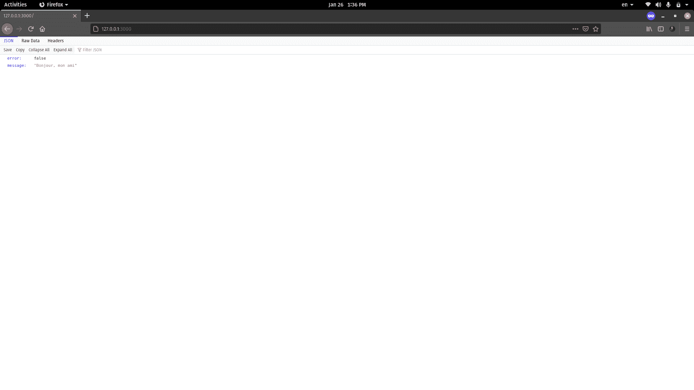

您可以在`/notes-api/api/api/routes/notes.js`文件中看到，API 总共有五条路线。

尽管容器正在运行，但在开始使用它之前，还有最后一件事要做。您必须运行设置数据库表所必需的数据库迁移，您可以通过在容器内执行`npm run db:migrate`命令来完成。

### 如何在运行的容器中执行命令

您已经学习了在停止的容器中执行命令。另一个场景是在运行的容器中执行命令。

为此，您必须使用`exec`命令在运行的容器中执行自定义命令。

`exec`命令的通用语法如下:

```
docker container exec <container identifier> <command>
```

要在`notes-api`容器中执行`npm run db:migrate`，您可以执行以下命令:

```
docker container exec notes-api npm run db:migrate

# > notes-api@ db:migrate /home/node/app
# > knex migrate:latest
#
# Using environment: production
# Batch 1 run: 1 migrations
```

如果你想在一个正在运行的容器中运行一个交互命令，你必须使用`-it`标志。例如，如果您想访问运行在`notes-api`容器中的 shell，您可以执行以下命令:

```
docker container exec -it notes-api sh

# / # uname -a
# Linux b5b1367d6b31 5.10.9-201.fc33.x86_64 #1 SMP Wed Jan 20 16:56:23 UTC 2021 x86_64 Linux
```

### 如何在 Docker 中编写管理脚本

管理一个多容器项目以及网络、卷和其他东西意味着要编写大量的命令。为了简化这个过程，我通常从简单的 [shell 脚本](https://opensource.com/article/17/1/getting-started-shell-scripting)和一个 [Makefile](https://opensource.com/article/18/8/what-how-makefile) 中获得帮助。

您将在`notes-api`目录中找到四个 shell 脚本。它们如下:

*   `boot.sh` -用于启动已经存在的容器。
*   `build.sh` -创建并运行容器。如果需要，它还会创建映像、卷和网络。
*   `destroy.sh` -删除与此项目相关的所有容器、卷和网络。
*   `stop.sh` -停止所有正在运行的容器。

还有一个`Makefile`，它包含四个名为`start`、`stop`、`build`和`destroy`的目标，每个目标都调用前面提到的 shell 脚本。

如果容器在系统中处于运行状态，执行`make stop`应该会停止所有的容器。执行`make destroy`应该停止容器并删除所有内容。确保您正在运行`notes-api`目录中的脚本:

```
make destroy

# ./shutdown.sh
# stopping api container --->
# notes-api
# api container stopped --->

# stopping db container --->
# notes-db
# db container stopped --->

# shutdown script finished

# ./destroy.sh
# removing api container --->
# notes-api
# api container removed --->

# removing db container --->
# notes-db
# db container removed --->

# removing db data volume --->
# notes-db-data
# db data volume removed --->

# removing network --->
# notes-api-network
# network removed --->

# destroy script finished
```

如果您得到一个权限被拒绝的错误，那么在脚本上执行`chmod +x`:

```
chmod +x boot.sh build.sh destroy.sh shutdown.sh
```

我不打算解释这些脚本，因为它们是简单的`if-else`语句以及一些你已经看过很多次的 Docker 命令。如果您对 Linux shell 有所了解，那么您也应该能够理解这些脚本。

## 如何使用 Docker-Compose 编写项目

在上一节中，您已经了解了管理多容器项目及其困难。管理多容器项目有一个更简单的方法，一个叫做 [Docker Compose](https://docs.docker.com/compose/) 的工具，而不是写这么多命令。

根据 Docker [文档](https://docs.docker.com/compose/)—

> Compose 是一个定义和运行多容器 Docker 应用程序的工具。使用 Compose，您可以使用 YAML 文件来配置应用程序的服务。然后，只需一个命令，您就可以从您的配置中创建并启动所有服务。

尽管 Compose 可以在所有环境中工作，但它更侧重于开发和测试。根本不建议在生产环境中使用 Compose。

### Docker 合成基础知识

转到您克隆了这本书附带的存储库的目录。进入`notes-api/api`目录并创建一个`Dockerfile.dev`文件。将以下代码放入其中:

```
# stage one
FROM node:lts-alpine as builder

# install dependencies for node-gyp
RUN apk add --no-cache python make g++

WORKDIR /app

COPY ./package.json .
RUN npm install

# stage two
FROM node:lts-alpine

ENV NODE_ENV=development

USER node
RUN mkdir -p /home/node/app
WORKDIR /home/node/app

COPY . .
COPY --from=builder /app/node_modules /home/node/app/node_modules

CMD [ "./node_modules/.bin/nodemon", "--config", "nodemon.json", "bin/www" ]
```

代码与您在上一节中使用的`Dockerfile`几乎相同。该文件中的三个不同之处如下:

*   在第 10 行，我们运行`npm install`而不是`npm run install --only=prod`，因为我们也想要开发依赖关系。
*   在第 15 行，我们将`NODE_ENV`环境变量设置为`development`而不是`production`。
*   在第 24 行，我们使用一个叫做 [nodemon](https://nodemon.io/) 的工具来获得 API 的热重载特性。

您已经知道这个项目有两个容器:

*   `notes-db` -由 PostgreSQL 支持的数据库服务器。
*   `notes-api` -由 Express.js 支持的 REST API

在 Compose 的世界中，组成应用程序的每个容器都被称为服务。组成多容器项目的第一步是定义这些服务。

就像 Docker 守护进程使用一个`Dockerfile`来构建映像一样，Docker Compose 使用一个`docker-compose.yaml`文件来读取服务定义。

转到`notes-api`目录，创建一个新的`docker-compose.yaml`文件。将以下代码放入新创建的文件中:

```
version: "3.8"

services: 
    db:
        image: postgres:12
        container_name: notes-db-dev
        volumes: 
            - notes-db-dev-data:/var/lib/postgresql/data
        environment:
            POSTGRES_DB: notesdb
            POSTGRES_PASSWORD: secret
    api:
        build:
            context: ./api
            dockerfile: Dockerfile.dev
        image: notes-api:dev
        container_name: notes-api-dev
        environment: 
            DB_HOST: db ## same as the database service name
            DB_DATABASE: notesdb
            DB_PASSWORD: secret
        volumes: 
            - /home/node/app/node_modules
            - ./api:/home/node/app
        ports: 
            - 3000:3000

volumes:
    notes-db-dev-data:
        name: notes-db-dev-data
```

每个有效的`docker-compose.yaml`文件从定义文件版本开始。在撰写本文时，`3.8`是最新版本。你可以在这里查看最新版本的。

YAML 文件中的块由缩进定义。我将介绍每个模块，并解释它们的功能。

*   `services`块保存应用程序中每个服务或容器的定义。`db`和`api`是组成这个项目的两个服务。
*   `db`块定义了应用程序中的新服务，并保存了启动容器所需的信息。每个服务都需要一个预构建的映像或一个`Dockerfile`来运行容器。对于`db`服务，我们使用官方的 PostgreSQL 映像。
*   与`db`服务不同，`api`服务的预构建映像并不存在。所以我们将使用`Dockerfile.dev`文件。
*   `volumes`块定义了任何服务所需的任何名称卷。此时，它只登记由`db`服务使用的`notes-db-dev-data`卷。

现在已经对`docker-compose.yaml`文件有了一个较高层次的概述，让我们更仔细地看看各个服务。

`db`服务的定义代码如下:

```
db:
    image: postgres:12
    container_name: notes-db-dev
    volumes: 
        - db-data:/var/lib/postgresql/data
    environment:
        POSTGRES_DB: notesdb
        POSTGRES_PASSWORD: secret
```

*   `image`键保存用于该容器的图像存储库和标签。我们使用`postgres:12`映像来运行数据库容器。
*   `container_name`表示容器的名称。默认情况下，容器按照`<project directory name>_<service name>`语法命名。你可以使用`container_name`来覆盖它。
*   `volumes`数组保存服务的卷映射，并支持命名卷、匿名卷和绑定挂载。语法`<source>:<destination>`和你之前看到的一样。
*   `environment` map 保存服务所需的各种环境变量的值。

`api`服务的定义代码如下:

```
api:
    build:
        context: ./api
        dockerfile: Dockerfile.dev
    image: notes-api:dev
    container_name: notes-api-dev
    environment: 
        DB_HOST: db ## same as the database service name
        DB_DATABASE: notesdb
        DB_PASSWORD: secret
    volumes: 
        - /home/node/app/node_modules
        - ./api:/home/node/app
    ports: 
        - 3000:3000
```

*   这项服务没有预建的图像。相反，它有一个构建配置。在`build`块下，我们定义了用于构建图像的 docker 文件的上下文和名称。现在你应该对上下文和 Dockerfile 有所了解，所以我不会花时间解释它们。
*   `image`键保存要构建的图像的名称。如果没有指定，图像将按照`<project directory name>_<service name>`语法命名。
*   在`environment`映射中，`DB_HOST`变量展示了一个 Compose 特性。也就是说，您可以通过使用服务的名称来引用同一应用程序中的另一个服务。所以这里的`db`将被替换为`api`服务容器的 IP 地址。`DB_DATABASE`和`DB_PASSWORD`变量必须分别与`db`服务定义中的`POSTGRES_DB`和`POSTGRES_PASSWORD`匹配。
*   在`volumes`图中，您可以看到一个匿名卷和一个描述的绑定装载。语法与您在前面章节中看到的相同。
*   `ports`映射定义了任何端口映射。语法`<host port>:<container port>`与您之前使用的`--publish`选项相同。

最后，`volumes`的代码如下:

```
volumes:
    db-data:
        name: notes-db-dev-data
```

任何服务中使用的任何命名卷都必须在此处定义。如果不定义名称，卷将在`<project directory name>_<volume key>`后面命名，这里的关键字是`db-data`。

您可以在官方[文档](https://docs.docker.com/compose/compose-file/compose-file-v3/#volumes)中了解卷配置的不同选项。

### 如何在 Docker Compose 中启动服务

有几种方法可以启动 YAML 文件中定义的服务。您将学习的第一个命令是`up`命令。`up`命令构建任何缺失的图像，创建容器，并一次启动它们。

不过，在执行命令之前，请确保您已经在保存`docker-compose.yaml`文件的同一个目录中打开了终端。这对您执行的每个`docker-compose`命令都非常重要。

```
docker-compose --file docker-compose.yaml up --detach

# Creating network "notes-api_default" with the default driver
# Creating volume "notes-db-dev-data" with default driver
# Building api
# Sending build context to Docker daemon  37.38kB
#
# Step 1/13 : FROM node:lts-alpine as builder
#  ---> 471e8b4eb0b2
# Step 2/13 : RUN apk add --no-cache python make g++
#  ---> Running in 197056ec1964
### LONG INSTALLATION STUFF GOES HERE ###
# Removing intermediate container 197056ec1964
#  ---> 6609935fe50b
# Step 3/13 : WORKDIR /app
#  ---> Running in 17010f65c5e7
# Removing intermediate container 17010f65c5e7
#  ---> b10d12e676ad
# Step 4/13 : COPY ./package.json .
#  ---> 600d31d9362e
# Step 5/13 : RUN npm install
#  ---> Running in a14afc8c0743
### LONG INSTALLATION STUFF GOES HERE ###
#  Removing intermediate container a14afc8c0743
#  ---> 952d5d86e361
# Step 6/13 : FROM node:lts-alpine
#  ---> 471e8b4eb0b2
# Step 7/13 : ENV NODE_ENV=development
#  ---> Running in 0d5376a9e78a
# Removing intermediate container 0d5376a9e78a
#  ---> 910c081ce5f5
# Step 8/13 : USER node
#  ---> Running in cfaefceb1eff
# Removing intermediate container cfaefceb1eff
#  ---> 1480176a1058
# Step 9/13 : RUN mkdir -p /home/node/app
#  ---> Running in 3ae30e6fb8b8
# Removing intermediate container 3ae30e6fb8b8
#  ---> c391cee4b92c
# Step 10/13 : WORKDIR /home/node/app
#  ---> Running in 6aa27f6b50c1
# Removing intermediate container 6aa27f6b50c1
#  ---> 761a7435dbca
# Step 11/13 : COPY . .
#  ---> b5d5c5bdf3a6
# Step 12/13 : COPY --from=builder /app/node_modules /home/node/app/node_modules
#  ---> 9e1a19960420
# Step 13/13 : CMD [ "./node_modules/.bin/nodemon", "--config", "nodemon.json", "bin/www" ]
#  ---> Running in 5bdd62236994
# Removing intermediate container 5bdd62236994
#  ---> 548e178f1386
# Successfully built 548e178f1386
# Successfully tagged notes-api:dev
# Creating notes-api-dev ... done
# Creating notes-db-dev  ... done
```

这里的`--detach`或`-d`选项与您之前看到的功能相同。只有当 YAML 文件没有命名为`docker-compose.yaml`时，才需要`--file`或`-f`选项(但我在这里是为了演示)。

除了`up`命令外，还有`start`命令。这两个命令的主要区别在于,`start`命令不会创建丢失的容器，只会启动现有的容器。和`container start`命令基本一样。

`up`命令的`--build`选项强制重建图像。你可以在官方的[文档](https://docs.docker.com/compose/reference/up/)中看到`up`命令的其他选项。

### 如何在 Docker 编写中列出服务

虽然可以使用`container ls`命令列出由 Compose 启动的服务容器，但是有一个`ps`命令只能列出在 YAML 中定义的容器。

```
docker-compose ps

#     Name                   Command               State           Ports         
# -------------------------------------------------------------------------------
# notes-api-dev   docker-entrypoint.sh ./nod ...   Up      0.0.0.0:3000->3000/tcp
# notes-db-dev    docker-entrypoint.sh postgres    Up      5432/tcp
```

它不像`container ls`输出那样信息丰富，但是当您有大量容器同时运行时，它很有用。

### 如何在 Docker Compose 中运行的服务中执行命令

我希望您还记得上一节，您必须运行一些迁移脚本来为这个 API 创建数据库表。

就像`container exec`命令一样，`docker-compose`也有一个`exec`命令。该命令的通用语法如下:

```
docker-compose exec <service name> <command>
```

要在`api`服务中执行`npm run db:migrate`命令，可以执行以下命令:

```
docker-compose exec api npm run db:migrate

# > notes-api@ db:migrate /home/node/app
# > knex migrate:latest
# 
# Using environment: development
# Batch 1 run: 1 migrations
```

与`container exec`命令不同，您不需要为交互式会话传递`-it`标志。`docker-compose`自动完成。

### 如何在 Docker Compose 中访问正在运行的服务的日志

您还可以使用`logs`命令从正在运行的服务中检索日志。该命令的通用语法如下:

```
docker-compose logs <service name>
```

要从`api`服务访问日志，请执行以下命令:

```
docker-compose logs api

# Attaching to notes-api-dev
# notes-api-dev | [nodemon] 2.0.7
# notes-api-dev | [nodemon] reading config ./nodemon.json
# notes-api-dev | [nodemon] to restart at any time, enter `rs`
# notes-api-dev | [nodemon] or send SIGHUP to 1 to restart
# notes-api-dev | [nodemon] ignoring: *.test.js
# notes-api-dev | [nodemon] watching path(s): *.*
# notes-api-dev | [nodemon] watching extensions: js,mjs,json
# notes-api-dev | [nodemon] starting `node bin/www`
# notes-api-dev | [nodemon] forking
# notes-api-dev | [nodemon] child pid: 19
# notes-api-dev | [nodemon] watching 18 files
# notes-api-dev | app running -> http://127.0.0.1:3000
```

这只是日志输出的一部分。您可以通过使用`-f`或`--follow`选项连接到服务的输出流并实时获取日志。只要你没有按下`ctrl + c`或关闭窗口退出，任何后来的日志都会立即显示在终端中。即使退出日志窗口，容器也会继续运行。

### 如何停止 Docker 编写中的服务

要停止服务，有两种方法可以采用。第一个是`down`命令。`down`命令停止所有正在运行的容器，并将它们从系统中删除。它还会删除任何网络:

```
docker-compose down --volumes

# Stopping notes-api-dev ... done
# Stopping notes-db-dev  ... done
# Removing notes-api-dev ... done
# Removing notes-db-dev  ... done
# Removing network notes-api_default
# Removing volume notes-db-dev-data
```

`--volumes`选项表示您想要删除在`volumes`块中定义的任何命名卷。你可以在官方的[文档](https://docs.docker.com/compose/reference/down/)中了解到`down`命令的附加选项。

另一个停止服务的命令是`stop`命令，其功能与`container stop`命令相同。它停止应用程序的所有容器并保留它们。这些容器稍后可以用`start`或`up`命令启动。

### 如何在 Docker Compose 中构建全栈应用

在这一小节中，我们将向 notes API 添加一个前端，并将其转变为一个完整的全栈应用程序。在这一小节中，我将不解释任何`Dockerfile.dev`文件(除了用于`nginx`服务的文件)，因为它们与您在前面小节中已经看到的一些其他文件相同。‌

如果您已经克隆了项目代码库，那么进入`fullstack-notes-application`目录。项目根目录中的每个目录都包含每个服务的代码和相应的`Dockerfile`。‌

在我们开始使用`docker-compose.yaml`文件之前，让我们看一下应用程序如何工作的示意图:


在这个应用程序中，所有的请求将首先由 NGINX(姑且称之为路由器)服务接收，而不是像以前那样直接接受请求。

然后，路由器将查看所请求的端点中是否有`/api`。如果是，路由器将把请求路由到后端，否则，路由器将把请求路由到前端。

您这样做是因为当您运行前端应用程序时，它不会在容器内运行。它运行在浏览器上，由一个容器提供服务。结果，Compose networking 不能像预期的那样工作，前端应用程序无法找到`api`服务。

另一方面，NGINX 运行在容器中，可以与整个应用程序中的不同服务进行通信。

这里我就不赘述 NGINX 的配置了。那个话题有点超出了本书的范围。但是如果你想看一看，就去检查一下`/notes-api/nginx/development.conf`和`/notes-api/nginx/production.conf`文件。`/notes-api/nginx/Dockerfile.dev`的代码如下:

```
FROM nginx:stable-alpine

COPY ./development.conf /etc/nginx/conf.d/default.conf
```

它所做的只是将配置文件复制到容器内部的`/etc/nginx/conf.d/default.conf`。

让我们开始编写`docker-compose.yaml`文件。除了`api`和`db`服务，还有`client`和`nginx`服务。我将很快介绍一些网络定义。

```
version: "3.8"

services: 
    db:
        image: postgres:12
        container_name: notes-db-dev
        volumes: 
            - db-data:/var/lib/postgresql/data
        environment:
            POSTGRES_DB: notesdb
            POSTGRES_PASSWORD: secret
        networks:
            - backend
    api:
        build: 
            context: ./api
            dockerfile: Dockerfile.dev
        image: notes-api:dev
        container_name: notes-api-dev
        volumes: 
            - /home/node/app/node_modules
            - ./api:/home/node/app
        environment: 
            DB_HOST: db ## same as the database service name
            DB_PORT: 5432
            DB_USER: postgres
            DB_DATABASE: notesdb
            DB_PASSWORD: secret
        networks:
            - backend
    client:
        build:
            context: ./client
            dockerfile: Dockerfile.dev
        image: notes-client:dev
        container_name: notes-client-dev
        volumes: 
            - /home/node/app/node_modules
            - ./client:/home/node/app
        networks:
            - frontend
    nginx:
        build:
            context: ./nginx
            dockerfile: Dockerfile.dev
        image: notes-router:dev
        container_name: notes-router-dev
        restart: unless-stopped
        ports: 
            - 8080:80
        networks:
            - backend
            - frontend

volumes:
    db-data:
        name: notes-db-dev-data

networks: 
    frontend:
        name: fullstack-notes-application-network-frontend
        driver: bridge
    backend:
        name: fullstack-notes-application-network-backend
        driver: bridge 
```

该文件与您使用的前一个文件几乎相同。唯一需要解释的是网络配置。`networks`块的代码如下:

```
networks: 
    frontend:
        name: fullstack-notes-application-network-frontend
        driver: bridge
    backend:
        name: fullstack-notes-application-network-backend
        driver: bridge
```

我定义了两个桥接网络。默认情况下，Compose 会创建一个桥接网络，并将所有容器附加到该网络。然而，在这个项目中，我想要适当的网络隔离。所以我定义了两个网络，一个用于前端服务，一个用于后端服务。

我还在每个服务定义中添加了`networks`块。这样，`api`和`db`服务将连接到一个网络，而`client`服务将连接到一个单独的网络。但是`nginx`服务将连接到两个网络，这样它就可以作为前端和后端服务之间的路由器。

通过执行以下命令启动所有服务:

```
docker-compose --file docker-compose.yaml up --detach

# Creating network "fullstack-notes-application-network-backend" with driver "bridge"
# Creating network "fullstack-notes-application-network-frontend" with driver "bridge"
# Creating volume "notes-db-dev-data" with default driver
# Building api
# Sending build context to Docker daemon  37.38kB
# 
# Step 1/13 : FROM node:lts-alpine as builder
#  ---> 471e8b4eb0b2
# Step 2/13 : RUN apk add --no-cache python make g++
#  ---> Running in 8a4485388fd3
### LONG INSTALLATION STUFF GOES HERE ###
# Removing intermediate container 8a4485388fd3
#  ---> 47fb1ab07cc0
# Step 3/13 : WORKDIR /app
#  ---> Running in bc76cc41f1da
# Removing intermediate container bc76cc41f1da
#  ---> 8c03fdb920f9
# Step 4/13 : COPY ./package.json .
#  ---> a1d5715db999
# Step 5/13 : RUN npm install
#  ---> Running in fabd33cc0986
### LONG INSTALLATION STUFF GOES HERE ###
# Removing intermediate container fabd33cc0986
#  ---> e09913debbd1
# Step 6/13 : FROM node:lts-alpine
#  ---> 471e8b4eb0b2
# Step 7/13 : ENV NODE_ENV=development
#  ---> Using cache
#  ---> b7c12361b3e5
# Step 8/13 : USER node
#  ---> Using cache
#  ---> f5ac66ca07a4
# Step 9/13 : RUN mkdir -p /home/node/app
#  ---> Using cache
#  ---> 60094b9a6183
# Step 10/13 : WORKDIR /home/node/app
#  ---> Using cache
#  ---> 316a252e6e3e
# Step 11/13 : COPY . .
#  ---> Using cache
#  ---> 3a083622b753
# Step 12/13 : COPY --from=builder /app/node_modules /home/node/app/node_modules
#  ---> Using cache
#  ---> 707979b3371c
# Step 13/13 : CMD [ "./node_modules/.bin/nodemon", "--config", "nodemon.json", "bin/www" ]
#  ---> Using cache
#  ---> f2da08a5f59b
# Successfully built f2da08a5f59b
# Successfully tagged notes-api:dev
# Building client
# Sending build context to Docker daemon  43.01kB
# 
# Step 1/7 : FROM node:lts-alpine
#  ---> 471e8b4eb0b2
# Step 2/7 : USER node
#  ---> Using cache
#  ---> 4be5fb31f862
# Step 3/7 : RUN mkdir -p /home/node/app
#  ---> Using cache
#  ---> 1fefc7412723
# Step 4/7 : WORKDIR /home/node/app
#  ---> Using cache
#  ---> d1470d878aa7
# Step 5/7 : COPY ./package.json .
#  ---> Using cache
#  ---> bbcc49475077
# Step 6/7 : RUN npm install
#  ---> Using cache
#  ---> 860a4a2af447
# Step 7/7 : CMD [ "npm", "run", "serve" ]
#  ---> Using cache
#  ---> 11db51d5bee7
# Successfully built 11db51d5bee7
# Successfully tagged notes-client:dev
# Building nginx
# Sending build context to Docker daemon   5.12kB
# 
# Step 1/2 : FROM nginx:stable-alpine
#  ---> f2343e2e2507
# Step 2/2 : COPY ./development.conf /etc/nginx/conf.d/default.conf
#  ---> Using cache
#  ---> 02a55d005a98
# Successfully built 02a55d005a98
# Successfully tagged notes-router:dev
# Creating notes-client-dev ... done
# Creating notes-api-dev    ... done
# Creating notes-router-dev ... done
# Creating notes-db-dev     ... done
```

现在访问`http://localhost:8080`，瞧！

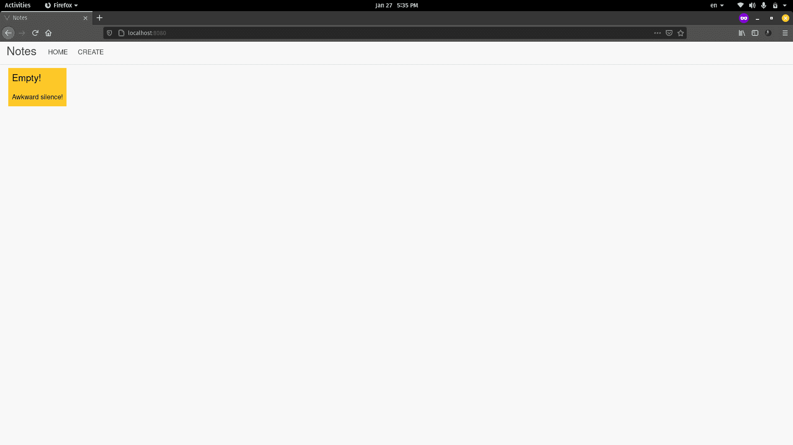

尝试添加和删除注释，看看应用程序是否正常工作。该项目还附带 shell 脚本和一个`Makefile`。像上一节一样，探索他们，看看你如何在没有`docker-compose`帮助的情况下运行这个项目。

## 结论

我衷心感谢你花时间阅读这本书。我希望你喜欢它，并且已经学会了 Docker 的所有基本知识。

除了这本书，我还在 [freeCodeCamp](https://www.freecodecamp.org/news/author/farhanhasin/) 上免费写过关于其他复杂主题的长篇手册。

这些手册是我的使命的一部分，为每个人简化难以理解的技术。这些手册中的每一本都需要花费大量的时间和精力来编写。

如果你喜欢我的写作，想让我保持动力，可以考虑在 [GitHub](https://github.com/fhsinchy/) 上离开 starts，并在 [LinkedIn](https://www.linkedin.com/in/farhanhasin/) 上为我的相关技能背书。我也接受赞助，所以如果你愿意，你可以考虑[请我喝咖啡](https://www.buymeacoffee.com/farhanhasin)。

我总是乐于接受 Twitter 或 T2 LinkedIn 上的建议和讨论。用直接信息打击我。

最后，考虑与他人分享资源，因为

> 分享知识是友谊最基本的行为。因为这是一种你可以给予而不失去的方式。—理查德·斯托尔曼

直到下一个，保持安全，继续学习。