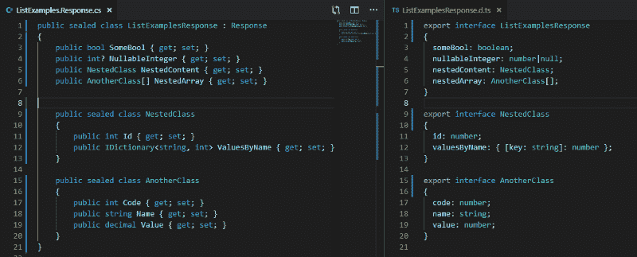
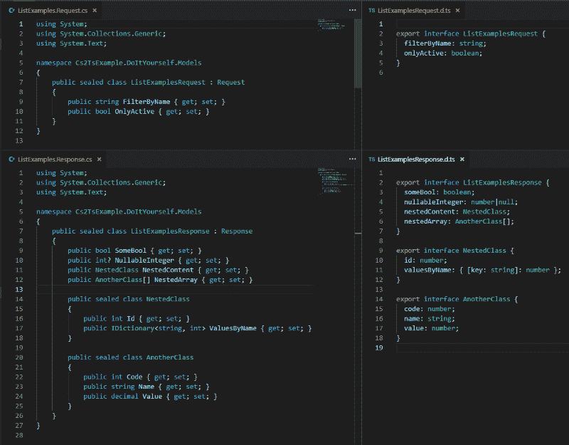
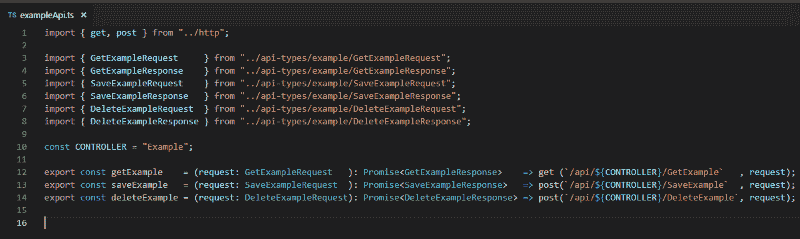
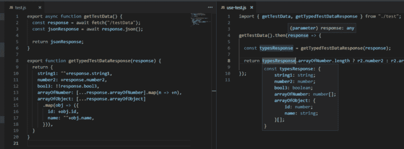

# 在任何 IDE 中从 C#、Java 或 Python 代码中获取 TypeScript 接口的简单方法

> 原文：<https://www.freecodecamp.org/news/the-easy-way-to-get-typescript-interfaces-from-c-java-or-python-code-in-any-ide-c3acac1e366a/>

莱昂纳多·卡雷罗

# 在任何 IDE 中从 C#、Java 或 Python 代码中获取 TypeScript 接口的简单方法



C# class (left) vs TypeScript generated interface (right)

谁没有经历过这样的情况:您必须修复一个 bug，最后您发现服务器上的错误是来自 HTTP 请求的一个丢失的字段？或者是客户端出错，您的 Javascript 代码试图访问一个不存在于来自服务器的 HTTP 响应数据中的字段？很多时候，这些问题仅仅是由于客户端和服务器端代码中的这个字段的名称不同而引起的。

### 问题是

在 web 应用程序的后端和前端工作的每个人都必须在服务器端查询和处理数据，然后返回这些数据供应用程序的客户端使用。无论您的体系结构分为多少层，您都将拥有服务器和客户端之间的边界，HTTP 请求和响应在这两端双向传输数据。

这不仅仅是不同名称的 bug，没有人能够记住应用程序所有实体的整个数据结构。当你在写代码的时候，输入一个`.`(或者`-&`gt；`or`[”]。如果你没有写错名字，你会停下来问自己“那个字段到底叫什么名字？".在你花了一些时间试图回忆之后，你放弃了，选择了最无聊的路。你拿起你的鼠标，开始寻找你定义了所有你需要访问的字段的文件。

> 写代码最无聊的部分是当你不能自己找出什么是你需要写的正确代码的时候。

有时谷歌一下也无妨，你会发现一个堆栈溢出的答案，里面有代码，随时可以复制。但是，当您必须在您的项目中寻找这个答案时，一个大项目，其中定义您必须访问的数据结构的代码在一个不是由您编写的文件中…您在这条路径上花费的时间可能比仅仅编写正确的名称花费的时间多一个或两个数量级。

### 拯救打字稿

当我们过去只编写普通的旧 Javascript 时，在这些情况下，我们没有选择来避免这条无聊的道路。但是在 2012 年底，[安德斯·海尔斯伯格](https://twitter.com/ahejlsberg)(C #语言之父)和他的团队创造了 TypeScript。他们的任务是让创建大规模的大型 Javascript 项目变得更加容易。

有趣的是，虽然这种新语言是 Javascript 的超集，但它的目标是允许你只做你过去用 Javascript 做的事情的 T2 子集。它**增加了新的特性**，比如类、枚举、接口、参数类型和返回类型。

但是它也**移除了可能性**，甚至是不太糟糕的事情，比如将一个数字作为参数传递给`document.getElementById()`，以及使用带有一个数字和一个数字串作为操作数的`*`运算符。你不能再使用隐式类型转换，当你需要类型转换时，你必须显式地使用`.toString()`或`parseInt(str)`。但是你不能再做的最好的事情**是访问一个对象中不存在的字段。**

所以，当一个问题解决了，一个新的问题就会出现。这里的新问题是代码的重复。人们开始用湿原则(每件事都写两遍)代替干原则(不要重复自己)。

出于不同的目的，在不同的层中使用不同的类是一个很好的实践，但是这里的情况并非如此。如果你有三个层(A -> B -> C)，你不应该为每个层有特定的数据结构**(一个用于 A，一个用于 B，一个用于 C)，而是为那些**层之间的每个边(一个在 A 和 B 之间，另一个在 B 和 C 之间)有**。在这里，除非您的后端是 Node.js 应用程序，否则我们必须复制这些数据结构声明，因为我们处于两种不同编程语言之间的边缘。**

为了避免每样东西都写两遍，我们只有一个选择…

### 代码生成

有一天，我正在用实体框架做一个. NET 项目。它在一个. edmx 文件中有一个模型图，如果我更改了这个文件，我必须选择一个选项来为 POCO 实体(普通的旧 CLR 对象)生成类。

这段代码是由 T4 完成的，他是 Visual Studio 的一个模板引擎，使用一个. tt 文件作为 C#类的模板。它运行读取。edmx 模型文件并输出。cs 文件。记住这一点后，我认为这可能是一个生成 TypeScript 接口的解决方案，并开始尝试让它工作。

首先，我尝试编写自己的模板。当我使用这个和实体框架时，我从来不需要改变。tt 模板。然后我发现 Visual Studio 在。tt 文件——这就像在记事本中编程，但更糟。

除了生成逻辑的 C#代码，我还混合了必须生成的类型脚本代码，比如[这个](https://gist.github.com/robfe/4583549)。我安装了一个 Visual Studio 扩展来获得语法支持，但是该扩展只为 Visual Studio 的浅色主题定义了语法颜色，我使用深色主题。深色主题上的浅色主题语法颜色不可读，所以我也必须更改我的 Visual Studio 主题。

现在有了语法高亮，一切都好了。是时候开始写一些代码了。我在谷歌上搜索了一个可行的例子。我的想法是在我让它工作后根据我的需要改变它，但是…它没有工作！

```
System.IO.FileNotFoundException: Could not load file or assembly 'System.Runtime, Version=4.2.1.0, Culture=neutral, PublicKeyToken=b03f5f7f11d50a3a' or one of its dependencies. The system cannot find the file specified.
```

我尝试了很多在谷歌上搜索到的“有效”例子，但没有一个有效。我想也许问题不在于 Visual Studio 或 T4 引擎——也许问题出在我，用错了。

然后谷歌在这个问题上找到了我。我发现它不能与 ASP.NET 核心项目一起工作。但是这个错误是。NET 世界，所以我想我可以尝试为它做一个变通办法。我搜索了那个 4.2.1.0 版本的 System.Runtime.dll，我找到了，我试着把它放在一些不同的目录下，看看 Visual Studio 能不能找到它……但是什么都没用。

最后，我使用 Process Explorer 查看系统的版本。运行时 Visual Studio 已加载，版本为 4.0.0.0。我试着用一个`bindingRedirect`强制它使用同一个版本(正如我在这里描述的)，成功了！我无法相信我再也不用在服务器和客户机之间复制和手动同步我的数据结构了。

我开始更多地思考这个问题，另一个想法困扰着我…

### 值得吗？

我为一家大型石油公司工作，有很多遗留应用程序。一位朋友不得不使用虚拟机，因为他调试的应用程序有时只能在 Windows XP 中运行。我不得不花一天时间开发的另一个应用程序只能在 Visual Studio 2010 上运行。另一个使用代码契约的版本只适用于 Visual Studio 2013，因为代码契约扩展在 Visual Studio 2015 或 2017 中不工作。

从 2012 年我开始在那里工作到 2019 年初，我从来没有机会开发新的应用程序。我所有的工作总是与其他开发人员的混乱。去年，我开始学习更多关于软件架构的知识，我读了鲍勃叔叔的《干净的架构》一书。

现在，我带着这个机会开始了新的一年，这是我第一次在这家公司从零开始创建一个 web 应用程序，我想好好工作。我选择 ASP.NET 核心作为我的后端，React 作为前端，它将是该公司第一批在我们新的 Kubernetes 集群中的 Docker 容器中运行的应用程序之一。

另一个糟糕的开发人员将不得不在未来的这个项目上工作，用我的代码和我所有的混乱，我不希望他们不得不处理糟糕的代码。我希望我之后的所有开发人员都愿意参与这个项目。如果他们不得不损失一天的工作来从后端数据结构生成客户端代码，这种情况就不会发生。然后他们会恨我(他们中的一些人已经恨我在 TypeScript 还在 0.9 版本的时候就把 TypeScript 代码放到了项目中)。

> 当我们编写不属于我们的代码时，我们有责任让其他人能够轻松地使用它。

想到这一点后，我得出了一个结论:

> 我们应该避免依赖于所选技术的包管理器不能处理的任何东西。

在这种情况下，除了依赖 Visual Studio 和 Windows 之外，我会让项目依赖于一个需要由微软修复的 bug(并且[它似乎没有任何优先级](https://developercommunity.visualstudio.com/content/problem/358905/filenotfoundexception-systemruntime-version4210-wh.html))。所以最好复制这段代码并手动同步，而不是依赖这个 T4 引擎。

我选择使用。NET Core，但是如果将来有开发人员想用 Linux 来做这个项目，我不能阻止他们。

### 最终解决方案(TL；博士)

重复代码不好，但是依赖第三方工具更糟糕。那么，我们能做些什么来避免数据结构的重复，并且不依赖任何特定的 IDE /插件/扩展/工具进行开发呢？

我花了一些时间才意识到，我需要的唯一工具一直都在那里，在语言运行时中:**反射**。

我意识到我可以写一些代码，这些代码只能在开发模式下在我的后端 ASP.NET 核心应用程序启动时运行。这段代码可以使用反射来读取关于我想要生成 TypeScript 接口的所有数据结构的名称和类型的元数据。我只需要将 C#原语映射到 TypeScript 原语，在特定的文件夹中编写. d.ts TypeScript 定义，就可以了。

每当我在后端更改一些数据结构时，当我运行代码测试它时，它会覆盖 a .d.ts 文件中的接口定义。当我开始编写客户机代码以使用更改的数据结构时，接口已经更新了。

中的项目可以使用这种方法。NET、Java、Python 和任何其他支持代码反射的语言，而不需要添加对任何 IDE /插件/扩展/工具的依赖。

我用 C#和 ASP.NET 内核写了一个简单的例子，并发表在 GitHub [这里](https://github.com/lmcarreiro/cs2ts-example)。它只是从所有继承`Microsoft.AspNetCore.Mvc.ControllerBase`的类和所有来自参数的类型中获取，并返回具有`HttpGet`或`HttpPost`属性的公共方法的类型。

下面是生成的接口的样子:



C# classes (left) vs TypeScript interfaces (right)

#### 您也可以生成其他类型的代码

我只是用它来生成数据结构的接口和枚举，但是想想下面的代码:



TypeScript code of an example API that could be generated automatically

与保持数据结构同步相比，保持代码与所有可能的 MVC 控制器和动作同步要容易得多。但是我需要手写这个代码吗？难道它不能被生成吗？

我不能从 C#具体实现中生成 C#接口，因为在我可以使用反射生成它之前，我需要编译和运行代码。但是对于需要与服务器代码保持同步的客户端代码，我可以生成它。这种代码生成方式可以在数据结构接口之外使用。

#### 如果你不喜欢打字稿…

不需要用 TypeScript 写。如果您不喜欢 TypeScript，而更喜欢使用普通的 Javascript，那么您可以编写您的。js 文件，并将 TypeScript 用作工具(如果您使用 Visual Studio 代码，那么您已经在使用它了)。这样，您可以生成帮助器函数，将您的数据结构转换为相同的结构。这看起来很奇怪，但它将帮助 TypeScript 语言服务分析您的代码，并告诉 Visual Studio 代码每个对象中存在的字段，因此它可以帮助您编写代码。



Using typing information with plain Javascript

### 结论

作为开发人员，我们对其他必须开发我们代码的开发人员负有责任。不要留下一堆烂摊子让他们收拾，因为他们不会(或者至少他们不想！).他们很可能只会让下一次变得更糟。

您应该不惜一切代价避免软件包管理器无法处理的任何开发和运行时依赖。不要让你的项目成为其他开发者讨厌的项目。

感谢阅读！

PS 1:这个包含我的代码的[库只是一个例子。那里把 C#类转换成 TypeScript 接口的代码并不好。你可以做得更好，也许我们已经有一些 NuGet 包可以做到这一点。](https://github.com/lmcarreiro/cs2ts-example)

PS 2:我爱打字稿。如果你也喜欢 TypeScript，你可能想看看这些链接，这些链接来自微软在 2012 年宣布的:

*   [**微软 C#之父的下一招是什么？**微软技术人员安德斯·海尔斯伯格正在研究 JavaScript 工具。这里有一些关于他最新项目的线索。](https://www.zdnet.com/article/whats-microsofts-father-of-cs-next-trick/)
*   [黑客新闻讨论:**“安德斯·海尔斯伯格是对的:你不能用 JavaScript 维护大型程序”**](https://news.ycombinator.com/item?id=4067696)
*   [第九频道视频:**《安德斯·海尔斯伯格:介绍打字稿》**](https://channel9.msdn.com/posts/Anders-Hejlsberg-Introducing-TypeScript)