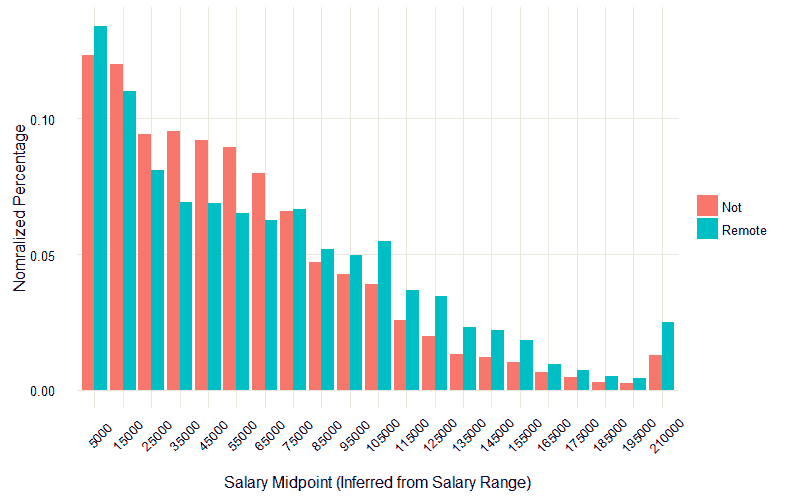
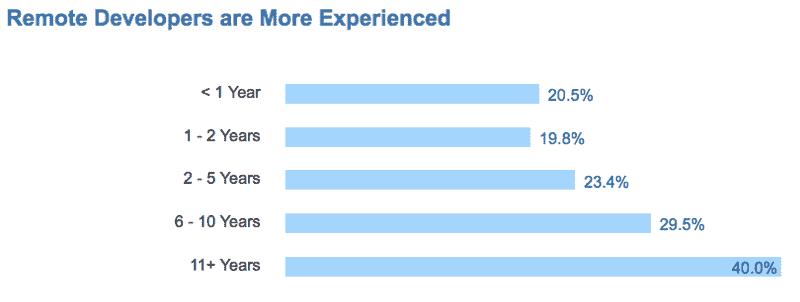
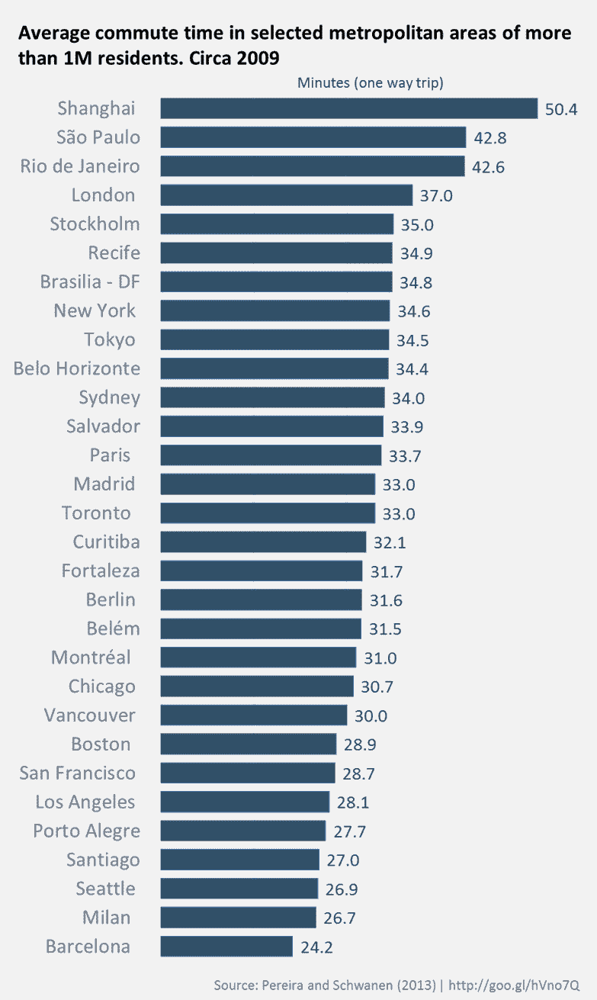

# 更适合。更开心。更有效率。远程工作。

> 原文：<https://www.freecodecamp.org/news/the-economics-of-working-remotely-28d4173e16e2/>

### 分布式团队的经济分析

以数字流浪者的身份环游世界。每天早上去新的海滩冲浪。每晚吃不同的当地美食。

或者整天穿着睡衣呆在家里。

这其实并不重要。你可以用任何一种方式完成你的工作。

超过 10%的美国人现在远程工作。

我是其中之一。在办公室工作了 10 年后，我在过去的 5 年里享受了在衣柜外工作的奢侈。我可以欢呼雀跃，直到我脸色发青，说它有多棒。但是空谈是廉价的。我们来看数据。

远程工作的经济成本和收益是什么？

### 薪水

我们从 [Stack Overflow 的 2016 年数据集](https://medium.freecodecamp.com/2-out-of-3-developers-are-self-taught-and-other-insights-from-stack-overflow-s-2016-survey-of-50-8cf0ee5d4c21#.f39zmdujb)中查看了超过 36，000 名远程和现场工作的开发人员的工资。以下是我们的发现:

A big thanks to [Eric](https://github.com/erictleung) and [Evaristo](https://github.com/evaristoc) in our [Data Science Room](https://gitter.im/FreeCodeCamp/DataScience) for analyzing these data and making these graphs.

据报道，全球有 10，583 名开发人员有时或一直在远程工作，他们的平均工资为 55，000 美元，标准差为 51，200 美元。

这大大高于 25，413 名非远程开发人员的工资。他们的工资中值仅为 45000 美元，标准差为 44727 美元。

当你排除美国以外的开发人员时，这种工资差异仍然存在。3，200 名美国远程开发人员的平均工资为 105，000 美元(标准差为 47，400 美元)，而他们的 6，461 名非远程开发人员的平均工资仅为 95，000 美元(标准差为 42，977 美元)。

远程工作的人大多处于工资等级的顶端和底端。

通过 Upwork 等报酬相对较低的渠道接受合同的自由开发人员往往比较偏远。

同时，拥有十年以上经验的开发人员远程工作的可能性是新人的两倍。

年薪超过 20 万美元的开发人员有很大的议价能力。当雇主要求远程工作时，他们更有可能让步。

有趣的是，我遇到过很多住在山里的高薪开发人员，或者在世界各地乘坐飞机、住在酒店里的开发人员。你将不得不付给他们一大笔钱来说服他们在办公室工作，即使这样，他们可能也不会持续很久。

### 生产力

2012 年，斯坦福大学的研究人员开始更好地理解远程工作及其影响。他们对 249 名服务业员工进行了为期 9 个月的研究，这是有史以来规模最大的远程工作学术研究。

以下是主要发现:

*   远程员工的工作效率比现场员工高 13%。
*   远程员工工作时间更长，休息时间更少，病假也更少。
*   远程员工辞职的可能性是现场员工的一半，而且报告的工作满意度明显更高。

该研究发现的一个不利方面是，远程员工比他们的现场同事晋升的可能性低 50%。这可能意味着如果你远程工作，老板更难与你建立关系。

### 生活方式

远程工作还为员工和雇主节省了大量成本。

在许多城市，员工每天花一个多小时上下班。

不必通勤可以节省你的时间。它也为你节省了公共交通的钱，或者汽车的汽油和折旧。

你还得花很多时间为工作做准备。对许多人来说，这意味着穿上西装和/或化妆——如果你是远程工作，你可以跳过这些任务。

我不科学的估计(因为还没有进行全面的研究)是，如果他们可以远程工作，大约十分之一的现场工人的收入——以及十分之一的时间——将立即被释放出来。

公司还应该注意到，在斯坦福大学学习期间，雇主为每位员工节省了 2000 美元的家具和办公空间费用。

别忘了停车。例如，在旧金山，为一名员工创造一个新的停车位平均需要花费 38，000 美元。

### 远程工作适合你吗？

远程工作的决定是非常个人化的。

我的目标是分享事实。

与其滔滔不绝地说我个人认为远程工作有多棒，不如推荐你读读这本优秀的书:

[**无裤之年:WordPress.com 与工作的未来**](http://amzn.to/2bFzj06)
[*编辑描述* amzn.to](http://amzn.to/2bFzj06)

作者是记者斯科特·伯昆，他在 Automattic(WordPress 背后的全远程公司)管理了一年的远程团队。

[不穿裤子的一年](http://amzn.to/2bFzj06)充满了有趣的第一手轶事。它会让你清楚地了解远程工作是什么样的。

远程工作并不适合所有人。但这是一个可行的选择。而且有一些令人信服的经济理由来解释它为什么对你有意义。

我只写编程和技术。如果你在推特上关注我，我不会浪费你的时间。？