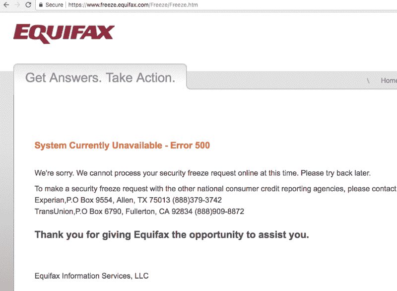

# Equifax 黑客和如何保护您的家人——全部在 5 分钟内解释清楚

> 原文：<https://www.freecodecamp.org/news/the-equifax-hack-and-how-to-protect-your-family-all-explained-in-5-minutes-a2b5187cb6c0/>

1989 年，美国政府决定将我们最敏感的数据集中在三大金融公司手中:益百利、TransUnion 和 Equifax。这三家公司现在存储了我们的传记信息，我们曾经居住过的每个地址，以及我们曾经做过的每一笔重大金融交易——所有这些都是为了给我们分配一个 FICO 信用评分。

其中一家公司刚刚被黑了。

9 月 8 日，Equifax 宣布了历史上最严重的数据泄露事件。是的，你很可能是它的受害者。

这就是这场灾难是如何展开的。

A 500 server error from Equifax when attempting to freeze my credit, along with millions of other Americans.

### 修补失败

3 月 7 日，[Apache Struts](https://en.wikipedia.org/wiki/Apache_Struts_2)——一个受大型金融公司欢迎的 Java web 开发框架——的开发者发布了一个关键的安全补丁。

两个多月来，Equifax 未能应用该修补程序。

然后在 5 月，攻击者发现 Equifax 易受攻击。他们开始从 Equifax 的海量数据库中抽取数据。

在两个多月的时间里，攻击者可以完全访问 1.43 亿美国人、4400 万英国人和未知数量的加拿大人的记录。

这些记录包括:

*   名字和姓氏
*   社会安全号码
*   生日
*   现在和过去的地址
*   驾照号码

简而言之:小偷冒充你、拿走你所有的钱、破坏你的信用所需要的一切。对于将近 2 亿人来说。

### 未能披露

Equifax 在 7 月 29 日发现了漏洞，并最终应用了补丁。然后，他们又等了 38 天才告诉任何人这次泄密事件。

在此期间，Equifax 高管出售了 200 万美元的股票，这是一种无耻的内幕交易行为。

Equifax 还做了许多其他粗略的事情:

*   Equifax 向消费者提供一年的免费身份盗窃保护，然后在细则中加入“你放弃起诉我们的权利”条款。(由于公众压力，他们已经删除了这个。)
*   Equifax 建立了一个“我被黑了吗？”网站，并告诉人们去那里检查他们的数据是否被破坏。但是人们很快发现网站是随机回答的。

*   Equifax 开始自动分配“安全 pin ”,这只是一个时间戳，从你冻结你的信用。

几名政府官员已经宣布对 Equifax 违规事件进行刑事调查。一家律师事务所发起了 700 亿美元的集体诉讼——史上最大的集体诉讼。

### 你应该马上采取措施保护你的家人

我讨厌带来坏消息，但这一切对你我来说意味着什么:我们将花几个小时填写丑陋的网络表单。

“但我怎么知道自己受到了影响？”我听到你问了。没办法确定。正如我们所确定的，Equifax 完全没有能力，也不知道谁受到了影响。

但是有一点大家都同意:[你](https://www.cnet.com/uk/how-to/a-guide-to-surviving-equifax-data-breach/) [应该](https://www.consumer.ftc.gov/articles/0497-credit-freeze-faqs) [冻结](https://www.usatoday.com/story/money/2017/09/13/how-freeze-your-credit-protect-your-identity/657304001/) [你的](https://www.cbsnews.com/news/equifax-data-breach-beware-these-3-scams/) [信用](https://www.nytimes.com/2017/09/10/your-money/identity-theft/equifax-breach-credit-freeze.html) [立即](https://www.theverge.com/2017/9/8/16276194/credit-freeze-equifax-how-to-data-breach)。

不幸的是，你将不得不挤过数百万其他美国人，他们也在疯狂地试图冻结自己的信用，以免被小偷毁掉。

身份盗窃的后果是巨大的。人们一生中奋斗多年，试图修复他们的信用。但是这种风险大部分是可以预防的。

#### 尽快得到你的信用报告

你需要从所有三个信用评级机构获得信用报告，并把这些 pdf 文件存放在安全的地方，以防发生纠纷。

如果你在过去的一年里没有申请，这个过程应该是免费的。评级机构有一个官方工具，可以通过一系列网络表格获得所有这三种信息:[http://www.annualcreditreport.com/](http://www.annualcreditreport.com/)

#### 冻结你的信用

接下来，你需要冻结你在所有三家信用评级机构的信用。然后你可以在以后需要的时候解冻它——希望在当前的混乱平息之后。

一旦你的信用被冻结，你仍然可以使用你的信用卡支付任何现有的贷款(汽车、抵押贷款等)。)但是你不能借任何新的债务或者申请任何新的信用额度(比如信用卡。)

这似乎是一个极端的措施。但是，这并不仅仅是我的建议。每个人都建议你这么做。

哦，这个过程将花费你 10 美元的 TransUnion 和 10 美元的 Experian。(在强大的公众压力下，Equifax 取消了冻结你信用的费用——至少到 10 月份。)

以下是链接。请务必记下他们在每个流程结束时给您的 PIN:

equifax:[https://www . Freeze . equifax . com/Freeze/JSP/SFF _ personalidinfo . JSP](https://www.freeze.equifax.com/Freeze/jsp/SFF_PersonalIDInfo.jsp)

transunion:[https://freeze . transunion . com/SF/security freeze/landing page . JSP](https://freeze.transunion.com/sf/securityFreeze/landingPage.jsp)

益百利:[https://www.experian.com/freeze/center.html#content-01](https://www.experian.com/freeze/center.html#content-01)

请注意，我费了好大劲才冻结了我的信用卡。其中一些表格给了我神秘的错误，几个小时后我不得不回来再试一次。坚持下去！记住，对你家里的每个成年人都要重复同样的过程。

#### 确保你家里的每个人都有出生证明

出生证明是你作为一个人的最终证明。它们甚至比驾照和护照更有分量。

为每个家庭成员准备一份出生证明的复印件。然后把它们放在银行的保险箱里或者藏在你家里的防火箱里。

#### 及时申报你的税款

最常见的身份盗窃骗局之一是，窃贼代表你报税，然后要求退还你的所得税。多亏了 Equifax，窃贼需要的所有数据现在都公开了。所以明年，尽可能快地申报你的税收。

#### 陌生人联系你时要保持警惕

假设你的社会安全号码和其他识别信息——像以前的地址和工作地点——现在是公开信息。

当接到银行或政府的电话或电子邮件时，请记住这一点。仅仅因为联系你的人知道你的这些事实并不意味着他们就是他们所说的那个人。他们可能试图利用他们所掌握的信息来骗取你的更多信息。

### 安全不是一种产品。这是一个过程。

多亏了 Equifax，这些都是每个人都需要采取的预防措施。如果你晚上锁门，你也应该锁定你的身份。

现在不同的是，身份盗窃正在成为主流。你听到的可能不再只是朋友的朋友的故事。它可能开始在你周围发生。

也许美国政府会想出一个比你的社会安全号码更好的身份识别系统——一个 9 位数的代码，你一生都带在身边，不能轻易改变。也许它将是多因素识别，将生物特征和随时间变化的密码结合起来。

无论发生什么，不要放松警惕。在外面注意安全！

如果你想了解更多关于我们如何在未来防止这种类型的违规行为，请阅读安全专家 Bruce Schneier 的专栏文章[关于我们应该如何监管像 Equifax](http://www.cnn.com/2017/09/11/opinions/dont-complain-to-equifax-demand-government-act-opinion-schneier/index.html) 这样的数据经纪人。

我只写编程和技术。如果你在推特上关注我，我不会浪费你的时间。？