# Git 基本手册——初学者学习 Git

> 原文：<https://www.freecodecamp.org/news/the-essential-git-handbook-a1cf77ed11b5/>

### 介绍

嗨！我是 [Sanjula](https://www.linkedin.com/in/sanjula-madurapperuma/) ，在本指南中，我希望教你一些关于 Git 的知识，包括:

*   什么是饭桶
*   为什么要学 Git
*   设置配置变量
*   Git 中 help 命令的介绍
*   如何将现有项目转换成本地 Git 存储库
*   第一次提交前要做的事情
*   如何将文件添加到临时区域
*   如何从临时区域删除文件
*   做出第一次承诺
*   如何克隆远程存储库
*   查看有关远程存储库的信息
*   如何将您的更改推送到远程存储库
*   如何为特定功能或问题创建分支
*   提交后将分支推送到远程存储库
*   如何合并分支机构
*   如何删除分支

我们开始吧！

### Git 是什么？

直截了当地说，Git 是一个**开源分布式版本控制系统**。

版本控制系统帮助任何软件团队管理产品或服务的源代码随时间的变化。它跟踪数据库中对源代码的所有修改。如果源代码出现了严重错误，那么软件团队中的开发人员可以将源代码倒回错误发生之前的版本。因此，版本控制系统保护源代码免受灾难、人为错误和意外后果的影响(例如，当一个错误修复破坏了应用程序的另一部分时)。

### 那么为什么要学 Git 呢？

Git 是当今世界上使用最广泛的版本控制系统。它是一个成熟的、积极维护的开源项目，最初由 Linus Torvalds 开发。

数量惊人的软件项目依赖 git 进行版本控制，包括商业和开源项目，尤其是使用 Git 存储库托管服务 GitHub，GitHub 现在归微软所有。由此可见，学习 Git 的重要性。

### 本指南的先决条件

在这里下载安装 git[](http://www.git-scm.com/downloads)

### **检查 git 的版本**

```
`git --version`
```

**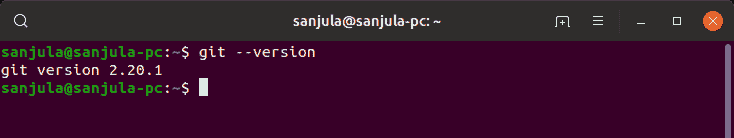

Figure-2: Git version** 

**如果返回了版本号，那么就意味着 git 已经成功安装在您的计算机上。**

### **设置配置值**

**现在我们需要设置全局配置变量，这非常重要，尤其是如果你和其他开发人员一起工作的话。例如，这样做的主要好处是更容易发现谁提交了某个代码块。**

```
`git config --global user.name “Sanjula Madurapperuma”`
```

```
`git config --global user.email “sanjula@mail.com”`
```

```
`git config --list`
```

### **帮助命令**

**您可能已经注意到， *config* 是本手册中经常使用的动词，动词也可以在 help 命令中用作前缀或后缀。我们可以使用上面的同一个例子(动词*配置*)来解释这些命令。**

```
`git help config`
```

```
`git config --help`
```

**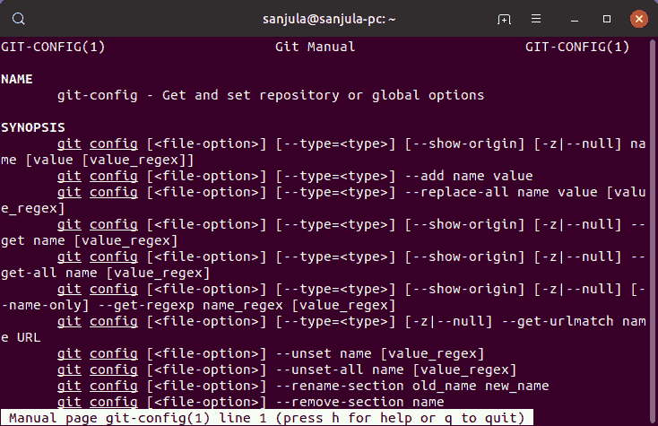

Figure-3: Help Command** 

**以上两个命令执行相同的操作。显示指定动词的手册页。这将有助于识别 git 更高级的功能。**

### **如何从现有代码初始化存储库**

**如果您有一个想要转换成 git 项目的本地存储库来开始跟踪它，那么我们可以从在项目目录中运行下面的命令开始。**

```
`git init`
```

**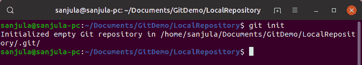

Figure-4: Git init** 

**搞定了。就像这样，您已经将项目转换成了本地 git 存储库。如果打开项目文件夹，您会看到一个名为。git 已经创建。**

### **第一次提交前要做什么**

**输入以下命令查看未跟踪的文件:**

```
`git status`
```

**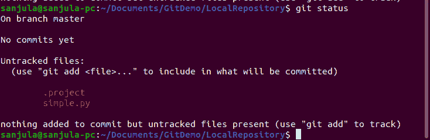

Figure-5: Git status** 

**如果存储库中有您不希望其他人看到的文件，例如包含个人首选项或 IDE 首选项的文件，请执行以下操作:**

```
`touch .gitignore`
```

**

Figure-6: Create .gitignore file** 

**要指定哪些文件不被添加到 git 存储库中，请打开一个文本编辑器并查看。gitignore 文件，可以像普通文本文件一样编辑。现在，我们可以在文件中输入以下内容，例如:**

```
`.project`
```

```
`*.java`
```

**也可以使用通配符。在这种情况下，它用于指定不添加所有以。知识库的 java 扩展。**

**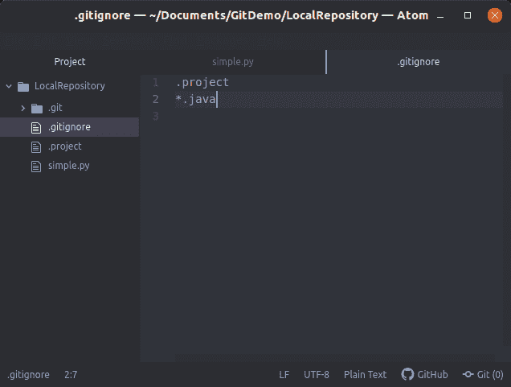

Figure-7: Editing in text editor** 

**现在再次运行 git status**

**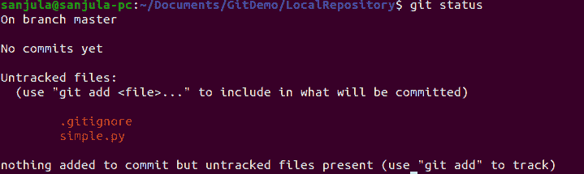

Figure-8: After updating .gitignore** 

**现在您可以看到我们在。gitignore 文件不再显示在未跟踪文件列表中。的。gitignore 文件应该提交到存储库中，以便在所有其他地方保持相同的排除。**

### **将文件添加到临时区域**

**我们一直在工作目录中。暂存区是我们组织所有被跟踪的文件的地方，这些文件必须在推送到 git 存储库之前提交。它是一个文件，存储下一次提交必须包含的内容。**

**如果您想要添加当前未跟踪的所有文件，并且您已经更改到临时区域，则使用以下命令:**

```
`git add -A`
```

**如果你想单独添加文件，那么我们可以在 git add 之后给出文件名。举个例子，**

```
`git add .gitignore`
```

**现在，如果您键入 git status，您将看到。gitignore 文件现在位于临时区域。**

**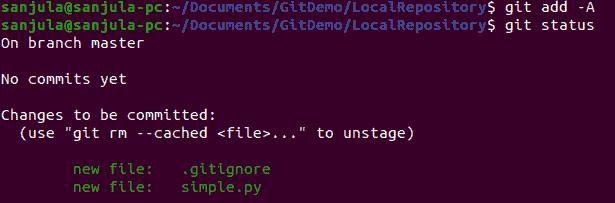

Figure-9: Staging area** 

### **从临时区域删除文件**

**要从临时区域单独删除文件，请键入以下内容(例如):**

```
`git reset simple.py`
```

**这将从临时区域中删除文件 simple.py。要查看这一变化，请再次键入 git status。**

**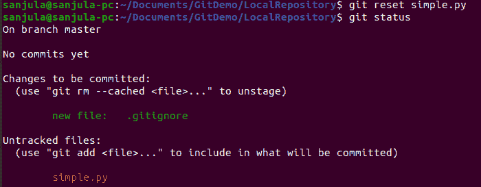

Figure-10: Removing file from staging area** 

**如果要从临时区域中删除所有文件，请运行以下命令:**

```
`git reset`
```

**现在，如果我们键入 git status，我们将看到所有文件都被更改为未跟踪的文件。**

**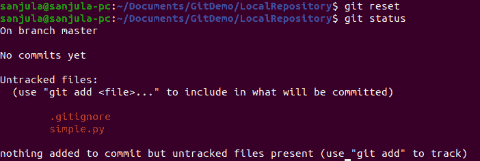

Figure-11: Reset all files** 

### **进行第一次提交**

**现在运行以下命令，将所有文件添加到要提交的临时区域。**

```
`git add -A`
```

**如果您愿意，可以运行 git status 来查看所有将要提交的文件。**

**要提交，请键入以下内容。**

```
`git commit -m “Initial Commit”`
```

**"-m "指定要传递的描述提交的消息。由于这是我们的第一次提交，我们称之为初始提交。**

**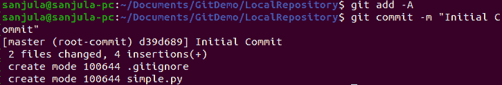

Figure-12: Initial Commit** 

**如您所见，文件已经成功提交。**

**如果您现在运行 git status，您会看到它说工作目录是干净的，因为我们已经提交了文件，并且从那以后没有修改过任何文件。**

**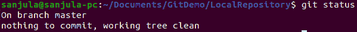

Figure-13: Working Tree after commit** 

**如果我们运行以下命令:**

```
`git log`
```

**然后，我们可以看到我们刚刚进行的提交，包括提交的哈希值。**

**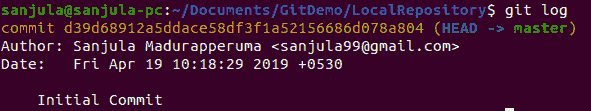

Figure-14: Commit hash number** 

**我们现在成功地用 git 跟踪了本地项目！**

### **克隆远程存储库**

**如果我们想用 git 跟踪一个现有的远程项目，那么我们必须键入以下格式的命令:**

```
`git clone <url> <where to clone>`
```

**举个例子，我将在[这个链接](https://github.com/sanjulamadurapperuma/GitDemoMedium.git)使用 git 存储库。**

**我将首先移动到我想要克隆项目的目录中，尽管您也可以如上所示指定这个目录。**

**转到上面给出的存储库链接，单击“克隆或下载”按钮，然后复制那里给出的链接。**

**然后输入:**

```
`git clone https://github.com/sanjulamadurapperuma/GitDemoMedium.git`
```

**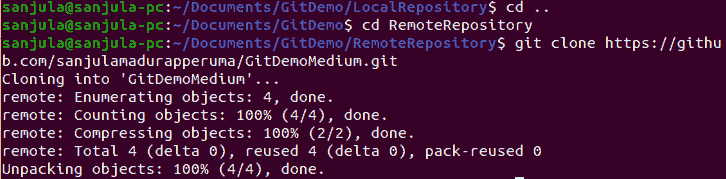

Figure-15: Cloning remote repository** 

**现在我们已经成功地克隆了存储库。**

**如果我们输入下面的命令，我们将看到现在本地目录中的所有文件。**

```
`ls -la`
```

**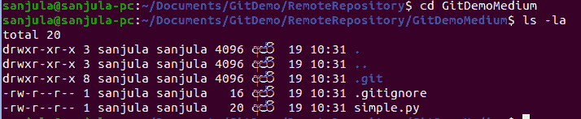

Figure-16: List all files in directory** 

### **查看有关远程存储库的信息**

**如果您键入以下命令:**

```
`git remote -v`
```

**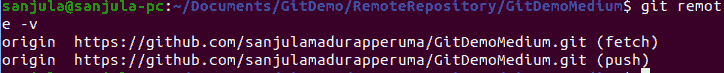

Figure-17: Git remote -v** 

**该命令将列出本地存储库获取外部提交并将您的提交推送到远程存储库的位置。**

**如果您要键入命令**

```
`git branch -a`
```

**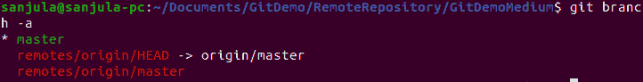

Figure-18: List all git branches** 

**这将列出存储库中本地和远程的所有分支。**

**为了演示如何更新远程存储库，我们将对我们克隆的存储库中的文件进行一些更改。**

**

Figure-19: Make changes to simple.py** 

**既然我们已经对代码进行了更改，下一步我们要做的就是将这些更改推送到远程存储库**

### **将更改推送到远程存储库**

**以下命令将显示对文件所做的所有更改。**

```
`git diff`
```

**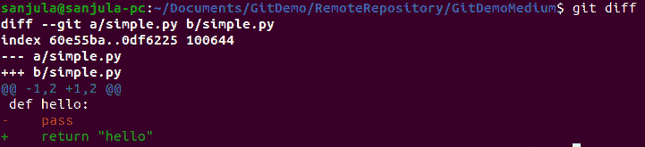

Figure-20: View changes to file** 

**如果我们再次进入 git 状态，我们可以看到更改已经被跟踪，simple.py 已经被修改。**

**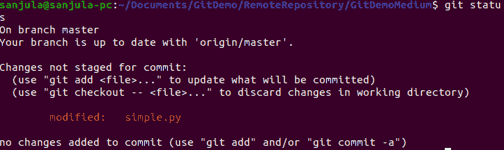

Figure-21: View modified files** 

**现在将它们添加到临时区域**

```
`git add -A`
```

**再次运行 git status**

**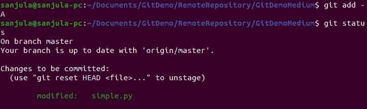

Figure-22: Add files to staging area** 

**现在我们可以看到 simple.py 已经准备好提交了。**

**然后输入带有消息的提交命令**

```
`git commit -m “Updated hello function”`
```

**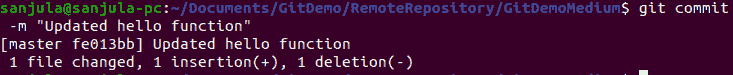

Figure-23: Commit message** 

**现在，我们必须将提交的变更推送到远程存储库，以便其他人可以访问它们。**

**因为常见的情况是有几个开发人员在一个项目上工作，所以我们必须在将我们的变更推送到远程存储库中之前，首先提取已经在远程存储库中完成的任何变更，以避免冲突。**

**运行以下命令:**

```
`git pull origin master`
```

**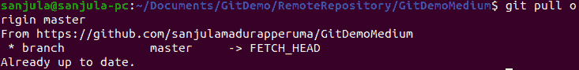

Figure-24: Pull changes from remote repository** 

**因为我们已经是最新的了，所以我们现在可以将我们的更改推送到远程存储库。**

**现在运行以下命令:**

```
`git push origin master`
```

**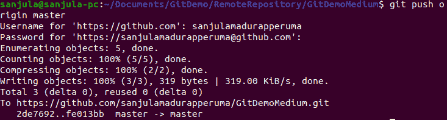

Figure-25: Push changes to remote repository** 

**我们已经成功地将我们的更改推送到远程存储库的主分支！**

### **为功能或问题创建分支**

**到目前为止，我们一直致力于我们的主分支，但是这不是你作为开发人员应该在 git 中工作的方式，因为主分支应该是你正在工作的项目的稳定版本。所以对于每一个特性或问题，通常的标准是创建你自己的分支，然后从那个分支开始工作。**

**创建名为 simple-greeting 的新分支的命令如下:**

```
`git branch simple-greeting`
```

**如果你跑了**

```
`git branch`
```

**然后，您将看到存储库中的所有分支，并且您所在的当前分支在左侧以星号突出显示。**

**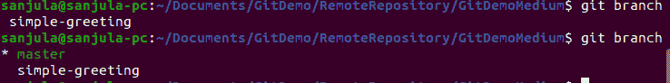

Figure-26: git branch** 

**如果要切换到刚刚创建的分支，请键入以下内容:**

```
`git checkout simple-greeting`
```

**现在，如果您键入 git branch，您将看到您现在位于简单问候分支。**

**现在，我们必须对项目进行更改。我们将切换到项目并定义问候功能。**

**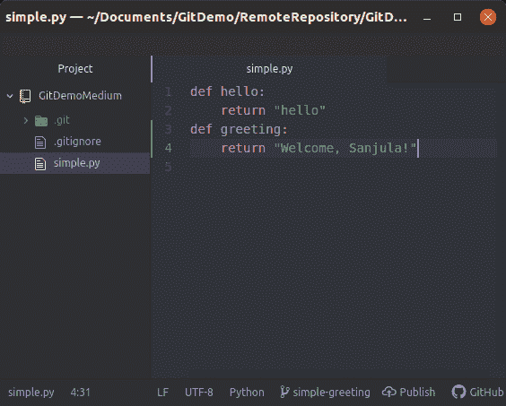

Figure-27: Define the greeting function** 

**现在，我们将重复提交这些更改的过程:**

```
`git status`
```

**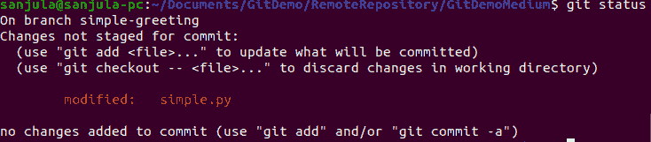

Figure-28: See changes that are not staged** 

```
`git add -A`
```

```
`git commit -m “Greeting Function”`
```

**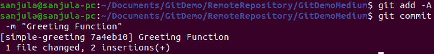

Figure-29: Commit message for Greeting function** 

**此提交将仅更改本地分支 simple-greeting 中的文件，对本地主分支或远程存储库没有任何影响。**

### **提交后将分支推送到远程存储库**

**输入以下命令:**

```
`git push -u origin simple-greeting`
```

**其中 origin 是存储库的名称，simple-greeting 是我们想要推送的分支。**

**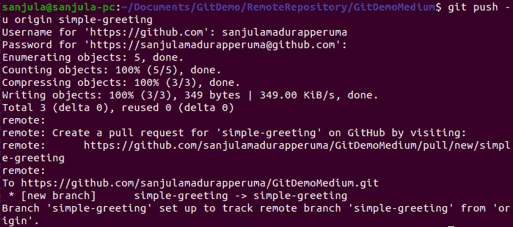

Figure-30: Push branch to remote repository** 

**现在，我们已经将简单问候分支推到了远程存储库。如果您键入:**

```
`git branch -a`
```

**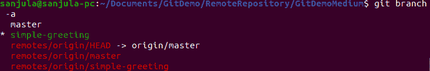

Figure-31: simple-greeting Branch in remote repository** 

**我们可以看到，在我们的远程存储库中，现在有了简单问候分支。为什么我们需要将分支推到远程存储库？因为在一些公司，他们在那里进行单元测试和其他各种测试，以确保代码在与主分支合并之前运行良好。**

**假设所有的测试都进行得很好(我们不会在这里详述)，我们现在可以将分支 simple-greeting 与主分支合并。**

### **合并分支**

**首先，我们必须签入当地的主分支机构**

```
`git checkout master`
```

**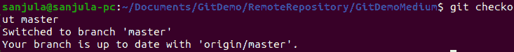

Figure-32: Checkout to master branch** 

**提取远程主分支中的所有更改:**

```
`git pull origin master`
```

**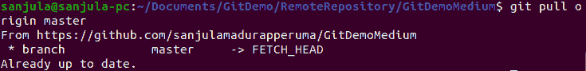

Figure-33: Pull changes from remote repository** 

**我们现在将看到目前为止已经合并的分支:**

```
`git branch —-merged`
```

**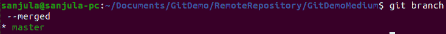

Figure-34: Display merged branches** 

**简单问候分支不会出现在这里，因为我们还没有合并它。**

**要将简单问候语与主问候语合并，请输入:**

```
`git merge simple-greeting`
```

**(请注意，我们现在在主分支机构中)**

**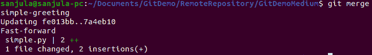

Figure-35: Merge simple-greeting branch** 

**现在它已经被合并了，我们可以将变更推送到远程存储库主分支。**

```
`git push origin master`
```

**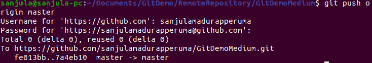

Figure-36: Push to remote master branch** 

**现在，变更已经被推送到远程存储库中的主分支。**

### **删除分支**

**既然现在已经部署了这个特性，我们可以删除简单问候分支。为了仔细检查上一节中完成的合并，我们可以运行:**

```
`git branch --merged`
```

**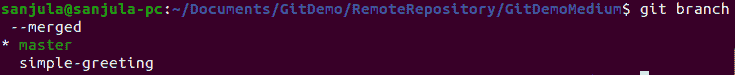

Figure-37: Display merged branches** 

**如果 simple-greeting 出现在这里，那么这意味着我们已经合并了所有的更改，现在可以丢弃这个分支了。**

```
`git branch -d simple-greeting`
```

**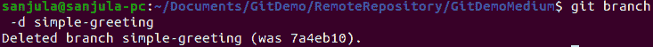

Figure-38: Delete local branch simple-greeting** 

**现在该分支已被本地删除。**

**但是因为我们将分支推到了远程存储库中，所以它仍然在远程存储库中。这可以通过运行以下命令来查看:**

```
`git branch -a`
```

**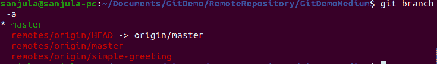

Figure-39: Display all branches** 

**要从远程存储库中删除分支，请输入:**

```
`git push origin --delete simple-greeting`
```

**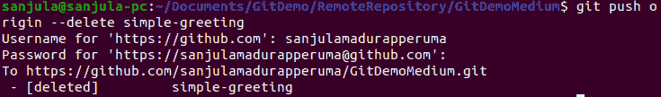

Figure-40: Delete remote branch simple-greeting** 

**如果我们重新运行**

```
`git branch -a`
```

**

Figure-41: Display all branches** 

**我们可以看到该分支现在也已经从远程存储库中删除了。**

**恭喜你！！！您现在是基本但重要的 Git 命令的大师了！**

**为了参考或使用本教程，这里是公开的 GitHub 库[链接](https://github.com/sanjulamadurapperuma/GitDemoMedium)**

**与此同时，如果你喜欢这篇文章，请给它尽可能多的掌声，如果你有任何疑问，请在下面评论。另外，请在 LinkedIn 查看我的个人资料，并在 Twitter 上关注我！**